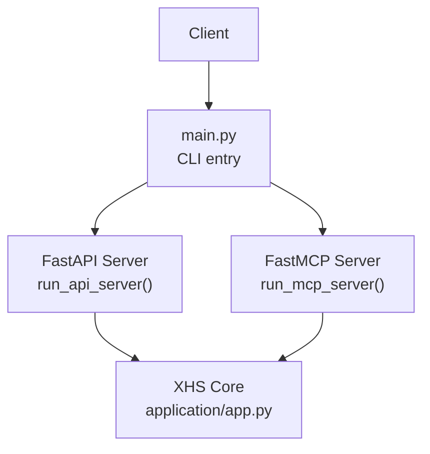
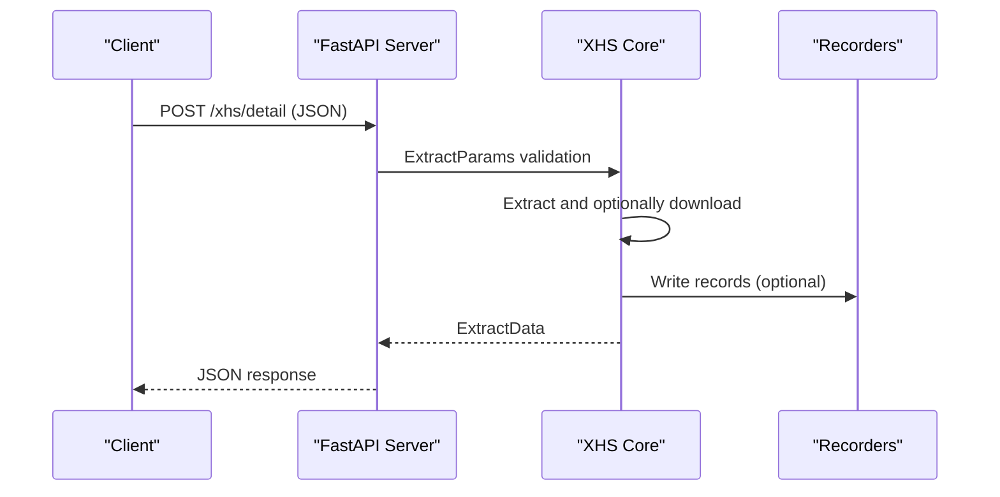
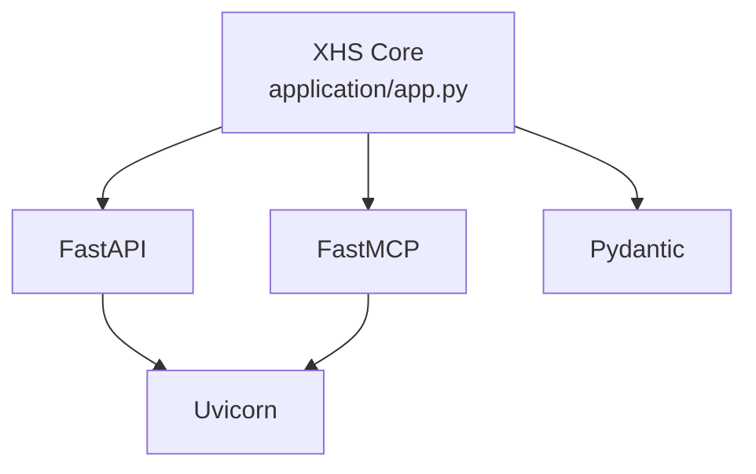

# API Reference

<cite>
**Referenced Files in This Document**
- [README.md](file://README.md)
- [README_EN.md](file://README_EN.md)
- [main.py](file://main.py)
- [source/application/app.py](file://source/application/app.py)
- [source/module/model.py](file://source/module/model.py)
- [source/module/recorder.py](file://source/module/recorder.py)
- [source/module/script.py](file://source/module/script.py)
- [example.py](file://example.py)
</cite>

## Table of Contents
1. [Introduction](#introduction)
2. [Project Structure](#project-structure)
3. [Core Components](#core-components)
4. [Architecture Overview](#architecture-overview)
5. [Detailed Component Analysis](#detailed-component-analysis)
6. [Dependency Analysis](#dependency-analysis)
7. [Performance Considerations](#performance-considerations)
8. [Troubleshooting Guide](#troubleshooting-guide)
9. [Conclusion](#conclusion)
10. [Appendices](#appendices)

## Introduction
This document provides a comprehensive API reference for XHS-Downloader’s public interfaces and data models. It covers:
- RESTful API endpoints (HTTP methods, URL patterns, request/response schemas, and parameter specifications)
- MCP protocol integration (transport, URL pattern, and usage guidance)
- Data models (ExtractData response model, ExtractParams request parameters)
- Database record structures (download records, metadata storage, mapping)
- Error handling patterns and status messages
- Parameter reference with types, validation rules, and defaults
- Examples for common API usage patterns and integration scenarios
- Version compatibility, deprecation notices, and migration guidance
- Rate limiting, authentication, and security considerations
- Performance benchmarks and optimization recommendations for high-volume usage

## Project Structure
XHS-Downloader exposes two primary server modes:
- API mode: a FastAPI-based HTTP service
- MCP mode: a FastMCP-based MCP server

Entry points and runtime modes are controlled via the main entry script and command-line arguments.

**Diagram sources**
- [main.py:17-42](file://main.py#L17-L42)
- [source/application/app.py:685-704](file://source/application/app.py#L685-L704)

**Section sources**
- [main.py:45-59](file://main.py#L45-L59)
- [README.md:142-236](file://README.md#L142-L236)
- [README_EN.md:141-240](file://README_EN.md#L141-L240)

## Core Components
- API endpoint: POST /xhs/detail
- Request body: ExtractParams (Pydantic model)
- Response body: ExtractData (Pydantic model)
- MCP transport: streamable-http (default), with URL pattern http://127.0.0.1:5556/mcp/

Key behaviors:
- The API server runs on 0.0.0.0:5556 by default and exposes interactive docs at /docs and /redoc.
- The MCP server exposes tool definitions and integrates with MCP clients via the FastMCP framework.

**Section sources**
- [README.md:146-215](file://README.md#L146-L215)
- [README_EN.md:147-219](file://README_EN.md#L147-L219)
- [source/module/model.py:4-17](file://source/module/model.py#L4-L17)
- [source/application/app.py:685-704](file://source/application/app.py#L685-L704)

## Architecture Overview
The API and MCP servers are thin wrappers around the XHS core. Requests are validated against Pydantic models and routed to the extraction pipeline.

**Diagram sources**
- [source/module/model.py:4-17](file://source/module/model.py#L4-L17)
- [source/module/recorder.py:13-68](file://source/module/recorder.py#L13-L68)
- [source/application/app.py:685-704](file://source/application/app.py#L685-L704)

## Detailed Component Analysis

### REST API: /xhs/detail
- Method: POST
- Content-Type: application/json
- Base URL: http://127.0.0.1:5556/xhs/detail
- Interactive docs: http://127.0.0.1:5556/docs and http://127.0.0.1:5556/redoc

Request parameters (ExtractParams):
- url: string, required
- download: boolean, optional, default false
- index: array of integers/strings, optional, default null
- cookie: string, optional, default from settings
- proxy: string, optional, default from settings
- skip: boolean, optional, default false

Response model (ExtractData):
- message: string
- params: ExtractParams
- data: object or null

Notes:
- The API server is configured with host 0.0.0.0, port 5556, and info log level by default.
- The server uses FastAPI and FastMCP internally; routes are registered via setup_routes.

Example usage:
- See example.py for a client-side example invoking the endpoint.

**Section sources**
- [README.md:146-215](file://README.md#L146-L215)
- [README_EN.md:147-219](file://README_EN.md#L147-L219)
- [source/module/model.py:4-17](file://source/module/model.py#L4-L17)
- [example.py:77-91](file://example.py#L77-L91)
- [source/application/app.py:685-704](file://source/application/app.py#L685-L704)

### MCP Protocol Integration
- Transport: streamable-http (default)
- URL: http://127.0.0.1:5556/mcp/
- The MCP server is powered by FastMCP and exposes tool definitions for external clients.

Usage guidance:
- Configure your MCP client to target the MCP URL above.
- Use the MCP configuration example shown in the project documentation.

**Section sources**
- [README.md:216-236](file://README.md#L216-L236)
- [README_EN.md:220-240](file://README_EN.md#L220-L240)
- [main.py:30-42](file://main.py#L30-L42)

### Data Models

#### ExtractParams (Request)
- url: string, required
- download: boolean, optional, default false
- index: list[str | int], optional, default null
- cookie: string, optional, default from settings
- proxy: string, optional, default from settings
- skip: boolean, optional, default false

Validation:
- Pydantic model enforces field types and presence of required fields.

**Section sources**
- [source/module/model.py:4-11](file://source/module/model.py#L4-L11)

#### ExtractData (Response)
- message: string
- params: ExtractParams
- data: dict | None

Behavior:
- On successful extraction, data contains the extracted note metadata and media URLs.
- On failure, data may be null and message describes the error.

**Section sources**
- [source/module/model.py:13-17](file://source/module/model.py#L13-L17)

### Database Record Structures

#### Download Record (ExploreID.db)
- Purpose: Track IDs of downloaded notes to avoid redundant downloads.
- Schema: explore_id (table) with primary key ID (text).
- Operations: select, add, delete, list all.

**Section sources**
- [source/module/recorder.py:13-68](file://source/module/recorder.py#L13-L68)
- [README.md:527-529](file://README.md#L527-L529)

#### Metadata Storage (ExploreData.db)
- Purpose: Persist note metadata (title, description, tags, counts, author info, links, media URLs).
- Schema: explore_data (table) with columns for timestamps, IDs, types, counts, author info, links, and media URLs.
- Operations: add (replace/insert), select, delete, list all.

**Section sources**
- [source/module/recorder.py:81-144](file://source/module/recorder.py#L81-L144)
- [README.md:241-242](file://README.md#L241-L242)

#### Author Alias Mapping (MappingData.db)
- Purpose: Store author ID to alias mapping for consistent naming.
- Schema: mapping_data (table) with ID (primary key) and NAME (text).
- Operations: select, add, delete, list all.

**Section sources**
- [source/module/recorder.py:146-192](file://source/module/recorder.py#L146-L192)

### Error Handling and Status Messages
- Validation errors: Pydantic validation failures produce structured error responses.
- Runtime errors: The API returns a message field indicating failure conditions; data may be null.
- Graceful shutdown: Servers can be stopped with Ctrl+C.

Note: Specific HTTP status codes are not explicitly defined in the code; FastAPI defaults apply.

**Section sources**
- [source/module/model.py:4-17](file://source/module/model.py#L4-L17)
- [README.md:144-145](file://README.md#L144-L145)

### Parameter Reference
Complete parameter reference derived from ExtractParams and configuration defaults:

- url: string, required
- download: boolean, optional, default false
- index: list[str | int], optional, default null
- cookie: string, optional, default from settings
- proxy: string, optional, default from settings
- skip: boolean, optional, default false

Defaults and behavior:
- cookie and proxy default to values from the settings file when not provided.
- skip controls whether records are considered when deciding whether to return data.

**Section sources**
- [source/module/model.py:4-11](file://source/module/model.py#L4-L11)
- [README.md:160-195](file://README.md#L160-L195)
- [README_EN.md:161-199](file://README_EN.md#L161-L199)

### Code Examples
Common usage patterns:
- API invocation via HTTP client (see example.py)
- Direct library usage via XHS core (see example.py)

Examples are provided as code paths rather than inline code.

**Section sources**
- [example.py:77-91](file://example.py#L77-L91)
- [example.py:9-74](file://example.py#L9-L74)

### Version Compatibility, Deprecation, and Migration
- Version information is exposed via the API server (title, version).
- No explicit deprecations were identified in the referenced files.
- Migration guidance: Prefer using the documented parameters and models; keep client libraries aligned with the server’s Pydantic models.

**Section sources**
- [source/application/app.py:691-695](file://source/application/app.py#L691-L695)

### Rate Limiting, Authentication, and Security
- Rate limiting: The project mentions an internal request delay mechanism to avoid overloading upstream servers.
- Authentication: Cookie-based access can improve quality; optional per configuration.
- Security: Expose the API server only on trusted networks; consider firewall rules and reverse proxies for TLS termination.

**Section sources**
- [README.md:243](file://README.md#L243)
- [README.md:79-79](file://README.md#L79-L79)

### Performance Benchmarks and Optimization
- Chunk size: configurable via settings (default 2 MB).
- Timeout and retries: configurable via settings.
- Recommendations:
  - Tune chunk size for network throughput.
  - Use appropriate timeouts and retry policies for unstable networks.
  - Batch requests thoughtfully and respect server-side delays.

**Section sources**
- [README.md:421-422](file://README.md#L421-L422)
- [README.md:425-428](file://README.md#L425-L428)

## Dependency Analysis
External dependencies relevant to APIs and MCP:
- FastAPI for REST API
- FastMCP for MCP protocol
- Uvicorn for ASGI server hosting
- Pydantic for request/response validation

**Diagram sources**
- [source/application/app.py:16-24](file://source/application/app.py#L16-L24)
- [main.py:17-42](file://main.py#L17-L42)

**Section sources**
- [source/application/app.py:16-24](file://source/application/app.py#L16-L24)
- [main.py:17-42](file://main.py#L17-L42)

## Performance Considerations
- Network throughput: Adjust chunk size and concurrency based on network conditions.
- Retry/backoff: Configure max_retry and timeout to balance reliability and latency.
- Request pacing: Respect internal delays to avoid upstream throttling.

[No sources needed since this section provides general guidance]

## Troubleshooting Guide
Common issues and remedies:
- Validation errors: Ensure request JSON conforms to ExtractParams.
- Missing cookie/proxy: Provide cookie or proxy in request or configure defaults.
- Database connectivity: Verify database files exist and are writable.
- Server startup: Confirm port 5556 is free and accessible.

**Section sources**
- [source/module/model.py:4-17](file://source/module/model.py#L4-L17)
- [source/module/recorder.py:13-68](file://source/module/recorder.py#L13-L68)
- [README.md:144-145](file://README.md#L144-L145)

## Conclusion
XHS-Downloader exposes a concise REST API and MCP server for extracting note metadata and optionally downloading media. The API is validated by Pydantic models, and the MCP server integrates with external clients via FastMCP. Robust configuration options and database-backed persistence support reliable operation at scale.

[No sources needed since this section summarizes without analyzing specific files]

## Appendices

### API Definition Summary
- Endpoint: POST /xhs/detail
- Request body: ExtractParams
- Response body: ExtractData
- Interactive docs: /docs, /redoc

**Section sources**
- [README.md:146-215](file://README.md#L146-L215)
- [README_EN.md:147-219](file://README_EN.md#L147-L219)

### MCP Configuration Summary
- Transport: streamable-http
- URL: http://127.0.0.1:5556/mcp/

**Section sources**
- [README.md:223-236](file://README.md#L223-L236)
- [README_EN.md:227-240](file://README_EN.md#L227-L240)