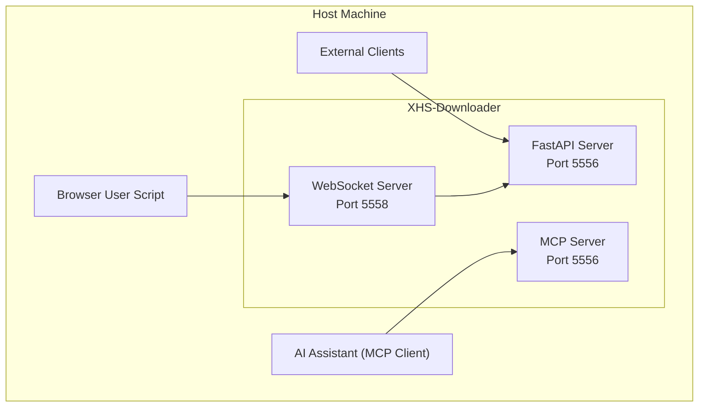
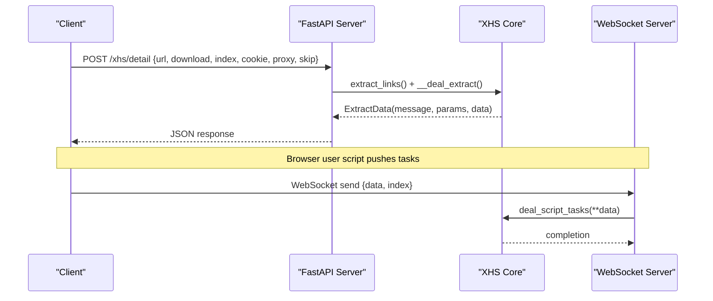
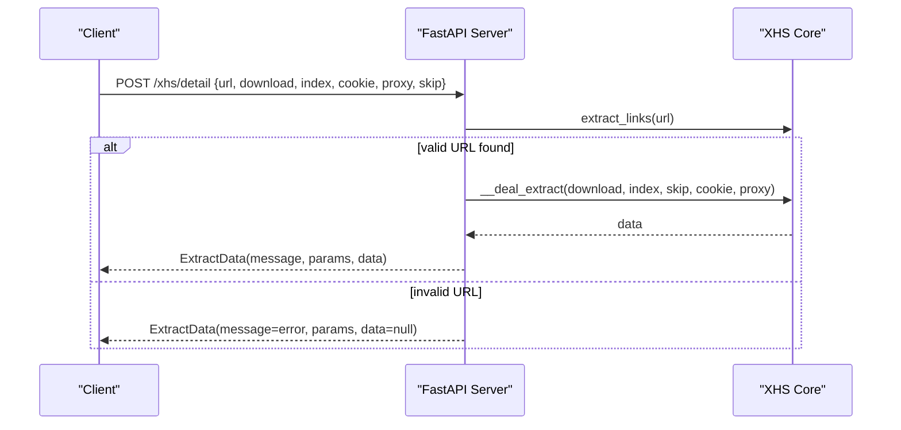
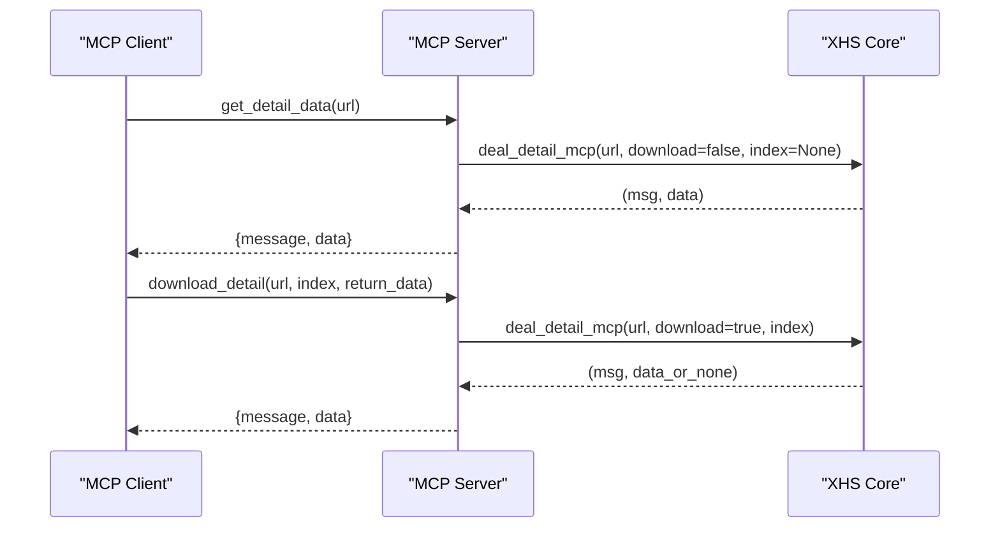
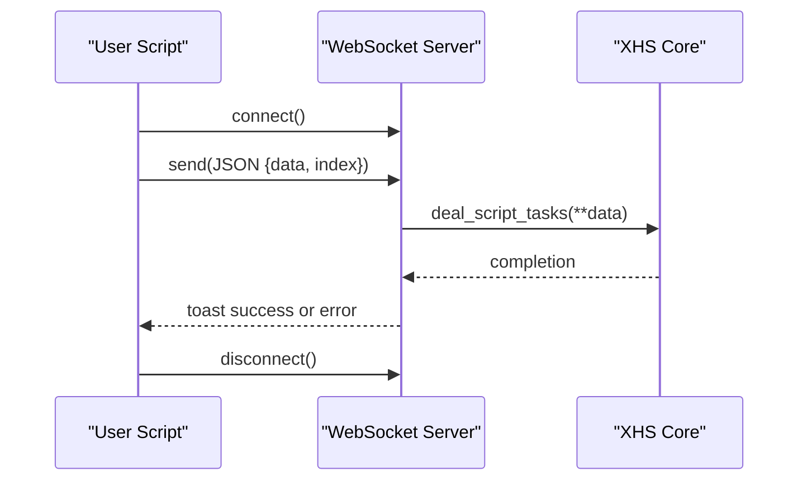
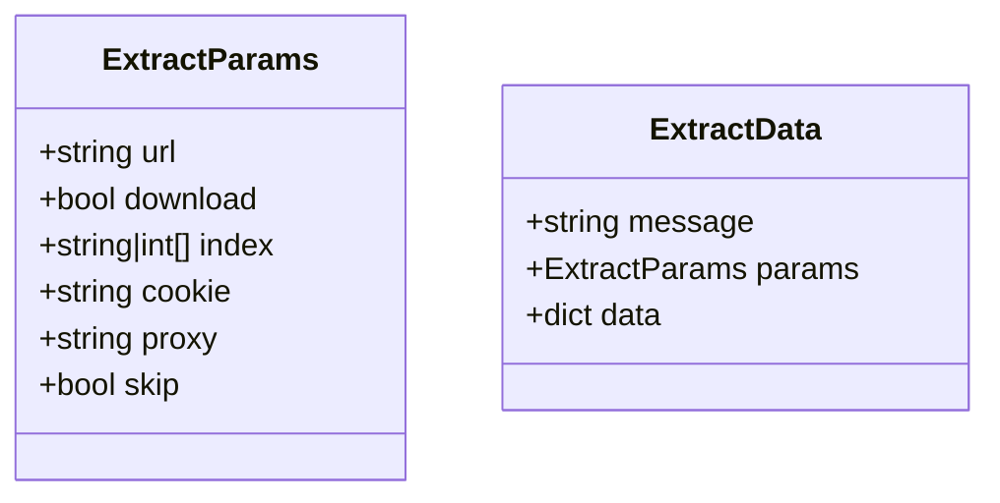
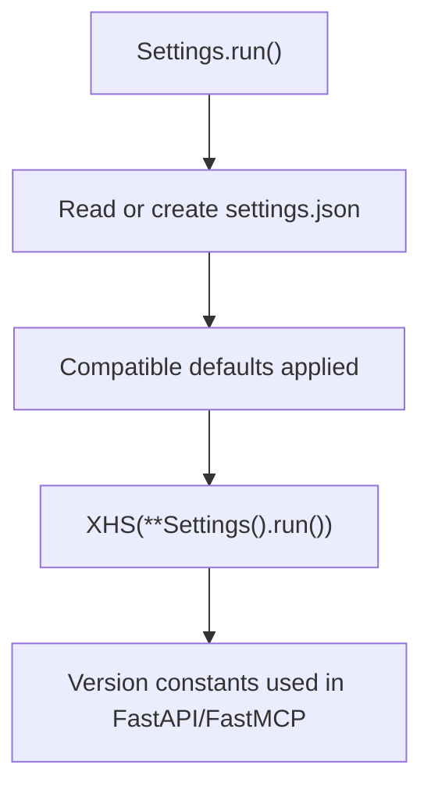
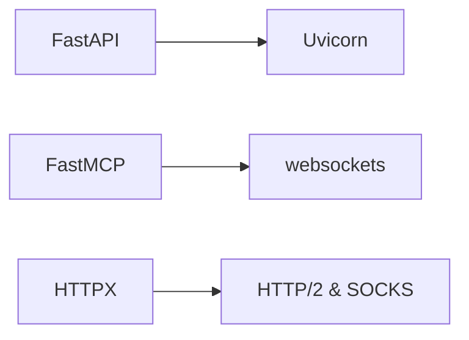

# API and Integration

<cite>
**Referenced Files in This Document**
- [main.py](file://main.py)
- [app.py](file://source/application/app.py)
- [model.py](file://source/module/model.py)
- [settings.py](file://source/module/settings.py)
- [script.py](file://source/module/script.py)
- [static.py](file://source/module/static.py)
- [XHS-Downloader.js](file://static/XHS-Downloader.js)
- [example.py](file://example.py)
- [requirements.txt](file://requirements.txt)
- [README_EN.md](file://README_EN.md)
</cite>

## Table of Contents
1. [Introduction](#introduction)
2. [Project Structure](#project-structure)
3. [Core Components](#core-components)
4. [Architecture Overview](#architecture-overview)
5. [Detailed Component Analysis](#detailed-component-analysis)
6. [Dependency Analysis](#dependency-analysis)
7. [Performance Considerations](#performance-considerations)
8. [Troubleshooting Guide](#troubleshooting-guide)
9. [Conclusion](#conclusion)
10. [Appendices](#appendices)

## Introduction
This document describes the API and integration capabilities of XHS-Downloader with a focus on:
- RESTful API endpoints powered by FastAPI
- Model Context Protocol (MCP) integration for AI assistants
- Browser user script integration for automated content extraction and task pushing
- WebSocket connections for real-time interaction
- Practical examples, security considerations, rate limiting, versioning, and extension guidance

The goal is to help developers integrate XHS-Downloader into external applications and automate workflows around RedNote (Xiaohongshu) content extraction and download.

## Project Structure
At runtime, XHS-Downloader exposes three primary operational modes:
- Application mode (CLI/TUI)
- API server mode (FastAPI)
- MCP server mode (Model Context Protocol)

The FastAPI server exposes a single endpoint for retrieving note metadata and optionally triggering downloads. The MCP server exposes two tools for data retrieval and file download. A WebSocket server enables the browser user script to push download tasks to the main application.

**Diagram sources**
- [main.py:17-42](file://main.py#L17-L42)
- [app.py:685-704](file://source/application/app.py#L685-L704)
- [app.py:758-917](file://source/application/app.py#L758-L917)
- [script.py:10-47](file://source/module/script.py#L10-L47)

**Section sources**
- [main.py:12-60](file://main.py#L12-L60)
- [README_EN.md:141-240](file://README_EN.md#L141-L240)

## Core Components
- FastAPI server: Provides a single endpoint to fetch note metadata and optionally download files.
- MCP server: Exposes two tools for retrieving note data and downloading files.
- WebSocket server: Accepts tasks from the browser user script and forwards them to the core downloader.
- Data models: Pydantic models define request/response schemas for the API.
- Settings: Centralized configuration for runtime behavior.

Key implementation references:
- FastAPI route registration and endpoint definition
- MCP tool definitions and annotations
- WebSocket server initialization and handler
- Request/response models
- Settings and versioning constants

**Section sources**
- [app.py:685-756](file://source/application/app.py#L685-L756)
- [app.py:758-917](file://source/application/app.py#L758-L917)
- [script.py:10-47](file://source/module/script.py#L10-L47)
- [model.py:4-17](file://source/module/model.py#L4-L17)
- [settings.py:10-124](file://source/module/settings.py#L10-L124)
- [static.py:3-11](file://source/module/static.py#L3-L11)

## Architecture Overview
The system integrates three complementary APIs:
- REST API: Single endpoint for data retrieval and optional download
- MCP: AI assistant protocol with two tools
- WebSocket: Real-time task forwarding from browser user script

**Diagram sources**
- [app.py:719-756](file://source/application/app.py#L719-L756)
- [app.py:974-980](file://source/application/app.py#L974-L980)
- [script.py:22-26](file://source/module/script.py#L22-L26)

## Detailed Component Analysis

### FastAPI REST Endpoint
- Endpoint: POST /xhs/detail
- Purpose: Retrieve note metadata and optionally download files
- Request body: ExtractParams (Pydantic model)
- Response: ExtractData (Pydantic model)
- Behavior:
  - Validates and extracts a single note URL
  - Optionally downloads files and returns structured data
  - Skips records based on configuration

**Diagram sources**
- [app.py:719-756](file://source/application/app.py#L719-L756)
- [model.py:4-17](file://source/module/model.py#L4-L17)

**Section sources**
- [app.py:719-756](file://source/application/app.py#L719-L756)
- [model.py:4-17](file://source/module/model.py#L4-L17)
- [README_EN.md:148-219](file://README_EN.md#L148-L219)

### MCP Integration (Model Context Protocol)
- Transport: Streamable HTTP (default)
- Tools:
  - get_detail_data(url): Retrieve note info without downloading
  - download_detail(url, index=None, return_data=False): Download files, optionally return data
- Annotations: Idempotent, open world hints, tags for discoverability
- Versioning: Exposed via FastMCP with project version

**Diagram sources**
- [app.py:758-917](file://source/application/app.py#L758-L917)

**Section sources**
- [app.py:758-917](file://source/application/app.py#L758-L917)
- [README_EN.md:220-240](file://README_EN.md#L220-L240)

### Browser User Script Integration and WebSocket
- User script:
  - Detects note pages and extracts media URLs
  - Can download locally or push tasks to the WebSocket server
  - Settings include server URL, toggle, and image format
- WebSocket server:
  - Listens on ws://127.0.0.1:5558 by default
  - Receives JSON messages and forwards to core for processing
- Real-time events:
  - Connection lifecycle (open/close/error)
  - Task sending with success/error notifications

**Diagram sources**
- [XHS-Downloader.js:2420-2481](file://static/XHS-Downloader.js#L2420-L2481)
- [script.py:22-26](file://source/module/script.py#L22-L26)
- [app.py:974-980](file://source/application/app.py#L974-L980)

**Section sources**
- [XHS-Downloader.js:2420-2481](file://static/XHS-Downloader.js#L2420-L2481)
- [script.py:10-47](file://source/module/script.py#L10-L47)
- [app.py:942-999](file://source/application/app.py#L942-L999)

### Data Models and Schemas
- ExtractParams: Defines request payload shape
- ExtractData: Defines response envelope

**Diagram sources**
- [model.py:4-17](file://source/module/model.py#L4-L17)

**Section sources**
- [model.py:4-17](file://source/module/model.py#L4-L17)

### Settings and Versioning
- Settings: Centralized configuration with defaults and compatibility checks
- Versioning: Major.Minor.Beta/Stable derived from static constants

**Diagram sources**
- [settings.py:52-124](file://source/module/settings.py#L52-L124)
- [static.py:3-11](file://source/module/static.py#L3-L11)

**Section sources**
- [settings.py:10-124](file://source/module/settings.py#L10-L124)
- [static.py:3-11](file://source/module/static.py#L3-L11)

## Dependency Analysis
External dependencies relevant to integrations:
- FastAPI and Uvicorn for REST API
- FastMCP for MCP server
- Websockets for WebSocket server
- HTTPX for HTTP/2 and SOCKS support

**Diagram sources**
- [requirements.txt:11-28](file://requirements.txt#L11-L28)

**Section sources**
- [requirements.txt:11-28](file://requirements.txt#L11-L28)

## Performance Considerations
- Built-in request delays: The project includes a request delay mechanism to avoid high-frequency requests that could impact upstream servers.
- Concurrency limits: File signature detection defines a fixed worker limit, indicating conservative concurrency defaults.
- Chunk size and retries: Tunable via settings for balancing throughput and reliability.

Practical guidance:
- Batch requests judiciously; leverage skip logic to avoid redundant processing.
- Configure chunk size and retries per environment constraints.
- Use MCP for AI-assisted orchestration to reduce repeated polling.

**Section sources**
- [README_EN.md:247](file://README_EN.md#L247)
- [static.py:69](file://source/module/static.py#L69)

## Troubleshooting Guide
Common issues and remedies:
- API documentation not available:
  - Ensure the API server is running and navigate to /docs or /redoc.
- WebSocket connection errors:
  - Verify the WebSocket server is running and reachable at ws://127.0.0.1:5558.
  - Confirm the user script settings and toggles.
- MCP tool invocation failures:
  - Check MCP server logs and transport configuration.
- Rate limiting and timeouts:
  - Adjust timeout and retry settings in the configuration file.
  - Respect the built-in request delay behavior.

Operational references:
- API server startup and endpoints
- MCP server startup and tool definitions
- WebSocket server lifecycle and handlers
- Settings defaults and compatibility

**Section sources**
- [app.py:685-704](file://source/application/app.py#L685-L704)
- [app.py:758-917](file://source/application/app.py#L758-L917)
- [script.py:28-40](file://source/module/script.py#L28-L40)
- [settings.py:52-124](file://source/module/settings.py#L52-L124)

## Conclusion
XHS-Downloader provides a cohesive integration surface:
- A simple REST API for quick automation
- An MCP server for AI-assisted workflows
- A WebSocket bridge for browser-driven task submission

These components, combined with robust settings and versioning, enable flexible deployment and extension for diverse client applications.

## Appendices

### API Reference: POST /xhs/detail
- Method: POST
- Path: /xhs/detail
- Content-Type: application/json
- Request body: ExtractParams
- Response: ExtractData

Parameters:
- url: str (required)
- download: bool (optional)
- index: list[int] | null (optional)
- cookie: str (optional)
- proxy: str (optional)
- skip: bool (optional)

Example usage:
- See example.py for client-side posting and response handling.

**Section sources**
- [app.py:719-756](file://source/application/app.py#L719-L756)
- [model.py:4-17](file://source/module/model.py#L4-L17)
- [README_EN.md:148-219](file://README_EN.md#L148-L219)
- [example.py:77-91](file://example.py#L77-L91)

### MCP Tools
- get_detail_data(url: str) -> { message: str, data: dict }
- download_detail(url: str, index: list[str|int]|None, return_data: bool) -> { message: str, data: dict|None }

Transport: Streamable HTTP (default), MCP URL: http://127.0.0.1:5556/mcp/

**Section sources**
- [app.py:796-917](file://source/application/app.py#L796-L917)
- [README_EN.md:226-240](file://README_EN.md#L226-L240)

### WebSocket Integration
- Server: ws://127.0.0.1:5558
- Message format: JSON containing note data and optional index selection
- User script settings: toggle, URL, and image format preferences

**Section sources**
- [script.py:10-47](file://source/module/script.py#L10-L47)
- [XHS-Downloader.js:2420-2481](file://static/XHS-Downloader.js#L2420-L2481)

### Security Considerations
- Authentication: No authentication is implemented for the REST or MCP endpoints. Deploy behind a reverse proxy or firewall as appropriate.
- CORS: Not configured; restrict exposure to trusted networks.
- Rate limiting: Built-in request delays mitigate excessive load; tune settings accordingly.
- Proxies and cookies: Configure proxies and cookies thoughtfully; ensure compliance with applicable policies.

**Section sources**
- [README_EN.md:247](file://README_EN.md#L247)
- [settings.py:10-124](file://source/module/settings.py#L10-L124)

### Versioning
- Version string: Major.Minor.Beta/Stable
- Exposed in FastAPI and FastMCP configurations

**Section sources**
- [static.py:3-11](file://source/module/static.py#L3-L11)
- [app.py:691-694](file://source/application/app.py#L691-L694)
- [app.py:765-766](file://source/application/app.py#L765-L766)

### Extending the API
- Add new routes to the FastAPI app instance in the XHS class
- Define Pydantic models for request/response schemas
- Integrate with the core extraction/download pipeline
- Keep endpoints idempotent where feasible

Guidance references:
- Route registration pattern
- Data models location
- Core extraction pipeline

**Section sources**
- [app.py:706-756](file://source/application/app.py#L706-L756)
- [model.py:4-17](file://source/module/model.py#L4-L17)
- [app.py:268-506](file://source/application/app.py#L268-L506)

### Practical Examples
- Client usage: example.py demonstrates posting to the API endpoint
- MCP invocation: Refer to MCP screenshots and instructions in the English README

**Section sources**
- [example.py:77-91](file://example.py#L77-L91)
- [README_EN.md:226-240](file://README_EN.md#L226-L240)