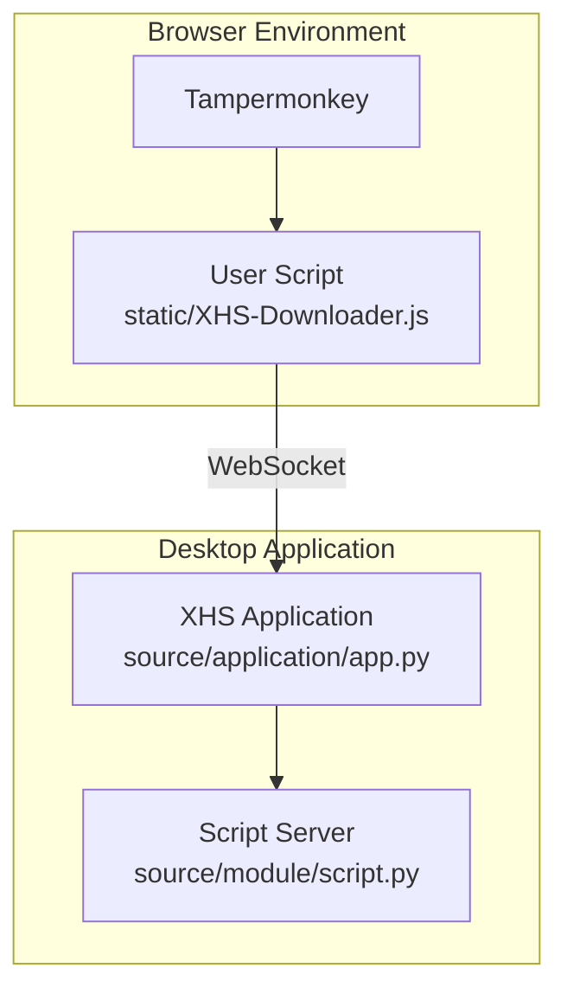
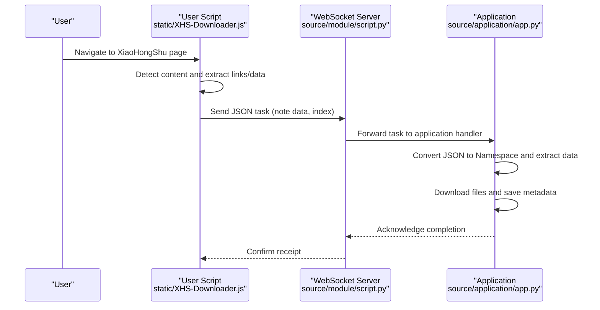
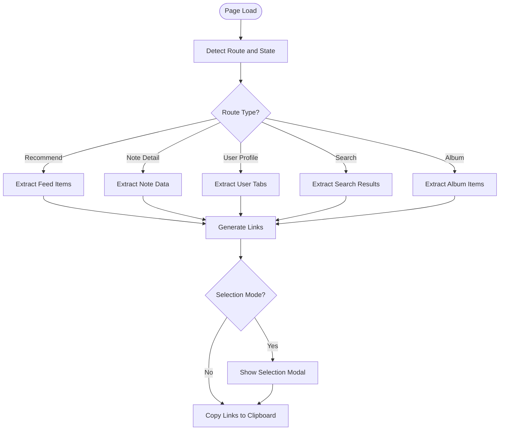
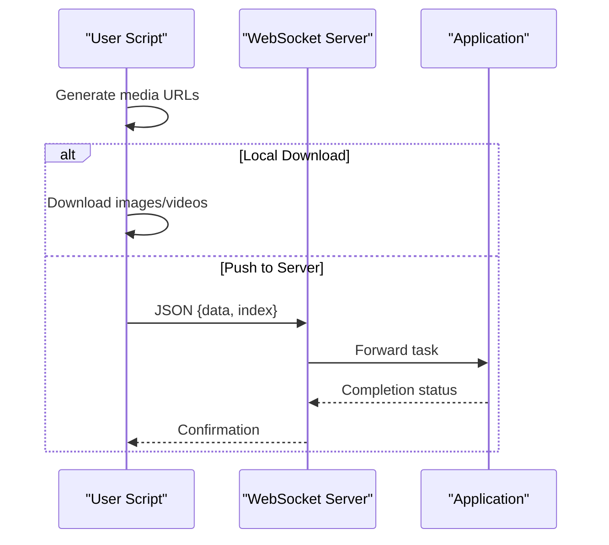
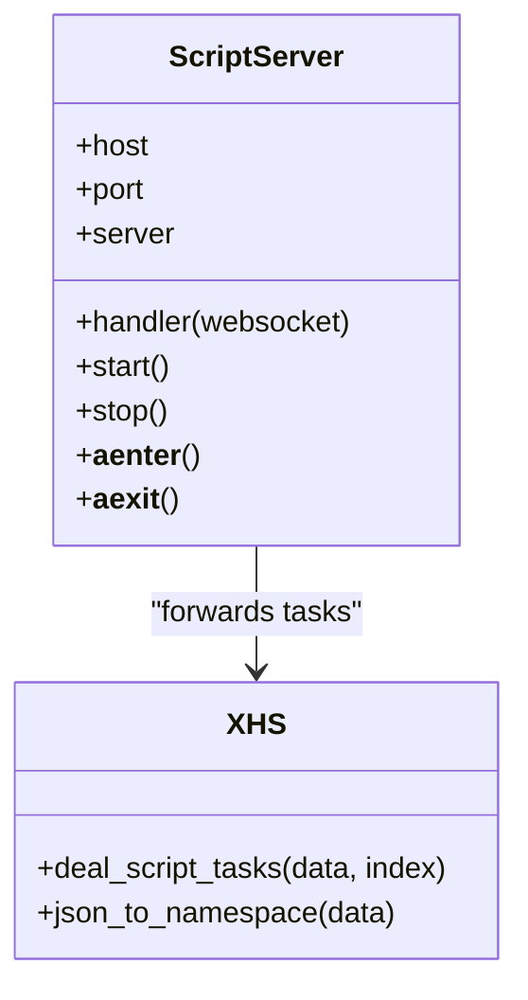
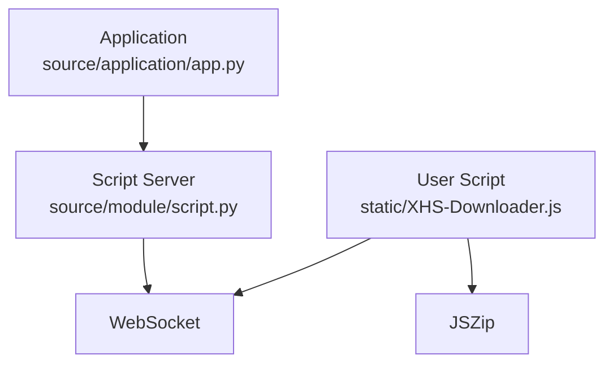

# Browser Integration

<cite>
**Referenced Files in This Document**
- [XHS-Downloader.js](file://static/XHS-Downloader.js)
- [script.py](file://source/module/script.py)
- [app.py](file://source/application/app.py)
- [browser.py](file://source/expansion/browser.py)
- [README.md](file://README.md)
- [README_EN.md](file://README_EN.md)
</cite>

## Table of Contents
1. [Introduction](#introduction)
2. [Project Structure](#project-structure)
3. [Core Components](#core-components)
4. [Architecture Overview](#architecture-overview)
5. [Detailed Component Analysis](#detailed-component-analysis)
6. [Dependency Analysis](#dependency-analysis)
7. [Performance Considerations](#performance-considerations)
8. [Troubleshooting Guide](#troubleshooting-guide)
9. [Conclusion](#conclusion)

## Introduction
This document explains the browser integration for XHS-Downloader's user script functionality. It covers installation, automatic content detection, user script features, the script server implementation, communication protocols, data exchange formats, browser compatibility, troubleshooting, and security considerations.

## Project Structure
The browser integration spans two primary areas:
- A Tampermonkey user script that runs inside XiaoHongShu (XHS) web pages to extract links and trigger downloads.
- A Python-based desktop application that exposes a WebSocket server to receive download tasks from the user script and coordinate downloads.

**Diagram sources**
- [XHS-Downloader.js:2420-2487](file://static/XHS-Downloader.js#L2420-L2487)
- [script.py:10-48](file://source/module/script.py#L10-L48)
- [app.py:508-536](file://source/application/app.py#L508-L536)

**Section sources**
- [XHS-Downloader.js:1-120](file://static/XHS-Downloader.js#L1-L120)
- [README.md:245-283](file://README.md#L245-L283)
- [README_EN.md:249-287](file://README_EN.md#L249-L287)

## Core Components
- User Script (static/XHS-Downloader.js)
  - Runs in XiaoHongShu web pages via Tampermonkey.
  - Detects content and extracts note/user links.
  - Provides download triggers and optional server push via WebSocket.
  - Offers configurable UI and preferences (auto-scroll, packaging, selection modes).
- Script Server (source/module/script.py)
  - Implements a WebSocket server to receive tasks from the user script.
  - Handles JSON messages containing note data and indices.
- Desktop Application (source/application/app.py)
  - Integrates the Script Server into the application lifecycle.
  - Converts received data into structured note objects and orchestrates downloads.

**Section sources**
- [XHS-Downloader.js:2420-2487](file://static/XHS-Downloader.js#L2420-L2487)
- [script.py:10-48](file://source/module/script.py#L10-L48)
- [app.py:508-536](file://source/application/app.py#L508-L536)

## Architecture Overview
The browser integration uses a client-server pattern:
- The user script detects content on XiaoHongShu pages and either downloads locally or pushes tasks to the desktop application.
- The desktop application exposes a WebSocket server that receives tasks and performs downloads.

**Diagram sources**
- [XHS-Downloader.js:509-536](file://static/XHS-Downloader.js#L509-L536)
- [script.py:22-26](file://source/module/script.py#L22-L26)
- [app.py:508-536](file://source/application/app.py#L508-L536)

## Detailed Component Analysis

### User Script: Content Detection and Extraction
- Automatic content detection
  - Uses page state to identify current route and extract note/user IDs.
  - Supports recommendation feeds, user profiles (published/liked/saved), albums, and search results.
- Link extraction
  - Generates shareable note/user URLs and copies them to clipboard.
  - Supports selection mode for choosing specific items before extraction.
- Download orchestration
  - Generates direct media URLs for images and videos.
  - Downloads locally or pushes tasks to the desktop server.

**Diagram sources**
- [XHS-Downloader.js:822-891](file://static/XHS-Downloader.js#L822-L891)
- [XHS-Downloader.js:893-903](file://static/XHS-Downloader.js#L893-L903)

**Section sources**
- [XHS-Downloader.js:563-585](file://static/XHS-Downloader.js#L563-L585)
- [XHS-Downloader.js:822-891](file://static/XHS-Downloader.js#L822-L891)
- [XHS-Downloader.js:893-903](file://static/XHS-Downloader.js#L893-L903)

### User Script: Download Modes and Packaging
- Local download
  - Fetches media via browser fetch and triggers downloads.
  - Supports single image selection and ZIP packaging for multiple images.
- Server push
  - Sends JSON payload to the desktop application via WebSocket.
  - Payload includes note data and optional indices for selective image downloads.

**Diagram sources**
- [XHS-Downloader.js:509-541](file://static/XHS-Downloader.js#L509-L541)
- [XHS-Downloader.js:1669-1687](file://static/XHS-Downloader.js#L1669-L1687)
- [script.py:22-26](file://source/module/script.py#L22-L26)
- [app.py:508-536](file://source/application/app.py#L508-L536)

**Section sources**
- [XHS-Downloader.js:509-541](file://static/XHS-Downloader.js#L509-L541)
- [XHS-Downloader.js:642-681](file://static/XHS-Downloader.js#L642-L681)
- [XHS-Downloader.js:1669-1687](file://static/XHS-Downloader.js#L1669-L1687)

### Script Server Implementation
- WebSocket server
  - Listens on configured host/port.
  - Parses incoming JSON messages and forwards to application handler.
- Application integration
  - Converts JSON to a structured object and orchestrates extraction and download.
  - Returns processed results to the server for acknowledgment.

**Diagram sources**
- [script.py:10-48](file://source/module/script.py#L10-L48)
- [app.py:508-536](file://source/application/app.py#L508-L536)

**Section sources**
- [script.py:10-48](file://source/module/script.py#L10-L48)
- [app.py:508-536](file://source/application/app.py#L508-L536)

### Browser Compatibility and Installation
- Supported browsers
  - The project integrates with Tampermonkey, which runs on major browsers (Chrome, Edge, Firefox, Safari, Opera, Brave, etc.).
- Installation steps
  - Install Tampermonkey.
  - Add the user script from the provided raw URL.
  - Configure script settings (auto-scroll, packaging, server URL, etc.).

**Section sources**
- [README.md:245-263](file://README.md#L245-L263)
- [README_EN.md:249-266](file://README_EN.md#L249-L266)

### Communication Protocols and Data Exchange Formats
- Protocol
  - WebSocket for real-time task delivery from user script to desktop application.
- Message format
  - JSON payload containing note data and optional indices.
  - Desktop application converts JSON to a structured object for processing.

**Section sources**
- [XHS-Downloader.js:522-522](file://static/XHS-Downloader.js#L522-L522)
- [script.py:25-25](file://source/module/script.py#L25-L25)
- [app.py:539-540](file://source/application/app.py#L539-L540)

## Dependency Analysis
- User Script depends on:
  - Tampermonkey runtime and browser APIs.
  - JSZip for packaging multiple images.
  - WebSocket for server communication.
- Desktop Application depends on:
  - Websockets library for server implementation.
  - Internal application modules for data extraction and download orchestration.

**Diagram sources**
- [XHS-Downloader.js:29-29](file://static/XHS-Downloader.js#L29-L29)
- [script.py:3-3](file://source/module/script.py#L3-L3)
- [app.py:508-536](file://source/application/app.py#L508-L536)

**Section sources**
- [XHS-Downloader.js:29-29](file://static/XHS-Downloader.js#L29-L29)
- [script.py:3-3](file://source/module/script.py#L3-L3)

## Performance Considerations
- Auto-scroll feature
  - Disabled by default to reduce detection risk; when enabled, it simulates human-like scrolling behavior.
- Batch operations
  - ZIP packaging reduces multiple downloads into a single archive.
- Network reliability
  - Retry logic and error handling for downloads; server-side acknowledgment ensures robustness.

[No sources needed since this section provides general guidance]

## Troubleshooting Guide
- Script not connecting to server
  - Verify server is running and script_server is enabled in configuration.
  - Ensure WebSocket URL is correct and reachable from the browser.
- Download failures
  - Check proxy/global proxy interference.
  - Validate media URLs and network connectivity.
- Permission and browser issues
  - Confirm Tampermonkey is installed and the user script is enabled.
  - Some browsers may restrict local file downloads; adjust browser settings accordingly.
- Cookie and authentication
  - Certain operations may require logged-in state; ensure session is valid.

**Section sources**
- [README.md:263-283](file://README.md#L263-L283)
- [README_EN.md:267-287](file://README_EN.md#L267-L287)
- [XHS-Downloader.js:2437-2440](file://static/XHS-Downloader.js#L2437-L2440)

## Conclusion
XHS-Downloader’s browser integration combines a powerful user script with a desktop WebSocket server to deliver seamless content extraction and download workflows. The user script detects and extracts links, optionally packages downloads, and can push tasks to the desktop application for processing. The system emphasizes configurability, safety (auto-scroll disabled by default), and clear communication protocols.