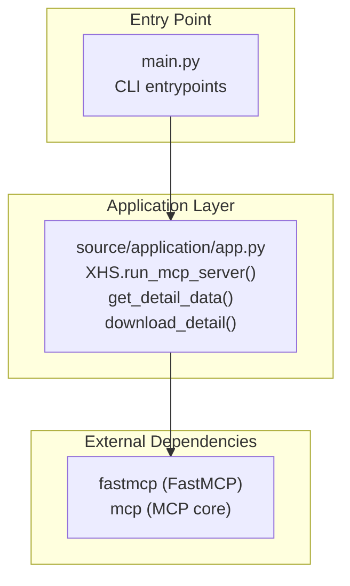
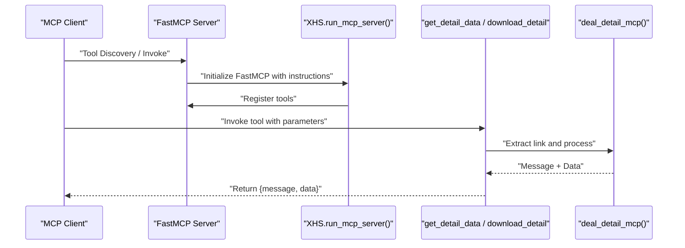
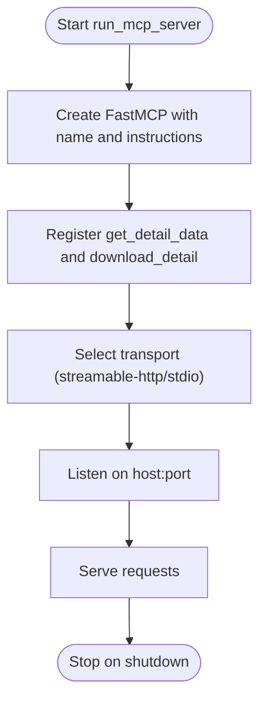
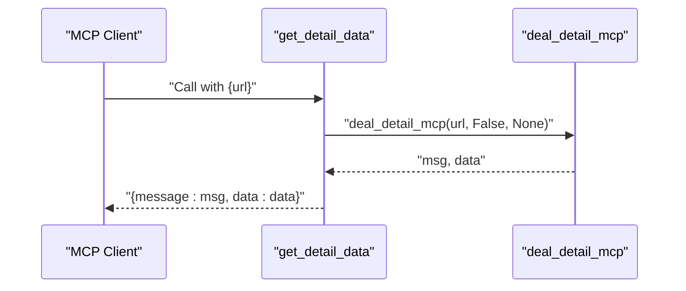
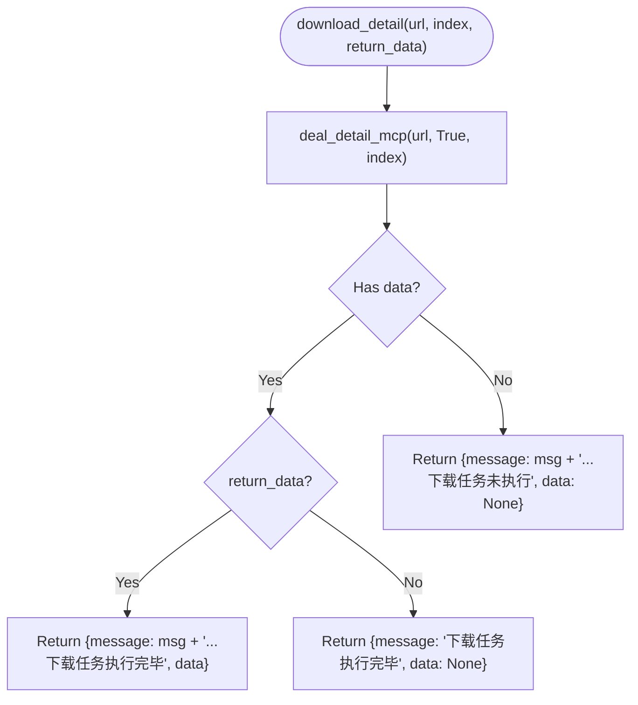
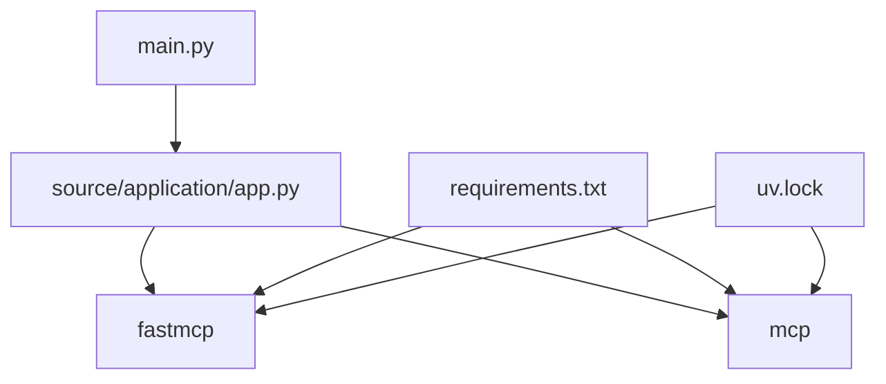

# MCP Integration

<cite>
**Referenced Files in This Document**
- [main.py](file://main.py)
- [README.md](file://README.md)
- [README_EN.md](file://README_EN.md)
- [requirements.txt](file://requirements.txt)
- [uv.lock](file://uv.lock)
- [source/application/app.py](file://source/application/app.py)
- [source/__init__.py](file://source/__init__.py)
</cite>

## Table of Contents
1. [Introduction](#introduction)
2. [Project Structure](#project-structure)
3. [Core Components](#core-components)
4. [Architecture Overview](#architecture-overview)
5. [Detailed Component Analysis](#detailed-component-analysis)
6. [Dependency Analysis](#dependency-analysis)
7. [Performance Considerations](#performance-considerations)
8. [Troubleshooting Guide](#troubleshooting-guide)
9. [Conclusion](#conclusion)
10. [Appendices](#appendices)

## Introduction
This document describes the Model Context Protocol (MCP) integration for XHS-Downloader’s AI assistant capabilities. It explains the FastMCP server implementation, transport protocols, connection handling, and message formats. It documents the two core tools:
- get_detail_data: Extract XiaoHongShu content metadata without downloading
- download_detail: Full content extraction and downloading with optional metadata return

It also covers tool specifications (parameter schemas, return value formats, error handling), MCP client integration examples, protocol-specific features (streaming responses, context management, tool discovery), setup instructions, authentication considerations, debugging techniques, and performance optimization and scaling guidance.

## Project Structure
XHS-Downloader exposes an MCP server entrypoint and integrates FastMCP to expose two tools. The server runs on port 5556 by default and supports the Streamable HTTP transport.

**Diagram sources**
- [main.py:30-42](file://main.py#L30-L42)
- [source/application/app.py:758-917](file://source/application/app.py#L758-L917)

**Section sources**
- [main.py:30-42](file://main.py#L30-L42)
- [README.md:216-236](file://README.md#L216-L236)
- [README_EN.md:220-240](file://README_EN.md#L220-L240)

## Core Components
- FastMCP server: Exposes two tools via the MCP protocol.
- Tools:
  - get_detail_data: Returns metadata for a given XiaoHongShu link without downloading.
  - download_detail: Downloads media for a given link, optionally returning metadata.

Key implementation details:
- Transport: Streamable HTTP (default) with optional stdio transport.
- Tool registration: Uses FastMCP decorators to register tools with descriptions, tags, and annotations.
- Parameter schemas: Defined using Pydantic Field annotations.
- Return format: Dictionary with message and data fields.
- Error handling: Graceful messages returned; internal errors surface as failure messages.

**Section sources**
- [source/application/app.py:758-917](file://source/application/app.py#L758-L917)
- [source/application/app.py:796-835](file://source/application/app.py#L796-L835)
- [source/application/app.py:837-911](file://source/application/app.py#L837-L911)

## Architecture Overview
The MCP server is initialized with instructions and registers two tools. Requests are handled asynchronously and routed to the underlying extraction/download pipeline.

**Diagram sources**
- [source/application/app.py:758-917](file://source/application/app.py#L758-L917)
- [source/application/app.py:919-940](file://source/application/app.py#L919-L940)

## Detailed Component Analysis

### FastMCP Server Implementation
- Initialization: Creates a FastMCP instance with server name and instructions.
- Transport: Supports streamable HTTP (default) and stdio transports.
- Logging: Configurable log level.
- Tool Registration: Two tools registered with descriptions, tags, and annotations.

**Diagram sources**
- [source/application/app.py:758-917](file://source/application/app.py#L758-L917)

**Section sources**
- [source/application/app.py:758-917](file://source/application/app.py#L758-L917)

### Tool: get_detail_data
Purpose: Extract metadata for a XiaoHongShu link without downloading.

- Parameters:
  - url: str (required)
- Return:
  - message: str (status message)
  - data: dict | None (metadata extracted)
- Behavior:
  - Validates and extracts the link.
  - Calls deal_detail_mcp with download=False and index=None.
  - Returns a dictionary with message and data.

**Diagram sources**
- [source/application/app.py:796-835](file://source/application/app.py#L796-L835)
- [source/application/app.py:919-940](file://source/application/app.py#L919-L940)

**Section sources**
- [source/application/app.py:796-835](file://source/application/app.py#L796-L835)
- [source/application/app.py:919-940](file://source/application/app.py#L919-L940)

### Tool: download_detail
Purpose: Download media for a XiaoHongShu link, optionally returning metadata.

- Parameters:
  - url: str (required)
  - index: list[str | int] | None (optional)
  - return_data: bool (optional, default False)
- Return:
  - message: str (status message)
  - data: dict | None (metadata if return_data=True, otherwise None)
- Behavior:
  - Calls deal_detail_mcp with download=True and provided index.
  - Based on whether data exists and return_data flag, returns either:
    - {message: "...下载任务执行完毕", data: None}
    - {message: "...下载任务执行完毕", data: data}
    - {message: "...下载任务未执行", data: None}

**Diagram sources**
- [source/application/app.py:837-911](file://source/application/app.py#L837-L911)
- [source/application/app.py:919-940](file://source/application/app.py#L919-L940)

**Section sources**
- [source/application/app.py:837-911](file://source/application/app.py#L837-L911)
- [source/application/app.py:919-940](file://source/application/app.py#L919-L940)

### Parameter Schemas and Return Formats
- get_detail_data
  - Input: url (str)
  - Output: {message: str, data: dict | None}
- download_detail
  - Input: url (str), index (list[str | int] | None), return_data (bool)
  - Output: {message: str, data: dict | None}

Notes:
- The index parameter allows specifying image indices for image-based posts.
- return_data controls whether metadata is included in the response.

**Section sources**
- [source/application/app.py:796-835](file://source/application/app.py#L796-L835)
- [source/application/app.py:837-911](file://source/application/app.py#L837-L911)

### Error Handling
- Link extraction failures: Returns a failure message indicating extraction failure.
- Data extraction failures: Returns a failure message indicating data extraction failure.
- No data returned: download_detail handles absence of data gracefully and returns an appropriate message.

**Section sources**
- [source/application/app.py:919-940](file://source/application/app.py#L919-L940)

### Protocol-Specific Features
- Tool Discovery: Tools are registered with FastMCP and discoverable by clients.
- Streaming Responses: The server uses FastMCP’s streaming HTTP transport by default.
- Context Management: The server maintains stateless tool invocations; context is derived from parameters.
- Authentication: No explicit authentication is configured in the server initialization shown; clients should follow platform policies.

**Section sources**
- [source/application/app.py:758-917](file://source/application/app.py#L758-L917)

### Setup Instructions for MCP Clients
- Start the server:
  - From source: run the MCP entrypoint to start the FastMCP server on port 5556.
  - From Docker: use the MCP mode command to start the containerized server.
- Configure the MCP client:
  - Use the MCP URL: http://127.0.0.1:5556/mcp/
  - Discover tools and invoke get_detail_data or download_detail as needed.

**Section sources**
- [README.md:216-236](file://README.md#L216-L236)
- [README_EN.md:220-240](file://README_EN.md#L220-L240)
- [main.py:30-42](file://main.py#L30-L42)

### Authentication Considerations
- The server does not configure explicit authentication in the FastMCP initialization shown.
- If authentication is required, integrate with your platform’s authentication mechanisms before invoking tools.

**Section sources**
- [source/application/app.py:758-794](file://source/application/app.py#L758-L794)

### Debugging Techniques
- Log Level: Adjust the log level when starting the server to increase verbosity.
- Tool Messages: Inspect the message field in tool responses for diagnostic information.
- Link Validation: Ensure the provided link matches supported XiaoHongShu link formats.

**Section sources**
- [source/application/app.py:758-764](file://source/application/app.py#L758-L764)

## Dependency Analysis
XHS-Downloader integrates FastMCP and MCP core packages to implement the server.

**Diagram sources**
- [requirements.txt:13](file://requirements.txt#L13)
- [uv.lock:488](file://uv.lock#L488)
- [uv.lock:1020](file://uv.lock#L1020)

**Section sources**
- [requirements.txt:13](file://requirements.txt#L13)
- [uv.lock:488](file://uv.lock#L488)
- [uv.lock:1020](file://uv.lock#L1020)

## Performance Considerations
- Built-in Request Delay: The project includes a built-in request delay mechanism to reduce high-frequency requests.
- Concurrency: FastMCP handles concurrent requests; ensure adequate resources for concurrent downloads.
- Rate Limiting: Respect platform rate limits; consider adding client-side throttling if needed.
- Scaling: Use multiple instances behind a load balancer if throughput demands exceed a single server.

[No sources needed since this section provides general guidance]

## Troubleshooting Guide
- Link Format Issues: Ensure the provided link matches supported XiaoHongShu link formats.
- Extraction Failures: Check the message field for failure reasons; verify network connectivity and proxy settings.
- Download Failures: Confirm that return_data is set appropriately and that the index parameter is correctly formatted when needed.

**Section sources**
- [source/application/app.py:919-940](file://source/application/app.py#L919-L940)

## Conclusion
XHS-Downloader’s MCP integration provides a robust, discoverable interface for extracting XiaoHongShu metadata and downloading media. The FastMCP server exposes two tools with clear parameter schemas and return formats, supports streaming HTTP transport, and integrates with the project’s extraction and download pipeline. Clients can easily integrate by pointing to the MCP URL and invoking the tools as needed, with built-in request delays to help manage platform load.

[No sources needed since this section summarizes without analyzing specific files]

## Appendices

### MCP Client Integration Examples
- Discovery: Use the MCP URL to discover tools.
- Invocation:
  - get_detail_data: Provide a url parameter.
  - download_detail: Provide url, optional index, and optional return_data.

**Section sources**
- [README.md:216-236](file://README.md#L216-L236)
- [README_EN.md:220-240](file://README_EN.md#L220-L240)
- [source/application/app.py:796-911](file://source/application/app.py#L796-L911)

### Supported Link Formats
- https://www.xiaohongshu.com/explore/...
- https://www.xiaohongshu.com/discovery/item/...
- https://xhslink.com/...

**Section sources**
- [source/application/app.py:767-773](file://source/application/app.py#L767-L773)