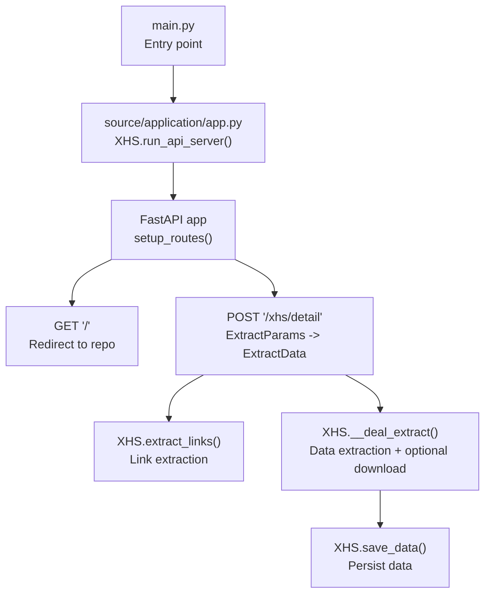
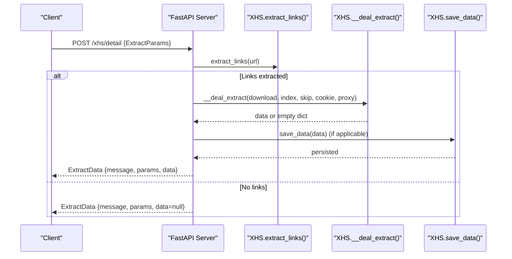
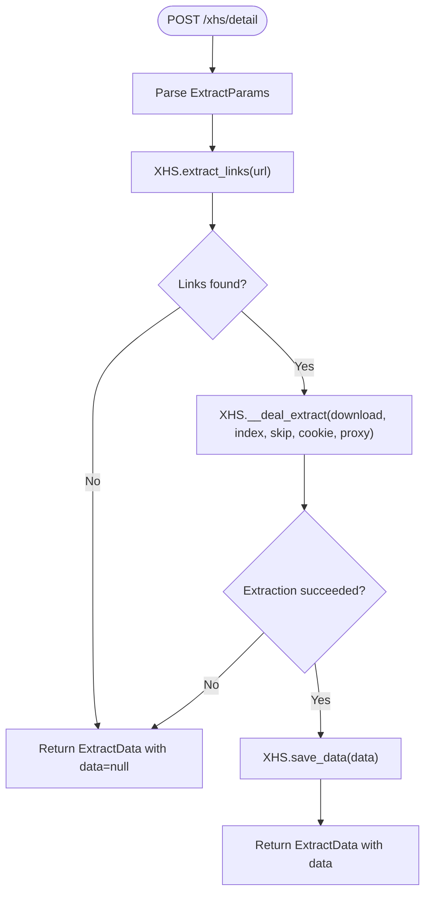
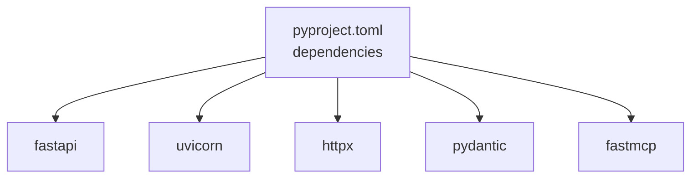

# RESTful API

<cite>
**Referenced Files in This Document**
- [main.py](file://main.py)
- [source/application/app.py](file://source/application/app.py)
- [source/module/model.py](file://source/module/model.py)
- [source/application/request.py](file://source/application/request.py)
- [source/module/static.py](file://source/module/static.py)
- [source/module/tools.py](file://source/module/tools.py)
- [example.py](file://example.py)
- [README.md](file://README.md)
- [README_EN.md](file://README_EN.md)
- [pyproject.toml](file://pyproject.toml)
</cite>

## Table of Contents
1. [Introduction](#introduction)
2. [Project Structure](#project-structure)
3. [Core Components](#core-components)
4. [Architecture Overview](#architecture-overview)
5. [Detailed Component Analysis](#detailed-component-analysis)
6. [Dependency Analysis](#dependency-analysis)
7. [Performance Considerations](#performance-considerations)
8. [Troubleshooting Guide](#troubleshooting-guide)
9. [Conclusion](#conclusion)
10. [Appendices](#appendices)

## Introduction
This document provides comprehensive RESTful API documentation for XHS-Downloader’s FastAPI implementation. It focuses on the primary endpoint for retrieving note metadata and optional downloads, along with request/response schemas, parameter validation, error handling, and operational guidance. It also covers authentication, rate limiting, security considerations, practical usage examples, and client implementation best practices.

## Project Structure
The FastAPI server is initialized from the main entry point and hosted within the XHS application class. The server exposes a single primary endpoint for fetching note details and optionally downloading media assets. Supporting components include request handling, retry mechanisms, and logging utilities.

**Diagram sources**
- [main.py:45-60](file://main.py#L45-L60)
- [source/application/app.py:685-757](file://source/application/app.py#L685-L757)

**Section sources**
- [main.py:17-42](file://main.py#L17-L42)
- [source/application/app.py:685-757](file://source/application/app.py#L685-L757)

## Core Components
- FastAPI server initialization and route registration
- Request model: ExtractParams
- Response model: ExtractData
- Request handler: POST /xhs/detail
- Supporting utilities: Html request client, retry decorator, sleep delay

Key implementation references:
- Server creation and route setup: [source/application/app.py:685-757](file://source/application/app.py#L685-L757)
- Request model definition: [source/module/model.py:4-11](file://source/module/model.py#L4-L11)
- Response model definition: [source/module/model.py:13-17](file://source/module/model.py#L13-L17)
- Request client and retry: [source/application/request.py:15-138](file://source/application/request.py#L15-L138), [source/module/tools.py:13-22](file://source/module/tools.py#L13-L22)

**Section sources**
- [source/application/app.py:685-757](file://source/application/app.py#L685-L757)
- [source/module/model.py:4-17](file://source/module/model.py#L4-L17)
- [source/application/request.py:15-138](file://source/application/request.py#L15-L138)
- [source/module/tools.py:13-22](file://source/module/tools.py#L13-L22)

## Architecture Overview
The API is a minimal FastAPI service that delegates to the XHS core logic. The server runs on localhost by default and exposes a single endpoint for note extraction and optional download.

**Diagram sources**
- [source/application/app.py:719-757](file://source/application/app.py#L719-L757)
- [source/application/app.py:358-506](file://source/application/app.py#L358-L506)
- [source/application/app.py:252-261](file://source/application/app.py#L252-L261)

## Detailed Component Analysis

### Endpoint: POST /xhs/detail
- Method: POST
- URL: /xhs/detail
- Content-Type: application/json
- Summary: Retrieve note metadata and optionally download media files
- Description: Accepts a single note URL and optional parameters to control download behavior, indexing, cookies, proxies, and skipping previously downloaded items.

Request schema (ExtractParams):
- url: string (required)
- download: boolean (optional, default false)
- index: array of string or integer (optional)
- cookie: string (optional)
- proxy: string (optional)
- skip: boolean (optional, default false)

Response schema (ExtractData):
- message: string
- params: ExtractParams
- data: object or null

Behavior:
- Validates and extracts a single note URL
- Optionally downloads media files and returns metadata
- Skips items based on download records when skip=true
- Persists data when download is enabled

Example usage:
- cURL: [example.py:77-91](file://example.py#L77-L91)
- Python requests: [example.py:77-91](file://example.py#L77-L91)

Error handling:
- On invalid or unresolvable URLs, returns message indicating failure and data=null
- Network errors are logged and surfaced via messages; response still includes params

Security and rate limiting:
- No explicit authentication or rate limiting middleware is configured
- Built-in request delays mitigate excessive polling

Operational notes:
- When download=true, the operation takes longer due to media retrieval
- index is only effective for image/text notes and only when download=true

**Section sources**
- [source/application/app.py:719-757](file://source/application/app.py#L719-L757)
- [source/module/model.py:4-17](file://source/module/model.py#L4-L17)
- [example.py:77-91](file://example.py#L77-L91)

### ExtractParams Model
- url: string (required)
- download: boolean (default false)
- index: list[str | int] | None (default null)
- cookie: string | None (default null)
- proxy: string | None (default null)
- skip: boolean (default false)

Validation:
- FastAPI validates incoming JSON against Pydantic model
- index accepts mixed numeric and string entries; downstream logic handles conversion

**Section sources**
- [source/module/model.py:4-11](file://source/module/model.py#L4-L11)

### ExtractData Model
- message: string
- params: ExtractParams
- data: dict | None

Response composition:
- Always includes message and params
- data is populated when extraction succeeds; otherwise null

**Section sources**
- [source/module/model.py:13-17](file://source/module/model.py#L13-L17)

### Request Handler Flow

**Diagram sources**
- [source/application/app.py:719-757](file://source/application/app.py#L719-L757)
- [source/application/app.py:358-506](file://source/application/app.py#L358-L506)
- [source/application/app.py:252-261](file://source/application/app.py#L252-L261)

**Section sources**
- [source/application/app.py:719-757](file://source/application/app.py#L719-L757)
- [source/application/app.py:358-506](file://source/application/app.py#L358-L506)

### Supporting Utilities
- Html.request_url: HTTP GET/HEAD with optional proxy and cookie injection, retry wrapper, and delay
- retry decorator: Retries failed operations up to configured attempts
- sleep_time: Randomized delay to reduce request frequency

**Section sources**
- [source/application/request.py:15-138](file://source/application/request.py#L15-L138)
- [source/module/tools.py:13-22](file://source/module/tools.py#L13-L22)
- [source/module/tools.py:54-64](file://source/module/tools.py#L54-L64)

## Dependency Analysis
- FastAPI and Uvicorn: Server runtime and ASGI
- httpx: HTTP client with optional HTTP/2 and SOCKS support
- pydantic: Request/response model validation
- fastmcp: Optional MCP server (not covered in this API doc)

**Diagram sources**
- [pyproject.toml:11-25](file://pyproject.toml#L11-L25)

**Section sources**
- [pyproject.toml:11-25](file://pyproject.toml#L11-L25)

## Performance Considerations
- Built-in randomized delays reduce request frequency and help avoid platform throttling.
- When download=true, expect increased latency due to media retrieval and persistence.
- Use skip=true to avoid reprocessing known items when download_record is enabled.

[No sources needed since this section provides general guidance]

## Troubleshooting Guide
Common issues and resolutions:
- Invalid or unsupported URL formats: Ensure the URL matches supported patterns; the server extracts a single note link.
- Network errors: Verify connectivity, proxy settings, and cookie validity; network exceptions are logged.
- Rate limiting: Excessive polling may trigger platform-side restrictions; rely on built-in delays.
- Authentication: While optional, setting a valid cookie can improve access to higher-quality media.

Operational tips:
- Use skip=true to avoid reprocessing items already recorded as downloaded.
- Configure proxy and cookie via request parameters when needed.
- Monitor logs for HTTP errors and adjust timeouts if required.

**Section sources**
- [source/application/request.py:63-69](file://source/application/request.py#L63-L69)
- [source/module/tools.py:54-64](file://source/module/tools.py#L54-L64)

## Conclusion
The XHS-Downloader FastAPI server provides a focused, validated interface for extracting note metadata and optionally downloading media. Its design emphasizes simplicity, robustness through retries and delays, and clear request/response contracts via Pydantic models. For production use, consider deploying behind a reverse proxy, adding authentication/rate limiting, and monitoring logs for reliability.

[No sources needed since this section summarizes without analyzing specific files]

## Appendices

### Endpoint Specifications
- Base URL: http://127.0.0.1:5556 (default)
- Interactive docs: http://127.0.0.1:5556/docs or http://127.0.0.1:5556/redoc

Endpoint details:
- POST /xhs/detail
  - Body: JSON matching ExtractParams
  - Response: JSON matching ExtractData

Parameters:
- url: string (required)
- download: boolean (optional)
- index: array of integers/strings (optional)
- cookie: string (optional)
- proxy: string (optional)
- skip: boolean (optional)

Status codes:
- 200 OK: Successful extraction or failure with data=null
- 422 Unprocessable Entity: Validation error on request body
- 500 Internal Server Error: Unexpected server error

Authentication and security:
- No built-in authentication
- No rate limiting middleware
- Recommended: Deploy behind a reverse proxy with TLS and optional auth

Rate limiting:
- Built-in randomized delays to reduce request frequency

Versioning and compatibility:
- Version exposed via FastAPI app and static constants
- Backward compatibility: Requests using ExtractParams remain compatible; new fields should be optional

**Section sources**
- [source/application/app.py:685-757](file://source/application/app.py#L685-L757)
- [source/module/static.py:3-6](file://source/module/static.py#L3-L6)
- [README.md:142-215](file://README.md#L142-L215)

### Practical Usage Examples
- cURL:
  - Basic: [example.py:77-91](file://example.py#L77-L91)
- Python requests:
  - Basic: [example.py:77-91](file://example.py#L77-L91)

Notes:
- Replace the url field with a valid note URL
- Adjust download, index, proxy, and cookie as needed

**Section sources**
- [example.py:77-91](file://example.py#L77-L91)

### Client Implementation Guidelines
- Use ExtractParams for request serialization
- Expect ExtractData.response.data to be null on failure
- Respect built-in delays; avoid tight loops
- Consider caching responses when skip=true is used

[No sources needed since this section provides general guidance]

### Migration and Compatibility Notes
- Current version: Major.Minor.Beta as defined in static constants
- Backward compatibility: New optional fields can be added without breaking existing clients
- Deprecation policy: Not specified; monitor repository releases for changes

**Section sources**
- [source/module/static.py:3-6](file://source/module/static.py#L3-L6)
- [README.md:142-215](file://README.md#L142-L215)