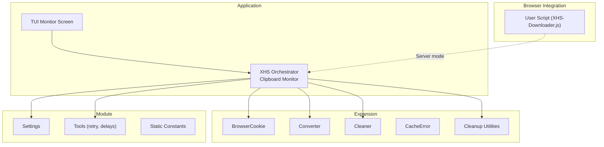
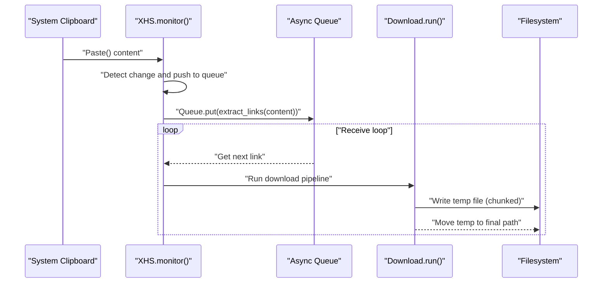
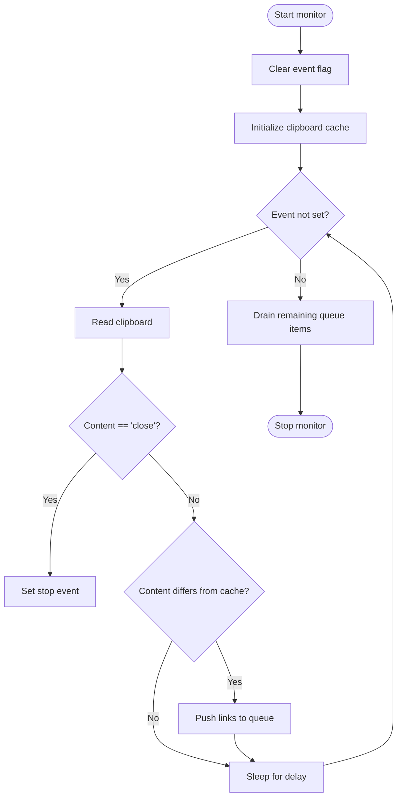
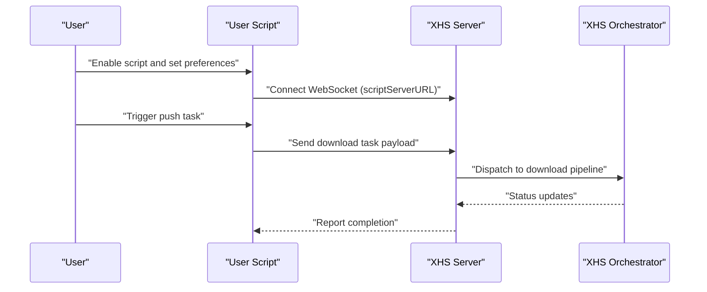
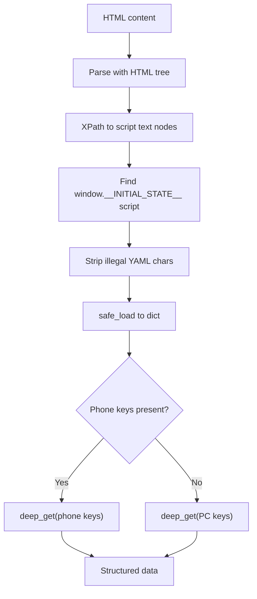
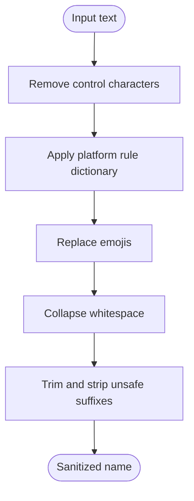
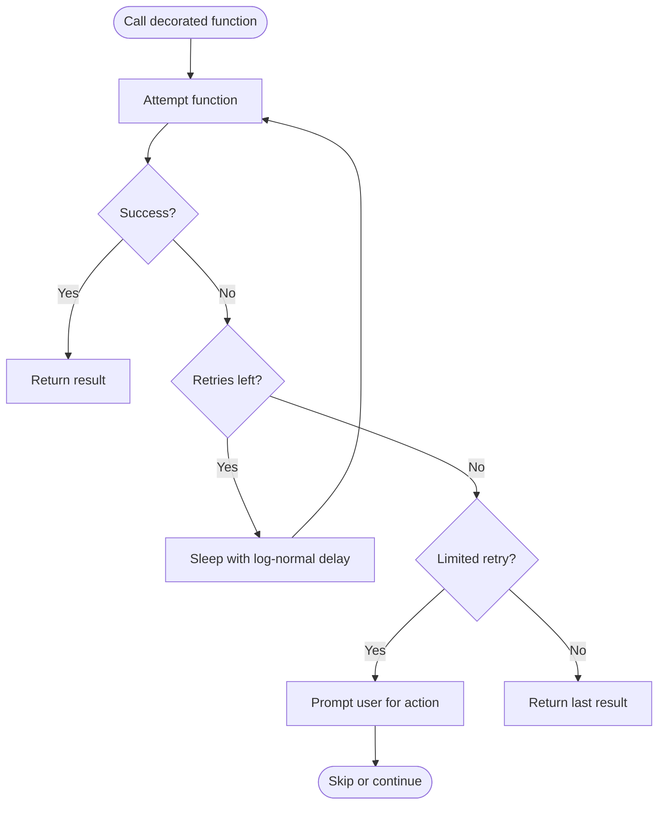
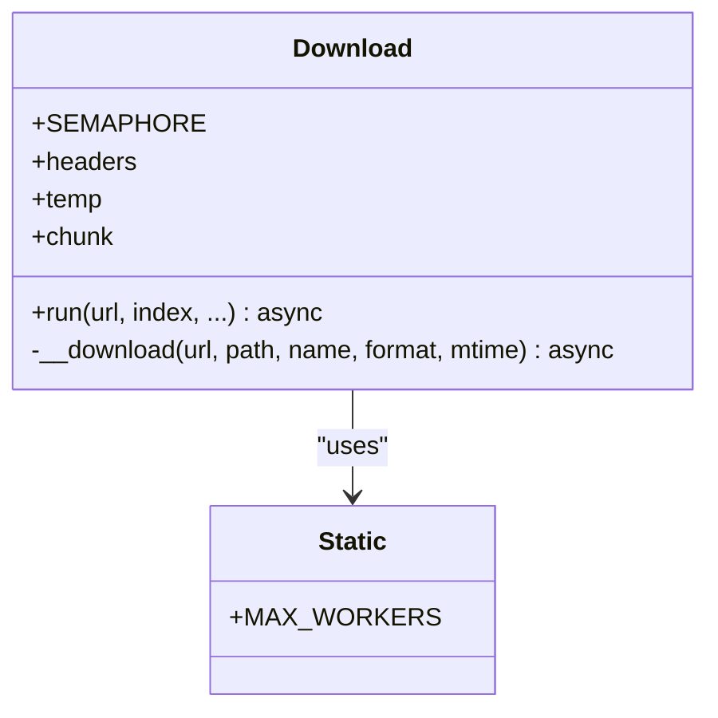
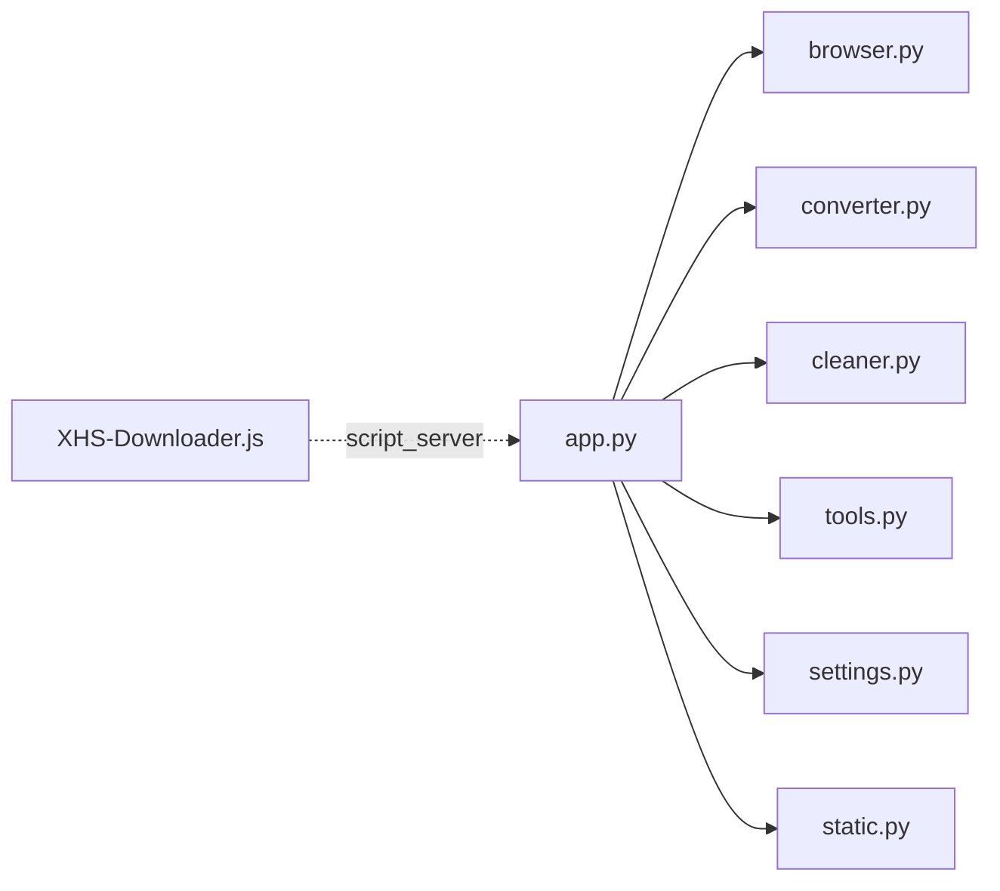

# Advanced Features

<cite>
**Referenced Files in This Document**
- [app.py](file://source/application/app.py)
- [monitor.py](file://source/TUI/monitor.py)
- [browser.py](file://source/expansion/browser.py)
- [converter.py](file://source/expansion/converter.py)
- [cleaner.py](file://source/expansion/cleaner.py)
- [error.py](file://source/expansion/error.py)
- [file_folder.py](file://source/expansion/file_folder.py)
- [settings.py](file://source/module/settings.py)
- [tools.py](file://source/module/tools.py)
- [static.py](file://source/module/static.py)
- [XHS-Downloader.js](file://static/XHS-Downloader.js)
- [README.md](file://README.md)
- [README_EN.md](file://README_EN.md)
</cite>

## Table of Contents
1. [Introduction](#introduction)
2. [Project Structure](#project-structure)
3. [Core Components](#core-components)
4. [Architecture Overview](#architecture-overview)
5. [Detailed Component Analysis](#detailed-component-analysis)
6. [Dependency Analysis](#dependency-analysis)
7. [Performance Considerations](#performance-considerations)
8. [Troubleshooting Guide](#troubleshooting-guide)
9. [Conclusion](#conclusion)
10. [Appendices](#appendices)

## Introduction
This document focuses on advanced features in XHS-Downloader, including:
- Clipboard monitoring system with automatic detection and configuration
- Browser integration via user script installation and server-side coordination
- File conversion utilities for parsing initial state data and extracting structured content
- Cleanup utilities for filename sanitization and temporary file handling
- Error handling and retry mechanisms with exponential backoff and failure recovery
- Performance optimization features including intelligent caching, batch processing, and resource management
- Advanced configuration options, customization possibilities, and extension points
- Practical examples and troubleshooting guidance for complex scenarios

## Project Structure
The advanced features span several modules:
- Application orchestration and monitoring
- Expansion utilities for browser cookie extraction, conversion, cleaning, and cleanup
- Module-level settings, tools, and static constants
- Static assets for browser user script integration

**Diagram sources**
- [app.py:603-651](file://source/application/app.py#L603-L651)
- [monitor.py:18-58](file://source/TUI/monitor.py#L18-L58)
- [browser.py:26-120](file://source/expansion/browser.py#L26-L120)
- [converter.py:9-80](file://source/expansion/converter.py#L9-L80)
- [cleaner.py:14-117](file://source/expansion/cleaner.py#L14-L117)
- [error.py:1-8](file://source/expansion/error.py#L1-L8)
- [file_folder.py:5-26](file://source/expansion/file_folder.py#L5-L26)
- [settings.py:10-124](file://source/module/settings.py#L10-L124)
- [tools.py:13-64](file://source/module/tools.py#L13-L64)
- [static.py:39-72](file://source/module/static.py#L39-L72)
- [XHS-Downloader.js:305-418](file://static/XHS-Downloader.js#L305-L418)

**Section sources**
- [app.py:603-651](file://source/application/app.py#L603-L651)
- [monitor.py:18-58](file://source/TUI/monitor.py#L18-L58)
- [browser.py:26-120](file://source/expansion/browser.py#L26-L120)
- [converter.py:9-80](file://source/expansion/converter.py#L9-L80)
- [cleaner.py:14-117](file://source/expansion/cleaner.py#L14-L117)
- [error.py:1-8](file://source/expansion/error.py#L1-L8)
- [file_folder.py:5-26](file://source/expansion/file_folder.py#L5-L26)
- [settings.py:10-124](file://source/module/settings.py#L10-L124)
- [tools.py:13-64](file://source/module/tools.py#L13-L64)
- [static.py:39-72](file://source/module/static.py#L39-L72)
- [XHS-Downloader.js:305-418](file://static/XHS-Downloader.js#L305-L418)

## Core Components
- Clipboard Monitoring: Asynchronous polling of the system clipboard, link extraction, queue-based processing, and graceful shutdown.
- Browser Integration: User script configuration, server mode toggling, WebSocket connectivity, and settings persistence.
- Conversion Utilities: Parsing initial state from HTML to structured data for content extraction.
- Cleanup Utilities: Sanitizing filenames, removing control characters, and managing empty directories.
- Error Handling and Retry: Decorators for retry logic and a custom cache error for partial-content handling.
- Performance Tools: Intelligent caching, worker limits, and adaptive delays.

**Section sources**
- [app.py:603-651](file://source/application/app.py#L603-L651)
- [tools.py:13-64](file://source/module/tools.py#L13-L64)
- [error.py:1-8](file://source/expansion/error.py#L1-L8)
- [static.py:39-72](file://source/module/static.py#L39-L72)
- [cleaner.py:14-117](file://source/expansion/cleaner.py#L14-L117)
- [file_folder.py:5-26](file://source/expansion/file_folder.py#L5-L26)
- [converter.py:9-80](file://source/expansion/converter.py#L9-L80)
- [XHS-Downloader.js:305-418](file://static/XHS-Downloader.js#L305-L418)

## Architecture Overview
The advanced features integrate as follows:
- The application orchestrator runs the clipboard monitor and coordinates downloads.
- The user script communicates with the server when enabled, sending tasks and receiving status.
- Conversion utilities parse HTML to extract structured content.
- Cleanup utilities sanitize filenames and manage temporary artifacts.
- Tools and settings govern retry behavior, delays, and resource limits.

**Diagram sources**
- [app.py:603-651](file://source/application/app.py#L603-L651)
- [monitor.py:42-50](file://source/TUI/monitor.py#L42-L50)

**Section sources**
- [app.py:603-651](file://source/application/app.py#L603-L651)
- [monitor.py:42-50](file://source/TUI/monitor.py#L42-L50)

## Detailed Component Analysis

### Clipboard Monitoring System
- Automatic detection: Polls the clipboard at a configurable interval, compares against a cache, and pushes new links to an async queue.
- Configuration options:
  - Delay interval for polling
  - Download flag to trigger file downloads upon detection
  - Data flag to optionally return metadata
- Shutdown: Supports explicit stop and graceful termination when the queue empties.

**Diagram sources**
- [app.py:603-651](file://source/application/app.py#L603-L651)
- [monitor.py:42-50](file://source/TUI/monitor.py#L42-L50)

**Section sources**
- [app.py:603-651](file://source/application/app.py#L603-L651)
- [monitor.py:18-58](file://source/TUI/monitor.py#L18-L58)

### Browser Integration Capabilities
- User script installation: Provided links for master and develop branches.
- Script functionality:
  - Configurable image download format (PNG, WEBP, JPEG, HEIC)
  - Script server toggle and URL configuration
  - Auto-scroll behavior (with safety notes)
- Compatibility considerations:
  - Requires Tampermonkey
  - Platform-specific clipboard behavior
  - Proxy interference risks

**Diagram sources**
- [XHS-Downloader.js:305-418](file://static/XHS-Downloader.js#L305-L418)
- [README.md:245-282](file://README.md#L245-L282)
- [README_EN.md:249-287](file://README_EN.md#L249-L287)

**Section sources**
- [XHS-Downloader.js:305-418](file://static/XHS-Downloader.js#L305-L418)
- [README.md:245-282](file://README.md#L245-L282)
- [README_EN.md:249-287](file://README_EN.md#L249-L287)

### File Conversion Utilities
- Purpose: Extract initial state from HTML script tags and convert to structured data.
- Keys linkage: Supports both desktop and mobile key paths to locate note data.
- Filtering: Returns either phone or PC data structure depending on availability.

**Diagram sources**
- [converter.py:24-80](file://source/expansion/converter.py#L24-L80)

**Section sources**
- [converter.py:9-80](file://source/expansion/converter.py#L9-L80)

### Cleanup Functionality
- Filename sanitization:
  - Removes control characters and platform-specific illegal characters
  - Replaces emojis with a specified replacement
  - Normalizes whitespace and trims leading/trailing characters
- Temporary file handling:
  - Utility to toggle file existence (touch/unlink)
  - Removal of empty directories excluding special prefixes

**Diagram sources**
- [cleaner.py:59-97](file://source/expansion/cleaner.py#L59-L97)
- [file_folder.py:5-26](file://source/expansion/file_folder.py#L5-L26)

**Section sources**
- [cleaner.py:14-117](file://source/expansion/cleaner.py#L14-L117)
- [file_folder.py:5-26](file://source/expansion/file_folder.py#L5-L26)

### Error Handling and Retry Mechanisms
- Retry decorators:
  - Standard retry decorator attempts a fixed number of retries
  - Limited retry decorator prompts user intervention for locked resources
- Exponential backoff and delays:
  - Log-normal distributed wait times to smooth traffic
- Cache error:
  - Specialized exception raised when cached partial content is invalid

**Diagram sources**
- [tools.py:13-64](file://source/module/tools.py#L13-L64)
- [error.py:1-8](file://source/expansion/error.py#L1-L8)

**Section sources**
- [tools.py:13-64](file://source/module/tools.py#L13-L64)
- [error.py:1-8](file://source/expansion/error.py#L1-L8)

### Performance Optimization Features
- Intelligent caching:
  - Chunked streaming with resume support via range headers
  - Temporary file staging before atomic move
- Batch processing:
  - Async queue for link ingestion and concurrent processing
- Resource management:
  - Worker limit constant for controlled concurrency
  - Request delays to avoid rate limiting

**Diagram sources**
- [app.py:196-233](file://source/application/app.py#L196-L233)
- [static.py:69-72](file://source/module/static.py#L69-L72)

**Section sources**
- [app.py:196-233](file://source/application/app.py#L196-L233)
- [static.py:69-72](file://source/module/static.py#L69-L72)

### Advanced Configuration Options and Extension Points
- Settings:
  - Download preferences (image/video/live), naming rules, timeouts, chunk sizes, retry counts
  - Archive modes, author mapping, and metadata recording
  - Script server toggle and host/port configuration
- Extension points:
  - Customizable user agent and proxy
  - Author alias mapping for filenames
  - Naming format string supports multiple fields

**Section sources**
- [settings.py:10-124](file://source/module/settings.py#L10-L124)
- [app.py:116-194](file://source/application/app.py#L116-L194)

## Dependency Analysis
- Clipboard monitoring depends on system clipboard APIs and async queues.
- Browser integration relies on WebSocket connectivity and user script settings.
- Conversion utilities depend on HTML parsing and YAML-safe loading.
- Cleanup utilities depend on platform-specific rules and emoji normalization.
- Tools and static constants underpin retry logic and concurrency limits.

**Diagram sources**
- [app.py:26-53](file://source/application/app.py#L26-L53)
- [browser.py:26-120](file://source/expansion/browser.py#L26-L120)
- [converter.py:9-80](file://source/expansion/converter.py#L9-L80)
- [cleaner.py:14-117](file://source/expansion/cleaner.py#L14-L117)
- [tools.py:13-64](file://source/module/tools.py#L13-L64)
- [settings.py:10-124](file://source/module/settings.py#L10-L124)
- [static.py:39-72](file://source/module/static.py#L39-L72)
- [XHS-Downloader.js:305-418](file://static/XHS-Downloader.js#L305-L418)

**Section sources**
- [app.py:26-53](file://source/application/app.py#L26-L53)
- [browser.py:26-120](file://source/expansion/browser.py#L26-L120)
- [converter.py:9-80](file://source/expansion/converter.py#L9-L80)
- [cleaner.py:14-117](file://source/expansion/cleaner.py#L14-L117)
- [tools.py:13-64](file://source/module/tools.py#L13-L64)
- [settings.py:10-124](file://source/module/settings.py#L10-L124)
- [static.py:39-72](file://source/module/static.py#L39-L72)
- [XHS-Downloader.js:305-418](file://static/XHS-Downloader.js#L305-L418)

## Performance Considerations
- Concurrency control: Worker limit constant constrains simultaneous operations.
- Adaptive delays: Log-normal wait times reduce burstiness and mitigate rate limits.
- Streaming and chunking: Efficient disk I/O and resume capability for partial downloads.
- Queue-based batching: Decouples ingestion from processing for throughput scaling.

[No sources needed since this section provides general guidance]

## Troubleshooting Guide
- Clipboard monitoring not working:
  - Verify platform clipboard dependencies and permissions.
  - Ensure the stop keyword is recognized and event flag is cleared.
- User script server errors:
  - Confirm script_server is enabled in settings.
  - Check WebSocket URL and connectivity; review error logs.
- Download failures:
  - Inspect retry behavior and cache error conditions.
  - Adjust chunk size and timeout settings.
- Filename issues:
  - Use the cleaner utilities to sanitize names and remove illegal characters.
  - Remove empty directories after cleanup.

**Section sources**
- [app.py:603-651](file://source/application/app.py#L603-L651)
- [XHS-Downloader.js:2420-2471](file://static/XHS-Downloader.js#L2420-L2471)
- [tools.py:13-64](file://source/module/tools.py#L13-L64)
- [error.py:1-8](file://source/expansion/error.py#L1-L8)
- [cleaner.py:59-97](file://source/expansion/cleaner.py#L59-L97)
- [file_folder.py:12-26](file://source/expansion/file_folder.py#L12-L26)

## Conclusion
XHS-Downloader’s advanced features combine robust clipboard monitoring, flexible browser integration, reliable conversion utilities, and resilient error handling. With configurable performance controls and extensive customization points, the system supports efficient batch processing and safe operation under varied environments.

[No sources needed since this section summarizes without analyzing specific files]

## Appendices

### Practical Examples
- Enable script server and push tasks from the user script:
  - Set script_server to true in settings.
  - Keep the application running as a server; the user script connects via WebSocket.
- Configure image format and naming:
  - Adjust image_download format in the user script settings.
  - Customize name_format in the application settings for deterministic filenames.
- Monitor clipboard and auto-download:
  - Launch the monitor screen; paste links to trigger automatic processing.

**Section sources**
- [README.md:263-282](file://README.md#L263-L282)
- [README_EN.md:267-287](file://README_EN.md#L267-L287)
- [XHS-Downloader.js:1405-1418](file://static/XHS-Downloader.js#L1405-L1418)
- [settings.py:12-37](file://source/module/settings.py#L12-L37)
- [monitor.py:42-50](file://source/TUI/monitor.py#L42-L50)