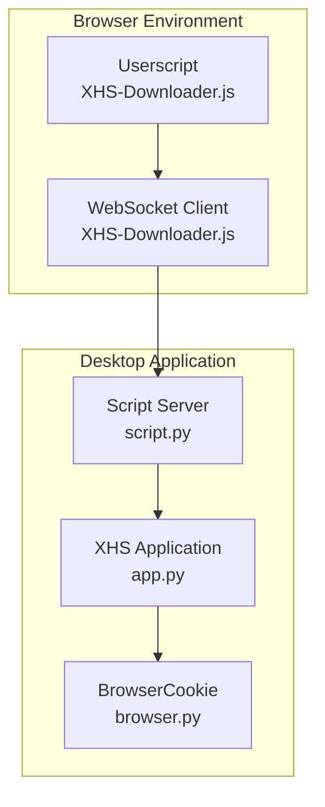
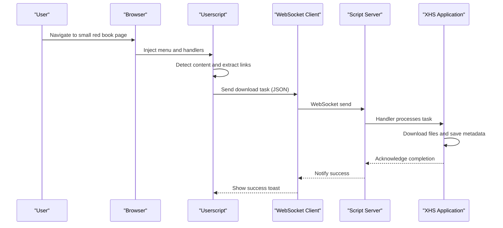
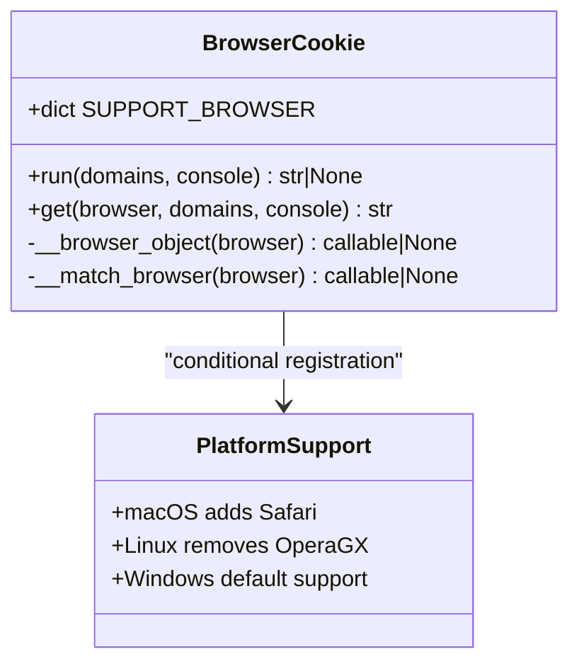
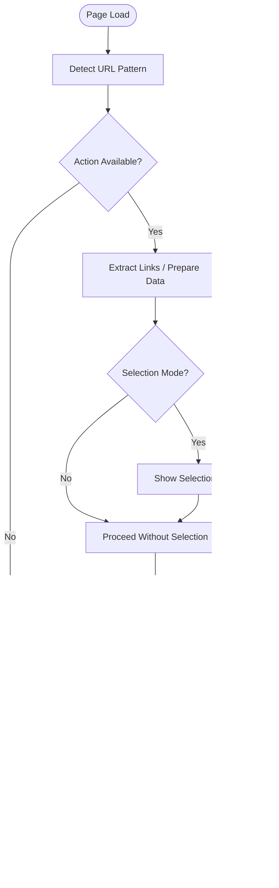
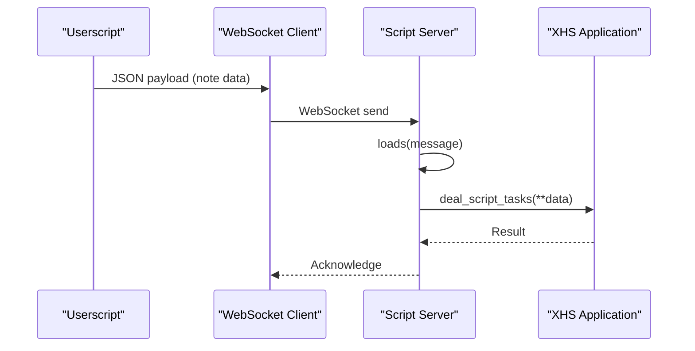
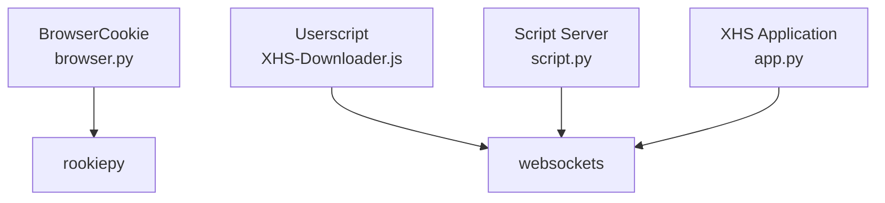

# Browser Integration

<cite>
**Referenced Files in This Document**
- [browser.py](file://source/expansion/browser.py)
- [XHS-Downloader.js](file://static/XHS-Downloader.js)
- [script.py](file://source/module/script.py)
- [app.py](file://source/application/app.py)
- [main.py](file://source/CLI/main.py)
- [README.md](file://README.md)
- [README_EN.md](file://README_EN.md)
- [requirements.txt](file://requirements.txt)
</cite>

## Table of Contents
1. [Introduction](#introduction)
2. [Project Structure](#project-structure)
3. [Core Components](#core-components)
4. [Architecture Overview](#architecture-overview)
5. [Detailed Component Analysis](#detailed-component-analysis)
6. [Dependency Analysis](#dependency-analysis)
7. [Performance Considerations](#performance-considerations)
8. [Troubleshooting Guide](#troubleshooting-guide)
9. [Conclusion](#conclusion)

## Introduction
This document explains the browser integration capabilities of the project, focusing on:
- The BrowserCookie class for extracting cookies from multiple browsers
- Platform-specific considerations and compatibility
- User script integration for browser automation and seamless download workflows
- Setup procedures, troubleshooting, and security considerations

## Project Structure
The browser integration spans three primary areas:
- Browser cookie extraction: Python module supporting multiple desktop browsers
- User script: Tampermonkey userscript for automatic content detection and download orchestration
- Script server: WebSocket server enabling browser-to-desktop communication

**Diagram sources**
- [app.py:1000-1000](file://source/application/app.py#L1000-L1000)
- [script.py:10-48](file://source/module/script.py#L10-L48)
- [browser.py:26-120](file://source/expansion/browser.py#L26-L120)
- [XHS-Downloader.js:2420-2488](file://static/XHS-Downloader.js#L2420-L2488)

**Section sources**
- [browser.py:1-120](file://source/expansion/browser.py#L1-L120)
- [XHS-Downloader.js:1-2489](file://static/XHS-Downloader.js#L1-L2489)
- [script.py:1-48](file://source/module/script.py#L1-L48)
- [app.py:1000-1000](file://source/application/app.py#L1000-L1000)

## Core Components
- BrowserCookie class: Provides cross-platform cookie extraction from desktop browsers using the rookiepy library. Supports Arc, Chrome, Chromium, Brave, Edge, Firefox, LibreWolf, Opera, Opera GX, Vivaldi, and Safari (macOS).
- User script (XHS-Downloader.js): Adds a contextual menu to small red book pages, detects content automatically, extracts links, and can push download tasks to the desktop application via WebSocket.
- Script server: A WebSocket server embedded in the desktop application that receives tasks from the user script and triggers downloads.

**Section sources**
- [browser.py:26-120](file://source/expansion/browser.py#L26-L120)
- [XHS-Downloader.js:2420-2488](file://static/XHS-Downloader.js#L2420-L2488)
- [script.py:10-48](file://source/module/script.py#L10-L48)

## Architecture Overview
The browser integration architecture enables:
- Desktop-side cookie extraction for authentication
- Browser-side automation for link extraction and download initiation
- Real-time communication via WebSocket for push-based downloads

**Diagram sources**
- [XHS-Downloader.js:2420-2488](file://static/XHS-Downloader.js#L2420-L2488)
- [script.py:22-26](file://source/module/script.py#L22-L26)
- [app.py:508-536](file://source/application/app.py#L508-L536)

## Detailed Component Analysis

### BrowserCookie Class
The BrowserCookie class encapsulates cross-browser cookie extraction:
- Supported browsers: Arc, Chrome, Chromium, Brave, Edge, Firefox, LibreWolf, Opera, Opera GX, Vivaldi, Safari (macOS)
- Platform-specific behavior:
  - macOS adds Safari support
  - Linux removes Opera GX
  - Windows has no special additions beyond general support
- Input methods:
  - Accepts either browser name or numeric index
  - Returns a semicolon-separated cookie string for configured domains
- Error handling:
  - Gracefully handles invalid inputs and runtime errors from the underlying library

**Diagram sources**
- [browser.py:26-120](file://source/expansion/browser.py#L26-L120)

**Section sources**
- [browser.py:26-120](file://source/expansion/browser.py#L26-L120)

### User Script Integration (XHS-Downloader.js)
The user script provides:
- Automatic content detection based on URL patterns
- Contextual menu with actions tailored to the current page (recommendations, user profile, search results, albums)
- Link extraction and selection modes
- File download orchestration and packaging
- WebSocket integration for pushing tasks to the desktop application

Key behaviors:
- Content detection: Uses URL patterns to determine available actions
- Link extraction: Generates shareable links for notes and users
- Download pipeline: Handles both single-file and ZIP packaging for multiple images
- WebSocket client: Manages connection lifecycle and sends tasks to the desktop server
- Settings persistence: Stores user preferences locally via GM_getValue/GM_setValue

**Diagram sources**
- [XHS-Downloader.js:849-903](file://static/XHS-Downloader.js#L849-L903)
- [XHS-Downloader.js:2420-2488](file://static/XHS-Downloader.js#L2420-L2488)

**Section sources**
- [XHS-Downloader.js:2420-2488](file://static/XHS-Downloader.js#L2420-L2488)
- [XHS-Downloader.js:849-903](file://static/XHS-Downloader.js#L849-L903)

### Script Server (WebSocket Bridge)
The script server enables the user script to communicate with the desktop application:
- Embedded in the desktop app as a WebSocket server
- Receives JSON messages containing note data
- Converts JSON to internal data structures and triggers download processing
- Provides lifecycle management (start/stop) and graceful connection handling

**Diagram sources**
- [script.py:22-26](file://source/module/script.py#L22-L26)
- [app.py:508-536](file://source/application/app.py#L508-L536)

**Section sources**
- [script.py:10-48](file://source/module/script.py#L10-L48)
- [app.py:508-536](file://source/application/app.py#L508-L536)

## Dependency Analysis
External dependencies relevant to browser integration:
- Rookiepy: Cross-browser cookie extraction
- Websockets: WebSocket server/client communication
- FastAPI/FastMCP/Uvicorn: Optional server modes (not directly related to browser integration)

**Diagram sources**
- [browser.py:5-16](file://source/expansion/browser.py#L5-L16)
- [requirements.txt:27-27](file://requirements.txt#L27-L27)
- [script.py:3-3](file://source/module/script.py#L3-L3)
- [app.py:1000-1000](file://source/application/app.py#L1000-L1000)

**Section sources**
- [requirements.txt:1-29](file://requirements.txt#L1-L29)
- [browser.py:5-16](file://source/expansion/browser.py#L5-L16)
- [script.py:3-3](file://source/module/script.py#L3-L3)

## Performance Considerations
- Cookie extraction: The underlying library performs OS-level operations; ensure minimal repeated extractions to reduce overhead.
- User script operations: Auto-scrolling and link extraction can be CPU-intensive; disable auto-scrolling if experiencing performance issues.
- WebSocket throughput: Batch operations and avoid excessive reconnections; the embedded server manages lifecycle robustly.

## Troubleshooting Guide
Common issues and resolutions:
- Cookie extraction fails
  - Verify browser support for your platform; macOS adds Safari, Linux removes Opera GX.
  - Ensure the browser is running and accessible; some platforms require elevated privileges for certain browsers.
  - Confirm domain targeting includes the intended site.
- User script not injecting or actions missing
  - Confirm Tampermonkey is installed and the userscript is enabled.
  - Check that the page URL matches supported patterns for the desired action.
  - Review browser console for errors related to missing dependencies (e.g., JSZip).
- WebSocket push fails
  - Ensure the desktop application’s script server is enabled and running.
  - Verify the WebSocket URL configuration in the userscript settings.
  - Check network connectivity and firewall settings.

Security considerations:
- Cookie handling: Treat extracted cookies as sensitive credentials; avoid sharing or persisting unnecessarily.
- Userscript permissions: The script uses granted APIs for clipboard, storage, and WebSocket; review permissions in your browser extension settings.
- Network security: When pushing tasks via WebSocket, ensure the server is only accessible on trusted networks.

**Section sources**
- [browser.py:107-120](file://source/expansion/browser.py#L107-L120)
- [README.md:131-136](file://README.md#L131-L136)
- [README_EN.md:132-137](file://README_EN.md#L132-L137)
- [XHS-Downloader.js:2420-2488](file://static/XHS-Downloader.js#L2420-L2488)

## Conclusion
The project provides a cohesive browser integration solution combining:
- Cross-browser cookie extraction for authentication
- A powerful userscript for automation and seamless download workflows
- A WebSocket bridge enabling real-time communication between browser and desktop

By following the setup and troubleshooting guidance, users can leverage these capabilities effectively while maintaining security and performance.