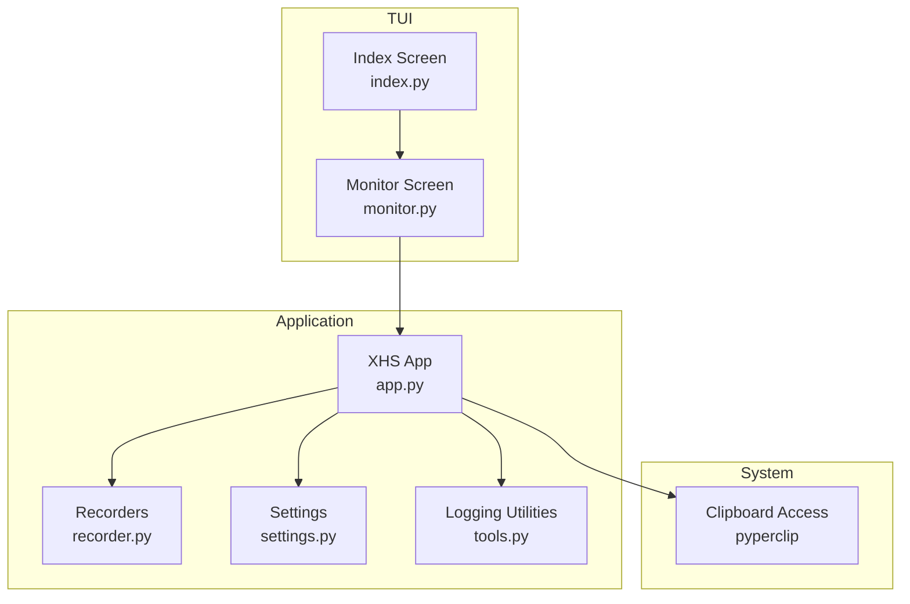
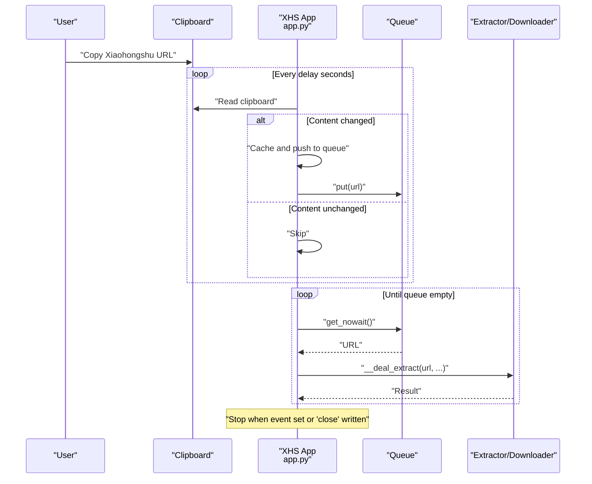
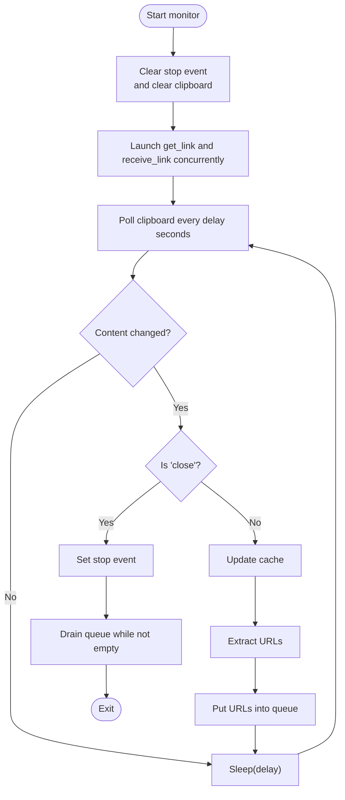
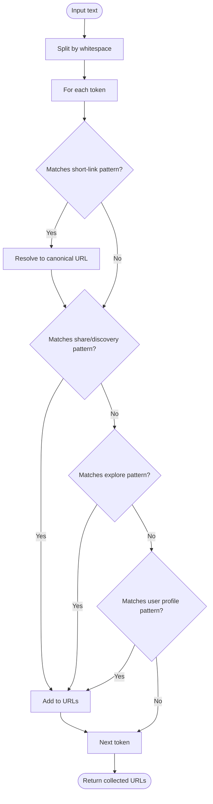
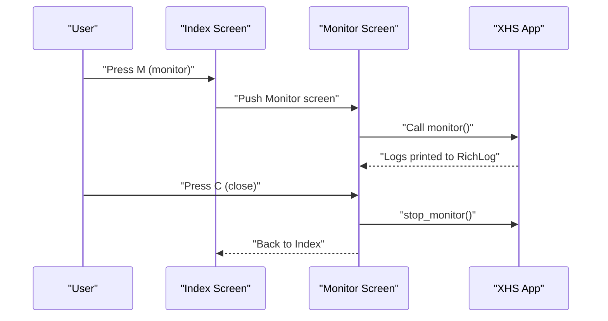
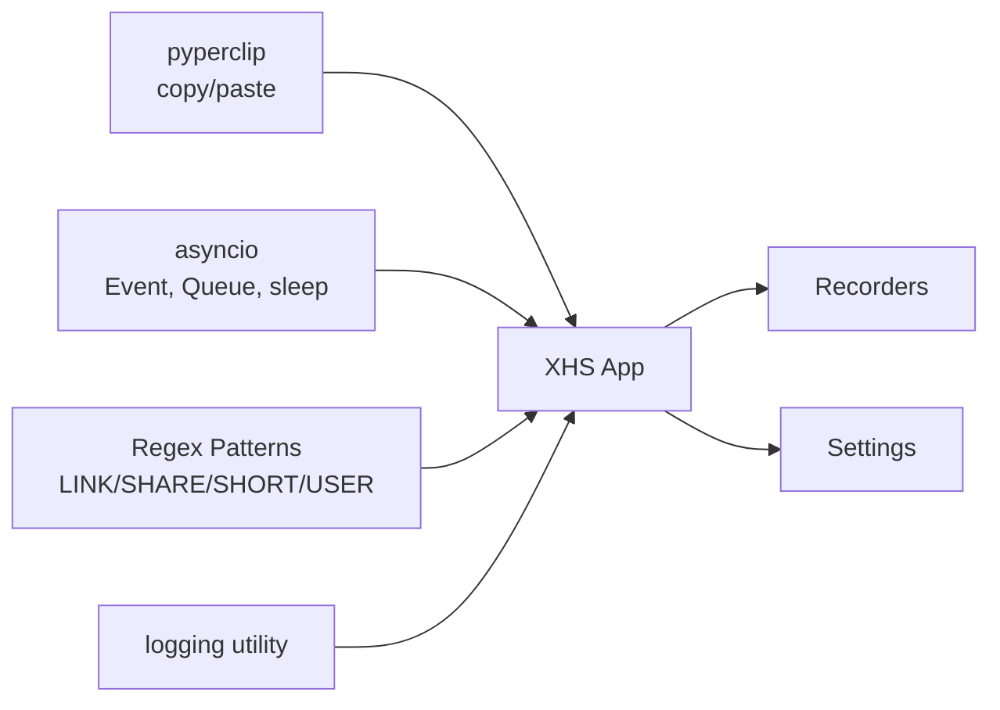

# Clipboard Monitoring

<cite>
**Referenced Files in This Document**
- [app.py](file://source/application/app.py)
- [monitor.py](file://source/TUI/monitor.py)
- [index.py](file://source/TUI/index.py)
- [settings.py](file://source/module/settings.py)
- [tools.py](file://source/module/tools.py)
- [main.py](file://main.py)
- [XHS-Downloader.js](file://static/XHS-Downloader.js)
</cite>

## Table of Contents
1. [Introduction](#introduction)
2. [Project Structure](#project-structure)
3. [Core Components](#core-components)
4. [Architecture Overview](#architecture-overview)
5. [Detailed Component Analysis](#detailed-component-analysis)
6. [Dependency Analysis](#dependency-analysis)
7. [Performance Considerations](#performance-considerations)
8. [Troubleshooting Guide](#troubleshooting-guide)
9. [Conclusion](#conclusion)

## Introduction
This document explains the clipboard monitoring feature that automatically detects Xiaohongshu (Little Red Book) URLs copied to the system clipboard and triggers content extraction and optional downloads. It covers how the monitoring loop works, how URLs are extracted and filtered, how to enable/disable monitoring, and how to tune detection sensitivity. It also documents the configuration options exposed via settings and CLI, the event-driven architecture, and practical examples for common tasks.

## Project Structure
The clipboard monitoring feature spans several modules:
- Application-level monitoring and URL extraction logic
- TUI screen for launching and stopping monitoring
- CLI entry points for program startup
- Settings and configuration management
- Utility logging helpers

**Diagram sources**
- [index.py:141-146](file://source/TUI/index.py#L141-L146)
- [monitor.py:42-45](file://source/TUI/monitor.py#L42-L45)
- [app.py:603-620](file://source/application/app.py#L603-L620)
- [settings.py:12-37](file://source/module/settings.py#L12-L37)

**Section sources**
- [index.py:141-146](file://source/TUI/index.py#L141-L146)
- [monitor.py:42-45](file://source/TUI/monitor.py#L42-L45)
- [app.py:603-620](file://source/application/app.py#L603-L620)
- [settings.py:12-37](file://source/module/settings.py#L12-L37)

## Core Components
- Clipboard monitoring loop: continuously polls the clipboard, compares against a cache, and triggers URL extraction when content changes.
- URL extraction: identifies Xiaohongshu URLs from arbitrary text, resolves short links, and filters supported patterns.
- Event-driven processing: extracted URLs are queued and processed asynchronously.
- TUI integration: a dedicated screen launches monitoring and displays logs; closing the screen stops monitoring.
- Configuration: monitoring interval and download behavior are configurable via method parameters; global settings influence download behavior and storage.

Key implementation references:
- Monitoring loop and queue processing
  - [app.py:603-620](file://source/application/app.py#L603-L620)
  - [app.py:622-629](file://source/application/app.py#L622-L629)
  - [app.py:644-648](file://source/application/app.py#L644-L648)
- URL extraction and filtering
  - [app.py:358-375](file://source/application/app.py#L358-L375)
  - [app.py:102-107](file://source/application/app.py#L102-L107)
- TUI launch and stop
  - [index.py:141-146](file://source/TUI/index.py#L141-L146)
  - [monitor.py:42-45](file://source/TUI/monitor.py#L42-L45)
  - [monitor.py:52-54](file://source/TUI/monitor.py#L52-L54)
- Logging utilities
  - [tools.py:42-51](file://source/module/tools.py#L42-L51)

**Section sources**
- [app.py:358-375](file://source/application/app.py#L358-L375)
- [app.py:603-620](file://source/application/app.py#L603-L620)
- [app.py:622-629](file://source/application/app.py#L622-L629)
- [app.py:644-648](file://source/application/app.py#L644-L648)
- [index.py:141-146](file://source/TUI/index.py#L141-L146)
- [monitor.py:42-45](file://source/TUI/monitor.py#L42-L45)
- [monitor.py:52-54](file://source/TUI/monitor.py#L52-L54)
- [tools.py:42-51](file://source/module/tools.py#L42-L51)

## Architecture Overview
The clipboard monitoring architecture is event-driven and asynchronous:
- A long-running coroutine polls the clipboard at a configurable interval.
- On change, the new clipboard content is cached and passed to a URL extraction routine.
- Extracted URLs are pushed into an internal queue.
- A second coroutine drains the queue and performs extraction and optional downloads.
- The process runs until explicitly stopped or a sentinel value is placed in the clipboard.

**Diagram sources**
- [app.py:603-620](file://source/application/app.py#L603-L620)
- [app.py:622-629](file://source/application/app.py#L622-L629)
- [app.py:644-648](file://source/application/app.py#L644-L648)

## Detailed Component Analysis

### Clipboard Listener and Event Loop
The listener runs two concurrent tasks:
- A polling task that reads the clipboard, compares with a cache, and pushes new content to the queue after extracting URLs.
- A receiver task that drains the queue and processes items.

**Diagram sources**
- [app.py:603-620](file://source/application/app.py#L603-L620)
- [app.py:622-629](file://source/application/app.py#L622-L629)
- [app.py:644-648](file://source/application/app.py#L644-L648)

**Section sources**
- [app.py:603-620](file://source/application/app.py#L603-L620)
- [app.py:622-629](file://source/application/app.py#L622-L629)
- [app.py:644-648](file://source/application/app.py#L644-L648)

### URL Detection and Filtering
The URL extraction routine:
- Splits input text by whitespace.
- Resolves short links to canonical URLs when applicable.
- Matches supported Xiaohongshu URL patterns and collects them.
- Supports discovery item links, explore page links, user profile links, and short-link redirections.

**Diagram sources**
- [app.py:358-375](file://source/application/app.py#L358-L375)
- [app.py:102-107](file://source/application/app.py#L102-L107)

**Section sources**
- [app.py:358-375](file://source/application/app.py#L358-L375)
- [app.py:102-107](file://source/application/app.py#L102-L107)

### TUI Integration and Controls
The TUI provides:
- A screen to start monitoring and display logs.
- Keyboard bindings to quit or close the monitor.
- A button to stop monitoring and return to the previous screen.

**Diagram sources**
- [index.py:141-146](file://source/TUI/index.py#L141-L146)
- [monitor.py:42-45](file://source/TUI/monitor.py#L42-L45)
- [monitor.py:52-54](file://source/TUI/monitor.py#L52-L54)

**Section sources**
- [index.py:141-146](file://source/TUI/index.py#L141-L146)
- [monitor.py:42-45](file://source/TUI/monitor.py#L42-L45)
- [monitor.py:52-54](file://source/TUI/monitor.py#L52-L54)

### Configuration Options
Monitoring parameters:
- delay: polling interval in seconds (default 1)
- download: whether to download media after extraction (default True)
- data: whether to collect metadata (default False)

These are passed to the monitor method and influence the receiver loop’s behavior.

Global settings influencing downloads and storage:
- download_record: toggles recording of downloaded IDs
- record_data: toggles saving detailed metadata
- folder_mode, author_archive, write_mtime: archive and naming behavior
- image_download, video_download, live_download: toggle specific media types
- folder_name, name_format: output organization and naming
- proxy, timeout, chunk, max_retry: network and retry behavior

References:
- [app.py:603-608](file://source/application/app.py#L603-L608)
- [settings.py:12-37](file://source/module/settings.py#L12-L37)

**Section sources**
- [app.py:603-608](file://source/application/app.py#L603-L608)
- [settings.py:12-37](file://source/module/settings.py#L12-L37)

### Practical Examples

- Enable monitoring from TUI:
  - Press the monitor binding in the main screen to open the monitor screen, which starts monitoring automatically.
  - References: [index.py:141-146](file://source/TUI/index.py#L141-L146), [monitor.py:42-45](file://source/TUI/monitor.py#L42-L45)

- Disable monitoring:
  - Click the close button in the monitor screen or press the close keybinding.
  - Alternatively, write the sentinel text "close" into the clipboard to stop monitoring immediately.
  - References: [monitor.py:52-54](file://source/TUI/monitor.py#L52-L54), [app.py:624-625](file://source/application/app.py#L624-L625)

- Configure detection sensitivity:
  - Adjust the polling interval by changing the delay parameter when invoking the monitor method.
  - Tune download behavior via the download and data flags.
  - References: [app.py:603-608](file://source/application/app.py#L603-L608), [app.py:622-629](file://source/application/app.py#L622-L629)

- Configure global settings:
  - Modify settings such as download_record, record_data, and media toggles to control downstream extraction and download behavior.
  - References: [settings.py:12-37](file://source/module/settings.py#L12-L37)

**Section sources**
- [index.py:141-146](file://source/TUI/index.py#L141-L146)
- [monitor.py:52-54](file://source/TUI/monitor.py#L52-L54)
- [app.py:603-608](file://source/application/app.py#L603-L608)
- [app.py:622-629](file://source/application/app.py#L622-L629)
- [settings.py:12-37](file://source/module/settings.py#L12-L37)

## Dependency Analysis
The clipboard monitoring feature depends on:
- Clipboard access library for reading/writing clipboard content
- Asynchronous primitives for concurrency and event signaling
- URL pattern definitions for Xiaohongshu link recognition
- Logging utilities for user feedback

**Diagram sources**
- [app.py:22](file://source/application/app.py#L22)
- [app.py:102-107](file://source/application/app.py#L102-L107)
- [tools.py:42-51](file://source/module/tools.py#L42-L51)

**Section sources**
- [app.py:22](file://source/application/app.py#L22)
- [app.py:102-107](file://source/application/app.py#L102-L107)
- [tools.py:42-51](file://source/module/tools.py#L42-L51)

## Performance Considerations
- Polling interval: Lower delay increases CPU usage and responsiveness; higher delay reduces overhead but may miss rapid successive copies.
- Queue processing: The receiver loop processes items at a fixed cadence; ensure delay is balanced with network timeouts and disk I/O.
- Memory footprint: The clipboard cache stores the last clipboard content; it is lightweight but consider clearing it periodically if memory pressure occurs.
- Network and disk I/O: Downloads can be expensive; disable unnecessary downloads or limit concurrency by adjusting global settings.
- Logging: Excessive logging can slow down the UI; keep logging moderate during heavy monitoring sessions.

[No sources needed since this section provides general guidance]

## Troubleshooting Guide
Common issues and resolutions:
- Monitoring does not start:
  - Ensure the monitor screen is opened from the main screen and that the app initializes properly.
  - References: [index.py:141-146](file://source/TUI/index.py#L141-L146), [monitor.py:42-45](file://source/TUI/monitor.py#L42-L45)

- No URLs extracted:
  - Verify the clipboard contains a supported Xiaohongshu URL pattern.
  - Confirm that short links resolve to canonical URLs.
  - References: [app.py:358-375](file://source/application/app.py#L358-L375), [app.py:102-107](file://source/application/app.py#L102-L107)

- Monitoring stops unexpectedly:
  - Check if "close" was written to the clipboard.
  - Ensure the stop event is not being set elsewhere.
  - References: [app.py:624-625](file://source/application/app.py#L624-L625), [app.py:650-651](file://source/application/app.py#L650-L651)

- High CPU usage:
  - Increase the polling delay to reduce frequency of clipboard checks.
  - References: [app.py:603-608](file://source/application/app.py#L603-L608), [app.py:622-629](file://source/application/app.py#L622-L629)

- Logs not visible:
  - Ensure the monitor screen’s RichLog widget is bound to the app’s print function.
  - References: [monitor.py:49](file://source/TUI/monitor.py#L49), [tools.py:42-51](file://source/module/tools.py#L42-L51)

**Section sources**
- [index.py:141-146](file://source/TUI/index.py#L141-L146)
- [monitor.py:42-45](file://source/TUI/monitor.py#L42-L45)
- [app.py:358-375](file://source/application/app.py#L358-L375)
- [app.py:603-608](file://source/application/app.py#L603-L608)
- [app.py:622-629](file://source/application/app.py#L622-L629)
- [app.py:624-625](file://source/application/app.py#L624-L625)
- [app.py:650-651](file://source/application/app.py#L650-L651)
- [monitor.py:49](file://source/TUI/monitor.py#L49)
- [tools.py:42-51](file://source/module/tools.py#L42-L51)

## Conclusion
The clipboard monitoring feature provides a robust, event-driven mechanism to detect Xiaohongshu URLs from the clipboard, extract them, and optionally download associated content. Its design balances simplicity and performance, with straightforward controls to start/stop monitoring and tune sensitivity. By leveraging the provided configuration options and understanding the underlying architecture, users can optimize monitoring for their workflows while minimizing resource usage.