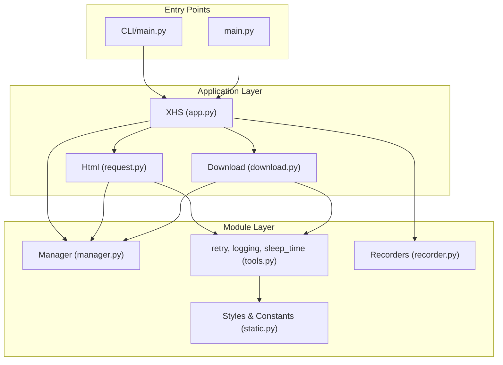
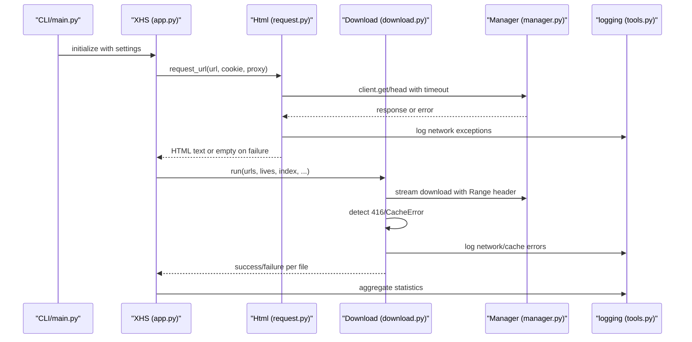
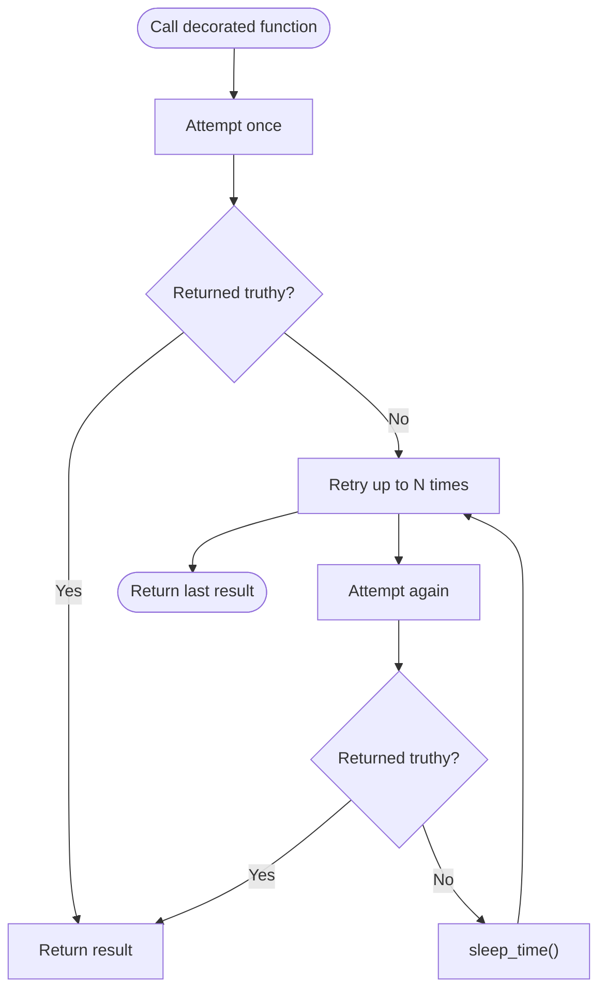
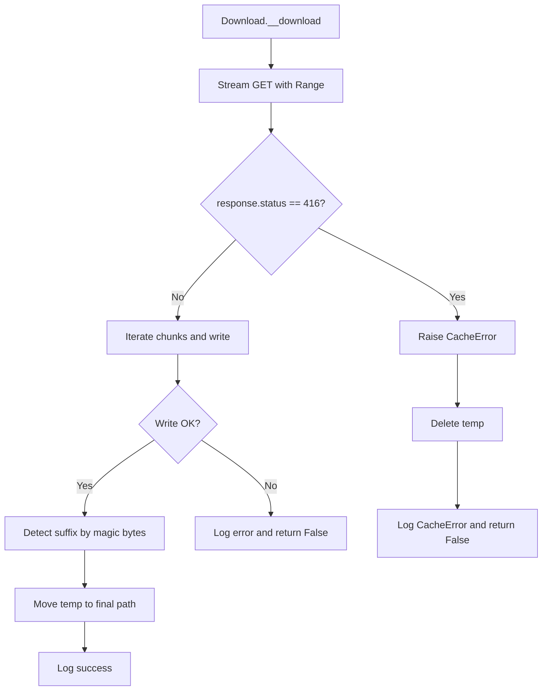
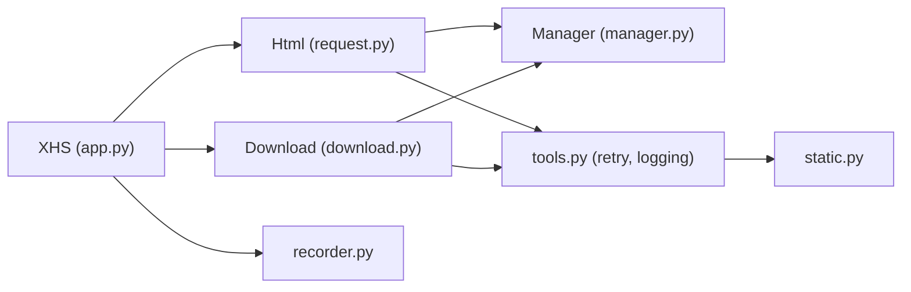

# Error Handling and Recovery

<cite>
**Referenced Files in This Document**
- [error.py](file://source/expansion/error.py)
- [tools.py](file://source/module/tools.py)
- [manager.py](file://source/module/manager.py)
- [request.py](file://source/application/request.py)
- [download.py](file://source/application/download.py)
- [app.py](file://source/application/app.py)
- [recorder.py](file://source/module/recorder.py)
- [static.py](file://source/module/static.py)
- [CLI/main.py](file://source/CLI/main.py)
- [main.py](file://main.py)
</cite>

## Table of Contents
1. [Introduction](#introduction)
2. [Project Structure](#project-structure)
3. [Core Components](#core-components)
4. [Architecture Overview](#architecture-overview)
5. [Detailed Component Analysis](#detailed-component-analysis)
6. [Dependency Analysis](#dependency-analysis)
7. [Performance Considerations](#performance-considerations)
8. [Troubleshooting Guide](#troubleshooting-guide)
9. [Conclusion](#conclusion)
10. [Appendices](#appendices)

## Introduction
This document explains the error handling and recovery mechanisms in the XHS-Downloader project. It covers the exception hierarchy, error classification, automatic retry strategies, timeouts, graceful degradation, logging and diagnostics, and practical examples of common failure scenarios. Monitoring and alerting are discussed conceptually, as the project does not implement external observability integrations.

## Project Structure
The error handling and recovery logic spans several modules:
- Application orchestration and logging: application layer
- Network requests and retries: application/request.py and module/tools.py
- Download pipeline and recovery: application/download.py
- Resource management and proxies: module/manager.py
- Persistent records and graceful degradation: module/recorder.py
- Logging styles and constants: module/static.py
- CLI and entry points: CLI/main.py and main.py

**Diagram sources**
- [app.py:98-194](file://source/application/app.py#L98-L194)
- [request.py:15-138](file://source/application/request.py#L15-L138)
- [download.py:30-338](file://source/application/download.py#L30-L338)
- [manager.py:28-308](file://source/module/manager.py#L28-L308)
- [tools.py:13-63](file://source/module/tools.py#L13-L63)
- [recorder.py:13-192](file://source/module/recorder.py#L13-L192)
- [static.py:31-37](file://source/module/static.py#L31-L37)
- [CLI/main.py:39-101](file://source/CLI/main.py#L39-L101)
- [main.py:12-60](file://main.py#L12-L60)

**Section sources**
- [app.py:98-194](file://source/application/app.py#L98-L194)
- [request.py:15-138](file://source/application/request.py#L15-L138)
- [download.py:30-338](file://source/application/download.py#L30-L338)
- [manager.py:28-308](file://source/module/manager.py#L28-L308)
- [tools.py:13-63](file://source/module/tools.py#L13-L63)
- [recorder.py:13-192](file://source/module/recorder.py#L13-L192)
- [static.py:31-37](file://source/module/static.py#L31-L37)
- [CLI/main.py:39-101](file://source/CLI/main.py#L39-L101)
- [main.py:12-60](file://main.py#L12-L60)

## Core Components
- Exception hierarchy
  - CacheError: signals cache-related failures during downloads.
- Retry mechanisms
  - retry decorator: attempts a function up to a configured number of times.
  - retry_limited: interactive retry loop for TUI mode.
- Logging and styles
  - logging wrapper: prints or writes styled messages via Rich.
  - Style constants for info/warning/error.
- Proxy and timeout handling
  - Manager validates proxy connectivity and applies timeouts to HTTP clients.
- Graceful degradation
  - Feature toggles for image/video/live download and folder/archive modes.
  - Recorder switches for skipping database operations when disabled.

**Section sources**
- [error.py:1-8](file://source/expansion/error.py#L1-L8)
- [tools.py:13-63](file://source/module/tools.py#L13-L63)
- [static.py:31-37](file://source/module/static.py#L31-L37)
- [manager.py:225-259](file://source/module/manager.py#L225-L259)
- [download.py:124-174](file://source/application/download.py#L124-L174)
- [recorder.py:13-79](file://source/module/recorder.py#L13-L79)

## Architecture Overview
The system orchestrates extraction, data retrieval, and downloads with built-in resilience:
- XHS coordinates workflows and aggregates logs.
- Html performs HTTP requests with retries and timeout enforcement.
- Download streams content with resume support and recovers from cache errors.
- Manager manages clients, proxies, and timeouts.
- Recorders optionally persist state to avoid redundant work.

**Diagram sources**
- [CLI/main.py:39-101](file://source/CLI/main.py#L39-L101)
- [app.py:268-506](file://source/application/app.py#L268-L506)
- [request.py:26-138](file://source/application/request.py#L26-L138)
- [download.py:196-268](file://source/application/download.py#L196-L268)
- [manager.py:100-124](file://source/module/manager.py#L100-L124)
- [tools.py:42-51](file://source/module/tools.py#L42-L51)

## Detailed Component Analysis

### Exception Hierarchy and Classification
- CacheError
  - Purpose: Signals cache inconsistencies (e.g., HTTP 416) requiring a fresh download.
  - Triggered when the server responds with a range error indicating cached data is invalid.
- HTTPError
  - Purpose: Wraps network-level failures during GET/HEAD requests and streaming downloads.
  - Logged with error style and treated as recoverable failures.

Classification
- Recoverable failures: HTTPError, 416/CacheError, transient network issues.
- Non-recoverable failures: unsupported types, invalid configurations.

**Section sources**
- [error.py:1-8](file://source/expansion/error.py#L1-L8)
- [download.py:220-222](file://source/application/download.py#L220-L222)
- [request.py:63-69](file://source/application/request.py#L63-L69)

### Automatic Retry Strategies with Exponential Backoff
- Retry decorator
  - Behavior: Executes the decorated function once; if it returns a falsy result, retries up to Manager.retry times.
  - Does not implement exponential backoff; each retry is immediate.
- Sleep between operations
  - sleep_time() introduces randomized delays using a log-normal distribution to reduce burstiness.
- Practical effect
  - Immediate retries occur after failures; additional throttling reduces server pressure.

**Diagram sources**
- [tools.py:13-22](file://source/module/tools.py#L13-L22)
- [tools.py:62-63](file://source/module/tools.py#L62-L63)
- [request.py:26-70](file://source/application/request.py#L26-L70)
- [download.py:196-204](file://source/application/download.py#L196-L204)

**Section sources**
- [tools.py:13-22](file://source/module/tools.py#L13-L22)
- [tools.py:54-63](file://source/module/tools.py#L54-L63)
- [request.py:26-70](file://source/application/request.py#L26-L70)
- [download.py:196-204](file://source/application/download.py#L196-L204)

### Failure Recovery Processes
- Request-level recovery
  - On HTTPError, logs a network exception and returns an empty result to signal failure.
  - Uses HEAD/GET variants with optional proxy and verifies status before returning content.
- Download-level recovery
  - Detects HTTP 416 and raises CacheError to force a fresh download.
  - Deletes partially downloaded temporary files upon cache errors.
  - Logs network errors and returns False to indicate failure.
- Resume and format detection
  - Uses Range headers to resume partial downloads.
  - Determines file type by magic signatures; falls back to default suffix on failure.

**Diagram sources**
- [download.py:196-268](file://source/application/download.py#L196-L268)
- [download.py:316-338](file://source/application/download.py#L316-L338)

**Section sources**
- [request.py:40-70](file://source/application/request.py#L40-L70)
- [download.py:213-268](file://source/application/download.py#L213-L268)
- [download.py:316-338](file://source/application/download.py#L316-L338)

### Timeout Handling and Proxy Validation
- Timeouts
  - Requests use Manager.timeout for both HTML and download clients.
  - Head/Get requests inherit the timeout setting.
- Proxy validation
  - Manager tests proxy connectivity by sending a quick GET to a known endpoint.
  - Logs warnings for timeouts or request errors; proceeds without proxy if invalid.

**Section sources**
- [request.py:106-108](file://source/application/request.py#L106-L108)
- [manager.py:225-259](file://source/module/manager.py#L225-L259)

### Graceful Degradation Patterns
- Feature toggles
  - Image/video/live download switches allow skipping unsupported content types.
  - Folder mode archives each work into its own folder; author archive groups by author.
- Recorder switches
  - download_record and record_data can disable persistence to reduce overhead.
- Existence checks
  - Skips downloading existing files to avoid redundant work.

**Section sources**
- [download.py:124-174](file://source/application/download.py#L124-L174)
- [download.py:176-194](file://source/application/download.py#L176-L194)
- [recorder.py:13-79](file://source/module/recorder.py#L13-L79)

### Logging System and Diagnostics
- Logging abstraction
  - logging() wraps Rich Text rendering and either prints directly or writes to a console sink.
  - Styles: INFO, WARNING, ERROR are used consistently.
- Diagnostic messages
  - Network failures, cache errors, file existence, and statistics are logged.
- Console integration
  - TUI uses a console sink; CLI uses direct print.

**Section sources**
- [tools.py:42-51](file://source/module/tools.py#L42-L51)
- [static.py:31-37](file://source/module/static.py#L31-L37)
- [app.py:280-315](file://source/application/app.py#L280-L315)
- [request.py:63-69](file://source/application/request.py#L63-L69)
- [download.py:250-267](file://source/application/download.py#L250-L267)

### Practical Examples and Resolution Strategies
- Example: Network timeout or connection error
  - Cause: Server unreachable or slow response.
  - Behavior: HTTPError caught; logs error; returns empty result.
  - Resolution: Increase timeout, verify proxy, retry later.
- Example: HTTP 416 (range request unsatisfiable)
  - Cause: Corrupted or stale partial file.
  - Behavior: CacheError raised; temp file deleted; retry downloads.
  - Resolution: Allow automatic retry; ensure disk space and permissions.
- Example: Unsupported media type
  - Cause: Unknown content type or missing magic signature.
  - Behavior: Falls back to default suffix; logs potential format detection failure.
  - Resolution: Verify source URL correctness; inspect headers.
- Example: Proxy misconfiguration
  - Cause: Unreachable or invalid proxy.
  - Behavior: Proxy test logs warning; proceeds without proxy.
  - Resolution: Fix proxy address/port; test connectivity separately.

**Section sources**
- [request.py:63-69](file://source/application/request.py#L63-L69)
- [download.py:219-222](file://source/application/download.py#L219-L222)
- [download.py:329-336](file://source/application/download.py#L329-L336)
- [manager.py:243-259](file://source/module/manager.py#L243-L259)

### Monitoring and Alerting
- Built-in monitoring
  - Statistics aggregation and periodic logging of progress.
  - Clipboard monitoring loop for continuous processing.
- Alerting
  - No external alerting integration is present in the codebase.
  - Recommendation: Integrate with external systems (e.g., OpenTelemetry) to emit metrics and alerts for repeated failures.

**Section sources**
- [app.py:603-651](file://source/application/app.py#L603-L651)
- [app.py:280-315](file://source/application/app.py#L280-L315)

## Dependency Analysis
Key dependencies among error-handling components:
- Html depends on Manager for clients, headers, timeout, and retry count.
- Download depends on Manager for clients, chunk size, and feature flags.
- Both request and download catch HTTPError and propagate failures gracefully.
- Recorder classes conditionally operate based on settings to avoid unnecessary I/O.

**Diagram sources**
- [request.py:15-25](file://source/application/request.py#L15-L25)
- [download.py:30-57](file://source/application/download.py#L30-L57)
- [manager.py:28-132](file://source/module/manager.py#L28-L132)
- [tools.py:13-63](file://source/module/tools.py#L13-L63)
- [app.py:98-194](file://source/application/app.py#L98-L194)
- [recorder.py:13-79](file://source/module/recorder.py#L13-L79)
- [static.py:31-37](file://source/module/static.py#L31-L37)

**Section sources**
- [request.py:15-25](file://source/application/request.py#L15-L25)
- [download.py:30-57](file://source/application/download.py#L30-L57)
- [manager.py:28-132](file://source/module/manager.py#L28-L132)
- [tools.py:13-63](file://source/module/tools.py#L13-L63)
- [app.py:98-194](file://source/application/app.py#L98-L194)
- [recorder.py:13-79](file://source/module/recorder.py#L13-L79)
- [static.py:31-37](file://source/module/static.py#L31-L37)

## Performance Considerations
- Retry without exponential backoff may increase server load under sustained failures; consider adding jitter or backoff.
- sleep_time() helps smooth traffic but does not replace proper backoff policies.
- Using HEAD requests sparingly and caching responses can reduce latency for link resolution.

## Troubleshooting Guide
- Symptom: Frequent HTTP errors
  - Check timeout and proxy settings; verify network stability.
- Symptom: Repeated 416 errors
  - Confirm disk permissions and available space; allow automatic retry to regenerate files.
- Symptom: Missing or corrupted database entries
  - Disable record_data/download_record to isolate issues; re-enable after fixing storage problems.
- Symptom: Slow throughput
  - Adjust chunk size and worker concurrency; ensure proxies are functional.

**Section sources**
- [manager.py:225-259](file://source/module/manager.py#L225-L259)
- [download.py:219-222](file://source/application/download.py#L219-L222)
- [recorder.py:13-79](file://source/module/recorder.py#L13-L79)

## Conclusion
The project implements a pragmatic error handling strategy centered on immediate retries, explicit cache error recovery, and robust logging. While exponential backoff is not implemented, randomized delays mitigate burstiness. Graceful degradation and feature toggles enable resilient operation across varied environments. For production deployments, consider integrating observability to track failure rates and trigger alerts.

## Appendices
- Entry points and lifecycle
  - CLI initializes settings and runs extraction; main.py supports TUI and API/MCP servers.
  - XHS manages resource lifecycles and closes databases and clients cleanly.

**Section sources**
- [CLI/main.py:39-101](file://source/CLI/main.py#L39-L101)
- [main.py:12-60](file://main.py#L12-L60)
- [app.py:656-671](file://source/application/app.py#L656-L671)