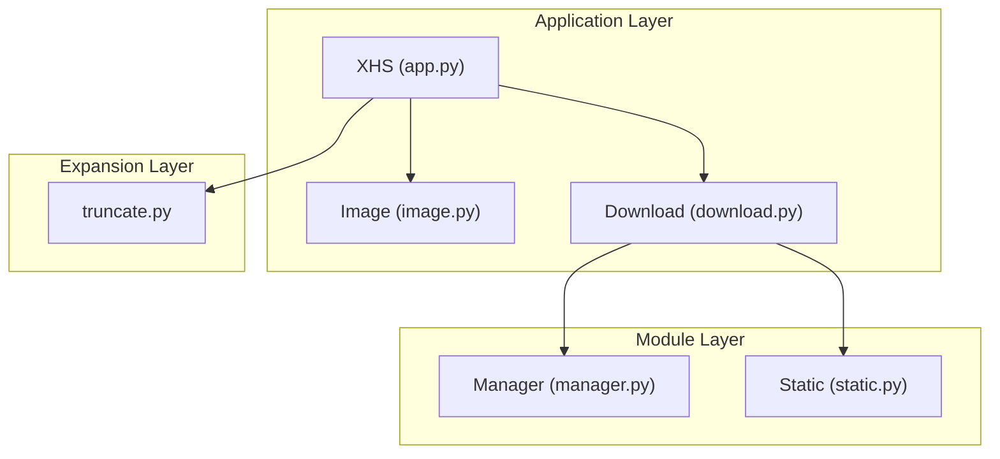
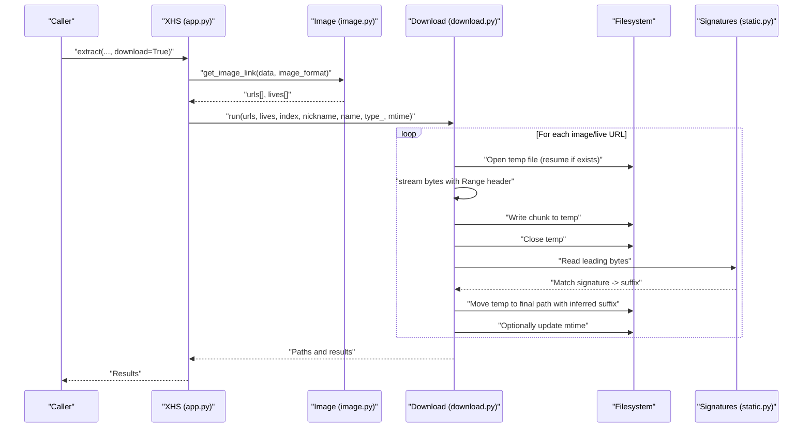
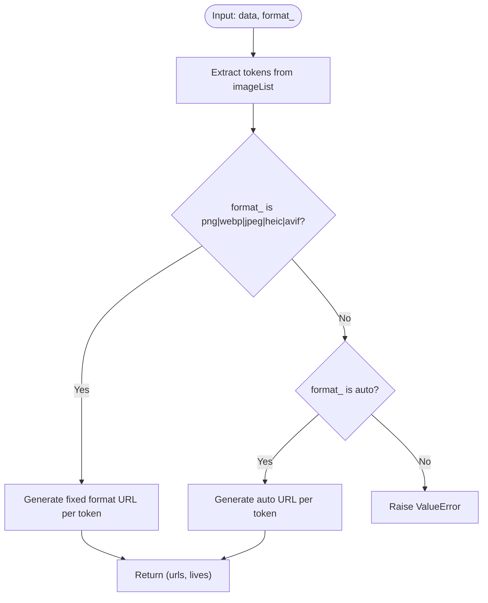
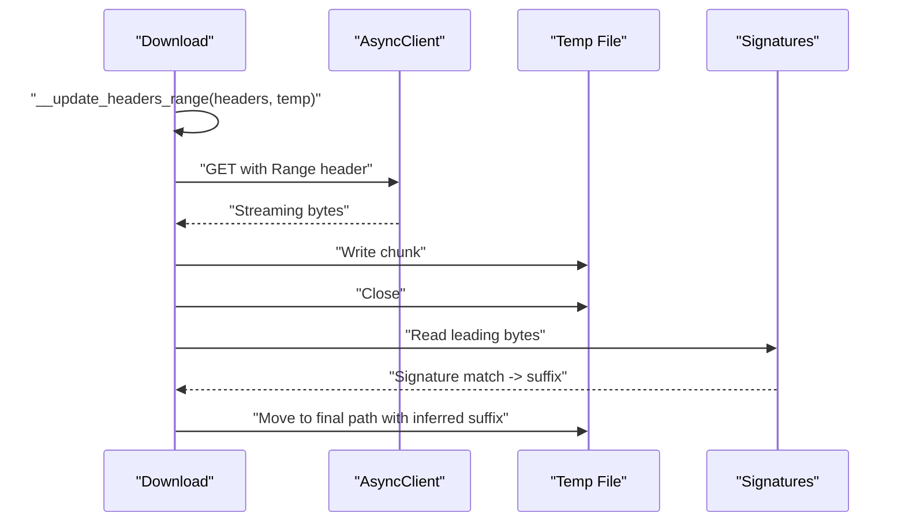
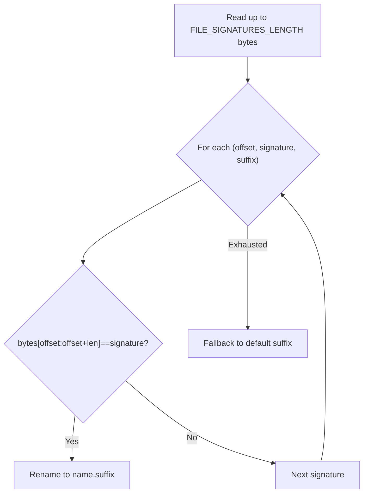
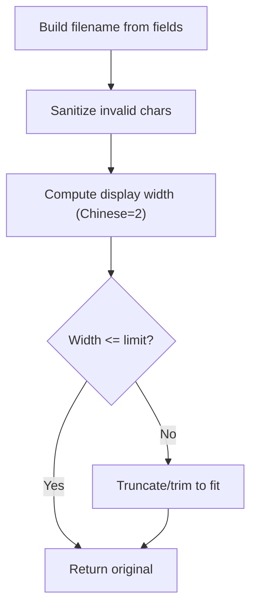
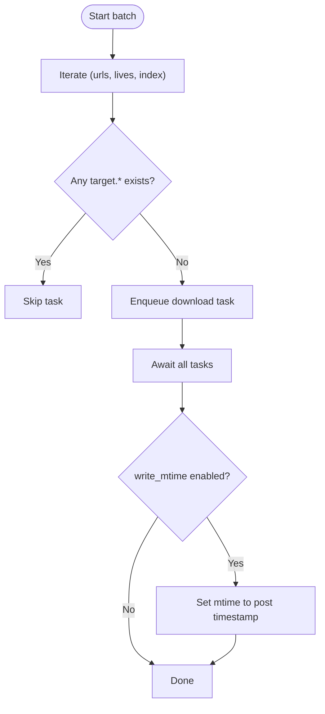
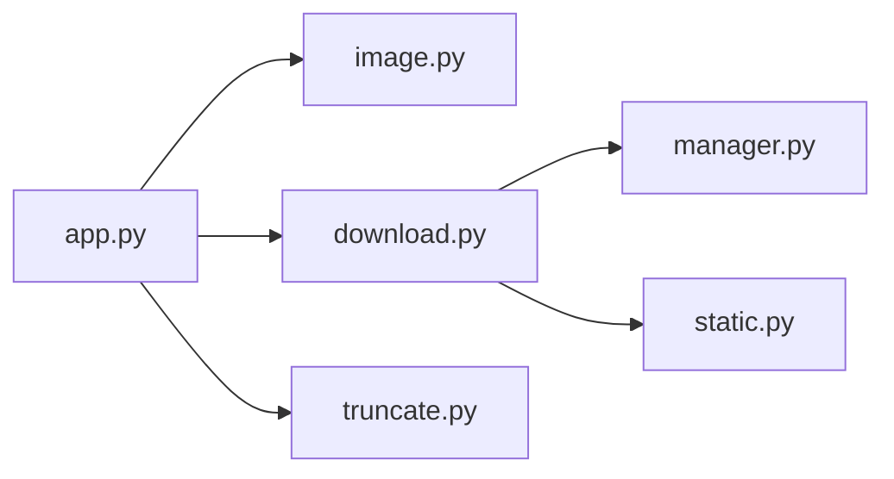

# File Conversion Utilities

<cite>
**Referenced Files in This Document**
- [converter.py](file://source/expansion/converter.py)
- [truncate.py](file://source/expansion/truncate.py)
- [image.py](file://source/application/image.py)
- [download.py](file://source/application/download.py)
- [static.py](file://source/module/static.py)
- [app.py](file://source/application/app.py)
- [manager.py](file://source/module/manager.py)
- [README.md](file://README.md)
</cite>

## Table of Contents
1. [Introduction](#introduction)
2. [Project Structure](#project-structure)
3. [Core Components](#core-components)
4. [Architecture Overview](#architecture-overview)
5. [Detailed Component Analysis](#detailed-component-analysis)
6. [Dependency Analysis](#dependency-analysis)
7. [Performance Considerations](#performance-considerations)
8. [Troubleshooting Guide](#troubleshooting-guide)
9. [Conclusion](#conclusion)

## Introduction
This document describes the file conversion utilities and the end-to-end image processing pipeline for converting and saving images in multiple formats (PNG, WEBP, JPEG, HEIC, AVIF). It explains how URLs are generated for fixed-format downloads, how raw bytes are written to disk, how file signatures are used to infer actual formats, and how filenames are truncated and sanitized. It also covers batch processing, metadata preservation via modification time, and filename length management with special character handling.

## Project Structure
The conversion-related logic spans several modules:
- URL generation for fixed-format image downloads
- Asynchronous streaming download with resume support
- Signature-based format detection after download
- Filename sanitization and truncation
- Batch orchestration and optional metadata updates

**Diagram sources**
- [app.py:147-183](file://source/application/app.py#L147-L183)
- [image.py:8-67](file://source/application/image.py#L8-L67)
- [download.py:30-70](file://source/application/download.py#L30-L70)
- [manager.py:28-132](file://source/module/manager.py#L28-L132)
- [static.py:39-72](file://source/module/static.py#L39-L72)
- [truncate.py:1-36](file://source/expansion/truncate.py#L1-L36)

**Section sources**
- [app.py:147-183](file://source/application/app.py#L147-L183)
- [image.py:8-67](file://source/application/image.py#L8-L67)
- [download.py:30-70](file://source/application/download.py#L30-L70)
- [manager.py:28-132](file://source/module/manager.py#L28-L132)
- [static.py:39-72](file://source/module/static.py#L39-L72)
- [truncate.py:1-36](file://source/expansion/truncate.py#L1-L36)

## Core Components
- Image URL generator: Produces fixed-format image URLs for PNG, WEBP, JPEG, HEIC, AVIF, and AUTO mode.
- Download orchestrator: Streams bytes to a temporary file, resumes partial downloads, and detects final format by file signature.
- Signature-based format detection: Reads leading bytes and matches against known signatures to rename the file to the correct extension.
- Filename truncation and sanitization: Ensures filenames fit filesystem limits and avoid invalid characters.
- Batch processing: Iterates over multiple image URLs and live GIF URLs, skipping existing files and honoring user preferences.

**Section sources**
- [image.py:23-39](file://source/application/image.py#L23-L39)
- [download.py:71-174](file://source/application/download.py#L71-L174)
- [download.py:196-267](file://source/application/download.py#L196-L267)
- [download.py:316-337](file://source/application/download.py#L316-L337)
- [static.py:39-72](file://source/module/static.py#L39-L72)
- [truncate.py:8-35](file://source/expansion/truncate.py#L8-L35)
- [manager.py:197-200](file://source/module/manager.py#L197-L200)

## Architecture Overview
The pipeline converts images by generating format-specific URLs, downloading raw bytes asynchronously, inferring the actual format from file signatures, and persisting the file with the correct extension. Optional metadata updates (modification time) and filename truncation occur during or after persistence.

**Diagram sources**
- [app.py:213-250](file://source/application/app.py#L213-L250)
- [image.py:10-39](file://source/application/image.py#L10-L39)
- [download.py:71-112](file://source/application/download.py#L71-L112)
- [download.py:196-267](file://source/application/download.py#L196-L267)
- [download.py:316-337](file://source/application/download.py#L316-L337)
- [static.py:39-72](file://source/module/static.py#L39-L72)

## Detailed Component Analysis

### Image URL Generation (Fixed-Format and Auto)
- Fixed-format mode: Generates URLs with a format parameter appended to the base token.
- Auto mode: Uses a CDN endpoint that returns the optimal format for the client.
- Live GIF URLs are extracted separately and handled similarly.

**Diagram sources**
- [image.py:10-39](file://source/application/image.py#L10-L39)

**Section sources**
- [image.py:10-39](file://source/application/image.py#L10-L39)

### Download Pipeline and Resume Logic
- Uses a semaphore to limit concurrent downloads.
- Streams bytes in chunks to a temporary file.
- Resumes partial downloads by setting a Range header based on existing file size.
- On completion, detects the actual file format via signatures and renames accordingly.

**Diagram sources**
- [download.py:196-267](file://source/application/download.py#L196-L267)
- [download.py:308-314](file://source/application/download.py#L308-L314)
- [download.py:316-337](file://source/application/download.py#L316-L337)
- [static.py:39-72](file://source/module/static.py#L39-L72)

**Section sources**
- [download.py:30-70](file://source/application/download.py#L30-L70)
- [download.py:196-267](file://source/application/download.py#L196-L267)
- [download.py:308-337](file://source/application/download.py#L308-L337)
- [static.py:39-72](file://source/module/static.py#L39-L72)

### Signature-Based Format Detection
- Reads up to a predefined number of leading bytes from the downloaded file.
- Matches against known signatures for JPEG, PNG, AVIF, HEIC, and WEBP.
- Renames the file to the detected suffix; otherwise falls back to the requested default suffix.

**Diagram sources**
- [download.py:316-337](file://source/application/download.py#L316-L337)
- [static.py:39-72](file://source/module/static.py#L39-L72)

**Section sources**
- [download.py:316-337](file://source/application/download.py#L316-L337)
- [static.py:39-72](file://source/module/static.py#L39-L72)

### Filename Truncation and Special Character Handling
- Filenames are constructed from user-specified fields and sanitized to remove invalid characters.
- Chinese characters are counted as two characters for width estimation.
- Truncation utilities provide:
  - Truncate to a maximum display width
  - Trim middle with ellipsis for long names
  - Beautify with balanced trimming for long names

**Diagram sources**
- [app.py:566-601](file://source/application/app.py#L566-L601)
- [truncate.py:8-35](file://source/expansion/truncate.py#L8-L35)
- [manager.py:197-200](file://source/module/manager.py#L197-L200)

**Section sources**
- [app.py:566-601](file://source/application/app.py#L566-L601)
- [truncate.py:8-35](file://source/expansion/truncate.py#L8-L35)
- [manager.py:197-200](file://source/module/manager.py#L197-L200)

### Batch Conversion and Metadata Preservation
- Batch mode iterates over multiple image URLs and optional live GIF URLs.
- Skips files that already exist with any of the supported extensions.
- Optionally writes the file’s modification time to match the post’s timestamp.

**Diagram sources**
- [download.py:140-174](file://source/application/download.py#L140-L174)
- [download.py:241-246](file://source/application/download.py#L241-L246)
- [manager.py:178-193](file://source/module/manager.py#L178-L193)

**Section sources**
- [download.py:140-174](file://source/application/download.py#L140-L174)
- [download.py:241-246](file://source/application/download.py#L241-L246)
- [manager.py:178-193](file://source/module/manager.py#L178-L193)

## Dependency Analysis
- The application orchestrator depends on the Image module for URL generation and the Download module for streaming and persistence.
- The Download module relies on Manager for clients, chunk sizes, and configuration flags.
- Signature detection is centralized in Static and reused by Download.
- Filename truncation and sanitization are used by the application layer during naming.

**Diagram sources**
- [app.py:147-183](file://source/application/app.py#L147-L183)
- [image.py:8-67](file://source/application/image.py#L8-L67)
- [download.py:30-70](file://source/application/download.py#L30-L70)
- [manager.py:28-132](file://source/module/manager.py#L28-L132)
- [static.py:39-72](file://source/module/static.py#L39-L72)
- [truncate.py:1-36](file://source/expansion/truncate.py#L1-L36)

**Section sources**
- [app.py:147-183](file://source/application/app.py#L147-L183)
- [image.py:8-67](file://source/application/image.py#L8-L67)
- [download.py:30-70](file://source/application/download.py#L30-L70)
- [manager.py:28-132](file://source/module/manager.py#L28-L132)
- [static.py:39-72](file://source/module/static.py#L39-L72)
- [truncate.py:1-36](file://source/expansion/truncate.py#L1-L36)

## Performance Considerations
- Concurrency control: A semaphore limits simultaneous downloads to a fixed worker count to balance throughput and resource usage.
- Streaming with resume: Downloads are resumed using Range headers to minimize network overhead and disk I/O for large files.
- Chunk size tuning: The chunk size controls memory footprint during streaming; larger chunks reduce syscall overhead but increase memory usage.
- Signature scanning: Scanning reads a bounded number of leading bytes, minimizing overhead while ensuring accurate format detection.
- Filename operations: Truncation and sanitization are O(n) with small constants; they are performed once per file.

Recommendations:
- Adjust chunk size and worker count according to network bandwidth and CPU capacity.
- Prefer AUTO mode when server-side selection yields smaller files.
- Monitor disk I/O and adjust concurrency to avoid saturation.

**Section sources**
- [download.py:30-70](file://source/application/download.py#L30-L70)
- [download.py:308-314](file://source/application/download.py#L308-L314)
- [static.py:65-67](file://source/module/static.py#L65-L67)
- [truncate.py:8-35](file://source/expansion/truncate.py#L8-L35)

## Troubleshooting Guide
Common issues and resolutions:
- Unexpected file extension: The final extension is determined by signature matching; if the detected format differs from the requested format, verify the source file’s signature.
- Partial downloads: The pipeline resumes automatically using Range requests; if resume fails, delete the temp file and re-run.
- Filename collisions: The system checks for existence across all supported extensions; if a file with the same name and any extension exists, it is skipped.
- Metadata not updated: Ensure the write_mtime flag is enabled and a valid timestamp is provided; the system sets the file’s modification time after moving.

Operational tips:
- Verify image_format settings (AUTO, PNG, WEBP, JPEG, HEIC, AVIF) align with intended output.
- Confirm chunk size and worker count are appropriate for your environment.
- Review logs for signature detection failures and adjust fallback behavior if needed.

**Section sources**
- [download.py:196-267](file://source/application/download.py#L196-L267)
- [download.py:316-337](file://source/application/download.py#L316-L337)
- [manager.py:178-193](file://source/module/manager.py#L178-L193)

## Conclusion
The file conversion utilities provide a robust pipeline for downloading images in multiple formats, detecting actual formats via file signatures, and persisting files with correct extensions. The system supports batch processing, intelligent resume, configurable concurrency, and filename truncation with special character handling. By leveraging AUTO mode and signature-based detection, the pipeline adapts to server-provided formats while maintaining predictable output and efficient resource usage.