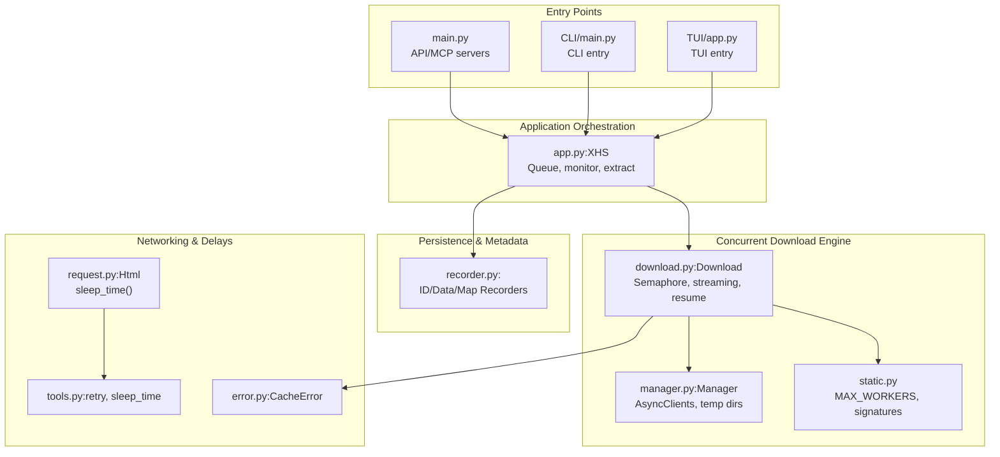
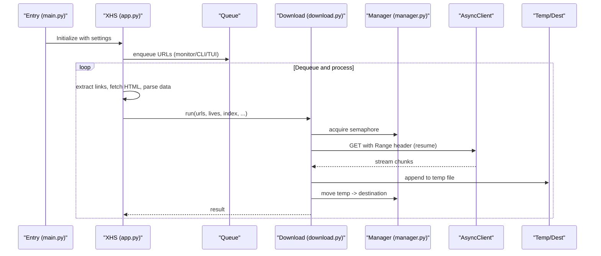
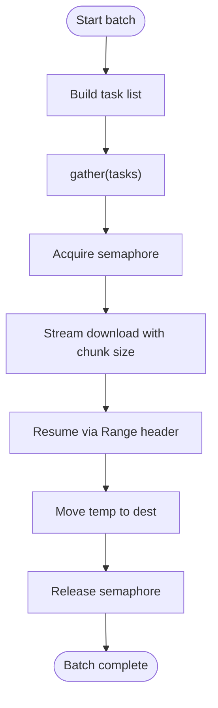
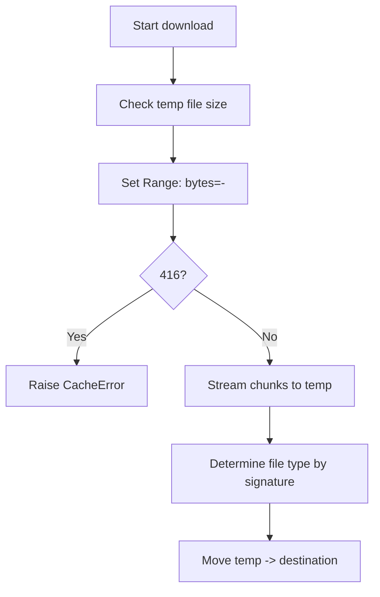
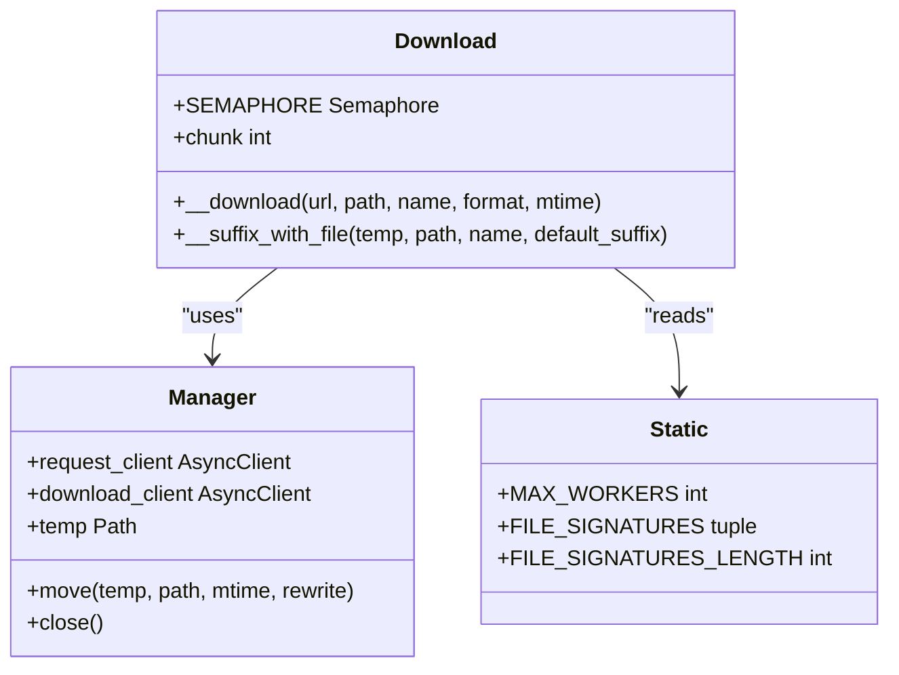
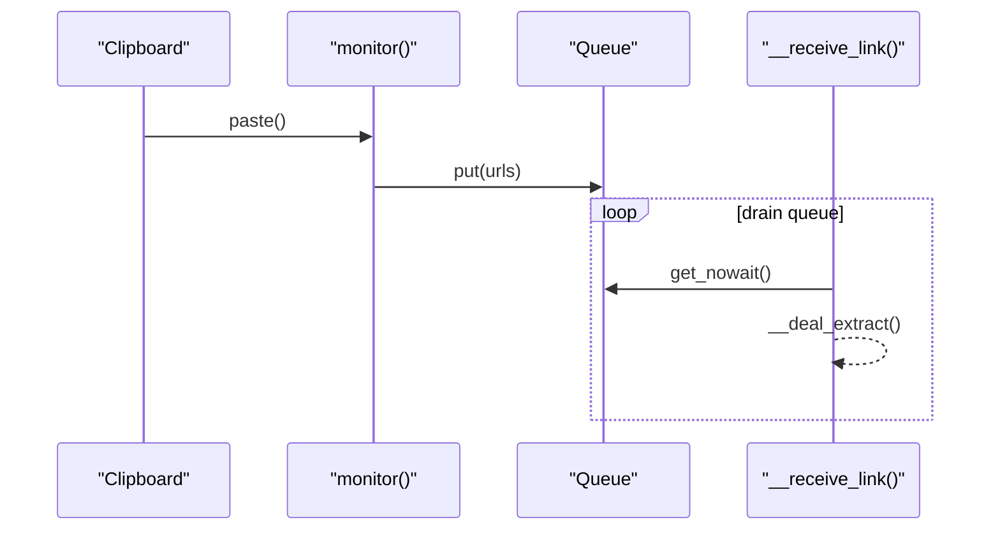
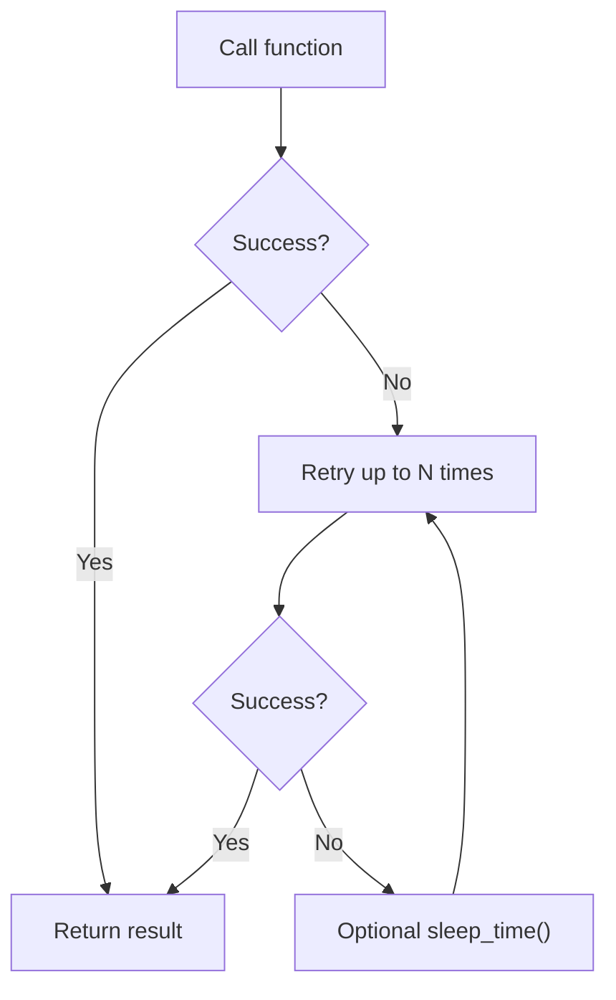
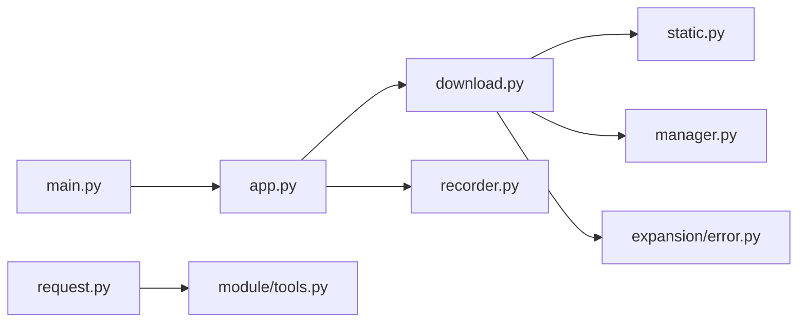

# Performance Optimization

<cite>
**Referenced Files in This Document**
- [download.py](file://source/application/download.py)
- [app.py](file://source/application/app.py)
- [manager.py](file://source/module/manager.py)
- [static.py](file://source/module/static.py)
- [tools.py](file://source/module/tools.py)
- [request.py](file://source/application/request.py)
- [recorder.py](file://source/module/recorder.py)
- [error.py](file://source/expansion/error.py)
- [main.py](file://main.py)
- [CLI/main.py](file://source/CLI/main.py)
- [TUI/app.py](file://source/TUI/app.py)
</cite>

## Table of Contents
1. [Introduction](#introduction)
2. [Project Structure](#project-structure)
3. [Core Components](#core-components)
4. [Architecture Overview](#architecture-overview)
5. [Detailed Component Analysis](#detailed-component-analysis)
6. [Dependency Analysis](#dependency-analysis)
7. [Performance Considerations](#performance-considerations)
8. [Troubleshooting Guide](#troubleshooting-guide)
9. [Conclusion](#conclusion)
10. [Appendices](#appendices)

## Introduction
This document focuses on performance optimization features in the project, including intelligent caching, batch processing, and resource management. It explains how extracted data, downloaded files, and processed content are cached or tracked, how concurrent processing is achieved via semaphore-based resource control, and how memory and throughput are optimized. Practical tuning guidelines, monitoring approaches, and scalability considerations are included to help operators achieve reliable, high-throughput operations.

## Project Structure
The performance-critical parts of the system are organized around:
- Application orchestration and queueing
- Concurrent download execution with throttling
- Resource clients and temporary storage
- Persistent records for deduplication and metadata
- Configuration-driven tuning knobs

**Diagram sources**
- [main.py:12-60](file://main.py#L12-L60)
- [CLI/main.py:39-110](file://source/CLI/main.py#L39-L110)
- [TUI/app.py:18-41](file://source/TUI/app.py#L18-L41)
- [app.py:98-194](file://source/application/app.py#L98-L194)
- [download.py:30-338](file://source/application/download.py#L30-L338)
- [manager.py:28-308](file://source/module/manager.py#L28-L308)
- [static.py:69-73](file://source/module/static.py#L69-L73)
- [request.py:15-138](file://source/application/request.py#L15-L138)
- [tools.py:13-64](file://source/module/tools.py#L13-L64)
- [recorder.py:13-192](file://source/module/recorder.py#L13-L192)
- [error.py:1-8](file://source/expansion/error.py#L1-L8)

**Section sources**
- [main.py:12-60](file://main.py#L12-L60)
- [CLI/main.py:39-110](file://source/CLI/main.py#L39-L110)
- [TUI/app.py:18-41](file://source/TUI/app.py#L18-L41)
- [app.py:98-194](file://source/application/app.py#L98-L194)
- [download.py:30-338](file://source/application/download.py#L30-L338)
- [manager.py:28-308](file://source/module/manager.py#L28-L308)
- [static.py:69-73](file://source/module/static.py#L69-L73)
- [request.py:15-138](file://source/application/request.py#L15-L138)
- [tools.py:13-64](file://source/module/tools.py#L13-L64)
- [recorder.py:13-192](file://source/module/recorder.py#L13-L192)
- [error.py:1-8](file://source/expansion/error.py#L1-L8)

## Core Components
- Concurrency control: A global semaphore limits concurrent downloads to a tunable worker count.
- Streaming and resuming: Downloads stream chunks to disk and resume partial files using Range requests.
- Temporary staging area: Partial downloads are written to a temp directory and moved atomically upon completion.
- Deduplication and metadata: SQLite-backed recorders prevent redundant processing and persist metadata.
- Retry and backoff: Decorators and randomized delays reduce pressure on remote systems and improve resilience.
- Queue-based batching: A queue decouples clipboard monitoring from processing, enabling throughput scaling.

**Section sources**
- [download.py:30-338](file://source/application/download.py#L30-L338)
- [manager.py:28-308](file://source/module/manager.py#L28-L308)
- [static.py:69-73](file://source/module/static.py#L69-L73)
- [recorder.py:13-192](file://source/module/recorder.py#L13-L192)
- [tools.py:13-64](file://source/module/tools.py#L13-L64)
- [app.py:603-651](file://source/application/app.py#L603-L651)

## Architecture Overview
The system orchestrates extraction, optional metadata recording, and concurrent downloading. Requests are rate-limited by randomized delays and retries. Downloads are executed concurrently under a semaphore, stream in chunks, and resume automatically when supported.

**Diagram sources**
- [main.py:12-60](file://main.py#L12-L60)
- [app.py:603-651](file://source/application/app.py#L603-L651)
- [download.py:71-112](file://source/application/download.py#L71-L112)
- [download.py:196-268](file://source/application/download.py#L196-L268)
- [manager.py:100-124](file://source/module/manager.py#L100-L124)

## Detailed Component Analysis

### Concurrency Control and Batch Processing
- Global concurrency is controlled by a semaphore initialized with a fixed worker count.
- The download engine builds a list of tasks and awaits them concurrently.
- Queue-based processing enables batching of incoming URLs and decouples producers from consumers.

**Diagram sources**
- [download.py:71-112](file://source/application/download.py#L71-L112)
- [download.py:196-268](file://source/application/download.py#L196-L268)
- [static.py:69](file://source/module/static.py#L69)
- [app.py:631-649](file://source/application/app.py#L631-L649)

**Section sources**
- [download.py:30-338](file://source/application/download.py#L30-L338)
- [static.py:69](file://source/module/static.py#L69)
- [app.py:631-649](file://source/application/app.py#L631-L649)

### Intelligent Caching Strategies
- File resume via HTTP Range: The downloader sets a Range header based on existing temp file size and handles 416 responses as cache anomalies.
- Temporary staging: Partial downloads are written to a temp directory and atomically moved upon completion.
- Deduplication: A persistent ID recorder prevents reprocessing items already downloaded.
- Metadata caching: Optional data recorder persists structured metadata for downstream analytics.

**Diagram sources**
- [download.py:196-268](file://source/application/download.py#L196-L268)
- [download.py:316-338](file://source/application/download.py#L316-L338)
- [error.py:1-8](file://source/expansion/error.py#L1-L8)
- [manager.py:178-193](file://source/module/manager.py#L178-L193)

**Section sources**
- [download.py:196-268](file://source/application/download.py#L196-L268)
- [download.py:316-338](file://source/application/download.py#L316-L338)
- [error.py:1-8](file://source/expansion/error.py#L1-L8)
- [manager.py:178-193](file://source/module/manager.py#L178-L193)

### Resource Management and Memory Optimization
- Chunked streaming: Downloads use configurable chunk sizes to balance memory footprint and throughput.
- Asynchronous clients: Separate request and download clients configured with timeouts and proxy support.
- Temporary directory lifecycle: Ensures cleanup of temp artifacts and empty directories on exit.
- File signature detection: Determines file type by reading minimal header bytes to avoid misclassification.

**Diagram sources**
- [manager.py:28-308](file://source/module/manager.py#L28-L308)
- [download.py:30-338](file://source/application/download.py#L30-L338)
- [static.py:39-73](file://source/module/static.py#L39-L73)

**Section sources**
- [manager.py:100-124](file://source/module/manager.py#L100-L124)
- [download.py:20-25](file://source/application/download.py#L20-L25)
- [static.py:39-73](file://source/module/static.py#L39-L73)

### Queue Management and Throughput Optimization
- Clipboard monitoring pushes URLs into a queue; a consumer loop drains the queue and processes items.
- Queue size allows bursts during high-volume input; the consumer sleeps briefly to avoid busy-waiting.
- Parallelism is bounded by the semaphore; tune workers and chunk size to maximize throughput per endpoint.

**Diagram sources**
- [app.py:603-651](file://source/application/app.py#L603-L651)

**Section sources**
- [app.py:603-651](file://source/application/app.py#L603-L651)

### Retries, Delays, and Resilience
- Retry decorator attempts a function multiple times on failure.
- Randomized delays between requests smooth traffic and reduce throttling risk.
- Dedicated exception type signals cache inconsistencies requiring restart.

**Diagram sources**
- [tools.py:13-22](file://source/module/tools.py#L13-L22)
- [tools.py:54-64](file://source/module/tools.py#L54-L64)
- [request.py:26-70](file://source/application/request.py#L26-L70)
- [error.py:1-8](file://source/expansion/error.py#L1-L8)

**Section sources**
- [tools.py:13-22](file://source/module/tools.py#L13-L22)
- [tools.py:54-64](file://source/module/tools.py#L54-L64)
- [request.py:26-70](file://source/application/request.py#L26-L70)
- [error.py:1-8](file://source/expansion/error.py#L1-L8)

## Dependency Analysis
- Concurrency and throughput are primarily governed by the semaphore and chunk size.
- Persistence depends on SQLite recorders; ensure database files are not locked by external processes.
- Networking relies on asynchronous HTTP clients with optional proxies; timeouts and retries mitigate transient failures.

**Diagram sources**
- [download.py:30-338](file://source/application/download.py#L30-L338)
- [static.py:69-73](file://source/module/static.py#L69-L73)
- [manager.py:28-308](file://source/module/manager.py#L28-L308)
- [error.py:1-8](file://source/expansion/error.py#L1-L8)
- [app.py:98-194](file://source/application/app.py#L98-L194)
- [recorder.py:13-192](file://source/module/recorder.py#L13-L192)
- [request.py:15-138](file://source/application/request.py#L15-L138)
- [tools.py:13-64](file://source/module/tools.py#L13-L64)
- [main.py:12-60](file://main.py#L12-L60)

**Section sources**
- [download.py:30-338](file://source/application/download.py#L30-L338)
- [static.py:69-73](file://source/module/static.py#L69-L73)
- [manager.py:28-308](file://source/module/manager.py#L28-L308)
- [error.py:1-8](file://source/expansion/error.py#L1-L8)
- [app.py:98-194](file://source/application/app.py#L98-L194)
- [recorder.py:13-192](file://source/module/recorder.py#L13-L192)
- [request.py:15-138](file://source/application/request.py#L15-L138)
- [tools.py:13-64](file://source/module/tools.py#L13-L64)
- [main.py:12-60](file://main.py#L12-L60)

## Performance Considerations
- Worker count: Increase cautiously; higher concurrency improves throughput but may hit network or server limits. Tune MAX_WORKERS to observed saturation.
- Chunk size: Larger chunks reduce overhead but increase memory usage. Adjust chunk based on available RAM and typical file sizes.
- Rate limiting: Keep randomized delays enabled to avoid throttling; disable only when necessary and monitor response codes.
- Disk I/O: Ensure temp and destination paths are on fast local storage; avoid network drives for temp to minimize latency.
- Database contention: Close recorders properly; avoid long-lived connections and ensure no external processes lock DB files.
- Proxy and timeouts: Configure appropriate timeouts and proxies to avoid stalls; monitor for connection errors and adjust retry counts.

[No sources needed since this section provides general guidance]

## Troubleshooting Guide
- 416 Range Not Satisfiable: Indicates cache inconsistency; the code raises a dedicated exception to signal restart. Clear the temp file and retry.
- Network errors: Inspect logs for HTTP exceptions; verify connectivity, proxy settings, and timeouts.
- Duplicate downloads: Confirm ID recorder is enabled and functioning; check for stale locks on database files.
- Slow throughput: Reduce worker count or chunk size; verify disk I/O and network bandwidth; ensure no CPU-bound processes interfere.

**Section sources**
- [download.py:219-223](file://source/application/download.py#L219-L223)
- [error.py:1-8](file://source/expansion/error.py#L1-L8)
- [recorder.py:13-192](file://source/module/recorder.py#L13-L192)
- [manager.py:205-211](file://source/module/manager.py#L205-L211)

## Conclusion
The system achieves robust performance through a combination of semaphore-controlled concurrency, streaming with resume, temporary staging, and SQLite-backed deduplication. Tuning worker count, chunk size, and delays balances throughput and reliability. Queue-based processing and optional API/MCP endpoints enable scalable automation. Monitoring logs and database health ensures sustained operation.

[No sources needed since this section summarizes without analyzing specific files]

## Appendices

### Practical Tuning Examples
- Increase concurrency: Raise MAX_WORKERS moderately and observe response times; watch for 429/5xx errors indicating overload.
- Optimize chunk size: Start with larger chunks for large files; reduce for constrained memory environments.
- Enable metadata recording: Useful for auditing and post-processing; note additional I/O overhead.
- Use proxies judiciously: Prefer stable proxies with sufficient bandwidth; test connectivity before heavy runs.

[No sources needed since this section provides general guidance]