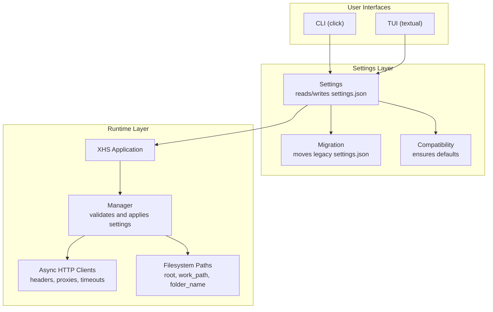
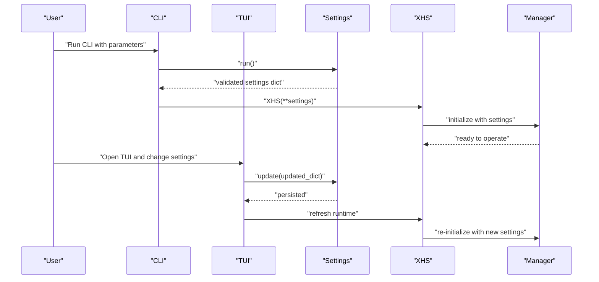
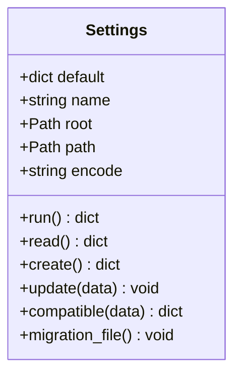
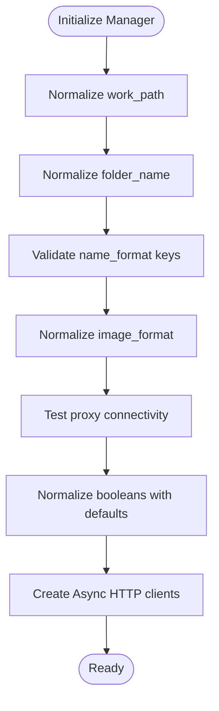
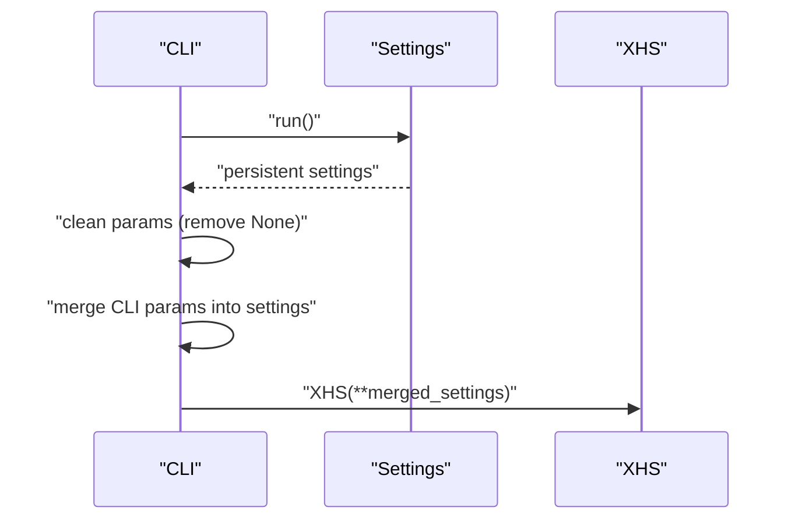
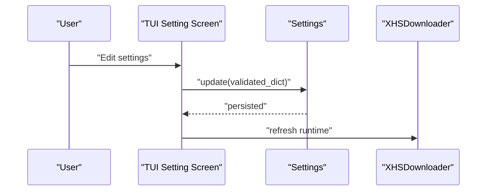
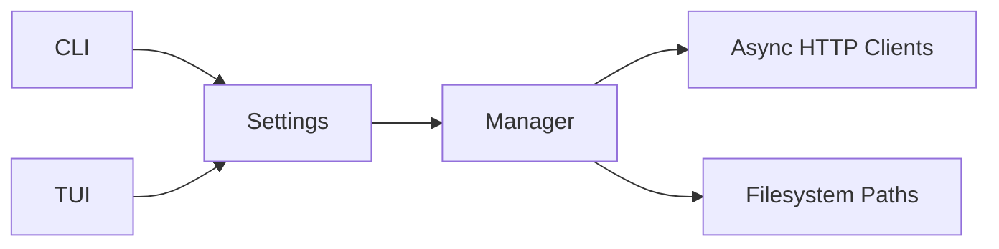

# Configuration Management

<cite>
**Referenced Files in This Document**
- [settings.py](file://source/module/settings.py)
- [manager.py](file://source/module/manager.py)
- [static.py](file://source/module/static.py)
- [app.py](file://source/application/app.py)
- [main.py](file://source/CLI/main.py)
- [setting.py](file://source/TUI/setting.py)
- [app.py](file://source/TUI/app.py)
- [README.md](file://README.md)
- [README_EN.md](file://README_EN.md)
</cite>

## Table of Contents
1. [Introduction](#introduction)
2. [Project Structure](#project-structure)
3. [Core Components](#core-components)
4. [Architecture Overview](#architecture-overview)
5. [Detailed Component Analysis](#detailed-component-analysis)
6. [Dependency Analysis](#dependency-analysis)
7. [Performance Considerations](#performance-considerations)
8. [Troubleshooting Guide](#troubleshooting-guide)
9. [Conclusion](#conclusion)
10. [Appendices](#appendices)

## Introduction
This document explains the configuration management system in XHS-Downloader with a focus on the JSON-based settings persistence, parameter validation, and migration procedures. It covers the settings.json file structure, the Settings manager class, parameter validation and defaults, configuration inheritance and precedence, and practical examples for common use cases. It also describes the relationship between runtime settings and persistent configuration, backup and restoration strategies, and troubleshooting guidance.

## Project Structure
The configuration system centers around a JSON file (settings.json) located under a Volume directory. The Settings class reads, validates, and writes this file. The Manager class consumes validated settings to initialize HTTP clients, file paths, and download preferences. The CLI and TUI layers integrate Settings to provide runtime configuration and persistence.

**Diagram sources**
- [settings.py:10-124](file://source/module/settings.py#L10-L124)
- [manager.py:28-308](file://source/module/manager.py#L28-L308)
- [app.py:98-194](file://source/application/app.py#L98-L194)
- [main.py:12-60](file://source/CLI/main.py#L12-L60)
- [app.py:18-126](file://source/TUI/app.py#L18-L126)

**Section sources**
- [settings.py:10-124](file://source/module/settings.py#L10-L124)
- [manager.py:28-308](file://source/module/manager.py#L28-L308)
- [app.py:98-194](file://source/application/app.py#L98-L194)
- [main.py:12-60](file://source/CLI/main.py#L12-L60)
- [app.py:18-126](file://source/TUI/app.py#L18-L126)

## Core Components
- Settings: Reads and writes settings.json, performs migration and compatibility checks, and exposes a merged dictionary of current settings.
- Manager: Validates and applies settings to runtime behavior (paths, headers, proxies, timeouts, download preferences).
- CLI and TUI: Provide parameter entry and persistence, integrating with Settings to update and reload configuration.

Key responsibilities:
- Persistence: JSON file-based settings with automatic creation and migration.
- Validation: Type-safe conversion, default fallbacks, and normalization.
- Precedence: CLI/TUI parameters override persistent settings; runtime parameters override persistent settings when passed directly to XHS.

**Section sources**
- [settings.py:10-124](file://source/module/settings.py#L10-L124)
- [manager.py:28-308](file://source/module/manager.py#L28-L308)
- [main.py:39-74](file://source/CLI/main.py#L39-L74)
- [app.py:18-126](file://source/TUI/app.py#L18-L126)

## Architecture Overview
The configuration lifecycle:
- Initialization: Settings.run() migrates legacy files, reads settings.json, ensures defaults, and returns a validated dictionary.
- Runtime: XHS constructor receives the validated settings dictionary and passes them to Manager, which creates HTTP clients and filesystem paths.
- Persistence: CLI and TUI update settings.json via Settings.update() and refresh runtime state.

**Diagram sources**
- [settings.py:52-124](file://source/module/settings.py#L52-L124)
- [main.py:12-60](file://source/CLI/main.py#L12-L60)
- [app.py:18-126](file://source/TUI/app.py#L18-L126)
- [app.py:98-194](file://source/application/app.py#L98-L194)

## Detailed Component Analysis

### Settings Manager Class
The Settings class encapsulates:
- Default configuration dictionary with all supported parameters.
- File migration from legacy locations.
- Read, create, and update operations on settings.json.
- Compatibility checks to ensure all defaults are present.

**Diagram sources**
- [settings.py:10-124](file://source/module/settings.py#L10-L124)

Key behaviors:
- Migration: Moves settings.json from parent directory to the new location if needed.
- Compatibility: Ensures missing keys are filled with defaults and persisted.
- Encoding: Uses UTF-8-SIG on Windows, UTF-8 elsewhere.

**Section sources**
- [settings.py:10-124](file://source/module/settings.py#L10-L124)

### Manager Parameter Validation and Application
The Manager class validates and applies settings:
- Path and folder resolution with fallbacks.
- Name format validation against supported keys.
- Image format normalization.
- Proxy testing and tip logging.
- Boolean normalization with defaults.
- Video preference normalization.
- Cookie string to dict conversion.
- Creation of Async HTTP clients with headers, cookies, timeouts, and proxy mounts.

**Diagram sources**
- [manager.py:53-133](file://source/module/manager.py#L53-L133)

Validation highlights:
- Path resolution prefers explicit path, falls back to root, and attempts to create missing directories.
- Name format validation ensures only supported keys are used; otherwise defaults to a safe format.
- Image format accepts AUTO/PNG/WEBP/JPEG/HEIC/AVIF and normalizes to lowercase.
- Proxy testing performs a quick GET to verify connectivity and logs warnings on failure.
- Boolean normalization ensures only boolean values are accepted, defaulting to provided defaults otherwise.
- Video preference accepts resolution/bitrate/size and defaults to resolution.

**Section sources**
- [manager.py:53-308](file://source/module/manager.py#L53-L308)

### CLI Parameter Handling and Precedence
The CLI layer merges persistent settings with command-line arguments:
- Reads settings.json via Settings().
- Cleans parameters by removing nulls.
- Merges CLI parameters into the settings dictionary.
- Forces script_server to False for CLI runs.
- Instantiates XHS with the merged settings.

Precedence:
- CLI flags override persistent settings.
- Runtime parameters passed to XHS override persistent settings when provided directly.

**Diagram sources**
- [main.py:39-74](file://source/CLI/main.py#L39-L74)

**Section sources**
- [main.py:39-74](file://source/CLI/main.py#L39-L74)

### TUI Settings UI and Persistence
The TUI allows interactive editing of settings:
- Renders inputs for all parameters.
- Persists changes via Settings.update() and refreshes runtime state.
- Provides immediate feedback and validation through Manager’s normalization.

**Diagram sources**
- [setting.py:26-271](file://source/TUI/setting.py#L26-L271)
- [app.py:66-106](file://source/TUI/app.py#L66-L106)

**Section sources**
- [setting.py:26-271](file://source/TUI/setting.py#L26-L271)
- [app.py:66-106](file://source/TUI/app.py#L66-L106)

### Configuration File Structure and Parameters
The settings.json file contains all supported parameters. The README documents the full list with types, meanings, and defaults. The Settings.default dictionary defines the canonical set of parameters and their defaults.

Supported parameters include:
- mapping_data: author alias mapping
- work_path: root path for downloads
- folder_name: base folder for downloads
- name_format: filename template using supported keys
- user_agent: request header
- cookie: session cookie string
- proxy: proxy URL or None
- timeout: request timeout in seconds
- chunk: download chunk size in bytes
- max_retry: maximum retry attempts
- record_data: whether to record metadata
- image_format: PNG/WEBP/JPEG/HEIC/AUTO
- image_download, video_download, live_download: toggles
- video_preference: resolution/bitrate/size
- folder_mode: per-note folder layout
- download_record: skip already-downloaded IDs
- author_archive: per-author folder layout
- write_mtime: set file mtime to publish time
- language: zh_CN/en_US
- script_server: enable user script server

Defaults and normalization are enforced by Settings and Manager.

**Section sources**
- [settings.py:12-37](file://source/module/settings.py#L12-L37)
- [README.md:357-503](file://README.md#L357-L503)
- [README_EN.md:361-507](file://README_EN.md#L361-L507)

### Configuration Inheritance, Defaults, and Precedence
- Inheritance: Manager inherits validated settings from Settings and applies runtime normalization.
- Defaults: Settings.default provides canonical defaults; Manager normalizes values to safe defaults when needed.
- Precedence:
  - CLI flags override persistent settings.
  - Runtime parameters passed to XHS override persistent settings when provided directly.
  - Manager normalizes values to safe defaults if invalid.

**Section sources**
- [settings.py:12-37](file://source/module/settings.py#L12-L37)
- [manager.py:202-203](file://source/module/manager.py#L202-L203)
- [main.py:39-74](file://source/CLI/main.py#L39-L74)

### Practical Examples
Common scenarios and recommended configurations:
- High-speed LAN with stable connection:
  - Increase chunk size for throughput.
  - Keep default timeout; adjust max_retry to 3–5.
- Low-bandwidth or unstable networks:
  - Reduce chunk size to 1–2 MB.
  - Increase max_retry to 8–10.
  - Enable write_mtime for auditability.
- Privacy-sensitive environments:
  - Use a dedicated proxy; set proxy and timeout conservatively.
  - Disable record_data and download_record to minimize disk footprint.
- Multi-user or shared machines:
  - Use author_archive to organize by author.
  - Set language to en_US for international teams.
- API/MCP usage:
  - Pass cookie and proxy via API payload; rely on persistent settings for defaults.

These examples illustrate how to balance performance, reliability, and privacy using the documented parameters.

[No sources needed since this section provides general guidance]

## Dependency Analysis
The configuration system spans three layers:
- Settings: Pure JSON persistence with migration and compatibility.
- Manager: Runtime application of validated settings.
- CLI/TUI: Parameter entry and persistence.

**Diagram sources**
- [settings.py:10-124](file://source/module/settings.py#L10-L124)
- [manager.py:28-308](file://source/module/manager.py#L28-L308)
- [main.py:39-74](file://source/CLI/main.py#L39-L74)
- [app.py:18-126](file://source/TUI/app.py#L18-L126)

**Section sources**
- [settings.py:10-124](file://source/module/settings.py#L10-L124)
- [manager.py:28-308](file://source/module/manager.py#L28-L308)
- [main.py:39-74](file://source/CLI/main.py#L39-L74)
- [app.py:18-126](file://source/TUI/app.py#L18-L126)

## Performance Considerations
- Chunk size: Larger chunks improve throughput on stable connections; smaller chunks reduce memory usage and improve responsiveness on constrained systems.
- Timeout and retries: Higher values increase robustness but slow down failures; tune based on network stability.
- Proxies: Testing proxies adds latency; disable testing in production or cache results externally.
- Filesystem operations: author_archive and folder_mode increase I/O; use sparingly for large-scale downloads.
- Language and script_server: Minimal overhead; primarily for user experience and integration.

[No sources needed since this section provides general guidance]

## Troubleshooting Guide
Common issues and resolutions:
- Invalid parameter values:
  - Symptom: Unexpected behavior or fallback to defaults.
  - Resolution: Edit settings.json to valid values; ensure booleans are true/false and integers are numeric.
- Missing settings.json:
  - Symptom: First-run defaults applied unexpectedly.
  - Resolution: Allow Settings to create settings.json; verify path and permissions.
- Legacy settings.json in old location:
  - Symptom: Settings not applied after upgrade.
  - Resolution: Migration moves settings.json automatically; verify new path exists.
- Proxy connectivity:
  - Symptom: Slow or failing downloads.
  - Resolution: Manager tests proxy; adjust proxy URL or disable; verify network access.
- Cookie issues:
  - Symptom: Low-resolution videos or rate limiting.
  - Resolution: Obtain and set a valid cookie; ensure format is a single string.
- Language and script_server:
  - Symptom: UI or server not responding as expected.
  - Resolution: Verify language selection and script_server toggle; restart after changes.

Backup and restore:
- Backup: Copy settings.json to a safe location.
- Restore: Replace settings.json with the backed-up file; restart the application.

**Section sources**
- [settings.py:52-124](file://source/module/settings.py#L52-L124)
- [manager.py:225-259](file://source/module/manager.py#L225-L259)
- [README.md:357-359](file://README.md#L357-L359)

## Conclusion
XHS-Downloader’s configuration management is centered on a robust JSON settings.json with automatic migration and compatibility checks. The Settings class ensures defaults and persistence, while Manager validates and applies settings at runtime. CLI and TUI layers provide intuitive parameter entry and persistence, with clear precedence rules. By tuning parameters like chunk size, timeout, and retries, users can optimize performance for diverse platforms and network conditions. Proper backup and restoration practices protect configurations across upgrades and migrations.

[No sources needed since this section summarizes without analyzing specific files]

## Appendices

### Appendix A: Parameter Reference and Defaults
- mapping_data: str: str (alias mapping)
- work_path: str (root path)
- folder_name: str (default: Download)
- name_format: str (supports keys:收藏数量, 评论数量, 分享数量, 点赞数量, 作品标签, 作品ID, 作品标题, 作品描述, 作品类型, 发布时间, 最后更新时间, 作者昵称, 作者ID)
- user_agent: str (default: built-in Chrome UA)
- cookie: str (session cookie)
- proxy: str | None (default: None)
- timeout: int (seconds, default: 10)
- chunk: int (bytes, default: 2097152)
- max_retry: int (default: 5)
- record_data: bool (default: False)
- image_format: str (AUTO/PNG/WEBP/JPEG/HEIC/AVIF, default: JPEG)
- image_download: bool (default: True)
- video_download: bool (default: True)
- live_download: bool (default: False)
- video_preference: str (resolution/bitrate/size, default: resolution)
- folder_mode: bool (default: False)
- download_record: bool (default: True)
- author_archive: bool (default: False)
- write_mtime: bool (default: False)
- language: str (zh_CN/en_US, default: zh_CN)
- script_server: bool (default: False)

**Section sources**
- [settings.py:12-37](file://source/module/settings.py#L12-L37)
- [README.md:357-503](file://README.md#L357-L503)
- [README_EN.md:361-507](file://README_EN.md#L361-L507)