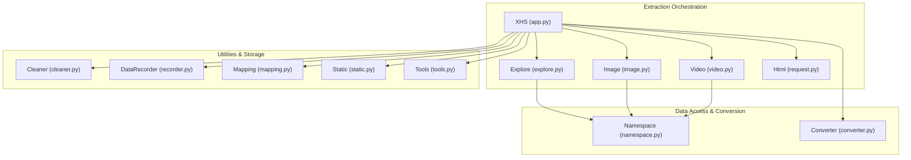
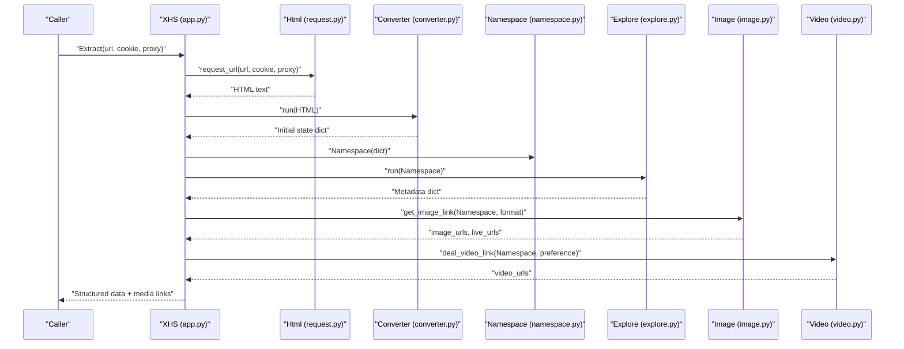
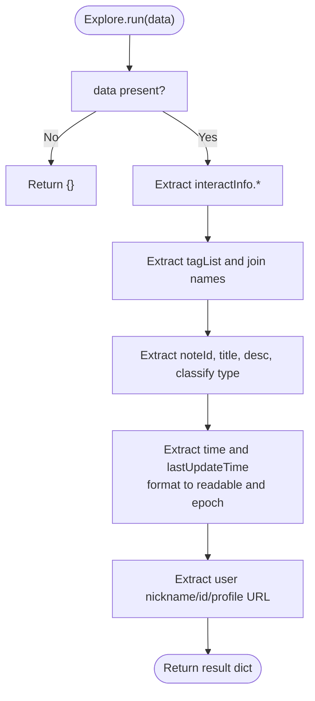
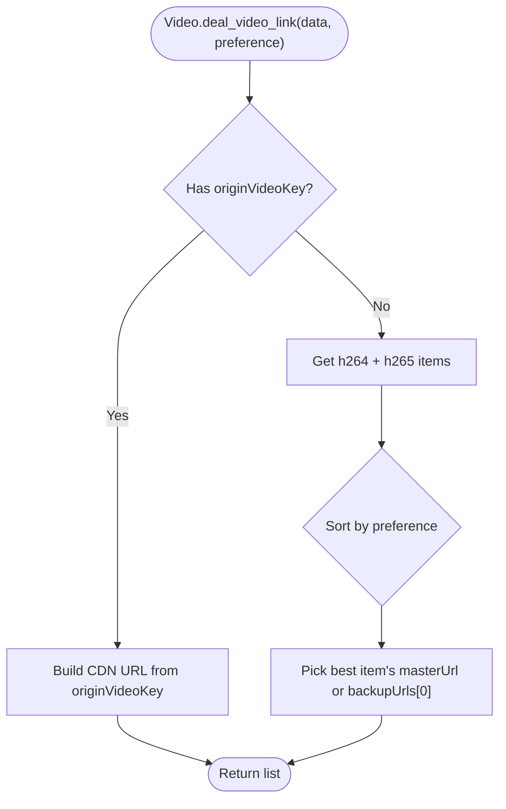
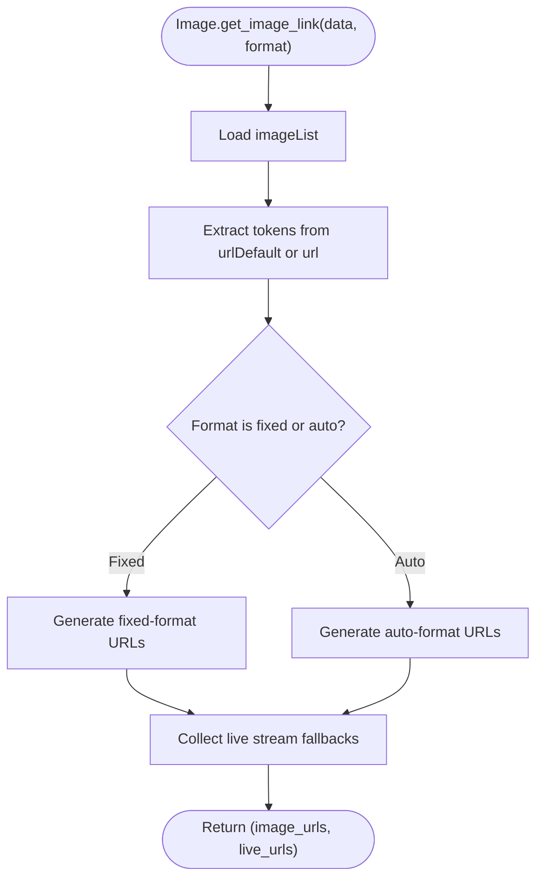
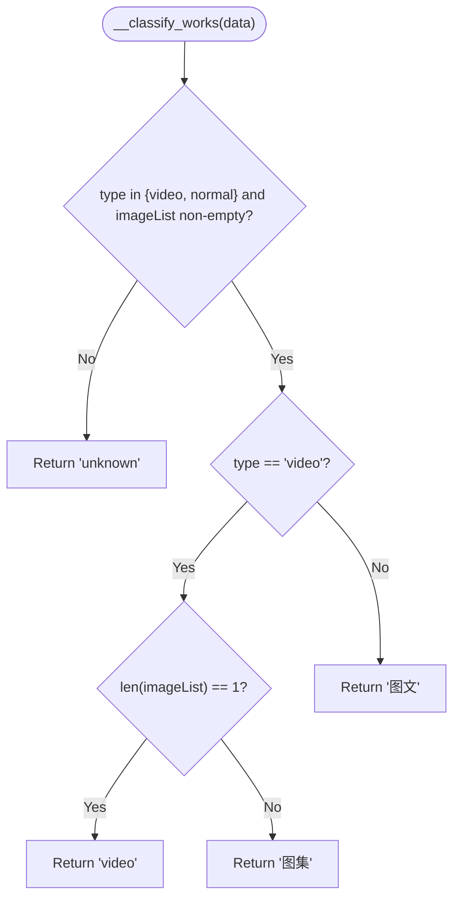
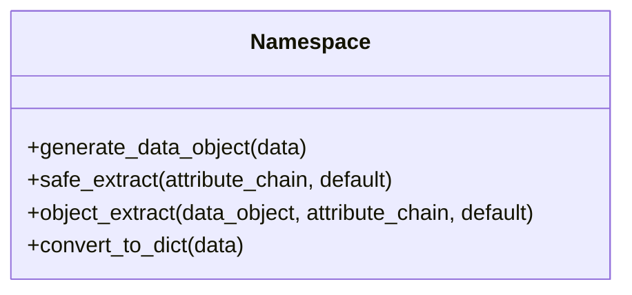
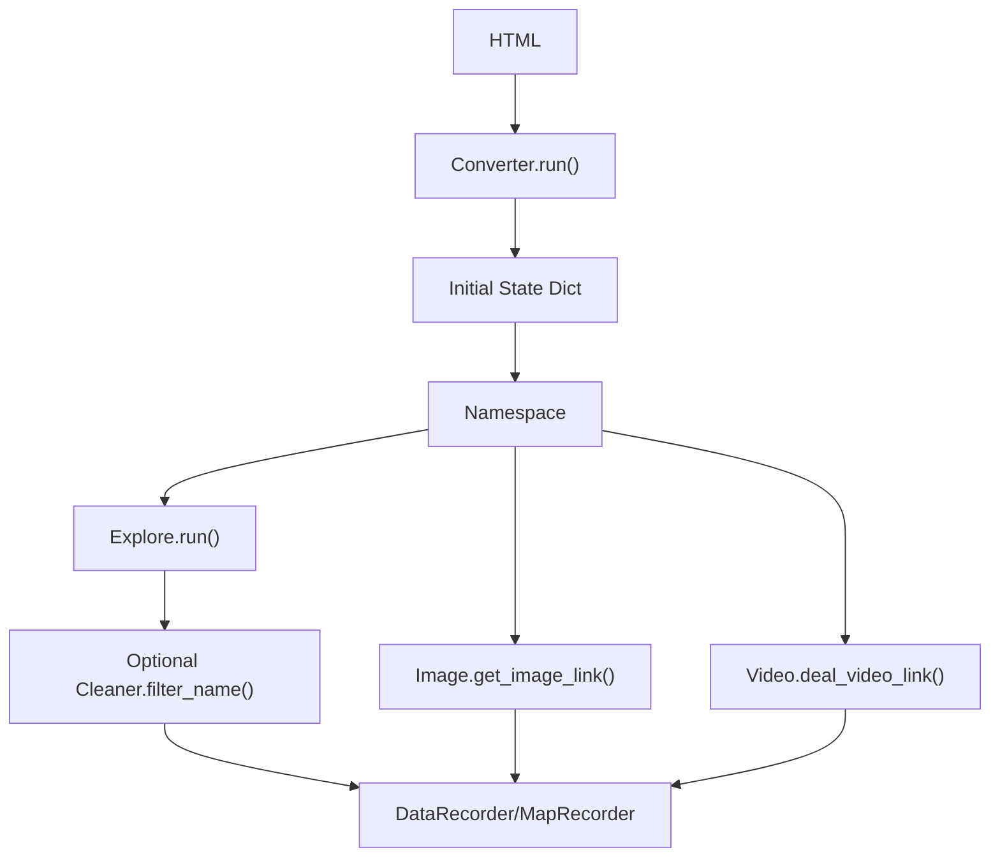
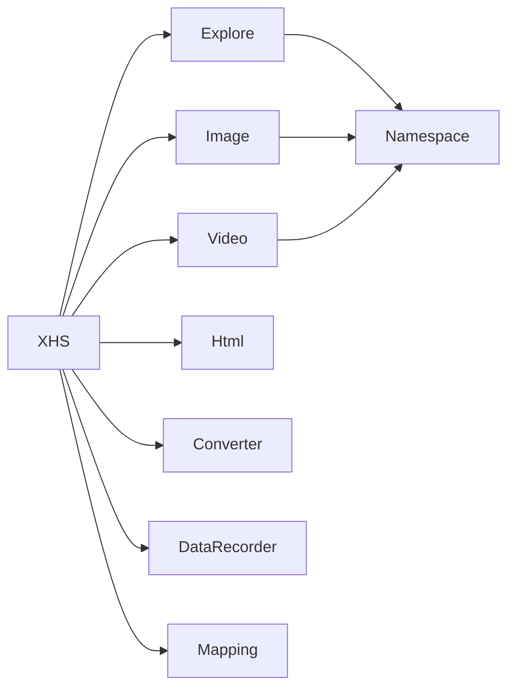

# Content Data Extraction

<cite>
**Referenced Files in This Document**
- [explore.py](file://source/application/explore.py)
- [namespace.py](file://source/expansion/namespace.py)
- [converter.py](file://source/expansion/converter.py)
- [app.py](file://source/application/app.py)
- [request.py](file://source/application/request.py)
- [image.py](file://source/application/image.py)
- [video.py](file://source/application/video.py)
- [cleaner.py](file://source/expansion/cleaner.py)
- [recorder.py](file://source/module/recorder.py)
- [mapping.py](file://source/module/mapping.py)
- [model.py](file://source/module/model.py)
- [static.py](file://source/module/static.py)
- [tools.py](file://source/module/tools.py)
</cite>

## Table of Contents
1. [Introduction](#introduction)
2. [Project Structure](#project-structure)
3. [Core Components](#core-components)
4. [Architecture Overview](#architecture-overview)
5. [Detailed Component Analysis](#detailed-component-analysis)
6. [Dependency Analysis](#dependency-analysis)
7. [Performance Considerations](#performance-considerations)
8. [Troubleshooting Guide](#troubleshooting-guide)
9. [Conclusion](#conclusion)
10. [Appendices](#appendices)

## Introduction
This document describes the content data extraction subsystem responsible for transforming parsed HTML content into structured data for Xiaohongshu (Little Red Book) posts. It focuses on the Explore.run() method, which orchestrates metadata extraction, media information gathering, and content categorization. It also documents the underlying data extraction algorithms for videos, images, and albums, the field mapping from HTML elements to structured keys, validation and error handling, integration with the namespace object, and the data transformation pipeline. Practical examples illustrate extraction outcomes, and guidance is provided for performance optimization and reliability at scale.

## Project Structure
The extraction pipeline spans several modules:
- Application orchestration and extraction: Explore, Image, Video, Html, XHS
- Data conversion and safe access: Namespace, Converter
- Utilities and infrastructure: Cleaner, Recorder, Mapping, Static, Tools
- Pydantic models for typed extraction requests and results

**Diagram sources**
- [app.py:178-182](file://source/application/app.py#L178-L182)
- [explore.py:12-23](file://source/application/explore.py#L12-L23)
- [image.py:10-39](file://source/application/image.py#L10-L39)
- [video.py:15-47](file://source/application/video.py#L15-L47)
- [request.py:26-70](file://source/application/request.py#L26-L70)
- [namespace.py:26-55](file://source/expansion/namespace.py#L26-L55)
- [converter.py:24-45](file://source/expansion/converter.py#L24-L45)
- [recorder.py:103-144](file://source/module/recorder.py#L103-L144)
- [mapping.py:17-41](file://source/module/mapping.py#L17-L41)
- [cleaner.py:59-92](file://source/expansion/cleaner.py#L59-L92)
- [static.py:69](file://source/module/static.py#L69)
- [tools.py:13-22](file://source/module/tools.py#L13-L22)

**Section sources**
- [app.py:178-182](file://source/application/app.py#L178-L182)
- [explore.py:12-23](file://source/application/explore.py#L12-L23)
- [image.py:10-39](file://source/application/image.py#L10-L39)
- [video.py:15-47](file://source/application/video.py#L15-L47)
- [request.py:26-70](file://source/application/request.py#L26-L70)
- [namespace.py:26-55](file://source/expansion/namespace.py#L26-L55)
- [converter.py:24-45](file://source/expansion/converter.py#L24-L45)
- [recorder.py:103-144](file://source/module/recorder.py#L103-L144)
- [mapping.py:17-41](file://source/module/mapping.py#L17-L41)
- [cleaner.py:59-92](file://source/expansion/cleaner.py#L59-L92)
- [static.py:69](file://source/module/static.py#L69)
- [tools.py:13-22](file://source/module/tools.py#L13-L22)

## Core Components
- Explore.run(data): Main entry for extracting structured metadata and categorizing content from a Namespace object.
- Namespace.safe_extract(): Safe chained attribute access supporting nested dicts/lists and optional bracket indices.
- Converter.run(): Extracts initial state JSON from HTML and filters to the note-specific payload.
- Image.get_image_link(): Builds image URLs from tokens and handles live stream fallbacks.
- Video.deal_video_link(): Selects preferred video stream based on resolution/bitrate/size preferences.
- Html.request_url(): Fetches HTML with retries and optional proxy/cookie support.
- Cleaner.filter_name(): Sanitizes filenames and removes control characters.
- DataRecorder/MapRecorder: Persist extraction results and mapping updates.
- Mapping.update_cache(): Renames folders and files when author aliases change.

**Section sources**
- [explore.py:12-82](file://source/application/explore.py#L12-L82)
- [namespace.py:26-55](file://source/expansion/namespace.py#L26-L55)
- [converter.py:24-45](file://source/expansion/converter.py#L24-L45)
- [image.py:10-66](file://source/application/image.py#L10-L66)
- [video.py:15-53](file://source/application/video.py#L15-L53)
- [request.py:26-70](file://source/application/request.py#L26-L70)
- [cleaner.py:59-92](file://source/expansion/cleaner.py#L59-L92)
- [recorder.py:103-144](file://source/module/recorder.py#L103-L144)
- [mapping.py:28-41](file://source/module/mapping.py#L28-L41)

## Architecture Overview
The extraction pipeline converts raw HTML into structured data via a series of steps:
1. Request HTML from target URLs.
2. Convert HTML to a normalized dictionary using Converter.
3. Wrap the dictionary in a Namespace for safe chained access.
4. Run Explore.run() to extract metadata and categorize content.
5. Augment with media URLs (images/videos/live) using Image/Video helpers.
6. Optionally sanitize filenames and persist records.

**Diagram sources**
- [app.py:386-506](file://source/application/app.py#L386-L506)
- [request.py:26-70](file://source/application/request.py#L26-L70)
- [converter.py:24-45](file://source/expansion/converter.py#L24-L45)
- [namespace.py:8-24](file://source/expansion/namespace.py#L8-L24)
- [explore.py:12-23](file://source/application/explore.py#L12-L23)
- [image.py:10-39](file://source/application/image.py#L10-L39)
- [video.py:15-47](file://source/application/video.py#L15-L47)

## Detailed Component Analysis

### Explore.run() Method
Explore.run() transforms a Namespace into a structured dictionary containing:
- Interaction metrics: collected, comment, share, liked counts
- Tags: flattened tag names
- Basic info: note ID, title, description, categorized type
- Timestamps: published and last updated time, epoch seconds
- Author profile: nickname, ID, profile URL

**Diagram sources**
- [explore.py:12-82](file://source/application/explore.py#L12-L82)

Field mapping highlights:
- Interests: collectedCount → "收藏数量", commentCount → "评论数量", shareCount → "分享数量", likedCount → "点赞数量"
- Tags: tagList → "作品标签" (space-separated names)
- Basic info: noteId → "作品ID", title → "作品标题", desc → "作品描述", type + imageList → "作品类型"
- Times: time → "发布时间", lastUpdateTime → "最后更新时间", time → "时间戳"
- Author: user.nickname/nickName → "作者昵称", user.userId → "作者ID"

Validation and defaults:
- Uses Namespace.safe_extract() to avoid KeyError/TypeError.
- Unknown timestamps fall back to localized "unknown".
- Classification returns "unknown" when type is not normal/video or imageList is empty.

**Section sources**
- [explore.py:12-82](file://source/application/explore.py#L12-L82)
- [namespace.py:26-55](file://source/expansion/namespace.py#L26-L55)

### Data Extraction Algorithms

#### Videos
Video.deal_video_link() selects the best video stream:
- If originVideoKey exists, generates CDN URL directly.
- Otherwise, aggregates h264 and h265 streams, sorts by preference (resolution, bitrate, size), and picks masterUrl or backupUrls[0].

**Diagram sources**
- [video.py:15-53](file://source/application/video.py#L15-L53)

#### Images and Albums
Image.get_image_link() builds image URLs:
- Extracts tokens from urlDefault or url for each image in imageList.
- Supports fixed format (png, webp, jpeg, heic, avif) and auto format.
- Returns two lists: primary image URLs and potential live stream fallbacks.

**Diagram sources**
- [image.py:10-66](file://source/application/image.py#L10-L66)

#### Content Categorization
Explore.__classify_works() determines content type:
- Unknown if type is neither normal nor video, or imageList is empty.
- Video if type is video and single image (single media item).
- 图集 if type is video and multiple images.
- 图文 otherwise.

**Diagram sources**
- [explore.py:75-82](file://source/application/explore.py#L75-L82)

### Integration with Namespace Object
- Namespace.safe_extract(attribute_chain, default) supports dot notation and array indexing (e.g., "a.b[0]").
- Nested dictionaries/lists are converted to a nested SimpleNamespace for attribute-style access.
- Provides robust defaulting to prevent crashes on missing keys.

**Diagram sources**
- [namespace.py:8-84](file://source/expansion/namespace.py#L8-L84)

**Section sources**
- [namespace.py:26-55](file://source/expansion/namespace.py#L26-L55)
- [namespace.py:75-81](file://source/expansion/namespace.py#L75-L81)

### Data Transformation Pipeline
- HTML → Initial state JSON via Converter.run().
- Dictionary → Namespace for safe access.
- Explore.run() → Structured metadata.
- Media helpers augment with URLs.
- Optional filename sanitization and persistence.

**Diagram sources**
- [converter.py:24-45](file://source/expansion/converter.py#L24-L45)
- [namespace.py:8-24](file://source/expansion/namespace.py#L8-L24)
- [explore.py:12-82](file://source/application/explore.py#L12-L82)
- [image.py:10-39](file://source/application/image.py#L10-L39)
- [video.py:15-47](file://source/application/video.py#L15-L47)
- [cleaner.py:70-92](file://source/expansion/cleaner.py#L70-L92)
- [recorder.py:118-143](file://source/module/recorder.py#L118-L143)

## Dependency Analysis
- Explore depends on Namespace for safe extraction and localization for unknown values.
- Image and Video depend on Namespace for nested attribute access and Html.format_url() for URL normalization.
- XHS composes Explore, Image, Video, Html, Converter, and persistence/recording utilities.
- Recorder and Mapping provide database-backed caching and renaming logic.

**Diagram sources**
- [explore.py:12-82](file://source/application/explore.py#L12-L82)
- [image.py:10-66](file://source/application/image.py#L10-L66)
- [video.py:15-53](file://source/application/video.py#L15-L53)
- [app.py:178-182](file://source/application/app.py#L178-L182)
- [recorder.py:103-144](file://source/module/recorder.py#L103-L144)
- [mapping.py:28-41](file://source/module/mapping.py#L28-L41)

**Section sources**
- [explore.py:12-82](file://source/application/explore.py#L12-L82)
- [image.py:10-66](file://source/application/image.py#L10-L66)
- [video.py:15-53](file://source/application/video.py#L15-L53)
- [app.py:178-182](file://source/application/app.py#L178-L182)
- [recorder.py:103-144](file://source/module/recorder.py#L103-L144)
- [mapping.py:28-41](file://source/module/mapping.py#L28-L41)

## Performance Considerations
- Concurrency limits: Static.MAX_WORKERS controls worker pool size for batch operations.
- Retry and backoff: Tools.retry and Tools.sleep_time reduce load spikes and improve resilience.
- Request throttling: Html.request_url() sleeps between requests to avoid rate limits.
- Efficient parsing: Converter.run() isolates the relevant note payload to minimize downstream processing.
- Minimal allocations: Namespace.safe_extract() avoids repeated lookups by walking the chain once per call.

Recommendations:
- Batch requests with controlled concurrency aligned to MAX_WORKERS.
- Apply exponential backoff via sleep_time() between batches.
- Cache converted payloads when reprocessing similar pages.
- Prefer auto-format image URLs to avoid redundant conversions.

**Section sources**
- [static.py:69](file://source/module/static.py#L69)
- [tools.py:13-22](file://source/module/tools.py#L13-L22)
- [tools.py:54-63](file://source/module/tools.py#L54-L63)
- [request.py:48-49](file://source/application/request.py#L48-L49)
- [converter.py:24-45](file://source/expansion/converter.py#L24-L45)

## Troubleshooting Guide
Common issues and resolutions:
- Missing or malformed initial state in HTML:
  - Symptom: Empty Namespace after conversion.
  - Resolution: Verify URL correctness and network conditions; retry with proxies if needed.
  - Reference: [app.py:410-415](file://source/application/app.py#L410-L415)
- Missing keys during extraction:
  - Symptom: Empty fields or "unknown" timestamps.
  - Resolution: Explore uses safe_extract() with defaults; ensure input data is complete.
  - Reference: [namespace.py:26-55](file://source/expansion/namespace.py#L26-L55)
- Video link generation failures:
  - Symptom: Empty video URLs.
  - Resolution: Check originVideoKey presence and stream availability; adjust preference.
  - Reference: [video.py:15-47](file://source/application/video.py#L15-L47)
- Image token extraction errors:
  - Symptom: No image URLs generated.
  - Resolution: Validate urlDefault/url structure; fallback logic extracts tokens from both.
  - Reference: [image.py:10-22](file://source/application/image.py#L10-L22)
- Filename invalid characters:
  - Symptom: Illegal characters in filenames.
  - Resolution: Use Cleaner.filter_name() to sanitize.
  - Reference: [cleaner.py:70-92](file://source/expansion/cleaner.py#L70-L92)
- Persistence errors:
  - Symptom: Permission/FileExists errors during rename/move.
  - Resolution: Close conflicting processes; Mapping handles exceptions and logs.
  - Reference: [mapping.py:181-217](file://source/module/mapping.py#L181-L217)

**Section sources**
- [app.py:410-415](file://source/application/app.py#L410-L415)
- [namespace.py:26-55](file://source/expansion/namespace.py#L26-L55)
- [video.py:15-47](file://source/application/video.py#L15-L47)
- [image.py:10-22](file://source/application/image.py#L10-L22)
- [cleaner.py:70-92](file://source/expansion/cleaner.py#L70-L92)
- [mapping.py:181-217](file://source/module/mapping.py#L181-L217)

## Conclusion
The content data extraction subsystem cleanly separates concerns: HTML retrieval, safe data access, structured extraction, and media URL generation. Explore.run() centralizes metadata extraction and classification, while Image and Video helpers encapsulate content-type-specific logic. Robust defaults, safe attribute access, and persistence utilities ensure reliability. With concurrency and retry controls, the system scales effectively for large-scale content extraction.

## Appendices

### Practical Examples
- Single video post:
  - Metadata: noteId, title, desc, "发布时间", "最后更新时间", "收藏数量", "评论数量", "分享数量", "点赞数量", "作者昵称", "作者ID", "作品类型" → "视频"
  - Media: video URLs selected by preference
- Multiple images (album):
  - Metadata: same as above, "作品类型" → "图集"
  - Media: multiple image URLs and optional live fallbacks
- Mixed text + images (notebook-style):
  - Metadata: same as above, "作品类型" → "图文"
  - Media: image URLs derived from tokens

### Data Models
- ExtractParams: Typed request parameters for extraction tasks.
- ExtractData: Typed wrapper for extraction results.

**Section sources**
- [model.py:4-17](file://source/module/model.py#L4-L17)