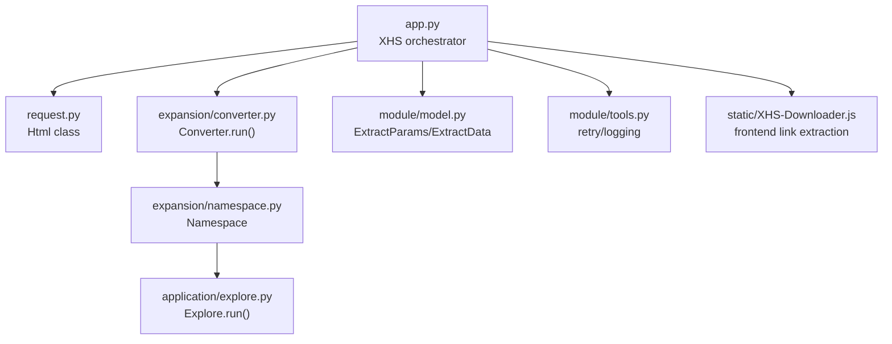
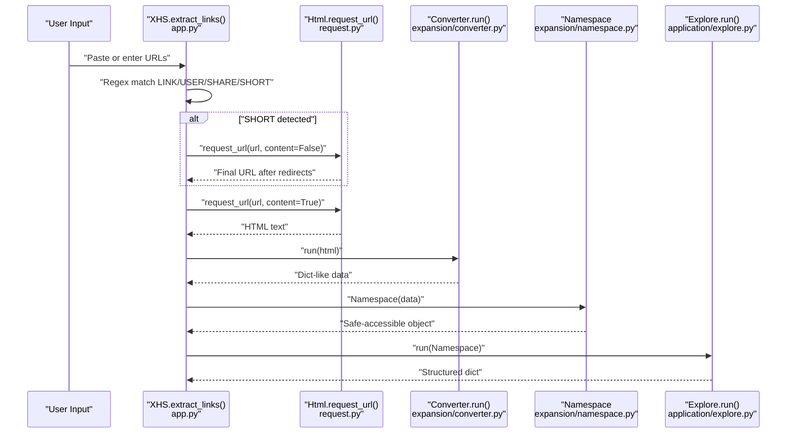
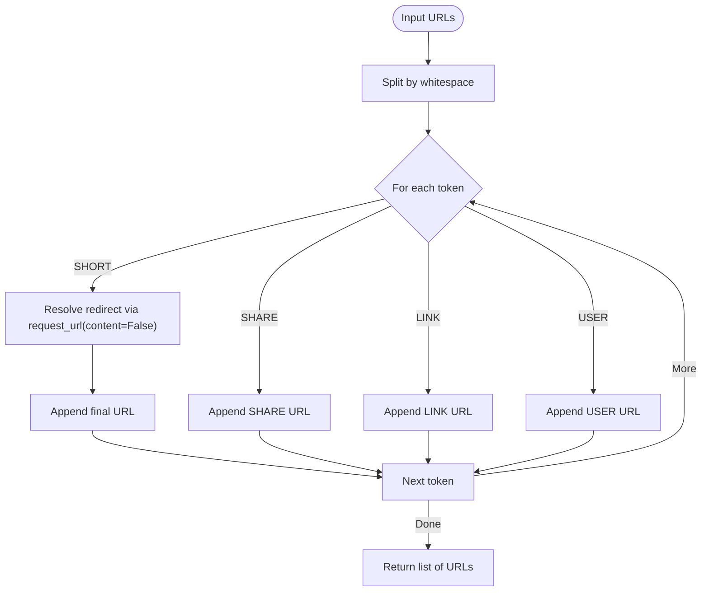
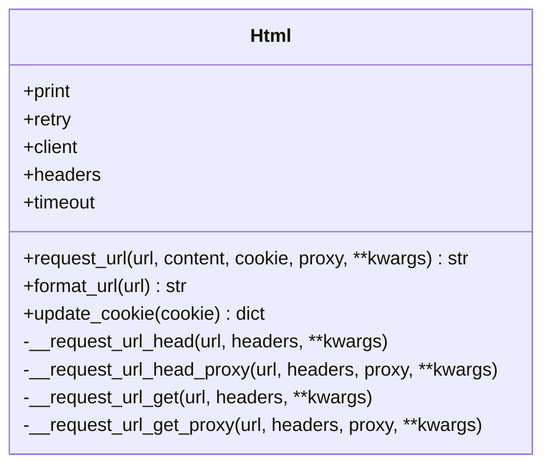
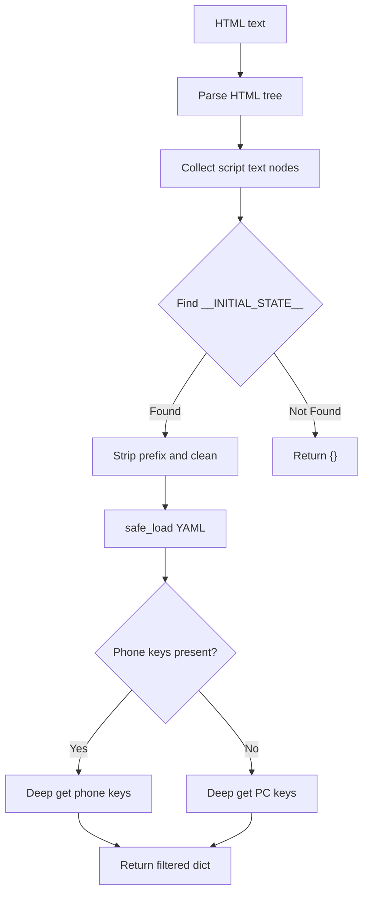
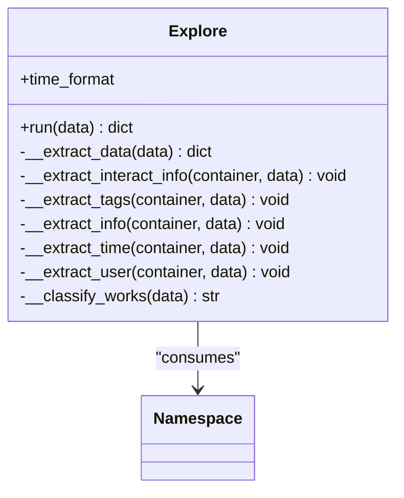
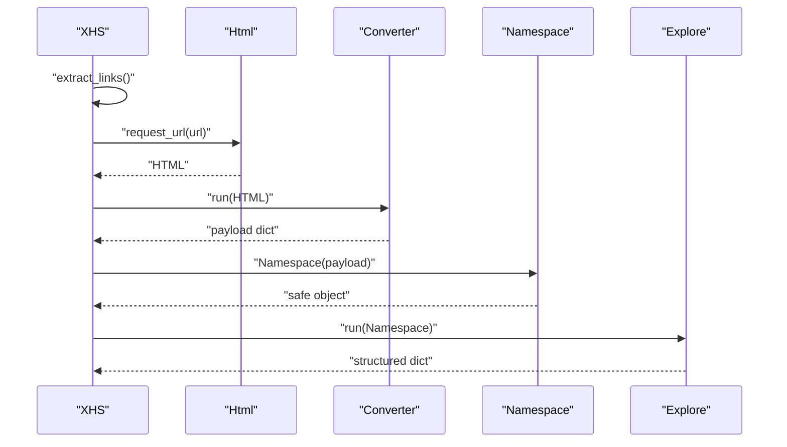
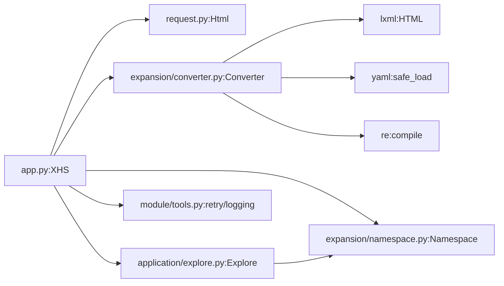

# Content Extraction

<cite>
**Referenced Files in This Document**
- [app.py](file://source/application/app.py)
- [explore.py](file://source/application/explore.py)
- [request.py](file://source/application/request.py)
- [converter.py](file://source/expansion/converter.py)
- [namespace.py](file://source/expansion/namespace.py)
- [model.py](file://source/module/model.py)
- [tools.py](file://source/module/tools.py)
- [XHS-Downloader.js](file://static/XHS-Downloader.js)
</cite>

## Table of Contents
1. [Introduction](#introduction)
2. [Project Structure](#project-structure)
3. [Core Components](#core-components)
4. [Architecture Overview](#architecture-overview)
5. [Detailed Component Analysis](#detailed-component-analysis)
6. [Dependency Analysis](#dependency-analysis)
7. [Performance Considerations](#performance-considerations)
8. [Troubleshooting Guide](#troubleshooting-guide)
9. [Conclusion](#conclusion)

## Introduction
This document explains the content extraction subsystem responsible for identifying XiaoHongShu (RedNote) content from various URL formats and transforming raw HTML into structured data. It covers:
- URL parsing and extraction algorithms for LINK, USER, SHARE, and SHORT forms
- Regex patterns and matching logic
- HTML request processing via the Html class
- Data object generation using the Converter.run() method
- Structured data extraction via Explore.run()
- The end-to-end workflow from raw HTML to organized data containers
- Error handling, validation, and common failure scenarios with solutions

## Project Structure
The content extraction subsystem spans several modules:
- Application orchestration and URL parsing in app.py
- HTML fetching and request utilities in request.py
- Data conversion from HTML to JSON-like dictionaries in expansion/converter.py
- Safe navigation of nested data in expansion/namespace.py
- Structured extraction of metadata in application/explore.py
- API request/response models in module/model.py
- Retry and logging utilities in module/tools.py
- Frontend helpers for link extraction in static/XHS-Downloader.js

**Diagram sources**
- [app.py:102-107](file://source/application/app.py#L102-L107)
- [request.py:15-138](file://source/application/request.py#L15-L138)
- [converter.py:9-45](file://source/expansion/converter.py#L9-L45)
- [namespace.py:8-85](file://source/expansion/namespace.py#L8-L85)
- [explore.py:9-83](file://source/application/explore.py#L9-L83)
- [model.py:4-17](file://source/module/model.py#L4-L17)
- [tools.py:13-64](file://source/module/tools.py#L13-L64)
- [XHS-Downloader.js:822-903](file://static/XHS-Downloader.js#L822-L903)

**Section sources**
- [app.py:102-107](file://source/application/app.py#L102-L107)
- [request.py:15-138](file://source/application/request.py#L15-L138)
- [converter.py:9-45](file://source/expansion/converter.py#L9-L45)
- [namespace.py:8-85](file://source/expansion/namespace.py#L8-L85)
- [explore.py:9-83](file://source/application/explore.py#L9-L83)
- [model.py:4-17](file://source/module/model.py#L4-L17)
- [tools.py:13-64](file://source/module/tools.py#L13-L64)
- [XHS-Downloader.js:822-903](file://static/XHS-Downloader.js#L822-L903)

## Core Components
- XHS orchestrator (app.py): Defines regex patterns for LINK, USER, SHARE, SHORT, and ID/ID_USER. Implements extract_links() and extract_id() to normalize URLs and extract identifiers. Orchestrates HTML fetching, data conversion, and structured extraction.
- Html (request.py): Provides asynchronous HTTP GET requests with retries, cookie injection, and proxy support. Handles HEAD requests for redirection resolution when short links are encountered.
- Converter (expansion/converter.py): Parses HTML, extracts window.__INITIAL_STATE__ from script tags, cleans and parses YAML-like content, and selects the appropriate nested data structure for note details.
- Namespace (expansion/namespace.py): Converts dicts to nested SimpleNamespace objects and provides safe navigation with dot notation and index accessors.
- Explore (application/explore.py): Transforms a Namespace object into a structured dictionary containing metadata such as counts, tags, identifiers, timestamps, and user info, plus classification of media type.
- API models (module/model.py): Pydantic models for request/response payloads in server mode.
- Utilities (module/tools.py): Retry decorator and logging helpers used across the system.

**Section sources**
- [app.py:102-107](file://source/application/app.py#L102-L107)
- [app.py:358-384](file://source/application/app.py#L358-L384)
- [request.py:15-138](file://source/application/request.py#L15-L138)
- [converter.py:9-45](file://source/expansion/converter.py#L9-L45)
- [namespace.py:8-85](file://source/expansion/namespace.py#L8-L85)
- [explore.py:9-83](file://source/application/explore.py#L9-L83)
- [model.py:4-17](file://source/module/model.py#L4-L17)
- [tools.py:13-64](file://source/module/tools.py#L13-L64)

## Architecture Overview
The extraction pipeline transforms a user-provided URL into structured data:

**Diagram sources**
- [app.py:358-384](file://source/application/app.py#L358-L384)
- [request.py:26-70](file://source/application/request.py#L26-L70)
- [converter.py:24-45](file://source/expansion/converter.py#L24-L45)
- [namespace.py:8-85](file://source/expansion/namespace.py#L8-L85)
- [explore.py:12-23](file://source/application/explore.py#L12-L23)

## Detailed Component Analysis

### URL Parsing and Extraction Algorithms
- Regex patterns:
  - LINK: Matches canonical note pages under explore
  - USER: Matches user profile note subpages
  - SHARE: Matches discovery item share links
  - SHORT: Matches xhslink short links
  - ID/ID_USER: Extracts note or user identifiers from URLs
- Matching logic:
  - extract_links() iterates over space-separated inputs
  - If a SHORT is detected, request_url() is called with content=False to resolve the redirect and obtain the final URL
  - SHARE and LINK are appended directly; USER is appended for profile-based note URLs
  - extract_id() uses ID and ID_USER to extract identifiers from normalized URLs

**Diagram sources**
- [app.py:358-384](file://source/application/app.py#L358-L384)

**Section sources**
- [app.py:102-107](file://source/application/app.py#L102-L107)
- [app.py:358-384](file://source/application/app.py#L358-L384)

### HTML Request Processing (Html class)
- Responsibilities:
  - Asynchronous GET requests with configurable headers, timeout, and proxies
  - HEAD requests for redirect resolution when short links are involved
  - Cookie injection via update_cookie()
  - Retry wrapper via retry decorator
  - Error handling logs network exceptions
- Behavior:
  - request_url() ensures URLs start with https://
  - Uses either the managed client or a direct httpx.get() for proxy HEAD requests
  - On HTTPError, logs an error and returns empty string

**Diagram sources**
- [request.py:15-138](file://source/application/request.py#L15-L138)

**Section sources**
- [request.py:15-138](file://source/application/request.py#L15-L138)
- [tools.py:13-22](file://source/module/tools.py#L13-L22)

### Data Object Generation (Converter.run)
- Steps:
  - Extract script text nodes from HTML
  - Locate window.__INITIAL_STATE__ assignment
  - Clean illegal characters and strip prefix
  - Parse YAML-like content into a dict
  - Filter to the note detail structure using platform-specific key sequences
- Output:
  - A dict containing the note payload suitable for downstream extraction

**Diagram sources**
- [converter.py:24-45](file://source/expansion/converter.py#L24-L45)

**Section sources**
- [converter.py:9-45](file://source/expansion/converter.py#L9-L45)

### Structured Data Extraction (Explore.run)
- Input:
  - A Namespace object wrapping the note payload
- Output:
  - A dict with standardized keys for counts, tags, identifiers, timestamps, and user info
- Classification:
  - Media type determined by type and imageList length; returns localized labels for unknown/video/image/video album/text-image

**Diagram sources**
- [explore.py:9-83](file://source/application/explore.py#L9-L83)
- [namespace.py:8-85](file://source/expansion/namespace.py#L8-L85)

**Section sources**
- [explore.py:12-83](file://source/application/explore.py#L12-L83)

### End-to-End Workflow
- From raw HTML to organized data containers:
  - XHS.extract_links() normalizes URLs and resolves short links
  - Html.request_url() fetches HTML content
  - Converter.run() converts HTML to a dict
  - Namespace wraps the dict for safe access
  - Explore.run() produces a structured dict
  - Downstream components handle media extraction and downloads

**Diagram sources**
- [app.py:386-428](file://source/application/app.py#L386-L428)
- [request.py:26-70](file://source/application/request.py#L26-L70)
- [converter.py:24-45](file://source/expansion/converter.py#L24-L45)
- [namespace.py:8-85](file://source/expansion/namespace.py#L8-L85)
- [explore.py:12-23](file://source/application/explore.py#L12-L23)

**Section sources**
- [app.py:386-506](file://source/application/app.py#L386-L506)

### Practical Examples
- Canonical note page:
  - Input: https://www.xiaohongshu.com/explore/NoteID?xsec_token=...
  - Match: LINK
  - Output URL: same as input
- Share link:
  - Input: https://www.xiaohongshu.com/discovery/item/NoteID?xsec_token=...
  - Match: SHARE
  - Output URL: same as input
- User profile note:
  - Input: https://www.xiaohongshu.com/user/profile/AuthorID/NoteID?xsec_token=...
  - Match: USER
  - Output URL: same as input
- Short link:
  - Input: https://xhslink.com/ShareCode
  - Match: SHORT
  - Resolve redirect via request_url(content=False)
  - Output URL: final resolved URL
- Identifier extraction:
  - extract_id() uses ID and ID_USER to extract NoteID or AuthorID from normalized URLs

**Section sources**
- [app.py:102-107](file://source/application/app.py#L102-L107)
- [app.py:358-384](file://source/application/app.py#L358-L384)

### Frontend Link Extraction (UserScript)
- The UserScript provides helpers to extract note and user links from search and feed pages, generating shareable URLs and user profile URLs. These are useful for batch extraction and clipboard operations.

**Section sources**
- [XHS-Downloader.js:822-903](file://static/XHS-Downloader.js#L822-L903)

## Dependency Analysis
- XHS orchestrator depends on:
  - Html for HTTP requests
  - Converter for HTML-to-dict conversion
  - Namespace for safe data navigation
  - Explore for structured extraction
  - Tools for retry and logging
- Converter depends on:
  - lxml for HTML parsing
  - yaml for safe_load
  - regex for cleaning and extraction
- Explore depends on:
  - Namespace for safe attribute access
  - Translation for localized labels

**Diagram sources**
- [app.py:102-107](file://source/application/app.py#L102-L107)
- [request.py:15-138](file://source/application/request.py#L15-L138)
- [converter.py:9-45](file://source/expansion/converter.py#L9-L45)
- [namespace.py:8-85](file://source/expansion/namespace.py#L8-L85)
- [explore.py:9-83](file://source/application/explore.py#L9-L83)
- [tools.py:13-64](file://source/module/tools.py#L13-L64)

**Section sources**
- [app.py:102-107](file://source/application/app.py#L102-L107)
- [converter.py:9-45](file://source/expansion/converter.py#L9-L45)
- [namespace.py:8-85](file://source/expansion/namespace.py#L8-L85)
- [explore.py:9-83](file://source/application/explore.py#L9-L83)
- [tools.py:13-64](file://source/module/tools.py#L13-L64)

## Performance Considerations
- Network latency and rate limiting:
  - Use appropriate timeouts and consider adding delays between requests to avoid throttling
  - Utilize proxy support for geographic distribution
- Retry strategy:
  - The retry decorator attempts multiple requests on transient failures
- Memory usage:
  - Converter.load() parses large payloads; ensure sufficient memory for batch processing
- Parallelization:
  - The system is designed around async I/O; leverage concurrent tasks for multiple URLs

[No sources needed since this section provides general guidance]

## Troubleshooting Guide
Common issues and solutions:
- Network errors during HTML fetch:
  - Symptom: Empty HTML or error logs
  - Solution: Verify connectivity, adjust timeout, enable proxy, and retry
- Short link resolution fails:
  - Symptom: Unable to resolve xhslink.com URLs
  - Solution: Ensure request_url(content=False) succeeds; check HEAD request behavior behind proxies
- Missing __INITIAL_STATE__ in HTML:
  - Symptom: Converter returns empty dict
  - Solution: Confirm URL correctness, verify cookies/proxy settings, and retry
- Data extraction returns empty:
  - Symptom: Explore.run() yields empty dict
  - Solution: Validate Namespace content; ensure safe_extract paths exist; check media type classification
- API request validation:
  - Symptom: Pydantic validation errors
  - Solution: Ensure ExtractParams fields conform to expected types and formats

**Section sources**
- [request.py:63-69](file://source/application/request.py#L63-L69)
- [converter.py:27-32](file://source/expansion/converter.py#L27-L32)
- [explore.py:15-23](file://source/application/explore.py#L15-L23)
- [model.py:4-17](file://source/module/model.py#L4-L17)

## Conclusion
The content extraction subsystem integrates robust URL parsing, resilient HTML fetching, reliable data conversion, and structured extraction into a cohesive pipeline. By leveraging regex-based normalization, safe data navigation, and platform-agnostic payload selection, it reliably handles diverse XiaoHongShu URL formats and produces standardized metadata for downstream processing.