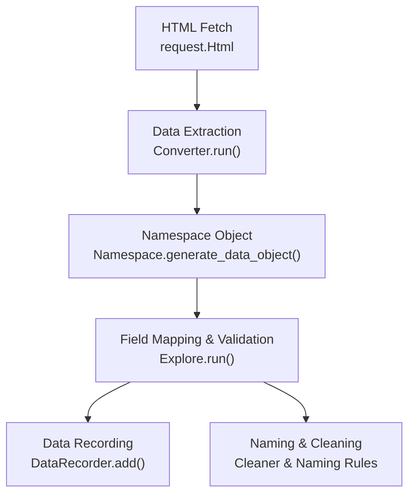
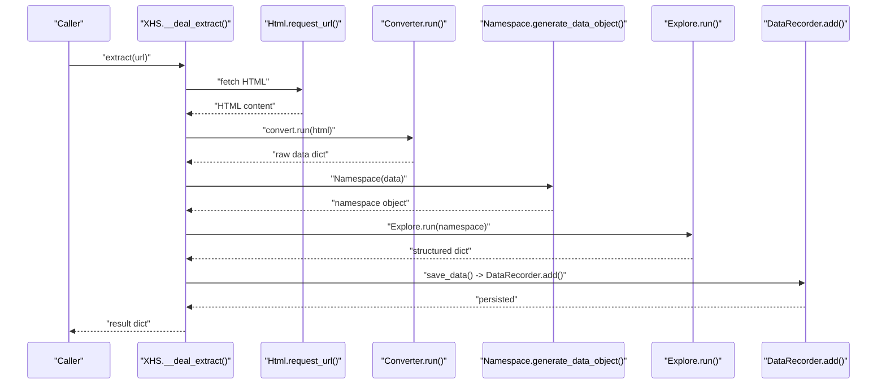
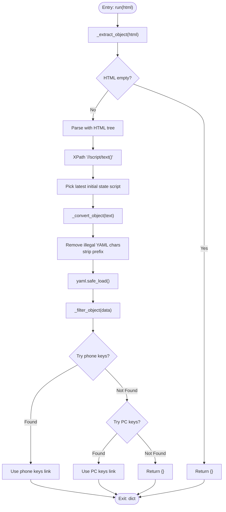
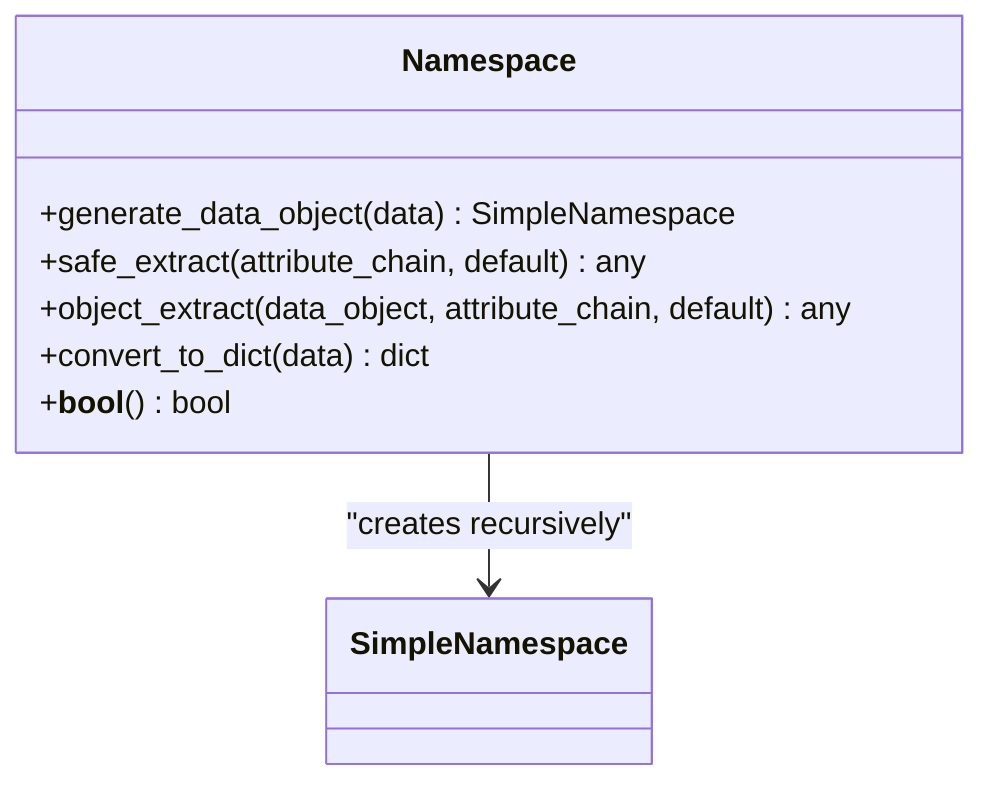
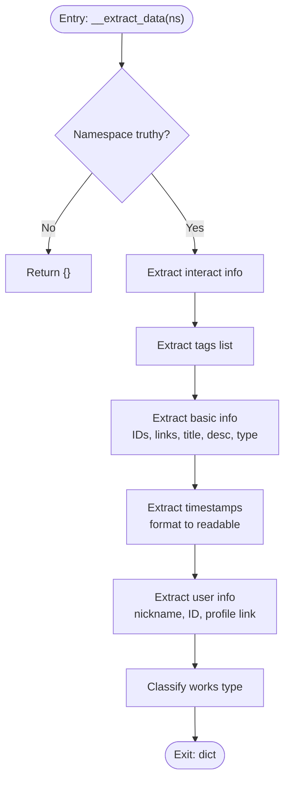
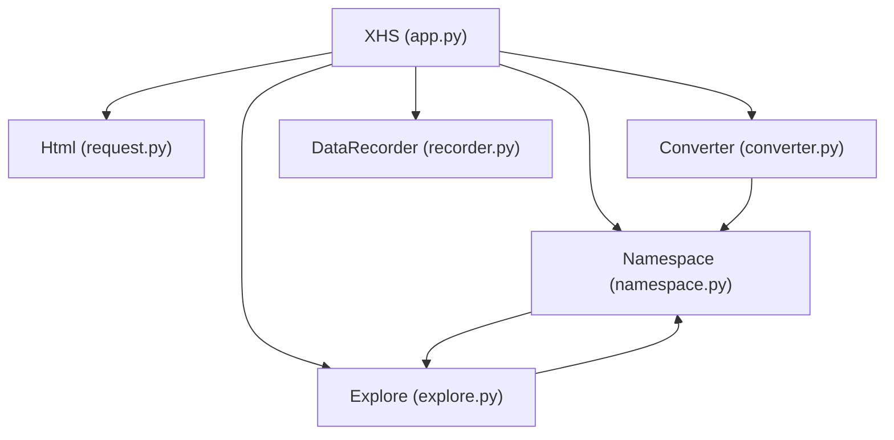

# Data Object Generation

<cite>
**Referenced Files in This Document**
- [app.py](file://source/application/app.py)
- [converter.py](file://source/expansion/converter.py)
- [namespace.py](file://source/expansion/namespace.py)
- [cleaner.py](file://source/expansion/cleaner.py)
- [explore.py](file://source/application/explore.py)
- [request.py](file://source/application/request.py)
- [recorder.py](file://source/module/recorder.py)
- [model.py](file://source/module/model.py)
- [tools.py](file://source/module/tools.py)
</cite>

## Table of Contents
1. [Introduction](#introduction)
2. [Project Structure](#project-structure)
3. [Core Components](#core-components)
4. [Architecture Overview](#architecture-overview)
5. [Detailed Component Analysis](#detailed-component-analysis)
6. [Dependency Analysis](#dependency-analysis)
7. [Performance Considerations](#performance-considerations)
8. [Troubleshooting Guide](#troubleshooting-guide)
9. [Conclusion](#conclusion)

## Introduction
This document explains the data object generation process that transforms HTML content from a target website into a structured namespace object. It focuses on the __generate_data_object() method, the Converter.convert.run() workflow, the data transformation pipeline, and the creation of a namespace object. It also covers data cleaning and normalization, field mapping, data type conversions, validation steps, error handling for malformed content, performance considerations, and debugging techniques.

## Project Structure
The data object generation spans several modules:
- Application orchestration and workflow: app.py
- HTML fetching: request.py
- Data extraction and conversion: converter.py
- Namespace object creation: namespace.py
- Data extraction into dictionaries: explore.py
- Data cleaning utilities: cleaner.py
- Persistence and validation models: recorder.py, model.py
- Utilities: tools.py

**Diagram sources**
- [app.py](file://source/application/app.py)
- [request.py](file://source/application/request.py)
- [converter.py](file://source/expansion/converter.py)
- [namespace.py](file://source/expansion/namespace.py)
- [explore.py](file://source/application/explore.py)
- [recorder.py](file://source/module/recorder.py)
- [cleaner.py](file://source/expansion/cleaner.py)

**Section sources**
- [app.py](file://source/application/app.py)
- [request.py](file://source/application/request.py)
- [converter.py](file://source/expansion/converter.py)
- [namespace.py](file://source/expansion/namespace.py)
- [explore.py](file://source/application/explore.py)
- [recorder.py](file://source/module/recorder.py)
- [cleaner.py](file://source/expansion/cleaner.py)

## Core Components
- Converter.run(): Parses HTML, extracts the initial state script, cleans and loads JSON/YAML-like content, and filters to the relevant note data structure.
- Namespace.generate_data_object(): Recursively converts dicts and lists into nested SimpleNamespace objects for attribute-style access.
- Explore.run(): Extracts and normalizes fields from the namespace object into a flat dictionary, performing type conversions and defaults.
- Cleaner: Provides filtering and normalization for filenames and text, removing control characters and illegal filesystem characters.
- DataRecorder: Validates and persists extracted data into a database.

**Section sources**
- [converter.py](file://source/expansion/converter.py)
- [namespace.py](file://source/expansion/namespace.py)
- [explore.py](file://source/application/explore.py)
- [cleaner.py](file://source/expansion/cleaner.py)
- [recorder.py](file://source/module/recorder.py)

## Architecture Overview
The end-to-end flow from HTML to structured data is:

**Diagram sources**
- [app.py](file://source/application/app.py)
- [request.py](file://source/application/request.py)
- [converter.py](file://source/expansion/converter.py)
- [namespace.py](file://source/expansion/namespace.py)
- [explore.py](file://source/application/explore.py)
- [recorder.py](file://source/module/recorder.py)

## Detailed Component Analysis

### Converter.run() Workflow and Data Transformation Pipeline
Converter.run() orchestrates three stages:
- Extract: Finds the initial state script embedded in the page.
- Convert: Cleans and parses the script payload into a Python dict.
- Filter: Selects the relevant note data using platform-specific key paths.

Key behaviors:
- Initial state detection uses XPath to locate the script tag containing the initial state.
- Illegal characters are stripped before parsing to avoid loader errors.
- Two strategies are supported: mobile noteData and desktop noteDetailMap, with fallbacks.

**Diagram sources**
- [converter.py](file://source/expansion/converter.py)

**Section sources**
- [converter.py](file://source/expansion/converter.py)

### Namespace Object Creation
Namespace.generate_data_object() recursively converts a dict/list structure into a nested SimpleNamespace. This enables attribute-style access and supports safe extraction via safe_extract() and object_extract().

Benefits:
- Attribute-style access simplifies downstream extraction logic.
- Safe extraction prevents crashes on missing keys or wrong types.
- Conversion to dict preserves nested structure for persistence.

**Diagram sources**
- [namespace.py](file://source/expansion/namespace.py)

**Section sources**
- [namespace.py](file://source/expansion/namespace.py)

### Data Extraction and Normalization (Explore.run())
Explore.run() maps the namespace object into a normalized dictionary with:
- Interaction metrics: likes, comments, shares, collects
- Tags: flattened list of tag names
- Metadata: IDs, URLs, titles, descriptions, timestamps
- Classification: determines media type (video, image gallery, image, or unknown)

Validation and defaults:
- Missing fields return defaults (e.g., "-1" for counts, "Unknown" for timestamps).
- Timestamps are converted from milliseconds to human-readable format.

**Diagram sources**
- [explore.py](file://source/application/explore.py)

**Section sources**
- [explore.py](file://source/application/explore.py)

### Data Cleaning and Normalization
Cleaner provides:
- OS-aware illegal character filtering for filenames.
- Control character removal.
- Emoji replacement and spacing normalization.
- Name sanitization with trimming and default fallbacks.

These utilities are applied during naming and filename generation to ensure compatibility across platforms.

**Section sources**
- [cleaner.py](file://source/expansion/cleaner.py)

### Data Validation and Persistence
- DataRecorder.add() validates the incoming dict against a predefined schema and writes to a SQLite table.
- The schema defines primary keys, types, and constraints for each field.
- ExtractData and ExtractParams models define API-level validation for requests and responses.

**Section sources**
- [recorder.py](file://source/module/recorder.py)
- [model.py](file://source/module/model.py)

### Relationship Between HTML Parsing and Data Object Creation
- HTML is fetched via Html.request_url(), which handles retries, proxies, cookies, and timeouts.
- Converter.run() isolates the initial state payload and normalizes it into a dict.
- Namespace wraps the dict into a namespace object for ergonomic access.
- Explore.run() performs the final mapping and normalization into a validated dictionary.

**Section sources**
- [request.py](file://source/application/request.py)
- [converter.py](file://source/expansion/converter.py)
- [namespace.py](file://source/expansion/namespace.py)
- [explore.py](file://source/application/explore.py)

## Dependency Analysis
High-level dependencies among the core components:

Observations:
- XHS orchestrates the flow and depends on Html, Converter, Namespace, Explore, and DataRecorder.
- Converter produces a dict consumed by Namespace.
- Explore consumes Namespace and produces a validated dict.
- DataRecorder persists the validated dict.

**Diagram sources**
- [app.py](file://source/application/app.py)
- [request.py](file://source/application/request.py)
- [converter.py](file://source/expansion/converter.py)
- [namespace.py](file://source/expansion/namespace.py)
- [explore.py](file://source/application/explore.py)
- [recorder.py](file://source/module/recorder.py)

**Section sources**
- [app.py](file://source/application/app.py)
- [request.py](file://source/application/request.py)
- [converter.py](file://source/expansion/converter.py)
- [namespace.py](file://source/expansion/namespace.py)
- [explore.py](file://source/application/explore.py)
- [recorder.py](file://source/module/recorder.py)

## Performance Considerations
- HTML parsing and XPath scanning are lightweight; the main cost is network I/O.
- Converter.run() uses a single pass to extract and parse the initial state, minimizing overhead.
- Namespace recursion is linear in the size of the data structure; keep payloads minimal by filtering early.
- Explore.run() performs attribute lookups and conversions; avoid repeated deep_get operations by caching intermediate results when feasible.
- DataRecorder.add() executes a single REPLACE statement per record; batching is not implemented, so consider grouping writes for bulk ingestion scenarios.

[No sources needed since this section provides general guidance]

## Troubleshooting Guide
Common issues and resolutions:
- Malformed initial state payload:
  - Symptoms: Converter returns an empty dict or raises a parsing error.
  - Causes: Empty HTML, missing initial state script, or corrupted payload.
  - Resolution: Verify HTML fetch succeeded and inspect the script content; ensure the site’s structure matches expected keys.
- Missing fields after conversion:
  - Symptoms: Some fields are absent or default values appear.
  - Causes: Platform differences (mobile vs. desktop) or missing keys.
  - Resolution: Confirm the correct key chain is used; fallbacks are applied automatically.
- Type conversion failures:
  - Symptoms: Unexpected types in timestamps or counts.
  - Causes: Non-numeric or missing values.
  - Resolution: Explore.run() applies defaults and conversions; validate inputs upstream.
- Persistence errors:
  - Symptoms: Database write failures or constraint violations.
  - Causes: Schema mismatches or invalid values.
  - Resolution: Align data with DataRecorder schema; check ExtractData/ExtractParams models for API-level validation.
- Debugging techniques:
  - Log intermediate results: capture the raw dict from Converter.run() and the namespace object from Namespace.generate_data_object().
  - Inspect attribute chains: use safe_extract() to test key paths incrementally.
  - Validate with models: serialize the final dict to ExtractData to catch schema violations early.
  - Network stability: leverage retry decorators and sleep intervals to mitigate transient failures.

**Section sources**
- [converter.py](file://source/expansion/converter.py)
- [namespace.py](file://source/expansion/namespace.py)
- [explore.py](file://source/application/explore.py)
- [recorder.py](file://source/module/recorder.py)
- [model.py](file://source/module/model.py)
- [tools.py](file://source/module/tools.py)

## Conclusion
The data object generation pipeline cleanly separates concerns: HTML fetching, initial state extraction and normalization, namespace construction, and field mapping/validation. Converter.run() provides robust extraction with fallback strategies, Namespace offers ergonomic access, Explore ensures normalized output, and DataRecorder persists validated data. By following the troubleshooting steps and performance tips, developers can maintain reliability and clarity in transforming raw HTML into structured, usable data.