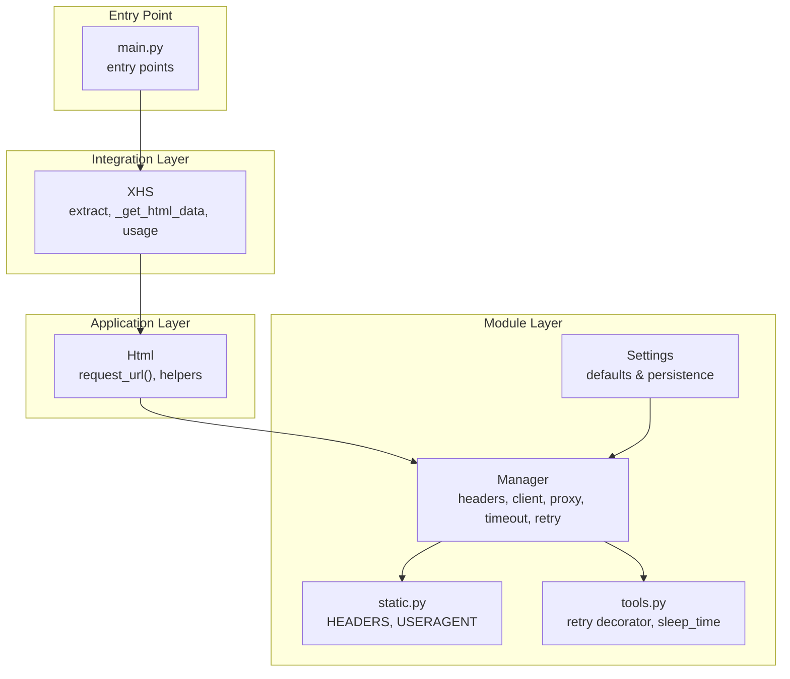
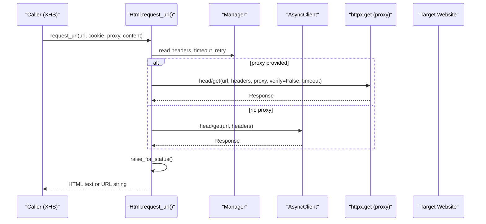
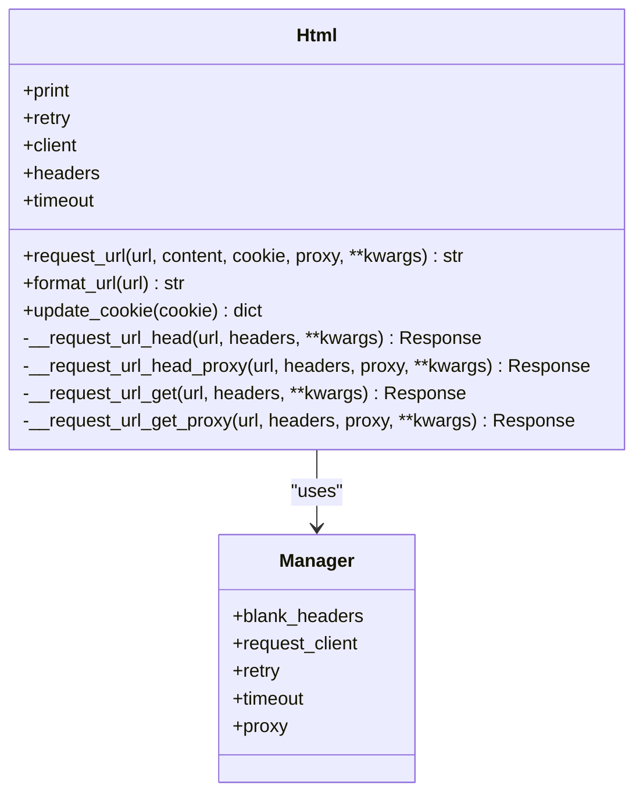
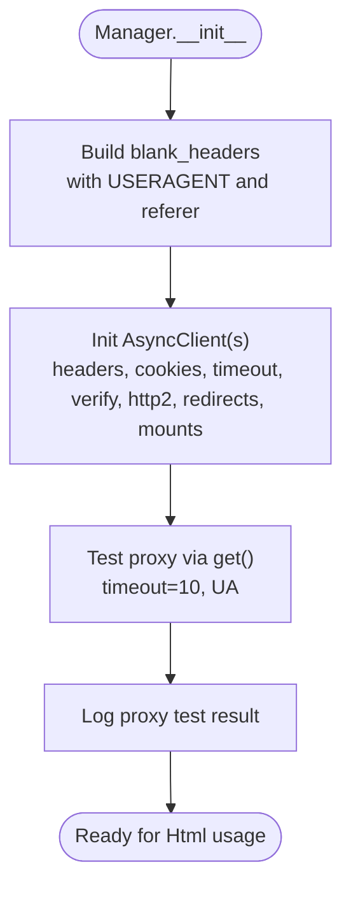
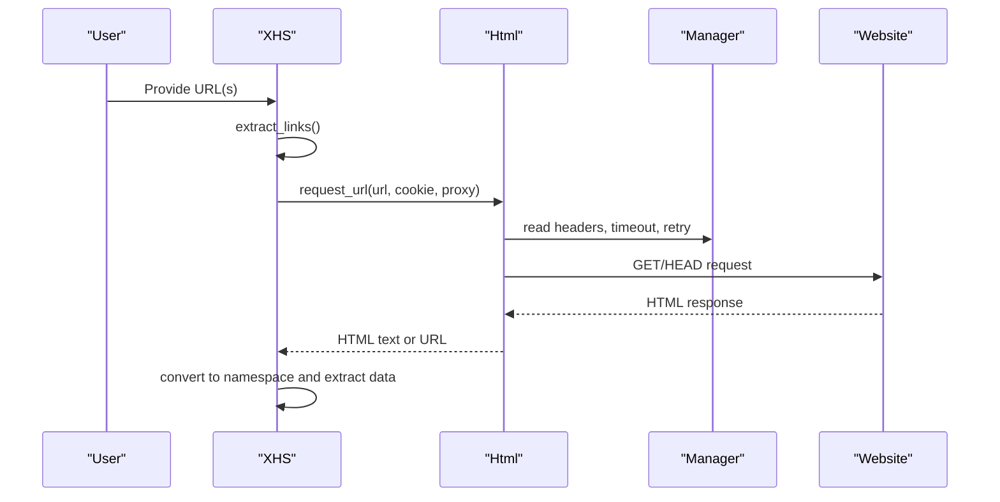
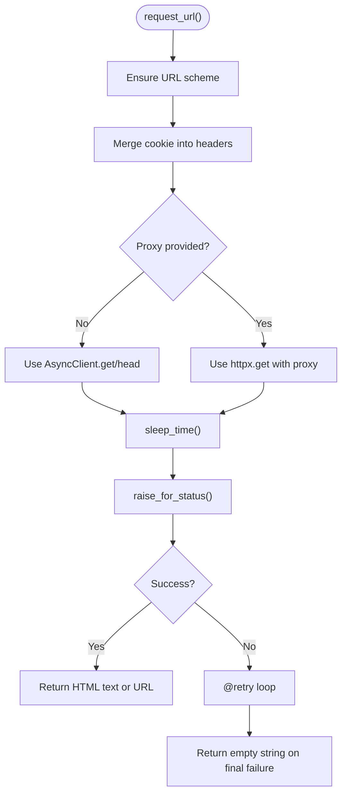
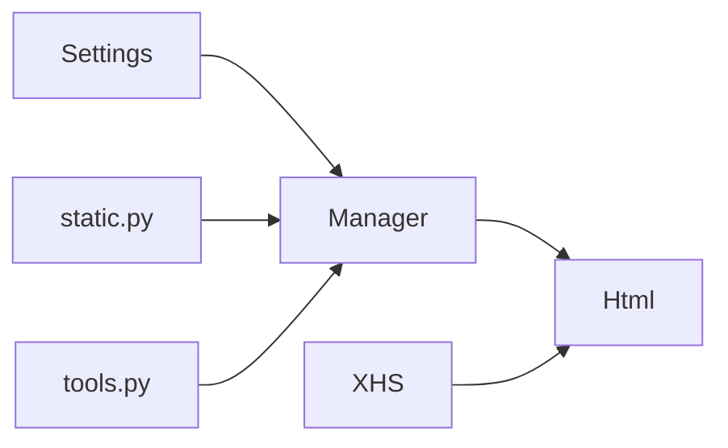

# HTML Request Processing

<cite>
**Referenced Files in This Document**
- [request.py](file://source/application/request.py)
- [manager.py](file://source/module/manager.py)
- [static.py](file://source/module/static.py)
- [tools.py](file://source/module/tools.py)
- [app.py](file://source/application/app.py)
- [settings.py](file://source/module/settings.py)
- [main.py](file://main.py)
- [error.py](file://source/expansion/error.py)
</cite>

## Table of Contents
1. [Introduction](#introduction)
2. [Project Structure](#project-structure)
3. [Core Components](#core-components)
4. [Architecture Overview](#architecture-overview)
5. [Detailed Component Analysis](#detailed-component-analysis)
6. [Dependency Analysis](#dependency-analysis)
7. [Performance Considerations](#performance-considerations)
8. [Troubleshooting Guide](#troubleshooting-guide)
9. [Conclusion](#conclusion)

## Introduction
This document explains the HTML request processing subsystem responsible for fetching webpage content asynchronously. It covers the Html class implementation, request lifecycle from URL input to HTML retrieval, request headers and user agent handling, proxy support, error handling for network failures, response validation, and integration with the Manager class for configuration management. It also provides examples of request configuration, timeout handling, retry mechanisms, and troubleshooting guidance for common failures.

## Project Structure
The HTML request processing subsystem spans several modules:
- Application layer: Html class encapsulates asynchronous HTTP(S) requests and response handling.
- Module layer: Manager initializes clients, headers, timeouts, proxies, and retries; static.py defines default headers and user agent; tools.py provides retry decorators and wait time utilities.
- Integration layer: XHS orchestrates extraction and data processing, invoking Html for content retrieval.
- Configuration layer: Settings manages persistent configuration defaults and updates.

**Diagram sources**
- [request.py:15-138](file://source/application/request.py#L15-L138)
- [manager.py:28-133](file://source/module/manager.py#L28-L133)
- [static.py:19-29](file://source/module/static.py#L19-L29)
- [tools.py:13-63](file://source/module/tools.py#L13-L63)
- [settings.py:10-124](file://source/module/settings.py#L10-L124)
- [app.py:98-194](file://source/application/app.py#L98-L194)
- [main.py:12-60](file://main.py#L12-L60)

**Section sources**
- [request.py:15-138](file://source/application/request.py#L15-L138)
- [manager.py:28-133](file://source/module/manager.py#L28-L133)
- [static.py:19-29](file://source/module/static.py#L19-L29)
- [tools.py:13-63](file://source/module/tools.py#L13-L63)
- [settings.py:10-124](file://source/module/settings.py#L10-L124)
- [app.py:98-194](file://source/application/app.py#L98-L194)
- [main.py:12-60](file://main.py#L12-L60)

## Core Components
- Html: Asynchronous HTTP(S) requester with cookie injection, optional proxy, and robust error handling. Provides request_url() for GET requests and internal helpers for HEAD and GET with and without proxy.
- Manager: Central configuration provider supplying headers, user agent, timeouts, proxies, and shared AsyncClient instances. Also validates proxies and logs outcomes.
- static.py: Defines default headers and user agent used across requests.
- tools.py: Implements retry decorator and randomized delays to smooth request pacing.
- Settings: Manages persistent configuration defaults including timeout, retry count, and proxy settings.
- XHS: Integrates Html into the extraction pipeline, passing cookies and proxies per request.

Key responsibilities:
- Header management: Blank headers merged with user agent and referer.
- Proxy support: Mounts AsyncHTTPTransport with proxy for both request and download clients.
- Retry and delay: Built-in retry loop and randomized sleep between requests.
- Response validation: Uses raise_for_status() and returns empty string on HTTPError.

**Section sources**
- [request.py:15-138](file://source/application/request.py#L15-L138)
- [manager.py:86-133](file://source/module/manager.py#L86-L133)
- [static.py:19-29](file://source/module/static.py#L19-L29)
- [tools.py:13-63](file://source/module/tools.py#L13-L63)
- [settings.py:10-124](file://source/module/settings.py#L10-L124)
- [app.py:365-415](file://source/application/app.py#L365-L415)

## Architecture Overview
The Html class delegates to Manager for configuration and uses httpx.AsyncClient for asynchronous requests. Requests can bypass proxy (using Manager’s client) or use a dedicated proxy via httpx.get for HEAD/GET operations. Responses are validated and optionally returned as text or canonical URL.

**Diagram sources**
- [request.py:26-70](file://source/application/request.py#L26-L70)
- [request.py:110-137](file://source/application/request.py#L110-L137)
- [manager.py:100-124](file://source/module/manager.py#L100-L124)

**Section sources**
- [request.py:26-70](file://source/application/request.py#L26-L70)
- [request.py:110-137](file://source/application/request.py#L110-L137)
- [manager.py:100-124](file://source/module/manager.py#L100-L124)

## Detailed Component Analysis

### Html Class
The Html class encapsulates asynchronous HTTP(S) requests with the following capabilities:
- Cookie injection via update_cookie().
- Optional proxy support via separate httpx.get path.
- Response validation using raise_for_status().
- Content or URL return control via content parameter.
- Integrated retry via @retry decorator.

**Diagram sources**
- [request.py:15-138](file://source/application/request.py#L15-L138)
- [manager.py:86-133](file://source/module/manager.py#L86-L133)

Key behaviors:
- request_url(): Ensures URL scheme, merges cookie into headers, selects proxy branch, awaits sleep_time(), validates response, returns text or URL string.
- update_cookie(): Merges provided cookie into headers or copies blank headers.
- format_url(): Decodes escaped URLs.
- Internal helpers: __request_url_head/_head_proxy and __request_url_get/_get_proxy implement HEAD and GET variants with and without proxy.

Error handling:
- Catches HTTPError, logs localized message, returns empty string.

**Section sources**
- [request.py:15-138](file://source/application/request.py#L15-L138)

### Manager Integration
Manager initializes:
- blank_headers: Default headers merged with user agent and referer.
- request_client: AsyncClient configured with headers, cookies, timeout, verify, HTTP/2, redirects, and proxy mounts.
- download_client: Similar client for downloads.
- proxy: Normalized and tested via __check_proxy().

**Diagram sources**
- [manager.py:86-133](file://source/module/manager.py#L86-L133)
- [manager.py:225-259](file://source/module/manager.py#L225-L259)
- [static.py:19-29](file://source/module/static.py#L19-L29)

**Section sources**
- [manager.py:86-133](file://source/module/manager.py#L86-L133)
- [manager.py:225-259](file://source/module/manager.py#L225-L259)
- [static.py:19-29](file://source/module/static.py#L19-L29)

### Request Lifecycle: From URL to HTML
End-to-end flow:
1. XHS.extract_links() normalizes short links and extracts target URLs.
2. XHS._get_html_data() invokes Html.request_url() with optional cookie and proxy.
3. Html.request_url() performs HEAD/GET, validates response, and returns HTML text.
4. XHS converts HTML to a data namespace and proceeds with extraction.

**Diagram sources**
- [app.py:358-415](file://source/application/app.py#L358-L415)
- [request.py:26-70](file://source/application/request.py#L26-L70)

**Section sources**
- [app.py:358-415](file://source/application/app.py#L358-L415)
- [request.py:26-70](file://source/application/request.py#L26-L70)

### Request Configuration Examples
- Basic GET with cookie and proxy:
  - Call Html.request_url(url, cookie="...", proxy="http://host:port", content=True)
- Return canonical URL without HTML:
  - Call Html.request_url(url, content=False)
- Without proxy:
  - Omit proxy argument; Html uses Manager’s AsyncClient

Configuration sources:
- Manager sets headers, user agent, timeout, and proxy mounts.
- Settings provides defaults for timeout, retry, and proxy.

**Section sources**
- [request.py:26-70](file://source/application/request.py#L26-L70)
- [manager.py:86-133](file://source/module/manager.py#L86-L133)
- [settings.py:12-37](file://source/module/settings.py#L12-L37)

### Timeout Handling and Retry Mechanisms
- Timeout: Set via Manager.timeout and applied to proxy requests.
- Retry: Html.request_url() is decorated with @retry, which attempts the request up to manager.retry times after initial failure.
- Delay: sleep_time() introduces randomized delay between requests to reduce load and mimic human behavior.

**Diagram sources**
- [request.py:26-70](file://source/application/request.py#L26-L70)
- [tools.py:62-63](file://source/module/tools.py#L62-L63)
- [tools.py:13-22](file://source/module/tools.py#L13-L22)

**Section sources**
- [request.py:26-70](file://source/application/request.py#L26-L70)
- [tools.py:13-22](file://source/module/tools.py#L13-L22)
- [tools.py:62-63](file://source/module/tools.py#L62-L63)

### Response Validation and Error Handling
- Validation: raise_for_status() ensures non-error HTTP status.
- Error handling: Catches HTTPError, logs localized message, and returns empty string.
- Logging: Uses Manager.print and centralized logging utility.

Common failure scenarios:
- Network errors, timeouts, or HTTP status errors.
- Proxy connectivity issues during proxy tests or requests.

**Section sources**
- [request.py:63-69](file://source/application/request.py#L63-L69)
- [manager.py:225-259](file://source/module/manager.py#L225-L259)

## Dependency Analysis
- Html depends on Manager for configuration and clients.
- Manager depends on static.py for default headers and user agent, and on tools.py for logging and delay utilities.
- XHS integrates Html into the extraction pipeline and passes cookies/proxies per request.
- Settings supplies defaults consumed by Manager.

**Diagram sources**
- [settings.py:10-124](file://source/module/settings.py#L10-L124)
- [manager.py:86-133](file://source/module/manager.py#L86-L133)
- [static.py:19-29](file://source/module/static.py#L19-L29)
- [tools.py:13-63](file://source/module/tools.py#L13-L63)
- [app.py:178-178](file://source/application/app.py#L178-L178)

**Section sources**
- [settings.py:10-124](file://source/module/settings.py#L10-L124)
- [manager.py:86-133](file://source/module/manager.py#L86-L133)
- [static.py:19-29](file://source/module/static.py#L19-L29)
- [tools.py:13-63](file://source/module/tools.py#L13-L63)
- [app.py:178-178](file://source/application/app.py#L178-L178)

## Performance Considerations
- Concurrency: The system uses httpx.AsyncClient for asynchronous requests; ensure downstream consumers coordinate concurrency appropriately.
- Delays: sleep_time() introduces randomized delays to avoid rate limits and reduce server impact.
- Proxies: Using proxy requests disables connection reuse benefits; prefer direct AsyncClient usage when possible.
- Verification: verify=False reduces TLS overhead but lowers security; keep enabled unless proxy-specific verification is required.
- Redirects: follow_redirects=True simplifies URL normalization but may increase latency; consider disabling if strict control is needed.

Best practices:
- Prefer Manager’s AsyncClient for most requests to leverage mounts and shared configuration.
- Use proxy only when necessary; test proxy connectivity early.
- Tune timeout and retry based on target site behavior and network conditions.
- Apply reasonable delays to prevent IP bans or throttling.

[No sources needed since this section provides general guidance]

## Troubleshooting Guide
Common issues and resolutions:
- Empty HTML returned:
  - Verify URL scheme; Html ensures "https://" prefix if missing.
  - Check cookie validity; use Manager.cookie_str_to_dict() to normalize.
  - Confirm proxy availability; Manager.__check_proxy() tests connectivity.
- HTTP errors:
  - Inspect localized error logs; Html catches HTTPError and returns empty string.
  - Increase timeout or adjust retry count via Settings.
- Proxy failures:
  - Use Manager.__check_proxy() to validate; review warning messages.
  - Disable proxy temporarily to isolate the issue.
- Rate limiting:
  - Add delays via sleep_time(); adjust average delay and sigma in tools.get_wait_time() if customizing.
- SSL/TLS warnings:
  - verify=False reduces checks; enable verification unless proxy requires bypass.

Operational tips:
- Use XHS.extract_links() to normalize short links and resolve canonical URLs.
- For debugging, set content=False to return the final URL instead of HTML text.

**Section sources**
- [request.py:35-36](file://source/application/request.py#L35-L36)
- [request.py:63-69](file://source/application/request.py#L63-L69)
- [manager.py:225-259](file://source/module/manager.py#L225-L259)
- [tools.py:54-63](file://source/module/tools.py#L54-L63)
- [app.py:358-375](file://source/application/app.py#L358-L375)

## Conclusion
The HTML request processing subsystem provides a robust, configurable, and resilient mechanism for fetching webpage content asynchronously. Html centralizes request logic, integrates tightly with Manager for configuration, and leverages retry and delay utilities for reliability. By combining proper header management, optional proxy support, and strict response validation, the system delivers consistent results across diverse environments. Follow the configuration and troubleshooting guidance to optimize performance and stability.