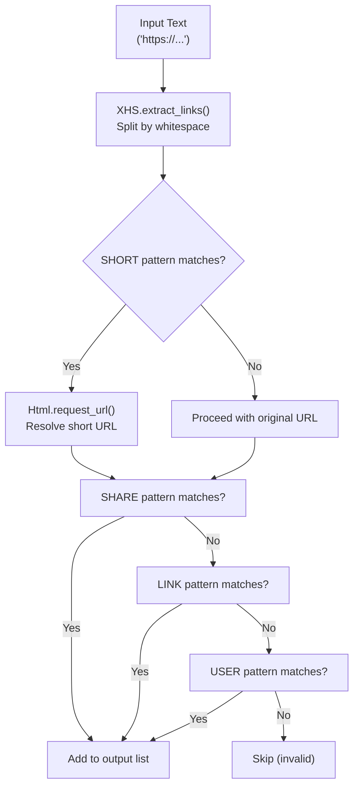
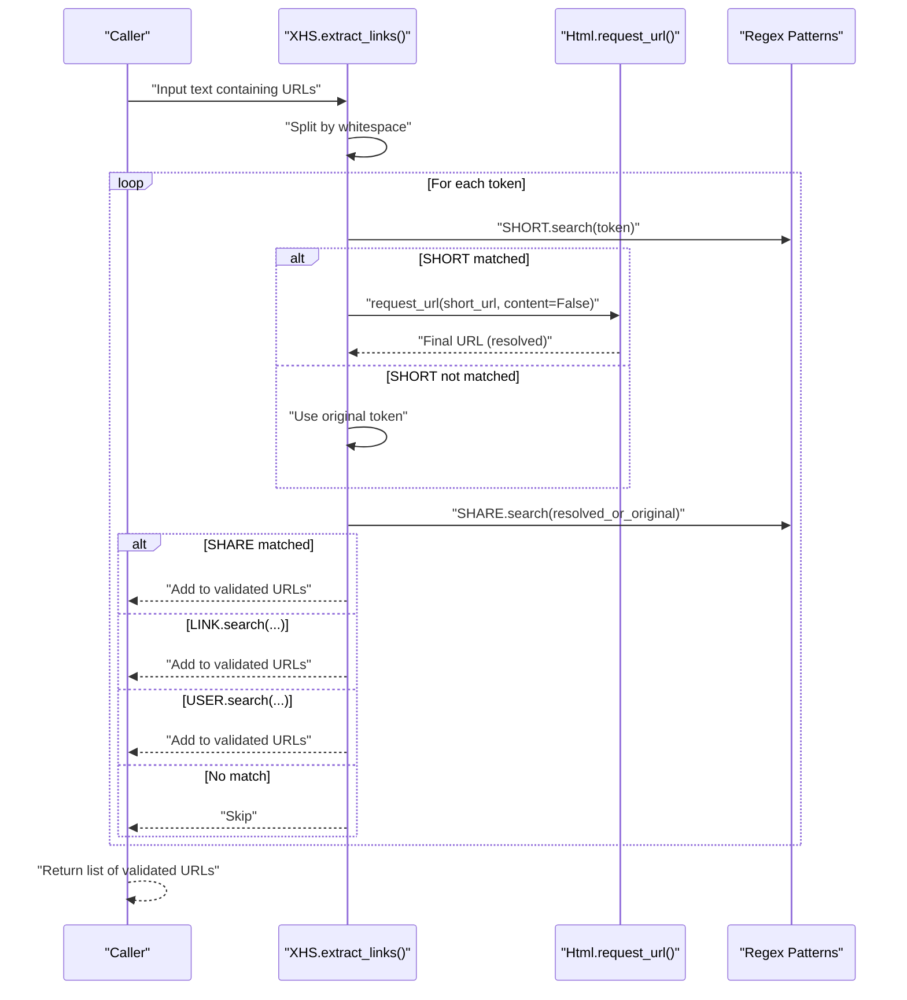
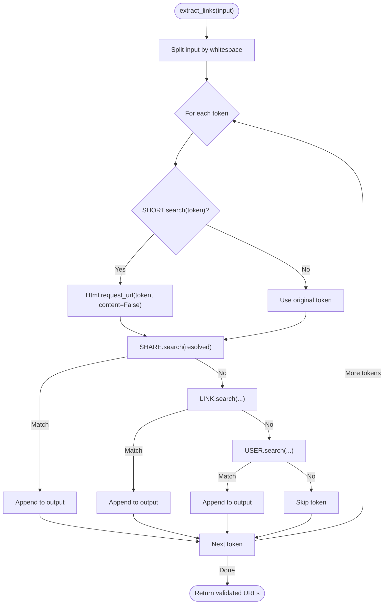
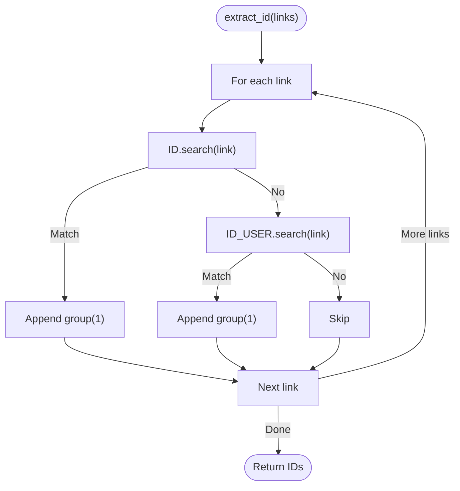
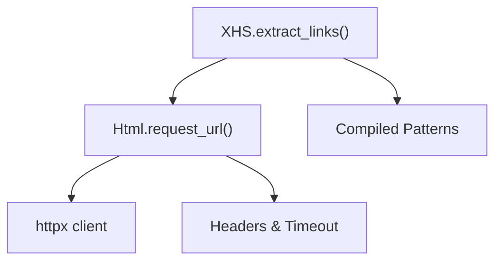

# URL Parsing and Extraction

<cite>
**Referenced Files in This Document**
- [app.py](file://source/application/app.py)
- [request.py](file://source/application/request.py)
- [README.md](file://README.md)
- [README_EN.md](file://README_EN.md)
- [main.py](file://main.py)
- [example.py](file://example.py)
</cite>

## Table of Contents
1. [Introduction](#introduction)
2. [Project Structure](#project-structure)
3. [Core Components](#core-components)
4. [Architecture Overview](#architecture-overview)
5. [Detailed Component Analysis](#detailed-component-analysis)
6. [Dependency Analysis](#dependency-analysis)
7. [Performance Considerations](#performance-considerations)
8. [Troubleshooting Guide](#troubleshooting-guide)
9. [Conclusion](#conclusion)

## Introduction
This document explains the URL parsing and extraction subsystem used to process XiaoHongShu (RedNote) links. It covers:
- Regex patterns for different URL types: LINK (explore pages), USER (profile pages), SHARE (discovery items), and SHORT (xhslink short URLs)
- The extract_links() method workflow that splits input text, resolves short URLs via HTML requests, and validates URL formats
- URL classification logic, pattern matching algorithms, and error handling for malformed URLs
- Practical examples showing how different URL formats are processed, the extraction pipeline from raw input to validated URLs
- The extract_id() method for ID extraction and the __extract_link_id() helper function

## Project Structure
The URL parsing and extraction logic resides primarily in the application layer. The key files are:
- source/application/app.py: Defines regex patterns, URL classification, and extraction methods
- source/application/request.py: Provides HTML request utilities used to resolve short URLs
- README.md and README_EN.md: Document supported URL formats
- main.py and example.py: Demonstrate usage of the extraction pipeline in real workflows

**Diagram sources**
- [app.py:358-375](file://source/application/app.py#L358-L375)
- [request.py:26-70](file://source/application/request.py#L26-L70)

**Section sources**
- [app.py:101-107](file://source/application/app.py#L101-L107)
- [README.md:66-73](file://README.md#L66-L73)
- [README_EN.md:66-74](file://README_EN.md#L66-L74)

## Core Components
- Regex patterns for URL classification:
  - LINK: Explore pages
  - USER: Profile pages
  - SHARE: Discovery item pages
  - SHORT: xhslink short URLs
- ID extraction patterns:
  - ID: Extracts note ID from explore or discovery item URLs
  - ID_USER: Extracts note ID from profile URLs
- Methods:
  - extract_links(): Processes input text, resolves short URLs, classifies URLs, and returns validated URLs
  - extract_id(): Extracts IDs from validated URLs
  - __extract_link_id(): Extracts note ID from a URL path

Key implementation references:
- Patterns and methods: [app.py:101-107](file://source/application/app.py#L101-L107), [app.py:358-384](file://source/application/app.py#L358-L384), [app.py:557-560](file://source/application/app.py#L557-L560)
- Short URL resolution: [request.py:26-70](file://source/application/request.py#L26-L70)

**Section sources**
- [app.py:101-107](file://source/application/app.py#L101-L107)
- [app.py:358-384](file://source/application/app.py#L358-L384)
- [app.py:557-560](file://source/application/app.py#L557-L560)
- [request.py:26-70](file://source/application/request.py#L26-L70)

## Architecture Overview
The URL extraction pipeline integrates with the HTML request layer to resolve short URLs and then classifies and validates URLs.

**Diagram sources**
- [app.py:358-375](file://source/application/app.py#L358-L375)
- [request.py:26-70](file://source/application/request.py#L26-L70)

## Detailed Component Analysis

### Regex Patterns and Classification
- LINK: Matches explore pages
- USER: Matches profile pages
- SHARE: Matches discovery item pages
- SHORT: Matches xhslink short URLs
- ID: Extracts note ID from explore or discovery item URLs
- ID_USER: Extracts note ID from profile URLs

Classification logic:
- If a token matches SHORT, resolve it to the final URL using Html.request_url(content=False)
- Then classify using SHARE, LINK, or USER patterns in order
- Add to output list if matched; otherwise skip

Supported URL formats (as documented):
- Explore: https://www.xiaohongshu.com/explore/{NoteID}?xsec_token=...
- Discovery item: https://www.xiaohongshu.com/discovery/item/{NoteID}?xsec_token=...
- Profile: https://www.xiaohongshu.com/user/profile/{AuthorID}/{NoteID}?xsec_token=...
- Short: https://xhslink.com/{ShareCode}

**Section sources**
- [app.py:101-107](file://source/application/app.py#L101-L107)
- [README.md:66-73](file://README.md#L66-L73)
- [README_EN.md:66-74](file://README_EN.md#L66-L74)

### extract_links() Method Workflow
Behavior:
- Split input text by whitespace
- For each token:
  - If SHORT pattern matches, resolve via Html.request_url(content=False) to get the final URL
  - Classify using SHARE, LINK, USER patterns in order
  - Append to output list if matched
- Return the list of validated URLs

Processing flow:

**Diagram sources**
- [app.py:358-375](file://source/application/app.py#L358-L375)
- [request.py:26-70](file://source/application/request.py#L26-L70)

**Section sources**
- [app.py:358-375](file://source/application/app.py#L358-L375)
- [request.py:26-70](file://source/application/request.py#L26-L70)

### extract_id() Method and __extract_link_id() Helper
- extract_id(links: list[str]) -> list[str]: Iterates validated URLs and extracts IDs using ID and ID_USER patterns
- __extract_link_id(url: str) -> str: Uses URL parsing to extract the last path segment as the note ID

**Diagram sources**
- [app.py:377-384](file://source/application/app.py#L377-L384)
- [app.py:557-560](file://source/application/app.py#L557-L560)

**Section sources**
- [app.py:377-384](file://source/application/app.py#L377-L384)
- [app.py:557-560](file://source/application/app.py#L557-L560)

### Practical Examples
- Input: "Multiple URLs separated by spaces"
  - Behavior: extract_links() splits and processes each token independently
  - Output: List of validated URLs (after resolving shorts and applying classification)
- Short URL resolution:
  - Input: https://xhslink.com/{ShareCode}
  - Behavior: Html.request_url(content=False) follows redirects and returns the final URL
  - Output: https://www.xiaohongshu.com/discovery/item/{NoteID} or similar
- ID extraction:
  - Input: https://www.xiaohongshu.com/explore/{NoteID}?xsec_token=...
  - Output: {NoteID}

Integration points:
- CLI usage: [example.py:94-113](file://example.py#L94-L113)
- API/MCP usage: [app.py:739-756](file://source/application/app.py#L739-L756), [app.py:926-939](file://source/application/app.py#L926-L939)

**Section sources**
- [example.py:94-113](file://example.py#L94-L113)
- [app.py:739-756](file://source/application/app.py#L739-L756)
- [app.py:926-939](file://source/application/app.py#L926-L939)

## Dependency Analysis
- XHS.extract_links() depends on:
  - Html.request_url() for resolving short URLs
  - Compiled regex patterns for classification
- Html.request_url() depends on:
  - httpx client and configured headers/timeouts
  - Optional proxy support

**Diagram sources**
- [app.py:358-375](file://source/application/app.py#L358-L375)
- [request.py:26-70](file://source/application/request.py#L26-L70)

**Section sources**
- [app.py:358-375](file://source/application/app.py#L358-L375)
- [request.py:26-70](file://source/application/request.py#L26-L70)

## Performance Considerations
- Short URL resolution involves network requests; batching or limiting concurrent requests can reduce latency
- Regex matching is linear in token length; ensure input is pre-split appropriately
- Consider caching resolved short URLs to avoid repeated network calls

## Troubleshooting Guide
Common issues and resolutions:
- Malformed or unsupported URLs:
  - Symptom: Token skipped during extract_links()
  - Resolution: Ensure URLs match supported formats documented in README
- Short URL resolution failures:
  - Symptom: Empty or invalid final URL
  - Resolution: Verify network connectivity and proxy settings; check Html.request_url() error logging
- ID extraction returns empty:
  - Symptom: extract_id() returns empty list
  - Resolution: Confirm URLs contain expected note IDs; verify ID and ID_USER patterns match

Operational references:
- Supported URL formats: [README.md:66-73](file://README.md#L66-L73), [README_EN.md:66-74](file://README_EN.md#L66-L74)
- Error logging in HTML requests: [request.py:63-69](file://source/application/request.py#L63-L69)

**Section sources**
- [README.md:66-73](file://README.md#L66-L73)
- [README_EN.md:66-74](file://README_EN.md#L66-L74)
- [request.py:63-69](file://source/application/request.py#L63-L69)

## Conclusion
The URL parsing and extraction subsystem provides robust classification and validation of XiaoHongShu URLs, with special handling for short URLs via HTML resolution. The extract_links() method offers a clear pipeline from raw input to validated URLs, while extract_id() and __extract_link_id() support downstream ID extraction. Following the documented URL formats and understanding the classification logic ensures reliable operation across CLI, API, and MCP modes.