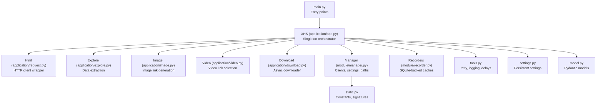
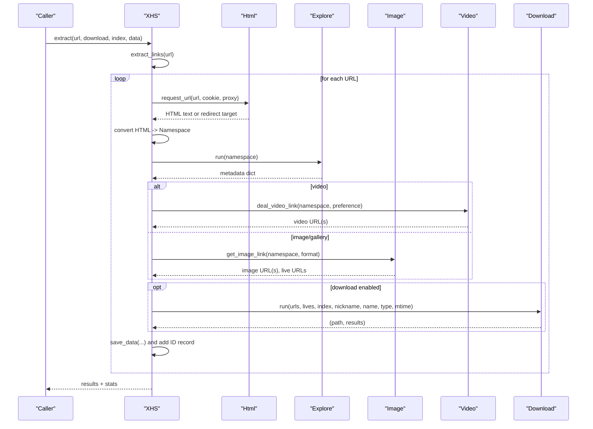
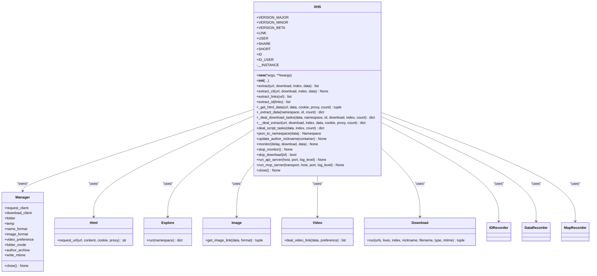
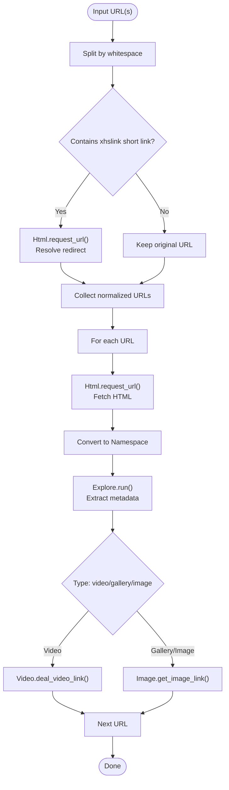
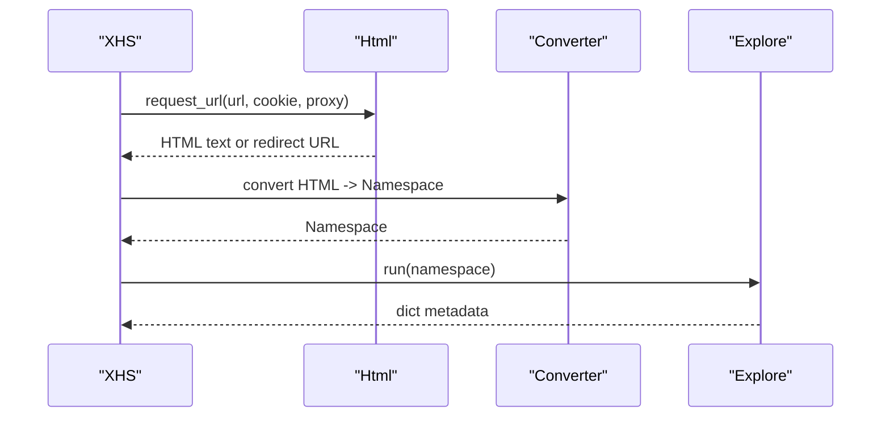
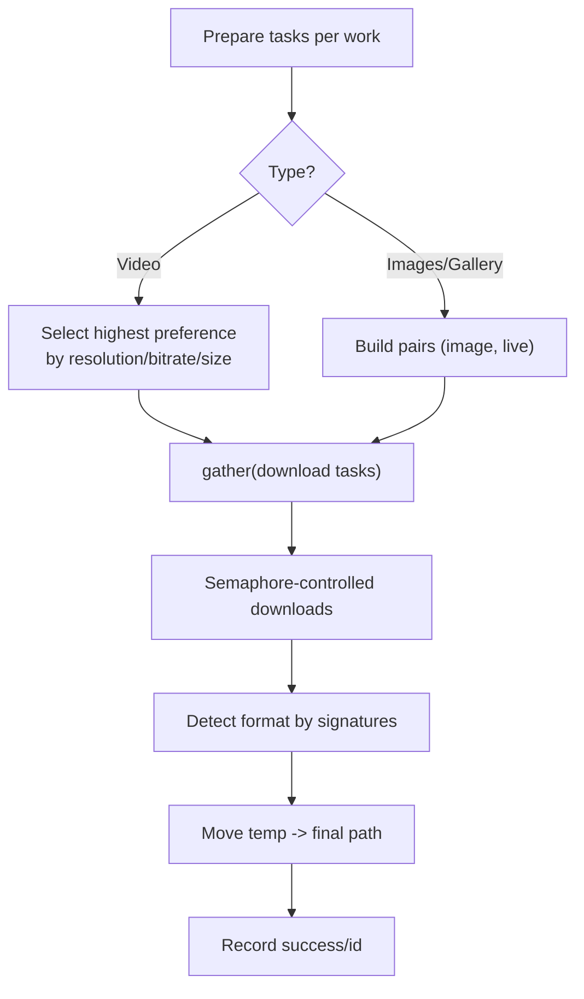
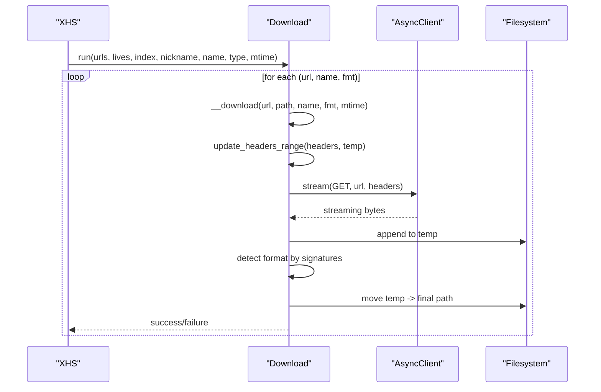
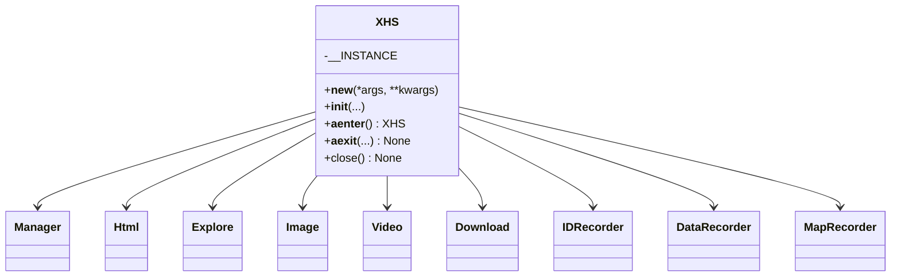
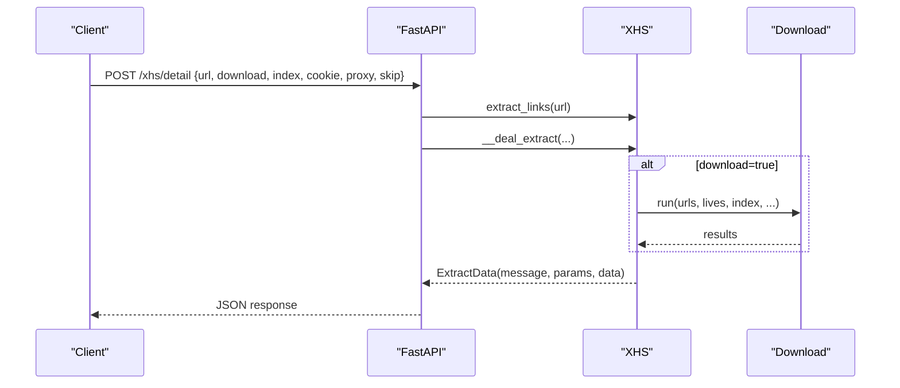
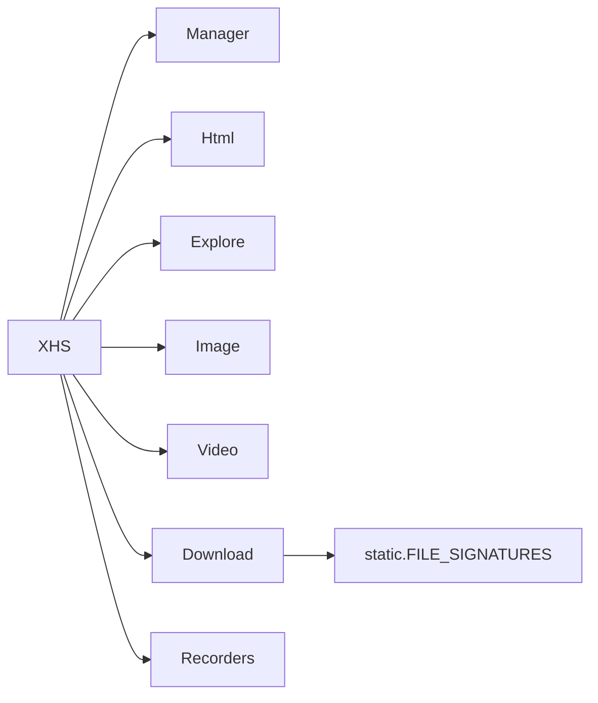

# Core Functionality

<cite>
**Referenced Files in This Document**
- [main.py](file://main.py)
- [source/__init__.py](file://source/__init__.py)
- [source/application/app.py](file://source/application/app.py)
- [source/application/download.py](file://source/application/download.py)
- [source/application/request.py](file://source/application/request.py)
- [source/application/explore.py](file://source/application/explore.py)
- [source/application/image.py](file://source/application/image.py)
- [source/application/video.py](file://source/application/video.py)
- [source/module/settings.py](file://source/module/settings.py)
- [source/module/manager.py](file://source/module/manager.py)
- [source/module/recorder.py](file://source/module/recorder.py)
- [source/module/tools.py](file://source/module/tools.py)
- [source/module/static.py](file://source/module/static.py)
- [source/module/model.py](file://source/module/model.py)
</cite>

## Table of Contents
1. [Introduction](#introduction)
2. [Project Structure](#project-structure)
3. [Core Components](#core-components)
4. [Architecture Overview](#architecture-overview)
5. [Detailed Component Analysis](#detailed-component-analysis)
6. [Dependency Analysis](#dependency-analysis)
7. [Performance Considerations](#performance-considerations)
8. [Troubleshooting Guide](#troubleshooting-guide)
9. [Conclusion](#conclusion)

## Introduction
This document explains the core functionality of XHS-Downloader with a focus on:
- Content extraction from XiaoHongShu URLs (works, user profiles, shares, short links)
- Data extraction algorithms and HTML parsing
- Response processing and conversion
- Download management (formats, quality preferences, batch processing, concurrency, caching)
- The singleton pattern implementation of the XHS orchestrator
- Asynchronous download engine with semaphore control and multi-format support
- Practical examples mapped to actual code paths

## Project Structure
At a high level, the application is organized around a central orchestrator (XHS) that coordinates:
- URL extraction and normalization
- HTML retrieval and parsing
- Data extraction and classification
- Download preparation and execution
- Persistence of records and caches

**Diagram sources**
- [main.py:1-60](file://main.py#L1-L60)
- [source/application/app.py:98-194](file://source/application/app.py#L98-L194)
- [source/application/request.py:15-138](file://source/application/request.py#L15-L138)
- [source/application/explore.py:9-83](file://source/application/explore.py#L9-L83)
- [source/application/image.py:8-67](file://source/application/image.py#L8-L67)
- [source/application/video.py:7-54](file://source/application/video.py#L7-L54)
- [source/application/download.py:30-338](file://source/application/download.py#L30-L338)
- [source/module/manager.py:28-308](file://source/module/manager.py#L28-L308)
- [source/module/recorder.py:13-192](file://source/module/recorder.py#L13-L192)
- [source/module/static.py:39-73](file://source/module/static.py#L39-L73)
- [source/module/tools.py:13-64](file://source/module/tools.py#L13-L64)
- [source/module/settings.py:10-124](file://source/module/settings.py#L10-L124)
- [source/module/model.py:4-17](file://source/module/model.py#L4-L17)

**Section sources**
- [main.py:1-60](file://main.py#L1-L60)
- [source/__init__.py:1-12](file://source/__init__.py#L1-L12)

## Core Components
- XHS (singleton): Central orchestrator for URL extraction, data extraction, download orchestration, and persistence.
- Html: HTTP client wrapper with retries and optional proxy/head requests.
- Explore: Extracts structured metadata from parsed HTML payloads.
- Image/Video: Resolve final media URLs from extracted tokens and preferences.
- Download: Asynchronous downloader with semaphore-controlled concurrency, resume-aware caching, and format detection.
- Manager: Global configuration, clients, paths, and helpers.
- Recorders: SQLite-backed caches for IDs, data, and author mapping.
- Tools and Static: Retry decorators, logging, delays, constants, and file signatures.

**Section sources**
- [source/application/app.py:98-194](file://source/application/app.py#L98-L194)
- [source/application/request.py:15-138](file://source/application/request.py#L15-L138)
- [source/application/explore.py:9-83](file://source/application/explore.py#L9-L83)
- [source/application/image.py:8-67](file://source/application/image.py#L8-L67)
- [source/application/video.py:7-54](file://source/application/video.py#L7-L54)
- [source/application/download.py:30-338](file://source/application/download.py#L30-L338)
- [source/module/manager.py:28-308](file://source/module/manager.py#L28-L308)
- [source/module/recorder.py:13-192](file://source/module/recorder.py#L13-L192)
- [source/module/tools.py:13-64](file://source/module/tools.py#L13-L64)
- [source/module/static.py:39-73](file://source/module/static.py#L39-L73)

## Architecture Overview
The XHS orchestrator coordinates a pipeline:
- Normalize URLs (short links, shares, user profiles)
- Fetch HTML with optional cookie/proxy
- Convert HTML payload to a safe namespace
- Extract metadata and classify content type
- Resolve media URLs (image/video/live GIF)
- Download concurrently with resume and format detection
- Persist records and caches

**Diagram sources**
- [source/application/app.py:268-506](file://source/application/app.py#L268-L506)
- [source/application/request.py:26-70](file://source/application/request.py#L26-L70)
- [source/application/explore.py:12-83](file://source/application/explore.py#L12-L83)
- [source/application/image.py:9-40](file://source/application/image.py#L9-L40)
- [source/application/video.py:14-54](file://source/application/video.py#L14-L54)
- [source/application/download.py:71-112](file://source/application/download.py#L71-L112)

## Detailed Component Analysis

### XHS Singleton and Orchestrator
- Singleton via custom `__new__` ensures a single global instance for consistent settings and caches.
- URL extraction supports:
  - Short links (xhslink.com)
  - Shares (discovery/item)
  - Explore pages (explore)
  - User profiles (user/profile)
- Data extraction pipeline:
  - Fetch HTML with optional cookie/proxy
  - Convert to Namespace and run Explore
  - Classify content type and resolve media URLs
  - Download with concurrency control and resume
  - Save data and update records

**Diagram sources**
- [source/application/app.py:98-194](file://source/application/app.py#L98-L194)
- [source/module/manager.py:28-133](file://source/module/manager.py#L28-L133)
- [source/application/request.py:15-70](file://source/application/request.py#L15-L70)
- [source/application/explore.py:12-83](file://source/application/explore.py#L12-L83)
- [source/application/image.py:8-40](file://source/application/image.py#L8-L40)
- [source/application/video.py:14-54](file://source/application/video.py#L14-L54)
- [source/application/download.py:71-112](file://source/application/download.py#L71-L112)
- [source/module/recorder.py:13-192](file://source/module/recorder.py#L13-L192)

**Section sources**
- [source/application/app.py:98-194](file://source/application/app.py#L98-L194)
- [source/application/app.py:268-506](file://source/application/app.py#L268-L506)

### Content Extraction from XiaoHongShu URLs
- URL normalization:
  - Short links resolved via Html.request_url
  - Share and explore URLs collected directly
  - User profile URLs supported for extraction
- Data extraction:
  - Interactions, tags, info, timestamps, user info
  - Classification into video, gallery (multiple images), or single-image post
- Naming rules:
  - Compose filenames from configured keys (e.g., publish time, author nickname, title)

**Diagram sources**
- [source/application/app.py:358-415](file://source/application/app.py#L358-L415)
- [source/application/request.py:26-70](file://source/application/request.py#L26-L70)
- [source/application/explore.py:12-83](file://source/application/explore.py#L12-L83)
- [source/application/image.py:9-40](file://source/application/image.py#L9-L40)
- [source/application/video.py:14-54](file://source/application/video.py#L14-L54)

**Section sources**
- [source/application/app.py:358-415](file://source/application/app.py#L358-L415)
- [source/application/explore.py:12-83](file://source/application/explore.py#L12-L83)

### Data Extraction Algorithms and HTML Parsing
- HTML retrieval:
  - Optional cookie/proxy forwarding
  - Head/get variants depending on proxy presence
  - Retry decorator applied to robustness
- Conversion:
  - HTML payload transformed into a safe Namespace for nested key access
- Extraction:
  - Safe nested extraction with defaults
  - Timestamp normalization to readable strings
  - Author info and links derived consistently

**Diagram sources**
- [source/application/request.py:26-70](file://source/application/request.py#L26-L70)
- [source/application/app.py:562-564](file://source/application/app.py#L562-L564)
- [source/application/explore.py:12-83](file://source/application/explore.py#L12-L83)

**Section sources**
- [source/application/request.py:26-70](file://source/application/request.py#L26-L70)
- [source/application/explore.py:12-83](file://source/application/explore.py#L12-L83)

### Download Management and Quality Preferences
- Supported formats:
  - Images: JPEG, PNG, WebP, AVIF, HEIC (and auto-detection)
  - Videos: MP4; audio formats via content-type mapping
- Quality preferences:
  - Video sorting by resolution, bitrate, or size
- Batch processing:
  - Per-work concurrency controlled by a semaphore
  - Resume-aware downloads with Range headers and temporary files
  - Format detection by file signatures
- Intelligent caching:
  - Skip-download cache (IDRecorder)
  - Data recording (DataRecorder)
  - Author mapping cache (MapRecorder)

**Diagram sources**
- [source/application/download.py:71-112](file://source/application/download.py#L71-L112)
- [source/application/download.py:196-268](file://source/application/download.py#L196-L268)
- [source/application/video.py:30-54](file://source/application/video.py#L30-L54)
- [source/application/image.py:9-40](file://source/application/image.py#L9-L40)
- [source/module/static.py:39-67](file://source/module/static.py#L39-L67)
- [source/module/recorder.py:13-79](file://source/module/recorder.py#L13-L79)

**Section sources**
- [source/application/download.py:30-338](file://source/application/download.py#L30-L338)
- [source/application/video.py:14-54](file://source/application/video.py#L14-L54)
- [source/application/image.py:8-67](file://source/application/image.py#L8-L67)
- [source/module/static.py:39-67](file://source/module/static.py#L39-L67)
- [source/module/recorder.py:13-192](file://source/module/recorder.py#L13-L192)

### Asynchronous Download Engine with Semaphore Control
- Concurrency:
  - Semaphore limits concurrent downloads
  - Tasks are gathered and awaited
- Resume and caching:
  - Range requests resume partial downloads
  - Temporary files moved atomically upon completion
- Error handling:
  - HTTP errors logged and retried via decorator
  - Cache errors trigger re-download after cleanup
- Format detection:
  - File signatures determine final extension

**Diagram sources**
- [source/application/download.py:196-268](file://source/application/download.py#L196-L268)
- [source/module/static.py:39-67](file://source/module/static.py#L39-L67)

**Section sources**
- [source/application/download.py:30-338](file://source/application/download.py#L30-L338)

### Singleton Pattern Implementation of XHS
- Ensures a single orchestrator instance across the application lifecycle
- Initializes Manager, Html, Explore, Image, Video, Download, and recorders
- Provides lifecycle hooks (__aenter__/__aexit__) for resource cleanup

**Diagram sources**
- [source/application/app.py:108-194](file://source/application/app.py#L108-L194)

**Section sources**
- [source/application/app.py:108-194](file://source/application/app.py#L108-L194)

### API and Server Integration
- FastAPI endpoint for detail extraction and download
- MCP server exposing two tools:
  - get_detail_data: fetch metadata without downloading
  - download_detail: download files with optional index and return flag

**Diagram sources**
- [source/application/app.py:737-756](file://source/application/app.py#L737-L756)
- [source/module/model.py:4-17](file://source/module/model.py#L4-L17)

**Section sources**
- [source/application/app.py:685-704](file://source/application/app.py#L685-L704)
- [source/application/app.py:706-804](file://source/application/app.py#L706-L804)
- [source/module/model.py:4-17](file://source/module/model.py#L4-L17)

## Dependency Analysis
- XHS depends on Manager for clients and settings, and on Html/Explore/Image/Video/Download for processing.
- Download depends on Manager for clients, paths, and configuration; uses static signatures for format detection.
- Recorders persist state to SQLite databases under managed folders.

**Diagram sources**
- [source/application/app.py:98-194](file://source/application/app.py#L98-L194)
- [source/application/download.py:30-70](file://source/application/download.py#L30-L70)
- [source/module/static.py:39-67](file://source/module/static.py#L39-L67)
- [source/module/recorder.py:13-192](file://source/module/recorder.py#L13-L192)

**Section sources**
- [source/application/app.py:98-194](file://source/application/app.py#L98-L194)
- [source/application/download.py:30-70](file://source/application/download.py#L30-L70)
- [source/module/static.py:39-67](file://source/module/static.py#L39-L67)
- [source/module/recorder.py:13-192](file://source/module/recorder.py#L13-L192)

## Performance Considerations
- Concurrency control:
  - Semaphore limits simultaneous downloads to avoid rate limiting and resource exhaustion.
- Resumable downloads:
  - Range requests and temporary files reduce wasted bandwidth on failures.
- Format detection:
  - Early signature checks prevent misclassification and unnecessary conversions.
- Caching:
  - IDRecorder avoids redundant processing; MapRecorder caches author aliases.
- Client configuration:
  - Shared transports with proxies and HTTP/2 enable efficient connections.

[No sources needed since this section provides general guidance]

## Troubleshooting Guide
- Network errors:
  - Requests decorated with retry; failures logged with ERROR style.
- Cache anomalies:
  - 416 Range error triggers CacheError and re-download after temp deletion.
- Proxy issues:
  - Manager tests proxy connectivity and logs warnings.
- Duplicate downloads:
  - skip_download checks IDRecorder; set download_record to toggle behavior.
- Logging:
  - Centralized logging utility prints styled messages to console or TUI.

**Section sources**
- [source/application/request.py:63-69](file://source/application/request.py#L63-L69)
- [source/application/download.py:204-267](file://source/application/download.py#L204-L267)
- [source/module/manager.py:225-259](file://source/module/manager.py#L225-L259)
- [source/module/tools.py:42-52](file://source/module/tools.py#L42-L52)
- [source/application/app.py:653-654](file://source/application/app.py#L653-L654)

## Conclusion
XHS-Downloader’s core functionality centers on a robust, singleton-driven orchestrator that normalizes URLs, extracts structured data, resolves media URLs, and executes asynchronous downloads with concurrency control and intelligent caching. The modular design enables extensibility, while configuration and persistent settings ensure reliable operation across diverse environments.