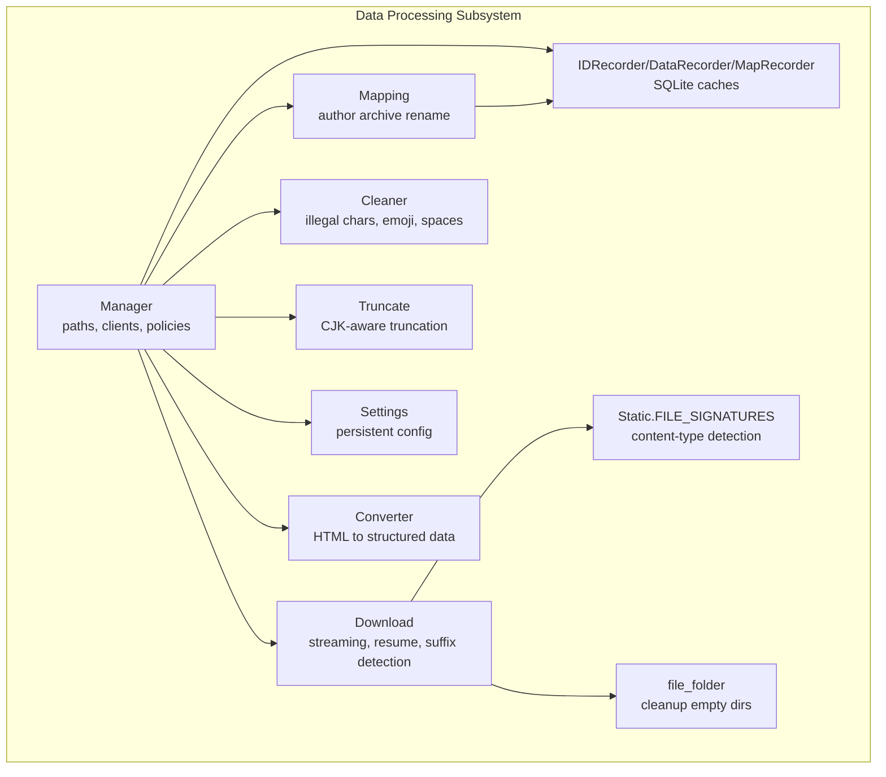
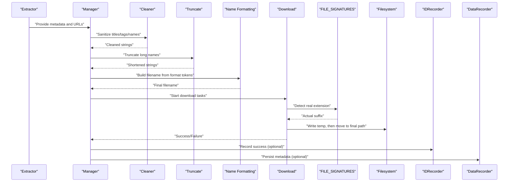
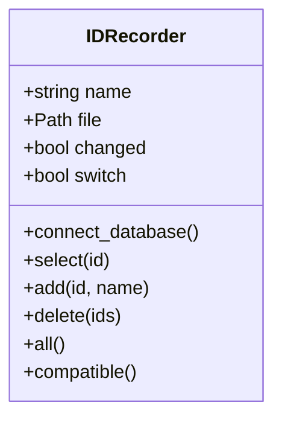
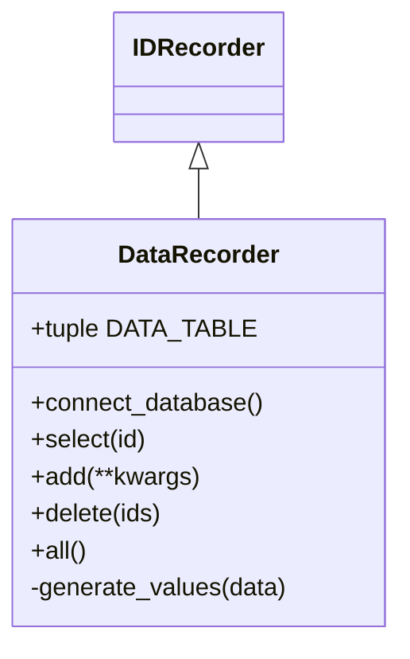
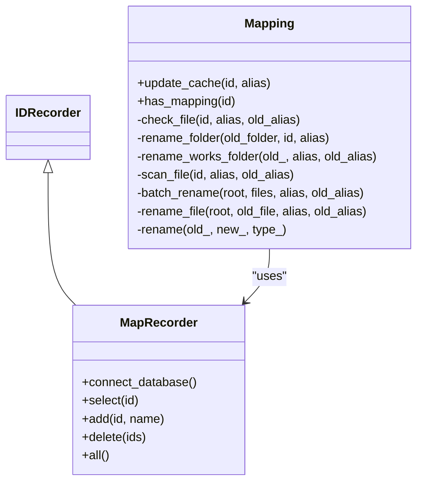
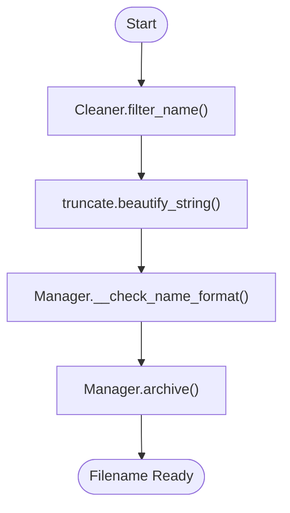
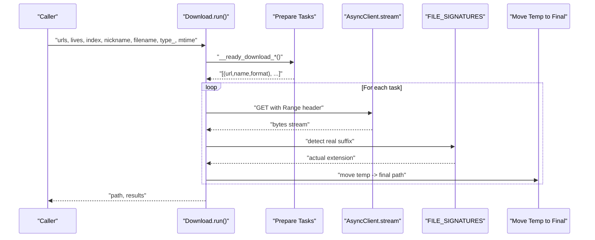
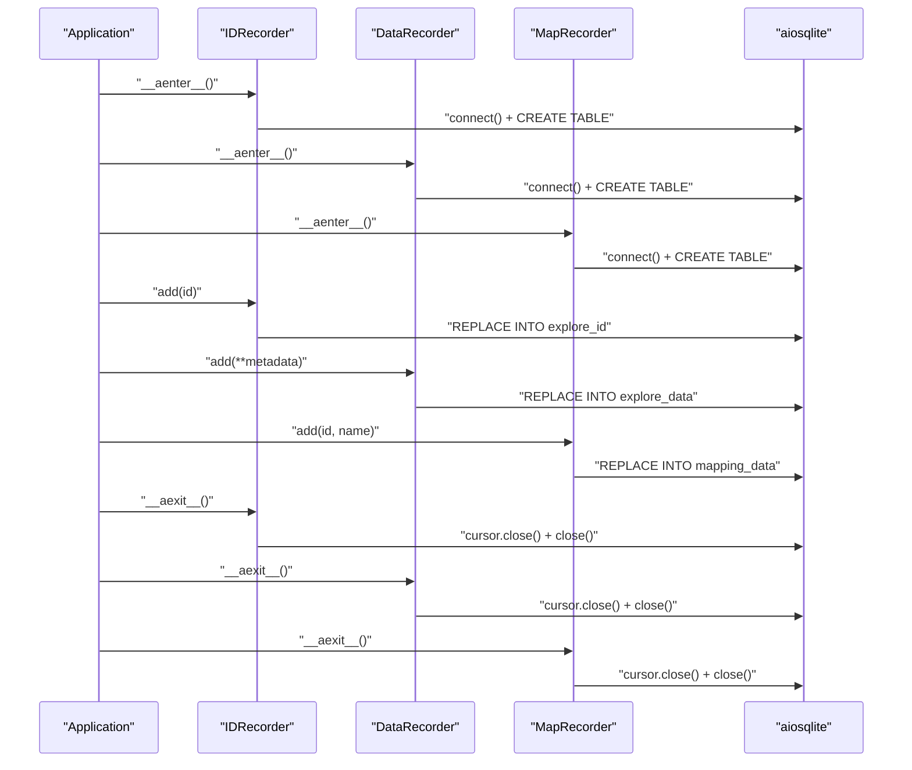
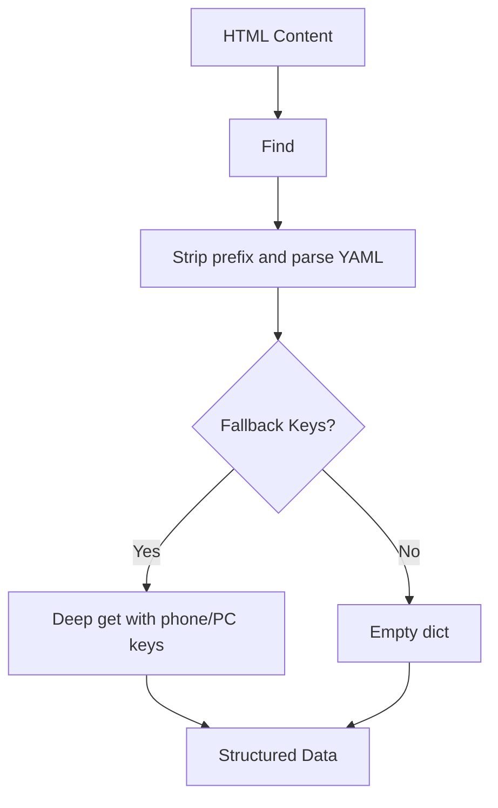
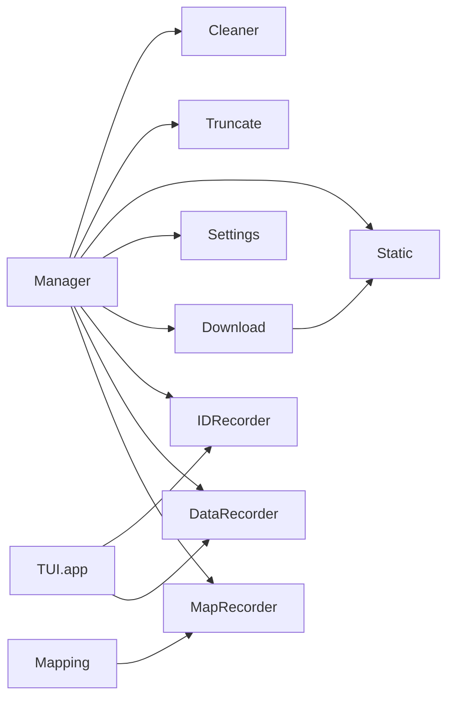

# Data Processing

<cite>
**Referenced Files in This Document**
- [recorder.py](file://source/module/recorder.py)
- [download.py](file://source/application/download.py)
- [manager.py](file://source/module/manager.py)
- [mapping.py](file://source/module/mapping.py)
- [static.py](file://source/module/static.py)
- [settings.py](file://source/module/settings.py)
- [cleaner.py](file://source/expansion/cleaner.py)
- [truncate.py](file://source/expansion/truncate.py)
- [file_folder.py](file://source/expansion/file_folder.py)
- [converter.py](file://source/expansion/converter.py)
- [app.py](file://source/TUI/app.py)
- [README.md](file://README.md)
</cite>

## Table of Contents
1. [Introduction](#introduction)
2. [Project Structure](#project-structure)
3. [Core Components](#core-components)
4. [Architecture Overview](#architecture-overview)
5. [Detailed Component Analysis](#detailed-component-analysis)
6. [Dependency Analysis](#dependency-analysis)
7. [Performance Considerations](#performance-considerations)
8. [Troubleshooting Guide](#troubleshooting-guide)
9. [Conclusion](#conclusion)
10. [Appendices](#appendices)

## Introduction
This document explains the data processing subsystem responsible for transforming extracted content into downloadable files, managing metadata, applying file naming rules, and persisting records. It covers caching mechanisms for duplicate detection and download history tracking via IDRecorder and DataRecorder, the author nickname mapping system with MapRecorder and Mapping, and the SQLite-backed workflows. It also documents validation, sanitization, and formatting processes, along with practical examples and best practices for cache management and database interactions.

## Project Structure
The data processing subsystem spans several modules:
- Recorder classes for caching and persistence
- Download orchestration and file naming
- Name filtering and sanitization utilities
- Manager orchestrates clients, paths, and policies
- Mapping utilities for author archive renaming
- Static constants for signatures and defaults
- Settings for persistent configuration
- Expansion utilities for cleaning, truncation, and conversion

**Diagram sources**
- [manager.py:28-132](file://source/module/manager.py#L28-L132)
- [download.py:30-122](file://source/application/download.py#L30-L122)
- [recorder.py:13-191](file://source/module/recorder.py#L13-L191)
- [mapping.py:16-217](file://source/module/mapping.py#L16-L217)
- [cleaner.py:14-97](file://source/expansion/cleaner.py#L14-L97)
- [truncate.py:8-36](file://source/expansion/truncate.py#L8-L36)
- [static.py:39-67](file://source/module/static.py#L39-L67)
- [settings.py:10-124](file://source/module/settings.py#L10-L124)
- [converter.py:9-45](file://source/expansion/converter.py#L9-L45)
- [file_folder.py:12-26](file://source/expansion/file_folder.py#L12-L26)

**Section sources**
- [manager.py:28-132](file://source/module/manager.py#L28-L132)
- [download.py:30-122](file://source/application/download.py#L30-L122)
- [recorder.py:13-191](file://source/module/recorder.py#L13-L191)
- [mapping.py:16-217](file://source/module/mapping.py#L16-L217)
- [cleaner.py:14-97](file://source/expansion/cleaner.py#L14-L97)
- [truncate.py:8-36](file://source/expansion/truncate.py#L8-L36)
- [static.py:39-67](file://source/module/static.py#L39-L67)
- [settings.py:10-124](file://source/module/settings.py#L10-L124)
- [converter.py:9-45](file://source/expansion/converter.py#L9-L45)
- [file_folder.py:12-26](file://source/expansion/file_folder.py#L12-L26)

## Core Components
- IDRecorder: Tracks downloaded IDs to prevent redundant downloads. Uses a SQLite table explore_id keyed by ID.
- DataRecorder: Persists extracted metadata into explore_data with a fixed schema. Uses REPLACE to upsert.
- MapRecorder: Maintains author ID to alias/name mapping for author archive mode.
- Download: Orchestrates streaming downloads, resume support, file suffix detection, and final move to target location.
- Manager: Central policy holder for paths, headers, client creation, name formatting, and archive modes.
- Mapping: Renames author archives and works when author aliases change.
- Cleaner and Truncate: Sanitize and truncate names for filesystem compatibility and readability.
- Static.FILE_SIGNATURES: Detects actual file types by reading initial bytes.
- Settings: Persistent configuration storage and migration.
- Converter: Extracts structured data from HTML containers.

**Section sources**
- [recorder.py:13-191](file://source/module/recorder.py#L13-L191)
- [download.py:30-122](file://source/application/download.py#L30-L122)
- [manager.py:28-132](file://source/module/manager.py#L28-L132)
- [mapping.py:16-217](file://source/module/mapping.py#L16-L217)
- [cleaner.py:14-97](file://source/expansion/cleaner.py#L14-L97)
- [truncate.py:8-36](file://source/expansion/truncate.py#L8-L36)
- [static.py:39-67](file://source/module/static.py#L39-L67)
- [settings.py:10-124](file://source/module/settings.py#L10-L124)
- [converter.py:9-45](file://source/expansion/converter.py#L9-L45)

## Architecture Overview
The data processing pipeline integrates extraction, transformation, and persistence:

**Diagram sources**
- [manager.py:197-217](file://source/module/manager.py#L197-L217)
- [cleaner.py:59-92](file://source/expansion/cleaner.py#L59-L92)
- [truncate.py:8-36](file://source/expansion/truncate.py#L8-L36)
- [download.py:196-267](file://source/application/download.py#L196-L267)
- [static.py:39-67](file://source/module/static.py#L39-L67)
- [recorder.py:30-44](file://source/module/recorder.py#L30-L44)
- [recorder.py:121-131](file://source/module/recorder.py#L121-L131)

## Detailed Component Analysis

### Caching and Duplicate Detection with IDRecorder
IDRecorder maintains a SQLite table explore_id to track successful downloads. It supports:
- Connect-on-demand with CREATE TABLE IF NOT EXISTS
- select(id) to check presence
- add(id) to record completion
- Context manager lifecycle (__aenter__/__aexit__)

Behavior is gated by Manager.download_record. On startup, it migrates legacy locations and ensures schema readiness.

**Diagram sources**
- [recorder.py:13-80](file://source/module/recorder.py#L13-L80)

**Section sources**
- [recorder.py:13-80](file://source/module/recorder.py#L13-L80)
- [manager.py:95-95](file://source/module/manager.py#L95-L95)

### Metadata Persistence with DataRecorder
DataRecorder persists extracted metadata into explore_data with a fixed schema. It:
- Creates a table with primary key on "作品ID"
- Upserts rows using REPLACE INTO
- Values are generated from a predefined column order

This enables downstream reporting and auditing of collected content.

**Diagram sources**
- [recorder.py:81-144](file://source/module/recorder.py#L81-L144)

**Section sources**
- [recorder.py:81-144](file://source/module/recorder.py#L81-L144)
- [manager.py:92-92](file://source/module/manager.py#L92-L92)

### Author Nickname Mapping and Archive Renaming
MapRecorder stores author ID to alias/name pairs. Mapping monitors changes and:
- Checks existing mapping and validates against alias updates
- Renames author archive folders and nested works
- Batch-renames files to reflect new alias
- Handles permission and existence errors gracefully

**Diagram sources**
- [recorder.py:146-191](file://source/module/recorder.py#L146-L191)
- [mapping.py:16-217](file://source/module/mapping.py#L16-L217)

**Section sources**
- [recorder.py:146-191](file://source/module/recorder.py#L146-L191)
- [mapping.py:28-217](file://source/module/mapping.py#L28-L217)
- [manager.py:129-129](file://source/module/manager.py#L129-L129)

### File Naming, Validation, and Sanitization
Manager applies:
- Name filtering to remove illegal characters and normalize whitespace
- Name format validation against supported tokens
- Archive mode selection (flat vs per-work folder)

Cleaner and Truncate provide:
- System-aware illegal character removal
- Emoji stripping and normalization
- CJK-aware truncation for readable filenames

**Diagram sources**
- [manager.py:197-217](file://source/module/manager.py#L197-L217)
- [cleaner.py:70-92](file://source/expansion/cleaner.py#L70-L92)
- [truncate.py:24-36](file://source/expansion/truncate.py#L24-L36)

**Section sources**
- [manager.py:197-217](file://source/module/manager.py#L197-L217)
- [cleaner.py:59-92](file://source/expansion/cleaner.py#L59-L92)
- [truncate.py:8-36](file://source/expansion/truncate.py#L8-L36)

### Download Pipeline and File Suffix Detection
Download orchestrates:
- Path generation based on author archive and folder mode
- Task preparation for images and videos
- Streaming download with resume support (Range header)
- Temporary file writing and final move
- Suffix detection by reading file signatures

**Diagram sources**
- [download.py:71-112](file://source/application/download.py#L71-L112)
- [download.py:196-267](file://source/application/download.py#L196-L267)
- [static.py:39-67](file://source/module/static.py#L39-L67)

**Section sources**
- [download.py:71-112](file://source/application/download.py#L71-L112)
- [download.py:196-267](file://source/application/download.py#L196-L267)
- [static.py:39-67](file://source/module/static.py#L39-L67)

### SQLite Workflows and Database Interaction Patterns
- IDRecorder: CREATE TABLE IF NOT EXISTS, SELECT, REPLACE INTO, COMMIT
- DataRecorder: Dynamic SQL composition for schema, REPLACE INTO
- MapRecorder: CREATE TABLE IF NOT EXISTS, SELECT, REPLACE INTO
- Lifecycle: Context manager ensures cursor and connection cleanup

**Diagram sources**
- [recorder.py:22-28](file://source/module/recorder.py#L22-L28)
- [recorder.py:110-116](file://source/module/recorder.py#L110-L116)
- [recorder.py:153-162](file://source/module/recorder.py#L153-L162)
- [app.py:121-125](file://source/TUI/app.py#L121-L125)

**Section sources**
- [recorder.py:22-28](file://source/module/recorder.py#L22-L28)
- [recorder.py:110-116](file://source/module/recorder.py#L110-L116)
- [recorder.py:153-162](file://source/module/recorder.py#L153-L162)
- [app.py:121-125](file://source/TUI/app.py#L121-L125)

### Data Extraction and Transformation
Converter extracts structured data from HTML containers by locating initial state scripts and parsing YAML-like content. This provides the foundation for metadata-driven processing.

**Diagram sources**
- [converter.py:24-45](file://source/expansion/converter.py#L24-L45)

**Section sources**
- [converter.py:24-45](file://source/expansion/converter.py#L24-L45)

## Dependency Analysis
Key dependencies and coupling:
- Manager depends on Cleaner, Truncate, Static, Settings, and Clients
- Download depends on Manager and Static.FILE_SIGNATURES
- Recorder classes depend on aiosqlite and Manager paths
- Mapping depends on MapRecorder and Manager policies
- TUI closes recorder connections on refresh

**Diagram sources**
- [manager.py:28-132](file://source/module/manager.py#L28-L132)
- [download.py:30-122](file://source/application/download.py#L30-L122)
- [recorder.py:13-191](file://source/module/recorder.py#L13-L191)
- [mapping.py:16-217](file://source/module/mapping.py#L16-L217)
- [app.py:121-125](file://source/TUI/app.py#L121-L125)

**Section sources**
- [manager.py:28-132](file://source/module/manager.py#L28-L132)
- [download.py:30-122](file://source/application/download.py#L30-L122)
- [recorder.py:13-191](file://source/module/recorder.py#L13-L191)
- [mapping.py:16-217](file://source/module/mapping.py#L16-L217)
- [app.py:121-125](file://source/TUI/app.py#L121-L125)

## Performance Considerations
- Concurrency: Download uses a semaphore to limit concurrent workers. Tune MAX_WORKERS for network conditions.
- Resume and Range: Partial content resumes reduce wasted bandwidth and disk writes.
- Signature-based suffix detection avoids misclassification and reduces retries.
- SQLite transactions: REPLACE INTO commits per operation; batching or pragmas could reduce overhead if scaling.
- Name sanitization: Pre-compute filters and reuse patterns to minimize repeated regex work.
- Cleanup: Empty directory removal prevents filesystem bloat after renames.

[No sources needed since this section provides general guidance]

## Troubleshooting Guide
Common issues and resolutions:
- Duplicate downloads skipped: Verify IDRecorder is enabled and database exists. Clear entries if needed.
- Wrong file type detected: Confirm FILE_SIGNATURES coverage and ensure temp file is not truncated prematurely.
- Permission errors during rename: Close handles to affected files/folders and retry; avoid antivirus interference.
- Proxy failures: Use Manager’s proxy test to validate connectivity.
- SQLite busy/locked: Ensure proper context manager usage and avoid concurrent access from external tools.

**Section sources**
- [recorder.py:30-44](file://source/module/recorder.py#L30-L44)
- [download.py:260-267](file://source/application/download.py#L260-L267)
- [mapping.py:181-217](file://source/module/mapping.py#L181-L217)
- [manager.py:225-259](file://source/module/manager.py#L225-L259)
- [README.md:527-530](file://README.md#L527-L530)

## Conclusion
The data processing subsystem combines robust caching, metadata persistence, and resilient file handling to deliver a reliable pipeline from extracted content to downloadable assets. With author archive mapping, strict sanitization, and SQLite-backed records, it scales across large datasets while maintaining filesystem hygiene and user control.

[No sources needed since this section summarizes without analyzing specific files]

## Appendices

### Example Workflows

- Duplicate detection and skip:
  - Check IDRecorder.select(id)
  - If present, skip download tasks
  - Else, proceed and call IDRecorder.add(id) on success

- Metadata recording:
  - Build kwargs aligned to DataRecorder.DATA_TABLE
  - Call DataRecorder.add(**kwargs)

- Author archive rename:
  - On alias change, call Mapping.update_cache(id, alias)
  - Mapping renames folders and files accordingly

- File naming:
  - Use Cleaner.filter_name() and Truncate.beautify_string()
  - Apply Manager.__check_name_format() and Manager.archive()

**Section sources**
- [recorder.py:30-44](file://source/module/recorder.py#L30-L44)
- [recorder.py:121-131](file://source/module/recorder.py#L121-L131)
- [mapping.py:28-42](file://source/module/mapping.py#L28-L42)
- [manager.py:197-217](file://source/module/manager.py#L197-L217)
- [cleaner.py:70-92](file://source/expansion/cleaner.py#L70-L92)
- [truncate.py:24-36](file://source/expansion/truncate.py#L24-L36)