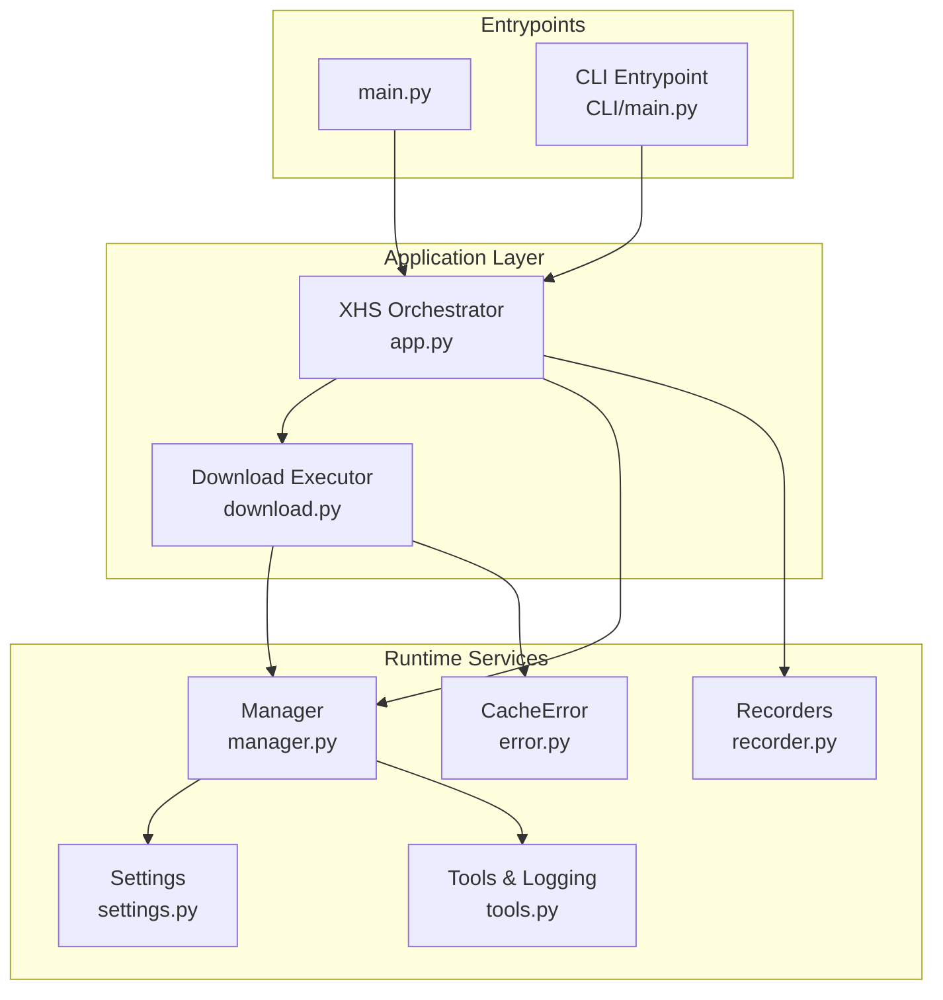
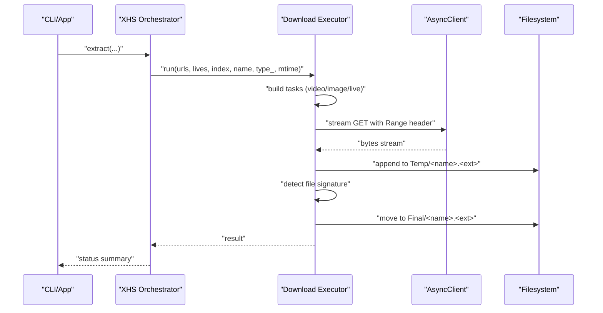
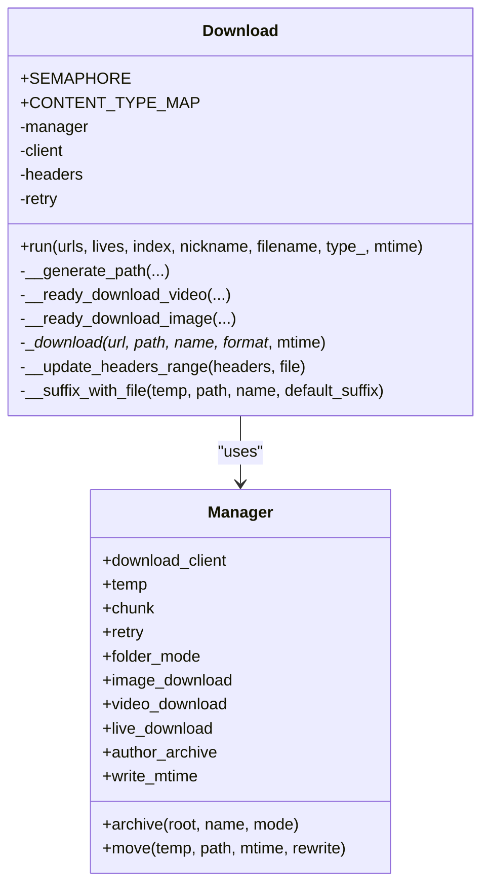
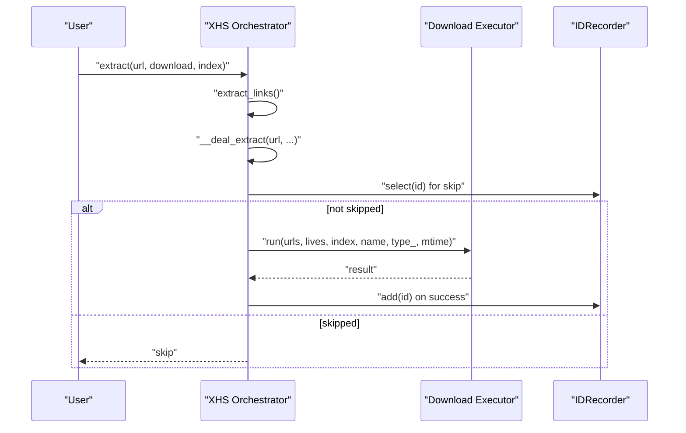
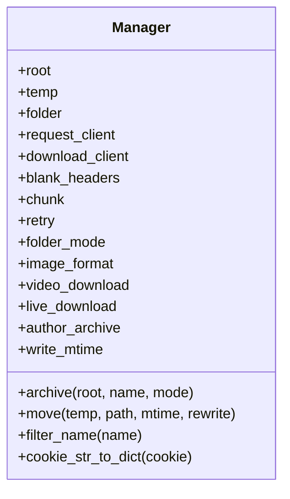
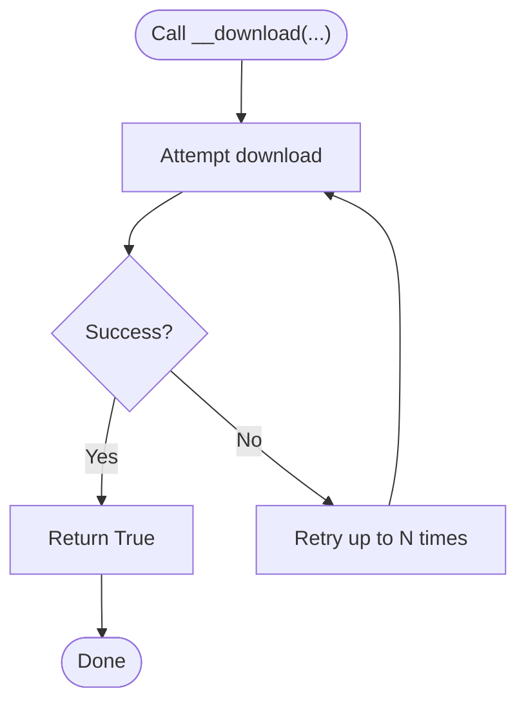
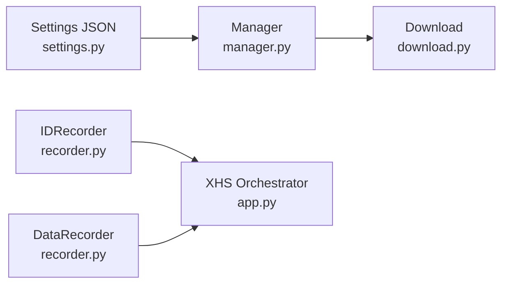
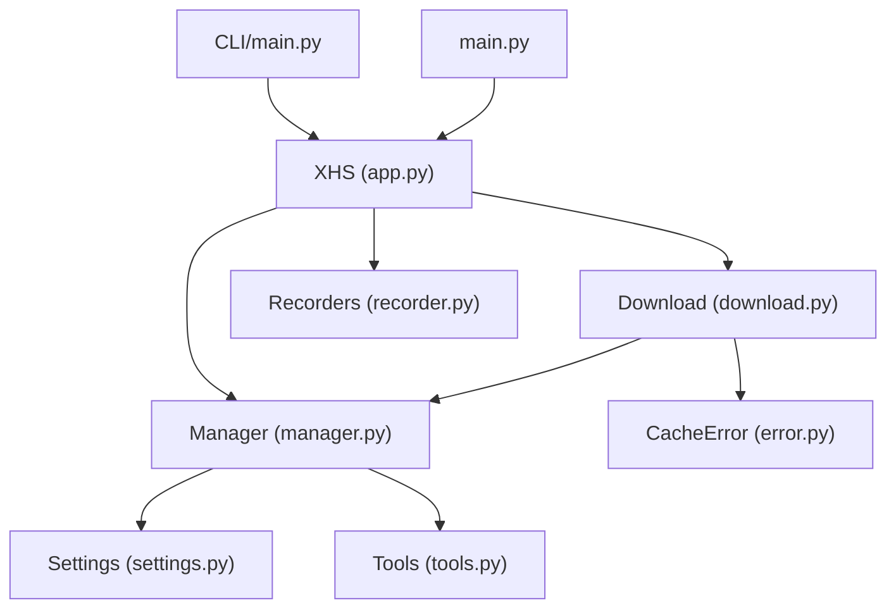

# Download Engine

<cite>
**Referenced Files in This Document**
- [download.py](file://source/application/download.py)
- [app.py](file://source/application/app.py)
- [manager.py](file://source/module/manager.py)
- [static.py](file://source/module/static.py)
- [tools.py](file://source/module/tools.py)
- [error.py](file://source/expansion/error.py)
- [settings.py](file://source/module/settings.py)
- [recorder.py](file://source/module/recorder.py)
- [main.py](file://main.py)
- [CLI/main.py](file://source/CLI/main.py)
- [README.md](file://README.md)
</cite>

## Table of Contents
1. [Introduction](#introduction)
2. [Project Structure](#project-structure)
3. [Core Components](#core-components)
4. [Architecture Overview](#architecture-overview)
5. [Detailed Component Analysis](#detailed-component-analysis)
6. [Dependency Analysis](#dependency-analysis)
7. [Performance Considerations](#performance-considerations)
8. [Troubleshooting Guide](#troubleshooting-guide)
9. [Conclusion](#conclusion)
10. [Appendices](#appendices)

## Introduction
This document explains the core download engine architecture of the project, focusing on the asynchronous download system built with asyncio and semaphore-controlled concurrency. It covers download orchestration, task scheduling, parallel execution limits, resource management, lifecycle from initiation to completion (including temporary file handling, resume capability, and integrity verification), error handling and retry logic, failure recovery strategies, progress tracking, bandwidth management, and performance optimization. It also includes practical configuration examples, concurrency tuning, and troubleshooting guidance.

## Project Structure
The download engine is centered around a small set of cohesive modules:
- Application orchestrator: coordinates extraction, naming, and dispatches downloads
- Download executor: performs concurrent, resumable downloads with integrity checks
- Manager: holds shared configuration, clients, and filesystem utilities
- Tools and settings: provide retry decorators, logging helpers, and persistent settings
- Recorders: track download records and metadata persistence
- Entrypoints: CLI and server modes that wire everything together

**Diagram sources**
- [app.py:98-193](file://source/application/app.py#L98-L193)
- [download.py:30-112](file://source/application/download.py#L30-L112)
- [manager.py:28-132](file://source/module/manager.py#L28-L132)
- [settings.py:10-37](file://source/module/settings.py#L10-L37)
- [tools.py:13-22](file://source/module/tools.py#L13-L22)
- [error.py:1-8](file://source/expansion/error.py#L1-L8)
- [recorder.py:13-69](file://source/module/recorder.py#L13-L69)
- [main.py:12-59](file://main.py#L12-L59)
- [CLI/main.py:39-69](file://source/CLI/main.py#L39-L69)

**Section sources**
- [app.py:98-193](file://source/application/app.py#L98-L193)
- [download.py:30-112](file://source/application/download.py#L30-L112)
- [manager.py:28-132](file://source/module/manager.py#L28-L132)
- [settings.py:10-37](file://source/module/settings.py#L10-L37)
- [tools.py:13-22](file://source/module/tools.py#L13-L22)
- [error.py:1-8](file://source/expansion/error.py#L1-L8)
- [recorder.py:13-69](file://source/module/recorder.py#L13-L69)
- [main.py:12-59](file://main.py#L12-L59)
- [CLI/main.py:39-69](file://source/CLI/main.py#L39-L69)

## Core Components
- Download executor: Asynchronous download with semaphore-limited concurrency, resume support, integrity verification, and robust error handling.
- Manager: Provides shared clients, filesystem utilities, and configuration defaults.
- Retry decorator: Adds configurable retry behavior to download attempts.
- Settings: Persistent configuration storage and migration.
- Recorders: Track download history and metadata for deduplication and auditing.
- Entrypoints: CLI and server modes initialize and run the orchestrator.

Key responsibilities:
- Concurrency control via a global semaphore
- Resume via HTTP Range requests and temporary files
- Integrity verification via file signature detection
- Logging and progress hooks (placeholder)
- Deduplication via download record database

**Section sources**
- [download.py:30-112](file://source/application/download.py#L30-L112)
- [manager.py:28-132](file://source/module/manager.py#L28-L132)
- [tools.py:13-22](file://source/module/tools.py#L13-L22)
- [settings.py:10-37](file://source/module/settings.py#L10-L37)
- [recorder.py:13-69](file://source/module/recorder.py#L13-L69)

## Architecture Overview
The download engine is event-driven and asynchronous. The orchestrator extracts URLs, prepares filenames, and dispatches tasks to the download executor. The executor streams chunks to a temporary file, verifies content type, moves to final destination, and updates timestamps if configured.

**Diagram sources**
- [app.py:213-250](file://source/application/app.py#L213-L250)
- [download.py:71-112](file://source/application/download.py#L71-L112)
- [download.py:196-268](file://source/application/download.py#L196-L268)
- [manager.py:100-124](file://source/module/manager.py#L100-L124)

## Detailed Component Analysis

### Download Executor
The Download executor encapsulates the entire download lifecycle:
- Task preparation: builds per-file tasks for videos, images, and live photos
- Concurrency control: uses a global semaphore to cap concurrent downloads
- Streaming and resume: uses HTTP Range to resume partial downloads
- Integrity verification: detects file type by magic signatures
- Atomic move: renames temp file to final path and optionally writes mtime

**Diagram sources**
- [download.py:30-112](file://source/application/download.py#L30-L112)
- [download.py:196-268](file://source/application/download.py#L196-L268)
- [manager.py:28-132](file://source/module/manager.py#L28-L132)

Key behaviors:
- Concurrency: The executor’s semaphore controls parallelism globally.
- Resume: Range requests are enabled by checking existing temp file size.
- Integrity: Signature-based file type detection ensures correct extension assignment.
- Error handling: Catches network errors and cache inconsistencies; deletes corrupted temp files and logs failures.

**Section sources**
- [download.py:30-112](file://source/application/download.py#L30-L112)
- [download.py:196-268](file://source/application/download.py#L196-L268)
- [download.py:316-338](file://source/application/download.py#L316-L338)
- [manager.py:178-193](file://source/module/manager.py#L178-L193)

### Orchestrator (XHS)
The orchestrator coordinates extraction, naming, and download dispatch:
- Extracts links and data from pages
- Generates filenames according to configured rules
- Skips duplicates using download records
- Dispatches download tasks and aggregates results

**Diagram sources**
- [app.py:268-302](file://source/application/app.py#L268-L302)
- [app.py:462-506](file://source/application/app.py#L462-L506)
- [app.py:213-250](file://source/application/app.py#L213-L250)
- [recorder.py:30-45](file://source/module/recorder.py#L30-L45)

**Section sources**
- [app.py:268-302](file://source/application/app.py#L268-L302)
- [app.py:462-506](file://source/application/app.py#L462-L506)
- [app.py:213-250](file://source/application/app.py#L213-L250)
- [recorder.py:30-45](file://source/module/recorder.py#L30-L45)

### Manager
Manager centralizes configuration, clients, and filesystem utilities:
- Creates two AsyncClients: one for HTML requests, one for downloads
- Provides temp directory, archive path creation, and atomic move with optional mtime rewrite
- Validates and normalizes configuration (image format, proxy, video preference)
- Exposes helpers for cookie normalization and name sanitization

**Diagram sources**
- [manager.py:28-132](file://source/module/manager.py#L28-L132)
- [manager.py:178-193](file://source/module/manager.py#L178-L193)

**Section sources**
- [manager.py:28-132](file://source/module/manager.py#L28-L132)
- [manager.py:178-193](file://source/module/manager.py#L178-L193)

### Retry Decorator and Utilities
Retry logic wraps download attempts to improve resilience against transient failures. The decorator retries a fixed number of times and returns the last result.

**Diagram sources**
- [tools.py:13-22](file://source/module/tools.py#L13-L22)
- [download.py:196-268](file://source/application/download.py#L196-L268)

**Section sources**
- [tools.py:13-22](file://source/module/tools.py#L13-L22)
- [download.py:196-268](file://source/application/download.py#L196-L268)

### Settings and Persistence
Settings provide persistent configuration with defaults and migration. Recorders persist download IDs and metadata for deduplication and auditing.

**Diagram sources**
- [settings.py:10-37](file://source/module/settings.py#L10-L37)
- [manager.py:28-132](file://source/module/manager.py#L28-L132)
- [download.py:30-112](file://source/application/download.py#L30-L112)
- [recorder.py:13-69](file://source/module/recorder.py#L13-L69)
- [app.py:173-185](file://source/application/app.py#L173-L185)

**Section sources**
- [settings.py:10-37](file://source/module/settings.py#L10-L37)
- [recorder.py:13-69](file://source/module/recorder.py#L13-L69)
- [app.py:173-185](file://source/application/app.py#L173-L185)

## Dependency Analysis
The download engine exhibits low coupling and high cohesion:
- Download depends on Manager for clients, temp paths, and move semantics
- Orchestrator composes Download and Recorders
- Tools and Settings are utility dependencies
- Entrypoints initialize the system and run the orchestrator

**Diagram sources**
- [download.py:30-112](file://source/application/download.py#L30-L112)
- [manager.py:28-132](file://source/module/manager.py#L28-L132)
- [error.py:1-8](file://source/expansion/error.py#L1-L8)
- [app.py:98-193](file://source/application/app.py#L98-L193)
- [recorder.py:13-69](file://source/module/recorder.py#L13-L69)
- [settings.py:10-37](file://source/module/settings.py#L10-L37)
- [tools.py:13-22](file://source/module/tools.py#L13-L22)
- [main.py:12-59](file://main.py#L12-L59)
- [CLI/main.py:39-69](file://source/CLI/main.py#L39-L69)

**Section sources**
- [download.py:30-112](file://source/application/download.py#L30-L112)
- [manager.py:28-132](file://source/module/manager.py#L28-L132)
- [error.py:1-8](file://source/expansion/error.py#L1-L8)
- [app.py:98-193](file://source/application/app.py#L98-L193)
- [recorder.py:13-69](file://source/module/recorder.py#L13-L69)
- [settings.py:10-37](file://source/module/settings.py#L10-L37)
- [tools.py:13-22](file://source/module/tools.py#L13-L22)
- [main.py:12-59](file://main.py#L12-L59)
- [CLI/main.py:39-69](file://source/CLI/main.py#L39-L69)

## Performance Considerations
- Concurrency tuning: Adjust the global worker limit to balance throughput and server-side rate limiting. The default is set in the static constants.
- Chunk size: Larger chunks reduce overhead but increase memory usage; tune based on available RAM and network stability.
- Proxy usage: Configure proxies to reduce IP-based throttling; the Manager validates and logs proxy health.
- Resume behavior: Partial downloads are resumed automatically via Range requests, minimizing wasted bandwidth.
- Integrity checks: Signature-based detection prevents misnamed files and reduces post-processing overhead.
- Deduplication: Skip previously downloaded items to avoid redundant I/O.

Practical tips:
- Increase MAX_WORKERS cautiously; monitor server responses and adjust accordingly.
- Use a smaller chunk size for constrained environments.
- Enable proxy testing and logging to diagnose connectivity issues.

**Section sources**
- [static.py:69](file://source/module/static.py#L69)
- [manager.py:225-259](file://source/module/manager.py#L225-L259)
- [download.py:316-338](file://source/application/download.py#L316-L338)
- [download.py:205-211](file://source/application/download.py#L205-L211)

## Troubleshooting Guide
Common issues and resolutions:
- Network errors during download: The executor logs network exceptions and returns failure. Verify connectivity and proxy settings.
- Cache inconsistency (HTTP 416): Indicates a mismatch between local temp file and server range. The executor deletes the temp file and logs the error; retry should succeed.
- Duplicate downloads: Use the download record database to skip known IDs.
- Incorrect file extensions: Integrity verification via signatures ensures correct naming; if detection fails, the executor falls back to the default format.
- Progress tracking: Progress hooks are present as placeholders; integrate a progress library if needed.

Operational steps:
- Review logs for HTTP error messages and CacheError entries.
- Confirm proxy configuration and test connectivity.
- Clear temp files if corruption is suspected.
- Re-run with increased max_retry if intermittent failures occur.

**Section sources**
- [download.py:250-267](file://source/application/download.py#L250-L267)
- [error.py:1-8](file://source/expansion/error.py#L1-L8)
- [recorder.py:30-45](file://source/module/recorder.py#L30-L45)
- [tools.py:13-22](file://source/module/tools.py#L13-L22)

## Conclusion
The download engine combines asyncio-based streaming, semaphore-controlled concurrency, and robust error handling to deliver reliable, resumable downloads. Its modular design separates concerns cleanly: the orchestrator handles coordination, the executor manages I/O and integrity, and the Manager provides shared resources. With configurable concurrency, chunk sizes, and proxy support, it adapts to diverse environments while maintaining strong reliability through retries, resume, and signature-based verification.

## Appendices

### Download Lifecycle Checklist
- Prepare tasks (videos/images/lives)
- Acquire semaphore
- Stream to temp file with Range resume
- Detect file signature and finalize extension
- Move to final path and optionally set mtime
- Log outcome and update records

**Section sources**
- [download.py:71-112](file://source/application/download.py#L71-L112)
- [download.py:196-268](file://source/application/download.py#L196-L268)
- [download.py:316-338](file://source/application/download.py#L316-L338)
- [manager.py:178-193](file://source/module/manager.py#L178-L193)

### Configuration Reference
- Global concurrency: MAX_WORKERS
- Chunk size: chunk
- Retry attempts: max_retry
- Image format: image_format
- Download toggles: image_download, video_download, live_download
- Archive modes: folder_mode, author_archive
- Write mtime: write_mtime

**Section sources**
- [static.py:69](file://source/module/static.py#L69)
- [settings.py:12-37](file://source/module/settings.py#L12-L37)
- [app.py:116-172](file://source/application/app.py#L116-L172)
- [manager.py:53-132](file://source/module/manager.py#L53-L132)

### Example Workflows
- CLI download: Initialize XHS with settings, call extract_cli with URLs and optional index.
- Server mode: Run API or MCP servers to expose extraction and download endpoints.

**Section sources**
- [CLI/main.py:39-69](file://source/CLI/main.py#L39-L69)
- [main.py:17-42](file://main.py#L17-L42)
- [README.md:140-197](file://README.md#L140-L197)