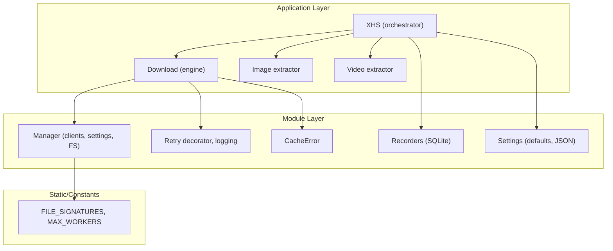
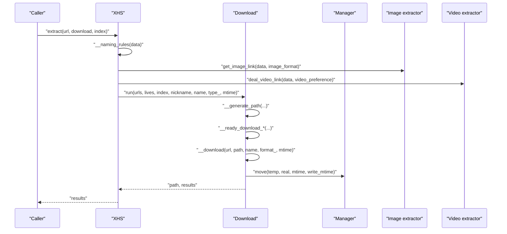
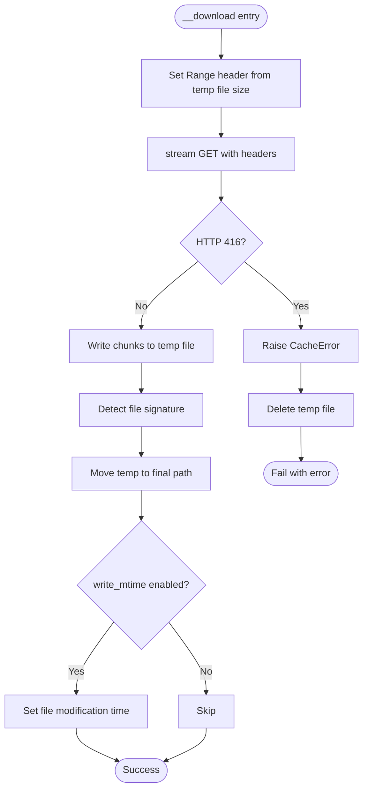
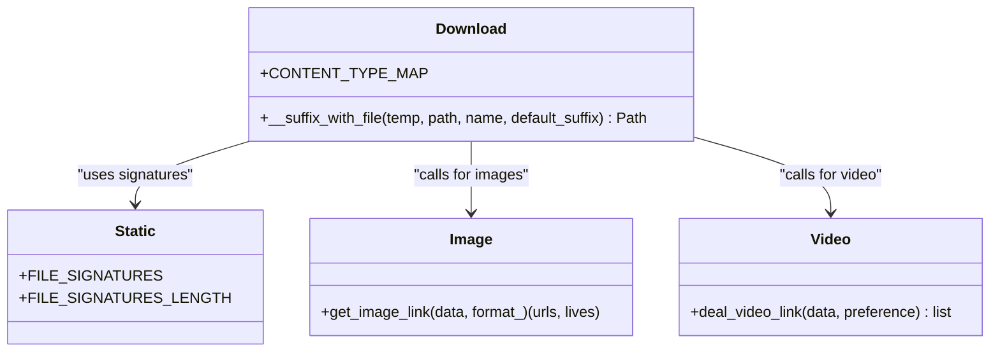
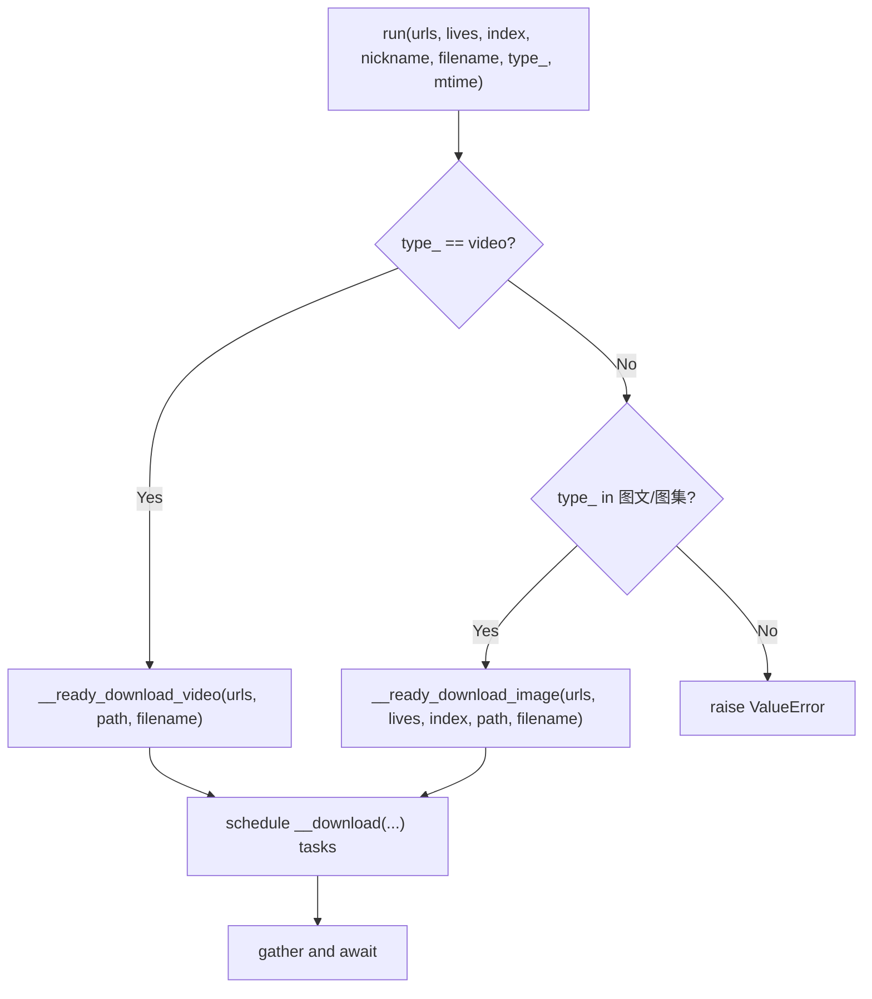
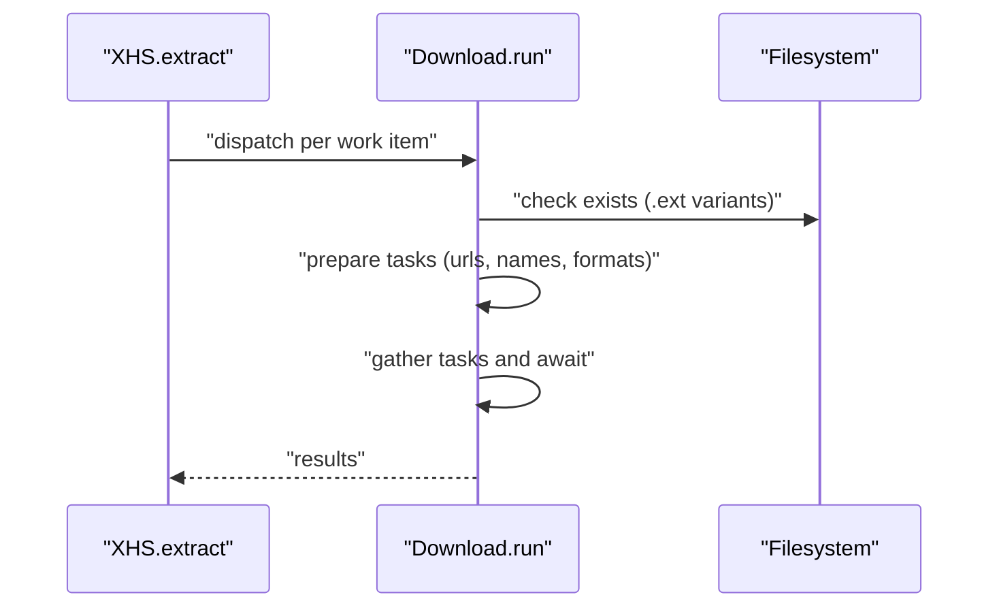
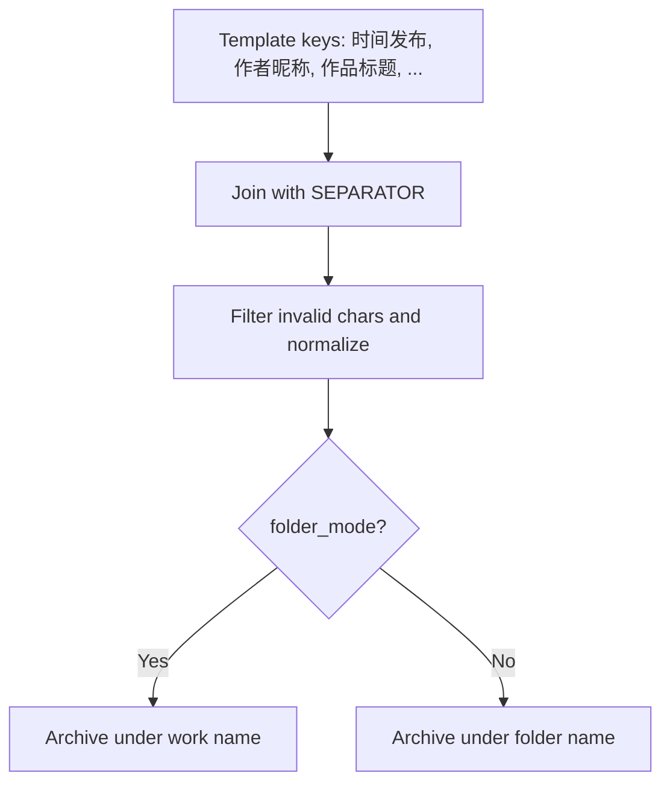
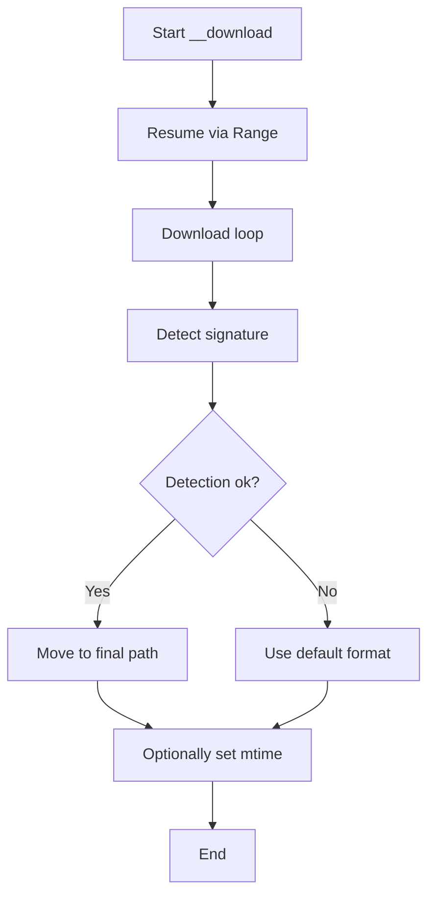
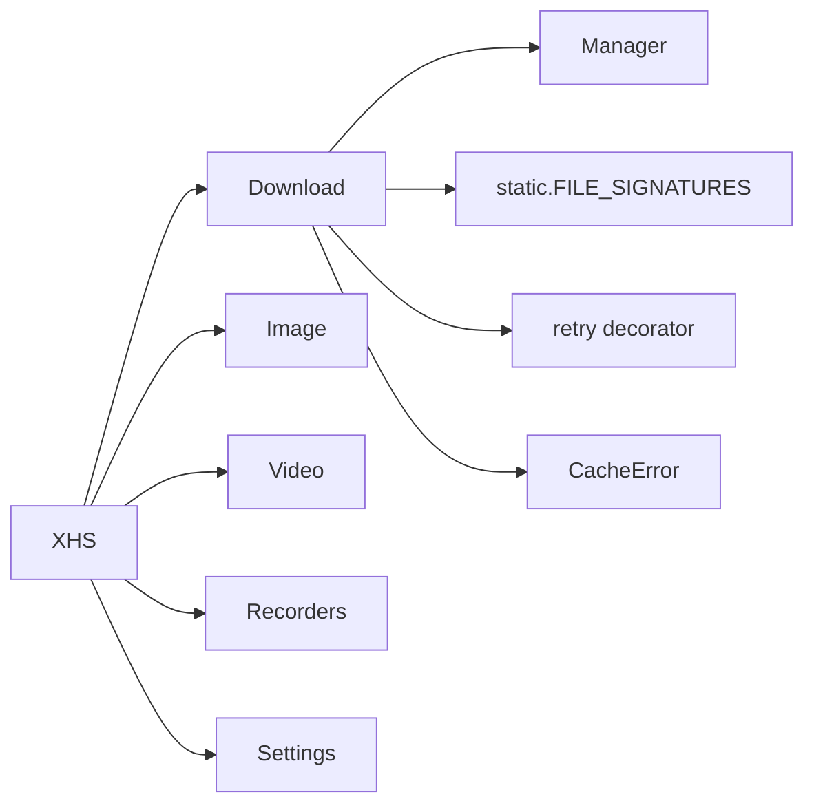

# Download Management

<cite>
**Referenced Files in This Document**
- [download.py](file://source/application/download.py)
- [app.py](file://source/application/app.py)
- [manager.py](file://source/module/manager.py)
- [settings.py](file://source/module/settings.py)
- [static.py](file://source/module/static.py)
- [tools.py](file://source/module/tools.py)
- [error.py](file://source/expansion/error.py)
- [recorder.py](file://source/module/recorder.py)
- [image.py](file://source/application/image.py)
- [video.py](file://source/application/video.py)
- [README.md](file://README.md)
</cite>

## Table of Contents
1. [Introduction](#introduction)
2. [Project Structure](#project-structure)
3. [Core Components](#core-components)
4. [Architecture Overview](#architecture-overview)
5. [Detailed Component Analysis](#detailed-component-analysis)
6. [Dependency Analysis](#dependency-analysis)
7. [Performance Considerations](#performance-considerations)
8. [Troubleshooting Guide](#troubleshooting-guide)
9. [Conclusion](#conclusion)
10. [Appendices](#appendices)

## Introduction
This document explains the download management system that powers asynchronous downloads for videos, images, and live photos. It covers the asynchronous engine built around the Download class with semaphore-controlled concurrency, file format support and conversion, download strategies per content type, batch processing, intelligent caching and resume, naming conventions, progress tracking, error handling, retries, and integrity verification. Practical configuration examples, optimization tips, and troubleshooting guidance are included to help both developers and users operate the system effectively.

## Project Structure
The download subsystem centers on the Download class and integrates with Manager for client configuration, settings, and persistence. Supporting modules provide image/video extraction, file signature detection, retry decorators, and database-backed download records.

**Diagram sources**
- [app.py](file://source/application/app.py)
- [download.py](file://source/application/download.py)
- [manager.py](file://source/module/manager.py)
- [settings.py](file://source/module/settings.py)
- [static.py](file://source/module/static.py)
- [tools.py](file://source/module/tools.py)
- [error.py](file://source/expansion/error.py)
- [recorder.py](file://source/module/recorder.py)

**Section sources**
- [app.py](file://source/application/app.py)
- [download.py](file://source/application/download.py)
- [manager.py](file://source/module/manager.py)
- [settings.py](file://source/module/settings.py)
- [static.py](file://source/module/static.py)
- [tools.py](file://source/module/tools.py)
- [error.py](file://source/expansion/error.py)
- [recorder.py](file://source/module/recorder.py)

## Core Components
- Download engine: Asynchronous download orchestrator with concurrency control via a shared semaphore, temporary file streaming, resume support, and signature-based format detection.
- Manager: Provides HTTP clients, path management, configuration, and filesystem utilities.
- Extractors: Image and video extractors resolve URLs and optional live photo URLs based on user preferences.
- Settings: Centralized configuration with defaults and compatibility checks.
- Retry and logging: Decorators and helpers for robust operation.
- Recorders: SQLite-backed persistence for download IDs and metadata.

**Section sources**
- [download.py](file://source/application/download.py)
- [manager.py](file://source/module/manager.py)
- [image.py](file://source/application/image.py)
- [video.py](file://source/application/video.py)
- [settings.py](file://source/module/settings.py)
- [tools.py](file://source/module/tools.py)
- [recorder.py](file://source/module/recorder.py)

## Architecture Overview
The system follows an asynchronous pipeline:
- XHS orchestrates extraction, naming, and dispatches download tasks.
- Download prepares paths, selects URLs based on content type, and schedules concurrent downloads.
- Manager supplies clients, headers, and filesystem utilities.
- Extractors resolve URLs and optional live photo URLs.
- Settings and Recorder integrate with persistent configuration and download history.

**Diagram sources**
- [app.py](file://source/application/app.py)
- [download.py](file://source/application/download.py)
- [image.py](file://source/application/image.py)
- [video.py](file://source/application/video.py)
- [manager.py](file://source/module/manager.py)

## Detailed Component Analysis

### Download Engine (Concurrency, Resume, Integrity)
- Concurrency control: A shared semaphore limits concurrent downloads globally.
- Batch scheduling: Tasks are gathered and awaited concurrently.
- Resume and Range requests: Uses existing temp file size to set Range header for resuming partial downloads.
- Integrity verification: Detects actual file type by reading file signatures and renames accordingly; falls back to configured default format.
- Error handling: Caches exceptions (e.g., cache inconsistency) and surfaces network errors with logging; returns failure status for retries.

**Diagram sources**
- [download.py](file://source/application/download.py)
- [error.py](file://source/expansion/error.py)
- [static.py](file://source/module/static.py)
- [manager.py](file://source/module/manager.py)

**Section sources**
- [download.py](file://source/application/download.py)
- [error.py](file://source/expansion/error.py)
- [static.py](file://source/module/static.py)
- [manager.py](file://source/module/manager.py)

### File Format Support and Conversion
- Supported content types and default extensions are mapped for quick identification.
- Signature-based detection: Reads initial bytes and matches against known signatures to determine accurate extension.
- Image format selection: Extractor supports fixed formats (PNG, WEBP, JPEG, HEIC, AVIF) and dynamic AUTO mode; Manager validates user-configured image_format.
- Video preference: Sorts candidate streams by resolution, bitrate, or size according to user preference.

**Diagram sources**
- [download.py](file://source/application/download.py)
- [static.py](file://source/module/static.py)
- [image.py](file://source/application/image.py)
- [video.py](file://source/application/video.py)

**Section sources**
- [download.py](file://source/application/download.py)
- [static.py](file://source/module/static.py)
- [image.py](file://source/application/image.py)
- [video.py](file://source/application/video.py)

### Download Strategies by Content Type
- Videos: Single URL selected via preference (resolution/bitrate/size) with mp4 as default.
- Images/Albums: One task per image URL; optional live photo URLs appended when enabled and not yet present.
- Index filtering: Allows downloading only specified image indices for albums.

**Diagram sources**
- [download.py](file://source/application/download.py)

**Section sources**
- [download.py](file://source/application/download.py)

### Batch Processing and Intelligent Caching
- Batch orchestration: Orchestrator extracts multiple links and processes them concurrently, aggregating statistics.
- Intelligent caching: Temp files are used per download; resume via Range; signature detection ensures correct final extension; duplicate detection checks multiple formats before adding tasks.
- Author archive and folder modes: Organize files under author folders or per-workspace folders.

**Diagram sources**
- [app.py](file://source/application/app.py)
- [download.py](file://source/application/download.py)

**Section sources**
- [app.py](file://source/application/app.py)
- [download.py](file://source/application/download.py)

### Naming Convention System and File Organization
- Name template: Composed from configurable keys (e.g., publish time, author nickname, title) with a separator.
- Filtering: Removes invalid characters and normalizes names.
- Organization: Optional per-author archive folders and per-workspace archive folders; folder_mode toggles whether each work gets its own subfolder.

**Diagram sources**
- [app.py](file://source/application/app.py)
- [manager.py](file://source/module/manager.py)

**Section sources**
- [app.py](file://source/application/app.py)
- [manager.py](file://source/module/manager.py)

### Progress Tracking, Error Handling, Retries, and Integrity Verification
- Progress tracking: Methods for creating and updating progress bars are present and can be wired to UI components.
- Retries: A retry decorator attempts a function multiple times based on manager settings.
- Error handling: Network errors logged; cache inconsistencies trigger cleanup and retry signaling; integrity verified via file signature detection.
- Integrity verification: Final file renamed to detected extension; fallback to configured default if detection fails.

**Diagram sources**
- [download.py](file://source/application/download.py)
- [tools.py](file://source/module/tools.py)
- [static.py](file://source/module/static.py)
- [manager.py](file://source/module/manager.py)

**Section sources**
- [download.py](file://source/application/download.py)
- [tools.py](file://source/module/tools.py)
- [static.py](file://source/module/static.py)
- [manager.py](file://source/module/manager.py)

## Dependency Analysis
- Download depends on Manager for clients, headers, chunk size, and filesystem operations.
- Extractors depend on Namespace data structures to locate media URLs.
- Settings and Manager coordinate configuration defaults and runtime behavior.
- Recorders persist download IDs and metadata for deduplication and auditing.

**Diagram sources**
- [download.py](file://source/application/download.py)
- [manager.py](file://source/module/manager.py)
- [static.py](file://source/module/static.py)
- [tools.py](file://source/module/tools.py)
- [error.py](file://source/expansion/error.py)
- [app.py](file://source/application/app.py)
- [image.py](file://source/application/image.py)
- [video.py](file://source/application/video.py)
- [recorder.py](file://source/module/recorder.py)
- [settings.py](file://source/module/settings.py)

**Section sources**
- [download.py](file://source/application/download.py)
- [manager.py](file://source/module/manager.py)
- [static.py](file://source/module/static.py)
- [tools.py](file://source/module/tools.py)
- [error.py](file://source/expansion/error.py)
- [app.py](file://source/application/app.py)
- [image.py](file://source/application/image.py)
- [video.py](file://source/application/video.py)
- [recorder.py](file://source/module/recorder.py)
- [settings.py](file://source/module/settings.py)

## Performance Considerations
- Concurrency tuning: Adjust MAX_WORKERS to balance throughput and server-side rate limiting.
- Chunk sizing: Larger chunks reduce overhead but increase memory usage; tune chunk based on network conditions.
- Proxy testing: Manager validates proxies and logs outcomes to avoid failed requests.
- Backoff and delays: Built-in wait time distribution helps avoid throttling.
- Deduplication: Download records prevent redundant downloads; disable only when necessary.

[No sources needed since this section provides general guidance]

## Troubleshooting Guide
Common issues and resolutions:
- Downloads stuck or failing with cache errors: Delete the temp file and retry; the engine cleans up on cache errors.
- Incorrect file extensions: Signature detection resolves the actual format; if detection fails, the file is saved with the configured default.
- Duplicate downloads: Enable download_record to skip previously downloaded works by ID.
- Permission or path issues: Ensure write permissions in target folders; Manager creates directories as needed.
- Proxy failures: Use Manager’s proxy test to validate; adjust or remove proxy settings if tests fail.
- Video quality limitations: Configure cookie to access higher-resolution streams; preference controls selection among resolution, bitrate, or size.

**Section sources**
- [download.py](file://source/application/download.py)
- [error.py](file://source/expansion/error.py)
- [recorder.py](file://source/module/recorder.py)
- [manager.py](file://source/module/manager.py)
- [README.md](file://README.md)

## Conclusion
The download management system combines asynchronous concurrency, robust error handling, intelligent caching, and flexible naming to deliver reliable downloads across videos, images, and live photos. With configurable strategies, signature-based integrity checks, and persistent records, it scales from single-file to batch operations while remaining resilient to transient failures.

[No sources needed since this section summarizes without analyzing specific files]

## Appendices

### Configuration Examples
- Basic usage with custom parameters is demonstrated in the project’s secondary development example.
- Typical settings include work path, folder name, name format, chunk size, retry count, image/video/live download toggles, video preference, and author archive mode.

**Section sources**
- [README.md](file://README.md)
- [settings.py](file://source/module/settings.py)