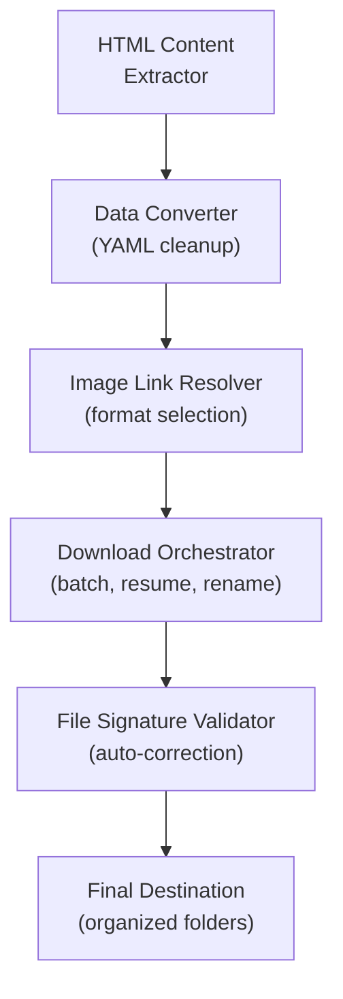
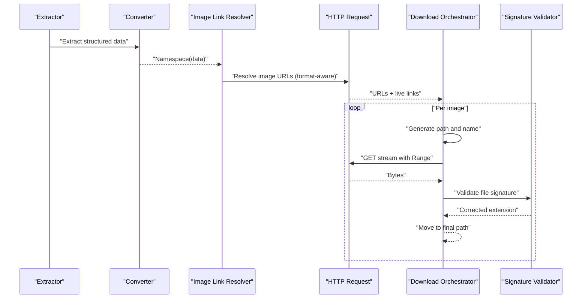
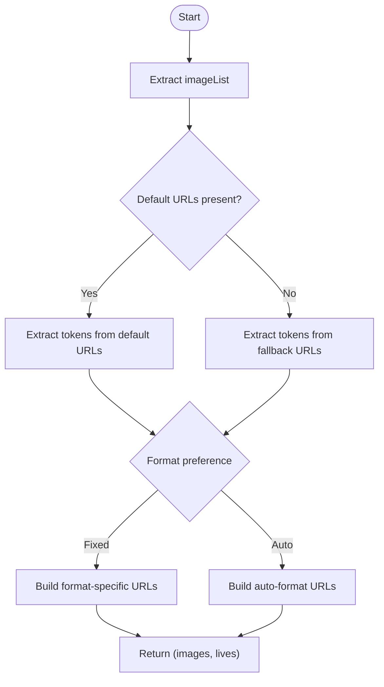
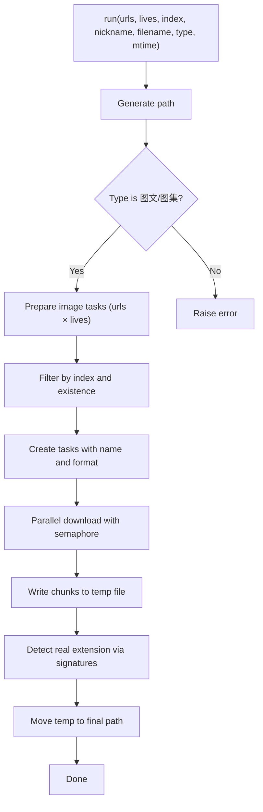
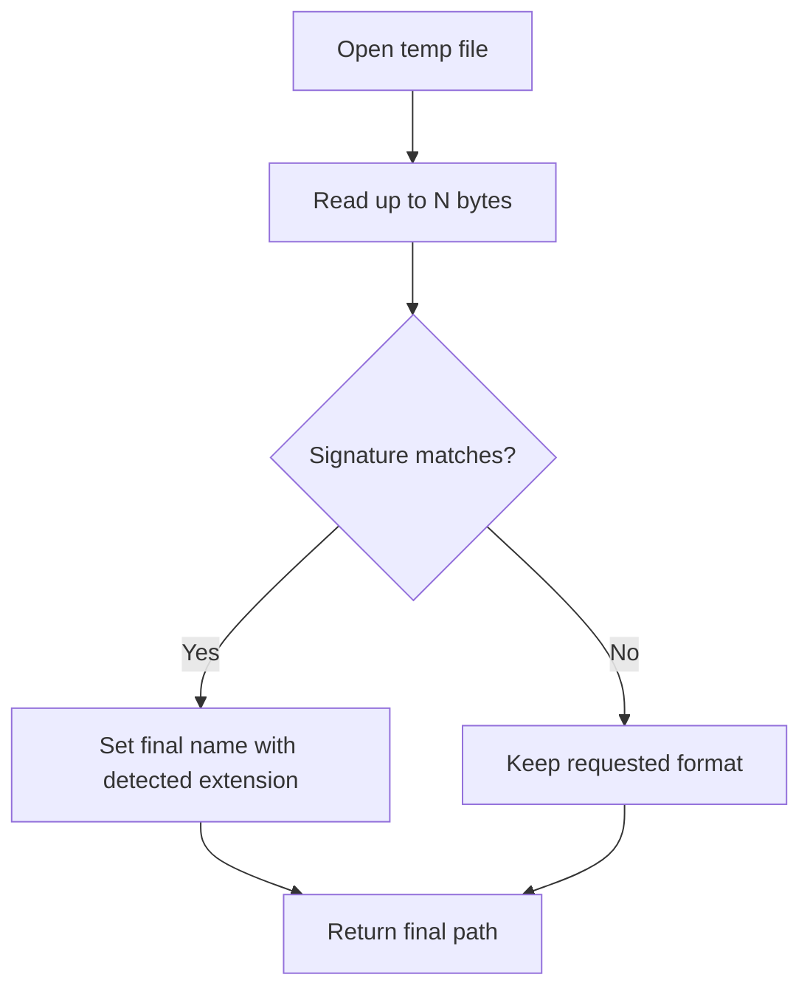
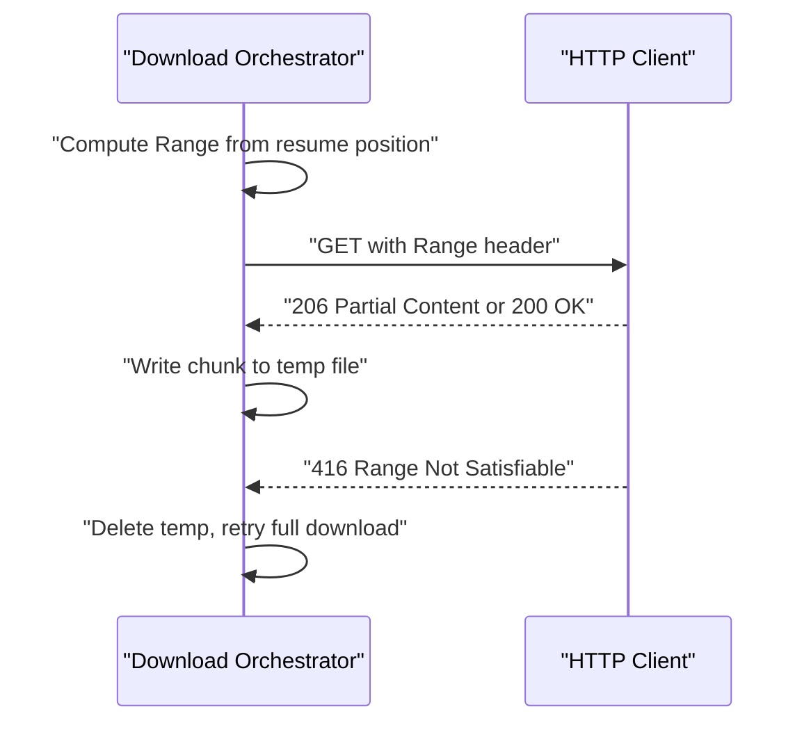
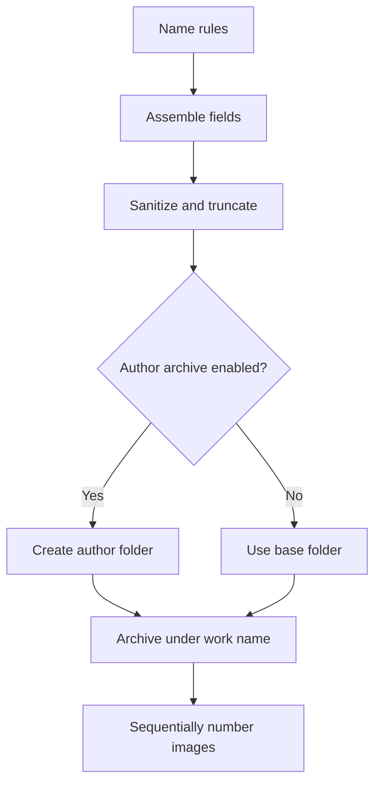
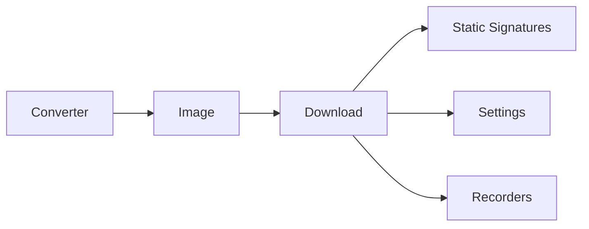

# Image Processing

<cite>
**Referenced Files in This Document**
- [source/application/image.py](file://source/application/image.py)
- [source/application/download.py](file://source/application/download.py)
- [source/application/request.py](file://source/application/request.py)
- [source/module/static.py](file://source/module/static.py)
- [source/module/settings.py](file://source/module/settings.py)
- [source/module/tools.py](file://source/module/tools.py)
- [source/module/recorder.py](file://source/module/recorder.py)
- [source/module/mapping.py](file://source/module/mapping.py)
- [source/expansion/converter.py](file://source/expansion/converter.py)
- [README.md](file://README.md)
- [static/XHS-Downloader.js](file://static/XHS-Downloader.js)
</cite>

## Table of Contents
1. [Introduction](#introduction)
2. [Project Structure](#project-structure)
3. [Core Components](#core-components)
4. [Architecture Overview](#architecture-overview)
5. [Detailed Component Analysis](#detailed-component-analysis)
6. [Dependency Analysis](#dependency-analysis)
7. [Performance Considerations](#performance-considerations)
8. [Troubleshooting Guide](#troubleshooting-guide)
9. [Conclusion](#conclusion)
10. [Appendices](#appendices)

## Introduction
This document explains the image processing and downloading system, focusing on:
- Image download workflow and format conversion support (JPEG, PNG, WebP, AVIF, HEIC)
- Quality settings and batch image processing
- Live photo extraction and progressive download handling
- Image format detection via file signatures and automatic format correction
- Naming conventions, sequential numbering for image sets, and folder organization strategies
- Configuration examples, format preferences, and troubleshooting common issues

## Project Structure
The image pipeline spans several modules:
- Data extraction and conversion: extracts structured data from HTML
- Image URL resolution: transforms tokens into final URLs with optional format conversion
- Download orchestration: prepares paths, checks existence, streams bytes, validates file signatures, and moves to final destination
- Static configuration: defines supported formats, file signatures, and concurrency limits
- Settings and persistence: stores user preferences and download records

**Diagram sources**
- [source/expansion/converter.py:24-45](file://source/expansion/converter.py#L24-L45)
- [source/application/image.py:10-39](file://source/application/image.py#L10-L39)
- [source/application/download.py:140-174](file://source/application/download.py#L140-L174)
- [source/module/static.py:39-67](file://source/module/static.py#L39-L67)

**Section sources**
- [source/expansion/converter.py:24-45](file://source/expansion/converter.py#L24-L45)
- [source/application/image.py:10-39](file://source/application/image.py#L10-L39)
- [source/application/download.py:140-174](file://source/application/download.py#L140-L174)
- [source/module/static.py:39-67](file://source/module/static.py#L39-L67)

## Core Components
- Image link resolver: selects image URLs and live photo URLs based on configured format preference
- Download orchestrator: manages concurrency, resumes partial downloads, and writes metadata
- File signature validator: detects actual file type and renames accordingly
- Settings and persistence: controls format preferences, archive modes, and download records

**Section sources**
- [source/application/image.py:10-39](file://source/application/image.py#L10-L39)
- [source/application/download.py:30-70](file://source/application/download.py#L30-L70)
- [source/module/static.py:39-67](file://source/module/static.py#L39-L67)
- [source/module/settings.py:26-37](file://source/module/settings.py#L26-L37)

## Architecture Overview
The image processing pipeline integrates data extraction, URL generation, streaming, and post-processing.

**Diagram sources**
- [source/expansion/converter.py:24-45](file://source/expansion/converter.py#L24-L45)
- [source/application/image.py:10-39](file://source/application/image.py#L10-L39)
- [source/application/request.py:26-70](file://source/application/request.py#L26-L70)
- [source/application/download.py:196-268](file://source/application/download.py#L196-L268)
- [source/module/static.py:39-67](file://source/module/static.py#L39-L67)

## Detailed Component Analysis

### Image Link Resolution
- Extracts image tokens from either default or fallback URLs
- Supports fixed-format URLs (JPEG, PNG, WebP, HEIC, AVIF) and auto-format URLs
- Produces image URLs and live photo URLs for each image

**Diagram sources**
- [source/application/image.py:10-39](file://source/application/image.py#L10-L39)

**Section sources**
- [source/application/image.py:10-39](file://source/application/image.py#L10-L39)

### Download Orchestration and Batch Processing
- Generates per-workspace paths and archives
- Skips existing files across supported formats
- Streams bytes with resume support and Range headers
- Moves temporary files to final destinations with corrected extensions

**Diagram sources**
- [source/application/download.py:71-112](file://source/application/download.py#L71-L112)
- [source/application/download.py:140-174](file://source/application/download.py#L140-L174)
- [source/application/download.py:196-268](file://source/application/download.py#L196-L268)
- [source/application/download.py:316-337](file://source/application/download.py#L316-L337)

**Section sources**
- [source/application/download.py:71-112](file://source/application/download.py#L71-L112)
- [source/application/download.py:140-174](file://source/application/download.py#L140-L174)
- [source/application/download.py:196-268](file://source/application/download.py#L196-L268)
- [source/application/download.py:316-337](file://source/application/download.py#L316-L337)

### File Signature Validation and Automatic Format Correction
- Reads up to a defined number of initial bytes
- Matches against known signatures for images and videos
- Renames the temporary file to the detected extension or keeps the requested format if unknown

**Diagram sources**
- [source/module/static.py:39-67](file://source/module/static.py#L39-L67)
- [source/application/download.py:316-337](file://source/application/download.py#L316-L337)

**Section sources**
- [source/module/static.py:39-67](file://source/module/static.py#L39-L67)
- [source/application/download.py:316-337](file://source/application/download.py#L316-L337)

### Progressive Download Handling
- Uses HTTP Range requests to resume partial downloads
- Detects 416 Range Not Satisfiable and triggers a fresh download
- Streams bytes in configurable chunk sizes

**Diagram sources**
- [source/application/download.py:205-223](file://source/application/download.py#L205-L223)
- [source/application/download.py:304-314](file://source/application/download.py#L304-L314)

**Section sources**
- [source/application/download.py:205-223](file://source/application/download.py#L205-L223)
- [source/application/download.py:304-314](file://source/application/download.py#L304-L314)

### Image Naming Conventions and Folder Organization
- Name format is configurable and supports fields such as publish time, title, and author
- Sequential numbering is applied per image set (e.g., filename_1, filename_2)
- Optional archive modes:
  - Author archive: separate folder per author
  - Per-workspace archive: each work gets its own folder
- Mapping updates handle author alias changes and folder renaming

**Diagram sources**
- [source/application/app.py:566-601](file://source/application/app.py#L566-L601)
- [source/module/mapping.py:46-88](file://source/module/mapping.py#L46-L88)

**Section sources**
- [source/application/app.py:566-601](file://source/application/app.py#L566-L601)
- [source/module/mapping.py:46-88](file://source/module/mapping.py#L46-L88)

### Configuration and Preferences
- Supported image formats: JPEG, PNG, WEBP, HEIC, AVIF
- Auto-format mode selects server-provided format dynamically
- Chunk size, retry count, and concurrency are configurable
- Download records prevent re-downloading completed works

Examples of configuration keys and behavior:
- image_format: "JPEG", "PNG", "WEBP", "HEIC", "AUTO"
- image_download, live_download, video_download
- folder_mode, author_archive, download_record
- chunk, max_retry, write_mtime

**Section sources**
- [source/module/settings.py:26-37](file://source/module/settings.py#L26-L37)
- [README.md:436-441](file://README.md#L436-L441)
- [README.md:443-459](file://README.md#L443-L459)
- [README.md:466-471](file://README.md#L466-L471)
- [README.md:478-483](file://README.md#L478-L483)
- [README.md:484-489](file://README.md#L484-L489)
- [README.md:496-501](file://README.md#L496-L501)

## Dependency Analysis
- Image link resolver depends on:
  - Data extraction utilities for nested keys
  - HTTP formatting helpers
- Download orchestrator depends on:
  - Static signatures for validation
  - Settings for format and concurrency
  - Persistence for download records
- Converter provides sanitized initial state for downstream parsing

**Diagram sources**
- [source/expansion/converter.py:24-45](file://source/expansion/converter.py#L24-L45)
- [source/application/image.py:10-39](file://source/application/image.py#L10-L39)
- [source/application/download.py:30-70](file://source/application/download.py#L30-L70)
- [source/module/static.py:39-67](file://source/module/static.py#L39-L67)
- [source/module/settings.py:26-37](file://source/module/settings.py#L26-L37)
- [source/module/recorder.py:13-59](file://source/module/recorder.py#L13-59)

**Section sources**
- [source/expansion/converter.py:24-45](file://source/expansion/converter.py#L24-L45)
- [source/application/image.py:10-39](file://source/application/image.py#L10-L39)
- [source/application/download.py:30-70](file://source/application/download.py#L30-L70)
- [source/module/static.py:39-67](file://source/module/static.py#L39-L67)
- [source/module/settings.py:26-37](file://source/module/settings.py#L26-L37)
- [source/module/recorder.py:13-59](file://source/module/recorder.py#L13-L59)

## Performance Considerations
- Concurrency: controlled by a semaphore with a fixed worker limit
- Streaming: chunked downloads reduce memory footprint
- Resume: Range requests avoid re-downloading completed parts
- Signature scanning: reads only the first few bytes to detect formats efficiently

Recommendations:
- Adjust chunk size for network conditions
- Tune max_retry and worker count based on stability and storage throughput
- Enable author/archive modes judiciously to balance organization and filesystem overhead

**Section sources**
- [source/module/static.py:69](file://source/module/static.py#L69)
- [source/application/download.py:30-40](file://source/application/download.py#L30-L40)
- [source/application/download.py:304-314](file://source/application/download.py#L304-L314)

## Troubleshooting Guide
Common issues and resolutions:
- Corrupted or mismatched files
  - Cause: interrupted download or wrong extension
  - Resolution: signature validation automatically renames to detected format; if detection fails, file retains requested format and is moved safely
- Format conversion errors
  - Cause: server does not support requested format
  - Resolution: switch to AUTO mode or a widely supported format; verify availability on the platform
- Resume failures (416)
  - Cause: invalid Range request or stale cache
  - Resolution: the system deletes the temp file and retries a full download
- Duplicate downloads
  - Cause: missing records or disabled record mode
  - Resolution: enable download_record to skip previously downloaded works; clear records if re-download is intended
- Naming conflicts
  - Cause: special characters or long titles
  - Resolution: rely on built-in sanitization and truncation; customize name_format to your preference

Operational tips:
- Use AUTO format to avoid conversion errors
- Limit concurrent workers if experiencing timeouts or disk contention
- Verify signatures and final extensions after download for assurance

**Section sources**
- [source/application/download.py:219-223](file://source/application/download.py#L219-L223)
- [source/application/download.py:316-337](file://source/application/download.py#L316-L337)
- [source/module/recorder.py:13-59](file://source/module/recorder.py#L13-L59)
- [README.md:527-529](file://README.md#L527-L529)

## Conclusion
The image processing subsystem combines robust URL resolution, efficient streaming, resilient resume logic, and precise file signature validation to deliver reliable batch downloads across multiple formats. Configurable naming, archival strategies, and record keeping ensure organized and repeatable workflows tailored to diverse use cases.

## Appendices

### Example Configuration Keys and Descriptions
- image_format: "JPEG", "PNG", "WEBP", "HEIC", "AUTO"
- image_download: toggle for 图文/图集 downloads
- live_download: toggle for animated live photos
- folder_mode: per-workspace folder creation
- author_archive: per-author folder organization
- download_record: skip already-downloaded works
- chunk: byte size per stream iteration
- max_retry: retry attempts on transient failures
- write_mtime: set file modification time to publish time

**Section sources**
- [README.md:436-441](file://README.md#L436-L441)
- [README.md:443-459](file://README.md#L443-L459)
- [README.md:466-471](file://README.md#L466-L471)
- [README.md:478-483](file://README.md#L478-L483)
- [README.md:484-489](file://README.md#L484-L489)
- [README.md:496-501](file://README.md#L496-L501)

### User Script Integration (Optional)
- Browser user script exposes image format selection and batch download UI
- Supports selecting specific images by index for targeted downloads

**Section sources**
- [static/XHS-Downloader.js:1405-1418](file://static/XHS-Downloader.js#L1405-L1418)
- [static/XHS-Downloader.js:1570-1708](file://static/XHS-Downloader.js#L1570-L1708)