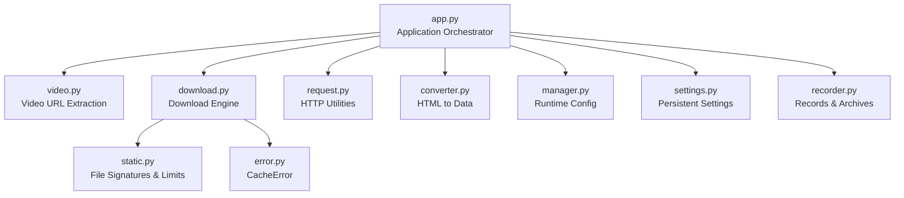
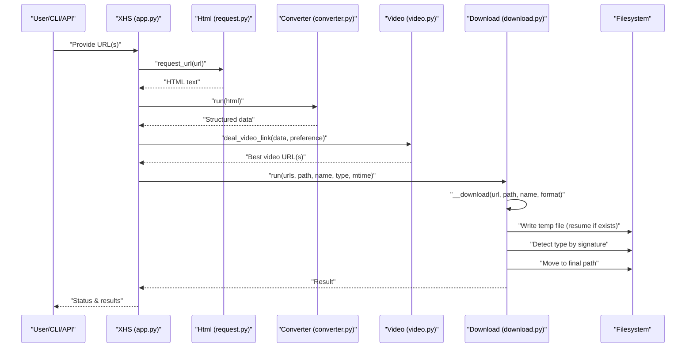
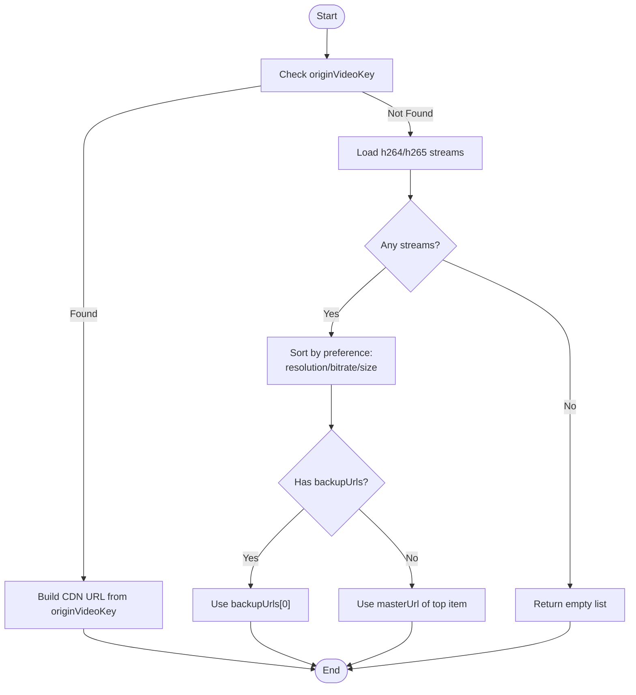
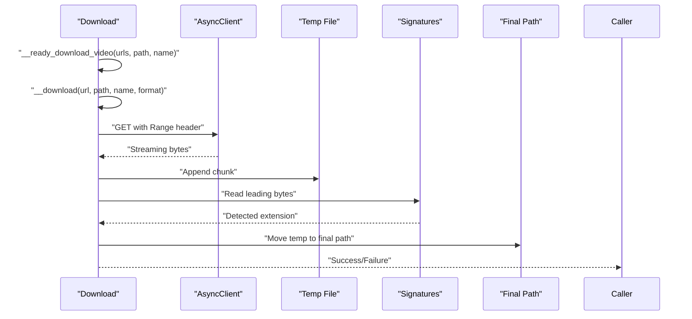
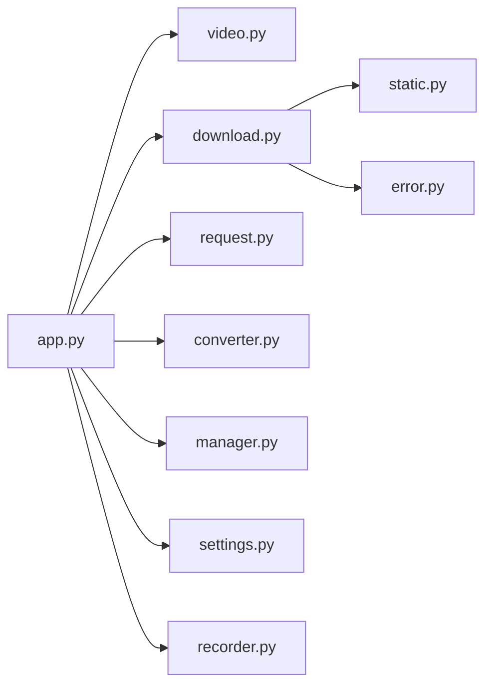

# Video Downloading

<cite>
**Referenced Files in This Document**
- [app.py](file://source/application/app.py)
- [video.py](file://source/application/video.py)
- [download.py](file://source/application/download.py)
- [request.py](file://source/application/request.py)
- [settings.py](file://source/module/settings.py)
- [manager.py](file://source/module/manager.py)
- [static.py](file://source/module/static.py)
- [converter.py](file://source/expansion/converter.py)
- [error.py](file://source/expansion/error.py)
- [recorder.py](file://source/module/recorder.py)
- [main.py](file://main.py)
- [CLI/main.py](file://source/CLI/main.py)
- [README.md](file://README.md)
</cite>

## Table of Contents
1. [Introduction](#introduction)
2. [Project Structure](#project-structure)
3. [Core Components](#core-components)
4. [Architecture Overview](#architecture-overview)
5. [Detailed Component Analysis](#detailed-component-analysis)
6. [Dependency Analysis](#dependency-analysis)
7. [Performance Considerations](#performance-considerations)
8. [Troubleshooting Guide](#troubleshooting-guide)
9. [Conclusion](#conclusion)
10. [Appendices](#appendices)

## Introduction
This document explains the video downloading system implemented in the project. It covers the end-to-end workflow from extracting video metadata and URLs from web pages to downloading, resuming, and finalizing video files. It also documents quality preferences, format selection, resolution handling, and concurrent download management. The system supports mp4 and mov formats and provides robust error handling and retry mechanisms.

## Project Structure
The video downloading pipeline spans several modules:
- Application orchestration and workflow: [app.py](file://source/application/app.py)
- Video URL extraction and quality preference handling: [video.py](file://source/application/video.py)
- Download engine with concurrency and resume support: [download.py](file://source/application/download.py)
- HTTP request utilities: [request.py](file://source/application/request.py)
- Settings and runtime configuration: [settings.py](file://source/module/settings.py), [manager.py](file://source/module/manager.py)
- Static constants and file signature detection: [static.py](file://source/module/static.py)
- HTML-to-structured data conversion: [converter.py](file://source/expansion/converter.py)
- Error handling: [error.py](file://source/expansion/error.py)
- Recording and archival: [recorder.py](file://source/module/recorder.py)
- Entry points: [main.py](file://main.py), [CLI/main.py](file://source/CLI/main.py)

**Diagram sources**
- [app.py](file://source/application/app.py)
- [video.py](file://source/application/video.py)
- [download.py](file://source/application/download.py)
- [request.py](file://source/application/request.py)
- [converter.py](file://source/expansion/converter.py)
- [static.py](file://source/module/static.py)
- [error.py](file://source/expansion/error.py)
- [manager.py](file://source/module/manager.py)
- [settings.py](file://source/module/settings.py)
- [recorder.py](file://source/module/recorder.py)

**Section sources**
- [app.py](file://source/application/app.py)
- [video.py](file://source/application/video.py)
- [download.py](file://source/application/download.py)
- [request.py](file://source/application/request.py)
- [converter.py](file://source/expansion/converter.py)
- [static.py](file://source/module/static.py)
- [error.py](file://source/expansion/error.py)
- [manager.py](file://source/module/manager.py)
- [settings.py](file://source/module/settings.py)
- [recorder.py](file://source/module/recorder.py)

## Core Components
- Video extraction: Selects the best-quality video stream based on user preference (resolution, bitrate, size) and generates CDN URLs.
- Download engine: Streams video content with resume support, writes to temporary files, detects actual file type via signatures, and moves to final destination.
- Configuration: Centralized settings for download behavior, format preferences, and concurrency limits.
- Recording: Tracks downloaded IDs and optionally records detailed metadata to SQLite.

**Section sources**
- [video.py](file://source/application/video.py)
- [download.py](file://source/application/download.py)
- [settings.py](file://source/module/settings.py)
- [manager.py](file://source/module/manager.py)
- [recorder.py](file://source/module/recorder.py)

## Architecture Overview
The system follows an asynchronous, event-driven flow:
- Extract links from clipboard or CLI/API input.
- Fetch page HTML, convert to structured data, and extract video metadata.
- Apply quality preference to choose the optimal video URL.
- Download the video concurrently with a semaphore-limited worker pool.
- Detect file type by magic bytes and finalize the file with optional modification time rewriting.

**Diagram sources**
- [app.py](file://source/application/app.py)
- [request.py](file://source/application/request.py)
- [converter.py](file://source/expansion/converter.py)
- [video.py](file://source/application/video.py)
- [download.py](file://source/application/download.py)

## Detailed Component Analysis

### Video Extraction and Quality Preference
- Extracts originVideoKey for direct CDN URL generation when available.
- Falls back to parsing h264/h265 streams and sorting by preference:
  - resolution: sort by height
  - bitrate: sort by videoBitrate
  - size: sort by size
- Chooses backupUrls if present, otherwise masterUrl of the selected item.

**Diagram sources**
- [video.py](file://source/application/video.py)

**Section sources**
- [video.py](file://source/application/video.py)

### Download Workflow and Concurrency
- Single video processing:
  - Validates video_download flag and existence of target file.
  - Generates a single task with the chosen URL and fixed mp4 format.
- Concurrency:
  - Uses a semaphore to limit concurrent downloads to a configurable maximum.
  - Streams chunks to a temporary file and resumes partial downloads via Range header.
- Finalization:
  - Detects actual file type by reading file signatures.
  - Moves the file to the final path and optionally updates modification time.

**Diagram sources**
- [download.py](file://source/application/download.py)
- [static.py](file://source/module/static.py)

**Section sources**
- [download.py](file://source/application/download.py)
- [static.py](file://source/module/static.py)

### Configuration and Preferences
- Settings include:
  - video_download: toggle for video downloads
  - video_preference: resolution, bitrate, or size
  - chunk: download chunk size
  - max_retry: retry attempts for failed operations
  - folder_mode, author_archive, write_mtime, language, etc.
- Manager validates and applies preferences, including video preference normalization.

Examples of configuration keys and defaults:
- video_download: default True
- video_preference: default "resolution"
- chunk: default 2097152 (2 MB)
- max_retry: default 5

**Section sources**
- [settings.py](file://source/module/settings.py)
- [manager.py](file://source/module/manager.py)
- [README.md](file://README.md)

### Metadata Preservation and Archiving
- File naming rules combine configured fields (e.g., 发布时间, 作者昵称, 作品标题).
- Optional folder_mode stores each work’s files in a dedicated folder.
- author_archive organizes files under a per-author folder.
- write_mtime optionally sets the file’s modification time to the post’s timestamp.

**Section sources**
- [app.py](file://source/application/app.py)
- [manager.py](file://source/module/manager.py)

### Thumbnail Generation and Metadata Recording
- The repository does not implement explicit thumbnail extraction or metadata embedding in the video files.
- Metadata recording:
  - Downloaded works’ IDs are recorded to prevent duplicates.
  - Optional detailed data recording to SQLite database with fields such as timestamps, counts, and links.

**Section sources**
- [recorder.py](file://source/module/recorder.py)
- [app.py](file://source/application/app.py)

### Format Selection and Conversion
- Current behavior:
  - Video downloads are saved with a fixed mp4 extension.
  - File type detection relies on magic bytes; if detection fails, the default extension is used.
- No built-in video format conversion or compression is implemented.

**Section sources**
- [download.py](file://source/application/download.py)
- [static.py](file://source/module/static.py)

## Dependency Analysis
- Application orchestrator depends on:
  - Video extractor for URL selection
  - Download engine for streaming and persistence
  - Request utilities for fetching HTML
  - Converter for transforming HTML to structured data
  - Manager and Settings for runtime configuration
  - Recorder for download tracking and optional metadata storage

**Diagram sources**
- [app.py](file://source/application/app.py)
- [video.py](file://source/application/video.py)
- [download.py](file://source/application/download.py)
- [request.py](file://source/application/request.py)
- [converter.py](file://source/expansion/converter.py)
- [manager.py](file://source/module/manager.py)
- [settings.py](file://source/module/settings.py)
- [recorder.py](file://source/module/recorder.py)
- [static.py](file://source/module/static.py)
- [error.py](file://source/expansion/error.py)

**Section sources**
- [app.py](file://source/application/app.py)
- [download.py](file://source/application/download.py)
- [video.py](file://source/application/video.py)
- [request.py](file://source/application/request.py)
- [converter.py](file://source/expansion/converter.py)
- [manager.py](file://source/module/manager.py)
- [settings.py](file://source/module/settings.py)
- [recorder.py](file://source/module/recorder.py)
- [static.py](file://source/module/static.py)
- [error.py](file://source/expansion/error.py)

## Performance Considerations
- Concurrency: The semaphore caps concurrent downloads to a fixed number, balancing throughput and resource usage.
- Chunk size: Larger chunks reduce overhead but increase memory usage; adjust chunk according to network conditions.
- Resume capability: Partial downloads are resumed automatically using Range requests, reducing bandwidth waste.
- Signature-based detection: Ensures correct file extensions even if server-provided types mismatch.

[No sources needed since this section provides general guidance]

## Troubleshooting Guide
Common issues and resolutions:
- Format detection failures:
  - Symptom: File saved with default extension despite being a different type.
  - Cause: Insufficient leading bytes or unsupported signature.
  - Resolution: Verify network integrity and retry; the system logs detection errors.
- Incomplete downloads:
  - Symptom: Partial file remains after failure.
  - Cause: Network interruption or server-side cache inconsistency.
  - Resolution: Retry; the system resumes using Range; if a 416 response occurs, the cached temp file is deleted and the download restarts.
- Empty or missing video URLs:
  - Symptom: No video URL returned during extraction.
  - Cause: Missing originVideoKey and no h264/h265 streams found.
  - Resolution: Confirm the post contains video media; adjust video_preference or try later.
- Duplicate downloads:
  - Symptom: Skipped downloads unexpectedly.
  - Cause: download_record enabled and the work ID exists in the record.
  - Resolution: Disable download_record or remove the ID from the record database.

**Section sources**
- [download.py](file://source/application/download.py)
- [error.py](file://source/expansion/error.py)
- [video.py](file://source/application/video.py)
- [recorder.py](file://source/module/recorder.py)

## Conclusion
The video downloading system provides a robust, configurable pipeline for extracting, selecting, and downloading videos with quality preferences and concurrency control. While it currently saves videos as mp4 and does not perform format conversion or compression, it offers reliable resume, signature-based type detection, and optional metadata recording. Users can tailor behavior via settings and CLI/API parameters.

[No sources needed since this section summarizes without analyzing specific files]

## Appendices

### Example Configurations and Usage
- CLI usage and parameters:
  - See CLI parameter definitions and help output for supported options including video_preference, chunk, max_retry, and others.
- API usage:
  - The application exposes an API endpoint to fetch data and optionally trigger downloads for a given URL.
- Entry points:
  - Main entry supports TUI, API server, MCP server, and CLI modes.

**Section sources**
- [CLI/main.py](file://source/CLI/main.py)
- [app.py](file://source/application/app.py)
- [main.py](file://main.py)
- [README.md](file://README.md)