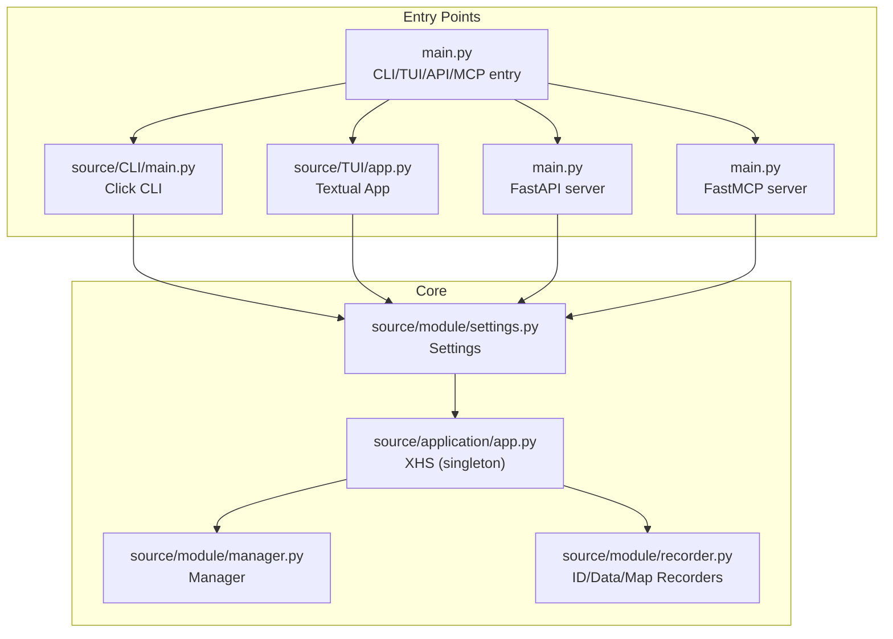
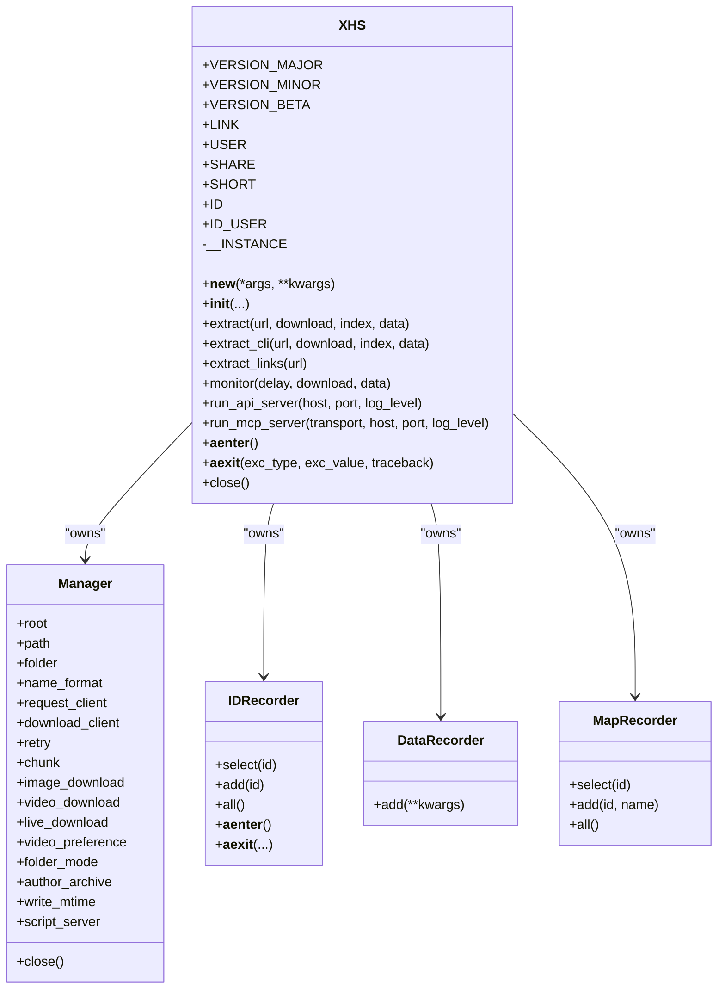
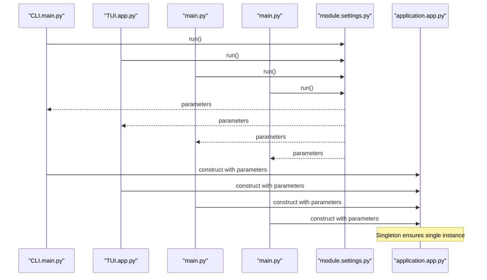
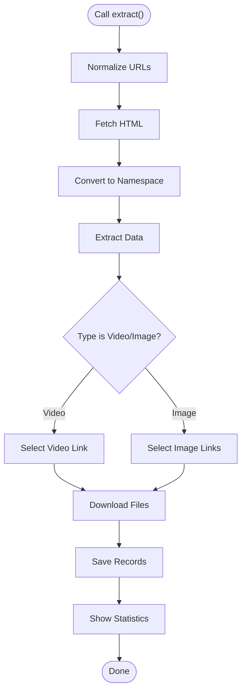
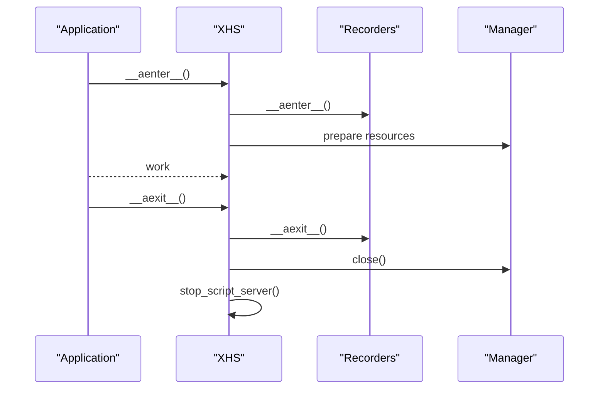
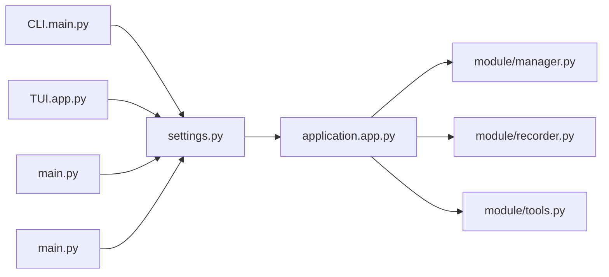

# Singleton Architecture

<cite>
**Referenced Files in This Document**
- [main.py](file://main.py)
- [source/__init__.py](file://source/__init__.py)
- [source/application/app.py](file://source/application/app.py)
- [source/application/__init__.py](file://source/application/__init__.py)
- [source/module/settings.py](file://source/module/settings.py)
- [source/CLI/main.py](file://source/CLI/main.py)
- [source/TUI/app.py](file://source/TUI/app.py)
- [source/TUI/index.py](file://source/TUI/index.py)
- [example.py](file://example.py)
- [source/module/manager.py](file://source/module/manager.py)
- [source/module/recorder.py](file://source/module/recorder.py)
- [source/module/tools.py](file://source/module/tools.py)
</cite>

## Table of Contents
1. [Introduction](#introduction)
2. [Project Structure](#project-structure)
3. [Core Components](#core-components)
4. [Architecture Overview](#architecture-overview)
5. [Detailed Component Analysis](#detailed-component-analysis)
6. [Dependency Analysis](#dependency-analysis)
7. [Performance Considerations](#performance-considerations)
8. [Troubleshooting Guide](#troubleshooting-guide)
9. [Conclusion](#conclusion)
10. [Appendices](#appendices)

## Introduction
This document explains the singleton pattern implementation in the XHS class and how it centralizes global state across the CLI, TUI, API, and MCP interfaces. It covers instance creation, initialization parameters, resource management, thread-safety considerations, lifecycle management, and best practices for extending the architecture.

## Project Structure
The application exposes four primary entry points that all converge on a single XHS instance:
- CLI via Click commands
- TUI via a Textual application
- API via FastAPI
- MCP via FastMCP

All entry points initialize or reuse a singleton XHS instance configured by Settings, ensuring consistent configuration and state across interfaces.

**Diagram sources**
- [main.py:12-59](file://main.py#L12-L59)
- [source/CLI/main.py:39-60](file://source/CLI/main.py#L39-L60)
- [source/TUI/app.py:18-40](file://source/TUI/app.py#L18-L40)
- [source/application/app.py:98-194](file://source/application/app.py#L98-L194)
- [source/module/settings.py:41-60](file://source/module/settings.py#L41-L60)
- [source/module/manager.py:28-132](file://source/module/manager.py#L28-L132)
- [source/module/recorder.py:13-69](file://source/module/recorder.py#L13-L69)

**Section sources**
- [main.py:12-59](file://main.py#L12-L59)
- [source/__init__.py:1-11](file://source/__init__.py#L1-L11)
- [source/application/__init__.py:1-3](file://source/application/__init__.py#L1-L3)

## Core Components
- XHS (singleton): Central coordinator for extraction, processing, conversion, downloading, and recording. Exposes async context manager lifecycle and orchestration APIs.
- Settings: Loads and merges persistent configuration into runtime parameters.
- Manager: Holds shared resources (HTTP clients, paths, preferences) and provides safe lifecycle management.
- Recorders: Persist download records and mapping data for consistent cross-interface state.

Key singleton characteristics:
- Single-instance guarantee via a private class-level instance variable and a custom constructor hook.
- Shared state across all interfaces because each interface constructs or accesses the same singleton instance.

**Section sources**
- [source/application/app.py:98-194](file://source/application/app.py#L98-L194)
- [source/module/settings.py:41-60](file://source/module/settings.py#L41-L60)
- [source/module/manager.py:28-132](file://source/module/manager.py#L28-L132)
- [source/module/recorder.py:13-69](file://source/module/recorder.py#L13-L69)

## Architecture Overview
The singleton XHS coordinates subsystems:
- Extraction: URL normalization and discovery
- Processing: Data extraction and metadata assembly
- Downloading: File retrieval and naming
- Recording: Persistence of IDs and data
- Script server: Optional embedded server for scripting

**Diagram sources**
- [source/application/app.py:98-194](file://source/application/app.py#L98-L194)
- [source/module/manager.py:28-132](file://source/module/manager.py#L28-L132)
- [source/module/recorder.py:13-69](file://source/module/recorder.py#L13-L69)

## Detailed Component Analysis

### Singleton Pattern Implementation in XHS
- Instance creation: The singleton is created on first access via a custom constructor hook that checks a private class-level instance variable and returns it for subsequent calls.
- Initialization parameters: The constructor accepts a comprehensive set of configuration parameters (paths, naming, UA, cookies, proxies, timeouts, retries, download toggles, preferences, language, script server settings) and initializes subsystems accordingly.
- Resource management: The async context manager ensures database connections and script server tasks are properly started and shut down.

Thread-safety considerations:
- The singleton creation uses a class-level guard to ensure only one instance is ever constructed.
- Subsystems like Manager maintain shared HTTP clients and filesystem paths; these are initialized once and reused.
- Asynchronous operations (queues, events, tasks) are coordinated via asyncio primitives.

Lifecycle management:
- __aenter__: Opens recorders and prepares the environment.
- __aexit__: Closes recorders, stops script server, and closes Manager resources.
- close: Explicit shutdown method for cleanup.

Consistent configuration across interfaces:
- All entry points derive runtime parameters from Settings.run(), ensuring identical configuration regardless of CLI, TUI, API, or MCP usage.

Usage patterns:
- CLI: Constructs XHS with merged settings and parameters.
- TUI: Stores a reference to the singleton and forwards calls to it.
- API/MCP: Construct XHS with Settings-derived parameters and run servers that delegate to the singleton’s orchestration methods.

Best practices for extending:
- Add new configuration keys to Settings.default and merge them into the runtime dictionary.
- Introduce new subsystems as attributes of XHS and initialize them in __init__.
- Keep shared state in Manager or dedicated recorders to preserve singleton guarantees.
- Always enter/exit the async context to ensure proper resource acquisition and release.

**Section sources**
- [source/application/app.py:108-114](file://source/application/app.py#L108-L114)
- [source/application/app.py:116-194](file://source/application/app.py#L116-L194)
- [source/application/app.py:656-671](file://source/application/app.py#L656-L671)
- [source/CLI/main.py:39-60](file://source/CLI/main.py#L39-L60)
- [source/TUI/app.py:18-40](file://source/TUI/app.py#L18-L40)
- [source/module/settings.py:52-60](file://source/module/settings.py#L52-L60)

### Instance Creation and Initialization Flow

**Diagram sources**
- [source/CLI/main.py:46-52](file://source/CLI/main.py#L46-L52)
- [source/TUI/app.py:35-40](file://source/TUI/app.py#L35-L40)
- [main.py:22-27](file://main.py#L22-L27)
- [main.py:36-42](file://main.py#L36-L42)
- [source/module/settings.py:52-60](file://source/module/settings.py#L52-L60)
- [source/application/app.py:108-114](file://source/application/app.py#L108-L114)

**Section sources**
- [source/CLI/main.py:46-52](file://source/CLI/main.py#L46-L52)
- [source/TUI/app.py:35-40](file://source/TUI/app.py#L35-L40)
- [main.py:22-42](file://main.py#L22-L42)
- [source/module/settings.py:52-60](file://source/module/settings.py#L52-L60)
- [source/application/app.py:108-114](file://source/application/app.py#L108-L114)

### Centralized Coordination Role
XHS orchestrates:
- URL extraction and normalization
- HTML fetching and data conversion
- Metadata extraction and naming
- Download execution and persistence
- Clipboard monitoring and queue-driven processing

**Diagram sources**
- [source/application/app.py:268-302](file://source/application/app.py#L268-L302)
- [source/application/app.py:386-415](file://source/application/app.py#L386-L415)
- [source/application/app.py:417-460](file://source/application/app.py#L417-L460)
- [source/application/app.py:252-261](file://source/application/app.py#L252-L261)

**Section sources**
- [source/application/app.py:268-302](file://source/application/app.py#L268-L302)
- [source/application/app.py:386-460](file://source/application/app.py#L386-L460)
- [source/application/app.py:252-261](file://source/application/app.py#L252-L261)

### Thread Safety and Concurrency
- Singleton construction: Guarded by a class-level instance variable to prevent multiple instances.
- Async context: Ensures orderly acquisition and release of resources.
- Queues and events: Used for clipboard monitoring and inter-task coordination.
- HTTP clients: Managed by Manager; initialized once and reused safely within the same event loop.

Recommendations:
- Avoid mutating shared state outside of XHS methods.
- Use asyncio primitives consistently for concurrency.
- Close resources via the async context manager to prevent leaks.

**Section sources**
- [source/application/app.py:108-114](file://source/application/app.py#L108-L114)
- [source/application/app.py:656-671](file://source/application/app.py#L656-L671)
- [source/module/manager.py:100-124](file://source/module/manager.py#L100-L124)

### Resource Cleanup and Lifecycle Management
- __aenter__/__aexit__: Open and close recorders; stop script server; close Manager clients.
- close: Explicitly stop script server and close Manager.
- Manager.close: Close HTTP clients and clean up temporary directories.

**Diagram sources**
- [source/application/app.py:656-671](file://source/application/app.py#L656-L671)
- [source/module/recorder.py:60-69](file://source/module/recorder.py#L60-L69)
- [source/module/manager.py:205-210](file://source/module/manager.py#L205-L210)

**Section sources**
- [source/application/app.py:656-671](file://source/application/app.py#L656-L671)
- [source/module/recorder.py:60-69](file://source/module/recorder.py#L60-L69)
- [source/module/manager.py:205-210](file://source/module/manager.py#L205-L210)

### Examples of Singleton Usage Patterns
- Programmatic usage with explicit parameters and async context manager.
- API/MCP usage where Settings-derived parameters are passed to XHS constructor.
- CLI usage where parameters are merged from Settings and CLI options.

**Section sources**
- [example.py:39-74](file://example.py#L39-L74)
- [main.py:22-27](file://main.py#L22-L27)
- [main.py:36-42](file://main.py#L36-L42)
- [source/CLI/main.py:46-52](file://source/CLI/main.py#L46-L52)

## Dependency Analysis
- Entry points depend on Settings for configuration.
- XHS depends on Manager and Recorders for shared state and persistence.
- Manager encapsulates HTTP clients and filesystem paths.
- Recorders provide database-backed persistence for IDs, data, and mappings.

**Diagram sources**
- [source/CLI/main.py:46-52](file://source/CLI/main.py#L46-L52)
- [source/TUI/app.py:35-40](file://source/TUI/app.py#L35-L40)
- [main.py:22-42](file://main.py#L22-L42)
- [source/module/settings.py:52-60](file://source/module/settings.py#L52-L60)
- [source/application/app.py:98-194](file://source/application/app.py#L98-L194)
- [source/module/manager.py:28-132](file://source/module/manager.py#L28-L132)
- [source/module/recorder.py:13-69](file://source/module/recorder.py#L13-L69)
- [source/module/tools.py:42-51](file://source/module/tools.py#L42-L51)

**Section sources**
- [source/CLI/main.py:46-52](file://source/CLI/main.py#L46-L52)
- [source/TUI/app.py:35-40](file://source/TUI/app.py#L35-L40)
- [main.py:22-42](file://main.py#L22-L42)
- [source/module/settings.py:52-60](file://source/module/settings.py#L52-L60)
- [source/application/app.py:98-194](file://source/application/app.py#L98-L194)
- [source/module/manager.py:28-132](file://source/module/manager.py#L28-L132)
- [source/module/recorder.py:13-69](file://source/module/recorder.py#L13-L69)
- [source/module/tools.py:42-51](file://source/module/tools.py#L42-L51)

## Performance Considerations
- Reuse HTTP clients via Manager to avoid connection overhead.
- Tune chunk size and retry parameters for network stability.
- Prefer batch operations where possible (e.g., saving multiple records).
- Use appropriate naming formats to reduce filesystem contention.

## Troubleshooting Guide
- If downloads fail repeatedly, adjust timeout and retry parameters.
- Verify proxy settings and test connectivity using Manager’s proxy validation.
- Ensure recorders are closed properly to avoid stale locks; use the async context manager.
- For clipboard monitoring issues, confirm event signaling and queue consumption logic.

**Section sources**
- [source/module/manager.py:225-259](file://source/module/manager.py#L225-L259)
- [source/application/app.py:656-671](file://source/application/app.py#L656-L671)

## Conclusion
The singleton XHS provides a robust, centralized foundation for coordinating extraction, processing, and downloading across CLI, TUI, API, and MCP interfaces. By deriving configuration from Settings and managing resources through async context managers, it ensures consistent behavior, predictable lifecycle, and maintainable extension points.

## Appendices
- Best practices for extending:
  - Add new configuration keys to Settings.default and merge into runtime parameters.
  - Initialize new subsystems in XHS.__init__ and manage their lifecycle in __aenter__/__aexit__.
  - Keep shared state in Manager or recorders to preserve singleton guarantees.
  - Use asyncio primitives for concurrency and ensure proper cleanup.

**Section sources**
- [source/module/settings.py:10-37](file://source/module/settings.py#L10-L37)
- [source/application/app.py:116-194](file://source/application/app.py#L116-L194)
- [source/application/app.py:656-671](file://source/application/app.py#L656-L671)