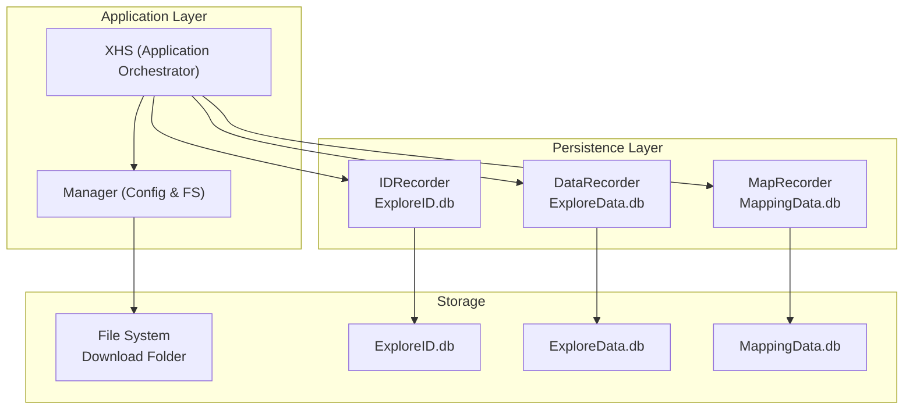
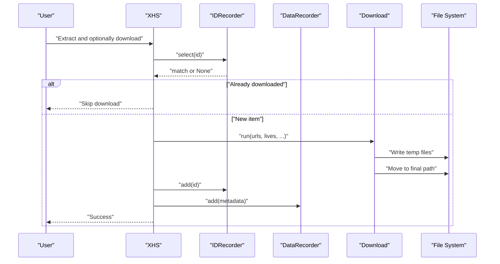
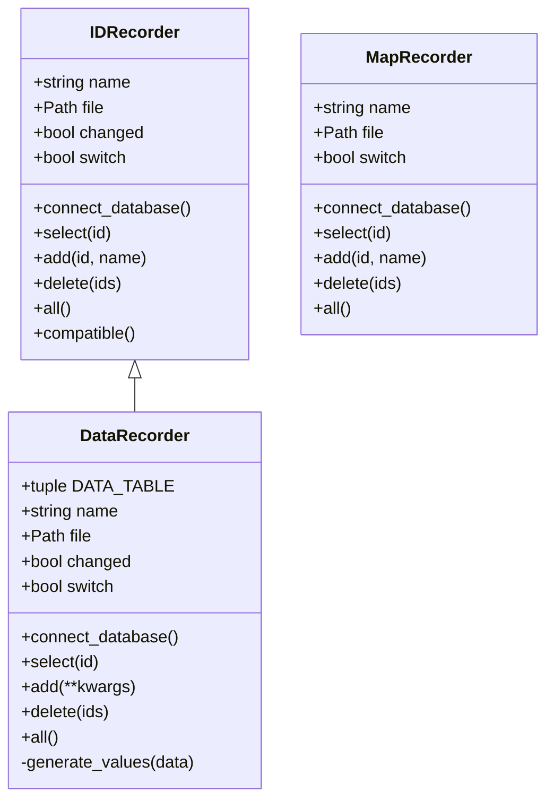
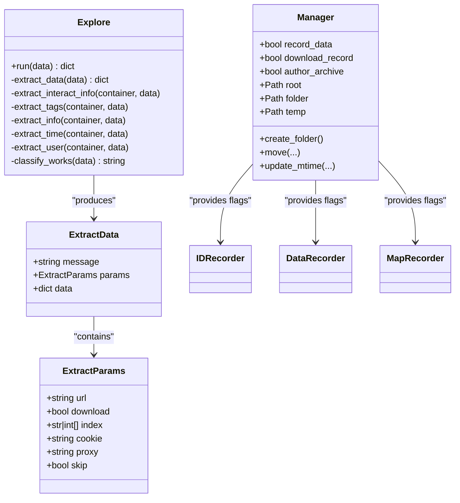
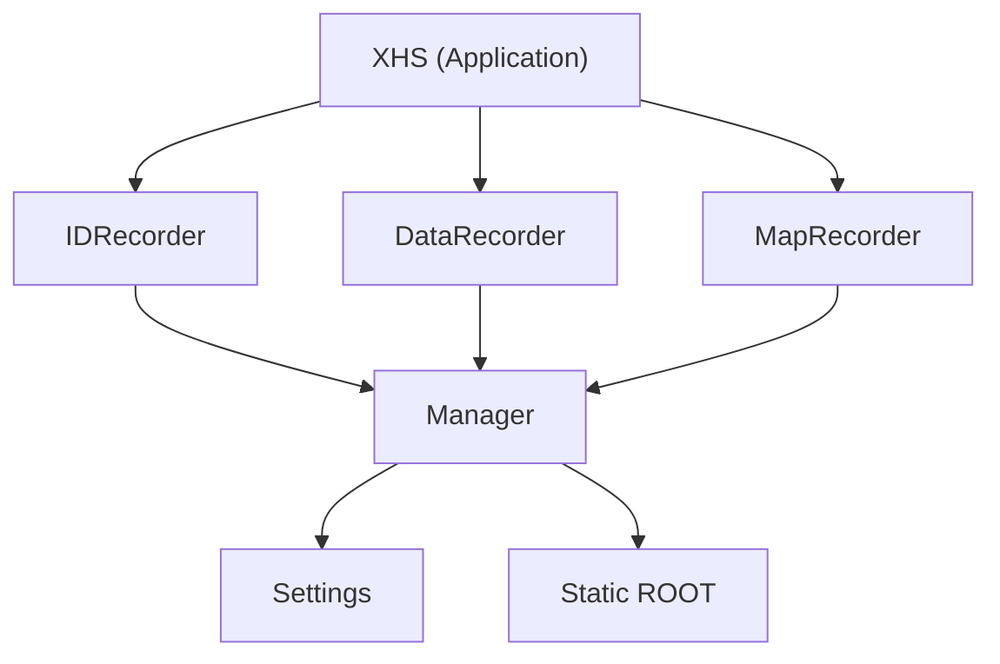

# Data Storage and Database

<cite>
**Referenced Files in This Document**
- [recorder.py](file://source/module/recorder.py)
- [app.py](file://source/application/app.py)
- [manager.py](file://source/module/manager.py)
- [settings.py](file://source/module/settings.py)
- [static.py](file://source/module/static.py)
- [explore.py](file://source/application/explore.py)
- [download.py](file://source/application/download.py)
- [record.py](file://source/TUI/record.py)
- [file_folder.py](file://source/expansion/file_folder.py)
- [main.py](file://main.py)
</cite>

## Table of Contents
1. [Introduction](#introduction)
2. [Project Structure](#project-structure)
3. [Core Components](#core-components)
4. [Architecture Overview](#architecture-overview)
5. [Detailed Component Analysis](#detailed-component-analysis)
6. [Dependency Analysis](#dependency-analysis)
7. [Performance Considerations](#performance-considerations)
8. [Troubleshooting Guide](#troubleshooting-guide)
9. [Conclusion](#conclusion)
10. [Appendices](#appendices)

## Introduction
This document explains the data storage and database systems in XHS-Downloader with a focus on SQLite-backed persistence and the recorder module. It covers the database schema design for download records, exploration data, and metadata mapping, the recorder classes that track downloaded items and prevent duplicates, data persistence patterns, caching strategies, and performance considerations for large datasets. It also documents the data model classes, their relationships to database tables, typical database operations and query patterns, backup/recovery and maintenance procedures, migration strategies, data lifecycle management, and the integration between file system storage and database records.

## Project Structure
The data persistence layer centers around three recorder classes backed by SQLite databases:
- ExploreID.db: Tracks explored/downloaded IDs to prevent duplicate downloads.
- ExploreData.db: Stores extracted metadata for each work item.
- MappingData.db: Maps author IDs to human-friendly names for archival and display.

These recorder instances are initialized and managed by the application and integrated into the download pipeline to ensure consistent persistence and deduplication.

**Diagram sources**
- [app.py:147-194](file://source/application/app.py#L147-L194)
- [recorder.py:13-192](file://source/module/recorder.py#L13-L192)
- [manager.py:28-308](file://source/module/manager.py#L28-L308)

**Section sources**
- [app.py:147-194](file://source/application/app.py#L147-L194)
- [recorder.py:13-192](file://source/module/recorder.py#L13-L192)
- [manager.py:28-308](file://source/module/manager.py#L28-L308)

## Core Components
- IDRecorder: Manages ExploreID.db to store and query explored/downloaded IDs, enabling duplicate prevention.
- DataRecorder: Manages ExploreData.db to persist extracted metadata for works, keyed by primary key (作品ID).
- MapRecorder: Manages MappingData.db to maintain author ID to name mappings for archival and display.
- Manager: Provides filesystem paths, configuration flags, and utilities used by recorders and download pipeline.
- Application orchestration: XHS initializes and coordinates recorders, integrates saving of metadata, and checks for existing download records.

Key behaviors:
- Conditional recording based on settings flags (e.g., download_record, record_data, author_archive).
- Asynchronous SQLite connections and transactions per recorder.
- File path resolution for database files under configurable roots.

**Section sources**
- [recorder.py:13-192](file://source/module/recorder.py#L13-L192)
- [app.py:147-194](file://source/application/app.py#L147-L194)
- [manager.py:28-308](file://source/module/manager.py#L28-L308)

## Architecture Overview
The recorder classes encapsulate SQLite operations and are integrated into the application’s extraction and download workflow. The application checks for existing download records before initiating downloads and persists metadata after successful processing.

**Diagram sources**
- [app.py:220-267](file://source/application/app.py#L220-L267)
- [recorder.py:30-68](file://source/module/recorder.py#L30-L68)
- [download.py:196-268](file://source/application/download.py#L196-L268)

**Section sources**
- [app.py:220-267](file://source/application/app.py#L220-L267)
- [download.py:196-268](file://source/application/download.py#L196-L268)
- [recorder.py:30-68](file://source/module/recorder.py#L30-L68)

## Detailed Component Analysis

### Recorder Classes and Database Schema
The recorder classes define and manage three SQLite databases:

- ExploreID.db (IDRecorder)
  - Purpose: Prevent duplicate downloads by storing IDs.
  - Schema: explore_id (ID TEXT PRIMARY KEY)
  - Operations: select, add (REPLACE), delete, all
  - Scope: Controlled by download_record flag.

- ExploreData.db (DataRecorder)
  - Purpose: Persist extracted metadata for each work.
  - Schema: explore_data with columns including:
    - 采集时间, 作品ID (PK), 作品类型, 作品标题, 作品描述, 作品标签, 发布时间, 最后更新时间, 收藏数量, 评论数量, 分享数量, 点赞数量, 作者昵称, 作者ID, 作者链接, 作品链接, 下载地址, 动图地址
  - Operations: add (REPLACE INTO with ordered values), select, delete, all overridden (no-op)
  - Scope: Controlled by record_data flag.

- MappingData.db (MapRecorder)
  - Purpose: Map author IDs to display names for archival and UI.
  - Schema: mapping_data (ID TEXT PRIMARY KEY, NAME TEXT NOT NULL)
  - Operations: select, add (REPLACE), delete, all
  - Scope: Controlled by author_archive flag.

**Diagram sources**
- [recorder.py:13-192](file://source/module/recorder.py#L13-L192)

**Section sources**
- [recorder.py:13-192](file://source/module/recorder.py#L13-L192)

### Data Model Classes and Relationships
- ExtractParams: Defines request parameters for API/MCP endpoints.
- ExtractData: Wraps endpoint responses with message, params, and optional data payload.
- Explore: Transforms HTML/Namespace data into structured metadata (e.g., counts, tags, timestamps, user info).
- Manager: Provides configuration flags and filesystem utilities used by recorders and download pipeline.

Relationships:
- ExtractData and ExtractParams are used by the API/MCP handlers to return structured results.
- Explore extracts fields from the parsed data and aligns them with the ExploreData.db schema.
- Manager exposes flags that gate recorder usage (download_record, record_data, author_archive).

**Diagram sources**
- [model.py:4-17](file://source/module/model.py#L4-L17)
- [explore.py:9-83](file://source/application/explore.py#L9-L83)
- [manager.py:28-308](file://source/module/manager.py#L28-L308)
- [app.py:147-194](file://source/application/app.py#L147-L194)

**Section sources**
- [model.py:4-17](file://source/module/model.py#L4-L17)
- [explore.py:9-83](file://source/application/explore.py#L9-L83)
- [manager.py:28-308](file://source/module/manager.py#L28-L308)
- [app.py:147-194](file://source/application/app.py#L147-L194)

### Database Operations and Query Patterns
Common operations performed by recorders:
- Connect to SQLite database asynchronously and create tables if missing.
- Insert or replace records using parameterized queries.
- Select records by ID for duplicate detection.
- Delete records by ID (currently minimal usage in current recorder implementations).
- Retrieve all IDs for mapping operations.

Typical query patterns:
- Upsert by ID: REPLACE INTO explore_id VALUES (?); and REPLACE INTO mapping_data VALUES (?, ?);
- Select by ID: SELECT ID FROM explore_id WHERE ID=?; SELECT NAME FROM mapping_data WHERE ID=?;
- Bulk deletion: DELETE FROM explore_id WHERE ID=?; executed per ID.

Integration points:
- Duplicate prevention: Before downloading, application queries IDRecorder.select(id) and skips if present.
- Metadata persistence: After successful download, application calls DataRecorder.add(...) with ordered values aligned to ExploreData.db schema.

**Section sources**
- [recorder.py:22-68](file://source/module/recorder.py#L22-L68)
- [recorder.py:110-143](file://source/module/recorder.py#L110-L143)
- [recorder.py:153-191](file://source/module/recorder.py#L153-L191)
- [app.py:220-267](file://source/application/app.py#L220-L267)

### Backup and Recovery Procedures
- Database location: Each recorder stores its SQLite file under a configured root path:
  - ExploreID.db: under root (Manager.root).
  - ExploreData.db: under folder (Manager.folder).
  - MappingData.db: under root (Manager.root).
- Migration and compatibility:
  - Recorder classes implement a compatibility routine to move legacy database files to new locations if detected.
  - Settings class migrates settings.json to a new location if needed.
- Recovery steps:
  - Stop the application to avoid concurrent writes.
  - Back up the relevant .db files alongside the application data directory.
  - If corruption is suspected, remove or rename the problematic database file; the recorder will recreate the schema on next use.
  - Restore settings.json via Settings.migration_file if needed.

**Section sources**
- [recorder.py:70-79](file://source/module/recorder.py#L70-L79)
- [settings.py:115-124](file://source/module/settings.py#L115-L124)
- [static.py:7-8](file://source/module/static.py#L7-L8)

### Database Maintenance Tasks and Migration Strategies
- Maintenance:
  - Vacuum/analyze: Not currently implemented; SQLite auto-vacuum occurs as needed. Manual VACUUM can be considered if disk usage grows large.
  - Integrity checks: Run PRAGMA integrity_check on each database file periodically.
- Migrations:
  - Schema evolution: Add new columns to explore_data with defaults; ensure DataRecorder.add still passes values in the correct order.
  - Data cleanup: Remove stale entries by ID if needed; note that current recorder implementations do not expose a general-purpose delete method for ExploreData.db.

**Section sources**
- [recorder.py:110-116](file://source/module/recorder.py#L110-L116)
- [recorder.py:153-162](file://source/module/recorder.py#L153-L162)

### Data Lifecycle Management, Retention Policies, and Archival Rules
- Lifecycle stages:
  - Extraction: Explore transforms raw data into structured metadata aligned with ExploreData.db schema.
  - Deduplication: IDRecorder prevents reprocessing of previously downloaded items.
  - Download: Files written to filesystem; metadata persisted to ExploreData.db.
  - Archival: Optional author-based folder mode controlled by author_archive flag.
- Retention:
  - No built-in retention policy; users can manually delete records or databases.
  - MappingData.db can be pruned by removing outdated author ID/name pairs.
- Archival:
  - Author archive mode organizes files under author-named subfolders when enabled.

**Section sources**
- [explore.py:15-83](file://source/application/explore.py#L15-L83)
- [app.py:220-267](file://source/application/app.py#L220-L267)
- [download.py:114-122](file://source/application/download.py#L114-L122)
- [manager.py:92-131](file://source/module/manager.py#L92-L131)

### Integration Between File System Storage and Database Records
- File naming and organization:
  - Manager constructs final paths and supports author-based archiving and folder-mode organization.
  - Download writes temporary files and moves them to final destinations, optionally updating modification time.
- Database linkage:
  - ExploreID.db stores IDs to prevent duplicate downloads.
  - ExploreData.db stores metadata keyed by 作品ID, enabling later lookup and reporting.
  - MappingData.db maintains author ID to name mapping for archival and display.

**Section sources**
- [download.py:114-122](file://source/application/download.py#L114-L122)
- [download.py:241-246](file://source/application/download.py#L241-L246)
- [manager.py:175-193](file://source/module/manager.py#L175-L193)

## Dependency Analysis
The recorder classes depend on:
- Manager for filesystem paths and configuration flags.
- aiofiles and aiosqlite for asynchronous file and database operations.
- Application orchestrator (XHS) to coordinate recorder initialization and usage.

**Diagram sources**
- [app.py:147-194](file://source/application/app.py#L147-L194)
- [recorder.py:13-192](file://source/module/recorder.py#L13-L192)
- [manager.py:28-308](file://source/module/manager.py#L28-L308)
- [settings.py:41-50](file://source/module/settings.py#L41-L50)
- [static.py:7-8](file://source/module/static.py#L7-L8)

**Section sources**
- [app.py:147-194](file://source/application/app.py#L147-L194)
- [recorder.py:13-192](file://source/module/recorder.py#L13-L192)
- [manager.py:28-308](file://source/module/manager.py#L28-L308)
- [settings.py:41-50](file://source/module/settings.py#L41-L50)
- [static.py:7-8](file://source/module/static.py#L7-L8)

## Performance Considerations
- Concurrency and batching:
  - Use REPLACE INTO for efficient upserts; ensure transactions are committed promptly.
  - For bulk deletions or updates, batch operations where feasible to reduce round-trips.
- Indexing:
  - Primary keys are already indexed (ID TEXT PRIMARY KEY). Consider adding indexes on frequently queried columns (e.g., 作者ID, 发布时间) if query volume increases.
- I/O and memory:
  - Keep SQLite pragmas at defaults for simplicity; avoid heavy WAL modes unless necessary.
  - Monitor database file sizes; consider periodic maintenance for very large datasets.
- Network and download pipeline:
  - The download pipeline already uses concurrency controls and resume-aware transfers; ensure recorder operations remain lightweight.

[No sources needed since this section provides general guidance]

## Troubleshooting Guide
Common issues and resolutions:
- Database locked or file access errors:
  - Ensure the application is closed before manual database edits.
  - On Windows/macOS, close any file explorer windows pointing to the database directory.
- Corrupted or unreadable database:
  - Rename or move the .db file; the recorder will recreate the schema on next run.
- Duplicate downloads occur:
  - Verify download_record is enabled and ExploreID.db exists; confirm IDRecorder.select(id) returns a match before download starts.
- Missing metadata:
  - Confirm record_data is enabled and DataRecorder.add(...) is invoked after successful download.
- Author name not updated:
  - Ensure author_archive is enabled and MapRecorder.add(...) is called during processing.

Operational tips:
- Close database connections gracefully via application lifecycle hooks.
- Use Settings.migration_file to relocate settings.json if needed.

**Section sources**
- [recorder.py:65-68](file://source/module/recorder.py#L65-L68)
- [TUI app.py:121-126](file://source/TUI/app.py#L121-L126)
- [settings.py:115-124](file://source/module/settings.py#L115-L124)

## Conclusion
XHS-Downloader employs a straightforward yet effective SQLite-backed persistence strategy. Three dedicated recorders manage ExploreID.db, ExploreData.db, and MappingData.db, integrating seamlessly with the download pipeline to prevent duplicates, persist metadata, and support author-based archival. Configuration flags enable selective activation of each recorder, while compatibility routines assist with migrations. For large-scale usage, consider indexing, periodic maintenance, and careful connection lifecycle management to sustain performance and reliability.

[No sources needed since this section summarizes without analyzing specific files]

## Appendices

### Database Schema Reference
- ExploreID.db
  - Table: explore_id
  - Columns: ID (TEXT, PRIMARY KEY)
- ExploreData.db
  - Table: explore_data
  - Columns: 采集时间, 作品ID (TEXT, PRIMARY KEY), 作品类型, 作品标题, 作品描述, 作品标签, 发布时间, 最后更新时间, 收藏数量, 评论数量, 分享数量, 点赞数量, 作者昵称, 作者ID, 作者链接, 作品链接, 下载地址, 动图地址
- MappingData.db
  - Table: mapping_data
  - Columns: ID (TEXT, PRIMARY KEY), NAME (TEXT NOT NULL)

**Section sources**
- [recorder.py:25-28](file://source/module/recorder.py#L25-L28)
- [recorder.py:82-101](file://source/module/recorder.py#L82-L101)
- [recorder.py:156-162](file://source/module/recorder.py#L156-L162)

### Typical Workflows and Examples
- Duplicate prevention:
  - Before download: select(id) from ExploreID.db; if found, skip.
  - After successful download: add(id) to ExploreID.db.
- Metadata persistence:
  - After download completion: add(metadata) to ExploreData.db using ordered values aligned to schema.
- Author mapping:
  - During processing: add(authorID, authorName) to MappingData.db; retrieve name via select(authorID) when needed.

**Section sources**
- [app.py:220-267](file://source/application/app.py#L220-L267)
- [recorder.py:30-68](file://source/module/recorder.py#L30-L68)
- [recorder.py:118-131](file://source/module/recorder.py#L118-L131)
- [recorder.py:164-180](file://source/module/recorder.py#L164-L180)