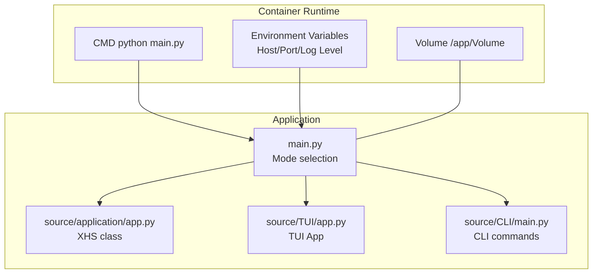
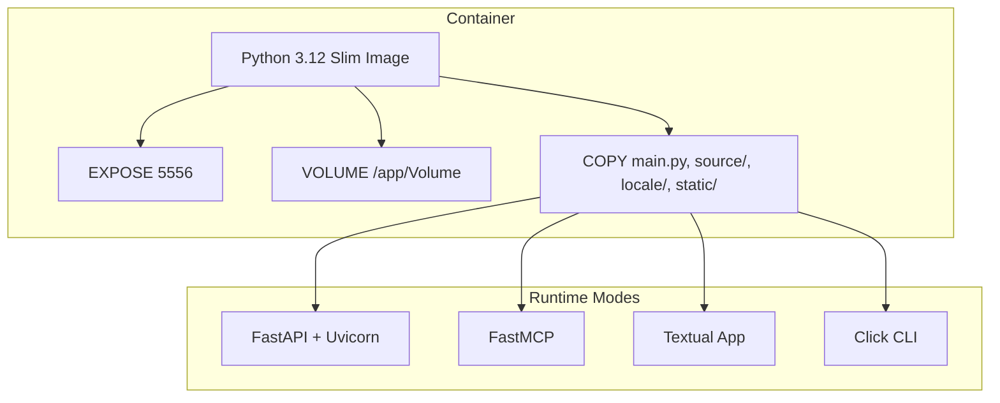
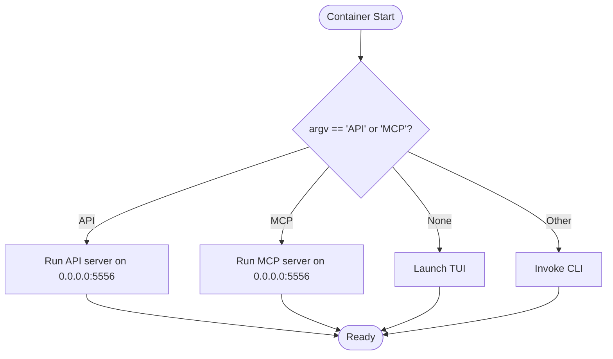
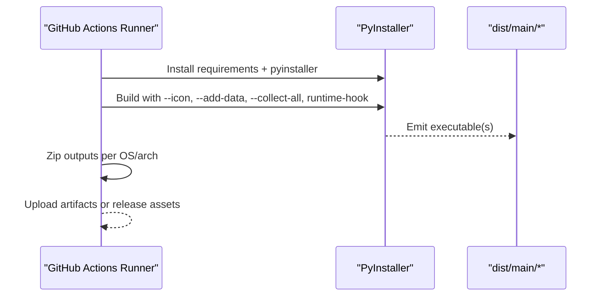
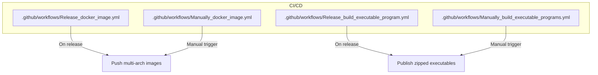
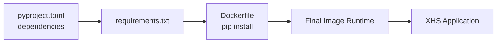

# Deployment and Distribution

<cite>
**Referenced Files in This Document**
- [Dockerfile](file://Dockerfile)
- [pyproject.toml](file://pyproject.toml)
- [requirements.txt](file://requirements.txt)
- [main.py](file://main.py)
- [source/application/app.py](file://source/application/app.py)
- [source/CLI/main.py](file://source/CLI/main.py)
- [source/TUI/app.py](file://source/TUI/app.py)
- [source/module/settings.py](file://source/module/settings.py)
- [.github/workflows/Release_docker_image.yml](file://.github/workflows/Release_docker_image.yml)
- [.github/workflows/Release_build_executable_program.yml](file://.github/workflows/Release_build_executable_program.yml)
- [.github/workflows/Manually_build_executable_programs.yml](file://.github/workflows/Manually_build_executable_programs.yml)
- [.github/workflows/Manually_docker_image.yml](file://.github/workflows/Manually_docker_image.yml)
- [static/XHS-Downloader.ico](file://static/XHS-Downloader.ico)
- [static/XHS-Downloader.icns](file://static/XHS-Downloader.icns)
</cite>

## Table of Contents
1. [Introduction](#introduction)
2. [Project Structure](#project-structure)
3. [Core Components](#core-components)
4. [Architecture Overview](#architecture-overview)
5. [Detailed Component Analysis](#detailed-component-analysis)
6. [Dependency Analysis](#dependency-analysis)
7. [Performance Considerations](#performance-considerations)
8. [Troubleshooting Guide](#troubleshooting-guide)
9. [Conclusion](#conclusion)
10. [Appendices](#appendices)

## Introduction
This document explains how to package, deploy, and distribute XHS-Downloader across environments. It covers:
- Docker container configuration, runtime modes, ports, volumes, and orchestration guidance
- Executable builds for Windows and macOS using PyInstaller and Nuitka
- GitHub Actions automation for releases and images
- Platform-specific deployment notes
- Production patterns, scaling, and security considerations
- Release and version management, backward compatibility
- Troubleshooting common deployment issues

## Project Structure
XHS-Downloader exposes three primary operational modes:
- TUI (Textual UI): interactive desktop app
- CLI (Command Line): headless batch operations
- API/MCP servers: network-accessible services

The application entrypoint selects mode based on arguments and environment. Docker integrates these modes into a single container image.

**Diagram sources**
- [main.py:45-60](file://main.py#L45-L60)
- [source/application/app.py:685-704](file://source/application/app.py#L685-L704)
- [source/TUI/app.py:18-41](file://source/TUI/app.py#L18-L41)
- [source/CLI/main.py:354-370](file://source/CLI/main.py#L354-L370)
- [Dockerfile:44-47](file://Dockerfile#L44-L47)

**Section sources**
- [main.py:12-60](file://main.py#L12-L60)
- [source/application/app.py:685-804](file://source/application/app.py#L685-L804)
- [source/TUI/app.py:18-41](file://source/TUI/app.py#L18-L41)
- [source/CLI/main.py:354-370](file://source/CLI/main.py#L354-L370)
- [Dockerfile:40-47](file://Dockerfile#L40-L47)

## Core Components
- Application core: XHS orchestrates extraction, conversion, download, and recording. It supports API and MCP server modes.
- CLI: Provides parameter-driven operations and settings persistence.
- TUI: Interactive desktop app backed by Textual.
- Settings: Manages defaults, persistence, and compatibility across versions.
- Docker: Multi-stage build, slim runtime, exposed port, and shared volume.

Key runtime entrypoints:
- API server: [source/application/app.py:685-704](file://source/application/app.py#L685-L704)
- MCP server: [source/application/app.py:758-804](file://source/application/app.py#L758-L804)
- CLI: [source/CLI/main.py:354-370](file://source/CLI/main.py#L354-L370)
- TUI: [source/TUI/app.py:18-41](file://source/TUI/app.py#L18-L41)
- Settings: [source/module/settings.py:52-124](file://source/module/settings.py#L52-L124)

**Section sources**
- [source/application/app.py:685-804](file://source/application/app.py#L685-L804)
- [source/CLI/main.py:354-370](file://source/CLI/main.py#L354-L370)
- [source/TUI/app.py:18-41](file://source/TUI/app.py#L18-L41)
- [source/module/settings.py:52-124](file://source/module/settings.py#L52-L124)

## Architecture Overview
The system supports three operational modes behind a unified container image. The container exposes a port for API/MCP and mounts a persistent volume for downloads.

**Diagram sources**
- [Dockerfile:20-47](file://Dockerfile#L20-L47)
- [source/application/app.py:685-804](file://source/application/app.py#L685-L804)
- [main.py:17-42](file://main.py#L17-L42)

**Section sources**
- [Dockerfile:20-47](file://Dockerfile#L20-L47)
- [main.py:17-42](file://main.py#L17-L42)

## Detailed Component Analysis

### Docker Container Configuration
- Base image: Python 3.12 slim for runtime; Python 3.12 bullseye for build stage with build-essential to compile native deps.
- Multi-stage build: Install dependencies into a prefix directory and copy into the final image.
- Ports: Exposes 5556 for API/MCP.
- Volume: Mountable /app/Volume for persistent downloads.
- CMD: Launches main.py, which selects mode by argument.

Operational modes selection:
- Default: TUI app
- API: python main.py API
- MCP: python main.py MCP
- CLI: python main.py with CLI arguments

**Diagram sources**
- [main.py:45-60](file://main.py#L45-L60)
- [source/application/app.py:685-704](file://source/application/app.py#L685-L704)
- [source/application/app.py:758-804](file://source/application/app.py#L758-L804)

**Section sources**
- [Dockerfile:1-48](file://Dockerfile#L1-L48)
- [main.py:17-42](file://main.py#L17-L42)

### Environment Variables and Configuration
- Host and port for API/MCP are configurable via function parameters; default host is 0.0.0.0 and port is 5556.
- Logging level is configurable for both API and MCP modes.
- Settings persistence and defaults are managed by Settings class, including work path, folder name, naming format, cookies, proxies, timeouts, retries, and language.

Recommended environment variables for containerization:
- XHS_HOST: override default host binding
- XHS_PORT: override default port
- XHS_LOG_LEVEL: set logging verbosity
- XHS_WORK_PATH: override working directory for downloads
- XHS_LANGUAGE: set UI/API language

These can be passed to the container and mapped into the application’s Settings and server startup.

**Section sources**
- [main.py:17-42](file://main.py#L17-L42)
- [source/application/app.py:685-704](file://source/application/app.py#L685-L704)
- [source/application/app.py:758-804](file://source/application/app.py#L758-L804)
- [source/module/settings.py:52-124](file://source/module/settings.py#L52-L124)

### Volume Mounting and Persistence
- The container declares a writable volume at /app/Volume for persistent storage of downloaded assets.
- Settings and databases are stored under the configured work path; mount a host directory to persist configuration and downloads across restarts.

Best practices:
- Bind a host path to /app/Volume or configure XHS_WORK_PATH to a mounted path.
- Ensure the container user has write permissions to the mounted path.

**Section sources**
- [Dockerfile:44-47](file://Dockerfile#L44-L47)
- [source/module/settings.py:52-124](file://source/module/settings.py#L52-L124)

### Deployment Examples

#### TUI Mode
- Run the container with default CMD; the application launches the TUI.
- Persist configuration by mounting a host directory to /app/Volume or configuring XHS_WORK_PATH.

#### API Mode
- Start the container with command: python main.py API
- Expose port 5556 externally and configure reverse proxy if needed.

#### MCP Mode
- Start the container with command: python main.py MCP
- Expose port 5556 and integrate with MCP clients.

#### CLI Mode
- Start the container with custom command to invoke CLI with desired parameters.
- Use environment variables to set XHS_* options and bind configuration/data volumes.

**Section sources**
- [main.py:45-60](file://main.py#L45-L60)
- [Dockerfile:46-47](file://Dockerfile#L46-L47)

### Executable Building with PyInstaller and Nuitka
The repository includes GitHub Actions to produce distributable executables for Windows and macOS.

- PyInstaller jobs:
  - Windows: uses PowerShell to build with icon and data collection
  - macOS: similar build with .icns icon and data collection
  - Adds runtime hook for beartype and collects third-party packages
  - Packages outputs into zip archives per OS/arch

- Nuitka:
  - Included in dev dependencies; can be used to build optimized binaries

Build artifacts:
- Windows: main.exe with icons and bundled resources
- macOS: main.app bundle with icons and resources

**Diagram sources**
- [.github/workflows/Release_build_executable_program.yml:34-44](file://.github/workflows/Release_build_executable_program.yml#L34-L44)
- [.github/workflows/Manually_build_executable_programs.yml:29-40](file://.github/workflows/Manually_build_executable_programs.yml#L29-L40)

**Section sources**
- [.github/workflows/Release_build_executable_program.yml:11-59](file://.github/workflows/Release_build_executable_program.yml#L11-L59)
- [.github/workflows/Manually_build_executable_programs.yml:1-47](file://.github/workflows/Manually_build_executable_programs.yml#L1-L47)
- [pyproject.toml:112-118](file://pyproject.toml#L112-L118)
- [static/XHS-Downloader.ico](file://static/XHS-Downloader.ico)
- [static/XHS-Downloader.icns](file://static/XHS-Downloader.icns)

### GitHub Actions Workflows
- Automated Docker image publishing on release
- Manual Docker image build with beta/dev tagging
- Automated executable builds for Windows/macOS on release
- Manual executable builds via workflow dispatch

**Diagram sources**
- [.github/workflows/Release_docker_image.yml:1-60](file://.github/workflows/Release_docker_image.yml#L1-L60)
- [.github/workflows/Manually_docker_image.yml:1-94](file://.github/workflows/Manually_docker_image.yml#L1-L94)
- [.github/workflows/Release_build_executable_program.yml:1-59](file://.github/workflows/Release_build_executable_program.yml#L1-L59)
- [.github/workflows/Manually_build_executable_programs.yml:1-47](file://.github/workflows/Manually_build_executable_programs.yml#L1-L47)

**Section sources**
- [.github/workflows/Release_docker_image.yml:1-60](file://.github/workflows/Release_docker_image.yml#L1-L60)
- [.github/workflows/Manually_docker_image.yml:1-94](file://.github/workflows/Manually_docker_image.yml#L1-L94)
- [.github/workflows/Release_build_executable_program.yml:1-59](file://.github/workflows/Release_build_executable_program.yml#L1-L59)
- [.github/workflows/Manually_build_executable_programs.yml:1-47](file://.github/workflows/Manually_build_executable_programs.yml#L1-L47)

### Platform-Specific Deployment Notes
- Windows
  - Executables built with PyInstaller include an ICO icon and collect third-party packages
  - Use the generated zip artifacts for distribution
- macOS
  - Executables built with PyInstaller include an ICNS icon and collect third-party packages
  - Use the generated zip artifacts for distribution
- Linux
  - Prefer the Docker image for consistent runtime and dependencies
  - For standalone binaries, consider Nuitka builds from the dev dependency group

**Section sources**
- [.github/workflows/Release_build_executable_program.yml:34-44](file://.github/workflows/Release_build_executable_program.yml#L34-L44)
- [.github/workflows/Manually_build_executable_programs.yml:36-40](file://.github/workflows/Manually_build_executable_programs.yml#L36-L40)
- [pyproject.toml:112-118](file://pyproject.toml#L112-L118)

### Container Orchestration, Scaling, and Production Patterns
- Horizontal scaling: Run multiple containers behind a load balancer; ensure each instance binds to port 5556 and uses distinct persistent volumes or a shared filesystem for configuration.
- API/MCP: Expose port 5556 and front with an ingress controller or reverse proxy; set XHS_HOST/XHS_PORT/XHS_LOG_LEVEL via environment variables.
- Persistent storage: Mount /app/Volume to a durable storage backend (local disk, NAS, cloud block storage).
- Health checks: Add readiness probes checking service availability on port 5556.
- Security: Limit container capabilities, run as non-root, scan images, and rotate credentials.

[No sources needed since this section provides general guidance]

### Release Process, Version Management, and Backward Compatibility
- Versioning: Project version is defined in the project metadata.
- Releases: CI publishes Docker images and executable artifacts on GitHub Releases.
- Backward compatibility:
  - Settings class performs compatibility checks and updates missing keys automatically.
  - API/MCP server versions are embedded; maintain stable endpoints and deprecate gracefully.

**Section sources**
- [pyproject.toml:1-11](file://pyproject.toml#L1-L11)
- [.github/workflows/Release_docker_image.yml:13-16](file://.github/workflows/Release_docker_image.yml#L13-L16)
- [.github/workflows/Release_build_executable_program.yml:50-58](file://.github/workflows/Release_build_executable_program.yml#L50-L58)
- [source/module/settings.py:93-113](file://source/module/settings.py#L93-L113)
- [source/application/app.py:685-704](file://source/application/app.py#L685-L704)

### Security Considerations
- Container hardening: Use minimal base images, drop unnecessary privileges, disable shell inside the container, and scan images regularly.
- Secrets: Avoid embedding cookies or tokens in images; pass via environment variables or secret managers.
- Network exposure: Restrict inbound access to port 5556; prefer internal networks or VPN; enable TLS termination at the ingress.
- Executable distribution: Sign binaries on Windows/macOS; verify checksums; deliver via HTTPS.

[No sources needed since this section provides general guidance]

## Dependency Analysis
The application depends on FastAPI, Uvicorn, FastMCP, Textual, and others. The Docker image copies these into the final runtime.

**Diagram sources**
- [pyproject.toml:11-25](file://pyproject.toml#L11-L25)
- [requirements.txt:1-29](file://requirements.txt#L1-29)
- [Dockerfile:16-31](file://Dockerfile#L16-L31)

**Section sources**
- [pyproject.toml:11-25](file://pyproject.toml#L11-L25)
- [requirements.txt:1-29](file://requirements.txt#L1-29)
- [Dockerfile:16-31](file://Dockerfile#L16-L31)

## Performance Considerations
- API/MCP concurrency: Tune worker processes and keep-alive settings at the ingress; avoid blocking operations in the application.
- Download throughput: Adjust chunk size and retry parameters via settings to balance speed and stability.
- Database I/O: Ensure the mounted volume has low latency and sufficient IOPS for SQLite-backed records.

[No sources needed since this section provides general guidance]

## Troubleshooting Guide
Common deployment issues and resolutions:
- Port conflicts
  - Symptom: API/MCP fails to bind to 5556
  - Resolution: Change XHS_PORT or container port mapping; verify firewall rules
- Permission denied on downloads
  - Symptom: Write failures to /app/Volume
  - Resolution: Ensure the container user has write access to the mounted path; adjust ownership or run as the correct UID/GID
- No results from API/MCP
  - Symptom: Empty responses or errors
  - Resolution: Verify URL formats, cookies, and proxies; confirm language and naming settings
- CLI not applying settings
  - Symptom: Options not taking effect
  - Resolution: Confirm settings.json location and that XHS_WORK_PATH points to the mounted directory
- Executable launch failures
  - Symptom: Missing DLLs or frameworks on Windows/macOS
  - Resolution: Rebuild with PyInstaller using the same Python version and include all required data; test on target OS

**Section sources**
- [main.py:17-42](file://main.py#L17-L42)
- [source/module/settings.py:52-124](file://source/module/settings.py#L52-L124)
- [.github/workflows/Release_build_executable_program.yml:34-44](file://.github/workflows/Release_build_executable_program.yml#L34-L44)

## Conclusion
XHS-Downloader offers flexible deployment options:
- Use the Docker image for portable, scalable deployments with API/MCP support
- Produce platform-specific executables for Windows/macOS via PyInstaller
- Automate releases with GitHub Actions for images and binaries
- Apply sound operational practices for persistence, security, and scalability

[No sources needed since this section summarizes without analyzing specific files]

## Appendices

### Appendix A: Operational Modes Reference
- TUI: Interactive desktop app launched by default
- API: FastAPI server on port 5556
- MCP: FastMCP server on port 5556
- CLI: Parameter-driven operations with settings persistence

**Section sources**
- [main.py:17-42](file://main.py#L17-L42)
- [source/application/app.py:685-804](file://source/application/app.py#L685-L804)
- [source/TUI/app.py:18-41](file://source/TUI/app.py#L18-L41)
- [source/CLI/main.py:354-370](file://source/CLI/main.py#L354-L370)