# Development and Customization

<cite>
**Referenced Files in This Document**
- [main.py](file://main.py)
- [source/__init__.py](file://source/__init__.py)
- [source/application/__init__.py](file://source/application/__init__.py)
- [source/application/app.py](file://source/application/app.py)
- [source/module/__init__.py](file://source/module/__init__.py)
- [source/module/settings.py](file://source/module/settings.py)
- [source/module/model.py](file://source/module/model.py)
- [source/module/tools.py](file://source/module/tools.py)
- [source/module/recorder.py](file://source/module/recorder.py)
- [source/module/manager.py](file://source/module/manager.py)
- [source/module/mapping.py](file://source/module/mapping.py)
- [source/module/static.py](file://source/module/static.py)
- [source/CLI/main.py](file://source/CLI/main.py)
- [source/TUI/app.py](file://source/TUI/app.py)
- [source/expansion/__init__.py](file://source/expansion/__init__.py)
</cite>

## Table of Contents
1. [Introduction](#introduction)
2. [Project Structure](#project-structure)
3. [Core Components](#core-components)
4. [Architecture Overview](#architecture-overview)
5. [Detailed Component Analysis](#detailed-component-analysis)
6. [Dependency Analysis](#dependency-analysis)
7. [Performance Considerations](#performance-considerations)
8. [Troubleshooting Guide](#troubleshooting-guide)
9. [Conclusion](#conclusion)
10. [Appendices](#appendices)

## Introduction
This document explains how to develop and customize XHS-Downloader with a focus on extending and modifying its modular architecture. It covers component organization, design patterns (singleton, factory, observer), plugin systems, configuration-driven behavior, and customization mechanisms such as naming formats and file format support. It also provides guidance on adding new interface types, extending download strategies, implementing custom file format support, and maintaining compatibility. Finally, it outlines development environment setup, testing, contribution guidelines, code standards, debugging, and performance profiling approaches.

## Project Structure
The project follows a layered, modular structure:
- Entry points: CLI and TUI applications initialize configuration and orchestrate the core downloader.
- Core domain: The XHS application class coordinates extraction, data conversion, download, and persistence.
- Modules: Settings, Manager, Recorder, Mapping, Tools, Static define configuration, runtime behavior, persistence, and utilities.
- Expansion: Plugins for cleaning, converting, file/folder handling, and truncation.
- Translations and static assets: Localization resources and shared constants.

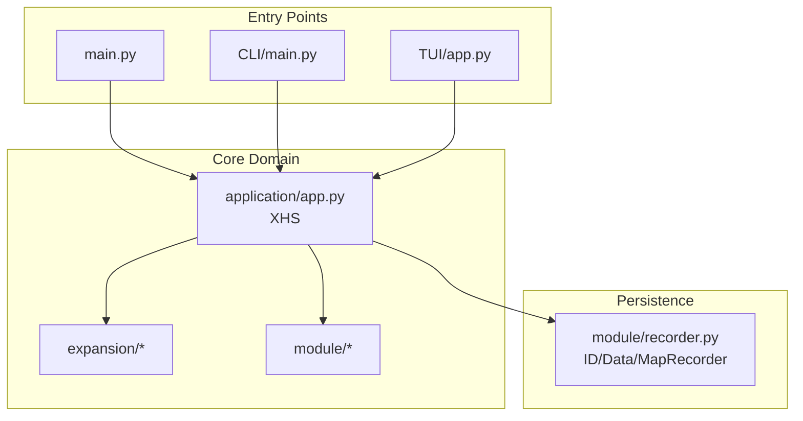

**Diagram sources**
- [main.py:1-60](file://main.py#L1-L60)
- [source/CLI/main.py:1-378](file://source/CLI/main.py#L1-L378)
- [source/TUI/app.py:1-126](file://source/TUI/app.py#L1-L126)
- [source/application/app.py:1-1000](file://source/application/app.py#L1-L1000)
- [source/module/recorder.py:1-192](file://source/module/recorder.py#L1-L192)
- [source/expansion/__init__.py:1-11](file://source/expansion/__init__.py#L1-L11)

**Section sources**
- [main.py:1-60](file://main.py#L1-L60)
- [source/__init__.py:1-12](file://source/__init__.py#L1-L12)
- [source/application/__init__.py:1-4](file://source/application/__init__.py#L1-L4)
- [source/module/__init__.py:1-43](file://source/module/__init__.py#L1-L43)
- [source/expansion/__init__.py:1-11](file://source/expansion/__init__.py#L1-L11)

## Core Components
- XHS (Application): Central orchestrator implementing a singleton pattern via a private instance cache. It manages extraction, HTML parsing, data conversion, download dispatch, naming, persistence, and clipboard monitoring.
- Settings: Configuration loader/updater with compatibility checks and migration.
- Manager: Runtime configuration, client creation, proxy validation, naming filters, and file operations.
- Recorder: SQLite-backed persistence for download records, data logs, and author mapping.
- Mapping: Author-archive-aware renaming and file/folder maintenance.
- Tools: Retry decorators, logging wrapper, wait-time generation, and sleep utilities.
- Static: Versioning, constants, headers, and supported file signatures.
- CLI/TUI: User interfaces that instantiate XHS with configured parameters.

Key design patterns:
- Singleton: XHS ensures a single runtime instance.
- Factory: Manager constructs HTTP clients and applies configuration.
- Observer: Clipboard monitoring watches for new URLs and queues downloads.

**Section sources**
- [source/application/app.py:98-194](file://source/application/app.py#L98-L194)
- [source/module/settings.py:10-124](file://source/module/settings.py#L10-L124)
- [source/module/manager.py:28-308](file://source/module/manager.py#L28-L308)
- [source/module/recorder.py:13-192](file://source/module/recorder.py#L13-L192)
- [source/module/mapping.py:16-217](file://source/module/mapping.py#L16-L217)
- [source/module/tools.py:13-64](file://source/module/tools.py#L13-L64)
- [source/module/static.py:1-73](file://source/module/static.py#L1-L73)
- [source/CLI/main.py:39-378](file://source/CLI/main.py#L39-L378)
- [source/TUI/app.py:18-126](file://source/TUI/app.py#L18-L126)

## Architecture Overview
The system is structured around a central application class that composes specialized modules. The CLI and TUI act as frontends that pass configuration into XHS. Persistence is handled by dedicated recorders. Expansion modules provide pluggable utilities.

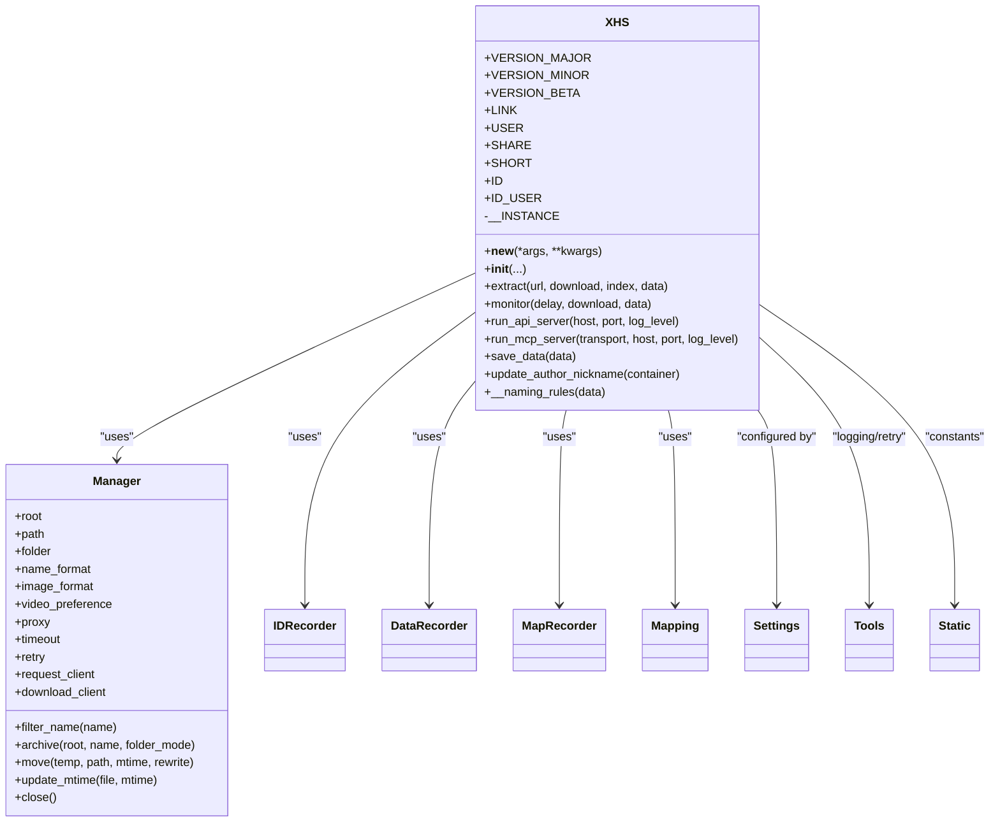

**Diagram sources**
- [source/application/app.py:98-194](file://source/application/app.py#L98-L194)
- [source/module/manager.py:28-308](file://source/module/manager.py#L28-L308)
- [source/module/recorder.py:13-192](file://source/module/recorder.py#L13-L192)
- [source/module/mapping.py:16-217](file://source/module/mapping.py#L16-L217)
- [source/module/settings.py:10-124](file://source/module/settings.py#L10-L124)
- [source/module/tools.py:13-64](file://source/module/tools.py#L13-L64)
- [source/module/static.py:1-73](file://source/module/static.py#L1-L73)

## Detailed Component Analysis

### Singleton Pattern Implementation (XHS)
XHS implements a singleton using a private instance cache to ensure only one runtime instance exists. This simplifies resource management and avoids duplication of persistent state.

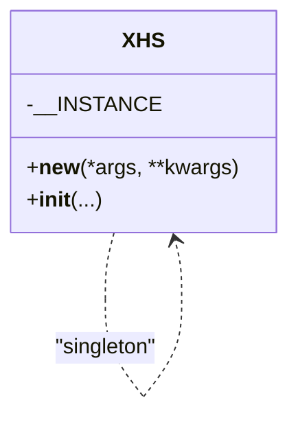

**Diagram sources**
- [source/application/app.py:108-114](file://source/application/app.py#L108-L114)

**Section sources**
- [source/application/app.py:108-114](file://source/application/app.py#L108-L114)

### Factory Pattern Usage (Manager)
Manager acts as a factory for HTTP clients and applies configuration such as proxies, timeouts, and headers. It validates and normalizes settings, ensuring consistent runtime behavior.

```mermaid
classDiagram
class Manager {
+__init__(root, path, folder, name_format, chunk, user_agent, cookie, proxy, timeout, retry, record_data, image_format, image_download, video_download, live_download, video_preference, download_record, folder_mode, author_archive, write_mtime, script_server, cleaner, print_object)
+filter_name(name)
+archive(root, name, folder_mode)
+move(temp, path, mtime, rewrite)
+update_mtime(file, mtime)
+close()
}
Manager --> "AsyncClient" : "creates"
```

**Diagram sources**
- [source/module/manager.py:53-132](file://source/module/manager.py#L53-L132)

**Section sources**
- [source/module/manager.py:53-132](file://source/module/manager.py#L53-L132)

### Observer Pattern for Clipboard Monitoring
XHS monitors the clipboard asynchronously, detecting new URLs and queuing extraction and download tasks. This implements an observer-like pattern with event coordination.

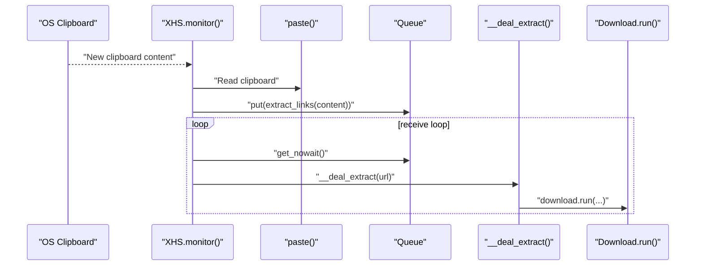

**Diagram sources**
- [source/application/app.py:603-651](file://source/application/app.py#L603-L651)
- [source/application/app.py:462-506](file://source/application/app.py#L462-L506)

**Section sources**
- [source/application/app.py:603-651](file://source/application/app.py#L603-L651)
- [source/application/app.py:462-506](file://source/application/app.py#L462-L506)

### Plugin Systems and Expansion Modules
Expansion modules provide pluggable capabilities:
- Cleaner: Name filtering and sanitization.
- Converter: HTML-to-structured data conversion.
- Namespace/truncate: String manipulation utilities.
- file_folder: Utilities for directory and file operations.

These are imported and composed by XHS to extend functionality without altering core logic.

**Section sources**
- [source/expansion/__init__.py:1-11](file://source/expansion/__init__.py#L1-L11)
- [source/application/app.py:26-32](file://source/application/app.py#L26-L32)

### Configuration-Driven Behavior Modification
Settings manage defaults, compatibility, and persistence. The Manager reads and normalizes settings, applying them to runtime behavior such as naming, download preferences, and proxy configuration.

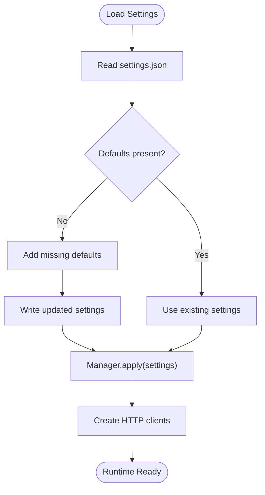

**Diagram sources**
- [source/module/settings.py:52-124](file://source/module/settings.py#L52-L124)
- [source/module/manager.py:53-132](file://source/module/manager.py#L53-L132)

**Section sources**
- [source/module/settings.py:52-124](file://source/module/settings.py#L52-L124)
- [source/module/manager.py:53-132](file://source/module/manager.py#L53-L132)

### Custom Naming Formats
XHS supports configurable naming via a format string. The naming rules engine resolves placeholders (e.g., publish time, title, author nickname) and applies sanitization and beautification.

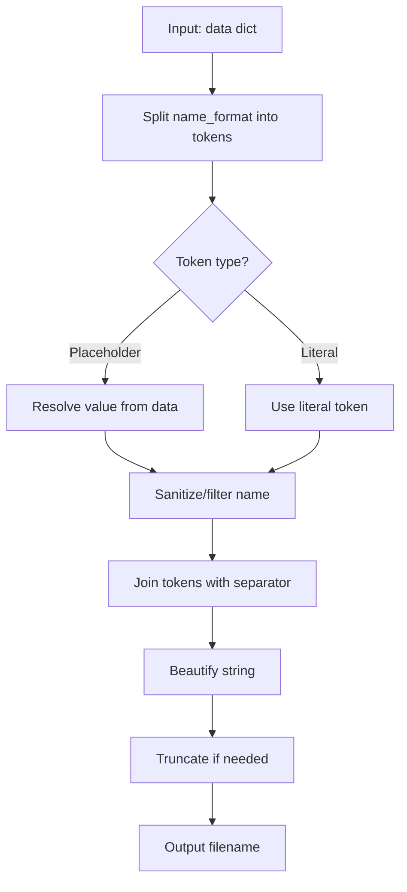

**Diagram sources**
- [source/application/app.py:566-601](file://source/application/app.py#L566-L601)

**Section sources**
- [source/application/app.py:566-601](file://source/application/app.py#L566-L601)

### Extending Download Strategies and File Format Support
To add a new file format or strategy:
- Extend supported formats in Manager’s image/video preference handling.
- Add new mapping entries in static file signatures for detection.
- Introduce new extractor logic in the appropriate module (Image/Video) and wire it into the extraction pipeline.
- Update naming rules and converters as needed.

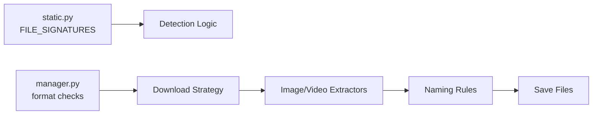

**Diagram sources**
- [source/module/static.py:39-70](file://source/module/static.py#L39-L70)
- [source/module/manager.py:153-163](file://source/module/manager.py#L153-L163)
- [source/application/app.py:195-212](file://source/application/app.py#L195-L212)

**Section sources**
- [source/module/static.py:39-70](file://source/module/static.py#L39-L70)
- [source/module/manager.py:153-163](file://source/module/manager.py#L153-L163)
- [source/application/app.py:195-212](file://source/application/app.py#L195-L212)

### Adding New Interface Types
To support new interface types (e.g., new endpoints or protocols):
- Define request handlers and routes in the application module.
- Add route registration and response models.
- Integrate with the extraction pipeline and persistence layers.

```mermaid
sequenceDiagram
participant Client as "Client"
participant API as "FastAPI"
participant XHS as "XHS"
participant Recorder as "Recorders"
Client->>API : "POST /xhs/detail"
API->>XHS : "extract_cli(url, download, index, data)"
XHS->>Recorder : "save_data(...)"
XHS-->>API : "ExtractData"
API-->>Client : "JSON response"
```

**Diagram sources**
- [source/application/app.py:706-757](file://source/application/app.py#L706-L757)
- [source/module/model.py:4-17](file://source/module/model.py#L4-L17)

**Section sources**
- [source/application/app.py:706-757](file://source/application/app.py#L706-L757)
- [source/module/model.py:4-17](file://source/module/model.py#L4-L17)

### API and MCP Servers
XHS exposes:
- FastAPI server with a detail endpoint returning structured data and optional downloads.
- MCP server with two tools: get_detail_data and download_detail.

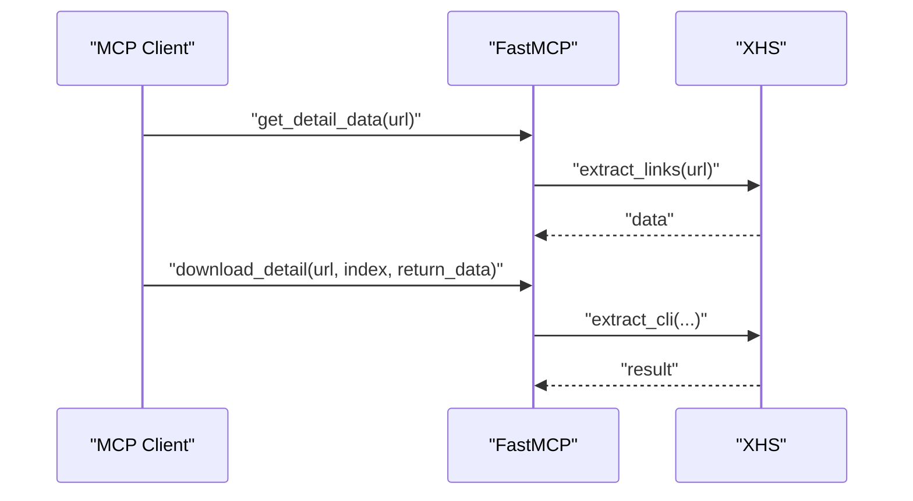

**Diagram sources**
- [source/application/app.py:758-800](file://source/application/app.py#L758-L800)
- [source/application/app.py:796-800](file://source/application/app.py#L796-L800)

**Section sources**
- [source/application/app.py:758-800](file://source/application/app.py#L758-L800)
- [source/application/app.py:796-800](file://source/application/app.py#L796-L800)

### MVC-Like Separation of Concerns
- Model: Settings, Recorder models, Static constants, Pydantic models for API.
- View: CLI and TUI screens and panels.
- Controller: XHS orchestrates requests, delegates to modules, and manages lifecycle.

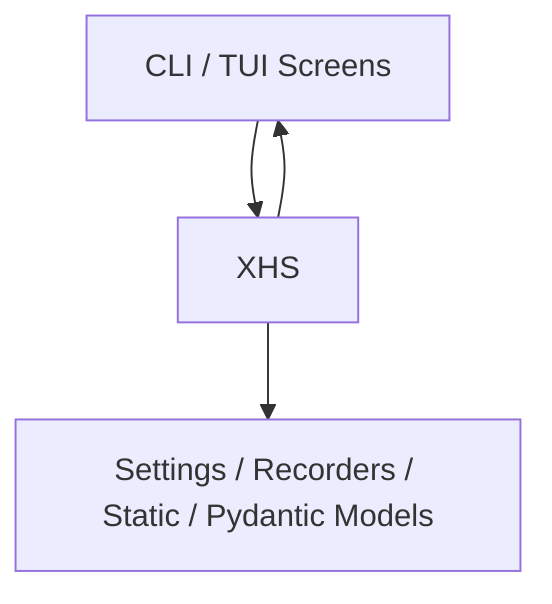

[No sources needed since this diagram shows conceptual workflow, not actual code structure]

## Dependency Analysis
The core dependencies are:
- XHS depends on Manager, Recorder, Mapping, Tools, Static, and expansion modules.
- CLI/TUI depend on Settings and XHS.
- Expansion modules are imported and used by XHS.

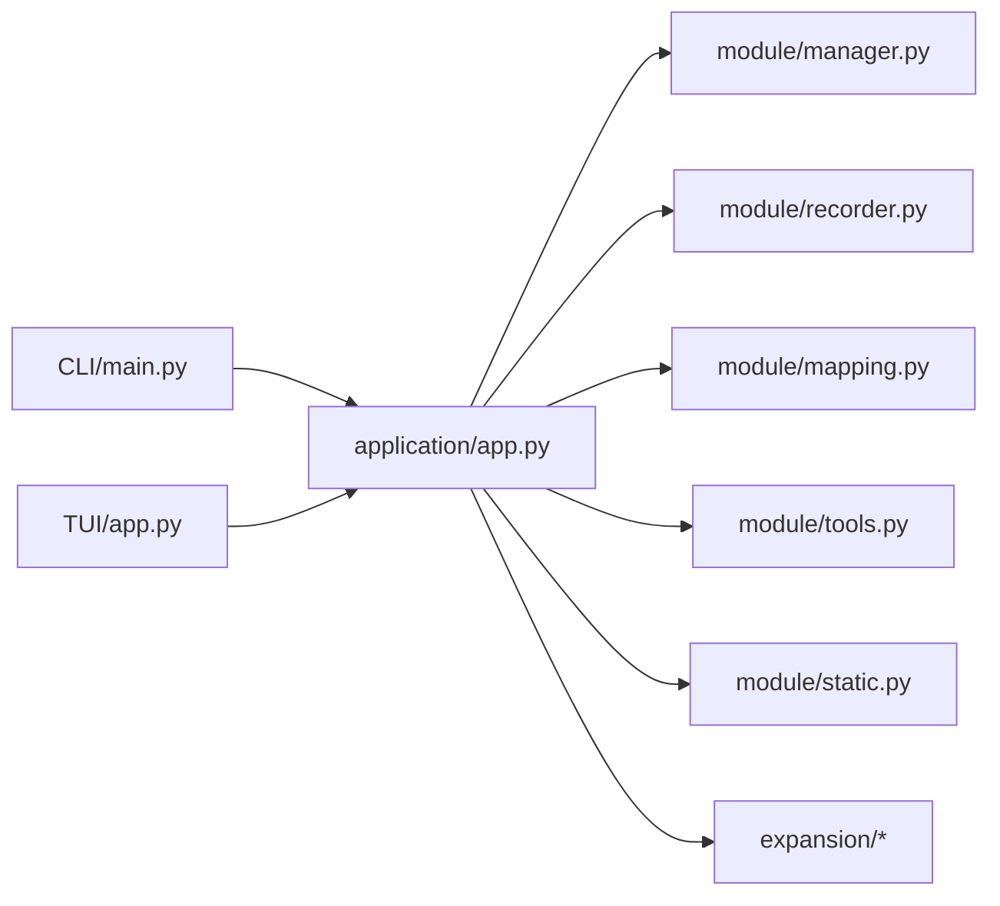

**Diagram sources**
- [source/CLI/main.py:39-60](file://source/CLI/main.py#L39-L60)
- [source/TUI/app.py:18-41](file://source/TUI/app.py#L18-L41)
- [source/application/app.py:147-194](file://source/application/app.py#L147-L194)
- [source/module/manager.py:28-308](file://source/module/manager.py#L28-L308)
- [source/module/recorder.py:13-192](file://source/module/recorder.py#L13-L192)
- [source/module/mapping.py:16-217](file://source/module/mapping.py#L16-L217)
- [source/module/tools.py:13-64](file://source/module/tools.py#L13-L64)
- [source/module/static.py:1-73](file://source/module/static.py#L1-L73)
- [source/expansion/__init__.py:1-11](file://source/expansion/__init__.py#L1-L11)

**Section sources**
- [source/CLI/main.py:39-60](file://source/CLI/main.py#L39-L60)
- [source/TUI/app.py:18-41](file://source/TUI/app.py#L18-L41)
- [source/application/app.py:147-194](file://source/application/app.py#L147-L194)
- [source/module/manager.py:28-308](file://source/module/manager.py#L28-L308)
- [source/module/recorder.py:13-192](file://source/module/recorder.py#L13-L192)
- [source/module/mapping.py:16-217](file://source/module/mapping.py#L16-L217)
- [source/module/tools.py:13-64](file://source/module/tools.py#L13-L64)
- [source/module/static.py:1-73](file://source/module/static.py#L1-L73)
- [source/expansion/__init__.py:1-11](file://source/expansion/__init__.py#L1-L11)

## Performance Considerations
- Concurrency and workers: The static constant defines a maximum worker limit suitable for balancing throughput and resource usage.
- Logging and UI updates: Excessive logging or UI refreshes can impact performance; use batching and throttling where applicable.
- Network I/O: Tune chunk size, timeout, and retry parameters via Settings and Manager to balance reliability and speed.
- Disk I/O: Minimize frequent renames and writes; batch operations when possible.
- Proxy validation: Validate proxies early to avoid repeated failures during network calls.

**Section sources**
- [source/module/static.py:69-70](file://source/module/static.py#L69-L70)
- [source/module/manager.py:225-259](file://source/module/manager.py#L225-L259)

## Troubleshooting Guide
Common issues and remedies:
- Clipboard monitoring stops unexpectedly: Verify clipboard events and queue processing loops; ensure event signaling and queue draining are functioning.
- Download records not persisting: Confirm recorder switches and database connectivity; check file paths and permissions.
- Naming conflicts: Adjust name_format or sanitization rules; ensure uniqueness and safe filesystem characters.
- Proxy failures: Validate proxy settings and test connectivity; review warning messages printed during initialization.
- API/MCP server errors: Inspect route handlers and parameter validation; confirm JSON serialization and response models.

**Section sources**
- [source/application/app.py:603-651](file://source/application/app.py#L603-L651)
- [source/module/recorder.py:13-192](file://source/module/recorder.py#L13-L192)
- [source/module/manager.py:225-259](file://source/module/manager.py#L225-L259)
- [source/module/model.py:4-17](file://source/module/model.py#L4-L17)

## Conclusion
XHS-Downloader’s architecture cleanly separates concerns across modules, enabling extensibility through configuration, plugins, and modular composition. The singleton, factory, and observer patterns provide robust runtime behavior. By leveraging Settings, Manager, and Recorder, developers can customize behavior, add new strategies, and extend support with minimal core changes while maintaining compatibility.

## Appendices

### Development Environment Setup
- Install dependencies from requirements and project configuration.
- Run the CLI or TUI entry points; configure via settings.json or CLI flags.
- Use Dockerfile for containerized deployment if desired.

**Section sources**
- [main.py:45-60](file://main.py#L45-L60)
- [source/CLI/main.py:354-378](file://source/CLI/main.py#L354-L378)
- [source/TUI/app.py:22-41](file://source/TUI/app.py#L22-L41)

### Testing Procedures
- Unit tests for individual modules (e.g., Settings, Manager, Mapping) can validate configuration, normalization, and file operations.
- Integration tests can exercise extraction, download, and persistence flows end-to-end.
- Manual verification of clipboard monitoring, API/MCP endpoints, and UI interactions.

[No sources needed since this section provides general guidance]

### Contribution Guidelines
- Follow existing code style and structure.
- Keep changes localized to modules or expansion points.
- Add or update tests for new functionality.
- Document configuration options and behavior changes.

[No sources needed since this section provides general guidance]

### Code Standards
- Use descriptive variable names and consistent casing.
- Prefer composition and configuration over hard-coded behavior.
- Encapsulate I/O and external dependencies behind modules.

[No sources needed since this section provides general guidance]

### Debugging Techniques
- Enable verbose logging and inspect warnings/errors.
- Use breakpoints in extraction and download stages.
- Validate settings and environment variables.

**Section sources**
- [source/module/tools.py:42-52](file://source/module/tools.py#L42-L52)
- [source/module/manager.py:261-265](file://source/module/manager.py#L261-L265)

### Performance Profiling Approaches
- Profile extraction and download bottlenecks using async timing measurements.
- Monitor network latency and disk throughput.
- Tune chunk size, worker limits, and retry policies.

[No sources needed since this section provides general guidance]