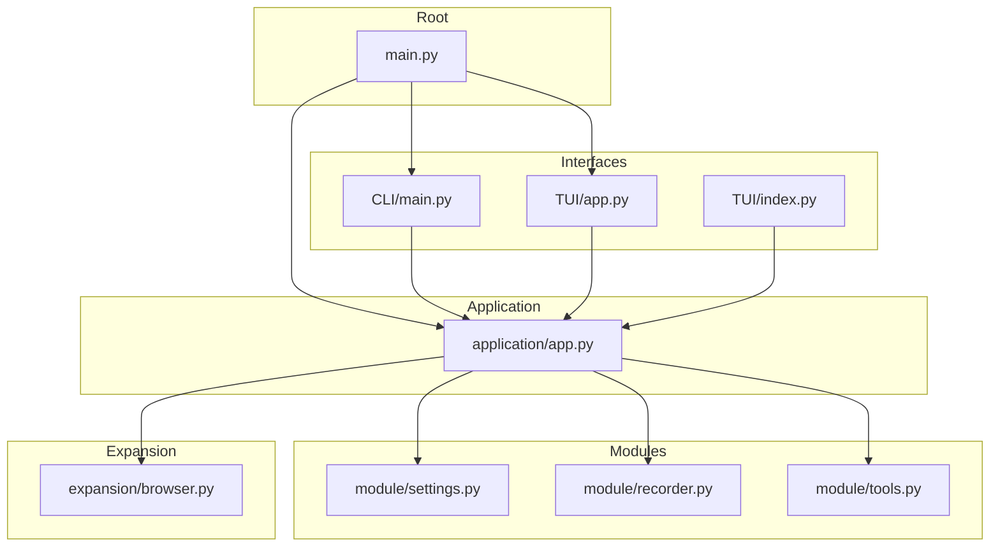
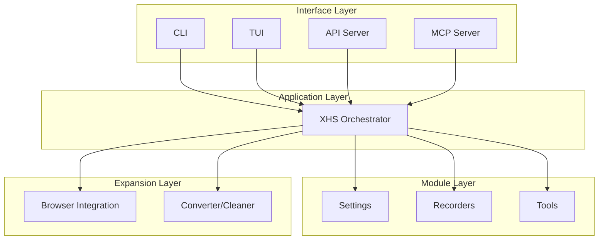
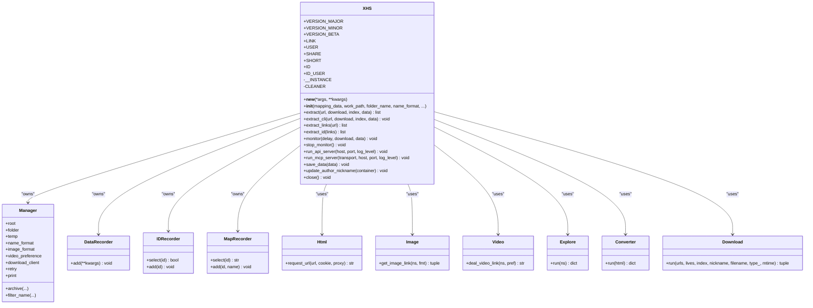
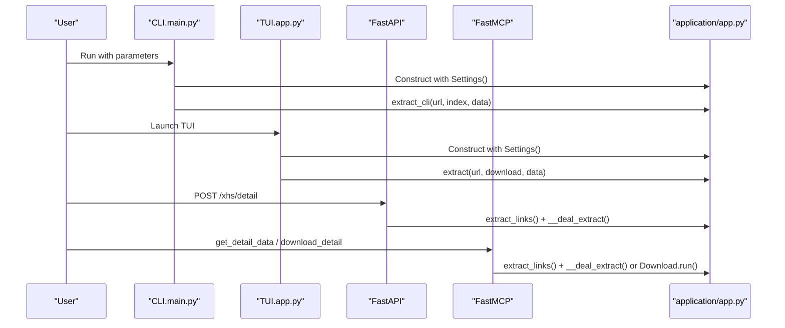
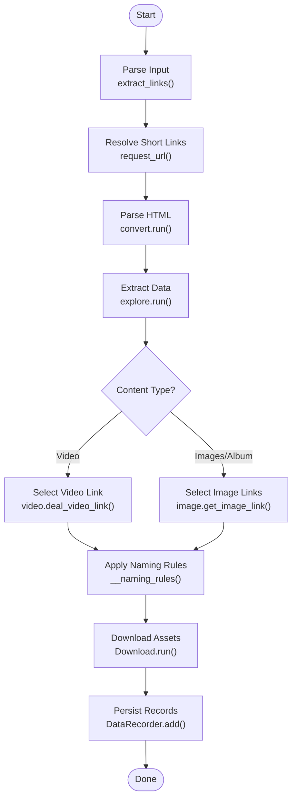
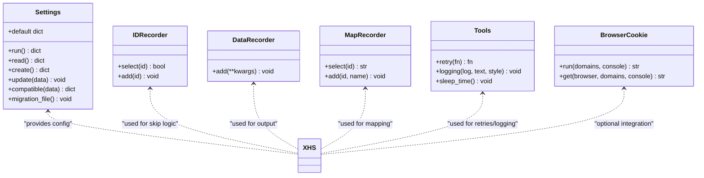
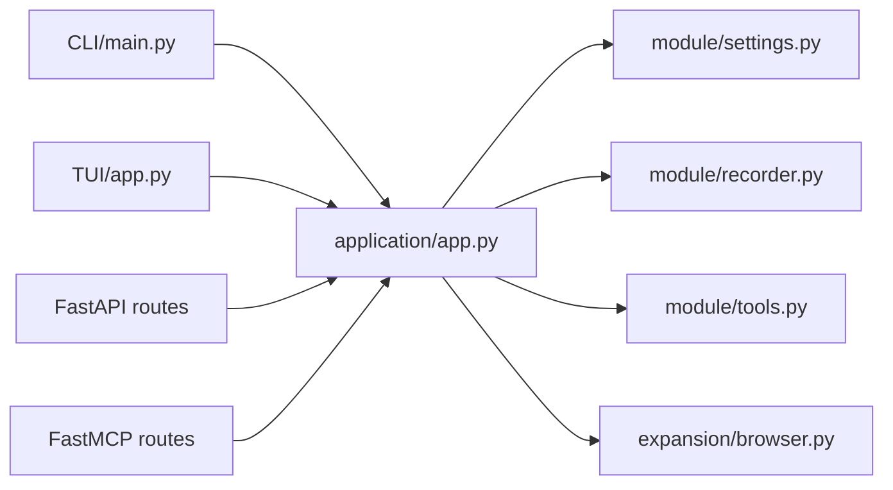

# Architecture Overview

<cite>
**Referenced Files in This Document**
- [main.py](file://main.py)
- [source/__init__.py](file://source/__init__.py)
- [source/application/__init__.py](file://source/application/__init__.py)
- [source/application/app.py](file://source/application/app.py)
- [source/CLI/main.py](file://source/CLI/main.py)
- [source/CLI/__init__.py](file://source/CLI/__init__.py)
- [source/TUI/app.py](file://source/TUI/app.py)
- [source/TUI/index.py](file://source/TUI/index.py)
- [source/module/settings.py](file://source/module/settings.py)
- [source/module/recorder.py](file://source/module/recorder.py)
- [source/module/tools.py](file://source/module/tools.py)
- [source/expansion/browser.py](file://source/expansion/browser.py)
</cite>

## Table of Contents
1. [Introduction](#introduction)
2. [Project Structure](#project-structure)
3. [Core Components](#core-components)
4. [Architecture Overview](#architecture-overview)
5. [Detailed Component Analysis](#detailed-component-analysis)
6. [Dependency Analysis](#dependency-analysis)
7. [Performance Considerations](#performance-considerations)
8. [Troubleshooting Guide](#troubleshooting-guide)
9. [Conclusion](#conclusion)

## Introduction
This document describes the architecture of XHS-Downloader, a multi-interface downloader for Xiaohongshu (Little Red Book) content. The system follows a modular design centered around a single orchestrator class that encapsulates shared core functionality. Interfaces (CLI, TUI, API, MCP) depend on this orchestrator to provide independent user experiences while sharing the same extraction, processing, and download pipeline. The architecture emphasizes separation of concerns aligned with MVC-like patterns: the orchestrator acts as the controller, the module layer provides models and utilities, the expansion layer adds cross-cutting capabilities, and the application layer implements business logic.

## Project Structure
The repository is organized into distinct layers:
- Application layer: Orchestrator and business logic
- Module layer: Configuration, settings, models, recording, tools
- Expansion layer: Browser integration, file conversion, error handling, utilities
- Interface layer: CLI, TUI, API server, MCP server
- Root entry points: main.py and source package exports

**Diagram sources**
- [main.py:1-60](file://main.py#L1-L60)
- [source/CLI/main.py:1-378](file://source/CLI/main.py#L1-L378)
- [source/TUI/app.py:1-126](file://source/TUI/app.py#L1-L126)
- [source/TUI/index.py:1-153](file://source/TUI/index.py#L1-L153)
- [source/application/app.py:1-1000](file://source/application/app.py#L1-L1000)
- [source/module/settings.py:1-124](file://source/module/settings.py#L1-L124)
- [source/module/recorder.py:1-192](file://source/module/recorder.py#L1-L192)
- [source/module/tools.py:1-64](file://source/module/tools.py#L1-L64)
- [source/expansion/browser.py:1-120](file://source/expansion/browser.py#L1-L120)

**Section sources**
- [main.py:1-60](file://main.py#L1-L60)
- [source/__init__.py:1-12](file://source/__init__.py#L1-L12)
- [source/application/__init__.py:1-4](file://source/application/__init__.py#L1-L4)

## Core Components
- XHS orchestrator: Central controller managing extraction, processing, download, and output. Implements singleton pattern via a private instance and new method to ensure a single global state.
- Settings: Persistent configuration provider with defaults, compatibility, and migration.
- Recorders: ID, data, and mapping recorders for persistence and caching.
- Tools: Retry decorators, logging abstraction, and wait-time utilities.
- Expansion: Browser cookie integration, file conversion helpers, and cleanup utilities.
- Interfaces: CLI, TUI, API, and MCP servers instantiate XHS with settings and delegate user actions to the orchestrator.

Key design patterns:
- Singleton: Global state management for shared resources and configuration.
- Factory: Interfaces construct XHS instances with runtime parameters.
- Observer: Clipboard monitoring watches system clipboard and triggers processing.
- Strategy: Download strategy selection per content type and preferences.

**Section sources**
- [source/application/app.py:98-194](file://source/application/app.py#L98-L194)
- [source/module/settings.py:10-124](file://source/module/settings.py#L10-L124)
- [source/module/recorder.py:13-192](file://source/module/recorder.py#L13-L192)
- [source/module/tools.py:13-64](file://source/module/tools.py#L13-L64)
- [source/expansion/browser.py:26-120](file://source/expansion/browser.py#L26-L120)
- [source/CLI/main.py:39-111](file://source/CLI/main.py#L39-L111)
- [source/TUI/app.py:18-126](file://source/TUI/app.py#L18-L126)

## Architecture Overview
The system uses a layered architecture with clear separation of concerns:
- Central orchestrator (XHS) coordinates all operations.
- Module layer supplies configuration, models, persistence, and utilities.
- Expansion layer provides optional integrations and utilities.
- Interface layer exposes multiple entry points that share the same core.

**Diagram sources**
- [source/application/app.py:98-194](file://source/application/app.py#L98-L194)
- [source/CLI/main.py:39-111](file://source/CLI/main.py#L39-L111)
- [source/TUI/app.py:18-126](file://source/TUI/app.py#L18-L126)
- [source/module/settings.py:10-124](file://source/module/settings.py#L10-L124)
- [source/module/recorder.py:13-192](file://source/module/recorder.py#L13-L192)
- [source/module/tools.py:13-64](file://source/module/tools.py#L13-L64)
- [source/expansion/browser.py:26-120](file://source/expansion/browser.py#L26-L120)

## Detailed Component Analysis

### XHS Orchestrator (Singleton)
The XHS class is the central orchestrator implementing the singleton pattern. It initializes managers, recorders, converters, and downloaders, and exposes methods for extraction, processing, and download. It also hosts API and MCP endpoints and manages clipboard monitoring.

**Diagram sources**
- [source/application/app.py:98-194](file://source/application/app.py#L98-L194)
- [source/application/app.py:268-506](file://source/application/app.py#L268-L506)
- [source/application/app.py:685-804](file://source/application/app.py#L685-L804)
- [source/application/app.py:603-652](file://source/application/app.py#L603-L652)

**Section sources**
- [source/application/app.py:98-194](file://source/application/app.py#L98-L194)
- [source/application/app.py:268-506](file://source/application/app.py#L268-L506)
- [source/application/app.py:603-652](file://source/application/app.py#L603-L652)
- [source/application/app.py:685-804](file://source/application/app.py#L685-L804)

### Interface Layer: CLI, TUI, API, MCP
- CLI: Parses arguments, constructs XHS with settings, and runs extraction.
- TUI: Textual-based desktop app that composes screens and delegates actions to XHS.
- API: FastAPI server exposing endpoints to fetch data and trigger downloads.
- MCP: FastMCP server exposing tools to get detail data and download files.

**Diagram sources**
- [source/CLI/main.py:39-111](file://source/CLI/main.py#L39-L111)
- [source/TUI/app.py:18-126](file://source/TUI/app.py#L18-L126)
- [source/application/app.py:685-804](file://source/application/app.py#L685-L804)
- [source/application/app.py:268-506](file://source/application/app.py#L268-L506)

**Section sources**
- [source/CLI/main.py:39-111](file://source/CLI/main.py#L39-L111)
- [source/TUI/app.py:18-126](file://source/TUI/app.py#L18-L126)
- [source/application/app.py:685-804](file://source/application/app.py#L685-L804)

### Data Flow Pathways
End-to-end flow from input to output:
1. Input processing: Extract URLs from user input or clipboard.
2. Extraction: Resolve short links, classify content, and parse HTML to structured data.
3. Processing pipeline: Determine download strategy (video vs images), apply naming rules, and decide skip/download.
4. Download execution: Concurrently download assets respecting preferences and existing files.
5. Output generation: Persist records, update caches, and notify results.

**Diagram sources**
- [source/application/app.py:358-384](file://source/application/app.py#L358-L384)
- [source/application/app.py:386-415](file://source/application/app.py#L386-L415)
- [source/application/app.py:417-460](file://source/application/app.py#L417-L460)
- [source/application/app.py:566-601](file://source/application/app.py#L566-L601)
- [source/application/app.py:213-250](file://source/application/app.py#L213-L250)

**Section sources**
- [source/application/app.py:358-384](file://source/application/app.py#L358-L384)
- [source/application/app.py:386-415](file://source/application/app.py#L386-L415)
- [source/application/app.py:417-460](file://source/application/app.py#L417-L460)
- [source/application/app.py:566-601](file://source/application/app.py#L566-L601)
- [source/application/app.py:213-250](file://source/application/app.py#L213-L250)

### Patterns and Implementation Details
- Singleton pattern: Ensures a single global instance of XHS for shared state and resources.
- Factory pattern: Interfaces construct XHS with runtime parameters derived from Settings.
- Observer pattern: Clipboard monitoring continuously checks the system clipboard and queues URLs for processing.
- Strategy pattern: Download strategy varies by content type and user preferences (e.g., video preference, image format).

**Diagram sources**
- [source/module/settings.py:10-124](file://source/module/settings.py#L10-L124)
- [source/module/recorder.py:13-192](file://source/module/recorder.py#L13-L192)
- [source/module/tools.py:13-64](file://source/module/tools.py#L13-L64)
- [source/expansion/browser.py:26-120](file://source/expansion/browser.py#L26-L120)
- [source/application/app.py:98-194](file://source/application/app.py#L98-L194)

**Section sources**
- [source/module/settings.py:10-124](file://source/module/settings.py#L10-L124)
- [source/module/recorder.py:13-192](file://source/module/recorder.py#L13-L192)
- [source/module/tools.py:13-64](file://source/module/tools.py#L13-L64)
- [source/expansion/browser.py:26-120](file://source/expansion/browser.py#L26-L120)
- [source/application/app.py:98-194](file://source/application/app.py#L98-L194)

## Dependency Analysis
The interfaces depend on the central XHS orchestrator, which depends on modules and expansion components. There is minimal coupling between interfaces; they share the same core through XHS.

**Diagram sources**
- [source/CLI/main.py:39-111](file://source/CLI/main.py#L39-L111)
- [source/TUI/app.py:18-126](file://source/TUI/app.py#L18-L126)
- [source/application/app.py:685-804](file://source/application/app.py#L685-L804)
- [source/module/settings.py:10-124](file://source/module/settings.py#L10-L124)
- [source/module/recorder.py:13-192](file://source/module/recorder.py#L13-L192)
- [source/module/tools.py:13-64](file://source/module/tools.py#L13-L64)
- [source/expansion/browser.py:26-120](file://source/expansion/browser.py#L26-L120)

**Section sources**
- [source/CLI/main.py:39-111](file://source/CLI/main.py#L39-L111)
- [source/TUI/app.py:18-126](file://source/TUI/app.py#L18-L126)
- [source/application/app.py:685-804](file://source/application/app.py#L685-L804)
- [source/module/settings.py:10-124](file://source/module/settings.py#L10-L124)
- [source/module/recorder.py:13-192](file://source/module/recorder.py#L13-L192)
- [source/module/tools.py:13-64](file://source/module/tools.py#L13-L64)
- [source/expansion/browser.py:26-120](file://source/expansion/browser.py#L26-L120)

## Performance Considerations
- Concurrency: Downloads use semaphores and gather to limit concurrent workers and improve throughput.
- Retries: Built-in retry decorators reduce transient failure impact.
- Caching: ID and mapping recorders prevent redundant processing and persist metadata.
- Naming and filtering: Cleaner utilities and naming rules optimize filesystem operations and avoid conflicts.

[No sources needed since this section provides general guidance]

## Troubleshooting Guide
- Clipboard monitoring stops unexpectedly: Ensure the event flag is cleared and clipboard content differs from cache.
- Duplicate downloads: Verify skip logic using IDRecorder and download_record setting.
- API/MCP errors: Confirm route handlers and parameter parsing; check logging output.
- Browser cookie integration: Platform support varies; confirm supported browsers and permissions.

**Section sources**
- [source/application/app.py:603-652](file://source/application/app.py#L603-L652)
- [source/module/recorder.py:13-79](file://source/module/recorder.py#L13-L79)
- [source/expansion/browser.py:26-120](file://source/expansion/browser.py#L26-L120)

## Conclusion
XHS-Downloader’s architecture cleanly separates concerns across layers while enabling multiple user interfaces to share a unified core. The singleton orchestrator centralizes state and logic, while modules and expansion components provide reusable utilities. The design supports scalability, maintainability, and extensibility, with clear data flow and observable behavior across all interfaces.