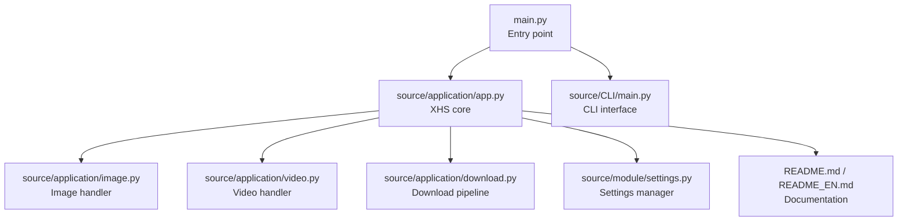
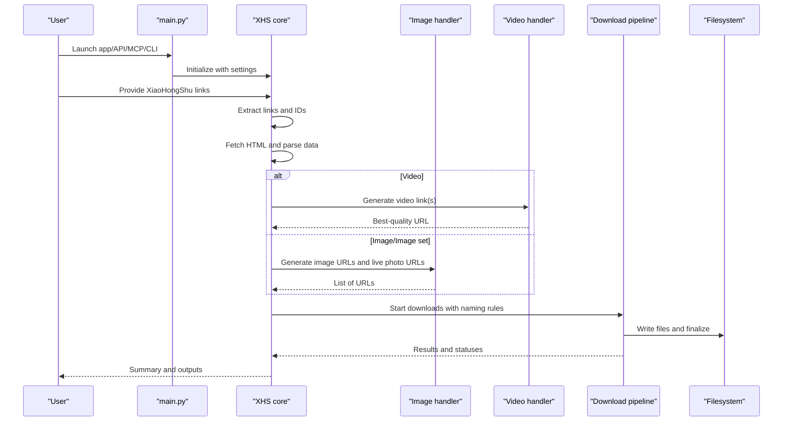
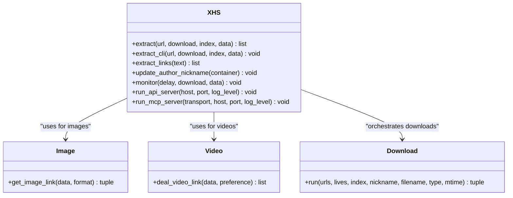
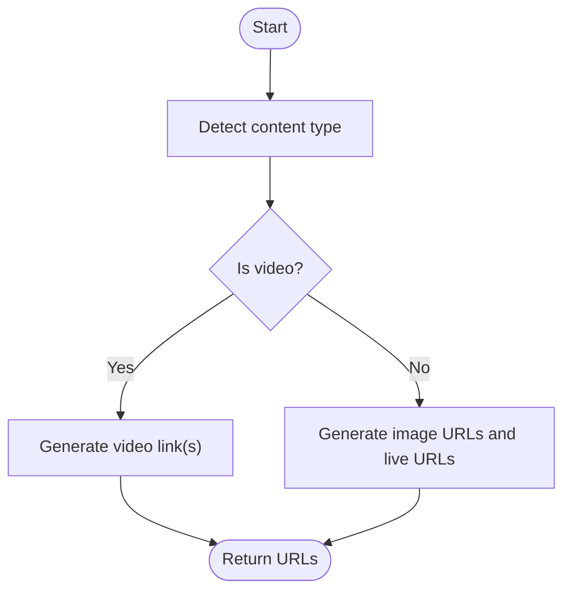
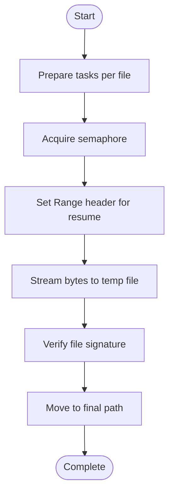
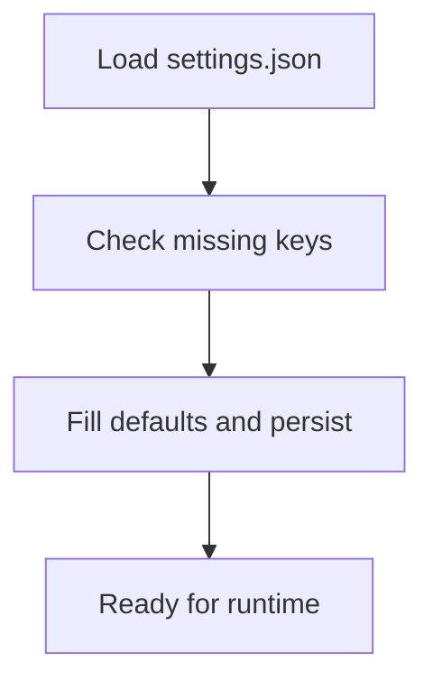
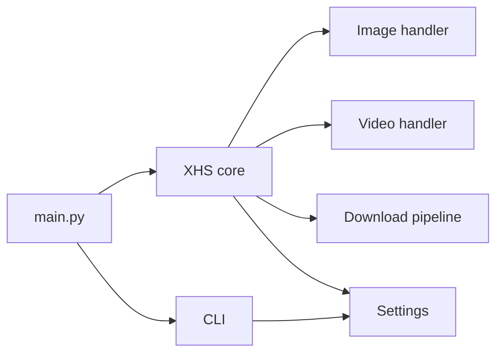

# Introduction

<cite>
**Referenced Files in This Document**
- [README.md](file://README.md)
- [README_EN.md](file://README_EN.md)
- [main.py](file://main.py)
- [source/application/app.py](file://source/application/app.py)
- [source/application/download.py](file://source/application/download.py)
- [source/application/image.py](file://source/application/image.py)
- [source/application/video.py](file://source/application/video.py)
- [source/CLI/main.py](file://source/CLI/main.py)
- [source/module/settings.py](file://source/module/settings.py)
- [example.py](file://example.py)
</cite>

## Table of Contents
1. [Introduction](#introduction)
2. [Project Structure](#project-structure)
3. [Core Components](#core-components)
4. [Architecture Overview](#architecture-overview)
5. [Detailed Component Analysis](#detailed-component-analysis)
6. [Dependency Analysis](#dependency-analysis)
7. [Performance Considerations](#performance-considerations)
8. [Troubleshooting Guide](#troubleshooting-guide)
9. [Conclusion](#conclusion)

## Introduction
XHS-Downloader is a comprehensive tool designed to extract and download content from the XiaoHongShu (Little Red Book) platform. The project’s primary purpose is to help users collect, organize, and download various types of content (videos, images, animated images) from XiaoHongShu profiles, collections, likes, albums, and search results. It provides multiple operational modes to suit different user needs, from quick downloads via a graphical interface to advanced automation through APIs and MCP servers.

Why it exists:
- XiaoHongShu content is often valuable for creators, educators, researchers, and archivists who need to preserve or reuse media assets.
- The platform does not offer a native bulk export feature for user-generated content, leaving users to rely on manual or semi-automated methods.
- XHS-Downloader fills this gap by automating extraction and download workflows, reducing repetitive tasks and minimizing human error.

What it solves:
- Extracting and downloading content from XiaoHongShu profiles, collections, likes, albums, and search results.
- Handling multiple content types (videos, images, animated images) with intelligent file-type detection and flexible naming rules.
- Providing persistent storage of metadata and download records to avoid duplicates and streamline organization.
- Supporting both GUI-driven and headless operation, including server modes for integration into larger workflows.

Terminology used consistently with the codebase:
- XHS: The project’s shorthand name.
- 小红书 (XiaoHongShu): The platform’s name.
- 作品 (Works): The term used for individual posts or content items on the platform.

Practical scenarios:
- Collecting favorite posts: Paste multiple XiaoHongShu links, and the tool extracts metadata and downloads files automatically.
- Archiving an author’s content: Configure author archive mode to group all works by a specific creator into a dedicated folder.
- Batch downloading educational materials: Use the CLI to specify indices for targeted images within text-and-image works, or download entire videos and image sets.

Approach to content types and formats:
- Videos: Extracted with configurable preference for resolution, bitrate, or file size, then downloaded to MP4.
- Images and image sets: Downloaded in customizable formats (PNG, WEBP, JPEG, HEIC/AUTO) with optional animated image support.
- Animated images (live photos): Optionally included alongside still images when enabled.

## Project Structure
At a high level, the project is organized around:
- Application entry points: main.py orchestrates runtime modes (GUI, API, MCP, CLI).
- Core extraction and download engine: source/application/app.py coordinates HTML parsing, data extraction, and file downloads.
- Content-type handlers: source/application/image.py and source/application/video.py manage URLs for images and videos.
- Download pipeline: source/application/download.py handles concurrent downloads, resume logic, and file naming.
- Configuration and settings: source/module/settings.py manages defaults and persistence.
- CLI: source/CLI/main.py exposes a command-line interface for automation and scripting.
- Examples and documentation: example.py demonstrates programmatic usage; README.md/README_EN.md provide user-facing guidance.

**Diagram sources**
- [main.py:45-60](file://main.py#L45-L60)
- [source/application/app.py:98-194](file://source/application/app.py#L98-L194)
- [source/application/image.py:8-67](file://source/application/image.py#L8-L67)
- [source/application/video.py:7-54](file://source/application/video.py#L7-L54)
- [source/application/download.py:30-123](file://source/application/download.py#L30-L123)
- [source/module/settings.py:10-124](file://source/module/settings.py#L10-L124)
- [source/CLI/main.py:39-113](file://source/CLI/main.py#L39-L113)
- [README.md:20-739](file://README.md#L20-L739)

**Section sources**
- [README.md:20-739](file://README.md#L20-L739)
- [README_EN.md:20-739](file://README_EN.md#L20-L739)
- [main.py:45-60](file://main.py#L45-L60)
- [source/application/app.py:98-194](file://source/application/app.py#L98-L194)
- [source/CLI/main.py:39-113](file://source/CLI/main.py#L39-L113)

## Core Components
- XHS core engine: Central class that parses links, extracts metadata, selects download URLs based on content type, and triggers downloads. It integrates with settings, naming rules, and recording mechanisms.
- Image handler: Generates image URLs from tokens and supports fixed-format or auto-format selection.
- Video handler: Chooses the optimal video stream based on user preference (resolution, bitrate, size) and formats CDN URLs.
- Download pipeline: Manages concurrency, resume capability, file existence checks, and final file placement with correct extensions.
- Settings manager: Provides default configuration, reads/writes settings.json, and ensures backward compatibility.
- CLI: Offers a rich set of parameters for automation, including index selection for targeted images and configuration overrides.

**Section sources**
- [source/application/app.py:98-194](file://source/application/app.py#L98-L194)
- [source/application/image.py:8-67](file://source/application/image.py#L8-L67)
- [source/application/video.py:7-54](file://source/application/video.py#L7-L54)
- [source/application/download.py:30-123](file://source/application/download.py#L30-L123)
- [source/module/settings.py:10-124](file://source/module/settings.py#L10-L124)
- [source/CLI/main.py:39-113](file://source/CLI/main.py#L39-L113)

## Architecture Overview
The system follows a layered architecture:
- Entry layer: main.py routes to GUI, API, MCP, or CLI modes.
- Application layer: XHS orchestrates extraction, data mapping, and downloads.
- Content-type handlers: Image and Video classes encapsulate URL generation logic.
- Download layer: Download class performs concurrent, resumable downloads and applies naming rules.
- Persistence layer: Settings and recorders manage configuration and download history.

**Diagram sources**
- [main.py:45-60](file://main.py#L45-L60)
- [source/application/app.py:268-506](file://source/application/app.py#L268-L506)
- [source/application/image.py:10-38](file://source/application/image.py#L10-L38)
- [source/application/video.py:15-47](file://source/application/video.py#L15-L47)
- [source/application/download.py:71-112](file://source/application/download.py#L71-L112)

## Detailed Component Analysis

### XHS Core Engine
The XHS class is the central orchestrator:
- Parses and normalizes links (including short links).
- Extracts metadata from parsed HTML and maps it to structured data.
- Determines content type and delegates URL generation to Image or Video handlers.
- Applies naming rules and author aliasing.
- Coordinates downloads and records outcomes.

**Diagram sources**
- [source/application/app.py:98-194](file://source/application/app.py#L98-L194)
- [source/application/image.py:8-67](file://source/application/image.py#L8-L67)
- [source/application/video.py:7-54](file://source/application/video.py#L7-L54)
- [source/application/download.py:30-123](file://source/application/download.py#L30-L123)

**Section sources**
- [source/application/app.py:98-194](file://source/application/app.py#L98-L194)
- [source/application/app.py:268-506](file://source/application/app.py#L268-L506)

### Image and Video Handlers
- Image handler:
  - Extracts tokens from raw URLs and generates fixed-format or auto-format URLs.
  - Produces both still image URLs and animated image URLs when available.
- Video handler:
  - Selects the best video stream based on user preference (resolution, bitrate, size).
  - Formats CDN URLs for direct download.

**Diagram sources**
- [source/application/image.py:10-38](file://source/application/image.py#L10-L38)
- [source/application/video.py:15-47](file://source/application/video.py#L15-L47)

**Section sources**
- [source/application/image.py:8-67](file://source/application/image.py#L8-L67)
- [source/application/video.py:7-54](file://source/application/video.py#L7-L54)

### Download Pipeline
The download pipeline:
- Respects configured concurrency limits.
- Implements resume-capable downloads using HTTP Range requests.
- Validates file signatures to ensure correct extensions.
- Moves temporary files to final destinations and optionally writes timestamps.

**Diagram sources**
- [source/application/download.py:196-268](file://source/application/download.py#L196-L268)
- [source/application/download.py:316-338](file://source/application/download.py#L316-L338)

**Section sources**
- [source/application/download.py:30-123](file://source/application/download.py#L30-L123)
- [source/application/download.py:196-268](file://source/application/download.py#L196-L268)

### Settings and Configuration
Settings are persisted in settings.json with sensible defaults and automatic compatibility checks. Users can override defaults via CLI or by editing the configuration file.

**Diagram sources**
- [source/module/settings.py:52-113](file://source/module/settings.py#L52-L113)

**Section sources**
- [source/module/settings.py:10-124](file://source/module/settings.py#L10-L124)

### Practical Scenarios
- Collecting favorite posts:
  - Paste multiple XiaoHongShu links; the tool extracts and downloads all supported files.
- Archiving an author’s content:
  - Enable author archive mode to group all works by a specific creator into a dedicated folder.
- Batch downloading educational materials:
  - Use CLI to specify indices for targeted images within text-and-image works, or download entire videos and image sets.

**Section sources**
- [README.md:20-739](file://README.md#L20-L739)
- [README_EN.md:20-739](file://README_EN.md#L20-L739)
- [example.py:9-74](file://example.py#L9-L74)

## Dependency Analysis
High-level dependencies:
- Entry point depends on XHS core and CLI.
- XHS core depends on image/video handlers, download pipeline, and settings.
- Download pipeline depends on HTTP client and filesystem utilities.
- CLI depends on Click and Settings for parameter handling.

**Diagram sources**
- [main.py:45-60](file://main.py#L45-L60)
- [source/application/app.py:98-194](file://source/application/app.py#L98-L194)
- [source/CLI/main.py:39-113](file://source/CLI/main.py#L39-L113)

**Section sources**
- [main.py:45-60](file://main.py#L45-L60)
- [source/application/app.py:98-194](file://source/application/app.py#L98-L194)
- [source/CLI/main.py:39-113](file://source/CLI/main.py#L39-L113)

## Performance Considerations
- Concurrency control: Downloads are limited by a semaphore to balance throughput and resource usage.
- Resume capability: Uses HTTP Range requests to continue interrupted downloads efficiently.
- Request delays: Built-in delays reduce server pressure and lower the risk of rate limiting.
- File signature verification: Ensures correct file extensions and avoids misclassification.

[No sources needed since this section provides general guidance]

## Troubleshooting Guide
Common issues and resolutions:
- Cookie configuration: If features behave unexpectedly, configure or update Cookie to improve access to higher-resolution content.
- Clipboard monitoring: Ensure clipboard monitoring is stopped by writing “close” to the clipboard or clicking the stop action.
- Download records: If files are skipped unexpectedly, check the download record database and remove entries if re-downloading is desired.
- Proxy and network: If downloads fail, verify proxy settings and network connectivity.

**Section sources**
- [README.md:78-79](file://README.md#L78-L79)
- [README.md:527-529](file://README.md#L527-L529)
- [source/application/app.py:603-651](file://source/application/app.py#L603-L651)

## Conclusion
XHS-Downloader provides a robust, extensible solution for extracting and downloading XiaoHongShu content across multiple content types. Its modular architecture supports diverse usage patterns—from quick GUI-based downloads to advanced server integrations—while maintaining strong controls for organization, naming, and persistence. Whether archiving an author’s work, curating educational materials, or automating batch downloads, the project offers practical tools and clear pathways for customization.