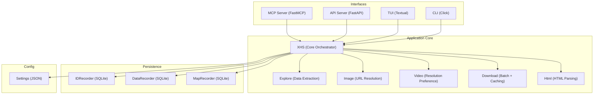
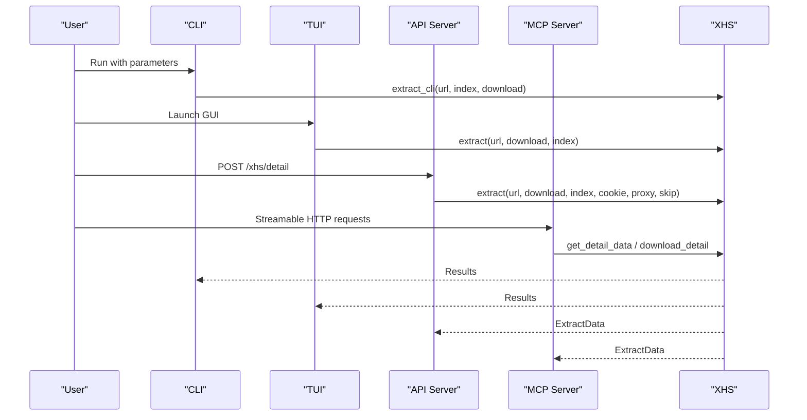
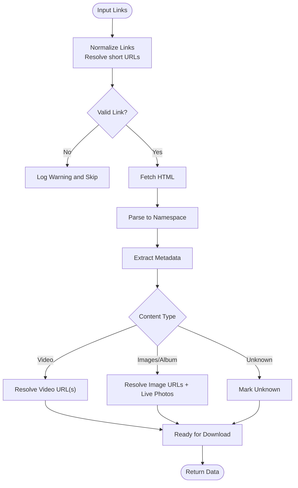
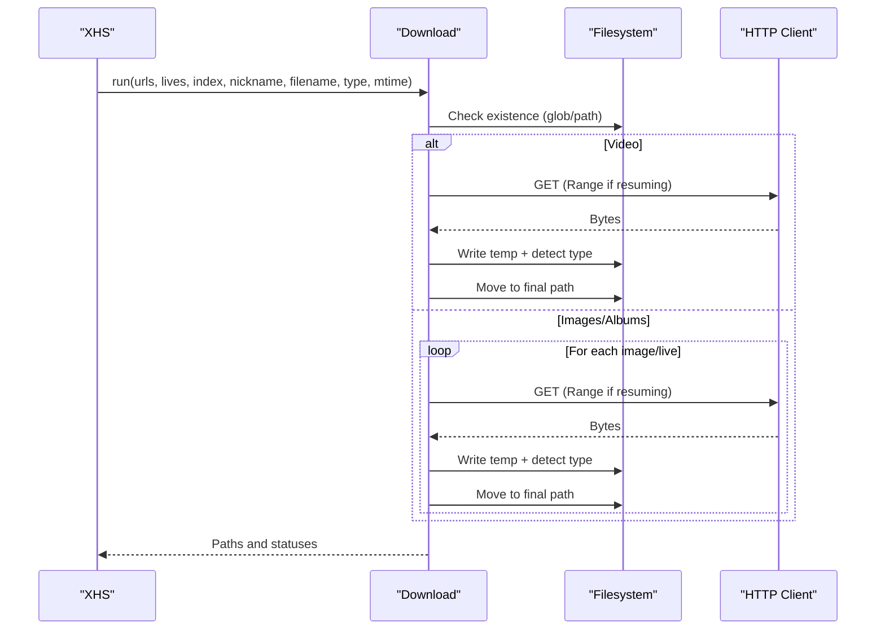
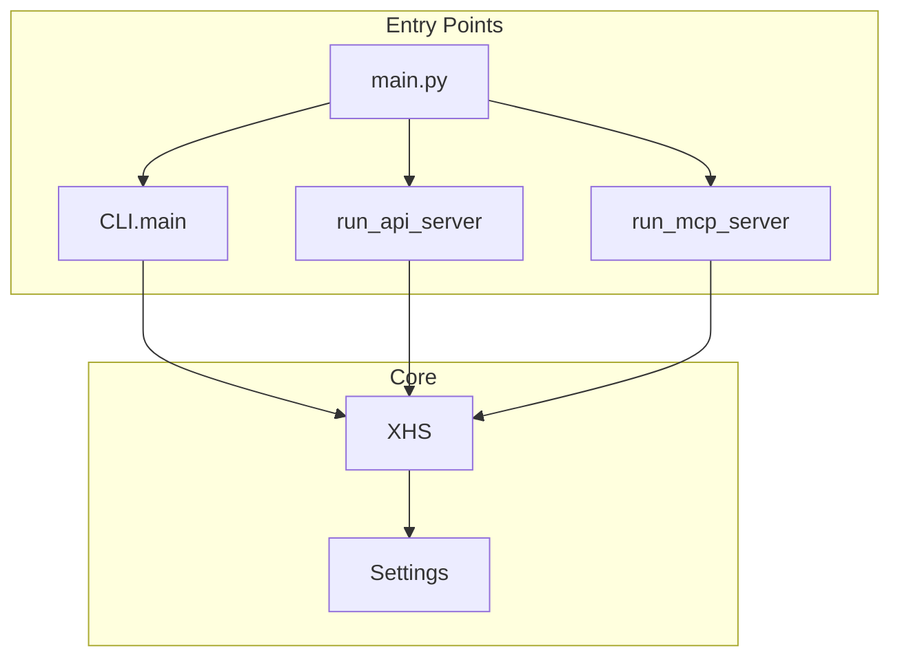
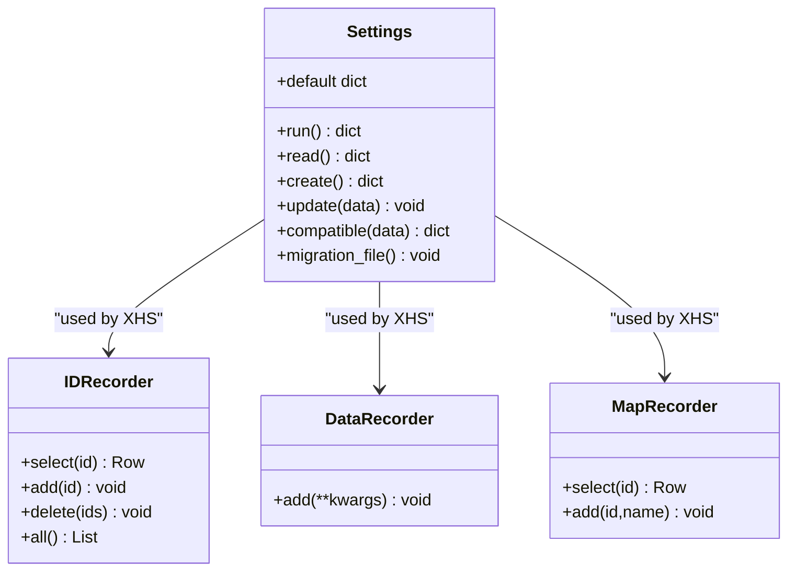
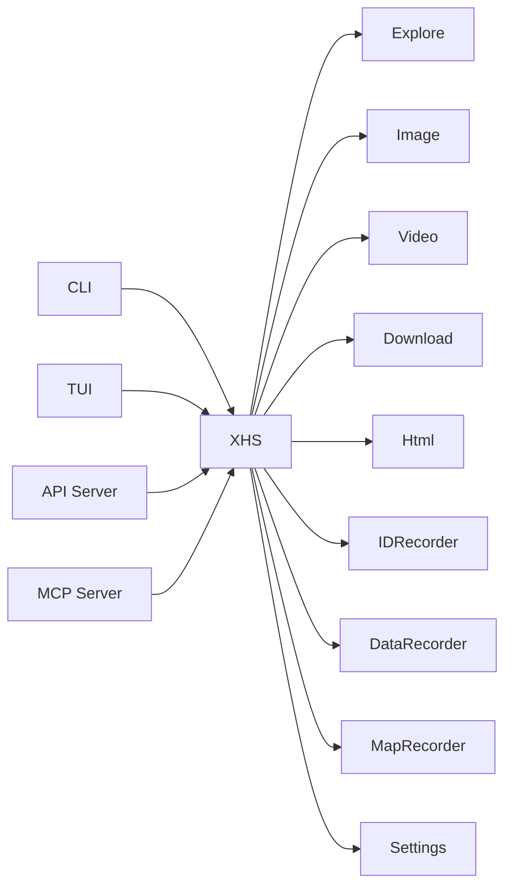

# Key Features

<cite>
**Referenced Files in This Document**
- [README.md](file://README.md)
- [main.py](file://main.py)
- [source/__init__.py](file://source/__init__.py)
- [source/application/app.py](file://source/application/app.py)
- [source/application/download.py](file://source/application/download.py)
- [source/application/explore.py](file://source/application/explore.py)
- [source/application/image.py](file://source/application/image.py)
- [source/application/user_posted.py](file://source/application/user_posted.py)
- [source/CLI/main.py](file://source/CLI/main.py)
- [source/TUI/app.py](file://source/TUI/app.py)
- [source/module/settings.py](file://source/module/settings.py)
- [source/module/model.py](file://source/module/model.py)
- [source/module/recorder.py](file://source/module/recorder.py)
</cite>

## Table of Contents
1. [Introduction](#introduction)
2. [Project Structure](#project-structure)
3. [Core Components](#core-components)
4. [Architecture Overview](#architecture-overview)
5. [Detailed Component Analysis](#detailed-component-analysis)
6. [Dependency Analysis](#dependency-analysis)
7. [Performance Considerations](#performance-considerations)
8. [Troubleshooting Guide](#troubleshooting-guide)
9. [Conclusion](#conclusion)

## Introduction
This document presents the key features of XHS-Downloader as a multi-interface desktop application. It covers extraction capabilities (profile, collections, search results, user links, and short URL resolution), download capabilities (video quality preference, image format conversion, live photos, and batch downloading with intelligent caching), and multiple interface support (Desktop GUI via Textual, Command Line Interface, API server, MCP server, and Docker deployment). The content balances conceptual overviews for beginners with technical details for experienced developers, using terminology consistent with the codebase.

## Project Structure
XHS-Downloader organizes functionality into modular packages:
- Application core: extraction, exploration, media handling, and download orchestration
- Interfaces: CLI, TUI (Textual), API server, MCP server
- Configuration and persistence: settings, SQLite-based recorders
- Expansion utilities: converters, cleaners, namespace helpers

**Diagram sources**
- [source/CLI/main.py:224-378](file://source/CLI/main.py#L224-L378)
- [source/TUI/app.py:18-126](file://source/TUI/app.py#L18-L126)
- [source/application/app.py:98-800](file://source/application/app.py#L98-L800)
- [source/application/explore.py:9-83](file://source/application/explore.py#L9-L83)
- [source/application/image.py:8-67](file://source/application/image.py#L8-L67)
- [source/application/download.py:30-338](file://source/application/download.py#L30-L338)
- [source/module/recorder.py:13-192](file://source/module/recorder.py#L13-L192)
- [source/module/settings.py:10-124](file://source/module/settings.py#L10-L124)

**Section sources**
- [README.md:22-57](file://README.md#L22-L57)
- [main.py:45-60](file://main.py#L45-L60)
- [source/__init__.py:1-12](file://source/__init__.py#L1-L12)

## Core Components
- XHS orchestrates extraction, data processing, download decisions, and persistence.
- Explore extracts structured metadata from parsed HTML containers.
- Image resolves image URLs and optional live photo streams.
- Download handles batch downloads, concurrency limits, resume-aware caching, and file-type detection.
- Settings manages persistent configuration with compatibility and migration.
- Recorders persist download records and mapping data to SQLite.

**Section sources**
- [source/application/app.py:98-800](file://source/application/app.py#L98-L800)
- [source/application/explore.py:9-83](file://source/application/explore.py#L9-L83)
- [source/application/image.py:8-67](file://source/application/image.py#L8-L67)
- [source/application/download.py:30-338](file://source/application/download.py#L30-L338)
- [source/module/settings.py:10-124](file://source/module/settings.py#L10-L124)
- [source/module/recorder.py:13-192](file://source/module/recorder.py#L13-L192)

## Architecture Overview
The application supports multiple entry points and servers, all converging on the XHS core for extraction and download.

**Diagram sources**
- [source/CLI/main.py:39-101](file://source/CLI/main.py#L39-L101)
- [source/TUI/app.py:18-126](file://source/TUI/app.py#L18-L126)
- [source/application/app.py:685-800](file://source/application/app.py#L685-L800)
- [source/module/model.py:4-17](file://source/module/model.py#L4-L17)

## Detailed Component Analysis

### Extraction Features
- Supported input formats:
  - Explore page, discovery item, user profile, and short links (xhslink.com).
- Short URL resolution:
  - Detects short links and resolves them to canonical URLs before extraction.
- Batch extraction:
  - Accepts multiple space-separated links; each is validated and normalized.
- Data extraction pipeline:
  - Fetches HTML, parses into a namespace, extracts metadata, classifies content type, and prepares download URLs.

**Diagram sources**
- [source/application/app.py:358-460](file://source/application/app.py#L358-L460)
- [source/application/explore.py:12-83](file://source/application/explore.py#L12-L83)
- [source/application/image.py:10-67](file://source/application/image.py#L10-L67)

Practical usage patterns:
- Single-link extraction with optional download and index selection.
- Multi-link extraction with automatic statistics reporting.
- Short link auto-resolution for convenience.

Benefits:
- Robust link normalization reduces manual preprocessing.
- Structured metadata enables downstream analytics and archiving.

**Section sources**
- [source/application/app.py:358-460](file://source/application/app.py#L358-L460)
- [source/application/explore.py:12-83](file://source/application/explore.py#L12-L83)
- [README.md:65-73](file://README.md#L65-L73)

### Download Capabilities
- Video downloading with quality preference:
  - Resolves preferred quality (resolution, bitrate, or size) and downloads a single MP4 stream.
- Image downloading with format conversion:
  - Converts images to requested formats (AUTO, PNG, WEBP, JPEG, HEIC) and supports selective indices for album images.
- Live photo downloading:
  - Optional MP4 live photo streams per image when enabled.
- Batch downloading with intelligent caching:
  - Concurrent downloads with semaphore-controlled workers.
  - Resume-aware caching via Range requests and temporary files.
  - Automatic file-type detection by content signatures.
  - Skips existing files and honors download records.

**Diagram sources**
- [source/application/download.py:71-338](file://source/application/download.py#L71-L338)

Practical usage patterns:
- Download a single video with preferred quality.
- Download selected images from an album by index.
- Enable live photo downloads for animated images.
- Use author archive mode to organize files by author.

Benefits:
- Efficient batch processing with concurrency limits.
- Reliable resume and type detection reduce retries and errors.

**Section sources**
- [source/application/download.py:71-338](file://source/application/download.py#L71-L338)
- [README.md:39-46](file://README.md#L39-L46)

### Multiple Interface Support
- Desktop GUI (Textual):
  - Full-featured TUI with screens for index, settings, records, and updates.
  - Integrates XHS core and settings management.
- Command Line Interface:
  - Rich Click-based CLI supporting parameters for paths, naming, formats, proxies, retries, and more.
  - Supports extracting multiple links and selecting image indices.
- API Server:
  - FastAPI endpoint /xhs/detail with typed parameters and response model.
  - Supports download toggle, index selection, cookie/proxy overrides, and skip behavior.
- MCP Server:
  - FastMCP server exposing two tools: get_detail_data and download_detail.
  - Designed for AI assistants and external integrations.
- Docker Deployment:
  - Supports TUI, API, and MCP modes via container runtime.
  - Persistent storage mapped via volumes.

**Diagram sources**
- [main.py:45-60](file://main.py#L45-L60)
- [source/CLI/main.py:224-378](file://source/CLI/main.py#L224-L378)
- [source/application/app.py:685-800](file://source/application/app.py#L685-L800)
- [source/module/model.py:4-17](file://source/module/model.py#L4-L17)
- [README.md:104-127](file://README.md#L104-L127)

Practical usage patterns:
- Run TUI for interactive workflows.
- Use CLI for automation scripts and CI/CD.
- Expose API for internal systems or web dashboards.
- Integrate with AI assistants via MCP.
- Deploy via Docker for containerized environments.

Benefits:
- Unified core across interfaces ensures consistent behavior.
- Flexible deployment options fit diverse operational needs.

**Section sources**
- [source/TUI/app.py:18-126](file://source/TUI/app.py#L18-L126)
- [source/CLI/main.py:39-101](file://source/CLI/main.py#L39-L101)
- [source/application/app.py:685-800](file://source/application/app.py#L685-L800)
- [README.md:104-127](file://README.md#L104-L127)

### Persistence and Configuration
- Settings:
  - JSON-backed configuration with defaults, compatibility checks, and migration.
  - Includes paths, naming, formats, download toggles, preferences, and language.
- Download Records:
  - SQLite database tracks processed IDs to skip duplicates.
- Data Records:
  - Optional SQLite table stores extracted metadata for auditing and reporting.
- Author Mapping:
  - Optional SQLite mapping for author nicknames and archives.

**Diagram sources**
- [source/module/settings.py:10-124](file://source/module/settings.py#L10-L124)
- [source/module/recorder.py:13-192](file://source/module/recorder.py#L13-L192)

**Section sources**
- [source/module/settings.py:10-124](file://source/module/settings.py#L10-L124)
- [source/module/recorder.py:13-192](file://source/module/recorder.py#L13-L192)

## Dependency Analysis
- Core dependencies:
  - FastAPI and Uvicorn for API server.
  - FastMCP for MCP server.
  - Textual for TUI.
  - httpx for async HTTP.
  - aiosqlite for SQLite persistence.
  - pydantic for typed API models.
- Internal dependencies:
  - XHS depends on Explore, Image, Video, Download, Html, and recorders.
  - CLI and TUI construct XHS with Settings-derived parameters.

**Diagram sources**
- [source/application/app.py:98-800](file://source/application/app.py#L98-L800)
- [source/CLI/main.py:224-378](file://source/CLI/main.py#L224-L378)
- [source/TUI/app.py:18-126](file://source/TUI/app.py#L18-L126)

**Section sources**
- [source/application/app.py:98-800](file://source/application/app.py#L98-L800)
- [source/__init__.py:1-12](file://source/__init__.py#L1-L12)

## Performance Considerations
- Concurrency:
  - Downloads use a semaphore to cap concurrent workers, balancing throughput and resource usage.
- Resume-aware caching:
  - Uses HTTP Range requests and temporary files to resume partial downloads efficiently.
- Intelligent skipping:
  - Checks existing files and download records to avoid redundant work.
- Request throttling:
  - Built-in delays mitigate rate limiting risks during bulk operations.
- Format conversion:
  - Dynamic format selection minimizes unnecessary conversions.

[No sources needed since this section provides general guidance]

## Troubleshooting Guide
Common issues and remedies:
- Cookie configuration:
  - Without cookies, video quality may be limited; configure cookies to access higher resolutions.
- Clipboard monitoring:
  - Ensure clipboard access is permitted; write “close” to stop monitoring.
- Docker limitations:
  - Certain TUI features (e.g., clipboard automation) are restricted in containerized runs.
- Download failures:
  - Verify network connectivity, proxy settings, and retry counts.
  - Inspect cached files and remove corrupted temporary files if resume fails.
- Duplicate downloads:
  - Disable download records to rely on filesystem checks only.

**Section sources**
- [README.md:78-89](file://README.md#L78-L89)
- [README.md:126-127](file://README.md#L126-L127)
- [README.md:527-529](file://README.md#L527-L529)
- [source/application/app.py:603-652](file://source/application/app.py#L603-L652)
- [source/application/download.py:196-268](file://source/application/download.py#L196-L268)

## Conclusion
XHS-Downloader delivers a cohesive, multi-interface toolkit for extracting and downloading Xiaohongshu content. Its extraction engine normalizes inputs and produces structured metadata, while the download subsystem offers flexible quality/format preferences, robust caching, and batch processing. The CLI, TUI, API, and MCP interfaces enable both human operators and automated systems to integrate seamlessly, and Docker support simplifies deployment across environments.