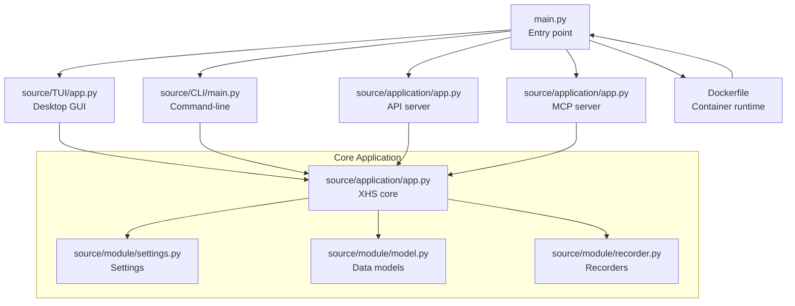
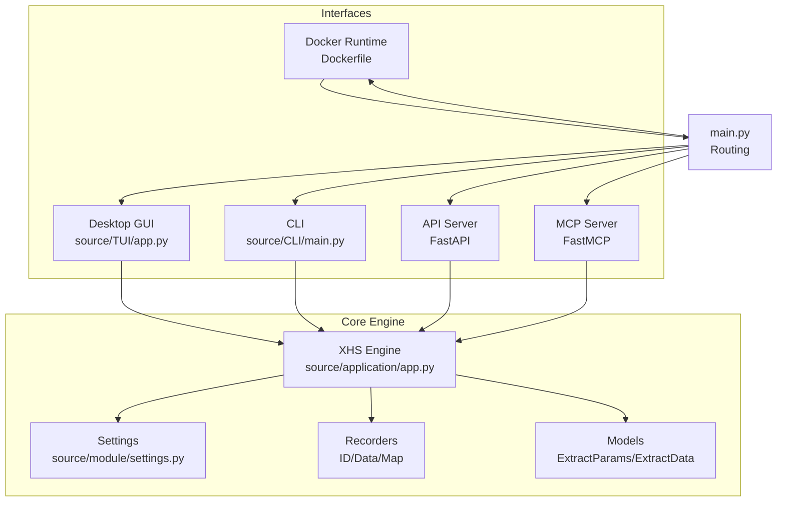
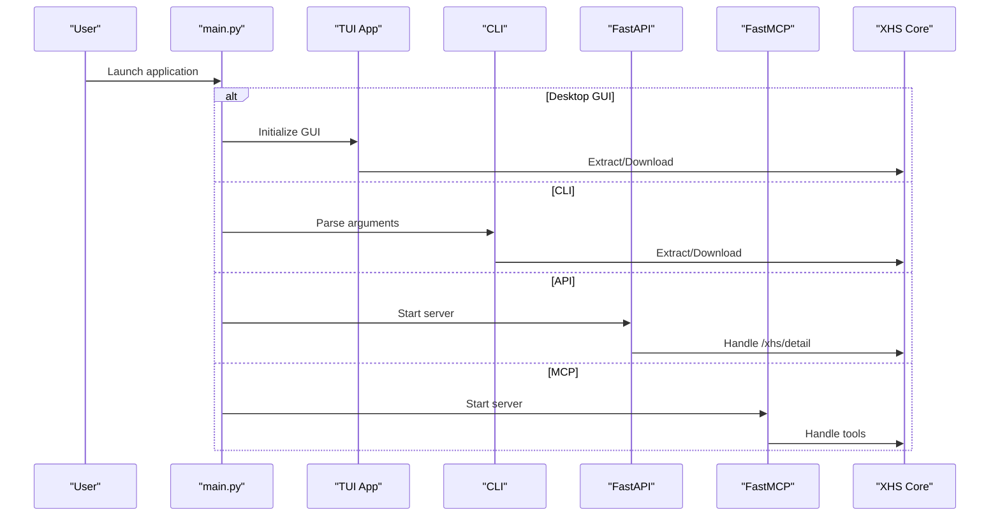
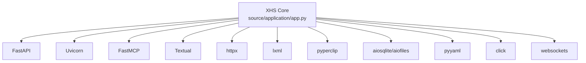

# Project Overview

<cite>
**Referenced Files in This Document**
- [README.md](file://README.md)
- [README_EN.md](file://README_EN.md)
- [main.py](file://main.py)
- [pyproject.toml](file://pyproject.toml)
- [requirements.txt](file://requirements.txt)
- [Dockerfile](file://Dockerfile)
- [source/__init__.py](file://source/__init__.py)
- [source/application/app.py](file://source/application/app.py)
- [source/CLI/main.py](file://source/CLI/main.py)
- [source/TUI/app.py](file://source/TUI/app.py)
- [source/module/settings.py](file://source/module/settings.py)
- [example.py](file://example.py)
- [static/XHS-Downloader.js](file://static/XHS-Downloader.js)
</cite>

## Table of Contents
1. [Introduction](#introduction)
2. [Project Structure](#project-structure)
3. [Core Components](#core-components)
4. [Architecture Overview](#architecture-overview)
5. [Detailed Component Analysis](#detailed-component-analysis)
6. [Dependency Analysis](#dependency-analysis)
7. [Performance Considerations](#performance-considerations)
8. [Troubleshooting Guide](#troubleshooting-guide)
9. [Conclusion](#conclusion)

## Introduction
XHS-Downloader is a multi-interface desktop application designed to extract and download content from XiaoHongShu (Little Red Book, RedNote). It supports extracting links from user profiles, collections, likes, albums, search results, and user links, then downloading videos, images, and live photos. The project emphasizes flexibility by providing a desktop GUI, a command-line interface (CLI), a server mode with an API, and an MCP integration, plus Docker deployment support. It targets both beginners seeking a simple desktop experience and advanced developers needing programmatic control or automation.

Terminology used consistently with the codebase:
- "XHS" is the project acronym.
- "作品" (works/posts) refers to XiaoHongShu content items.
- "小红书" (XiaoHongShu) and "RedNote" are alternate names for the platform.

## Project Structure
The repository organizes functionality by interface and domain:
- Entry points for different modes (GUI, CLI, API, MCP, Docker).
- Core application logic under source/application implementing extraction, parsing, downloading, and persistence.
- Interface-specific modules under source/CLI and source/TUI.
- Shared modules for settings, models, recorders, and tools.
- Dockerfile for containerized deployment.
- User script for browser integration.

**Diagram sources**
- [main.py:45-60](file://main.py#L45-L60)
- [source/TUI/app.py:18-41](file://source/TUI/app.py#L18-L41)
- [source/CLI/main.py:39-64](file://source/CLI/main.py#L39-L64)
- [source/application/app.py:685-704](file://source/application/app.py#L685-L704)
- [source/module/settings.py:10-61](file://source/module/settings.py#L10-L61)
- [Dockerfile:46-48](file://Dockerfile#L46-L48)

**Section sources**
- [README.md:20-57](file://README.md#L20-L57)
- [main.py:45-60](file://main.py#L45-L60)
- [source/__init__.py:1-12](file://source/__init__.py#L1-L12)

## Core Components
- XHS core engine: Implements extraction, HTML parsing, media link resolution, download orchestration, and persistence. It exposes methods for CLI, GUI, API, and MCP usage.
- Settings: Manages configuration persistence and compatibility across runs.
- Data models: Typed request/response models for API and internal data structures.
- Recorders: SQLite-backed persistence for download records and metadata.
- CLI: Command-line interface with rich parameter support and help generation.
- TUI: Textual-based desktop GUI with screens for index, settings, records, and updates.
- Docker: Multi-stage build and runtime configuration for containerized operation.

Key capabilities:
- Extract links from multiple XiaoHongShu contexts (profile, collections, likes, albums, search, user links).
- Download videos, images, and live photos with configurable preferences.
- Skip previously downloaded works, record metadata, and manage file naming.
- Serve API and MCP endpoints for external integrations.
- Provide a desktop GUI and CLI for flexible user interaction.

**Section sources**
- [source/application/app.py:268-302](file://source/application/app.py#L268-L302)
- [source/application/app.py:358-375](file://source/application/app.py#L358-L375)
- [source/application/app.py:685-757](file://source/application/app.py#L685-L757)
- [source/application/app.py:758-800](file://source/application/app.py#L758-L800)
- [source/module/settings.py:10-61](file://source/module/settings.py#L10-L61)
- [source/CLI/main.py:39-64](file://source/CLI/main.py#L39-L64)
- [source/TUI/app.py:18-41](file://source/TUI/app.py#L18-L41)

## Architecture Overview
XHS-Downloader adopts a multi-interface architecture where a single core engine (XHS) is reused across GUI, CLI, API, MCP, and Docker deployments. The entry point main.py routes execution to the selected interface, which then initializes the XHS core with settings from the Settings module. The core coordinates HTML fetching, data extraction, media resolution, and downloads, persisting records and metadata.

**Diagram sources**
- [main.py:45-60](file://main.py#L45-L60)
- [source/application/app.py:685-757](file://source/application/app.py#L685-L757)
- [source/application/app.py:758-800](file://source/application/app.py#L758-L800)
- [source/module/settings.py:10-61](file://source/module/settings.py#L10-L61)

## Detailed Component Analysis

### Multi-Interface Design
The project cleanly separates concerns:
- Entry routing: main.py selects GUI, CLI, API, MCP, or CLI fallback.
- GUI: source/TUI/app.py builds a Textual app with screens and delegates to XHS.
- CLI: source/CLI/main.py defines Click commands, parses parameters, and invokes XHS.
- API: source/application/app.py registers FastAPI routes and serves endpoints.
- MCP: source/application/app.py registers FastMCP tools for external clients.
- Docker: Dockerfile packages the app and exposes the server port.

**Diagram sources**
- [main.py:45-60](file://main.py#L45-L60)
- [source/TUI/app.py:18-41](file://source/TUI/app.py#L18-L41)
- [source/CLI/main.py:354-370](file://source/CLI/main.py#L354-L370)
- [source/application/app.py:685-757](file://source/application/app.py#L685-L757)
- [source/application/app.py:758-800](file://source/application/app.py#L758-L800)

**Section sources**
- [main.py:45-60](file://main.py#L45-L60)
- [source/TUI/app.py:18-41](file://source/TUI/app.py#L18-L41)
- [source/CLI/main.py:354-370](file://source/CLI/main.py#L354-L370)
- [source/application/app.py:685-757](file://source/application/app.py#L685-L757)
- [source/application/app.py:758-800](file://source/application/app.py#L758-L800)

### Practical Use Cases Across Interfaces
- Desktop GUI:
  - Open the app, navigate to the index screen, paste a XiaoHongShu link, and let the GUI handle extraction and download.
  - Adjust settings via the settings screen; changes are applied dynamically.
- CLI:
  - Single-link extraction with optional index selection for image sequences.
  - Batch extraction by passing multiple links (enclosed in quotes when needed).
  - Example invocation patterns are documented in the project README.
- API:
  - POST to /xhs/detail with url, download, index, cookie, proxy, and skip parameters.
  - Useful for integrating XHS-Downloader into other tools or services.
- MCP:
  - Two tools: get_detail_data (retrieve post info) and download_detail (download files).
  - Ideal for chat-based or external automation clients.
- Docker:
  - Run containers exposing port 5556 for API/MCP modes.
  - Mount a volume for persistent settings and downloads.

**Section sources**
- [README.md:80-127](file://README.md#L80-L127)
- [README.md:140-244](file://README.md#L140-L244)
- [README.md:104-127](file://README.md#L104-L127)
- [README_EN.md:80-128](file://README_EN.md#L80-L128)
- [README_EN.md:141-249](file://README_EN.md#L141-L249)
- [README_EN.md:105-128](file://README_EN.md#L105-L128)

### Browser User Script Integration
The Tampermonkey user script enables quick extraction of links and push-to-server functionality:
- Extract recommendation, published, liked, saved, album, search, and user links.
- Push download tasks to the desktop app or server when script_server is enabled.
- Provides localized UI and settings for convenience.

**Section sources**
- [README.md:245-283](file://README.md#L245-L283)
- [README_EN.md:249-288](file://README_EN.md#L249-L288)
- [static/XHS-Downloader.js:1-200](file://static/XHS-Downloader.js#L1-L200)

## Dependency Analysis
External dependencies include FastAPI, Uvicorn, FastMCP, Textual, httpx, lxml, pyperclip, aiosqlite, aiofiles, emoji, yaml, click, and websockets. These enable the API/MCP servers, GUI, asynchronous IO, HTML parsing, clipboard operations, and SQLite persistence.

**Diagram sources**
- [pyproject.toml:11-25](file://pyproject.toml#L11-L25)
- [requirements.txt:1-29](file://requirements.txt#L1-L29)

**Section sources**
- [pyproject.toml:11-25](file://pyproject.toml#L11-L25)
- [requirements.txt:1-29](file://requirements.txt#L1-L29)

## Performance Considerations
- Built-in request delays and retry mechanisms reduce server-side pressure.
- Chunked downloads and configurable chunk sizes balance memory and throughput.
- SQLite-backed recorders minimize overhead for download history and metadata.
- Asynchronous IO (async/await) improves concurrency for multiple works and network operations.

[No sources needed since this section provides general guidance]

## Troubleshooting Guide
Common issues and resolutions:
- Cookie configuration: Configure or update Cookie to improve video quality and access; see the README for obtaining Cookie.
- Clipboard operations: Behavior differs across platforms; ensure required system utilities are installed on Linux.
- Docker limitations: Clipboard monitoring and CLI mode are not supported in Docker; use API/MCP modes instead.
- Download records: If a work appears skipped unexpectedly, verify the download record database and remove entries if re-downloading is desired.

**Section sources**
- [README.md:78-89](file://README.md#L78-L89)
- [README.md:351-357](file://README.md#L351-L357)
- [README.md:126-127](file://README.md#L126-L127)
- [README.md:527-530](file://README.md#L527-L530)

## Conclusion
XHS-Downloader delivers a robust, multi-interface solution for XiaoHongShu content extraction and downloading. Its shared core engine ensures consistent behavior across GUI, CLI, API, MCP, and Docker deployments, while rich configuration and persistence features meet diverse user needs. Beginners benefit from a straightforward desktop GUI and user script integration, while developers gain programmatic access via API and MCP, along with Docker support for scalable deployment.