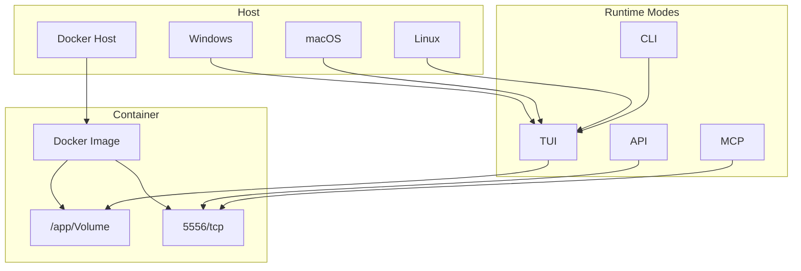
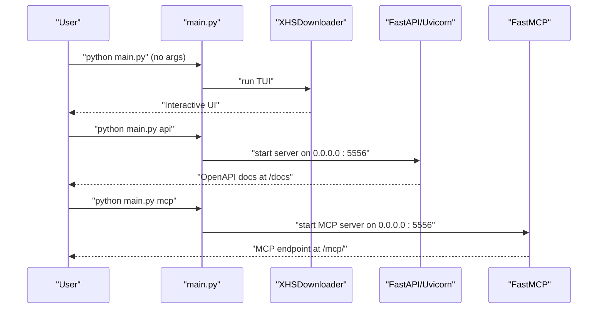
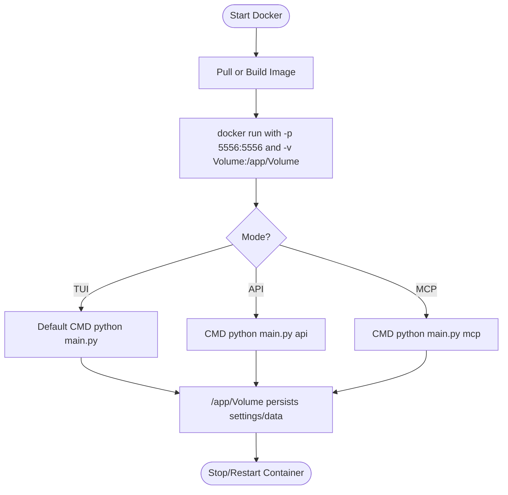
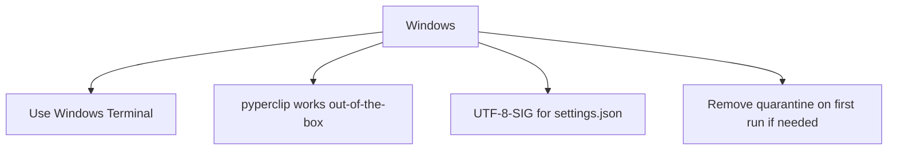
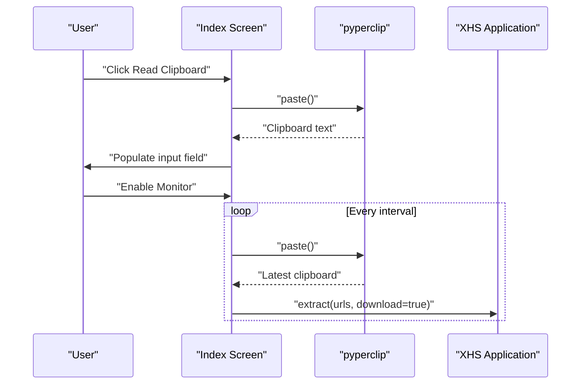
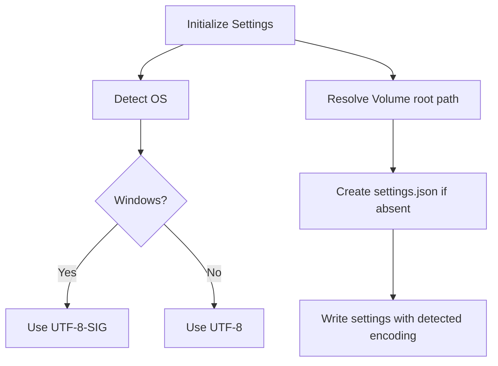
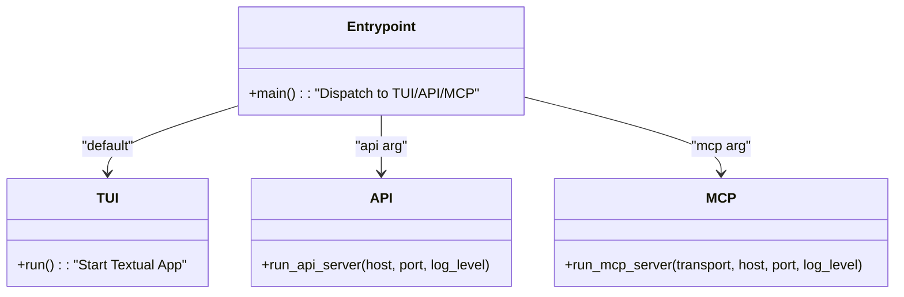
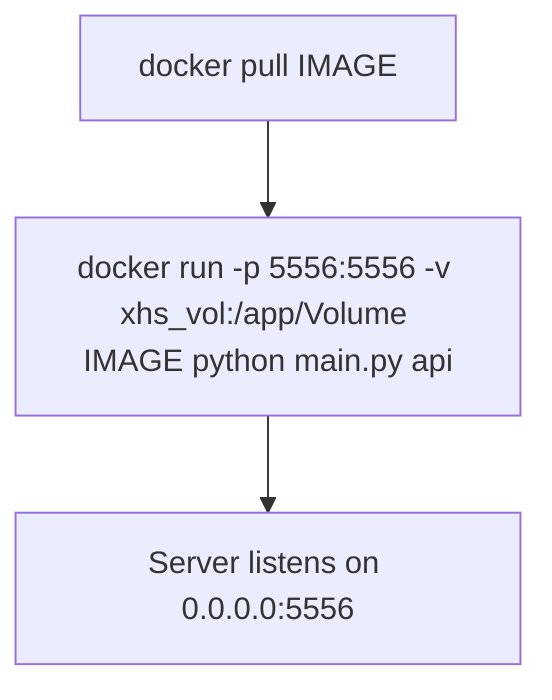
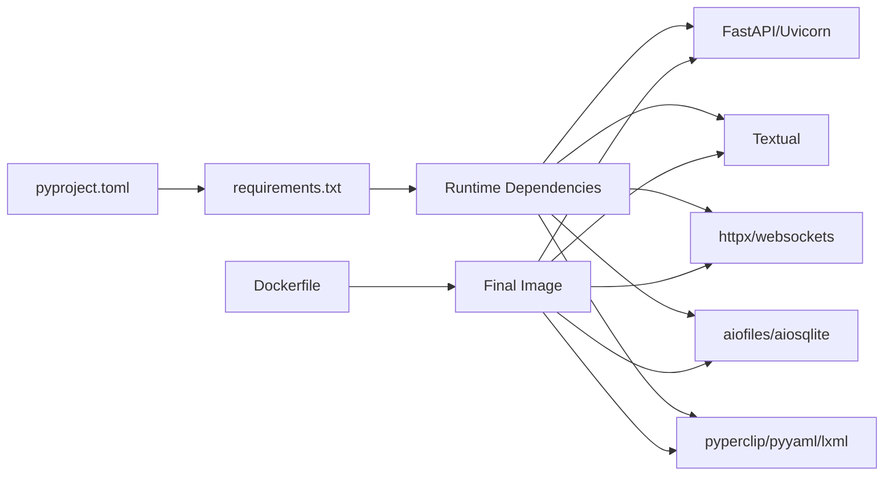

# Supported Platforms

<cite>
**Referenced Files in This Document**
- [README.md](file://README.md)
- [Dockerfile](file://Dockerfile)
- [requirements.txt](file://requirements.txt)
- [pyproject.toml](file://pyproject.toml)
- [main.py](file://main.py)
- [source/__init__.py](file://source/__init__.py)
- [source/module/settings.py](file://source/module/settings.py)
- [source/module/static.py](file://source/module/static.py)
- [source/CLI/main.py](file://source/CLI/main.py)
- [source/TUI/app.py](file://source/TUI/app.py)
- [source/TUI/index.py](file://source/TUI/index.py)
- [source/TUI/monitor.py](file://source/TUI/monitor.py)
- [source/expansion/browser.py](file://source/expansion/browser.py)
- [source/expansion/file_folder.py](file://source/expansion/file_folder.py)
</cite>

## Table of Contents
1. [Introduction](#introduction)
2. [Project Structure](#project-structure)
3. [Core Components](#core-components)
4. [Architecture Overview](#architecture-overview)
5. [Detailed Component Analysis](#detailed-component-analysis)
6. [Dependency Analysis](#dependency-analysis)
7. [Performance Considerations](#performance-considerations)
8. [Troubleshooting Guide](#troubleshooting-guide)
9. [Conclusion](#conclusion)
10. [Appendices](#appendices)

## Introduction
This document describes the supported platforms and deployment/runtime environments for XHS-Downloader. It consolidates system requirements, installation methods (source, Docker, and executable distributions), platform-specific considerations (Windows, macOS, Linux), and operational modes (TUI, API, MCP). It also covers clipboard handling, file system and path differences, and Docker containerization with volume mounting and port configuration.

## Project Structure
XHS-Downloader supports multiple runtime modes and deployment targets:
- Executable distribution for Windows, macOS, and Linux
- Source installation via Python 3.12+ with uv or pip
- Docker containerization with persistent Volume mounting and port exposure

**Diagram sources**
- [Dockerfile:1-48](file://Dockerfile#L1-L48)
- [main.py:17-42](file://main.py#L17-L42)
- [README.md:104-126](file://README.md#L104-L126)

**Section sources**
- [README.md:70-126](file://README.md#L70-L126)
- [Dockerfile:1-48](file://Dockerfile#L1-L48)
- [pyproject.toml:10](file://pyproject.toml#L10)

## Core Components
- Python 3.12+ is the primary requirement for source installations.
- Executable distribution is available for Windows, macOS, and Linux.
- Docker images support TUI, API, and MCP modes with a shared Volume for persistence.
- Clipboard functionality is handled via pyperclip with platform-specific backends.
- File system handling adjusts encoding and paths per operating system.

**Section sources**
- [pyproject.toml:10](file://pyproject.toml#L10)
- [requirements.txt:19](file://requirements.txt#L19)
- [README.md:80-126](file://README.md#L80-L126)
- [Dockerfile:40-47](file://Dockerfile#L40-L47)
- [source/module/settings.py:39](file://source/module/settings.py#L39)
- [source/module/static.py:7](file://source/module/static.py#L7)

## Architecture Overview
The application exposes three operational modes controlled by the entrypoint. Docker runs the same entrypoint with optional mode arguments.

**Diagram sources**
- [main.py:45-60](file://main.py#L45-L60)
- [main.py:17-42](file://main.py#L17-L42)

**Section sources**
- [main.py:17-42](file://main.py#L17-L42)
- [README.md:140-236](file://README.md#L140-L236)

## Detailed Component Analysis

### System Requirements and Python Version
- Requires Python >= 3.12 for source installations.
- The project metadata enforces Python 3.12+.
- Docker images use Python 3.12 base images.

Practical implications:
- Ensure Python 3.12+ is installed before running from source.
- Docker users can rely on the official image’s Python version.

**Section sources**
- [pyproject.toml:10](file://pyproject.toml#L10)
- [Dockerfile:3](file://Dockerfile#L3)

### Installation Methods

#### Source Installation (Python 3.12+)
- Using uv (recommended): synchronize environment and run directly.
- Using pip: create a virtual environment, install dependencies, then run the main entrypoint.

Key steps:
- Create and activate a virtual environment (optional).
- Install dependencies using uv sync or pip with requirements.txt.
- Run the application entrypoint for TUI, CLI, API, or MCP modes.

Notes:
- uv index mirrors are configured for faster installs.
- CLI mode supports parameter overrides and settings updates.

**Section sources**
- [README.md:89-103](file://README.md#L89-L103)
- [pyproject.toml:30-32](file://pyproject.toml#L30-L32)
- [requirements.txt:1-29](file://requirements.txt#L1-L29)
- [source/CLI/main.py:354-370](file://source/CLI/main.py#L354-L370)

#### Executable Distribution
- Prebuilt executables are available for Windows, macOS, and Linux.
- On macOS, the executable may require removing quarantine attributes before first run.
- Updates can be performed by copying internal Volume data or replacing files.

Operational notes:
- Default storage paths differ when using the executable versus source mode.
- Docker mode does not support command-line invocation or clipboard monitoring.

**Section sources**
- [README.md:80-89](file://README.md#L80-L89)
- [README.md:84](file://README.md#L84)
- [README.md:126](file://README.md#L126)

#### Docker Deployment
- Build or pull the image; expose port 5556; mount a Volume at /app/Volume.
- Run containers in TUI mode by default; pass mode arguments to run API or MCP servers.
- Persistent data and settings are stored under the mounted Volume.

**Diagram sources**
- [Dockerfile:40-47](file://Dockerfile#L40-L47)
- [README.md:104-126](file://README.md#L104-L126)

**Section sources**
- [Dockerfile:1-48](file://Dockerfile#L1-L48)
- [README.md:104-126](file://README.md#L104-L126)

### Platform-Specific Considerations

#### Windows
- Recommended terminal: Windows Terminal (Windows 11 default) for optimal display.
- Clipboard handling via pyperclip requires no extra modules.
- File system encoding defaults to UTF-8-SIG for settings files.
- Executable may require removing quarantine attributes on first run.

**Diagram sources**
- [README.md:74-85](file://README.md#L74-L85)
- [source/module/settings.py:39](file://source/module/settings.py#L39)

**Section sources**
- [README.md:74-85](file://README.md#L74-L85)
- [source/module/settings.py:39](file://source/module/settings.py#L39)

#### macOS
- Clipboard relies on pbcopy/pbpaste; these are provided by the OS.
- Executable main is unsigned; remove quarantine attributes on first run.
- Browser cookie support includes Safari on macOS.

**Section sources**
- [README.md:352-356](file://README.md#L352-L356)
- [source/expansion/browser.py:107-113](file://source/expansion/browser.py#L107-L113)

#### Linux
- Clipboard relies on xclip or xsel; install if missing.
- Browser cookie support excludes Opera GX.
- File system encoding defaults to UTF-8 for settings files.

**Section sources**
- [README.md:352-356](file://README.md#L352-L356)
- [source/expansion/browser.py:114-115](file://source/expansion/browser.py#L114-L115)
- [source/module/settings.py:39](file://source/module/settings.py#L39)

### Clipboard Handling and Monitoring
- Clipboard read/write uses pyperclip across platforms.
- TUI supports reading clipboard content into the input field.
- TUI supports continuous clipboard monitoring to process new links.
- Docker mode does not support clipboard monitoring or command-line invocation.

**Diagram sources**
- [source/TUI/index.py:105-108](file://source/TUI/index.py#L105-L108)
- [source/TUI/monitor.py:42-45](file://source/TUI/monitor.py#L42-L45)
- [README.md:126](file://README.md#L126)

**Section sources**
- [source/TUI/index.py:105-108](file://source/TUI/index.py#L105-L108)
- [source/TUI/monitor.py:42-45](file://source/TUI/monitor.py#L42-L45)
- [README.md:126](file://README.md#L126)

### File System and Path Handling
- Default working root is a Volume directory resolved from the project root.
- Settings file encoding varies by OS (UTF-8-SIG on Windows, UTF-8 elsewhere).
- Path utilities handle file creation, touch/unlink, and cleanup of empty directories.

**Diagram sources**
- [source/module/settings.py:39](file://source/module/settings.py#L39)
- [source/module/static.py:7](file://source/module/static.py#L7)
- [source/expansion/file_folder.py:5-26](file://source/expansion/file_folder.py#L5-L26)

**Section sources**
- [source/module/settings.py:39](file://source/module/settings.py#L39)
- [source/module/static.py:7](file://source/module/static.py#L7)
- [source/expansion/file_folder.py:5-26](file://source/expansion/file_folder.py#L5-L26)

### Operational Modes and Multi-Mode Operation
- TUI: Interactive terminal interface.
- API: FastAPI server exposing endpoints for extracting and downloading content.
- MCP: Streamable HTTP MCP server for external integrations.

**Diagram sources**
- [main.py:45-60](file://main.py#L45-L60)
- [main.py:17-42](file://main.py#L17-L42)

**Section sources**
- [main.py:45-60](file://main.py#L45-L60)
- [README.md:140-236](file://README.md#L140-L236)

### Environment Variables and Configuration
- Settings are persisted in a JSON file under the Volume directory.
- Encoding is OS-dependent to ensure compatibility with system editors.
- Configuration includes paths, naming, formats, proxies, retries, and language.

Practical tips:
- Edit settings.json directly if the UI becomes unresponsive.
- Use CLI flags to override settings temporarily without modifying the file.

**Section sources**
- [source/module/settings.py:52-92](file://source/module/settings.py#L52-L92)
- [README.md:357-503](file://README.md#L357-L503)
- [source/CLI/main.py:354-370](file://source/CLI/main.py#L354-L370)

### Practical Examples

#### Example: Running API Mode in Docker
- Pull or build the image.
- Run a container with port 5556 published and a named Volume mapped to /app/Volume.
- Pass the API argument to start the server.

**Diagram sources**
- [README.md:104-118](file://README.md#L104-L118)
- [Dockerfile:40-47](file://Dockerfile#L40-L47)

#### Example: Running MCP Mode in Docker
- Similar to API mode, but with the MCP argument.
- Connect external tools via the MCP endpoint.

**Section sources**
- [README.md:114-118](file://README.md#L114-L118)

#### Example: CLI Parameter Override
- Use CLI options to set work path, folder name, image format, and other parameters.
- Optionally update the settings file after execution.

**Section sources**
- [source/CLI/main.py:224-352](file://source/CLI/main.py#L224-L352)

## Dependency Analysis
- Python 3.12+ enforced by project metadata.
- Core libraries include FastAPI, Uvicorn, Textual, httpx, lxml, YAML, emoji, websockets, and pyperclip.
- Docker image builds dependencies in a full Python image and copies them into a slim runtime image.

**Diagram sources**
- [pyproject.toml:11-25](file://pyproject.toml#L11-L25)
- [requirements.txt:1-29](file://requirements.txt#L1-29)
- [Dockerfile:3-47](file://Dockerfile#L3-L47)

**Section sources**
- [pyproject.toml:11-25](file://pyproject.toml#L11-L25)
- [requirements.txt:1-29](file://requirements.txt#L1-29)
- [Dockerfile:3-47](file://Dockerfile#L3-L47)

## Performance Considerations
- Built-in request delays mitigate server-side rate limiting risks.
- Download chunk sizes and retry limits are configurable via settings.
- File signature detection helps avoid misclassification during downloads.

[No sources needed since this section provides general guidance]

## Troubleshooting Guide
- Clipboard issues:
  - Windows: No extra modules required.
  - macOS: Ensure pbcopy/pbpaste are available.
  - Linux: Install xclip or xsel if missing; qtpy/PyQt5 may be required on some systems.
- Docker clipboard limitations:
  - Clipboard monitoring and command-line invocation are not supported in Docker mode.
- macOS executable quarantine:
  - Remove quarantine attributes on first run if prompted by the system.
- Settings encoding:
  - On Windows, settings are written with UTF-8-SIG; ensure your editor supports this encoding.

**Section sources**
- [README.md:352-356](file://README.md#L352-L356)
- [README.md:84](file://README.md#L84)
- [README.md:126](file://README.md#L126)
- [source/module/settings.py:39](file://source/module/settings.py#L39)

## Conclusion
XHS-Downloader supports broad deployment scenarios across Windows, macOS, Linux, and Docker. Python 3.12+ is the primary requirement for source installations, while prebuilt executables simplify usage on all platforms. Docker enables containerized deployments with persistent storage and multi-mode operation (TUI, API, MCP). Platform-specific considerations—clipboard backends, file system encoding, and terminal recommendations—are integrated into the application to ensure consistent behavior across environments.

## Appendices

### Appendix A: Supported Platforms and Modes
- Windows: TUI, API, MCP, Executable, CLI
- macOS: TUI, API, MCP, Executable, CLI, Browser cookie (Safari)
- Linux: TUI, API, MCP, Executable, CLI, Browser cookie (excluding Opera GX)

**Section sources**
- [source/expansion/browser.py:107-115](file://source/expansion/browser.py#L107-L115)
- [README.md:104-126](file://README.md#L104-L126)