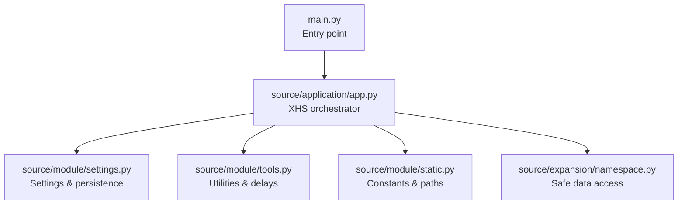
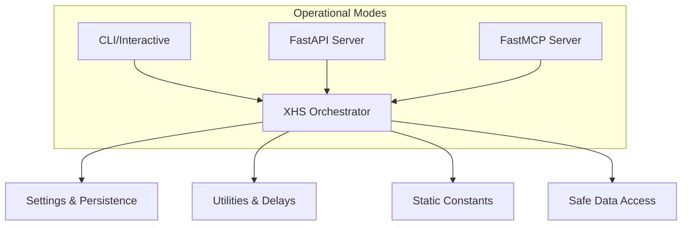
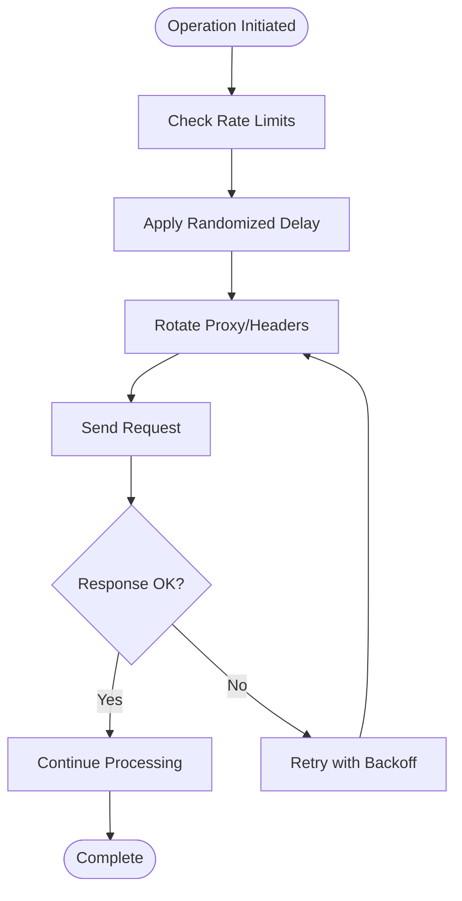
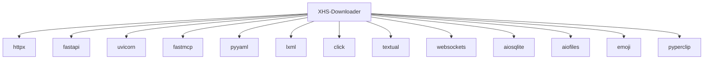

# Security and Legal Considerations

<cite>
**Referenced Files in This Document**
- [LICENSE](file://LICENSE)
- [README.md](file://README.md)
- [pyproject.toml](file://pyproject.toml)
- [requirements.txt](file://requirements.txt)
- [main.py](file://main.py)
- [source/application/app.py](file://source/application/app.py)
- [source/module/settings.py](file://source/module/settings.py)
- [source/module/tools.py](file://source/module/tools.py)
- [source/module/static.py](file://source/module/static.py)
- [source/expansion/namespace.py](file://source/expansion/namespace.py)
</cite>

## Table of Contents
1. [Introduction](#introduction)
2. [Project Structure](#project-structure)
3. [Core Components](#core-components)
4. [Architecture Overview](#architecture-overview)
5. [Detailed Component Analysis](#detailed-component-analysis)
6. [Dependency Analysis](#dependency-analysis)
7. [Performance Considerations](#performance-considerations)
8. [Troubleshooting Guide](#troubleshooting-guide)
9. [Conclusion](#conclusion)
10. [Appendices](#appendices)

## Introduction
This document consolidates security and legal considerations for responsible usage and compliance of XHS-Downloader. It explains the GNU General Public License v3.0 obligations, legal compliance requirements (including copyright, fair use, and platform terms), privacy practices, security best practices, responsible usage guidelines, risk mitigation strategies, and ethical considerations. It also highlights the project’s open-source commitments and community contribution ethos.

## Project Structure
XHS-Downloader is a modular Python application exposing:
- A TUI/CLI entrypoint
- Optional API and MCP servers
- Configuration management and persistence
- Data extraction, conversion, and download pipeline
- Logging and resource management

**Diagram sources**
- [main.py:1-60](file://main.py#L1-L60)
- [source/application/app.py:1-120](file://source/application/app.py#L1-L120)
- [source/module/settings.py:1-124](file://source/module/settings.py#L1-L124)
- [source/module/tools.py:1-64](file://source/module/tools.py#L1-L64)
- [source/module/static.py:1-73](file://source/module/static.py#L1-L73)
- [source/expansion/namespace.py:1-84](file://source/expansion/namespace.py#L1-L84)

**Section sources**
- [main.py:1-60](file://main.py#L1-L60)
- [source/application/app.py:1-120](file://source/application/app.py#L1-L120)
- [source/module/settings.py:1-124](file://source/module/settings.py#L1-L124)
- [source/module/tools.py:1-64](file://source/module/tools.py#L1-L64)
- [source/module/static.py:1-73](file://source/module/static.py#L1-L73)
- [source/expansion/namespace.py:1-84](file://source/expansion/namespace.py#L1-L84)

## Core Components
- Settings and configuration: centralized defaults, persistence, and compatibility checks for runtime parameters.
- Application orchestration: extraction, data conversion, download coordination, and server exposure.
- Utilities: retry mechanisms, logging helpers, and randomized delay generation to reduce impact.
- Static constants: paths, headers, versioning, and file signature detection.

Key responsibilities for security and compliance:
- Respect platform terms and rate limits
- Manage cookies and proxies securely
- Persist and protect sensitive configuration
- Log and audit operations appropriately

**Section sources**
- [source/module/settings.py:10-124](file://source/module/settings.py#L10-L124)
- [source/application/app.py:98-194](file://source/application/app.py#L98-L194)
- [source/module/tools.py:13-64](file://source/module/tools.py#L13-L64)
- [source/module/static.py:1-73](file://source/module/static.py#L1-L73)

## Architecture Overview
The system exposes multiple operational modes:
- TUI/CLI for interactive and batch usage
- API server for programmatic access
- MCP server for external integrations

**Diagram sources**
- [main.py:12-60](file://main.py#L12-L60)
- [source/application/app.py:685-800](file://source/application/app.py#L685-L800)
- [source/module/settings.py:52-92](file://source/module/settings.py#L52-L92)
- [source/module/tools.py:54-64](file://source/module/tools.py#L54-L64)
- [source/module/static.py:1-73](file://source/module/static.py#L1-L73)
- [source/expansion/namespace.py:26-55](file://source/expansion/namespace.py#L26-L55)

## Detailed Component Analysis

### GNU General Public License v3.0 Obligations
- License identifier and version are declared in metadata and license text.
- The license governs redistribution, modification, and propagation of the program.
- Copyleft obligations require derivative works to retain license notices and source availability.
- Patent grant and anti-circumvention protections apply to covered works.

Obligations for users and developers:
- Preserve license notices and disclaimers
- Provide source or written offer for covered works
- Convey modifications under the same license
- Do not impose additional restrictions beyond license terms

**Section sources**
- [LICENSE:1-675](file://LICENSE#L1-L675)
- [pyproject.toml:9-9](file://pyproject.toml#L9-L9)
- [README.md:680-699](file://README.md#L680-L699)

### Legal Compliance Requirements
- Platform terms of service: adhere to robots.txt, rate limits, and terms governing automated access.
- Fair use and copyright: ensure downloads do not infringe third-party rights; avoid mass scraping of protected content.
- Attribution and licensing: when redistributing, include license notices and attributions as required by GPLv3.

Risk mitigation:
- Use proxies judiciously and rotate IPs when necessary
- Implement rate limiting and randomized delays
- Avoid scraping content that is explicitly restricted

**Section sources**
- [README.md:237-244](file://README.md#L237-L244)
- [LICENSE:71-111](file://LICENSE#L71-L111)
- [source/module/tools.py:54-64](file://source/module/tools.py#L54-L64)

### Privacy Considerations
- Data collection: the application persists extracted metadata and download records locally.
- Storage: SQLite-backed records are stored under a dedicated Volume directory.
- Sharing: the application does not transmit data externally unless explicitly configured to do so (e.g., via API/MCP servers); ensure outbound traffic is audited and secured.

Recommendations:
- Restrict server exposure to trusted networks
- Encrypt sensitive configuration and logs at rest
- Minimize retention of personally identifiable or sensitive metadata

**Section sources**
- [README.md:241-242](file://README.md#L241-L242)
- [source/module/static.py:7-8](file://source/module/static.py#L7-L8)
- [source/module/settings.py:72-92](file://source/module/settings.py#L72-L92)

### Security Best Practices
- Secure configuration management:
  - Store credentials and tokens in environment variables or encrypted vaults when integrating externally
  - Avoid committing secrets to repositories
- Network security:
  - Prefer HTTPS endpoints and validated certificates
  - Use authenticated proxies when required
- Data protection:
  - Sanitize filenames and paths to prevent injection
  - Validate and sanitize user-provided URLs and inputs
- Logging and observability:
  - Avoid logging sensitive data (cookies, tokens)
  - Use structured logging and limit verbosity in production

**Section sources**
- [source/application/app.py:102-108](file://source/application/app.py#L102-L108)
- [source/module/static.py:19-29](file://source/module/static.py#L19-L29)
- [source/module/tools.py:13-22](file://source/module/tools.py#L13-L22)

### Responsible Usage Guidelines and Ethical Considerations
- Use the tool for legitimate, non-infringing purposes
- Respect platform policies and terms of service
- Avoid excessive scraping or automated bulk downloads that could harm platform stability
- Attribute content appropriately when reuse is permitted

**Section sources**
- [README.md:680-699](file://README.md#L680-L699)

### Risk Mitigation Strategies
- Rate limiting and delays:
  - Randomized wait times reduce pattern predictability
- IP rotation and proxies:
  - Rotate proxies and vary User-Agent headers to reduce fingerprinting
- Account safety:
  - Avoid sharing accounts; use ephemeral sessions when necessary
  - Monitor for rate limits and adjust behavior accordingly

**Diagram sources**
- [source/module/tools.py:54-64](file://source/module/tools.py#L54-L64)
- [source/application/app.py:685-756](file://source/application/app.py#L685-L756)

**Section sources**
- [source/module/tools.py:54-64](file://source/module/tools.py#L54-L64)
- [README.md:239-243](file://README.md#L239-L243)

### Guidance on Legal Alternatives and Attribution
- Use official APIs and public datasets when available
- Provide attribution and links to original sources when permitted
- Seek explicit permission for reuse beyond fair use boundaries

**Section sources**
- [LICENSE:154-177](file://LICENSE#L154-L177)
- [README.md:680-699](file://README.md#L680-L699)

### Open-Source Principles and Community Contribution
- The project is licensed under GPLv3, encouraging openness and collaboration
- Contributions should follow established branching and review practices
- Respect third-party licenses of dependencies

**Section sources**
- [LICENSE:1-675](file://LICENSE#L1-L675)
- [pyproject.toml:1-25](file://pyproject.toml#L1-L25)
- [README.md:635-652](file://README.md#L635-L652)

## Dependency Analysis
External dependencies include HTTP clients, web frameworks, and utilities. Ensure supply chain hygiene by pinning versions and scanning for vulnerabilities.

**Diagram sources**
- [pyproject.toml:11-25](file://pyproject.toml#L11-L25)
- [requirements.txt:1-29](file://requirements.txt#L1-L29)

**Section sources**
- [pyproject.toml:1-25](file://pyproject.toml#L1-L25)
- [requirements.txt:1-29](file://requirements.txt#L1-L29)

## Performance Considerations
- Concurrency and worker limits: the code defines a maximum worker constant suitable for balanced throughput and platform safety.
- Chunked downloads and retries: configurable chunk sizes and retry counts help manage bandwidth and resilience.
- Delays: randomized delays reduce server-side detection and improve reliability.

**Section sources**
- [source/module/static.py:69-70](file://source/module/static.py#L69-L70)
- [source/module/tools.py:13-22](file://source/module/tools.py#L13-L22)
- [source/module/settings.py:23-24](file://source/module/settings.py#L23-L24)

## Troubleshooting Guide
Common issues and mitigations:
- Excessive requests leading to throttling or bans:
  - Reduce concurrency and increase delays
  - Use proxies and rotate headers
- Configuration errors:
  - Validate settings.json and ensure defaults are applied
- API/MCP server accessibility:
  - Confirm host/port bindings and firewall rules
- Clipboard monitoring:
  - Ensure clipboard access permissions and avoid conflicts with other clipboard utilities

**Section sources**
- [README.md:239-243](file://README.md#L239-L243)
- [source/module/settings.py:52-92](file://source/module/settings.py#L52-L92)
- [source/application/app.py:685-756](file://source/application/app.py#L685-L756)

## Conclusion
XHS-Downloader operates under GPLv3, requiring open-source compliance and attribution. Responsible usage demands adherence to platform terms, fair use, and ethical reuse. Security and privacy must be prioritized through secure configuration management, network hardening, and minimal data retention. Risk mitigation strategies such as rate limiting, IP rotation, and careful proxy usage help maintain account safety and system stability. The project encourages community contributions while upholding open-source principles.

## Appendices
- License text and terms: [LICENSE:1-675](file://LICENSE#L1-L675)
- Project metadata and dependencies: [pyproject.toml:1-25](file://pyproject.toml#L1-L25)
- Runtime dependencies: [requirements.txt:1-29](file://requirements.txt#L1-L29)
- Operational modes and entry points: [main.py:1-60](file://main.py#L1-L60)
- Data access utilities: [source/expansion/namespace.py:1-84](file://source/expansion/namespace.py#L1-L84)