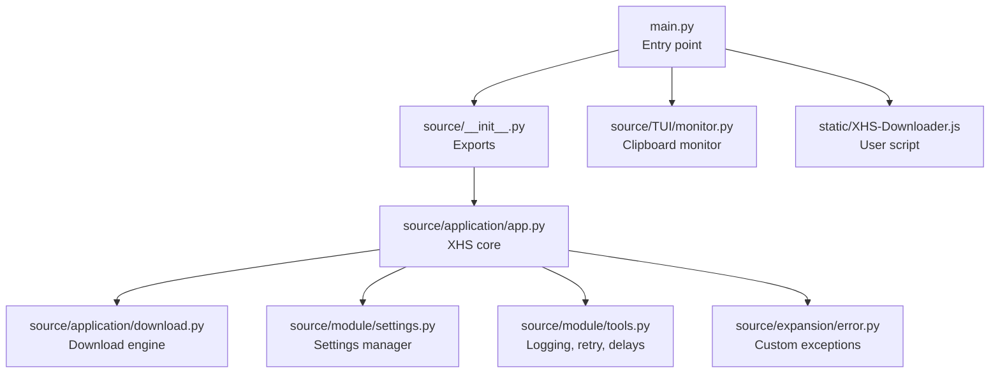
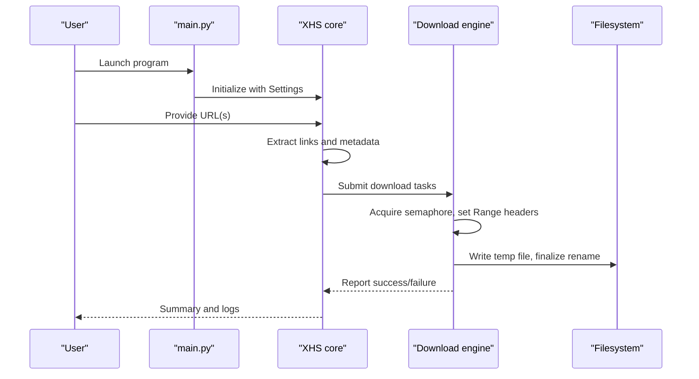
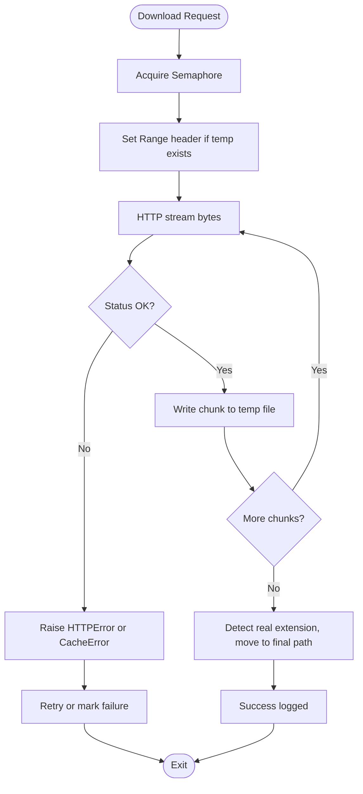
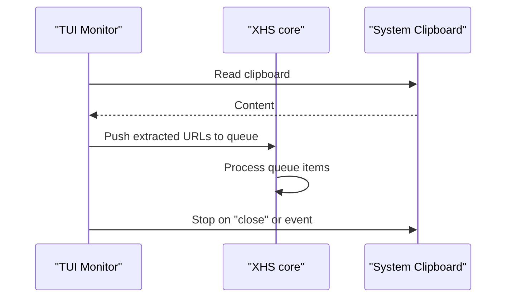
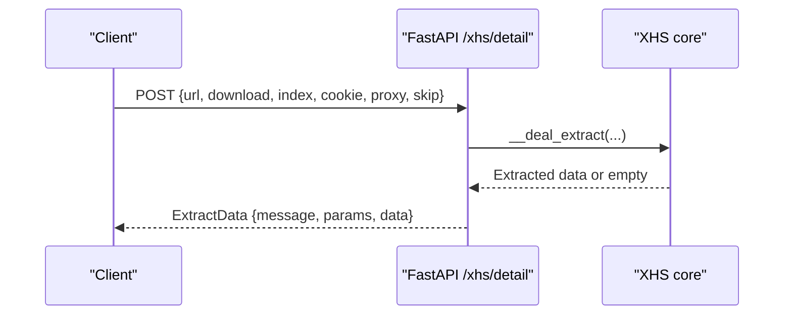
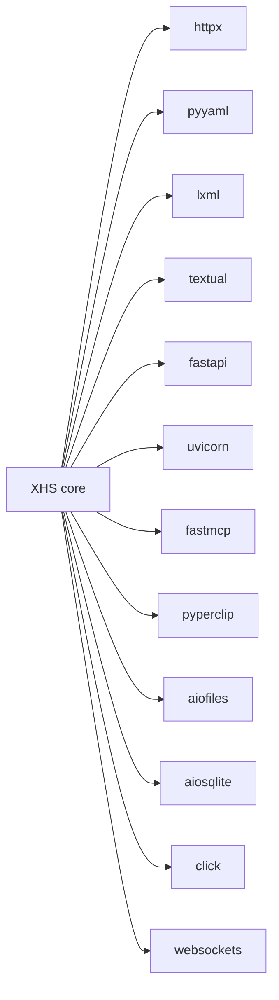

# Troubleshooting and FAQ

<cite>
**Referenced Files in This Document**
- [README.md](file://README.md)
- [main.py](file://main.py)
- [requirements.txt](file://requirements.txt)
- [pyproject.toml](file://pyproject.toml)
- [source/__init__.py](file://source/__init__.py)
- [source/application/app.py](file://source/application/app.py)
- [source/application/download.py](file://source/application/download.py)
- [source/module/settings.py](file://source/module/settings.py)
- [source/module/tools.py](file://source/module/tools.py)
- [source/expansion/error.py](file://source/expansion/error.py)
- [source/TUI/monitor.py](file://source/TUI/monitor.py)
- [static/XHS-Downloader.js](file://static/XHS-Downloader.js)
</cite>

## Table of Contents
1. [Introduction](#introduction)
2. [Project Structure](#project-structure)
3. [Core Components](#core-components)
4. [Architecture Overview](#architecture-overview)
5. [Detailed Component Analysis](#detailed-component-analysis)
6. [Dependency Analysis](#dependency-analysis)
7. [Performance Considerations](#performance-considerations)
8. [Troubleshooting Guide](#troubleshooting-guide)
9. [FAQ](#faq)
10. [Security, Compliance, and Responsible Usage](#security-compliance-and-responsible-usage)
11. [Community Resources and Support](#community-resources-and-support)
12. [Conclusion](#conclusion)

## Introduction
This document provides a comprehensive troubleshooting guide and FAQ for XHS-Downloader. It focuses on diagnosing and resolving common issues such as network connectivity problems, authentication failures, file download errors, and interface-specific challenges. It also covers platform-specific considerations (Windows, macOS, Linux) for clipboard functionality, file system access, and dependency management; performance optimization techniques including rate limiting, memory management, and concurrency controls; and frequently asked questions around Cookie configuration, proxy setup, and browser compatibility. Step-by-step diagnostic procedures and security/compliance guidance are included to help users operate the tool responsibly and effectively.

## Project Structure
XHS-Downloader is organized into modular components:
- Application core: extraction, HTML parsing, media type handling, and download orchestration
- CLI/TUI entry points: program modes (GUI, API, MCP, CLI)
- Module utilities: settings, logging helpers, retry utilities, and constants
- Expansion utilities: converters, cleaners, namespace helpers, and error types
- Static assets: user scripts and documentation

**Diagram sources**
- [main.py:1-60](file://main.py#L1-L60)
- [source/__init__.py:1-12](file://source/__init__.py#L1-L12)
- [source/application/app.py:98-1000](file://source/application/app.py#L98-L1000)
- [source/application/download.py:196-267](file://source/application/download.py#L196-L267)
- [source/module/settings.py:10-124](file://source/module/settings.py#L10-L124)
- [source/module/tools.py:1-63](file://source/module/tools.py#L1-L63)
- [source/expansion/error.py:1-8](file://source/expansion/error.py#L1-L8)
- [source/TUI/monitor.py:1-58](file://source/TUI/monitor.py#L1-L58)
- [static/XHS-Downloader.js:604-659](file://static/XHS-Downloader.js#L604-L659)

**Section sources**
- [main.py:1-60](file://main.py#L1-L60)
- [source/__init__.py:1-12](file://source/__init__.py#L1-L12)

## Core Components
- XHS core: orchestrates extraction, data parsing, media selection, download scheduling, and persistence
- Download engine: handles HTTP streaming, resume via Range headers, temporary files, and finalization
- Settings manager: reads/writes settings.json with platform-aware encoding and migration
- Logging and retry utilities: structured logging, exponential-like delays, and retry decorators
- Clipboard monitor: TUI-based monitoring of clipboard content for automatic processing
- User script: client-side automation for batch extraction and download triggers

Key responsibilities:
- Network requests and error propagation
- Media type detection and URL resolution
- Concurrency control and rate limiting
- Persistence of records and metadata
- Cross-platform clipboard and file system handling

**Section sources**
- [source/application/app.py:98-1000](file://source/application/app.py#L98-L1000)
- [source/application/download.py:196-267](file://source/application/download.py#L196-L267)
- [source/module/settings.py:10-124](file://source/module/settings.py#L10-L124)
- [source/module/tools.py:1-63](file://source/module/tools.py#L1-L63)
- [source/TUI/monitor.py:1-58](file://source/TUI/monitor.py#L1-L58)
- [static/XHS-Downloader.js:604-659](file://static/XHS-Downloader.js#L604-L659)

## Architecture Overview
High-level flow:
- Entry point selects mode (GUI/TUI/API/MCP/CLI)
- XHS initializes settings and managers
- Extraction pipeline resolves URLs, parses HTML, extracts metadata, selects media URLs
- Download engine streams media with concurrency control and resume capability
- Records are persisted and download history is tracked

**Diagram sources**
- [main.py:12-60](file://main.py#L12-L60)
- [source/application/app.py:268-506](file://source/application/app.py#L268-L506)
- [source/application/download.py:196-267](file://source/application/download.py#L196-L267)

## Detailed Component Analysis

### Download Engine and Concurrency
The download engine manages:
- Semaphore-controlled concurrency
- Resume via HTTP Range headers
- Temporary file writing and finalization
- Error handling for HTTP and cache anomalies

**Diagram sources**
- [source/application/download.py:196-267](file://source/application/download.py#L196-L267)
- [source/expansion/error.py:1-8](file://source/expansion/error.py#L1-L8)

**Section sources**
- [source/application/download.py:196-267](file://source/application/download.py#L196-L267)
- [source/expansion/error.py:1-8](file://source/expansion/error.py#L1-L8)

### Clipboard Monitoring (TUI)
The TUI monitor listens to clipboard content and queues processing tasks.

**Diagram sources**
- [source/TUI/monitor.py:18-58](file://source/TUI/monitor.py#L18-L58)
- [source/application/app.py:603-652](file://source/application/app.py#L603-L652)

**Section sources**
- [source/TUI/monitor.py:18-58](file://source/TUI/monitor.py#L18-L58)
- [source/application/app.py:603-652](file://source/application/app.py#L603-L652)

### API and MCP Servers
XHS exposes:
- FastAPI endpoint for extracting details and optionally downloading
- FastMCP server with two tools: get_detail_data and download_detail

**Diagram sources**
- [source/application/app.py:706-757](file://source/application/app.py#L706-L757)

**Section sources**
- [source/application/app.py:706-757](file://source/application/app.py#L706-L757)

## Dependency Analysis
External dependencies include HTTP client, async file system, web frameworks, and clipboard utilities. Platform-specific clipboard behavior is handled by pyperclip.

**Diagram sources**
- [requirements.txt:1-29](file://requirements.txt#L1-L29)
- [pyproject.toml:11-25](file://pyproject.toml#L11-L25)

**Section sources**
- [requirements.txt:1-29](file://requirements.txt#L1-L29)
- [pyproject.toml:11-25](file://pyproject.toml#L11-L25)

## Performance Considerations
- Rate limiting and delays: The code includes a logarithmic delay generator and a sleep utility intended to moderate request frequency. While some internal calls are commented out, the project documentation mentions built-in request delay mechanisms to avoid excessive load.
- Concurrency control: The download engine uses a semaphore to cap concurrent downloads.
- Chunk size: Configurable chunk size influences memory usage and throughput during streaming.
- Persistence overhead: SQLite-backed recorders add I/O overhead; tune record_data and download_record according to needs.

Recommendations:
- Reduce max_retry and adjust chunk size for unstable networks
- Lower concurrency for constrained systems
- Enable record_data selectively to reduce repeated processing
- Use proxies judiciously and test latency/throughput

**Section sources**
- [source/module/tools.py:54-63](file://source/module/tools.py#L54-L63)
- [source/application/download.py:205](file://source/application/download.py#L205)
- [README.md:237-244](file://README.md#L237-L244)

## Troubleshooting Guide

### 1) Network Connectivity Issues
Symptoms:
- Requests fail with HTTP errors
- Downloads stall or abort mid-stream
- API/MCP endpoints unreachable

Diagnostic steps:
- Verify proxy settings in settings.json or via CLI/API parameters
- Test reachability to target hosts
- Confirm firewall and antivirus are not blocking outbound connections
- Try disabling global proxy tools and retry

Common causes:
- Misconfigured proxy
- DNS resolution issues
- ISP throttling or blocking
- Rate limiting by upstream servers

Remediation:
- Adjust proxy field in settings.json
- Reduce max_retry and increase timeout
- Use lower concurrency and smaller chunk sizes

**Section sources**
- [source/application/download.py:250-267](file://source/application/download.py#L250-L267)
- [source/module/settings.py:10-124](file://source/module/settings.py#L10-L124)
- [README.md:126](file://README.md#L126)

### 2) Authentication Failures (Cookie)
Symptoms:
- Low-resolution videos or missing premium content
- Access denied or unexpected redirects
- API returns incomplete data

Diagnostic steps:
- Manually capture Cookie from browser developer tools
- Paste into settings.json cookie field
- Restart the application after updating

Notes:
- Cookie configuration is optional but recommended for higher quality media
- The project previously supported reading browser cookies but now directs users to manual Cookie acquisition

**Section sources**
- [README.md:78-79](file://README.md#L78-L79)
- [README.md:131-135](file://README.md#L131-L135)
- [README.md:512-527](file://README.md#L512-L527)

### 3) File Download Errors
Symptoms:
- Partial files or checksum mismatches
- “Cache exception” messages
- Permission errors on write

Diagnostic steps:
- Check free disk space and write permissions for destination path
- Inspect temp directory and final path
- Review logs for HTTP status and CacheError

Common causes:
- 416 Range Not Satisfiable indicates corrupted temp or stale Range
- Antivirus or file system policies blocking writes
- Concurrency conflicts or rapid retries

Remediation:
- Delete stale temp files and retry
- Lower concurrency or disable resume temporarily
- Run as administrator on Windows if permission errors occur

**Section sources**
- [source/application/download.py:219-222](file://source/application/download.py#L219-L222)
- [source/expansion/error.py:1-8](file://source/expansion/error.py#L1-L8)

### 4) Interface-Specific Problems

#### Clipboard Functionality (Windows/macOS/Linux)
Symptoms:
- Clipboard monitoring does not trigger
- TUI shows no activity despite clipboard updates

Diagnostic steps:
- Ensure pyperclip prerequisites are installed per platform
- On Linux, install xclip or xsel as needed
- On macOS, confirm pbcopy/pbpaste availability
- On Windows, no extra modules are required

Remediation:
- Install platform-specific clipboard utilities
- Reinstall pyperclip
- Test clipboard commands manually outside the app

**Section sources**
- [README.md:351-357](file://README.md#L351-L357)

#### Docker Mode Limitations
Symptoms:
- Command-line invocation not supported
- Clipboard features unavailable

Remediation:
- Use GUI/TUI/API/MCP modes locally
- For automation, integrate via API/MCP from host

**Section sources**
- [README.md:126](file://README.md#L126)

#### File System Access
Symptoms:
- Permission denied when writing files
- Paths not found or incorrect

Diagnostic steps:
- Verify work_path and folder_name in settings.json
- Ensure the process has write access to the target directory
- On Windows, avoid protected locations like Program Files

**Section sources**
- [source/module/settings.py:10-124](file://source/module/settings.py#L10-L124)

### 5) API/MCP Debugging
Symptoms:
- 404/500 responses
- Slow response times
- Unexpected parameter handling

Diagnostic steps:
- Confirm endpoint URL and method
- Validate JSON payload structure
- Check server logs for exceptions
- Test with minimal parameters first

**Section sources**
- [source/application/app.py:706-757](file://source/application/app.py#L706-L757)

### 6) User Script Issues
Symptoms:
- Scripts fail to download or trigger
- Download attempts exceed retries without success

Diagnostic steps:
- Confirm script installation and permissions
- Check browser console for errors
- Disable global proxy tools during testing

**Section sources**
- [static/XHS-Downloader.js:604-659](file://static/XHS-Downloader.js#L604-L659)
- [README.md:280](file://README.md#L280)

### 7) Step-by-Step Diagnostic Checklist
- Environment
  - Python version meets requirement
  - Dependencies installed via requirements.txt or uv
- Configuration
  - settings.json exists and is readable
  - Cookie and proxy configured if needed
- Connectivity
  - Test external reachability
  - Try without proxy
- Concurrency and I/O
  - Lower concurrency and retry counts
  - Verify disk space and permissions
- Logs
  - Capture and review application logs
  - For API/MCP, check server logs

**Section sources**
- [requirements.txt:1-29](file://requirements.txt#L1-L29)
- [pyproject.toml:10](file://pyproject.toml#L10)
- [source/module/settings.py:62-92](file://source/module/settings.py#L62-L92)

## FAQ

### Cookie Configuration
- How do I configure Cookie?
  - Capture Cookie from browser developer tools under the Network tab, then paste into settings.json cookie field.
- Why does my video appear low-resolution?
  - Without a valid Cookie, the service may serve lower-quality content. Configure Cookie to improve quality.

**Section sources**
- [README.md:512-527](file://README.md#L512-L527)
- [README.md:78-79](file://README.md#L78-L79)

### Proxy Setup
- Where do I set the proxy?
  - Configure proxy in settings.json or pass via API/MCP parameters.
- Does Docker support proxies?
  - Yes, set proxy in settings.json; note Docker mode limitations for clipboard and CLI invocation.

**Section sources**
- [source/module/settings.py:10-124](file://source/module/settings.py#L10-L124)
- [README.md:126](file://README.md#L126)

### Browser Compatibility
- Can I read Cookie directly from browsers?
  - The project previously supported this but now recommends manual Cookie capture. Use developer tools to copy Cookie.

**Section sources**
- [README.md:131-135](file://README.md#L131-L135)

### Clipboard Behavior Across Platforms
- Windows
  - No extra modules required.
- macOS
  - Uses pbcopy/pbpaste; ensure availability.
- Linux
  - Uses xclip/xsel; install if missing.

**Section sources**
- [README.md:351-357](file://README.md#L351-L357)

### API/MCP Parameters
- What parameters does /xhs/detail accept?
  - url, download, index, cookie, proxy, skip. See API route documentation for details.

**Section sources**
- [source/application/app.py:706-757](file://source/application/app.py#L706-L757)

## Security, Compliance, and Responsible Usage
- Legal compliance
  - Ensure your use complies with applicable laws and terms of service of the target platform.
- Data handling
  - Respect privacy and intellectual property; do not redistribute protected content without permission.
- Risk mitigation
  - Avoid excessive scraping; follow built-in delay mechanisms and rate limits.
- Transparency
  - Keep logs for auditing and troubleshooting; do not share sensitive credentials.

**Section sources**
- [README.md:680-699](file://README.md#L680-L699)

## Community Resources and Support
- Official channels
  - Discord community and QQ group for discussions and support
- Contributions
  - Follow contribution guidelines and communicate with maintainers before major changes
- Issues and feedback
  - Use GitHub Issues to report reproducible problems with logs and environment details

**Section sources**
- [README.md:653-661](file://README.md#L653-L661)
- [README.md:635-647](file://README.md#L635-L647)

## Conclusion
This guide consolidates practical diagnostics, platform-specific tips, performance tuning, and operational best practices for XHS-Downloader. By systematically validating environment, configuration, connectivity, and concurrency, most issues can be resolved quickly. For persistent problems, collect logs and environment details and engage with community channels for further assistance.