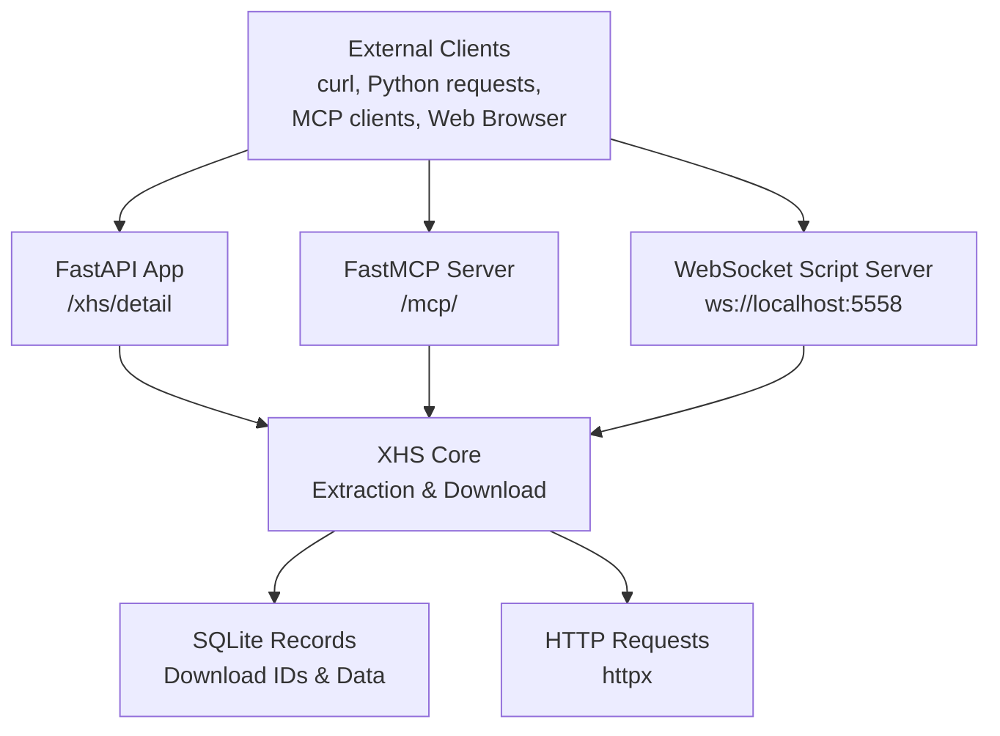
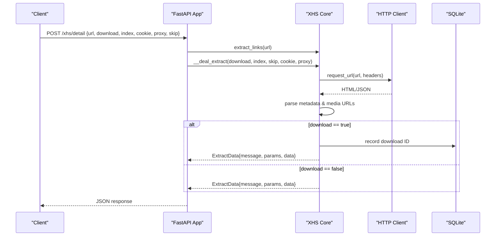
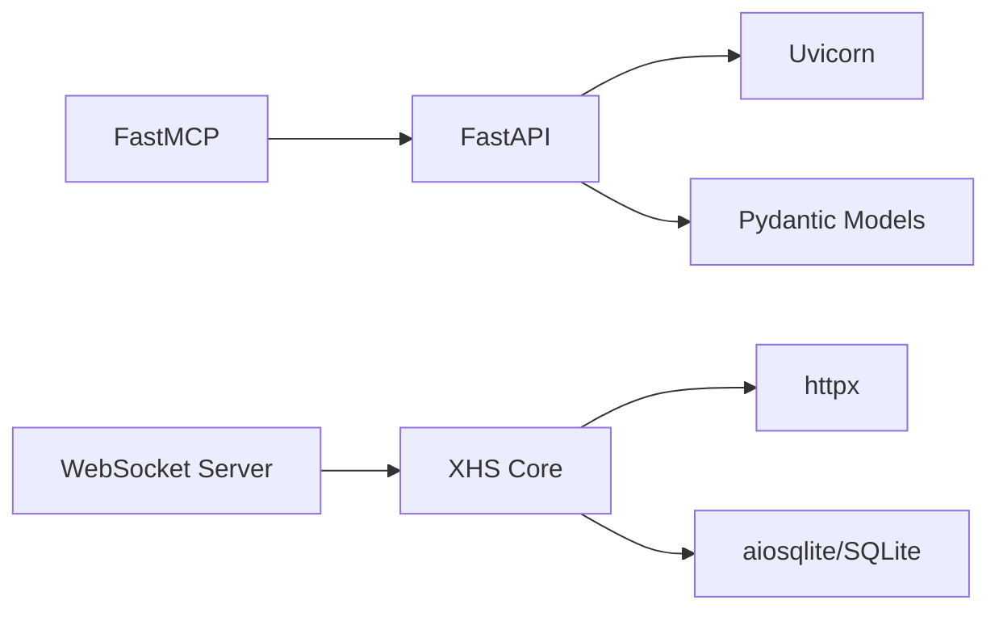

# API Server

<cite>
**Referenced Files in This Document**
- [main.py](file://main.py)
- [app.py](file://source/application/app.py)
- [model.py](file://source/module/model.py)
- [request.py](file://source/application/request.py)
- [tools.py](file://source/module/tools.py)
- [static.py](file://source/module/static.py)
- [settings.py](file://source/module/settings.py)
- [script.py](file://source/module/script.py)
- [README.md](file://README.md)
- [README_EN.md](file://README_EN.md)
- [requirements.txt](file://requirements.txt)
- [pyproject.toml](file://pyproject.toml)
</cite>

## Table of Contents
1. [Introduction](#introduction)
2. [Project Structure](#project-structure)
3. [Core Components](#core-components)
4. [Architecture Overview](#architecture-overview)
5. [Detailed Component Analysis](#detailed-component-analysis)
6. [Dependency Analysis](#dependency-analysis)
7. [Performance Considerations](#performance-considerations)
8. [Troubleshooting Guide](#troubleshooting-guide)
9. [Conclusion](#conclusion)
10. [Appendices](#appendices)

## Introduction
This document describes the RESTful API server built with FastAPI that exposes a single endpoint to extract RedNote (Little Red Book) content metadata and optionally download media files. It also documents the MCP server mode, WebSocket-based script server for real-time task pushing, and operational guidance for deployment, rate limiting, and security.

Key capabilities:
- Extract metadata and media URLs for a given RedNote post URL
- Optionally download media files and return structured results
- Streamable HTTP MCP server for external AI agents
- WebSocket server for real-time task pushing from browser userscripts
- Built-in request throttling and robust error handling

## Project Structure
The API server is implemented as part of a larger application. The FastAPI application is initialized inside the XHS core class and bound to a Uvicorn server. The MCP server is provided by the FastMCP library. A WebSocket script server enables real-time task forwarding from browser userscripts.

**Diagram sources**
- [app.py:685-704](file://source/application/app.py#L685-L704)
- [app.py:758-794](file://source/application/app.py#L758-L794)
- [script.py:10-47](file://source/module/script.py#L10-L47)

**Section sources**
- [main.py:17-42](file://main.py#L17-L42)
- [app.py:685-704](file://source/application/app.py#L685-L704)
- [app.py:758-794](file://source/application/app.py#L758-L794)
- [script.py:10-47](file://source/module/script.py#L10-L47)

## Core Components
- FastAPI application with a single endpoint to extract RedNote content
- Pydantic models for request/response validation
- HTTP client wrapper with retry and delay logic
- MCP server for AI agent integration
- WebSocket script server for browser userscript task pushing

**Section sources**
- [app.py:706-757](file://source/application/app.py#L706-L757)
- [model.py:4-17](file://source/module/model.py#L4-L17)
- [request.py:15-138](file://source/application/request.py#L15-L138)
- [tools.py:13-64](file://source/module/tools.py#L13-L64)
- [script.py:10-47](file://source/module/script.py#L10-L47)

## Architecture Overview
The server exposes:
- REST endpoint: POST /xhs/detail
- MCP endpoint: GET / (redirect) and MCP tools registered by the server
- WebSocket endpoint: ws://localhost:5558 for script server

**Diagram sources**
- [app.py:719-757](file://source/application/app.py#L719-L757)
- [request.py:26-70](file://source/application/request.py#L26-L70)
- [model.py:13-17](file://source/module/model.py#L13-L17)

## Detailed Component Analysis

### REST Endpoint: POST /xhs/detail
Purpose: Accept a RedNote post URL and optional parameters, return extracted metadata and optionally download media.

- Method: POST
- Path: /xhs/detail
- Request body: JSON with fields defined by ExtractParams
- Response: ExtractData model
- Tags: API

Request parameters (ExtractParams):
- url: str (required)
- download: bool (optional, default false)
- index: list[str|int] | None (optional)
- cookie: str | None (optional)
- proxy: str | None (optional)
- skip: bool (optional, default false)

Response model (ExtractData):
- message: str
- params: ExtractParams
- data: dict | None

Behavior:
- Validates and extracts a single RedNote post URL
- Optionally downloads media files and records IDs
- Skips previously downloaded items when skip is true
- Returns structured metadata and media URLs

Example usage:
- curl
  - curl -X POST http://127.0.0.1:5556/xhs/detail -H "Content-Type: application/json" -d '{"url":"<post_url>","download":true}'
- Python requests
  - requests.post("http://127.0.0.1:5556/xhs/detail", json={"url":"<post_url>","download":True})

Notes:
- The endpoint supports a single URL input; multiple URLs are not supported in a single request.
- When download is true, the operation takes longer due to network I/O.
- index is only effective for image/text posts and ignored when download is false.

**Section sources**
- [app.py:719-757](file://source/application/app.py#L719-L757)
- [model.py:4-17](file://source/module/model.py#L4-L17)
- [README.md:142-215](file://README.md#L142-L215)
- [README_EN.md:143-219](file://README_EN.md#L143-L219)

### Pydantic Models: ExtractParams and ExtractData
- ExtractParams: Defines the shape of the incoming request payload
- ExtractData: Defines the shape of the response payload

Validation:
- Strict field typing and defaults enforced by Pydantic
- index is validated as a list of strings or integers

**Section sources**
- [model.py:4-17](file://source/module/model.py#L4-L17)

### HTTP Client and Retry/Delay Logic
- Html.request_url wraps httpx to fetch HTML or resolve canonical URLs
- Supports optional cookie and proxy injection
- Built-in retry decorator and randomized delays to reduce rate-limit risk

Key behaviors:
- Retry decorator attempts up to a configured number of times
- Randomized wait between requests to avoid detection
- Proxy support for both headless and proxied requests

**Section sources**
- [request.py:15-138](file://source/application/request.py#L15-L138)
- [tools.py:13-64](file://source/module/tools.py#L13-L64)

### MCP Server (FastMCP)
The MCP server registers two tools:
- get_detail_data: Returns metadata for a RedNote post without downloading
- download_detail: Downloads media files; optionally returns metadata

Configuration:
- Transport: streamable-http
- URL: http://127.0.0.1:5556/mcp/

Usage examples are provided in the README for both modes.

**Section sources**
- [app.py:758-794](file://source/application/app.py#L758-L794)
- [README.md:216-236](file://README.md#L216-L236)
- [README_EN.md:220-240](file://README_EN.md#L220-L240)

### WebSocket Script Server
The script server listens on ws://localhost:5558 and accepts JSON tasks to trigger downloads. The browser userscript can push tasks to this server.

- Host/port configurable in settings
- Handles JSON payloads and forwards to core extraction/download pipeline
- Robust connection handling with graceful closure

**Section sources**
- [script.py:10-47](file://source/module/script.py#L10-L47)
- [README.md:263-282](file://README.md#L263-L282)
- [README_EN.md:267-287](file://README_EN.md#L267-L287)

## Dependency Analysis
External dependencies relevant to the API server:
- FastAPI: ASGI framework for REST and docs
- Uvicorn: ASGI server
- httpx: HTTP client with async support
- fastmcp: MCP server implementation
- websockets: WebSocket server for script tasks

**Diagram sources**
- [requirements.txt:11-28](file://requirements.txt#L11-L28)
- [pyproject.toml:11-25](file://pyproject.toml#L11-L25)

**Section sources**
- [requirements.txt:11-28](file://requirements.txt#L11-L28)
- [pyproject.toml:11-25](file://pyproject.toml#L11-L25)

## Performance Considerations
- Built-in request throttling: Randomized delays between requests to reduce platform-side rate limiting risk
- Chunked downloads: Configurable chunk size for efficient I/O
- Async I/O: httpx and Uvicorn enable concurrent handling of requests
- SQLite-backed records: Efficient caching of processed IDs to avoid repeated work

Recommendations:
- Tune chunk size and timeout based on network conditions
- Use proxies judiciously and test connectivity before use
- Avoid excessive concurrent downloads to prevent timeouts

**Section sources**
- [tools.py:54-64](file://source/module/tools.py#L54-L64)
- [settings.py:22-24](file://source/module/settings.py#L22-L24)
- [request.py:26-70](file://source/application/request.py#L26-L70)

## Troubleshooting Guide
Common issues and resolutions:
- Authentication and cookies
  - Some content requires cookies for higher quality or full metadata
  - Configure cookie in settings or pass via request
- Proxies
  - Use the proxy parameter or settings; test connectivity before relying on it
- Rate limiting and timeouts
  - The server applies randomized delays; adjust timeout and retry settings if needed
- Download records
  - Previously downloaded items are skipped; clear records if reprocessing is needed

Operational tips:
- Use the interactive docs at /docs or /redoc for quick testing
- Monitor logs for HTTP exceptions and retry attempts

**Section sources**
- [README.md:140-146](file://README.md#L140-L146)
- [README_EN.md:141-147](file://README_EN.md#L141-L147)
- [request.py:63-69](file://source/application/request.py#L63-L69)
- [settings.py:20-21](file://source/module/settings.py#L20-L21)

## Conclusion
The API server provides a focused, validated interface for extracting RedNote content and optionally downloading media. It integrates with MCP for AI agent workflows and with a WebSocket server for browser userscripts. Built-in retry and delay mechanisms improve reliability, while Pydantic models ensure predictable request/response shapes.

## Appendices

### API Reference

- Base URL: http://127.0.0.1:5556
- Interactive Docs: /docs, /redoc

Endpoint: POST /xhs/detail
- Request body: ExtractParams
- Response: ExtractData
- Example curl:
  - curl -X POST http://127.0.0.1:5556/xhs/detail -H "Content-Type: application/json" -d '{"url":"<post_url>","download":true}'
- Example Python requests:
  - requests.post("http://127.0.0.1:5556/xhs/detail", json={"url":"<post_url>","download":True})

MCP Server
- URL: http://127.0.0.1:5556/mcp/
- Tools:
  - get_detail_data: returns metadata for a post
  - download_detail: downloads media, optionally returns metadata

WebSocket Script Server
- URL: ws://localhost:5558
- Payload: JSON forwarded to core extraction/download pipeline

**Section sources**
- [app.py:719-757](file://source/application/app.py#L719-L757)
- [app.py:758-794](file://source/application/app.py#L758-L794)
- [script.py:22-26](file://source/module/script.py#L22-L26)
- [README.md:142-236](file://README.md#L142-L236)
- [README_EN.md:143-240](file://README_EN.md#L143-L240)

### Authentication, Rate Limiting, and Security
- Authentication: No API key required; optional cookie for richer content
- Rate limiting: Built-in randomized delays; adjust settings for stricter limits
- Security: No CORS configuration exposed; run behind a reverse proxy in production
- Proxies: Supported via request parameter or settings

**Section sources**
- [request.py:35-62](file://source/application/request.py#L35-L62)
- [settings.py:20-21](file://source/module/settings.py#L20-L21)
- [tools.py:54-64](file://source/module/tools.py#L54-L64)

### Deployment and Scaling
- Docker: Use the provided Dockerfile and run with ports mapped
- Reverse proxy: Place behind nginx/Apache to enable TLS and CORS if needed
- Scaling: Stateless API; scale horizontally behind a load balancer; persist Volume for settings and SQLite records

**Section sources**
- [README.md:104-126](file://README.md#L104-L126)
- [README_EN.md:105-127](file://README_EN.md#L105-L127)

### API Versioning and Compatibility
- Versioning: Application version embedded in FastAPI title and version fields
- Backward compatibility: Minimal breaking changes expected; consult release notes
- Deprecation policy: Not explicitly documented; follow project releases for changes

**Section sources**
- [app.py:691-695](file://source/application/app.py#L691-L695)
- [static.py:3-6](file://source/module/static.py#L3-L6)

### Integration Patterns
- External applications: Call /xhs/detail with JSON payloads
- Microservices: Use MCP server for AI agent orchestration
- Automation tools: Push tasks via WebSocket to script server for batch processing

**Section sources**
- [app.py:758-794](file://source/application/app.py#L758-L794)
- [script.py:22-26](file://source/module/script.py#L22-L26)
- [README.md:263-282](file://README.md#L263-L282)
- [README_EN.md:267-287](file://README_EN.md#L267-L287)