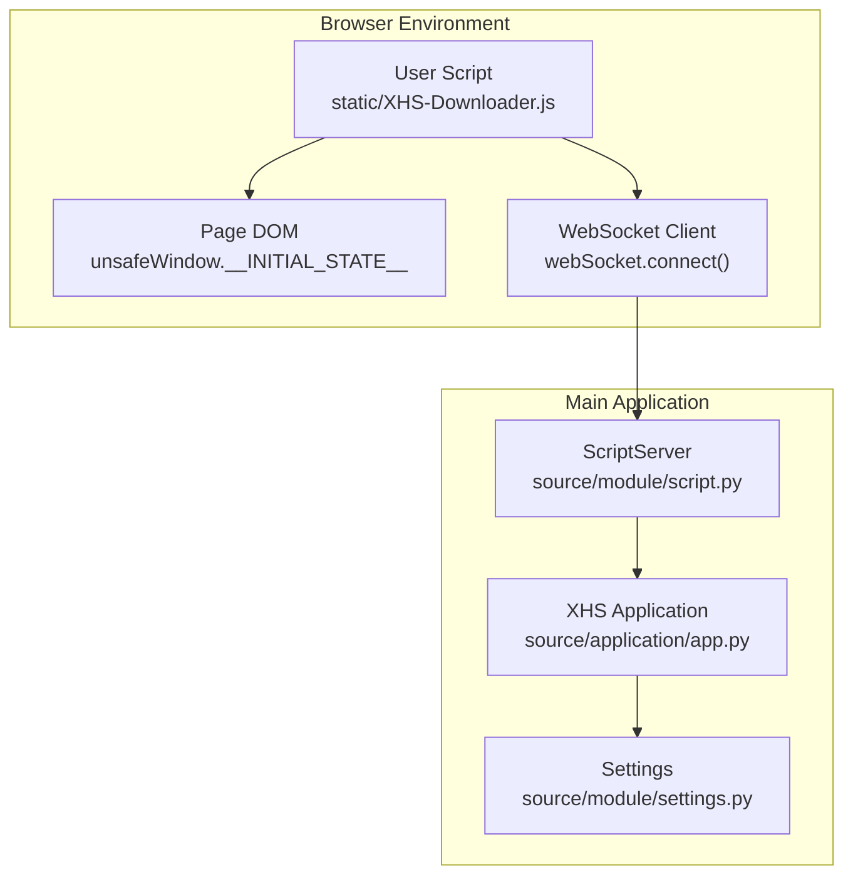
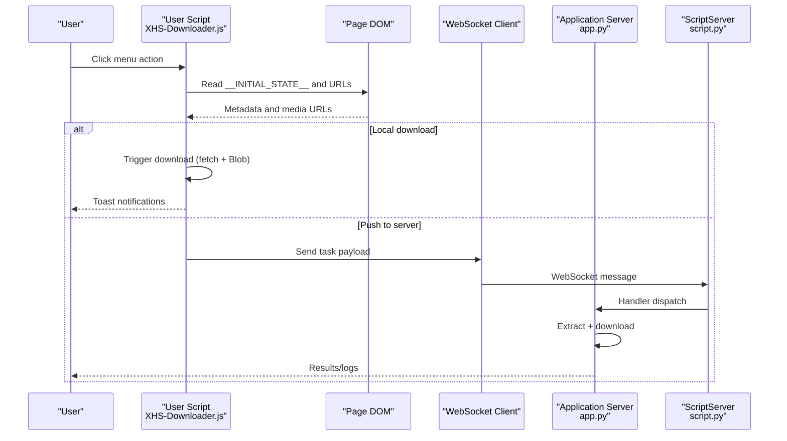
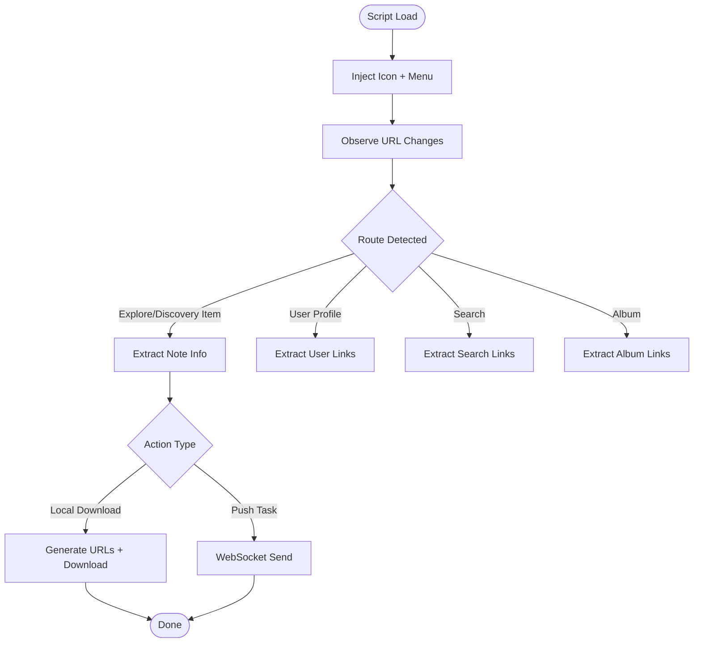
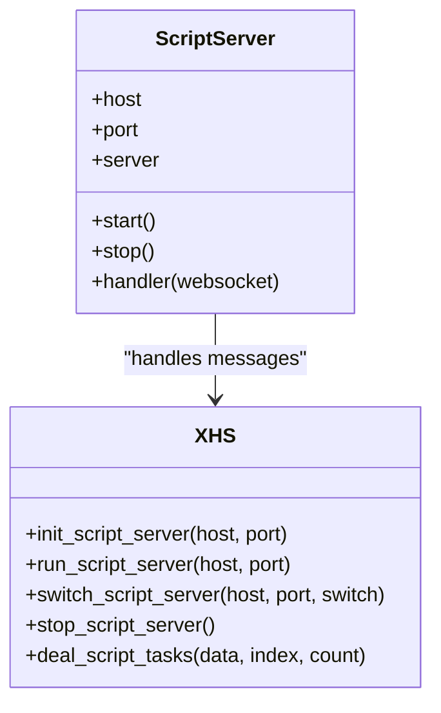
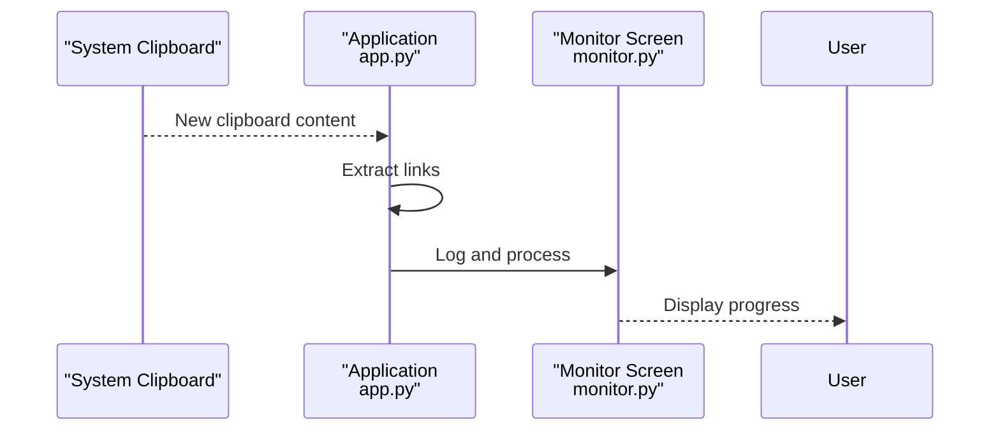
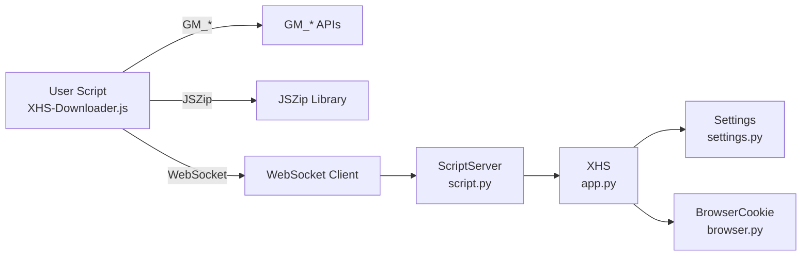

# Browser Integration

<cite>
**Referenced Files in This Document**
- [XHS-Downloader.js](file://static/XHS-Downloader.js)
- [app.py](file://source/application/app.py)
- [script.py](file://source/module/script.py)
- [settings.py](file://source/module/settings.py)
- [browser.py](file://source/expansion/browser.py)
- [README.md](file://README.md)
- [monitor.py](file://source/TUI/monitor.py)
</cite>

## Table of Contents
1. [Introduction](#introduction)
2. [Project Structure](#project-structure)
3. [Core Components](#core-components)
4. [Architecture Overview](#architecture-overview)
5. [Detailed Component Analysis](#detailed-component-analysis)
6. [Dependency Analysis](#dependency-analysis)
7. [Performance Considerations](#performance-considerations)
8. [Troubleshooting Guide](#troubleshooting-guide)
9. [Conclusion](#conclusion)
10. [Appendices](#appendices)

## Introduction
This document explains the browser integration for automatic content detection and download automation via a browser user script. It covers the user script architecture, installation across major browsers, URL detection, content extraction triggers, automatic download initiation, script injection and DOM manipulation, event handling, configuration options, and the relationship with the main application. It also addresses security considerations, permissions, compatibility, clipboard monitoring workflows, and troubleshooting guidance.

## Project Structure
The browser integration centers around a Tampermonkey-compatible user script that runs inside the target website’s pages. The script injects a floating menu and overlays, detects URL changes, extracts content metadata, and either downloads files locally or pushes tasks to the main application via a WebSocket server.

**Diagram sources**
- [XHS-Downloader.js:2420-2487](file://static/XHS-Downloader.js#L2420-L2487)
- [app.py:942-987](file://source/application/app.py#L942-L987)
- [script.py:10-47](file://source/module/script.py#L10-L47)
- [settings.py:10-37](file://source/module/settings.py#L10-L37)

**Section sources**
- [XHS-Downloader.js:1-120](file://static/XHS-Downloader.js#L1-L120)
- [README.md:245-283](file://README.md#L245-L283)

## Core Components
- User Script (Tampermonkey): Injects UI, monitors URL changes, extracts content, performs downloads, and communicates with the main application via WebSocket.
- Script Server: A WebSocket server embedded in the main application that receives tasks from the user script.
- Settings: Controls whether the script server is enabled and other runtime behaviors.
- Clipboard Monitoring: The main application can monitor the system clipboard for new links and process them automatically.

**Section sources**
- [XHS-Downloader.js:2420-2487](file://static/XHS-Downloader.js#L2420-L2487)
- [app.py:942-987](file://source/application/app.py#L942-L987)
- [settings.py:10-37](file://source/module/settings.py#L10-L37)
- [monitor.py:18-58](file://source/TUI/monitor.py#L18-L58)

## Architecture Overview
The browser user script integrates with the main application through a WebSocket-based pipeline:
- The user script runs on supported pages and exposes a floating menu.
- On user action, it extracts content metadata from the page DOM and initiates downloads or pushes tasks to the application.
- The application hosts a WebSocket server that accepts tasks and executes downloads.

**Diagram sources**
- [XHS-Downloader.js:543-585](file://static/XHS-Downloader.js#L543-L585)
- [XHS-Downloader.js:2420-2487](file://static/XHS-Downloader.js#L2420-L2487)
- [app.py:508-536](file://source/application/app.py#L508-L536)
- [script.py:22-26](file://source/module/script.py#L22-L26)

## Detailed Component Analysis

### User Script Architecture and Injection
- Injection and UI: The script creates a floating icon and a dynamic menu overlay. It injects styles and modals for settings, selection, and notifications.
- URL Detection: The script observes URL changes and updates the menu dynamically based on the current route.
- Content Extraction: It reads initial state from the page and generates note/user URLs or media URLs depending on the context.
- Downloads: It supports local downloads (single or batched ZIP) and server-side task pushing.

**Diagram sources**
- [XHS-Downloader.js:2252-2371](file://static/XHS-Downloader.js#L2252-L2371)
- [XHS-Downloader.js:543-585](file://static/XHS-Downloader.js#L543-L585)
- [XHS-Downloader.js:2420-2487](file://static/XHS-Downloader.js#L2420-L2487)

**Section sources**
- [XHS-Downloader.js:2252-2371](file://static/XHS-Downloader.js#L2252-L2371)
- [XHS-Downloader.js:543-585](file://static/XHS-Downloader.js#L543-L585)
- [XHS-Downloader.js:587-725](file://static/XHS-Downloader.js#L587-L725)

### URL Detection and Content Extraction Triggers
- Routes recognized: Explore, Discovery Item, User Profile, Search Results, Board/Album.
- Extraction triggers:
  - Single note page: Extract note metadata and media URLs.
  - User profile tabs: Extract published/liked/saved/all notes.
  - Search results: Extract note and user links.
  - Album: Extract note links from album feed.
- Automatic scrolling: Optional, controlled by user settings; scrolls to load more content when enabled.

**Section sources**
- [XHS-Downloader.js:563-585](file://static/XHS-Downloader.js#L563-L585)
- [XHS-Downloader.js:794-820](file://static/XHS-Downloader.js#L794-L820)
- [XHS-Downloader.js:829-845](file://static/XHS-Downloader.js#L829-L845)
- [XHS-Downloader.js:847-891](file://static/XHS-Downloader.js#L847-L891)
- [XHS-Downloader.js:755-792](file://static/XHS-Downloader.js#L755-L792)

### Automatic Download Initiation and Batch Packaging
- Local download:
  - Single note: Fetches media and triggers a temporary download link.
  - Multiple images: Optionally packages into a ZIP using JSZip.
- Server push:
  - Sends structured task data over WebSocket to the application server.
- Retry and error handling:
  - Download attempts with retry logic and user feedback via toasts.

**Section sources**
- [XHS-Downloader.js:587-725](file://static/XHS-Downloader.js#L587-L725)
- [XHS-Downloader.js:642-681](file://static/XHS-Downloader.js#L642-L681)
- [XHS-Downloader.js:700-725](file://static/XHS-Downloader.js#L700-L725)

### Script Injection Mechanism, DOM Manipulation, and Event Handling
- DOM access: Uses unsafeWindow to read initial state and extract note/user data.
- Overlay creation: Dynamically creates modals for settings, image selection, and lists.
- Event handling: Mouse enter/leave for menu visibility, click ripple effects, keyboard shortcuts, and URL change observation.
- Clipboard integration: Provides copy-to-clipboard for extracted links.

**Section sources**
- [XHS-Downloader.js:563-585](file://static/XHS-Downloader.js#L563-L585)
- [XHS-Downloader.js:1146-1208](file://static/XHS-Downloader.js#L1146-L1208)
- [XHS-Downloader.js:1570-1708](file://static/XHS-Downloader.js#L1570-L1708)
- [XHS-Downloader.js:1816-1982](file://static/XHS-Downloader.js#L1816-L1982)
- [XHS-Downloader.js:2373-2414](file://static/XHS-Downloader.js#L2373-L2414)

### Script Configuration Options and User Preferences
Key user-configurable options exposed in the script settings modal:
- Auto-scroll page: Enable/disable and configure scroll count.
- Package files for download: Toggle ZIP packaging for multiple images.
- Link extraction selection mode: Toggle confirmation selection for links.
- Image download selection mode: Toggle confirmation selection for images.
- Keep menu visible: Persist menu visibility without hover.
- Script server URL and switch: Configure WebSocket endpoint and toggle connection.
- Image download format: Choose preferred image format.
- File naming format: Placeholder for future use.

These settings are persisted via GM_getValue/GM_setValue and reflected immediately in the UI.

**Section sources**
- [XHS-Downloader.js:307-334](file://static/XHS-Downloader.js#L307-L334)
- [XHS-Downloader.js:1349-1478](file://static/XHS-Downloader.js#L1349-L1478)

### Relationship Between Browser Scripts and Main Application
- Script server lifecycle: Controlled by application settings; can be started/stopped programmatically.
- Task handling: The application’s ScriptServer receives messages and delegates to the extraction/download pipeline.
- Clipboard monitoring: The application can monitor the system clipboard and process links automatically.

**Diagram sources**
- [script.py:10-47](file://source/module/script.py#L10-L47)
- [app.py:942-987](file://source/application/app.py#L942-L987)
- [app.py:508-536](file://source/application/app.py#L508-L536)

**Section sources**
- [app.py:942-987](file://source/application/app.py#L942-L987)
- [script.py:22-26](file://source/module/script.py#L22-L26)

### Security Considerations, Permissions, and Compatibility
- Permissions: The script declares required grants for storage, clipboard, and unsafeWindow access.
- Compatibility: Works with Tampermonkey on major browsers; tested on Chrome, Firefox, Edge, and Safari.
- Risk mitigation: Automatic scrolling is disabled by default and warned as potentially risky.

**Section sources**
- [XHS-Downloader.js:1-30](file://static/XHS-Downloader.js#L1-L30)
- [README.md:245-283](file://README.md#L245-L283)

### Clipboard Monitoring and Automatic Detection Workflows
- Browser script: Provides link extraction and copying to clipboard.
- Application: Monitors system clipboard, extracts links, and processes them automatically.

**Diagram sources**
- [app.py:603-642](file://source/application/app.py#L603-L642)
- [monitor.py:18-58](file://source/TUI/monitor.py#L18-L58)

**Section sources**
- [app.py:603-642](file://source/application/app.py#L603-L642)
- [monitor.py:18-58](file://source/TUI/monitor.py#L18-L58)

## Dependency Analysis
- User Script depends on:
  - unsafeWindow for initial state access.
  - GM_* APIs for storage, clipboard, and menu commands.
  - JSZip for packaging multiple images.
  - WebSocket client for server communication.
- Application depends on:
  - ScriptServer for WebSocket handling.
  - Settings for runtime configuration.
  - BrowserCookie utility for cross-browser cookie reading (optional).

**Diagram sources**
- [XHS-Downloader.js:1-30](file://static/XHS-Downloader.js#L1-L30)
- [XHS-Downloader.js:2420-2487](file://static/XHS-Downloader.js#L2420-L2487)
- [script.py:10-47](file://source/module/script.py#L10-L47)
- [app.py:942-987](file://source/application/app.py#L942-L987)
- [settings.py:10-37](file://source/module/settings.py#L10-L37)
- [browser.py:26-120](file://source/expansion/browser.py#L26-L120)

**Section sources**
- [XHS-Downloader.js:1-30](file://static/XHS-Downloader.js#L1-L30)
- [script.py:10-47](file://source/module/script.py#L10-L47)
- [app.py:942-987](file://source/application/app.py#L942-L987)
- [settings.py:10-37](file://source/module/settings.py#L10-L37)
- [browser.py:26-120](file://source/expansion/browser.py#L26-L120)

## Performance Considerations
- Automatic scrolling: Disabled by default; enabling increases page load and potential detection risk.
- Batch downloads: ZIP packaging reduces multiple requests but increases memory usage.
- Retry logic: Fetch retries improve reliability under transient network errors.
- Debounced UI updates: URL observer avoids excessive re-renders.

[No sources needed since this section provides general guidance]

## Troubleshooting Guide
Common issues and resolutions:
- Script fails to connect to server:
  - Verify script_server is enabled in settings and the application is running.
  - Check WebSocket URL and firewall settings.
- Downloads fail:
  - Disable global proxies or adjust network settings.
  - Retry downloads; the script includes retry logic.
- Automatic scrolling detected:
  - Disable auto-scroll in settings to reduce risk.
- Clipboard monitoring not working:
  - Ensure clipboard access permissions and OS-specific clipboard utilities are installed.
- Browser compatibility:
  - Confirm Tampermonkey is installed and up to date.
  - Some browsers may require additional steps for script installation.

**Section sources**
- [README.md:263-283](file://README.md#L263-L283)
- [XHS-Downloader.js:2437-2440](file://static/XHS-Downloader.js#L2437-L2440)
- [app.py:603-642](file://source/application/app.py#L603-L642)

## Conclusion
The browser integration provides a seamless bridge between the website and the main application. The user script automates content detection and download initiation, while the application handles robust processing and optional server-side task execution. Proper configuration, awareness of risks, and troubleshooting practices ensure reliable operation across browsers.

[No sources needed since this section summarizes without analyzing specific files]

## Appendices

### Installation Guides

- Chrome
  - Install Tampermonkey from the Chrome Web Store.
  - Add the user script from the raw URL provided in the project documentation.
  - Refresh the target website to activate the script.

- Firefox
  - Install Tampermonkey from the Firefox Add-ons site.
  - Add the user script via the raw URL.
  - Reload the target website.

- Edge
  - Install Tampermonkey from the Microsoft Edge Add-ons site.
  - Add the user script via the raw URL.
  - Reload the target website.

- Safari
  - Install Tampermonkey for Safari.
  - Add the user script via the raw URL.
  - Reload the target website.

**Section sources**
- [README.md:245-262](file://README.md#L245-L262)

### Script Customization and Extension Patterns
- Modify settings at runtime via the in-script settings modal.
- Extend WebSocket tasks by adding fields to the payload and handling them in the application’s handler.
- Customize download formats and naming rules by adjusting settings and server configuration.
- Integrate with clipboard monitoring by enabling the application’s monitor mode.

**Section sources**
- [XHS-Downloader.js:1349-1478](file://static/XHS-Downloader.js#L1349-L1478)
- [app.py:508-536](file://source/application/app.py#L508-L536)
- [settings.py:10-37](file://source/module/settings.py#L10-L37)