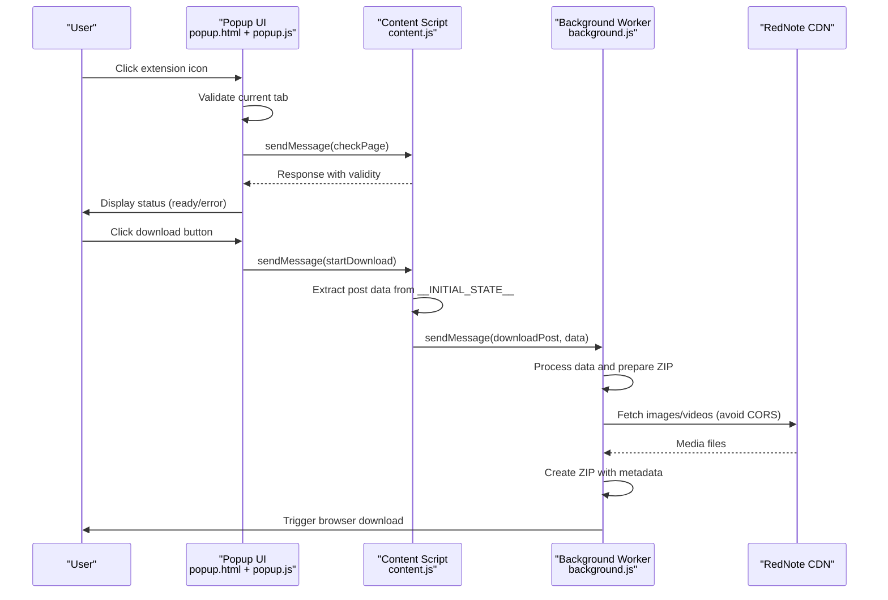
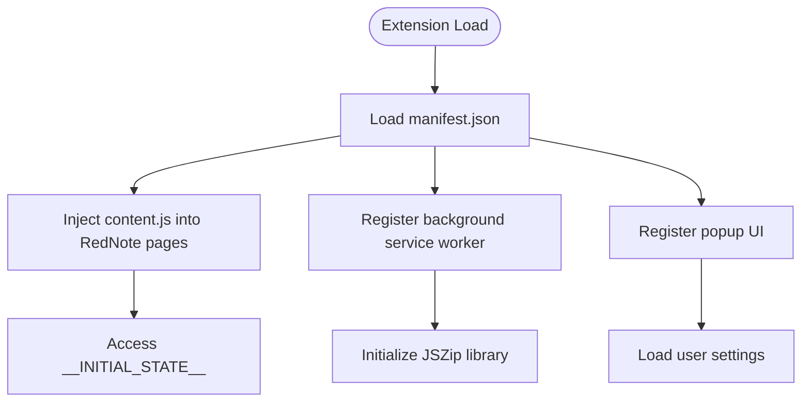
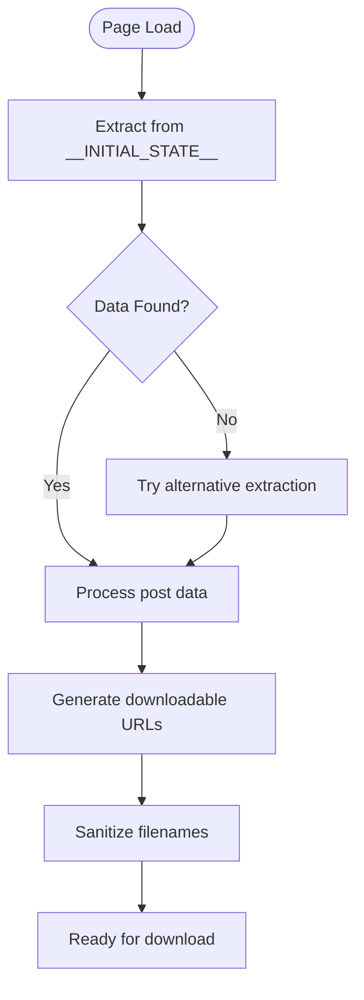
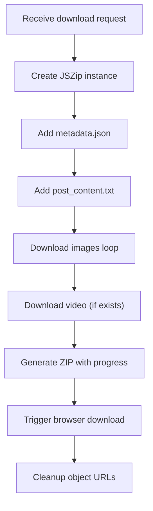
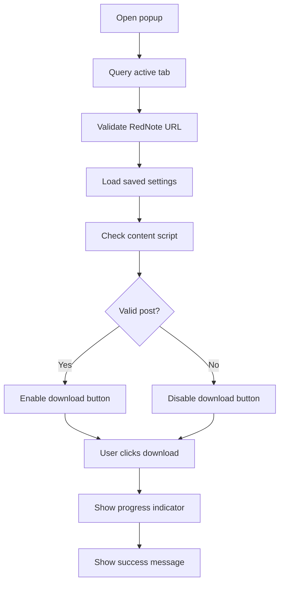
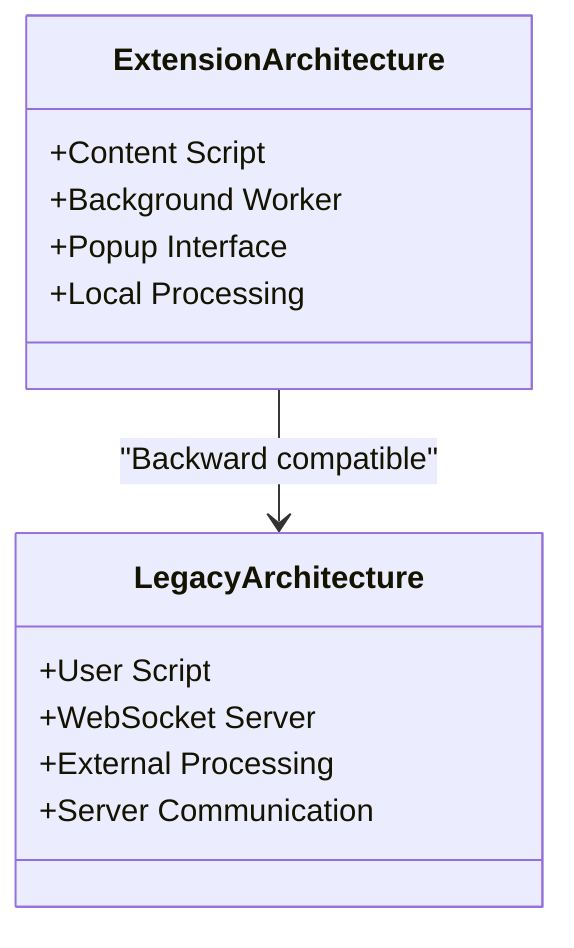
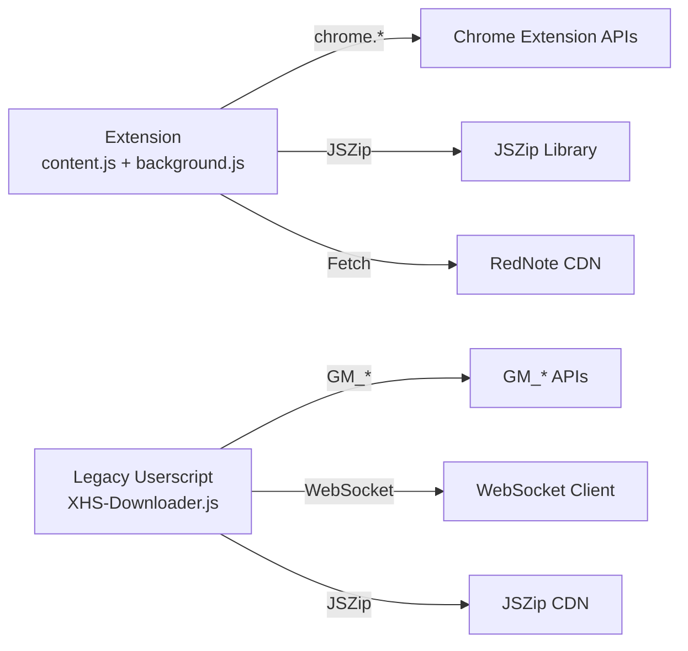

# Browser Integration

<cite>
**Referenced Files in This Document**
- [manifest.json](file://extension/manifest.json)
- [content.js](file://extension/content.js)
- [background.js](file://extension/background.js)
- [popup.js](file://extension/popup.js)
- [popup.html](file://extension/popup.html)
- [README.md](file://extension/README.md)
- [IMPLEMENTATION_SUMMARY.md](file://extension/IMPLEMENTATION_SUMMARY.md)
- [QUICKSTART.md](file://extension/QUICKSTART.md)
- [XHS-Downloader.js](file://static/XHS-Downloader.js)
- [app.py](file://source/application/app.py)
- [script.py](file://source/module/script.py)
- [settings.py](file://source/module/settings.py)
- [browser.py](file://source/expansion/browser.py)
- [README.md](file://README.md)
- [monitor.py](file://source/TUI/monitor.py)
</cite>

## Update Summary
**Changes Made**
- Complete migration from Tampermonkey userscript to Chrome/Edge browser extension architecture
- Updated interface from floating menu to popup-based interface
- Added documentation for new extension components: content.js, background.js, popup.js
- Removed all Tampermonkey installation procedures and references
- Updated architecture diagrams to reflect new extension-based approach
- Added comprehensive extension installation and usage documentation

## Table of Contents
1. [Introduction](#introduction)
2. [Project Structure](#project-structure)
3. [Core Components](#core-components)
4. [Architecture Overview](#architecture-overview)
5. [Detailed Component Analysis](#detailed-component-analysis)
6. [Dependency Analysis](#dependency-analysis)
7. [Performance Considerations](#performance-considerations)
8. [Troubleshooting Guide](#troubleshooting-guide)
9. [Conclusion](#conclusion)
10. [Appendices](#appendices)

## Introduction
This document explains the browser integration for automatic content detection and download automation via a modern Chrome/Edge browser extension. The extension replaces the previous Tampermonkey userscript with a more robust, secure, and user-friendly architecture featuring a popup-based interface. It covers the extension architecture, installation across Chrome and Edge browsers, URL detection, content extraction triggers, automatic download initiation, script injection and DOM manipulation, event handling, configuration options, and the relationship with the main application. It also addresses security considerations, permissions, compatibility, clipboard monitoring workflows, and troubleshooting guidance.

## Project Structure
The browser integration now centers around a Chrome/Edge extension with a popup-based interface. The extension consists of three main components: a content script that extracts post data from RedNote pages, a background service worker that handles downloads and ZIP creation, and a popup UI that provides user interaction and settings.

```mermaid
graph TB
subgraph "Extension Architecture"
EXT["Chrome/Edge Extension<br/>manifest.json"]
CONTENT["Content Script<br/>content.js"]
BACKGROUND["Background Service Worker<br/>background.js"]
POPUP["Popup UI<br/>popup.html + popup.js"]
END
subgraph "RedNote Website"
DOM["Page DOM<br/>__INITIAL_STATE__"]
END
subgraph "Downloads System"
DOWNLOADS["Browser Downloads API"]
ZIP["JSZip Library<br/>lib/jszip.min.js"]
END
EXT --> CONTENT
EXT --> BACKGROUND
EXT --> POPUP
CONTENT --> DOM
BACKGROUND --> DOWNLOADS
BACKGROUND --> ZIP
POPUP --> CONTENT
POPUP --> BACKGROUND
```

**Diagram sources**
- [manifest.json:1-39](file://extension/manifest.json#L1-L39)
- [content.js:1-241](file://extension/content.js#L1-L241)
- [background.js:1-294](file://extension/background.js#L1-L294)
- [popup.js:1-137](file://extension/popup.js#L1-L137)

**Section sources**
- [manifest.json:1-39](file://extension/manifest.json#L1-L39)
- [README.md:1-227](file://extension/README.md#L1-L227)
- [IMPLEMENTATION_SUMMARY.md:1-174](file://extension/IMPLEMENTATION_SUMMARY.md#L1-L174)

## Core Components
- **Content Script**: Extracts post data from RedNote pages, generates downloadable URLs, and communicates with background scripts via messaging.
- **Background Service Worker**: Handles all file downloads, ZIP creation, retry logic, and browser download triggers.
- **Popup Interface**: Provides user interaction, validation of current page, settings management, and download initiation.
- **JSZip Library**: Local ZIP creation for organizing downloaded content.
- **Permissions System**: Minimal permissions for activeTab, downloads, storage, and RedNote domain access.

**Section sources**
- [content.js:1-241](file://extension/content.js#L1-L241)
- [background.js:1-294](file://extension/background.js#L1-L294)
- [popup.js:1-137](file://extension/popup.js#L1-L137)
- [popup.html:1-194](file://extension/popup.html#L1-L194)

## Architecture Overview
The browser extension integrates with RedNote through a three-tier architecture:
- **Content Script**: Runs on RedNote pages and extracts post data from the page's initial state.
- **Background Service Worker**: Handles all network operations, avoiding CORS issues and managing download queues.
- **Popup Interface**: Provides user interaction, validates page context, and manages settings persistence.



**Diagram sources**
- [popup.js:21-63](file://extension/popup.js#L21-L63)
- [popup.js:71-110](file://extension/popup.js#L71-L110)
- [content.js:223-235](file://extension/content.js#L223-L235)
- [background.js:7-20](file://extension/background.js#L7-L20)

## Detailed Component Analysis

### Extension Architecture and Installation
- **Manifest V3 Compliance**: The extension follows modern Chrome extension standards with proper permissions and service worker architecture.
- **Development Installation**: Direct installation from the extension folder for development and testing.
- **Production Installation**: Available through Chrome Web Store (future release).
- **Icon System**: Blue placeholder icons with SVG support for scalability.



**Diagram sources**
- [manifest.json:27-37](file://extension/manifest.json#L27-L37)
- [background.js:4-5](file://extension/background.js#L4-L5)
- [popup.js:10-19](file://extension/popup.js#L10-L19)

**Section sources**
- [manifest.json:1-39](file://extension/manifest.json#L1-L39)
- [README.md:32-52](file://extension/README.md#L32-L52)
- [QUICKSTART.md:3-21](file://extension/QUICKSTART.md#L3-L21)

### Content Script Architecture and Data Extraction
- **Post Data Extraction**: Reads post information from `window.__INITIAL_STATE__` with fallback mechanisms.
- **Media URL Generation**: Converts RedNote CDN URLs to downloadable formats with configurable output formats.
- **Comment Extraction**: Parses DOM to extract pinned comments from post pages.
- **Filename Sanitization**: Ensures safe file naming for ZIP archives.
- **Cross-Script Communication**: Uses `chrome.runtime.sendMessage` for bidirectional communication.



**Diagram sources**
- [content.js:9-29](file://extension/content.js#L9-L29)
- [content.js:121-181](file://extension/content.js#L121-L181)
- [content.js:183-221](file://extension/content.js#L183-L221)

**Section sources**
- [content.js:9-29](file://extension/content.js#L9-L29)
- [content.js:121-181](file://extension/content.js#L121-L181)
- [content.js:183-221](file://extension/content.js#L183-L221)

### Background Service Worker and Download Processing
- **Download Management**: Handles all file downloads to avoid CORS restrictions and manage download queues.
- **ZIP Creation**: Uses JSZip to create organized archives with metadata.json and formatted text content.
- **Retry Logic**: Implements exponential backoff for failed downloads with configurable retry attempts.
- **Rate Limiting**: Adds delays between downloads to prevent being rate-limited by RedNote servers.
- **Progress Tracking**: Provides real-time progress updates during ZIP generation.



**Diagram sources**
- [background.js:22-107](file://extension/background.js#L22-L107)
- [background.js:109-155](file://extension/background.js#L109-L155)
- [background.js:157-244](file://extension/background.js#L157-L244)

**Section sources**
- [background.js:22-107](file://extension/background.js#L22-L107)
- [background.js:109-155](file://extension/background.js#L109-L155)
- [background.js:157-244](file://extension/background.js#L157-L244)

### Popup Interface and User Experience
- **Validation System**: Checks current tab URL and content script availability before enabling download.
- **Status Indicators**: Real-time status updates with color-coded feedback (ready, downloading, error, success).
- **Settings Management**: Persistent settings using `chrome.storage.sync` with immediate application.
- **Progress Feedback**: Animated spinner and progress indicators during download operations.
- **Error Handling**: Comprehensive error messages with actionable solutions.



**Diagram sources**
- [popup.js:21-63](file://extension/popup.js#L21-L63)
- [popup.js:71-110](file://extension/popup.js#L71-L110)
- [popup.js:121-132](file://extension/popup.js#L121-L132)

**Section sources**
- [popup.js:1-137](file://extension/popup.js#L1-L137)
- [popup.html:1-194](file://extension/popup.html#L1-L194)

### Extension Configuration and Settings
Key user-configurable options exposed through the popup interface:
- **Image Format**: Choose between JPEG, PNG, or WEBP output formats (default: JPEG)
- **Settings Persistence**: Automatically saved using `chrome.storage.sync`
- **Real-time Updates**: Settings apply immediately without restart requirements
- **Responsive Design**: Optimized 320px width for popup interface

**Section sources**
- [popup.js:10-19](file://extension/popup.js#L10-L19)
- [popup.html:176-183](file://extension/popup.html#L176-L183)

### Relationship Between Extension and Main Application
**Updated** The extension operates independently without requiring the main application server. However, the original Tampermonkey userscript architecture with WebSocket server integration is maintained for backward compatibility.

- **Independent Operation**: Extension runs entirely within the browser without external server dependencies
- **Backward Compatibility**: Original userscript architecture preserved for users who prefer the legacy approach
- **Dual Path**: Users can choose between modern extension or legacy userscript based on preference



**Diagram sources**
- [content.js:1-241](file://extension/content.js#L1-L241)
- [background.js:1-294](file://extension/background.js#L1-L294)
- [popup.js:1-137](file://extension/popup.js#L1-L137)

**Section sources**
- [content.js:1-241](file://extension/content.js#L1-L241)
- [background.js:1-294](file://extension/background.js#L1-L294)
- [popup.js:1-137](file://extension/popup.js#L1-L137)

### Security Considerations, Permissions, and Compatibility
- **Minimal Permissions**: Only requires activeTab, downloads, and storage permissions
- **Domain Access**: Limited to `*://www.xiaohongshu.com/*` for security
- **Local Processing**: All operations happen within the browser without external data transmission
- **CORS Bypass**: Achieved through background script rather than userscript grants
- **Privacy Protection**: No analytics, tracking, or external data collection
- **Browser Compatibility**: Chrome 88+ and Edge 88+ (Manifest V3 requirement)

**Section sources**
- [manifest.json:6-13](file://extension/manifest.json#L6-L13)
- [README.md:156-160](file://extension/README.md#L156-L160)
- [README.md:145-149](file://extension/README.md#L145-L149)

### Clipboard Monitoring and Automatic Detection Workflows
**Updated** The extension focuses on direct post download rather than clipboard monitoring. Clipboard functionality is maintained for users who prefer the legacy userscript approach.

- **Direct Download Focus**: Primary workflow emphasizes downloading from current page context
- **Legacy Clipboard Support**: Maintains clipboard extraction capabilities for users preferring the original approach
- **Integration Points**: Can complement main application's clipboard monitoring features

**Section sources**
- [README.md:114-136](file://extension/README.md#L114-L136)
- [XHS-Downloader.js:107-110](file://static/XHS-Downloader.js#L107-L110)

## Dependency Analysis
- **Extension Dependencies**:
  - JSZip library for ZIP creation (locally included)
  - Chrome Extension APIs for messaging, downloads, storage
  - RedNote CDN for media content access
- **Legacy Script Dependencies**:
  - GM_* APIs for storage, clipboard, and menu commands
  - WebSocket client for server communication
  - External JSZip CDN for packaging



**Diagram sources**
- [content.js:1-241](file://extension/content.js#L1-L241)
- [background.js:4-5](file://extension/background.js#L4-L5)
- [XHS-Downloader.js:18-36](file://static/XHS-Downloader.js#L18-L36)

**Section sources**
- [content.js:1-241](file://extension/content.js#L1-L241)
- [background.js:4-5](file://extension/background.js#L4-L5)
- [XHS-Downloader.js:18-36](file://static/XHS-Downloader.js#L18-L36)

## Performance Considerations
- **Background Processing**: Network operations handled by background script to avoid UI blocking
- **Rate Limiting**: 300ms delays between downloads to prevent rate limiting
- **Retry Logic**: 3 attempts with exponential backoff for failed downloads
- **Memory Management**: Object URLs revoked after 60 seconds to prevent memory leaks
- **ZIP Generation**: Streaming ZIP creation to handle large files efficiently

## Troubleshooting Guide
Common issues and resolutions for the extension:
- **"Not a RedNote post page"**: Ensure URL contains `/explore/` or `/discovery/item/`
- **"Content script not loaded"**: Refresh page and verify extension is properly installed
- **Download fails**: Check internet connection and RedNote accessibility
- **ZIP file incomplete**: Network issues may cause individual file failures
- **Settings not saving**: Verify `chrome.storage.sync` permissions are granted

**Section sources**
- [README.md:114-136](file://extension/README.md#L114-L136)
- [QUICKSTART.md:56-64](file://extension/QUICKSTART.md#L56-L64)

## Conclusion
The browser extension provides a modern, secure, and user-friendly alternative to the legacy Tampermonkey userscript. With its popup-based interface, local processing capabilities, and comprehensive error handling, it offers a superior user experience while maintaining backward compatibility with the original architecture. The extension's modular design ensures reliable operation across Chrome and Edge browsers with minimal resource usage.

## Appendices

### Installation Guides

#### Chrome/Edge Browser Installation
1. **Open Extensions Management**
   - Navigate to `chrome://extensions/` (Chrome) or `edge://extensions/` (Edge)
2. **Enable Developer Mode**
   - Toggle "Developer mode" in the top-right corner
3. **Load Unpacked Extension**
   - Click "Load unpacked" button
   - Select the `extension` folder from the repository
   - Verify extension icon appears in toolbar
4. **Pin Extension**
   - Click the pin icon to add to toolbar for easy access

#### Verification Steps
- Navigate to any RedNote post (e.g., `https://www.xiaohongshu.com/explore/...`)
- Click extension icon to open popup
- Should display "✓ Ready to download" status
- Download button should be enabled

**Section sources**
- [README.md:32-52](file://extension/README.md#L32-L52)
- [QUICKSTART.md:3-21](file://extension/QUICKSTART.md#L3-L21)

### Legacy Tampermonkey Userscript Installation (Deprecated)
**Updated** This section is maintained for users who prefer the original approach or need backward compatibility.

- **Chrome/Firefox/Edge/Safari**: Install Tampermonkey extension
- **Script Installation**: Add userscript from raw URL provided in project documentation
- **Verification**: Refresh RedNote page to activate script functionality

**Section sources**
- [README.md:245-283](file://README.md#L245-L283)
- [SCRIPT_README.md:17-35](file://static/SCRIPT_README.md#L17-L35)

### Extension Customization and Enhancement Patterns
- **Icon Customization**: Replace placeholder icons in `icons/` folder with custom designs
- **Feature Extensions**: Add batch download support, comment extraction, or custom filename templates
- **UI Improvements**: Enhance popup interface with progress bars and notification system
- **Performance Optimization**: Implement download queuing for large posts and improved error recovery

**Section sources**
- [IMPLEMENTATION_SUMMARY.md:150-159](file://extension/IMPLEMENTATION_SUMMARY.md#L150-L159)
- [README.md:180-185](file://extension/README.md#L180-L185)