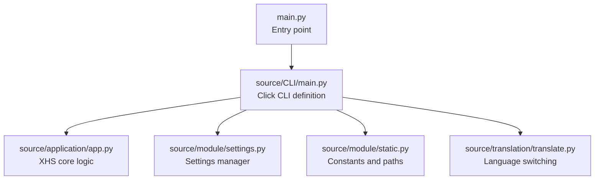
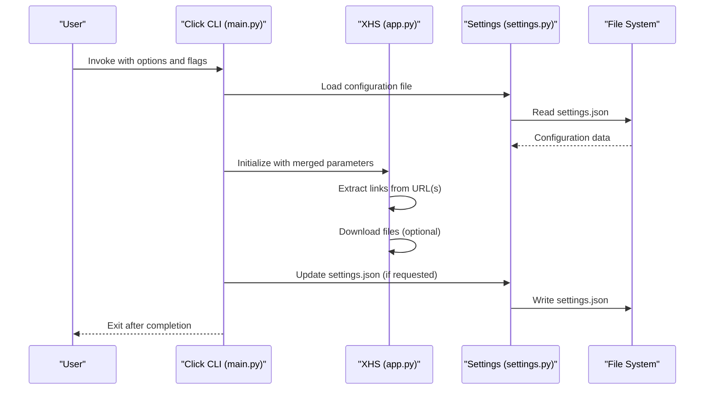
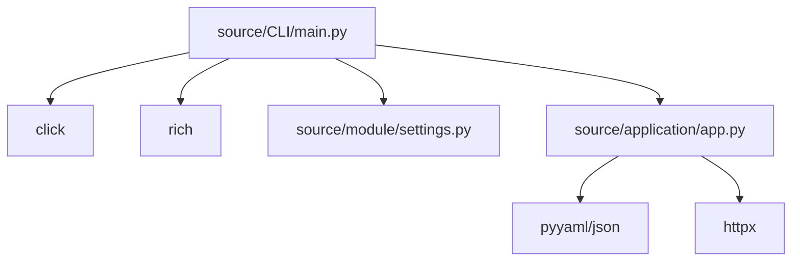

# Command Line Interface

<cite>
**Referenced Files in This Document**
- [source/CLI/main.py](file://source/CLI/main.py)
- [source/CLI/__init__.py](file://source/CLI/__init__.py)
- [main.py](file://main.py)
- [source/application/app.py](file://source/application/app.py)
- [source/module/settings.py](file://source/module/settings.py)
- [source/module/static.py](file://source/module/static.py)
- [source/module/tools.py](file://source/module/tools.py)
- [source/translation/translate.py](file://source/translation/translate.py)
- [README.md](file://README.md)
- [Dockerfile](file://Dockerfile)
- [pyproject.toml](file://pyproject.toml)
- [requirements.txt](file://requirements.txt)
- [example.py](file://example.py)
</cite>

## Table of Contents
1. [Introduction](#introduction)
2. [Project Structure](#project-structure)
3. [Core Components](#core-components)
4. [Architecture Overview](#architecture-overview)
5. [Detailed Component Analysis](#detailed-component-analysis)
6. [Dependency Analysis](#dependency-analysis)
7. [Performance Considerations](#performance-considerations)
8. [Troubleshooting Guide](#troubleshooting-guide)
9. [Conclusion](#conclusion)
10. [Appendices](#appendices)

## Introduction
This document provides comprehensive guidance for the command line interface (CLI) powered by Click. It covers all available commands, parameters, and flags; explains parameter validation, type conversion, and error handling; details the command structure including extraction commands, download options, and configuration management; and offers practical usage examples for single URL downloads, batch processing, and automated workflows. It also documents environment variable support, configuration file integration, command chaining capabilities, exit codes, logging levels, output formatting, advanced usage patterns for scripting and CI/CD, platform-specific considerations, and troubleshooting tips.

## Project Structure
The CLI entrypoint is defined in the Click module and integrates with the core application logic. The main entrypoint script routes to the CLI when invoked without special arguments.

**Diagram sources**
- [main.py:45-60](file://main.py#L45-L60)
- [source/CLI/main.py:224-378](file://source/CLI/main.py#L224-L378)
- [source/application/app.py:98-194](file://source/application/app.py#L98-L194)
- [source/module/settings.py:10-124](file://source/module/settings.py#L10-L124)
- [source/module/static.py:1-73](file://source/module/static.py#L1-L73)
- [source/translation/translate.py:8-88](file://source/translation/translate.py#L8-L88)

**Section sources**
- [main.py:45-60](file://main.py#L45-L60)
- [source/CLI/main.py:224-378](file://source/CLI/main.py#L224-L378)

## Core Components
- Click CLI definition: Declares all command-line options and flags, sets up language switching, and orchestrates the CLI lifecycle.
- CLI class: Wraps application initialization, parameter merging, settings updates, and asynchronous execution.
- Application core: Implements extraction, download, and logging logic for URLs and works with configuration.
- Settings manager: Reads, creates, updates, and migrates configuration files.
- Static constants: Provides project metadata, default paths, and default values.
- Translation: Switches language for CLI help and messages.

Key responsibilities:
- Parse and validate CLI parameters.
- Merge CLI-provided overrides with configuration file settings.
- Initialize the application with merged parameters.
- Execute extraction and optional download for provided URLs.
- Persist configuration updates when requested.

**Section sources**
- [source/CLI/main.py:39-101](file://source/CLI/main.py#L39-L101)
- [source/CLI/main.py:224-378](file://source/CLI/main.py#L224-L378)
- [source/application/app.py:98-194](file://source/application/app.py#L98-L194)
- [source/module/settings.py:52-124](file://source/module/settings.py#L52-L124)
- [source/module/static.py:7-11](file://source/module/static.py#L7-L11)
- [source/translation/translate.py:79-88](file://source/translation/translate.py#L79-L88)

## Architecture Overview
The CLI architecture follows a layered design: Click CLI layer, application layer, and persistence/configuration layer.

**Diagram sources**
- [source/CLI/main.py:39-101](file://source/CLI/main.py#L39-L101)
- [source/CLI/main.py:224-378](file://source/CLI/main.py#L224-L378)
- [source/application/app.py:317-356](file://source/application/app.py#L317-L356)
- [source/module/settings.py:52-92](file://source/module/settings.py#L52-L92)

## Detailed Component Analysis

### Click CLI Definition and Options
The CLI defines a single command named after the project and exposes numerous options and flags. Options include URL input, index selection, path and naming controls, network and download parameters, toggles for image/video/live downloads, archive modes, and configuration management.

Highlights:
- URL input accepts multiple links separated by spaces; the application extracts valid links automatically.
- Index selection allows specifying picture indices for image/image-set posts.
- Path and naming options control output location and filename templates.
- Network and download tuning options include proxy, timeout, chunk size, and retry count.
- Image format selection supports PNG, WEBP, JPEG, HEIC, AUTO.
- Video preference selects resolution, bitrate, or size priority.
- Archive modes enable per-work and per-author folder organization.
- Language selection switches UI and help text.
- Settings integration supports reading a specific configuration file and updating it.

Validation and conversion:
- Boolean flags accept multiple forms (true/false, 1/0, yes/no, on/off).
- Integer options convert to integers when provided.
- Choice options restrict values to predefined sets.
- Path options validate filesystem paths.

Help and version:
- Built-in help prints a formatted table of parameters.
- Version flag prints project metadata and exits.

**Section sources**
- [source/CLI/main.py:224-378](file://source/CLI/main.py#L224-L378)
- [source/CLI/main.py:112-221](file://source/CLI/main.py#L112-L221)
- [README.md:127-135](file://README.md#L127-L135)

### CLI Class and Execution Flow
The CLI class encapsulates initialization, parameter cleaning, settings resolution, and asynchronous execution.

Key steps:
- Resolve settings path (default to project Volume directory; if a file path is provided, use its parent).
- Merge CLI parameters with configuration settings, excluding null values.
- Initialize the application with merged parameters.
- If a URL is provided, trigger extraction and optional download.
- Optionally update the configuration file with current parameters.

Index parsing:
- Converts a space-separated string of indices into a list of integers, ignoring invalid entries.

Version and help callbacks:
- Version callback prints project metadata and exits.
- Help callback renders a rich-formatted table of parameters.

**Section sources**
- [source/CLI/main.py:39-101](file://source/CLI/main.py#L39-L101)
- [source/CLI/main.py:85-94](file://source/CLI/main.py#L85-L94)
- [source/CLI/main.py:96-101](file://source/CLI/main.py#L96-L101)
- [source/CLI/main.py:112-221](file://source/CLI/main.py#L112-L221)

### Application Extraction and Download Logic
The application performs URL extraction, data retrieval, and file download with robust logging and statistics.

Key behaviors:
- Extracts multiple URLs from a single input string by splitting on whitespace and validating against supported patterns.
- Supports image and video posts; determines appropriate download paths.
- Skips items with existing download records unless configured otherwise.
- Aggregates statistics for success, failure, and skipped items.
- Writes extracted data to persistent storage when enabled.

Logging:
- Uses a unified logging function with styles for info, warning, and error messages.

**Section sources**
- [source/application/app.py:317-356](file://source/application/app.py#L317-L356)
- [source/application/app.py:268-302](file://source/application/app.py#L268-L302)
- [source/application/app.py:430-460](file://source/application/app.py#L430-L460)
- [source/module/tools.py:42-52](file://source/module/tools.py#L42-L52)

### Settings Management
The settings manager handles configuration file lifecycle:
- Creates default settings if none exist.
- Reads and merges defaults with stored values.
- Updates settings on disk when requested.
- Migrates legacy configuration locations.

Default values and behavior:
- Defaults include paths, naming, user agent, cookie, proxy, timeouts, chunk sizes, retries, record flags, image/video preferences, archive modes, and language.
- Encoding differs by platform to accommodate Windows-specific file encodings.

**Section sources**
- [source/module/settings.py:10-124](file://source/module/settings.py#L10-L124)
- [source/module/static.py:7-11](file://source/module/static.py#L7-L11)

### Language Support
Language switching affects CLI help and runtime messages. The translation manager detects system locale and provides fallbacks.

**Section sources**
- [source/translation/translate.py:28-44](file://source/translation/translate.py#L28-L44)
- [source/translation/translate.py:79-88](file://source/translation/translate.py#L79-L88)
- [source/CLI/main.py:355-358](file://source/CLI/main.py#L355-L358)

### Practical Usage Examples
Below are representative usage patterns. Replace placeholders with actual values as needed.

- Single URL download:
  - Provide a single URL; the application extracts and processes it.
  - Optional flags: specify index for partial images, set proxy, adjust timeout/chunk/retry, choose image format, toggle video/image/live downloads, set language, and configure archive modes.

- Batch processing:
  - Pass multiple URLs separated by spaces; the application extracts and processes each.
  - Caution: When index is specified, only the first URL is processed.

- Automated workflows:
  - Use configuration file to predefine paths, naming, and preferences; run with minimal flags.
  - Chain commands in scripts to process lists of URLs from files or stdin.

- Scripting integration:
  - Use the API mode for programmatic control; see the example for constructing requests and handling responses.

- CI/CD pipeline integration:
  - Run headless with configuration file and environment variables.
  - Use Docker image for reproducible environments.

- Cross-platform deployment:
  - Docker image exposes the standard entrypoint; CLI is supported inside containers.
  - On platforms without clipboard support, rely on explicit URL inputs.

**Section sources**
- [README.md:127-135](file://README.md#L127-L135)
- [README.md:198-215](file://README.md#L198-L215)
- [example.py:94-113](file://example.py#L94-L113)
- [Dockerfile:46-48](file://Dockerfile#L46-L48)

### Parameter Reference and Validation
The following summarizes available options, types, and validation behavior. See the built-in help for localized descriptions.

- URL input:
  - Type: string; multiple URLs separated by spaces.
  - Behavior: Extracts valid links automatically; supports multiple URLs unless index is set.

- Index selection:
  - Type: string; space-separated integers.
  - Behavior: Converts to integer list; ignores invalid values.

- Path and naming:
  - work_path: Path (directory); sets root for data and files.
  - folder_name: String; output folder name.
  - name_format: String; template with supported fields.

- Network and request:
  - user_agent: String.
  - cookie: String.
  - proxy: String.
  - timeout: Integer (seconds).
  - chunk: Integer (bytes).
  - max_retry: Integer.

- Download preferences:
  - image_format: Choice among PNG, WEBP, JPEG, HEIC, AUTO.
  - image_download: Boolean.
  - video_download: Boolean.
  - live_download: Boolean.
  - video_preference: Choice among resolution, bitrate, size.

- Archive and metadata:
  - folder_mode: Boolean.
  - author_archive: Boolean.
  - write_mtime: Boolean.
  - record_data: Boolean.
  - download_record: Boolean.

- Configuration and localization:
  - settings: Path to configuration file.
  - update_settings: Flag to persist current parameters.
  - language: Choice between zh_CN and en_US.
  - help/version: Flags to display help or version.

Validation and conversion:
- Boolean flags accept multiple forms (true/false, 1/0, yes/no, on/off).
- Integer options convert to integers when provided.
- Choice options restrict values to predefined sets.
- Path options validate filesystem paths.

**Section sources**
- [source/CLI/main.py:224-378](file://source/CLI/main.py#L224-L378)
- [source/CLI/main.py:85-94](file://source/CLI/main.py#L85-L94)
- [README.md:360-503](file://README.md#L360-L503)

### Configuration File Integration
- Location: settings.json in the project Volume directory.
- Defaults: Created on first run with sensible defaults.
- Migration: Legacy locations are migrated automatically.
- Update behavior: When update_settings is set, current parameters overwrite the configuration file.

**Section sources**
- [source/module/settings.py:52-124](file://source/module/settings.py#L52-L124)
- [source/module/static.py:7-11](file://source/module/static.py#L7-L11)

### Logging Levels and Output Formatting
- Logging function applies styles to messages for readability.
- Messages include info, warning, and error styles.
- Rich output is used for help tables and interactive displays.

**Section sources**
- [source/module/tools.py:42-52](file://source/module/tools.py#L42-L52)
- [source/CLI/main.py:112-221](file://source/CLI/main.py#L112-L221)

### Exit Codes
- Version flag triggers an immediate exit after printing version information.
- Help flag prints the parameter table and exits.
- Normal operation exits after processing completes.

**Section sources**
- [source/CLI/main.py:96-101](file://source/CLI/main.py#L96-L101)
- [source/CLI/main.py:112-221](file://source/CLI/main.py#L112-L221)

### Environment Variables and Shell Compatibility
- No explicit environment variables are defined for CLI parameters in the codebase.
- Shell compatibility: Boolean flags accept multiple forms recognized by Click; paths are validated by Click’s Path type.
- Platform differences: Clipboard-dependent features are not available in Docker; use explicit URL inputs.

**Section sources**
- [README.md:126](file://README.md#L126)
- [pyproject.toml:10-25](file://pyproject.toml#L10-L25)

### Advanced Usage Patterns
- Scripting integration:
  - Use the API mode for programmatic control; refer to the example for constructing requests and handling responses.
- CI/CD pipelines:
  - Use Docker image for reproducible environments; mount volumes for persistent configuration and output.
- Cron jobs:
  - Schedule CLI runs with configuration file pre-populated; avoid interactive prompts by using flags and configuration.

**Section sources**
- [README.md:198-215](file://README.md#L198-L215)
- [Dockerfile:40-48](file://Dockerfile#L40-L48)
- [example.py:94-113](file://example.py#L94-L113)

## Dependency Analysis
External dependencies relevant to CLI:
- Click: Defines CLI options, flags, and validation.
- Rich: Used for rich output formatting in help and logs.
- aiohttp/httpx: Network stack for requests and downloads.
- yaml/json: Configuration file serialization.

**Diagram sources**
- [source/CLI/main.py:6-27](file://source/CLI/main.py#L6-L27)
- [source/module/settings.py:1-7](file://source/module/settings.py#L1-L7)
- [source/application/app.py:16-62](file://source/application/app.py#L16-L62)
- [pyproject.toml:11-25](file://pyproject.toml#L11-L25)

**Section sources**
- [pyproject.toml:11-25](file://pyproject.toml#L11-L25)
- [requirements.txt:7](file://requirements.txt#L7)

## Performance Considerations
- Chunk size and concurrency: Tune chunk size for network throughput; the application uses a fixed concurrency level for downloads.
- Retry strategy: Configure max_retry to balance reliability and runtime.
- Request delays: The application includes internal delays to reduce server pressure; avoid overriding unless necessary.
- Proxy usage: Prefer reliable proxies to minimize timeouts and retries.

[No sources needed since this section provides general guidance]

## Troubleshooting Guide
Common issues and resolutions:
- Invalid parameter values:
  - Ensure integer options are numeric and choice options match allowed values.
- Configuration file errors:
  - Verify JSON validity; the settings manager will recreate defaults if corrupted.
- Permission errors:
  - Ensure write permissions to the Volume directory for settings and output.
- Network failures:
  - Adjust timeout and retry settings; verify proxy connectivity.
- Language issues:
  - Switch language with the language flag; ensure translation files are present.
- Docker limitations:
  - Clipboard-dependent features are not available; supply URLs explicitly.

**Section sources**
- [source/module/settings.py:62-92](file://source/module/settings.py#L62-L92)
- [source/translation/translate.py:79-88](file://source/translation/translate.py#L79-L88)
- [README.md:126](file://README.md#L126)

## Conclusion
The Click-based CLI provides a comprehensive, configurable interface for extracting and downloading content from supported platforms. It integrates tightly with the application core and configuration subsystem, offering robust validation, flexible parameterization, and rich output formatting. By leveraging configuration files, environment-aware defaults, and Docker support, it fits seamlessly into automated workflows and CI/CD pipelines.

[No sources needed since this section summarizes without analyzing specific files]

## Appendices

### Appendix A: Complete Option List and Descriptions
Refer to the built-in help for the most accurate and localized descriptions of all options and flags.

**Section sources**
- [source/CLI/main.py:112-221](file://source/CLI/main.py#L112-L221)

### Appendix B: Example Workflows
- Single URL download with custom naming and image format:
  - Provide URL, set name_format, image_format, and optional proxy/timeouts.
- Batch download with archive modes:
  - Supply multiple URLs; enable folder_mode and author_archive for structured output.
- Programmatic control via API:
  - Use the example to construct requests and parse responses.

**Section sources**
- [README.md:198-215](file://README.md#L198-L215)
- [example.py:94-113](file://example.py#L94-L113)