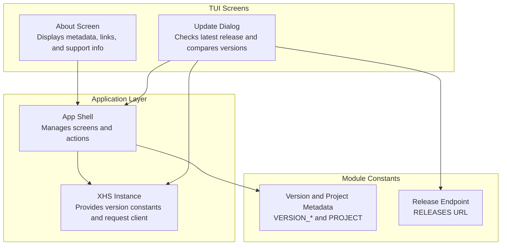
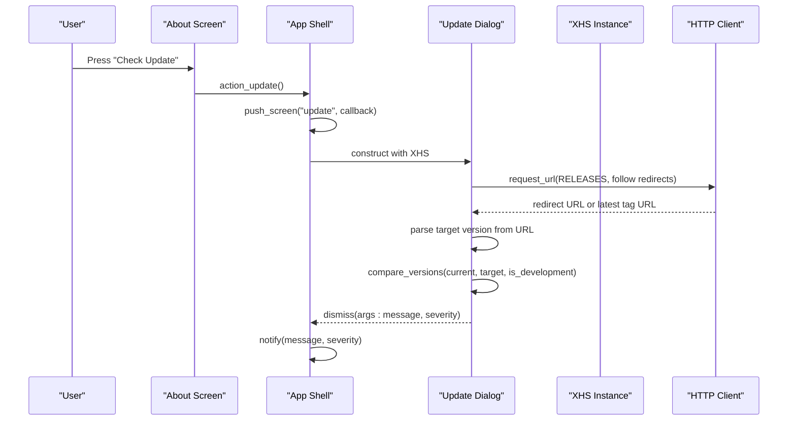
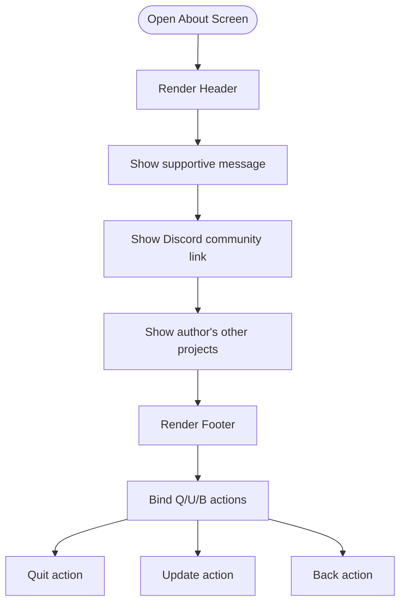
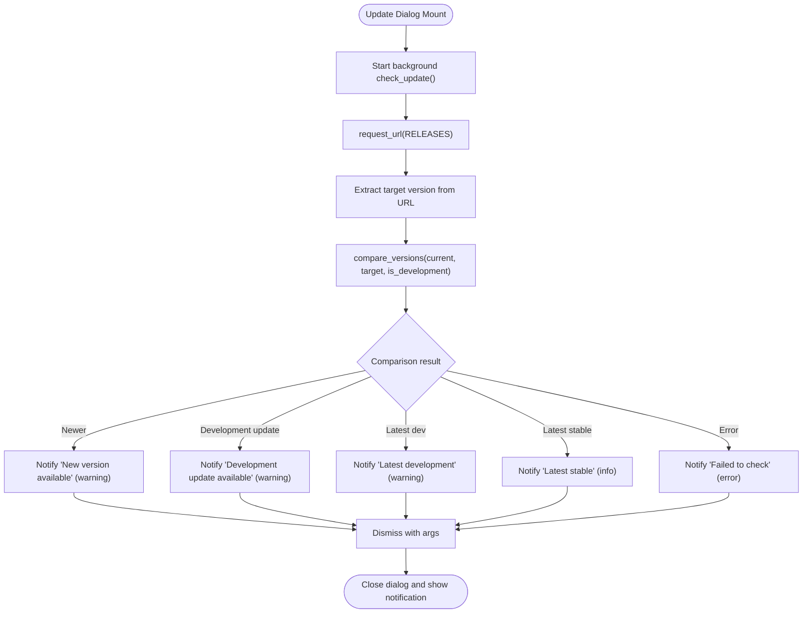
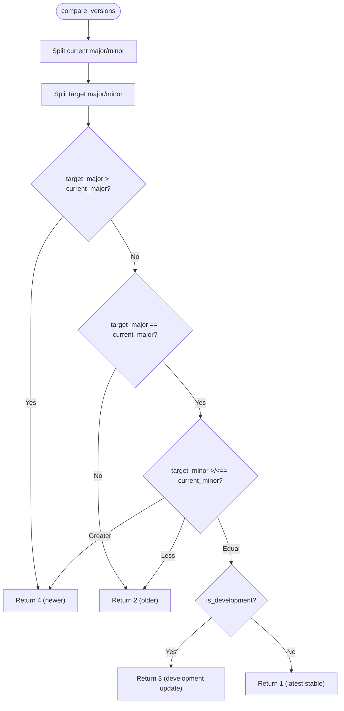
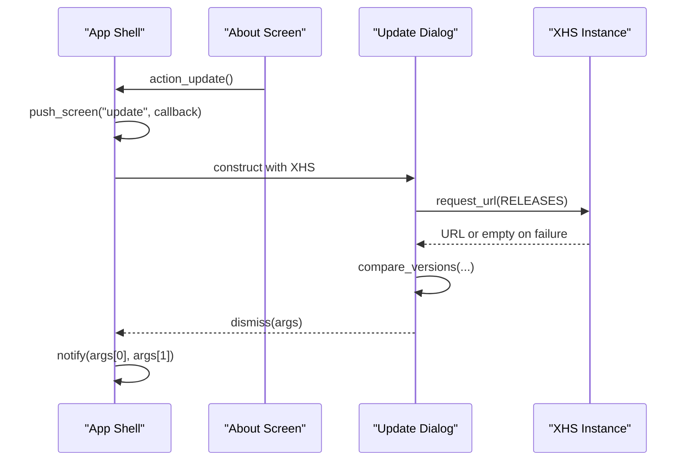
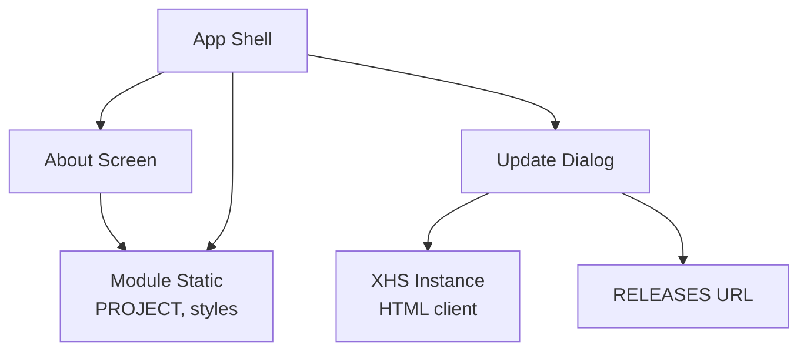

# About Screen

<cite>
**Referenced Files in This Document**
- [about.py](file://source/TUI/about.py)
- [update.py](file://source/TUI/update.py)
- [app.py](file://source/TUI/app.py)
- [static.py](file://source/module/static.py)
- [request.py](file://source/application/request.py)
- [Release_Notes.md](file://static/Release_Notes.md)
- [pyproject.toml](file://pyproject.toml)
- [README.md](file://README.md)
</cite>

## Table of Contents
1. [Introduction](#introduction)
2. [Project Structure](#project-structure)
3. [Core Components](#core-components)
4. [Architecture Overview](#architecture-overview)
5. [Detailed Component Analysis](#detailed-component-analysis)
6. [Dependency Analysis](#dependency-analysis)
7. [Performance Considerations](#performance-considerations)
8. [Troubleshooting Guide](#troubleshooting-guide)
9. [Conclusion](#conclusion)
10. [Appendices](#appendices)

## Introduction
This document describes the About Screen functionality within the TUI application. It explains how application metadata and version information are presented, how the integrated update system checks for new releases, and how notifications are surfaced to users. It also documents the license and credits sections visible on the About Screen, and outlines how to access help resources and support channels. Guidance is included for version comparison, changelog viewing, and support information access.

## Project Structure
The About Screen is implemented as a dedicated TUI screen and integrates with a modal update dialog. The application’s version and project metadata are centrally defined in module constants and exposed to the UI.

**Diagram sources**
- [about.py:18-85](file://source/TUI/about.py#L18-L85)
- [update.py:16-93](file://source/TUI/update.py#L16-L93)
- [app.py:18-126](file://source/TUI/app.py#L18-L126)
- [static.py:3-16](file://source/module/static.py#L3-L16)

**Section sources**
- [about.py:18-85](file://source/TUI/about.py#L18-L85)
- [update.py:16-93](file://source/TUI/update.py#L16-L93)
- [app.py:18-126](file://source/TUI/app.py#L18-L126)
- [static.py:3-16](file://source/module/static.py#L3-L16)

## Core Components
- About Screen: Presents project information, community links, author’s other projects, and support channels. It also exposes keyboard shortcuts for quitting, updating, and returning to the home screen.
- Update Dialog: A modal screen that performs a background check against the latest release endpoint, compares versions, and notifies the user with actionable messages.
- Application Shell: Orchestrates navigation between screens and invokes the update dialog via a dedicated action.
- Version and Project Metadata: Centralized constants define major/minor version, beta flag, formatted project name, and the release page URL.

Key responsibilities:
- About Screen: Render static content and links; trigger update action.
- Update Dialog: Fetch release URL, parse target version, compare with local version, and report outcome.
- App Shell: Install screens, register actions, and surface update notifications.

**Section sources**
- [about.py:18-85](file://source/TUI/about.py#L18-L85)
- [update.py:16-93](file://source/TUI/update.py#L16-L93)
- [app.py:18-126](file://source/TUI/app.py#L18-L126)
- [static.py:3-16](file://source/module/static.py#L3-L16)

## Architecture Overview
The About Screen is part of the TUI application’s screen stack. When the user triggers the update action, the App Shell pushes the Update modal, which uses the XHS instance to fetch the latest release URL and compare versions. Results are returned to the App Shell, which displays a notification.

**Diagram sources**
- [about.py:83-85](file://source/TUI/about.py#L83-L85)
- [app.py:113-119](file://source/TUI/app.py#L113-L119)
- [update.py:31-76](file://source/TUI/update.py#L31-L76)
- [request.py:26-70](file://source/application/request.py#L26-L70)

## Detailed Component Analysis

### About Screen
The About Screen composes a header, a friendly prompt, community and support links, and links to the author’s other open-source projects. It binds keyboard shortcuts for quick actions.

- Keyboard bindings:
  - Quit application
  - Check for updates
  - Return to home screen
- Content highlights:
  - Community Discord link
  - Author’s other projects (e.g., TikTok/快手 downloader)
  - Support channels and contact information

**Diagram sources**
- [about.py:30-85](file://source/TUI/about.py#L30-L85)

**Section sources**
- [about.py:18-85](file://source/TUI/about.py#L18-L85)

### Update Dialog
The Update Dialog performs a background check against the latest release endpoint, parses the target version, and compares it to the current version. It reports the result with an appropriate severity level.

- Background work:
  - Fetches the latest release URL using the XHS HTML client
  - Parses the target version from the redirected URL
  - Compares major/minor versions and development status
- Outcomes:
  - New version available
  - Development vs. stable channel behavior
  - Latest version detected
  - Failure to check

**Diagram sources**
- [update.py:31-92](file://source/TUI/update.py#L31-L92)
- [request.py:26-70](file://source/application/request.py#L26-L70)

**Section sources**
- [update.py:16-93](file://source/TUI/update.py#L16-L93)
- [request.py:26-70](file://source/application/request.py#L26-L70)

### Version Comparison Logic
The comparison function evaluates major and minor version numbers and considers whether the current build is a development version. It returns distinct codes indicating the relationship between current and target versions.

- Inputs:
  - Current version string (major.minor)
  - Target version string (parsed from release URL)
  - Development flag (beta/stable)
- Outputs:
  - Codes representing newer, development update, latest development, latest stable, or error

**Diagram sources**
- [update.py:78-92](file://source/TUI/update.py#L78-L92)

**Section sources**
- [update.py:78-92](file://source/TUI/update.py#L78-L92)

### Integration with App Shell and Notifications
The App Shell installs the About and Update screens, registers actions for navigation and updates, and displays notifications based on the update dialog’s result.

- Screen installation:
  - About screen registered under name "about"
  - Update dialog pushed modally on demand
- Action routing:
  - About screen delegates update action to App Shell
  - App Shell pushes Update dialog with a callback to render notifications
- Notification display:
  - Severity mapped to warning/info/error based on comparison result

**Diagram sources**
- [app.py:56-119](file://source/TUI/app.py#L56-L119)
- [about.py:83-85](file://source/TUI/about.py#L83-L85)
- [update.py:31-76](file://source/TUI/update.py#L31-L76)

**Section sources**
- [app.py:56-119](file://source/TUI/app.py#L56-L119)

## Dependency Analysis
The About Screen depends on module constants for project metadata and styles. The Update Dialog depends on the XHS HTML client for network requests and on module constants for the release endpoint. The App Shell orchestrates both components and surfaces notifications.

**Diagram sources**
- [about.py:7-13](file://source/TUI/about.py#L7-L13)
- [update.py:7-11](file://source/TUI/update.py#L7-L11)
- [static.py:13-15](file://source/module/static.py#L13-L15)
- [app.py:18-126](file://source/TUI/app.py#L18-L126)

**Section sources**
- [about.py:7-13](file://source/TUI/about.py#L7-L13)
- [update.py:7-11](file://source/TUI/update.py#L7-L11)
- [static.py:13-15](file://source/module/static.py#L13-L15)
- [app.py:18-126](file://source/TUI/app.py#L18-L126)

## Performance Considerations
- Network latency: The update check performs a single HTTP request to the release endpoint and follows redirects. Timeout is configured in the request method.
- Background work: The check runs as exclusive background work to avoid blocking the UI.
- Parsing simplicity: Version parsing extracts the target version from the URL path, minimizing overhead.

Recommendations:
- Keep timeouts reasonable to balance responsiveness and reliability.
- Consider caching the latest version locally to reduce repeated network calls during a session.

**Section sources**
- [update.py:31-39](file://source/TUI/update.py#L31-L39)
- [request.py:26-70](file://source/application/request.py#L26-L70)

## Troubleshooting Guide
Common issues and resolutions:
- Update check fails:
  - Verify network connectivity and proxy settings.
  - Retry after a short delay; the request method includes retry logic.
- Incorrect version detection:
  - Ensure the release endpoint returns a URL containing the tag/version in the path.
  - Confirm the current version constants reflect the intended major/minor/beta state.
- Notification not shown:
  - Confirm the callback is registered and the App Shell’s notify method is invoked with the correct arguments.

Operational tips:
- Use the keyboard shortcut to quickly open the update dialog from the About Screen.
- If the update dialog closes without feedback, check the console logs for underlying HTTP errors.

**Section sources**
- [update.py:68-73](file://source/TUI/update.py#L68-L73)
- [request.py:63-69](file://source/application/request.py#L63-L69)
- [app.py:107-111](file://source/TUI/app.py#L107-L111)

## Conclusion
The About Screen provides a concise overview of the project, community links, and support channels. Together with the integrated Update Dialog, it enables users to stay informed about new releases and take action accordingly. The design leverages centralized version metadata and a straightforward comparison routine to deliver timely and accurate notifications.

## Appendices

### Version Management and Display
- Project name and version:
  - The project name and version are constructed from major/minor/beta constants and displayed on the About Screen.
- Version constants:
  - Major, minor, and beta flags are defined centrally and used by both the UI and update logic.
- Release endpoint:
  - The update dialog queries the latest release page and parses the target version from the resulting URL.

**Section sources**
- [static.py:3-11](file://source/module/static.py#L3-L11)
- [static.py:13-15](file://source/module/static.py#L13-L15)
- [update.py:34-39](file://source/TUI/update.py#L34-L39)

### License Information
- License identifier:
  - The project is licensed under GNU General Public License v3.0.
- Project metadata:
  - License information is defined in the project configuration and referenced in the UI.

**Section sources**
- [pyproject.toml:9](file://pyproject.toml#L9)
- [README.md](file://README.md)

### Credits and Attribution
- Author and contact:
  - Contact information and community links are displayed on the About Screen.
- Author’s other projects:
  - Links to related open-source projects are provided for discovery and contribution.

**Section sources**
- [about.py:40-71](file://source/TUI/about.py#L40-L71)
- [README.md](file://README.md)

### Changelog Viewing
- Release notes:
  - The repository includes a release notes file summarizing recent changes and script updates.
- Access:
  - Users can view release notes in the repository or via the About Screen’s links to documentation and releases.

**Section sources**
- [Release_Notes.md:1-12](file://static/Release_Notes.md#L1-L12)
- [README.md](file://README.md)

### Support Information Access
- Help resources:
  - The About Screen and main documentation include links to community channels, support instructions, and contributor guidelines.
- Keyboard shortcuts:
  - Quick access to quit, update, and return to the home screen streamlines navigation.

**Section sources**
- [about.py:19-23](file://source/TUI/about.py#L19-L23)
- [README.md](file://README.md)