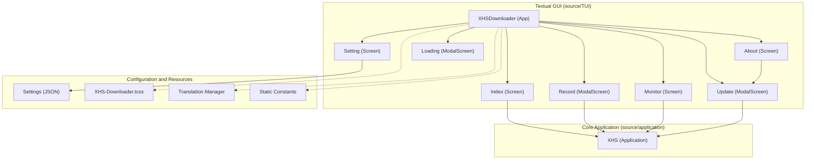
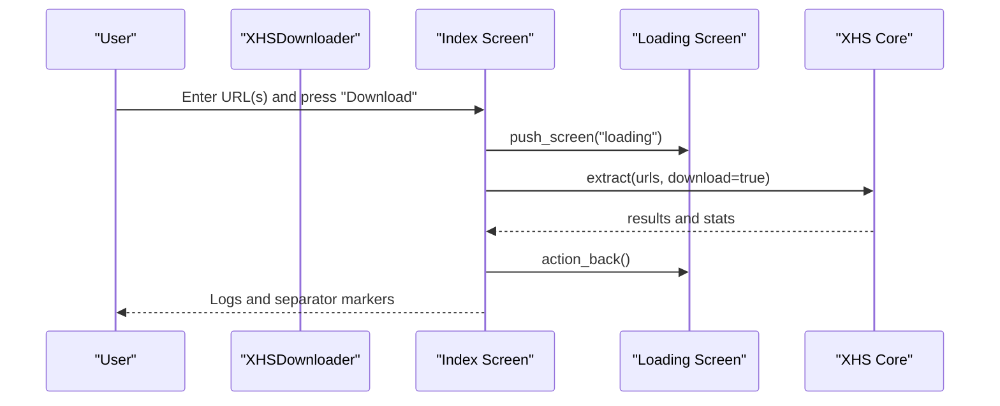
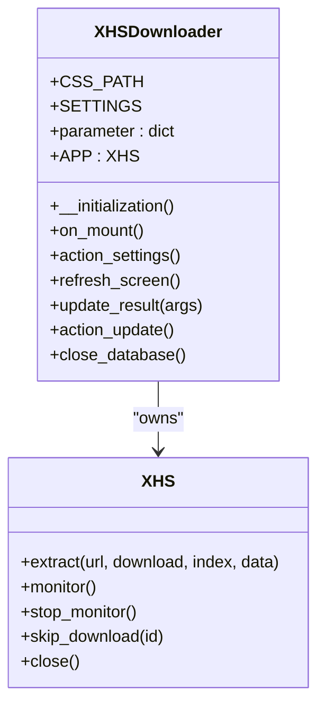
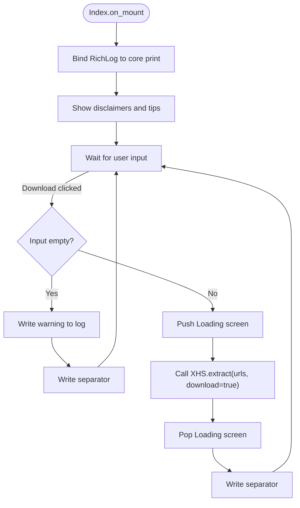
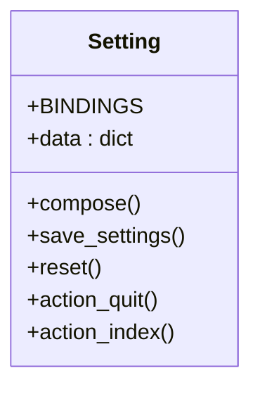
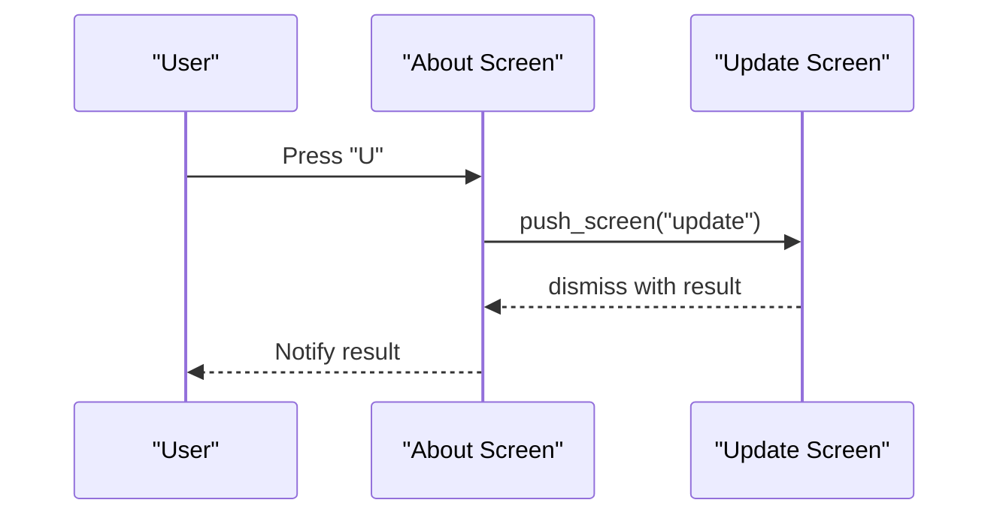
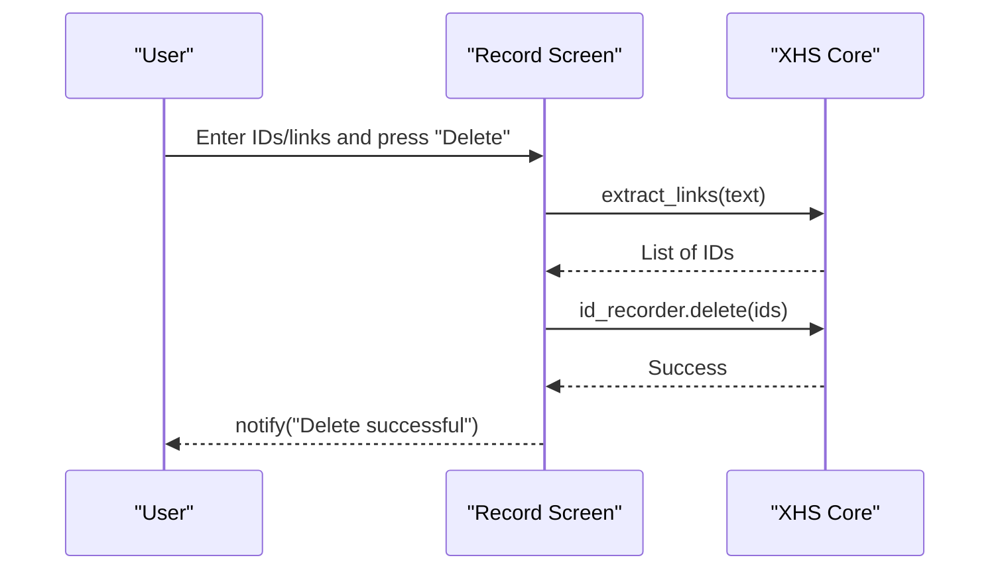
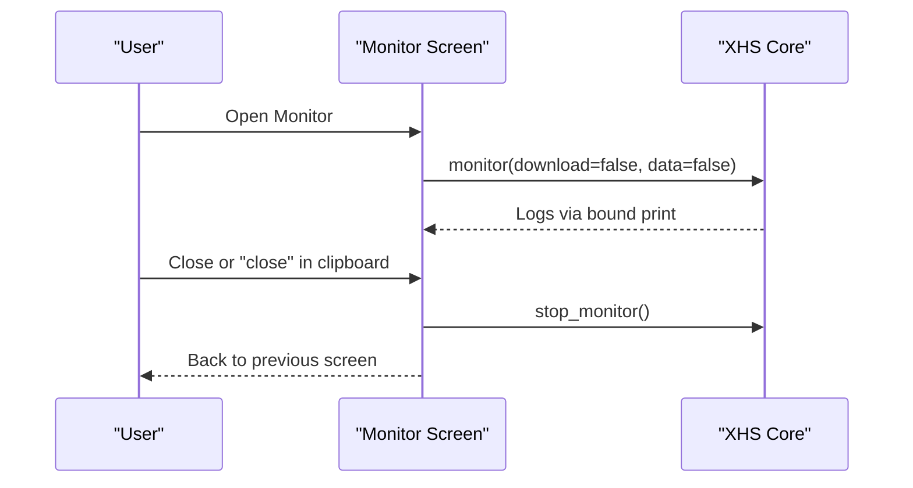
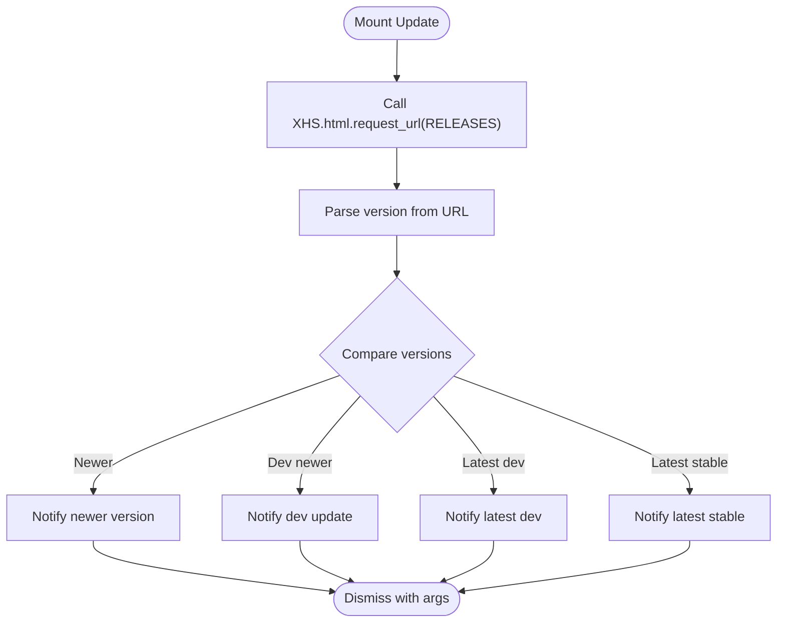
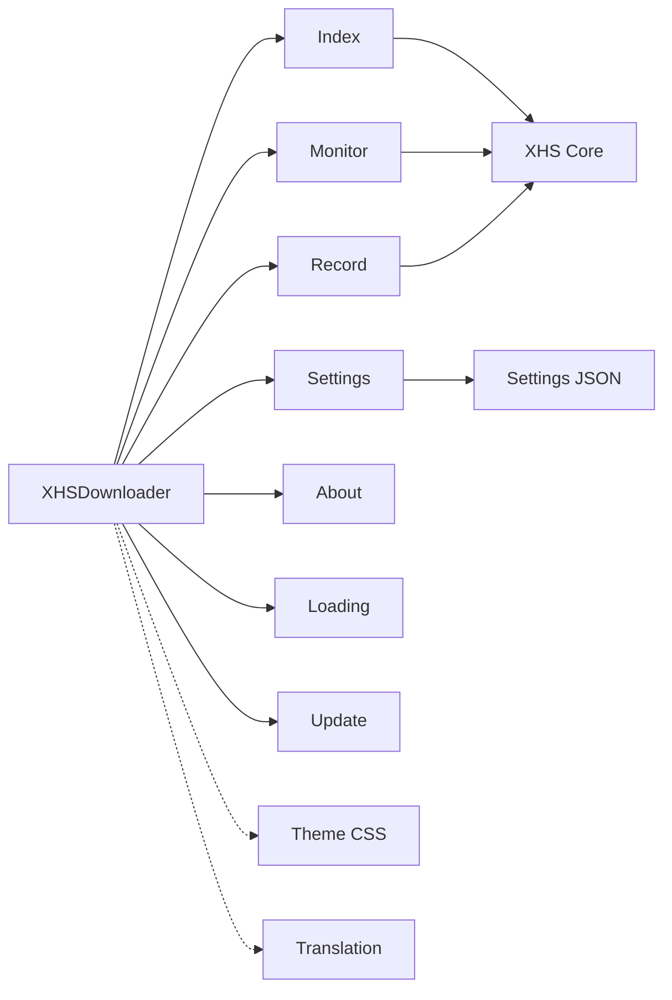

# Desktop GUI Application

<cite>
**Referenced Files in This Document**
- [source/TUI/app.py](file://source/TUI/app.py)
- [source/TUI/index.py](file://source/TUI/index.py)
- [source/TUI/setting.py](file://source/TUI/setting.py)
- [source/TUI/about.py](file://source/TUI/about.py)
- [source/TUI/loading.py](file://source/TUI/loading.py)
- [source/TUI/record.py](file://source/TUI/record.py)
- [source/TUI/monitor.py](file://source/TUI/monitor.py)
- [source/TUI/update.py](file://source/TUI/update.py)
- [source/application/app.py](file://source/application/app.py)
- [source/module/settings.py](file://source/module/settings.py)
- [source/module/static.py](file://source/module/static.py)
- [source/translation/translate.py](file://source/translation/translate.py)
- [static/XHS-Downloader.tcss](file://static/XHS-Downloader.tcss)
- [README.md](file://README.md)
</cite>

## Table of Contents
1. [Introduction](#introduction)
2. [Project Structure](#project-structure)
3. [Core Components](#core-components)
4. [Architecture Overview](#architecture-overview)
5. [Detailed Component Analysis](#detailed-component-analysis)
6. [Dependency Analysis](#dependency-analysis)
7. [Performance Considerations](#performance-considerations)
8. [Troubleshooting Guide](#troubleshooting-guide)
9. [Conclusion](#conclusion)
10. [Appendices](#appendices)

## Introduction
This document describes the desktop GUI application powered by Textual, focusing on the TUI architecture, screen navigation patterns, and user interaction flows. It documents the main application screens (index, settings, records, about), navigation controls, keyboard shortcuts, mouse interactions, state management, data binding, configuration options, settings persistence, progress tracking, loading states, error handling, accessibility and theming, and troubleshooting guidance. Step-by-step usage examples illustrate common workflows such as URL input, download initiation, and result viewing.

## Project Structure
The desktop GUI is implemented using Textual screens and integrates with the core application logic. The TUI module defines screens and the main application class that orchestrates initialization, screen installation, and runtime actions. The core application module encapsulates extraction, download, monitoring, and persistence logic. Configuration is managed via a settings module and persisted to a JSON file. Static constants and theme colors are centralized, and translations are handled by a translation manager.

**Diagram sources**
- [source/TUI/app.py](file://source/TUI/app.py)
- [source/TUI/index.py](file://source/TUI/index.py)
- [source/TUI/setting.py](file://source/TUI/setting.py)
- [source/TUI/about.py](file://source/TUI/about.py)
- [source/TUI/loading.py](file://source/TUI/loading.py)
- [source/TUI/record.py](file://source/TUI/record.py)
- [source/TUI/monitor.py](file://source/TUI/monitor.py)
- [source/TUI/update.py](file://source/TUI/update.py)
- [source/application/app.py](file://source/application/app.py)
- [source/module/settings.py](file://source/module/settings.py)
- [source/module/static.py](file://source/module/static.py)
- [source/translation/translate.py](file://source/translation/translate.py)
- [static/XHS-Downloader.tcss](file://static/XHS-Downloader.tcss)

**Section sources**
- [source/TUI/app.py](file://source/TUI/app.py)
- [source/TUI/index.py](file://source/TUI/index.py)
- [source/TUI/setting.py](file://source/TUI/setting.py)
- [source/TUI/about.py](file://source/TUI/about.py)
- [source/TUI/loading.py](file://source/TUI/loading.py)
- [source/TUI/record.py](file://source/TUI/record.py)
- [source/TUI/monitor.py](file://source/TUI/monitor.py)
- [source/TUI/update.py](file://source/TUI/update.py)
- [source/application/app.py](file://source/application/app.py)
- [source/module/settings.py](file://source/module/settings.py)
- [source/module/static.py](file://source/module/static.py)
- [source/translation/translate.py](file://source/translation/translate.py)
- [static/XHS-Downloader.tcss](file://static/XHS-Downloader.tcss)

## Core Components
- XHSDownloader (Textual App): Initializes settings, creates the core application instance, installs screens, handles actions (settings, update), and manages screen refresh and database lifecycle.
- Index (Screen): Provides URL input, buttons for download, clipboard paste, and reset; displays logs; triggers extraction and loading states.
- Setting (Screen): Presents configurable parameters (paths, naming, UA, cookies, proxies, timeouts, chunk sizes, retries, toggles for downloads and archives, language, preferences); saves and abandons changes.
- About (Screen): Displays project info, links, and community resources; supports update checks.
- Loading (ModalScreen): Shows a modal loading indicator during long-running operations.
- Record (ModalScreen): Allows deletion of download records by ID or link; integrates with the core’s ID recorder.
- Monitor (Screen): Runs clipboard monitoring to extract and process links; supports stopping and closing.
- Update (ModalScreen): Checks for new versions and notifies results.
- XHS (Core Application): Orchestrates extraction, data retrieval, download pipeline, naming rules, author mapping, recording, and monitoring; exposes APIs and MCP routes.
- Settings (Persistence): Reads/writes JSON settings with compatibility checks and migration.
- Static Constants and Theme: Defines project metadata, URLs, headers, color styles, and CSS selectors.
- Translation Manager: Switches language and provides localized strings.

**Section sources**
- [source/TUI/app.py](file://source/TUI/app.py)
- [source/TUI/index.py](file://source/TUI/index.py)
- [source/TUI/setting.py](file://source/TUI/setting.py)
- [source/TUI/about.py](file://source/TUI/about.py)
- [source/TUI/loading.py](file://source/TUI/loading.py)
- [source/TUI/record.py](file://source/TUI/record.py)
- [source/TUI/monitor.py](file://source/TUI/monitor.py)
- [source/TUI/update.py](file://source/TUI/update.py)
- [source/application/app.py](file://source/application/app.py)
- [source/module/settings.py](file://source/module/settings.py)
- [source/module/static.py](file://source/module/static.py)
- [source/translation/translate.py](file://source/translation/translate.py)

## Architecture Overview
The GUI follows a screen-based architecture with explicit navigation and state transitions. The main app initializes configuration, constructs the core application, and installs screens. Navigation actions push or pop screens, and callbacks update settings and refresh the UI. The core application performs extraction and download operations, writing progress and results to the UI via a bound logger.

**Diagram sources**
- [source/TUI/app.py](file://source/TUI/app.py)
- [source/TUI/index.py](file://source/TUI/index.py)
- [source/TUI/loading.py](file://source/TUI/loading.py)
- [source/application/app.py](file://source/application/app.py)

**Section sources**
- [source/TUI/app.py](file://source/TUI/app.py)
- [source/TUI/index.py](file://source/TUI/index.py)
- [source/TUI/loading.py](file://source/TUI/loading.py)
- [source/application/app.py](file://source/application/app.py)

## Detailed Component Analysis

### XHSDownloader (Main App)
- Responsibilities:
  - Load settings and initialize the core application instance.
  - Install and manage screens: index, settings, loading, about, records, monitor.
  - Provide actions: settings, update, refresh, and database lifecycle management.
- State Management:
  - Holds parameter dictionary and core application instance.
  - Uses a theme and applies CSS from a static stylesheet.
- Data Binding:
  - Routes notifications to the UI via a notify callback.
- Persistence Integration:
  - Saves settings via the Settings module and refreshes screens accordingly.

**Diagram sources**
- [source/TUI/app.py](file://source/TUI/app.py)
- [source/application/app.py](file://source/application/app.py)

**Section sources**
- [source/TUI/app.py](file://source/TUI/app.py)
- [source/application/app.py](file://source/application/app.py)

### Index Screen
- Controls:
  - Header/Footer, label, input field, buttons (download, paste, reset), and a RichLog for output.
- Keyboard Shortcuts:
  - Q: quit
  - U: update
  - S: settings
  - R: record
  - M: monitor
  - A: about
- Interactions:
  - Download button validates input and triggers extraction with loading state.
  - Paste button reads clipboard into input.
  - Reset clears input.
- Logging:
  - Writes messages and separators to the RichLog; sets print function for core logging.

**Diagram sources**
- [source/TUI/index.py](file://source/TUI/index.py)
- [source/application/app.py](file://source/application/app.py)

**Section sources**
- [source/TUI/index.py](file://source/TUI/index.py)
- [source/application/app.py](file://source/application/app.py)

### Settings Screen
- Controls:
  - Inputs for paths, naming, UA, cookie, proxy, timeout, chunk, max retry.
  - Checkboxes for data recording, archive modes, media toggles, download records, author archive, write mtime, script server.
  - Select widgets for image format, language, and video preference.
  - Buttons to save or abandon changes.
- Behavior:
  - Reads initial values from the parameter dictionary.
  - On save, collects widget values and dismisses with updated mapping.
  - On abandon, restores previous values.

**Diagram sources**
- [source/TUI/setting.py](file://source/TUI/setting.py)

**Section sources**
- [source/TUI/setting.py](file://source/TUI/setting.py)
- [source/module/settings.py](file://source/module/settings.py)

### About Screen
- Displays project information, links, and community resources.
- Keyboard Shortcuts:
  - Q: quit
  - U: update
  - B: back to index

**Diagram sources**
- [source/TUI/about.py](file://source/TUI/about.py)
- [source/TUI/update.py](file://source/TUI/update.py)

**Section sources**
- [source/TUI/about.py](file://source/TUI/about.py)
- [source/TUI/update.py](file://source/TUI/update.py)

### Loading Screen
- Modal screen displaying a label and a loading indicator during long operations.

**Section sources**
- [source/TUI/loading.py](file://source/TUI/loading.py)

### Record Screen
- Modal dialog to input IDs or links and delete matching download records.
- Uses core’s ID recorder to perform deletions and notifies success.

**Diagram sources**
- [source/TUI/record.py](file://source/TUI/record.py)
- [source/application/app.py](file://source/application/app.py)

**Section sources**
- [source/TUI/record.py](file://source/TUI/record.py)
- [source/application/app.py](file://source/application/app.py)

### Monitor Screen
- Runs clipboard monitoring to extract and process links asynchronously.
- Provides a close button and keyboard shortcut to stop monitoring and return.

**Diagram sources**
- [source/TUI/monitor.py](file://source/TUI/monitor.py)
- [source/application/app.py](file://source/application/app.py)

**Section sources**
- [source/TUI/monitor.py](file://source/TUI/monitor.py)
- [source/application/app.py](file://source/application/app.py)

### Update Screen
- Asynchronously checks for new releases and compares versions, notifying results.

**Diagram sources**
- [source/TUI/update.py](file://source/TUI/update.py)
- [source/application/app.py](file://source/application/app.py)

**Section sources**
- [source/TUI/update.py](file://source/TUI/update.py)
- [source/application/app.py](file://source/application/app.py)

## Dependency Analysis
- App-to-Core:
  - Index and Monitor screens call into the core application for extraction and monitoring.
  - Settings screen updates parameters that influence core behavior.
- Screen-to-App:
  - Screens push/pop other screens or trigger app actions (settings, update).
- Persistence:
  - Settings module reads/writes JSON; app refreshes screens and database connections after updates.
- Theming and Localization:
  - CSS selectors define layout and colors; translation manager switches language dynamically.

**Diagram sources**
- [source/TUI/app.py](file://source/TUI/app.py)
- [source/TUI/index.py](file://source/TUI/index.py)
- [source/TUI/setting.py](file://source/TUI/setting.py)
- [source/TUI/about.py](file://source/TUI/about.py)
- [source/TUI/loading.py](file://source/TUI/loading.py)
- [source/TUI/record.py](file://source/TUI/record.py)
- [source/TUI/monitor.py](file://source/TUI/monitor.py)
- [source/TUI/update.py](file://source/TUI/update.py)
- [source/application/app.py](file://source/application/app.py)
- [source/module/settings.py](file://source/module/settings.py)
- [source/translation/translate.py](file://source/translation/translate.py)
- [static/XHS-Downloader.tcss](file://static/XHS-Downloader.tcss)

**Section sources**
- [source/TUI/app.py](file://source/TUI/app.py)
- [source/TUI/index.py](file://source/TUI/index.py)
- [source/TUI/setting.py](file://source/TUI/setting.py)
- [source/TUI/about.py](file://source/TUI/about.py)
- [source/TUI/loading.py](file://source/TUI/loading.py)
- [source/TUI/record.py](file://source/TUI/record.py)
- [source/TUI/monitor.py](file://source/TUI/monitor.py)
- [source/TUI/update.py](file://source/TUI/update.py)
- [source/application/app.py](file://source/application/app.py)
- [source/module/settings.py](file://source/module/settings.py)
- [source/translation/translate.py](file://source/translation/translate.py)
- [static/XHS-Downloader.tcss](file://static/XHS-Downloader.tcss)

## Performance Considerations
- Async Work:
  - Long-running operations are wrapped with exclusive work to prevent overlapping tasks and ensure thread safety.
- Logging and UI Updates:
  - Core logging writes directly to the RichLog widget; minimize excessive writes in tight loops.
- Network and Retry:
  - Tune timeout and max retry settings to balance responsiveness and reliability.
- Chunk Size:
  - Adjust chunk size for network conditions to improve throughput without memory pressure.
- Monitoring:
  - Clipboard monitoring runs continuously; ensure delays and queue handling are efficient.

[No sources needed since this section provides general guidance]

## Troubleshooting Guide
- Settings Not Applying:
  - Save changes in the settings screen; the app refreshes screens and database connections. If not, verify JSON file integrity and restart the app.
- Clipboard Issues:
  - Ensure platform-specific clipboard utilities are available. Some environments require additional packages or permissions.
- Update Check Fails:
  - Network connectivity or rate limiting may block the release URL check. Retry later or check firewall/proxy settings.
- Download Failures:
  - Verify cookie and proxy settings; adjust timeout and retry counts; confirm links are valid and not expired.
- Accessibility and Theme:
  - The app uses a predefined theme and CSS selectors. If colors or layout appear incorrect, verify the theme and CSS file paths.

**Section sources**
- [source/TUI/app.py](file://source/TUI/app.py)
- [source/TUI/setting.py](file://source/TUI/setting.py)
- [source/TUI/update.py](file://source/TUI/update.py)
- [source/TUI/monitor.py](file://source/TUI/monitor.py)
- [source/module/settings.py](file://source/module/settings.py)

## Conclusion
The desktop GUI leverages Textual’s screen-based architecture to deliver a responsive, keyboard-driven interface. It integrates tightly with the core application for extraction, monitoring, and persistence, while providing robust configuration, localization, and theming. Users can efficiently manage downloads, settings, and records with clear navigation and feedback.

[No sources needed since this section summarizes without analyzing specific files]

## Appendices

### Keyboard Shortcuts Reference
- Index Screen:
  - Q: Quit
  - U: Check update
  - S: Open settings
  - R: Open records
  - M: Open monitor
  - A: Open about
- Settings Screen:
  - Q: Quit
  - B: Back to index
- About Screen:
  - Q: Quit
  - U: Check update
  - B: Back to index
- Monitor Screen:
  - Q: Quit
  - C: Close monitor

**Section sources**
- [source/TUI/index.py](file://source/TUI/index.py)
- [source/TUI/setting.py](file://source/TUI/setting.py)
- [source/TUI/about.py](file://source/TUI/about.py)
- [source/TUI/monitor.py](file://source/TUI/monitor.py)

### Configuration Options and Persistence
- Settings JSON fields include paths, naming, UA, cookies, proxies, timeouts, chunk sizes, retries, toggles, and preferences. Defaults are applied on first run and merged on subsequent runs.
- Settings are read at startup and updated on save; the app refreshes screens and database connections to apply changes.

**Section sources**
- [source/module/settings.py](file://source/module/settings.py)
- [source/TUI/app.py](file://source/TUI/app.py)
- [README.md](file://README.md)

### Step-by-Step Usage Examples
- URL Input and Download:
  - Open the index screen, paste or type one or more small red note links separated by spaces, then click “Download.” The app pushes the loading screen, processes the links, and returns to the index with results and separators.
- Open Settings and Apply Changes:
  - Press S in the index screen to open settings. Modify parameters, then press “Save.” The app updates settings, refreshes screens, closes and reopens databases, and returns to index.
- Delete Download Records:
  - Press R in the index screen to open the records dialog. Enter one or more IDs or links, then press “Delete.” The app extracts IDs, deletes records, and notifies success.
- Monitor Clipboard:
  - Press M in the index screen to open monitor. The app starts monitoring the clipboard; paste a link or write “close” to stop. Press C or Q to exit.

**Section sources**
- [source/TUI/index.py](file://source/TUI/index.py)
- [source/TUI/setting.py](file://source/TUI/setting.py)
- [source/TUI/record.py](file://source/TUI/record.py)
- [source/TUI/monitor.py](file://source/TUI/monitor.py)
- [source/TUI/app.py](file://source/TUI/app.py)

### Accessibility, Themes, and Customization
- Theme:
  - The app sets a theme and loads a CSS file for layout and colors.
- CSS Selectors:
  - Buttons, labels, links, and modal layouts are styled via selectors.
- Localization:
  - Language switching is supported and applied to UI strings.

**Section sources**
- [source/TUI/app.py](file://source/TUI/app.py)
- [static/XHS-Downloader.tcss](file://static/XHS-Downloader.tcss)
- [source/translation/translate.py](file://source/translation/translate.py)
- [source/module/static.py](file://source/module/static.py)