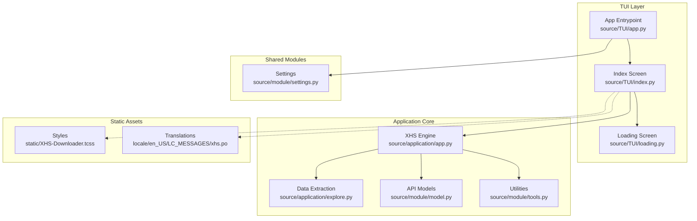
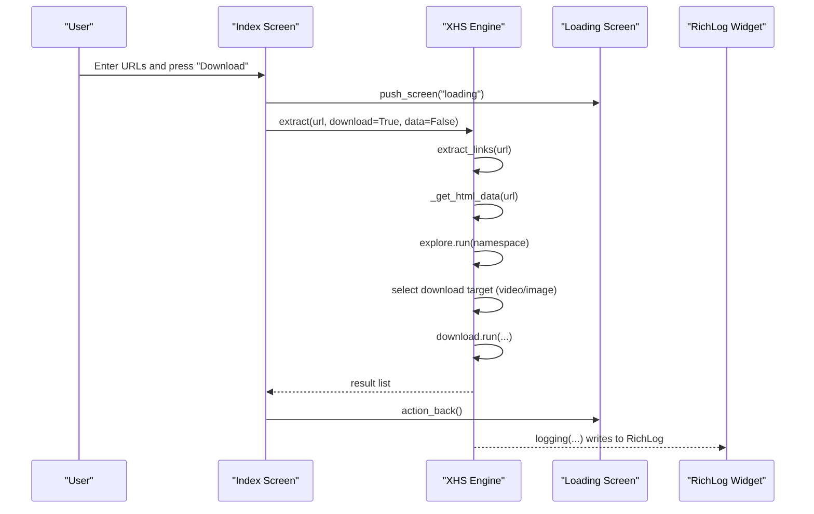
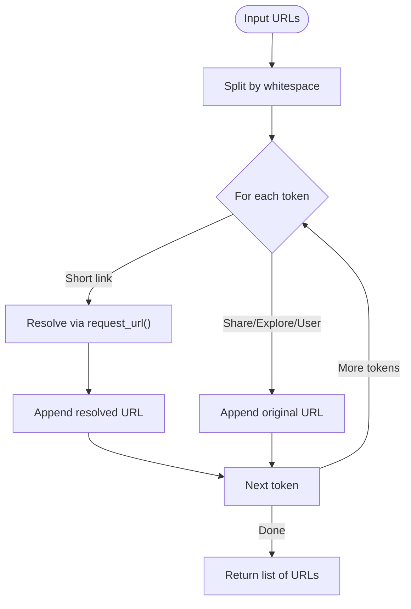
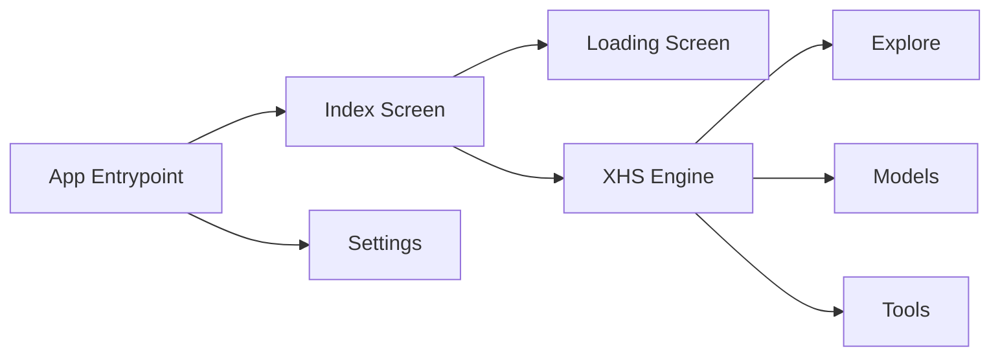

# Index Screen

<cite>
**Referenced Files in This Document**
- [index.py](file://source/TUI/index.py)
- [app.py](file://source/TUI/app.py)
- [loading.py](file://source/TUI/loading.py)
- [app_core.py](file://source/application/app.py)
- [explore.py](file://source/application/explore.py)
- [model.py](file://source/module/model.py)
- [settings.py](file://source/module/settings.py)
- [tools.py](file://source/module/tools.py)
- [main.py](file://main.py)
- [XHS-Downloader.tcss](file://static/XHS-Downloader.tcss)
- [xhs.po](file://locale/en_US/LC_MESSAGES/xhs.po)
</cite>

## Table of Contents
1. [Introduction](#introduction)
2. [Project Structure](#project-structure)
3. [Core Components](#core-components)
4. [Architecture Overview](#architecture-overview)
5. [Detailed Component Analysis](#detailed-component-analysis)
6. [Dependency Analysis](#dependency-analysis)
7. [Performance Considerations](#performance-considerations)
8. [Troubleshooting Guide](#troubleshooting-guide)
9. [Conclusion](#conclusion)

## Introduction
This document describes the main index screen for the TUI application, focusing on the URL input interface, content extraction pipeline, and download initiation. It explains the screen layout, input validation, form handling, URL processing workflow, extraction algorithms, result display, and integration with the XHS core engine. It also covers supported URL formats, validation rules, error handling, user interaction patterns, visual feedback, and troubleshooting guidance.

## Project Structure
The index screen is part of the TUI application and integrates with the core XHS engine. The relevant modules are organized as follows:
- TUI screens: index, loading, app entry
- Application core: XHS engine, extraction, exploration, download
- Shared modules: settings, models, tools
- Static assets: styles and translations

**Diagram sources**
- [index.py:1-153](file://source/TUI/index.py#L1-L153)
- [app.py:18-126](file://source/TUI/app.py#L18-L126)
- [loading.py:11-23](file://source/TUI/loading.py#L11-L23)
- [app_core.py:98-671](file://source/application/app.py#L98-L671)
- [explore.py:9-83](file://source/application/explore.py#L9-L83)
- [model.py:4-17](file://source/module/model.py#L4-L17)
- [tools.py:42-64](file://source/module/tools.py#L42-L64)
- [settings.py:10-124](file://source/module/settings.py#L10-L124)
- [XHS-Downloader.tcss:1-53](file://static/XHS-Downloader.tcss#L1-L53)
- [xhs.po:1-200](file://locale/en_US/LC_MESSAGES/xhs.po#L1-L200)

**Section sources**
- [index.py:1-153](file://source/TUI/index.py#L1-L153)
- [app.py:18-126](file://source/TUI/app.py#L18-L126)
- [loading.py:11-23](file://source/TUI/loading.py#L11-L23)
- [app_core.py:98-671](file://source/application/app.py#L98-L671)
- [explore.py:9-83](file://source/application/explore.py#L9-L83)
- [model.py:4-17](file://source/module/model.py#L4-L17)
- [tools.py:42-64](file://source/module/tools.py#L42-L64)
- [settings.py:10-124](file://source/module/settings.py#L10-L124)
- [XHS-Downloader.tcss:1-53](file://static/XHS-Downloader.tcss#L1-L53)
- [xhs.po:1-200](file://locale/en_US/LC_MESSAGES/xhs.po#L1-L200)

## Core Components
- Index Screen: Provides URL input, buttons for actions, and a log for results.
- XHS Engine: Orchestrates URL extraction, HTML parsing, data extraction, and downloads.
- Loading Screen: Modal indicator during processing.
- Settings: Manages persistent configuration affecting behavior.
- Models: Defines API request/response shapes for external integrations.
- Tools: Logging and retry utilities used by the engine.

Key responsibilities:
- Index Screen: Renders UI, handles user input, triggers processing, displays logs.
- XHS Engine: Validates URLs, resolves short links, extracts metadata, selects download targets, manages records and statistics.
- Loading Screen: Blocks user input and shows progress indicator.
- Settings: Supplies runtime configuration (paths, preferences, limits).
- Models: Standardizes API parameters and responses.
- Tools: Centralizes logging and retry logic.

**Section sources**
- [index.py:27-153](file://source/TUI/index.py#L27-L153)
- [app_core.py:98-671](file://source/application/app.py#L98-L671)
- [loading.py:11-23](file://source/TUI/loading.py#L11-L23)
- [settings.py:10-124](file://source/module/settings.py#L10-L124)
- [model.py:4-17](file://source/module/model.py#L4-L17)
- [tools.py:42-64](file://source/module/tools.py#L42-L64)

## Architecture Overview
The index screen is a Textual Screen that coordinates with the XHS engine. The flow:
- User enters one or more URLs separated by whitespace.
- On clicking the download button, the screen pushes a loading modal and delegates to the engine.
- The engine extracts and validates URLs, resolves short links, parses HTML, extracts metadata, determines media type, and initiates downloads.
- Results are logged to the screen’s RichLog widget.

**Diagram sources**
- [index.py:87-131](file://source/TUI/index.py#L87-L131)
- [app_core.py:268-506](file://source/application/app.py#L268-L506)
- [loading.py:17-22](file://source/TUI/loading.py#L17-L22)

## Detailed Component Analysis

### Index Screen Layout and Controls
- Header and Footer provide navigation context.
- Scrollable container holds:
  - License notice and project link.
  - Prompt label indicating expected input.
  - Input field with placeholder for multiple URLs separated by spaces.
  - Horizontal buttons:
    - Download: triggers processing.
    - Paste: reads clipboard into input.
    - Reset: clears input.
- RichLog widget displays formatted logs with auto-scroll and wrapping.

Keyboard shortcuts (bindings) defined in the screen:
- Q: quit
- U: check updates
- S: open settings
- R: open download record
- M: open monitor
- A: open about

Visual styling:
- Buttons styled via CSS classes.
- Labels centered and styled for prompts and links.
- Loading modal grid layout with indicator.

**Section sources**
- [index.py:46-74](file://source/TUI/index.py#L46-L74)
- [index.py:28-35](file://source/TUI/index.py#L28-L35)
- [XHS-Downloader.tcss:1-53](file://static/XHS-Downloader.tcss#L1-L53)

### Input Validation and Form Handling
- Validation rule: Non-empty input is required to trigger processing.
- Multi-URL support: Split by whitespace; each token is validated individually.
- Clipboard integration: Paste button copies clipboard content into the input field.
- Clear input: Reset button empties the input field.

Behavior on empty input:
- Writes a warning message to the log and appends a separator line.

**Section sources**
- [index.py:87-100](file://source/TUI/index.py#L87-L100)
- [index.py:101-107](file://source/TUI/index.py#L101-L107)

### URL Processing Workflow
Supported URL formats:
- Full explore page: https://www.xiaohongshu.com/explore/...
- Share discovery item: https://www.xiaohongshu.com/discovery/item/...
- User profile: https://www.xiaohongshu.com/user/profile/...
- Short link: https://xhslink.com/...

Processing steps:
1. Split input by whitespace to get tokens.
2. For each token:
   - If it matches a short link pattern, resolve to the real URL via an HTTP request.
   - If it matches share, explore, or user patterns, accept it.
3. Return the list of validated URLs.

**Diagram sources**
- [app_core.py:358-375](file://source/application/app.py#L358-L375)

**Section sources**
- [app_core.py:102-107](file://source/application/app.py#L102-L107)
- [app_core.py:358-375](file://source/application/app.py#L358-L375)

### Extraction Algorithms and Result Display
Extraction pipeline:
1. For each URL:
   - Fetch HTML content.
   - Convert HTML to a structured namespace.
   - Run Explore to extract metadata (interactions, tags, info, timestamps, user).
   - Classify work type (video, image, LivePhoto, unknown).
   - Select download targets:
     - Video: pick preferred video link.
     - Image/LivePhoto: pick image link(s).
   - Optionally download files and record outcomes.
   - Save extracted data and update author nickname mapping.
2. Aggregate statistics and log results.

Result display:
- Logs are written to the RichLog widget with auto-scroll and markup enabled.
- Messages include warnings, errors, and success summaries.

**Section sources**
- [app_core.py:386-506](file://source/application/app.py#L386-L506)
- [explore.py:12-83](file://source/application/explore.py#L12-L83)
- [app_core.py:268-302](file://source/application/app.py#L268-L302)

### Integration with XHS Core Engine
- The Index screen composes a Loading modal and delegates processing to the XHS engine.
- The engine encapsulates:
  - URL extraction and resolution.
  - HTML fetching and conversion.
  - Metadata extraction and classification.
  - Download orchestration and recording.
  - Statistics aggregation and logging.

The engine exposes methods:
- extract(url, download, index, data): Main entry for batch processing.
- extract_links(url): Validates and normalizes URLs.
- _get_html_data(url, data): Fetches and parses HTML.
- _extract_data(namespace, id_, count): Runs Explore to produce structured data.
- _deal_download_tasks(data, namespace, id_, download, index, count): Chooses and executes downloads.

**Section sources**
- [index.py:109-131](file://source/TUI/index.py#L109-L131)
- [app_core.py:268-506](file://source/application/app.py#L268-L506)

### Supported URL Formats and Validation Rules
Supported patterns:
- Explore page: www.xiaohongshu.com/explore/...
- Discovery item: www.xiaohongshu.com/discovery/item/...
- User profile: www.xiaohongshu.com/user/profile/...
- Short link: xhslink.com/...

Validation rules:
- Accepts multiple URLs separated by whitespace.
- Resolves short links to canonical URLs.
- Ignores tokens that do not match any supported pattern.

**Section sources**
- [app_core.py:102-107](file://source/application/app.py#L102-L107)
- [app_core.py:358-375](file://source/application/app.py#L358-L375)

### Error Handling and User Feedback
- Empty input: Displays a warning message and appends a separator line.
- Extraction failure: Logs a warning and appends a separator line.
- Download failure: Logs an error message and appends a separator line.
- Logging utility: Writes formatted text to either the console or the RichLog widget depending on context.

Visual feedback:
- Loading modal appears during processing.
- RichLog auto-scrolls to newly appended content.
- Buttons styled differently for success/error actions.

**Section sources**
- [index.py:87-100](file://source/TUI/index.py#L87-L100)
- [index.py:121-129](file://source/TUI/index.py#L121-L129)
- [tools.py:42-52](file://source/module/tools.py#L42-L52)
- [loading.py:17-22](file://source/TUI/loading.py#L17-L22)
- [XHS-Downloader.tcss:16-21](file://static/XHS-Downloader.tcss#L16-L21)

### User Interaction Patterns, Shortcuts, and Mouse Operations
- Keyboard shortcuts:
  - Q: Quit application.
  - U: Open update screen.
  - S: Open settings screen.
  - R: Open download record screen.
  - M: Open monitor screen.
  - A: Open about screen.
- Mouse operations:
  - Click "Download" to process URLs.
  - Click "Paste" to populate input from clipboard.
  - Click "Reset" to clear input.
  - Click "Exit" in other screens to return.

**Section sources**
- [index.py:28-35](file://source/TUI/index.py#L28-L35)
- [index.py:101-107](file://source/TUI/index.py#L101-L107)
- [app.py:66-120](file://source/TUI/app.py#L66-L120)

### Progress Reporting and Statistics
- Pre-processing: Logs total number of notes to process.
- Per-note: Logs start, success/failure, and completion.
- Post-processing: Aggregates and logs success/failure/skip counts.

**Section sources**
- [app_core.py:288-302](file://source/application/app.py#L288-L302)
- [app_core.py:404-405](file://source/application/app.py#L404-L405)
- [app_core.py:505](file://source/application/app.py#L505)

## Dependency Analysis
High-level dependencies:
- Index Screen depends on:
  - XHS Engine for processing.
  - Loading Screen for modal feedback.
  - RichLog for result display.
  - Settings for configuration.
- XHS Engine depends on:
  - Explore for metadata extraction.
  - Models for API parameter/response definitions.
  - Tools for logging and retries.
  - Request/Download modules for network and file operations.

**Diagram sources**
- [index.py:109-131](file://source/TUI/index.py#L109-L131)
- [app.py:18-126](file://source/TUI/app.py#L18-L126)
- [app_core.py:98-671](file://source/application/app.py#L98-L671)
- [explore.py:9-83](file://source/application/explore.py#L9-L83)
- [model.py:4-17](file://source/module/model.py#L4-L17)
- [tools.py:42-64](file://source/module/tools.py#L42-L64)
- [settings.py:10-124](file://source/module/settings.py#L10-L124)

**Section sources**
- [index.py:109-131](file://source/TUI/index.py#L109-L131)
- [app_core.py:98-671](file://source/application/app.py#L98-L671)

## Performance Considerations
- Batch processing: The engine processes multiple URLs concurrently and aggregates statistics.
- Logging overhead: Frequent log writes can impact responsiveness; consider batching or throttling in heavy loads.
- Network requests: HTML fetching and short-link resolution introduce latency; configure timeouts and retries appropriately.
- Download concurrency: Respect configured chunk sizes and retry limits to balance speed and reliability.

[No sources needed since this section provides general guidance]

## Troubleshooting Guide
Common issues and resolutions:
- No input provided:
  - Symptom: Warning message in logs and separator appended.
  - Action: Enter one or more URLs separated by spaces.
- Unsupported URL format:
  - Symptom: Extraction fails with a warning.
  - Action: Ensure URLs match supported patterns (explore, discovery item, user profile, or short link).
- Network errors:
  - Symptom: Requests fail with network error messages.
  - Action: Verify connectivity, adjust timeout/retry settings, and check proxy configuration.
- Download failures:
  - Symptom: Error messages indicating download failure.
  - Action: Review file permissions, disk space, and destination path; retry after fixing underlying issues.
- Duplicate downloads:
  - Symptom: Skipped downloads with recorded messages.
  - Action: Disable download record or clear existing records if reprocessing is intended.

**Section sources**
- [index.py:87-100](file://source/TUI/index.py#L87-L100)
- [index.py:121-129](file://source/TUI/index.py#L121-L129)
- [app_core.py:247-248](file://source/application/app.py#L247-L248)
- [app_core.py:222-224](file://source/application/app.py#L222-L224)

## Conclusion
The Index Screen provides a streamlined interface for entering URLs, validating inputs, and initiating extraction and download workflows through the XHS engine. Its integration with the Loading Screen and RichLog ensures clear user feedback and progress visibility. By adhering to supported URL formats and leveraging the engine’s robust extraction and download pipeline, users can reliably process RedNote content with minimal friction.