# Loading and Progress Screens

<cite>
**Referenced Files in This Document**
- [loading.py](file://source/TUI/loading.py)
- [progress.py](file://source/TUI/progress.py)
- [app.py](file://source/TUI/app.py)
- [index.py](file://source/TUI/index.py)
- [monitor.py](file://source/TUI/monitor.py)
- [update.py](file://source/TUI/update.py)
- [download.py](file://source/application/download.py)
- [app.py](file://source/application/app.py)
- [request.py](file://source/application/request.py)
</cite>

## Table of Contents
1. [Introduction](#introduction)
2. [Project Structure](#project-structure)
3. [Core Components](#core-components)
4. [Architecture Overview](#architecture-overview)
5. [Detailed Component Analysis](#detailed-component-analysis)
6. [Dependency Analysis](#dependency-analysis)
7. [Performance Considerations](#performance-considerations)
8. [Troubleshooting Guide](#troubleshooting-guide)
9. [Conclusion](#conclusion)

## Introduction
This document explains the loading and progress tracking screens in the TUI application. It covers how asynchronous operations are monitored, how user feedback is presented, and how the system integrates with background tasks, queues, and operation coordination. It also documents the loading screen implementation, progress indication mechanisms, status reporting, error handling, interruption, and recovery procedures. Visual design and accessibility considerations for progress indicators are addressed.

## Project Structure
The TUI module provides modal loading screens and placeholder progress screens. The application layer coordinates extraction, downloading, and monitoring tasks, and exposes hooks for progress updates. The CLI and application layers share the same underlying logic for extracting and downloading media.

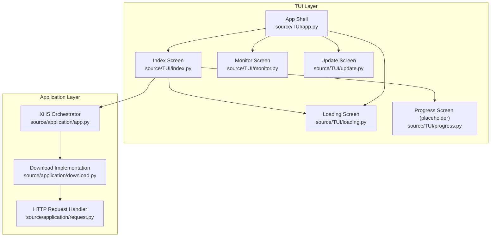

**Diagram sources**
- [index.py:109-131](file://source/TUI/index.py#L109-L131)
- [loading.py:11-22](file://source/TUI/loading.py#L11-L22)
- [progress.py:7-9](file://source/TUI/progress.py#L7-L9)
- [app.py:42-105](file://source/TUI/app.py#L42-L105)
- [monitor.py:42-50](file://source/TUI/monitor.py#L42-L50)
- [update.py:31-76](file://source/TUI/update.py#L31-L76)
- [app.py:268-302](file://source/application/app.py#L268-L302)
- [download.py:220-282](file://source/application/download.py#L220-L282)
- [request.py:60-138](file://source/application/request.py#L60-L138)

**Section sources**
- [index.py:109-131](file://source/TUI/index.py#L109-L131)
- [loading.py:11-22](file://source/TUI/loading.py#L11-L22)
- [progress.py:7-9](file://source/TUI/progress.py#L7-L9)
- [app.py:42-105](file://source/TUI/app.py#L42-L105)
- [monitor.py:42-50](file://source/TUI/monitor.py#L42-L50)
- [update.py:31-76](file://source/TUI/update.py#L31-L76)
- [app.py:268-302](file://source/application/app.py#L268-L302)
- [download.py:220-282](file://source/application/download.py#L220-L282)
- [request.py:60-138](file://source/application/request.py#L60-L138)

## Core Components
- Loading screen: A modal overlay that displays a label and a loading indicator while long-running operations run in the background.
- Progress screen: A placeholder screen awaiting implementation for detailed progress visualization.
- Application orchestration: The Index screen triggers operations via a background worker, pushes the loading screen, and handles completion and navigation.
- Monitoring and update screens: Both screens use background workers to perform tasks and display loading indicators until completion.

Key responsibilities:
- Asynchronous operation monitoring: Background tasks are launched with exclusive execution to prevent overlapping operations.
- User feedback: Loading indicators inform users that work is in progress; notifications report outcomes; logs provide status updates.
- Operation coordination: The application layer manages queues, events, and concurrent tasks for clipboard monitoring and link processing.

**Section sources**
- [loading.py:11-22](file://source/TUI/loading.py#L11-L22)
- [progress.py:7-9](file://source/TUI/progress.py#L7-L9)
- [index.py:109-131](file://source/TUI/index.py#L109-L131)
- [monitor.py:42-50](file://source/TUI/monitor.py#L42-L50)
- [update.py:31-76](file://source/TUI/update.py#L31-L76)

## Architecture Overview
The TUI invokes background tasks using a decorator that runs them outside the UI thread. During long-running operations, a modal loading screen is pushed onto the screen stack. After completion, the loading screen is dismissed and the UI returns to the previous screen or navigates to a result screen.

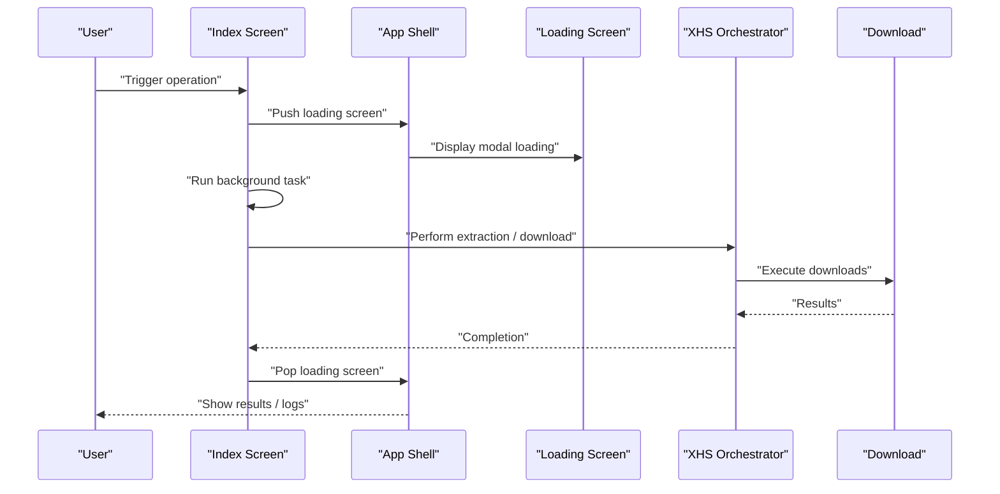

**Diagram sources**
- [index.py:109-131](file://source/TUI/index.py#L109-L131)
- [loading.py:11-22](file://source/TUI/loading.py#L11-L22)
- [app.py:42-64](file://source/TUI/app.py#L42-L64)
- [app.py:268-302](file://source/application/app.py#L268-L302)
- [download.py:220-282](file://source/application/download.py#L220-L282)

## Detailed Component Analysis

### Loading Screen
The loading screen is a modal overlay that presents a localized message and a built-in loading indicator. It is designed to be pushed onto the screen stack during background operations.

Implementation highlights:
- Modal presentation ensures focus remains on the loading state.
- Localized label improves internationalization support.
- Loading indicator provides immediate visual feedback.

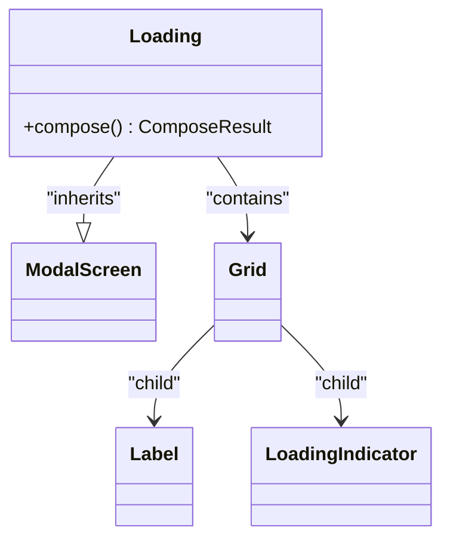

**Diagram sources**
- [loading.py:11-22](file://source/TUI/loading.py#L11-L22)

**Section sources**
- [loading.py:11-22](file://source/TUI/loading.py#L11-L22)

### Progress Screen (Placeholder)
The progress screen currently has an empty composition method and awaits implementation for detailed progress visualization.

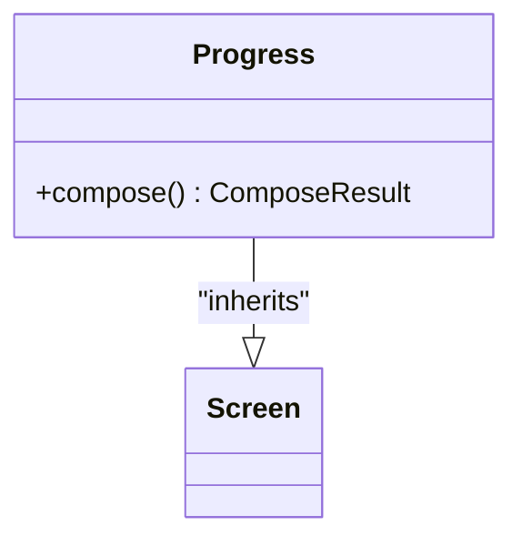

**Diagram sources**
- [progress.py:7-9](file://source/TUI/progress.py#L7-L9)

**Section sources**
- [progress.py:7-9](file://source/TUI/progress.py#L7-L9)

### Index Screen: Background Work and Loading Flow
The Index screen orchestrates user-triggered operations. It pushes the loading screen, runs the background task exclusively, and then dismisses the loading screen upon completion.

Key behaviors:
- Exclusive background execution prevents overlapping operations.
- Pushing the loading screen blocks user interaction until completion.
- Logging and notifications provide status updates.

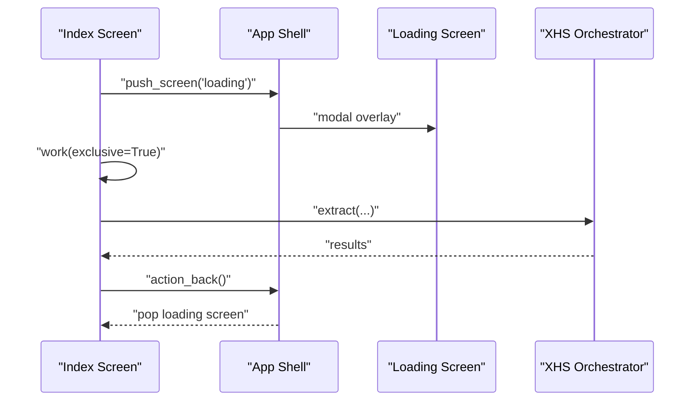

**Diagram sources**
- [index.py:109-131](file://source/TUI/index.py#L109-L131)
- [app.py:42-64](file://source/TUI/app.py#L42-L64)

**Section sources**
- [index.py:109-131](file://source/TUI/index.py#L109-L131)
- [app.py:42-64](file://source/TUI/app.py#L42-L64)

### Monitor Screen: Clipboard Monitoring with Background Tasks
The Monitor screen runs a background task to continuously monitor the clipboard for new links, pushing results into a queue and processing them asynchronously. It also displays a loading indicator until closed.

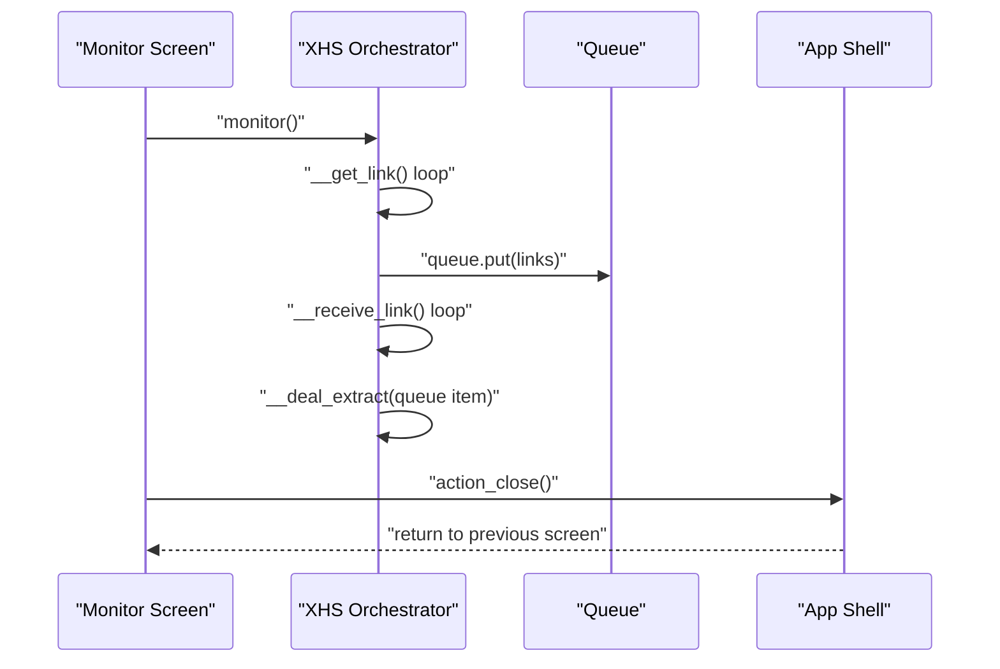

**Diagram sources**
- [monitor.py:42-50](file://source/TUI/monitor.py#L42-L50)
- [app.py:603-651](file://source/application/app.py#L603-L651)

**Section sources**
- [monitor.py:42-50](file://source/TUI/monitor.py#L42-L50)
- [app.py:603-651](file://source/application/app.py#L603-L651)

### Update Screen: Version Check with Loading Indicator
The Update screen displays a loading indicator while checking for new releases. It uses a background task to fetch and compare versions, then dismisses with a notification result.

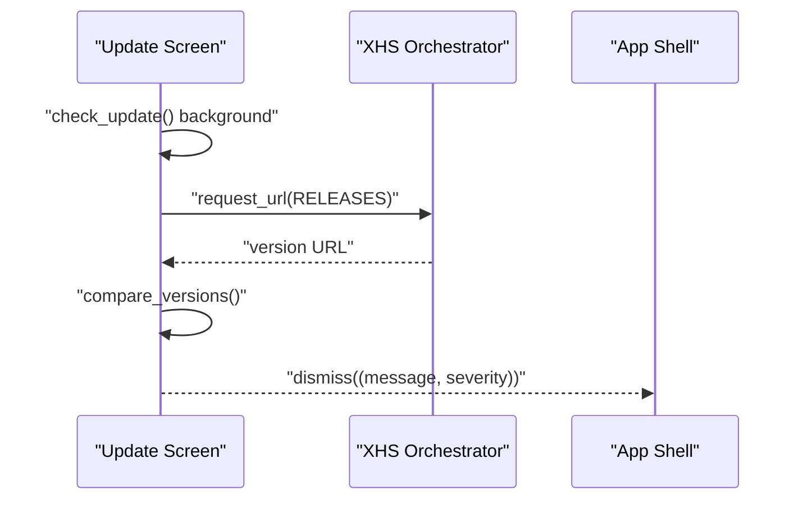

**Diagram sources**
- [update.py:31-76](file://source/TUI/update.py#L31-L76)
- [app.py:737-756](file://source/application/app.py#L737-L756)

**Section sources**
- [update.py:31-76](file://source/TUI/update.py#L31-L76)
- [app.py:737-756](file://source/application/app.py#L737-L756)

### Download Progress Hooks and Status Reporting
The download implementation contains commented-out progress hooks that demonstrate how to initialize and advance a progress bar. These hooks show:
- Creating a progress bar with a total size and initial completed amount.
- Advancing the progress bar incrementally as chunks are written.
- Clearing progress when operations finish or encounter errors.

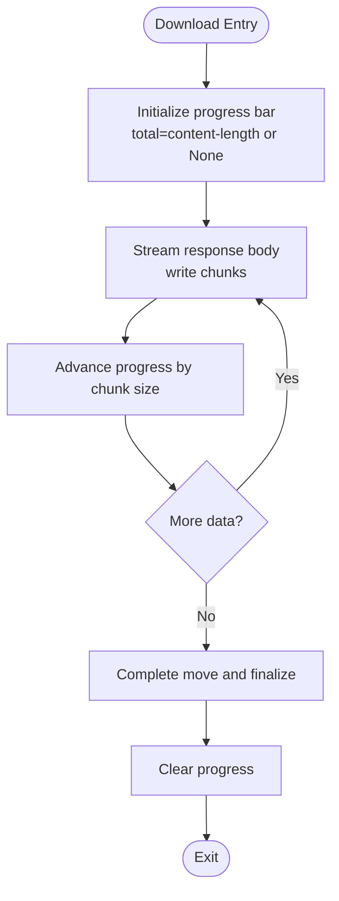

**Diagram sources**
- [download.py:224-249](file://source/application/download.py#L224-L249)
- [download.py:269-281](file://source/application/download.py#L269-L281)

**Section sources**
- [download.py:224-249](file://source/application/download.py#L224-L249)
- [download.py:269-281](file://source/application/download.py#L269-L281)

### Error Handling During Operations
Errors are handled consistently across the application:
- Network errors during requests are logged with severity and returned as empty results.
- Cache errors trigger cleanup and logging with error severity.
- Exceptions in downloads and conversions are caught, logged, and surfaced as failure results.

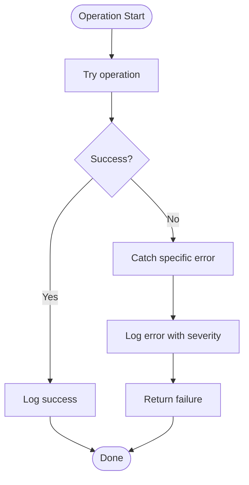

**Diagram sources**
- [request.py:60-69](file://source/application/request.py#L60-L69)
- [download.py:250-267](file://source/application/download.py#L250-L267)
- [download.py:328-337](file://source/application/download.py#L328-L337)

**Section sources**
- [request.py:60-69](file://source/application/request.py#L60-L69)
- [download.py:250-267](file://source/application/download.py#L250-L267)
- [download.py:328-337](file://source/application/download.py#L328-L337)

### Interruption Mechanisms and Recovery
- Clipboard monitoring can be stopped by signaling an event or writing a sentinel value to the clipboard. The monitor loop exits gracefully after clearing the event.
- The application supports stopping script servers and closing resources cleanly.
- Recovery involves re-initializing the application state and reinstalling screens when settings change.

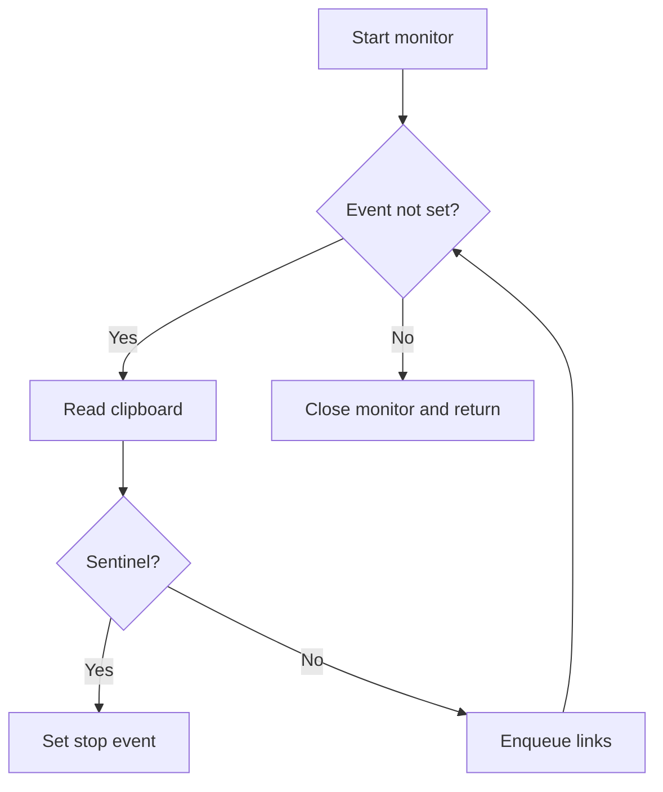

**Diagram sources**
- [app.py:603-651](file://source/application/app.py#L603-L651)
- [app.py:649-651](file://source/application/app.py#L649-L651)

**Section sources**
- [app.py:603-651](file://source/application/app.py#L603-L651)
- [app.py:649-651](file://source/application/app.py#L649-L651)

### Visual Design and Accessibility Considerations
- Loading indicators: Built-in widgets provide consistent visual cues across screens.
- Localization: Labels are translated via the translation module, ensuring clarity for international users.
- Focus management: Modal loading screens capture focus, preventing unintended interactions during operations.
- Notifications: Severity-aware notifications communicate outcomes without blocking the UI.

[No sources needed since this section provides general guidance]

## Dependency Analysis
The TUI depends on the application layer for data extraction and downloads. The application layer coordinates queues, events, and concurrent tasks for monitoring. The download implementation contains progress hooks that can be integrated with UI progress bars.

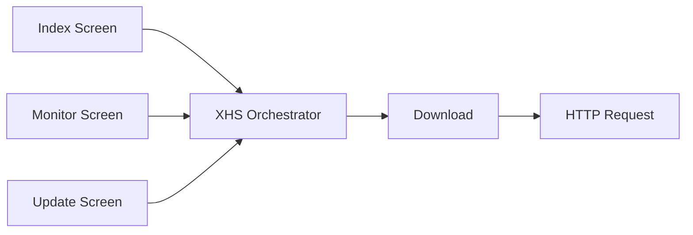

**Diagram sources**
- [index.py:109-131](file://source/TUI/index.py#L109-L131)
- [monitor.py:42-50](file://source/TUI/monitor.py#L42-L50)
- [update.py:31-76](file://source/TUI/update.py#L31-L76)
- [app.py:268-302](file://source/application/app.py#L268-L302)
- [download.py:220-282](file://source/application/download.py#L220-L282)
- [request.py:60-138](file://source/application/request.py#L60-L138)

**Section sources**
- [index.py:109-131](file://source/TUI/index.py#L109-L131)
- [monitor.py:42-50](file://source/TUI/monitor.py#L42-L50)
- [update.py:31-76](file://source/TUI/update.py#L31-L76)
- [app.py:268-302](file://source/application/app.py#L268-L302)
- [download.py:220-282](file://source/application/download.py#L220-L282)
- [request.py:60-138](file://source/application/request.py#L60-L138)

## Performance Considerations
- Background execution: Using exclusive background tasks prevents UI blocking and allows smooth user experience.
- Queue-based processing: Monitoring uses a queue to decouple input detection from processing, enabling steady throughput.
- Chunked downloads: Streaming writes reduce memory usage and enable responsive progress updates.
- Early termination: Events allow immediate exit from long-running loops, reducing wasted work.

[No sources needed since this section provides general guidance]

## Troubleshooting Guide
Common issues and resolutions:
- Loading screen does not appear: Ensure the background task is decorated as exclusive and the loading screen is pushed before starting work.
- No progress updates: Implement progress hooks in the download pipeline and wire them to UI progress bars.
- Errors not reported: Verify logging and notification paths are invoked on exceptions and that severity is set appropriately.
- Monitor not stopping: Confirm the stop event is set and the monitor loop exits gracefully; ensure sentinel checks are present.

**Section sources**
- [index.py:109-131](file://source/TUI/index.py#L109-L131)
- [monitor.py:52-54](file://source/TUI/monitor.py#L52-L54)
- [download.py:250-267](file://source/application/download.py#L250-L267)
- [request.py:60-69](file://source/application/request.py#L60-L69)

## Conclusion
The TUI loading and progress systems provide a robust foundation for asynchronous operation monitoring and user feedback. The modal loading screens, background task execution, and logging/notification pathways combine to deliver a responsive and informative user experience. The application layer’s queue-based monitoring and download progress hooks offer clear extension points for detailed progress visualization and improved user awareness.