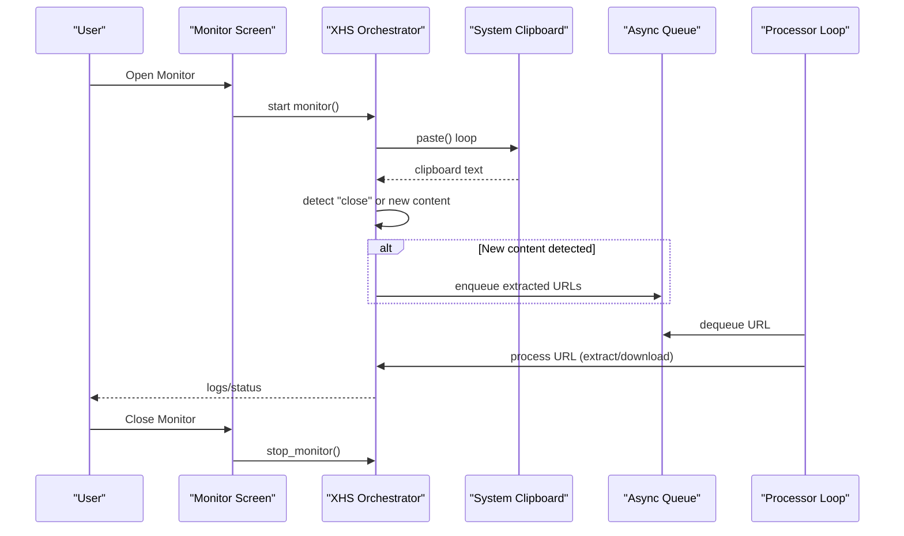
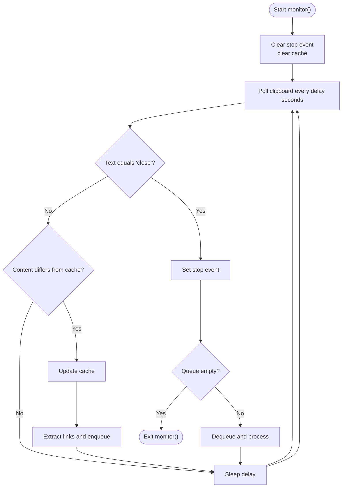
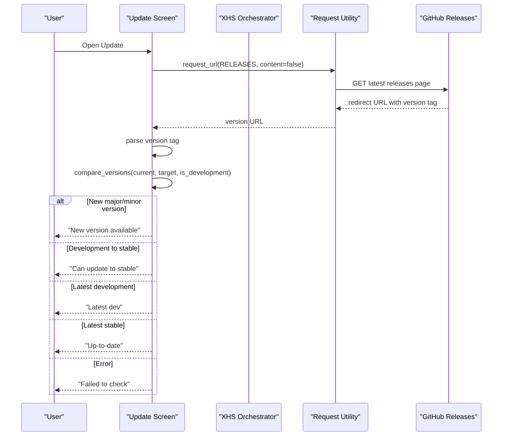
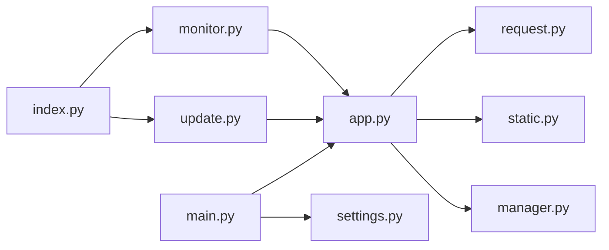

# Monitoring and Update System

<cite>
**Referenced Files in This Document**
- [monitor.py](file://source/TUI/monitor.py)
- [update.py](file://source/TUI/update.py)
- [app.py](file://source/application/app.py)
- [request.py](file://source/application/request.py)
- [static.py](file://source/module/static.py)
- [settings.py](file://source/module/settings.py)
- [manager.py](file://source/module/manager.py)
- [index.py](file://source/TUI/index.py)
- [setting.py](file://source/TUI/setting.py)
- [tools.py](file://source/module/tools.py)
- [main.py](file://source/CLI/main.py)
</cite>

## Table of Contents
1. [Introduction](#introduction)
2. [Project Structure](#project-structure)
3. [Core Components](#core-components)
4. [Architecture Overview](#architecture-overview)
5. [Detailed Component Analysis](#detailed-component-analysis)
6. [Dependency Analysis](#dependency-analysis)
7. [Performance Considerations](#performance-considerations)
8. [Troubleshooting Guide](#troubleshooting-guide)
9. [Conclusion](#conclusion)

## Introduction
This document explains the monitoring and update system of the application. It covers:
- Clipboard monitoring and automatic content detection for Xiaohongshu (Little Red Book) links
- Automatic extraction and download triggers
- Update checking, version comparison, and notification
- Configuration and filtering options
- Integration with external systems and script servers
- Performance impact, resource optimization, and user controls
- Troubleshooting monitoring and update issues

## Project Structure
The monitoring and update system spans several modules:
- TUI screens for interactive monitoring and update checks
- Application core orchestrating clipboard monitoring, URL extraction, and downloads
- Request utilities for network operations
- Static constants for versioning and release URLs
- Settings and manager for configuration and client initialization
- CLI entry for programmatic usage

```mermaid
graph TB
subgraph "TUI"
M["Monitor Screen<br/>source/TUI/monitor.py"]
U["Update Screen<br/>source/TUI/update.py"]
IDX["Index Screen<br/>source/TUI/index.py"]
SET["Settings Screen<br/>source/TUI/setting.py"]
end
subgraph "Application Core"
APP["XHS Orchestrator<br/>source/application/app.py"]
REQ["HTML Requests<br/>source/application/request.py"]
end
subgraph "Configuration & Static"
ST["Version & Constants<br/>source/module/static.py"]
MG["Manager & Clients<br/>source/module/manager.py"]
STG["Settings Persistence<br/>source/module/settings.py"]
TL["Utilities<br/>source/module/tools.py"]
end
subgraph "CLI"
CLI["CLI Entrypoint<br/>source/CLI/main.py"]
end
IDX --> M
IDX --> U
M --> APP
U --> APP
APP --> REQ
APP --> ST
APP --> MG
SET --> MG
CLI --> APP
CLI --> STG
```

**Diagram sources**
- [monitor.py:18-59](file://source/TUI/monitor.py#L18-L59)
- [update.py:16-93](file://source/TUI/update.py#L16-L93)
- [index.py:27-152](file://source/TUI/index.py#L27-L152)
- [app.py:98-194](file://source/application/app.py#L98-L194)
- [request.py:15-138](file://source/application/request.py#L15-L138)
- [static.py:3-16](file://source/module/static.py#L3-L16)
- [manager.py:28-133](file://source/module/manager.py#L28-L133)
- [settings.py:10-124](file://source/module/settings.py#L10-L124)
- [tools.py:13-64](file://source/module/tools.py#L13-L64)
- [main.py:39-101](file://source/CLI/main.py#L39-L101)

**Section sources**
- [monitor.py:18-59](file://source/TUI/monitor.py#L18-L59)
- [update.py:16-93](file://source/TUI/update.py#L16-L93)
- [index.py:27-152](file://source/TUI/index.py#L27-L152)
- [app.py:98-194](file://source/application/app.py#L98-L194)
- [request.py:15-138](file://source/application/request.py#L15-L138)
- [static.py:3-16](file://source/module/static.py#L3-L16)
- [manager.py:28-133](file://source/module/manager.py#L28-L133)
- [settings.py:10-124](file://source/module/settings.py#L10-L124)
- [tools.py:13-64](file://source/module/tools.py#L13-L64)
- [main.py:39-101](file://source/CLI/main.py#L39-L101)

## Core Components
- Clipboard monitoring screen and controller
- Application-level monitor loop with clipboard polling, queueing, and processing
- Update checker with version comparison and user notification
- Request utilities for fetching latest release URL and content
- Static version constants and release endpoints
- Settings and manager for configuration persistence and HTTP clients
- CLI integration for programmatic control

Key responsibilities:
- Monitor: launch and manage clipboard monitoring lifecycle
- XHS: continuously poll clipboard, detect URLs, enqueue for processing, and trigger downloads
- Update: fetch latest release URL, parse version, compare against local, notify user
- Manager: configure HTTP clients, proxies, timeouts, and file naming
- Settings: persist and migrate configuration across runs

**Section sources**
- [monitor.py:18-59](file://source/TUI/monitor.py#L18-L59)
- [app.py:603-651](file://source/application/app.py#L603-L651)
- [update.py:16-93](file://source/TUI/update.py#L16-L93)
- [request.py:15-138](file://source/application/request.py#L15-L138)
- [static.py:3-16](file://source/module/static.py#L3-L16)
- [manager.py:28-133](file://source/module/manager.py#L28-L133)
- [settings.py:10-124](file://source/module/settings.py#L10-L124)

## Architecture Overview
The monitoring and update system integrates TUI screens, the application orchestrator, and request utilities. The clipboard monitor runs concurrently with the processing loop, using an internal queue to decouple detection from processing. The update checker queries the latest release page and compares versions.



**Diagram sources**
- [monitor.py:42-54](file://source/TUI/monitor.py#L42-L54)
- [app.py:603-651](file://source/application/app.py#L603-L651)

**Section sources**
- [monitor.py:18-59](file://source/TUI/monitor.py#L18-L59)
- [app.py:603-651](file://source/application/app.py#L603-L651)

## Detailed Component Analysis

### Clipboard Monitoring and Automatic Content Detection
The clipboard monitoring system continuously polls the system clipboard, detects Xiaohongshu links, and enqueues them for processing. It supports stopping via a special keyword and integrates with the application’s logging.



Key behaviors:
- Delayed polling to reduce CPU usage
- Early exit when a stop signal is detected
- Queue-based processing to avoid blocking detection
- URL extraction using compiled regex patterns for supported link formats

**Diagram sources**
- [app.py:603-651](file://source/application/app.py#L603-L651)

**Section sources**
- [app.py:603-651](file://source/application/app.py#L603-L651)

### URL Detection and Extraction
The application extracts Xiaohongshu URLs from clipboard content using compiled regular expressions. It supports short links, share links, explore pages, and user profiles. Detected URLs are enqueued for processing.

Supported patterns:
- Short links
- Share items
- Explore pages
- User profiles

Extraction pipeline:
- Split input by whitespace
- Normalize short links via redirection resolution
- Validate and collect supported URL forms

**Section sources**
- [app.py:358-375](file://source/application/app.py#L358-L375)

### Automatic Extraction and Download Triggers
Once URLs are enqueued, the processor loop dequeues and processes each URL. It retrieves HTML, parses data, determines media types, and triggers downloads accordingly. Logging tracks progress and outcomes.

Processing stages:
- Resolve and fetch HTML
- Parse structured data
- Determine media type (video/image)
- Trigger downloads and record outcomes
- Save metadata and history

**Section sources**
- [app.py:386-506](file://source/application/app.py#L386-L506)

### Update Checking, Version Comparison, and Notification
The update checker fetches the latest release page, extracts the version tag, and compares it to the local version. It reports actionable messages to the user.



Version comparison logic:
- Major version bump: new version
- Same major, higher minor: new version
- Same major/minor: development vs stable branch
- Otherwise: older or invalid

**Diagram sources**
- [update.py:31-76](file://source/TUI/update.py#L31-L76)
- [update.py:78-92](file://source/TUI/update.py#L78-L92)
- [request.py:26-70](file://source/application/request.py#L26-L70)
- [static.py:13-15](file://source/module/static.py#L13-L15)

**Section sources**
- [update.py:16-93](file://source/TUI/update.py#L16-L93)
- [request.py:15-138](file://source/application/request.py#L15-L138)
- [static.py:3-16](file://source/module/static.py#L3-L16)

### Monitoring Configuration and Filter Settings
Monitoring behavior is influenced by configuration settings and manager options. Users can adjust:
- Work path and folder naming
- Name format for files
- User agent and cookie
- Proxy and timeout
- Download toggles (images, videos, live GIFs)
- Record data and download records
- Folder mode and author archive
- Write modification time
- Script server enablement

These settings initialize HTTP clients, naming rules, and download preferences.

**Section sources**
- [setting.py:13-271](file://source/TUI/setting.py#L13-L271)
- [settings.py:10-124](file://source/module/settings.py#L10-L124)
- [manager.py:28-133](file://source/module/manager.py#L28-L133)

### Notification Preferences and Logging
Logging is integrated into the monitoring and update flows. The application uses a print wrapper to route messages to either console or TUI log widgets. Styles differentiate informational, warning, and error messages.

**Section sources**
- [app.py:85-96](file://source/application/app.py#L85-L96)
- [tools.py:42-51](file://source/module/tools.py#L42-L51)

### Integration with External Systems and Script Servers
The system includes a script server capability and a Tampermonkey user script that can communicate via WebSocket. While the monitoring system primarily relies on clipboard polling, the script server can be enabled through settings and used to integrate with external automation.

- Script server toggle in settings
- WebSocket manager in the user script for connection and messaging
- Server-side MCP/FastAPI routes for data retrieval and downloads

Note: Clipboard monitoring does not depend on the script server; however, enabling the script server allows external integrations.

**Section sources**
- [setting.py:167-172](file://source/TUI/setting.py#L167-L172)
- [manager.py:131-132](file://source/module/manager.py#L131-L132)
- [app.py:758-800](file://source/application/app.py#L758-L800)

### Automated Operation Scenarios
Common automated workflows:
- Continuous clipboard monitoring with periodic polling
- Batch extraction from clipboard content containing multiple URLs
- Automatic download with configured filters and naming rules
- Update check on demand or at startup via CLI

**Section sources**
- [monitor.py:42-50](file://source/TUI/monitor.py#L42-L50)
- [app.py:603-651](file://source/application/app.py#L603-L651)
- [main.py:61-64](file://source/CLI/main.py#L61-L64)

## Dependency Analysis
The monitoring and update system exhibits clear separation of concerns:
- TUI components depend on the application orchestrator
- Application core depends on request utilities and configuration
- Update checker depends on static constants and request utilities
- Settings and manager provide configuration and HTTP client initialization



**Diagram sources**
- [monitor.py:8-29](file://source/TUI/monitor.py#L8-L29)
- [update.py:7-22](file://source/TUI/update.py#L7-L22)
- [app.py:26-53](file://source/application/app.py#L26-L53)
- [request.py:15-24](file://source/application/request.py#L15-L24)
- [static.py:3-16](file://source/module/static.py#L3-L16)
- [manager.py:28-78](file://source/module/manager.py#L28-L78)
- [index.py:10-42](file://source/TUI/index.py#L10-L42)
- [main.py:19-52](file://source/CLI/main.py#L19-L52)
- [settings.py:41-60](file://source/module/settings.py#L41-L60)

**Section sources**
- [monitor.py:8-29](file://source/TUI/monitor.py#L8-L29)
- [update.py:7-22](file://source/TUI/update.py#L7-L22)
- [app.py:26-53](file://source/application/app.py#L26-L53)
- [request.py:15-24](file://source/application/request.py#L15-L24)
- [static.py:3-16](file://source/module/static.py#L3-L16)
- [manager.py:28-78](file://source/module/manager.py#L28-L78)
- [index.py:10-42](file://source/TUI/index.py#L10-L42)
- [main.py:19-52](file://source/CLI/main.py#L19-L52)
- [settings.py:41-60](file://source/module/settings.py#L41-L60)

## Performance Considerations
- Clipboard polling interval: adjustable delay reduces CPU usage during idle periods
- Queue-based processing: decouples detection from processing to prevent blocking
- Asynchronous HTTP requests: efficient concurrent downloads and metadata retrieval
- Retry mechanism: configurable retries for transient network errors
- Logging throttling: minimal overhead through batched writes to TUI log widget
- Resource cleanup: proper closing of HTTP clients and temporary directories

Recommendations:
- Increase polling delay for low-power devices
- Limit concurrent downloads via manager settings
- Use proxies judiciously to avoid timeouts
- Enable download records to skip previously processed items

**Section sources**
- [app.py:603-651](file://source/application/app.py#L603-L651)
- [manager.py:100-124](file://source/module/manager.py#L100-L124)
- [tools.py:13-22](file://source/module/tools.py#L13-L22)

## Troubleshooting Guide
Clipboard monitoring issues:
- No detection: ensure clipboard content is fresh and not identical to previous cache
- Immediate stop: writing a specific keyword to clipboard stops monitoring
- Slow responsiveness: increase polling delay to reduce CPU usage
- Queue backlog: ensure processing loop is running and not blocked

Update failure:
- Network errors: verify connectivity and proxy settings
- Version parsing: ensure the release page URL resolves to a version tag
- Timeout: increase request timeout in settings

Configuration problems:
- Missing cookies or outdated headers: update settings and restart
- Incorrect paths or permissions: validate work path and folder permissions
- Proxy misconfiguration: test proxy connectivity before use

**Section sources**
- [app.py:603-651](file://source/application/app.py#L603-L651)
- [request.py:26-70](file://source/application/request.py#L26-L70)
- [settings.py:62-91](file://source/module/settings.py#L62-L91)
- [manager.py:225-259](file://source/module/manager.py#L225-L259)

## Conclusion
The monitoring and update system provides robust, user-driven automation for Xiaohongshu content extraction and downloading, with optional update notifications and flexible configuration. Clipboard monitoring runs efficiently with polling and queueing, while the update checker offers clear feedback on version status. Proper configuration and awareness of performance trade-offs enable reliable operation across diverse environments.