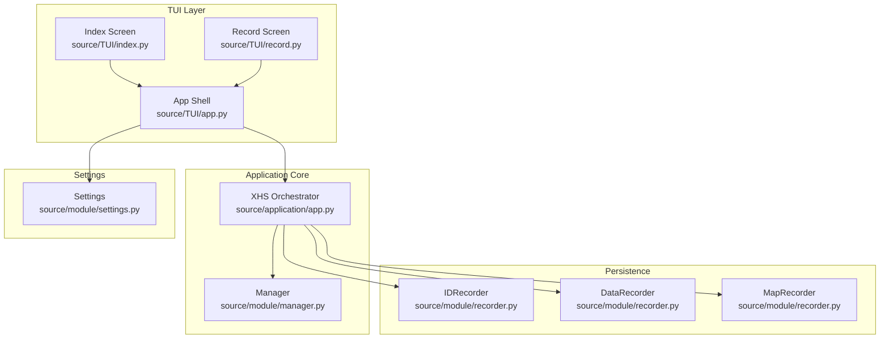
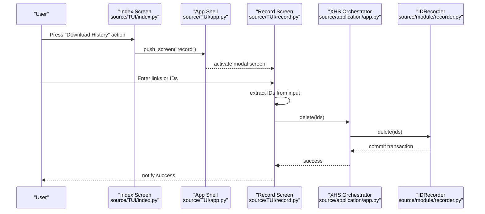
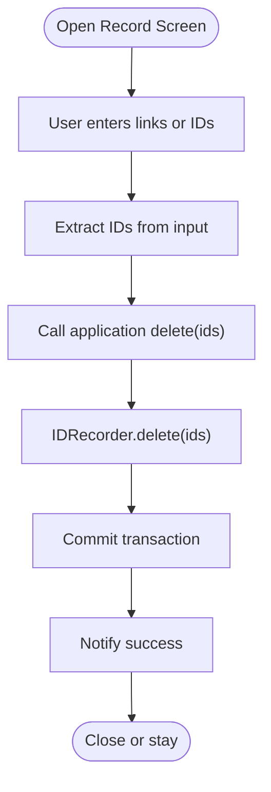
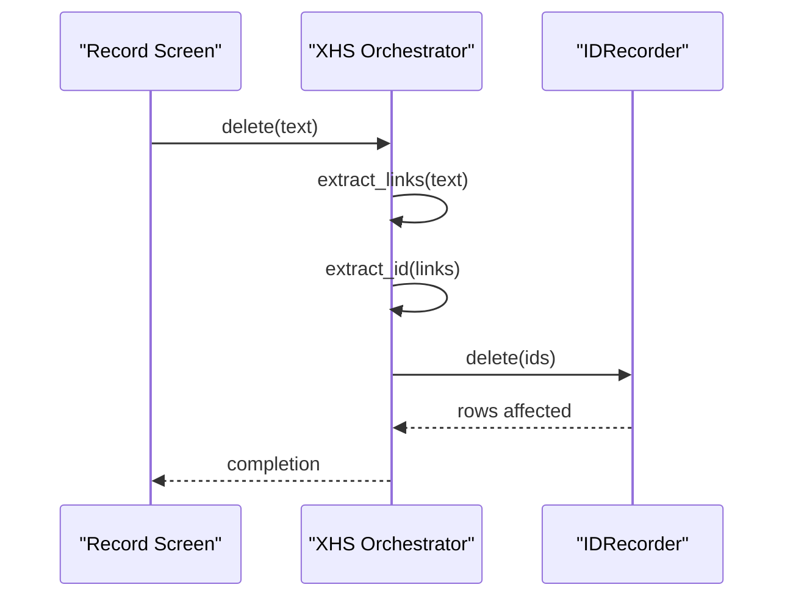
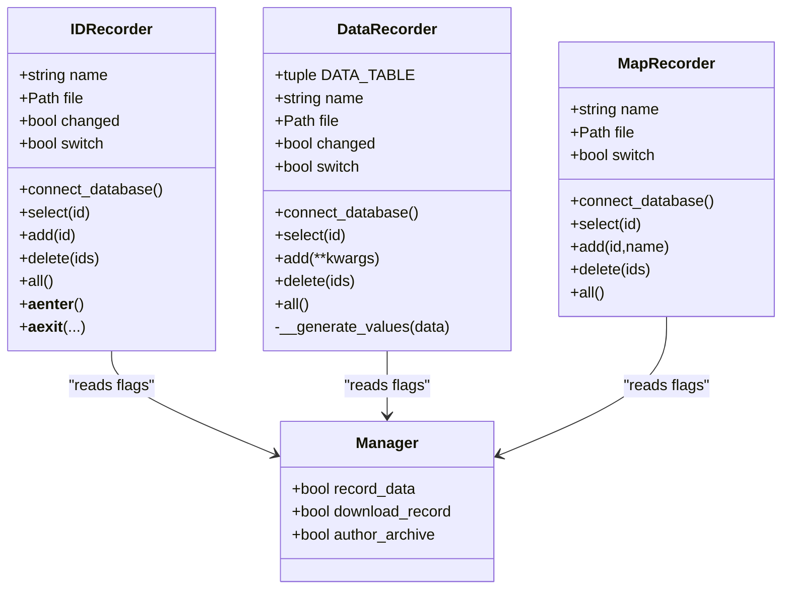
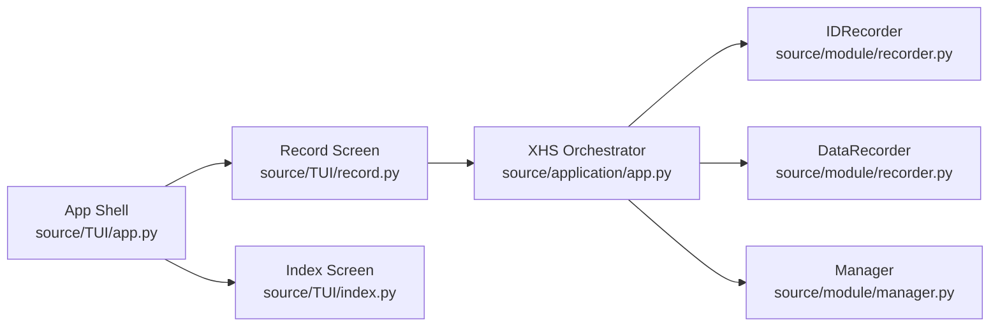

# Records Screen

<cite>
**Referenced Files in This Document**
- [source/TUI/record.py](file://source/TUI/record.py)
- [source/TUI/index.py](file://source/TUI/index.py)
- [source/TUI/app.py](file://source/TUI/app.py)
- [source/application/app.py](file://source/application/app.py)
- [source/module/recorder.py](file://source/module/recorder.py)
- [source/module/manager.py](file://source/module/manager.py)
- [source/module/settings.py](file://source/module/settings.py)
- [source/TUI/loading.py](file://source/TUI/loading.py)
</cite>

## Table of Contents
1. [Introduction](#introduction)
2. [Project Structure](#project-structure)
3. [Core Components](#core-components)
4. [Architecture Overview](#architecture-overview)
5. [Detailed Component Analysis](#detailed-component-analysis)
6. [Dependency Analysis](#dependency-analysis)
7. [Performance Considerations](#performance-considerations)
8. [Troubleshooting Guide](#troubleshooting-guide)
9. [Conclusion](#conclusion)

## Introduction
This document describes the Records Screen, focusing on the download history management interface and the underlying database integration. It explains how the application records and manages download history, how the SQLite-backed recorders persist data, and how the TUI screen enables targeted deletion of specific records. It also outlines the current limitations around filtering, search, sorting, and bulk operations, and provides guidance for troubleshooting database connectivity and integrity issues.

## Project Structure
The Records Screen is part of the TUI application and interacts with the core application and database recorders:
- The TUI screen is defined in a dedicated modal screen class.
- The main application orchestrates extraction, downloading, and recording.
- Database recorders manage persistent storage for download history and data snapshots.
- Settings control whether recording is enabled.

**Diagram sources**
- [source/TUI/index.py:135-152](file://source/TUI/index.py#L135-L152)
- [source/TUI/record.py:13-57](file://source/TUI/record.py#L13-L57)
- [source/TUI/app.py:42-64](file://source/TUI/app.py#L42-L64)
- [source/application/app.py:147-186](file://source/application/app.py#L147-L186)
- [source/module/recorder.py:13-191](file://source/module/recorder.py#L13-L191)
- [source/module/manager.py:28-132](file://source/module/manager.py#L28-L132)
- [source/module/settings.py:52-81](file://source/module/settings.py#L52-L81)

**Section sources**
- [source/TUI/index.py:135-152](file://source/TUI/index.py#L135-L152)
- [source/TUI/record.py:13-57](file://source/TUI/record.py#L13-L57)
- [source/TUI/app.py:42-64](file://source/TUI/app.py#L42-L64)
- [source/application/app.py:147-186](file://source/application/app.py#L147-L186)
- [source/module/recorder.py:13-191](file://source/module/recorder.py#L13-L191)
- [source/module/manager.py:28-132](file://source/module/manager.py#L28-L132)
- [source/module/settings.py:52-81](file://source/module/settings.py#L52-L81)

## Core Components
- Record Screen (modal): Provides a simple input field and buttons to delete specific download records by ID or link. It extracts IDs from user input and delegates deletion to the application’s recorder.
- Application Orchestrator: Coordinates extraction, downloading, and recording. It conditionally records download history and data snapshots based on settings.
- Database Recorders:
  - IDRecorder: Stores IDs of downloaded items in a SQLite table for history checks.
  - DataRecorder: Stores full metadata snapshots in a separate SQLite table when enabled.
  - MapRecorder: Maintains author ID to name mappings for archival and display.
- Manager: Centralizes configuration and client creation, including flags that enable or disable recording features.
- Settings: Persist and load configuration, including flags for enabling download history and data recording.

Key behaviors:
- The Record Screen supports deleting one or more IDs extracted from user-provided links or IDs.
- Deletion is performed via the application’s recorder, which uses SQLite transactions.
- Filtering, search, sorting, and bulk operations are not implemented in the current Records Screen.

**Section sources**
- [source/TUI/record.py:13-57](file://source/TUI/record.py#L13-L57)
- [source/application/app.py:262-267](file://source/application/app.py#L262-L267)
- [source/application/app.py:653-654](file://source/application/app.py#L653-L654)
- [source/module/recorder.py:13-68](file://source/module/recorder.py#L13-L68)
- [source/module/recorder.py:81-144](file://source/module/recorder.py#L81-L144)
- [source/module/recorder.py:146-191](file://source/module/recorder.py#L146-L191)
- [source/module/manager.py:92-131](file://source/module/manager.py#L92-L131)
- [source/module/settings.py:25-36](file://source/module/settings.py#L25-L36)

## Architecture Overview
The Records Screen is a thin UI layer that triggers deletion operations backed by the application and database recorders.

**Diagram sources**
- [source/TUI/index.py:151-152](file://source/TUI/index.py#L151-L152)
- [source/TUI/app.py:58-63](file://source/TUI/app.py#L58-L63)
- [source/TUI/record.py:40-56](file://source/TUI/record.py#L40-L56)
- [source/application/app.py:262-267](file://source/application/app.py#L262-L267)
- [source/module/recorder.py:46-53](file://source/module/recorder.py#L46-L53)

## Detailed Component Analysis

### Record Screen (Deletion UI)
- Purpose: Accepts user input containing one or more links or IDs, extracts IDs, and deletes matching records from the download history.
- Behavior:
  - Input parsing and ID extraction are delegated to the application.
  - Deletion is executed against the ID recorder.
  - Success notification is shown to the user.

**Diagram sources**
- [source/TUI/record.py:21-56](file://source/TUI/record.py#L21-L56)
- [source/application/app.py:262-267](file://source/application/app.py#L262-L267)
- [source/module/recorder.py:46-53](file://source/module/recorder.py#L46-L53)

**Section sources**
- [source/TUI/record.py:13-57](file://source/TUI/record.py#L13-L57)

### Application Integration (Extraction and Deletion)
- Extraction:
  - Links are normalized and validated.
  - IDs are extracted from links for later use.
- Deletion:
  - The application invokes the recorder’s delete method with a list of IDs.
  - The recorder executes SQL DELETE statements within a transaction.

**Diagram sources**
- [source/TUI/record.py:40-51](file://source/TUI/record.py#L40-L51)
- [source/application/app.py:358-384](file://source/application/app.py#L358-L384)
- [source/application/app.py:262-267](file://source/application/app.py#L262-L267)
- [source/module/recorder.py:46-53](file://source/module/recorder.py#L46-L53)

**Section sources**
- [source/application/app.py:358-384](file://source/application/app.py#L358-L384)
- [source/application/app.py:262-267](file://source/application/app.py#L262-L267)

### Database Integration (Recorders)
- IDRecorder:
  - Stores download history IDs in a SQLite table.
  - Supports select, add, delete, and list operations.
  - Uses a switch flag to enable/disable recording based on settings.
- DataRecorder:
  - Stores full metadata snapshots in a separate SQLite table when enabled.
  - Provides add operations and placeholder methods for select/all/delete.
- MapRecorder:
  - Maintains author ID to name mappings for archival and display.

**Diagram sources**
- [source/module/recorder.py:13-68](file://source/module/recorder.py#L13-L68)
- [source/module/recorder.py:81-144](file://source/module/recorder.py#L81-L144)
- [source/module/recorder.py:146-191](file://source/module/recorder.py#L146-L191)
- [source/module/manager.py:92-131](file://source/module/manager.py#L92-L131)

**Section sources**
- [source/module/recorder.py:13-68](file://source/module/recorder.py#L13-L68)
- [source/module/recorder.py:81-144](file://source/module/recorder.py#L81-L144)
- [source/module/recorder.py:146-191](file://source/module/recorder.py#L146-L191)
- [source/module/manager.py:92-131](file://source/module/manager.py#L92-L131)

### Settings and Feature Flags
- Settings include flags to enable:
  - Recording of data snapshots (record_data)
  - Recording of download history (download_record)
  - Author archive mapping (author_archive)
- These flags control whether recorders perform operations.

**Section sources**
- [source/module/settings.py:25-36](file://source/module/settings.py#L25-L36)
- [source/module/manager.py:92-131](file://source/module/manager.py#L92-L131)

## Dependency Analysis
- The Record Screen depends on the application to:
  - Extract links and IDs from user input.
  - Invoke deletion against the ID recorder.
- The application depends on:
  - IDRecorder for download history checks and deletions.
  - DataRecorder for optional data snapshot persistence.
  - Manager for configuration flags and client setup.
- The App Shell installs and manages screens, including the Record Screen.

**Diagram sources**
- [source/TUI/record.py:13-57](file://source/TUI/record.py#L13-L57)
- [source/application/app.py:262-267](file://source/application/app.py#L262-L267)
- [source/module/recorder.py:13-68](file://source/module/recorder.py#L13-L68)
- [source/module/recorder.py:81-144](file://source/module/recorder.py#L81-L144)
- [source/module/manager.py:92-131](file://source/module/manager.py#L92-L131)
- [source/TUI/app.py:42-64](file://source/TUI/app.py#L42-L64)
- [source/TUI/index.py:151-152](file://source/TUI/index.py#L151-L152)

**Section sources**
- [source/TUI/record.py:13-57](file://source/TUI/record.py#L13-L57)
- [source/application/app.py:262-267](file://source/application/app.py#L262-L267)
- [source/module/recorder.py:13-68](file://source/module/recorder.py#L13-L68)
- [source/module/recorder.py:81-144](file://source/module/recorder.py#L81-L144)
- [source/module/manager.py:92-131](file://source/module/manager.py#L92-L131)
- [source/TUI/app.py:42-64](file://source/TUI/app.py#L42-L64)
- [source/TUI/index.py:151-152](file://source/TUI/index.py#L151-L152)

## Performance Considerations
- SQLite operations are synchronous in the current implementation; batching deletions reduces overhead.
- Transactions are committed per operation; grouping multiple deletions into a single transaction improves performance.
- Current recorder methods do not expose bulk operations; adding batch APIs would reduce round-trips.

[No sources needed since this section provides general guidance]

## Troubleshooting Guide
Common issues and resolutions:
- Database connection errors:
  - Ensure the application is properly initialized and database contexts are entered/exited.
  - The App Shell closes database cursors and connections during refresh; re-run initialization if stale handles remain open.
- Permission errors writing to database files:
  - Verify the working directory and file permissions for the database files.
  - Confirm the application has write access to the target location.
- Data not recorded:
  - Check settings flags for enabling download history and data recording.
  - Confirm Manager flags are set accordingly.
- Deleting records fails silently:
  - Confirm IDs were successfully extracted from input.
  - Verify the recorder’s switch flag allows deletion.

**Section sources**
- [source/TUI/app.py:75-79](file://source/TUI/app.py#L75-L79)
- [source/TUI/app.py:121-125](file://source/TUI/app.py#L121-L125)
- [source/module/settings.py:25-36](file://source/module/settings.py#L25-L36)
- [source/module/manager.py:92-131](file://source/module/manager.py#L92-L131)
- [source/module/recorder.py:46-53](file://source/module/recorder.py#L46-L53)

## Conclusion
The Records Screen currently provides a focused deletion interface for download history entries, backed by SQLite-based recorders. While it lacks advanced features like filtering, search, sorting, and bulk operations, it offers a reliable mechanism to remove specific records. Future enhancements could include richer UI for browsing and managing records, batch operations, and optional export capabilities. For now, users should rely on the application’s extraction and recording mechanisms and use the Records Screen to remove unwanted entries.