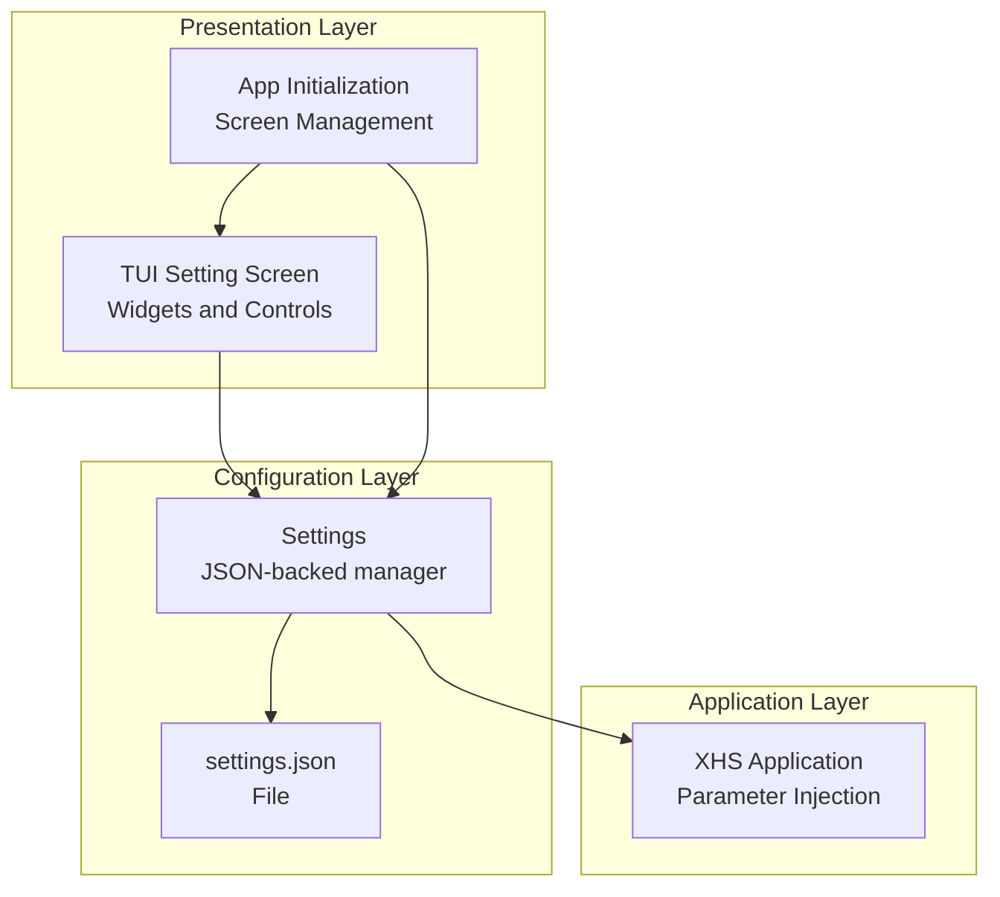
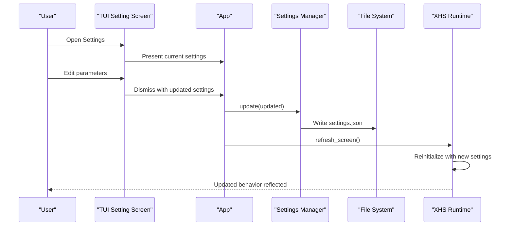
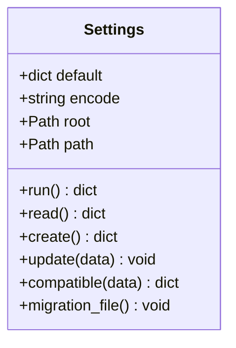
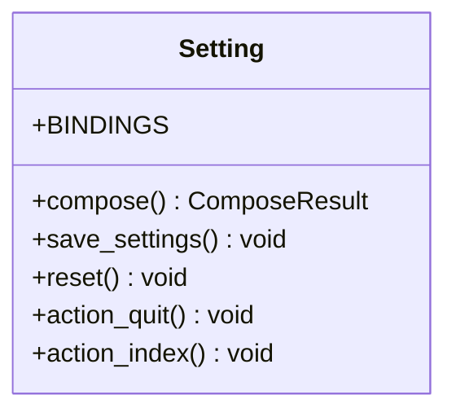
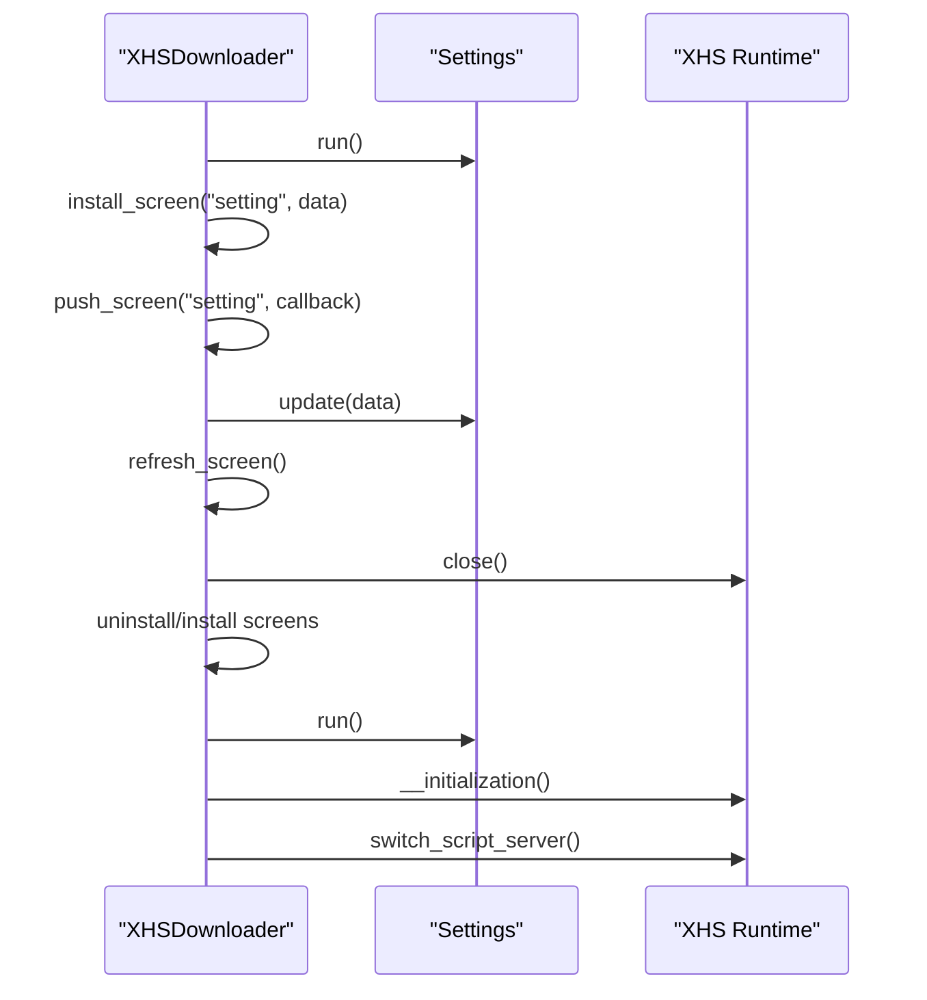
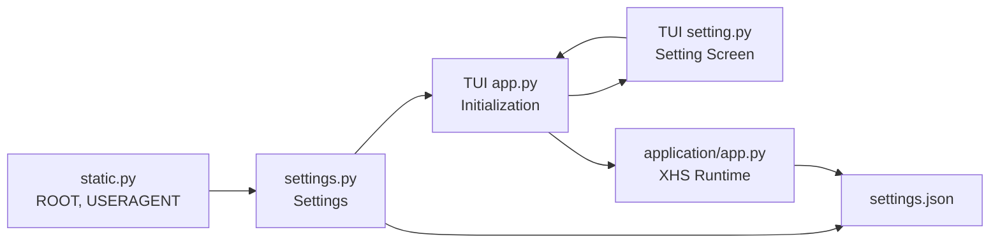

# Settings Screen

<cite>
**Referenced Files in This Document**
- [settings.py](file://source/module/settings.py)
- [setting.py](file://source/TUI/setting.py)
- [app.py](file://source/TUI/app.py)
- [app.py](file://source/application/app.py)
- [static.py](file://source/module/static.py)
- [README.md](file://README.md)
- [README_EN.md](file://README_EN.md)
</cite>

## Table of Contents
1. [Introduction](#introduction)
2. [Project Structure](#project-structure)
3. [Core Components](#core-components)
4. [Architecture Overview](#architecture-overview)
5. [Detailed Component Analysis](#detailed-component-analysis)
6. [Dependency Analysis](#dependency-analysis)
7. [Performance Considerations](#performance-considerations)
8. [Troubleshooting Guide](#troubleshooting-guide)
9. [Conclusion](#conclusion)
10. [Appendices](#appendices)

## Introduction
This document explains the settings screen and configuration management for the application. It covers the configuration categories, parameter editing capabilities, validation and persistence mechanisms, configuration file management, real-time preview and immediate effect behavior, import/export and backup procedures, and troubleshooting guidance. The goal is to help both end users and developers understand how settings are presented, validated, persisted, and applied across the system.

## Project Structure
The settings system spans two primary areas:
- A JSON-backed configuration manager that reads, writes, and validates settings.
- A TUI settings screen that presents controls for editing settings and applies changes immediately.

**Diagram sources**
- [settings.py:41-123](file://source/module/settings.py#L41-L123)
- [setting.py:13-271](file://source/TUI/setting.py#L13-L271)
- [app.py:18-126](file://source/TUI/app.py#L18-L126)
- [app.py:98-194](file://source/application/app.py#L98-L194)

**Section sources**
- [settings.py:41-123](file://source/module/settings.py#L41-L123)
- [setting.py:13-271](file://source/TUI/setting.py#L13-L271)
- [app.py:18-126](file://source/TUI/app.py#L18-L126)
- [app.py:98-194](file://source/application/app.py#L98-L194)

## Core Components
- Settings manager: Reads/writes JSON settings, ensures defaults, and migrates legacy files.
- TUI settings screen: Presents controls for editing settings and returns updated values to the app.
- App integration: Initializes the application with current settings and refreshes runtime state after changes.
- Application runtime: Consumes settings to control behavior such as file naming, download preferences, and quality options.

Key responsibilities:
- Validation: Ensures all default keys exist; adds missing keys and persists them.
- Persistence: Writes updated settings to disk in UTF-8 or UTF-8-SIG depending on OS.
- Migration: Moves legacy settings file to new location if needed.
- Immediate effect: Some settings take effect immediately; others require a restart or refresh.

**Section sources**
- [settings.py:10-123](file://source/module/settings.py#L10-L123)
- [setting.py:13-271](file://source/TUI/setting.py#L13-L271)
- [app.py:18-126](file://source/TUI/app.py#L18-L126)
- [app.py:98-194](file://source/application/app.py#L98-L194)

## Architecture Overview
The settings architecture integrates a file-based configuration with a TUI-driven editing experience and runtime application behavior.

**Diagram sources**
- [app.py:66-105](file://source/TUI/app.py#L66-L105)
- [settings.py:83-92](file://source/module/settings.py#L83-L92)
- [setting.py:233-260](file://source/TUI/setting.py#L233-L260)

## Detailed Component Analysis

### Settings Manager (JSON-backed)
The Settings class manages the configuration file:
- Default values define all supported parameters.
- Compatibility ensures missing keys are added with defaults.
- Migration moves legacy settings file to the new path.
- Read/write/update operations use UTF-8 or UTF-8-SIG depending on OS.

**Diagram sources**
- [settings.py:10-123](file://source/module/settings.py#L10-L123)

**Section sources**
- [settings.py:10-123](file://source/module/settings.py#L10-L123)

### TUI Settings Screen
The TUI Setting screen provides:
- Inputs for paths, timeouts, chunk sizes, retries, and cookies.
- Checkboxes for toggling downloads, archives, and metadata writing.
- Select widgets for image format, language, and video preference.
- Save and abandon buttons to persist or discard changes.

Behavior:
- On save, collects values from widgets and returns them to the app.
- On abandon, resets to the original settings dictionary.
- Uses localized labels and placeholders.

**Diagram sources**
- [setting.py:13-271](file://source/TUI/setting.py#L13-L271)

**Section sources**
- [setting.py:13-271](file://source/TUI/setting.py#L13-L271)

### App Integration and Refresh
The TUI app initializes the Settings manager and installs the settings screen. When settings change:
- The app receives updated settings from the screen.
- It persists them via Settings.update.
- It refreshes the runtime by closing and reinitializing the application instance, reinstalling screens, and restarting the script server if applicable.

**Diagram sources**
- [app.py:18-126](file://source/TUI/app.py#L18-L126)
- [app.py:98-194](file://source/application/app.py#L98-L194)

**Section sources**
- [app.py:18-126](file://source/TUI/app.py#L18-L126)
- [app.py:98-194](file://source/application/app.py#L98-L194)

### Settings Categories and Parameter Editing Capabilities
Below are the available settings categories and their roles. These are derived from the default configuration and the TUI controls.

- Download preferences
  - image_download: Toggle for image/atlas downloads.
  - video_download: Toggle for video downloads.
  - live_download: Toggle for animated image downloads.
  - download_record: Toggle download record tracking.
  - folder_mode: Toggle per-note folder creation.
  - author_archive: Toggle author-scoped archive folders.
  - write_mtime: Toggle writing file modification time to publish time.
  - chunk: Download chunk size in bytes.
  - max_retry: Maximum retry attempts for failed requests.
  - timeout: Request timeout in seconds.

- File naming formats
  - name_format: Template string with space-separated fields (e.g., publish time, author nickname, title).
  - folder_name: Root folder name for downloads.

- Quality options
  - image_format: Target format for images (AUTO, PNG, WEBP, JPEG, HEIC).
  - video_preference: Preference for selecting video quality (resolution, bitrate, size).

- Behavioral settings
  - work_path: Root path for saving data and files.
  - user_agent: Browser user agent string.
  - cookie: Session cookie for accessing premium content.
  - proxy: Network proxy configuration.
  - language: Application language selection.
  - script_server: Enable script server for browser integration.

Notes:
- The TUI screen exposes these parameters via inputs, checkboxes, and selects.
- Some parameters are validated by type (e.g., integer fields) and normalized by the app before persistence.

**Section sources**
- [settings.py:12-37](file://source/module/settings.py#L12-L37)
- [setting.py:26-223](file://source/TUI/setting.py#L26-L223)
- [README.md:360-503](file://README.md#L360-L503)
- [README_EN.md:364-507](file://README_EN.md#L364-L507)

### Settings Validation and Persistence
Validation and persistence are handled as follows:
- Validation: The Settings manager ensures all default keys exist. If missing, it adds them and persists the updated configuration.
- Persistence: Settings are written to a JSON file with UTF-8 or UTF-8-SIG encoding depending on the OS. The file is located under the configured root path.
- Migration: If a legacy settings file exists in the parent directory, it is moved to the new location.

Immediate effect:
- Some settings take effect immediately after refresh_screen (e.g., language, script server toggle).
- Other settings (e.g., download preferences, naming rules) are applied when the application reinitializes with the new parameters.

**Section sources**
- [settings.py:93-123](file://source/module/settings.py#L93-L123)
- [settings.py:41-92](file://source/module/settings.py#L41-L92)
- [app.py:73-105](file://source/TUI/app.py#L73-L105)

### Real-time Preview and Immediate Effect
Real-time behavior:
- The TUI screen allows users to preview changes by saving them; the app persists and refreshes the runtime.
- Language changes and script server toggles apply immediately after refresh.
- Naming rules and download preferences are applied when the application reinitializes with the updated settings.

Limitations:
- Certain parameters (e.g., file naming templates) are applied at runtime initialization rather than immediately.

**Section sources**
- [app.py:73-105](file://source/TUI/app.py#L73-L105)
- [app.py:566-588](file://source/application/app.py#L566-L588)

### Import/Export and Backup Procedures
Configuration file management:
- The configuration file is named settings.json and resides under the application root path.
- The app migrates legacy settings files from older locations if present.
- Users can back up settings.json by copying it to another location. Restoring is done by replacing the current settings.json with the backed-up copy.

Guidance:
- Back up settings.json before major updates or when experimenting with risky configurations.
- If the settings file becomes corrupted, the app can recreate it from defaults.

**Section sources**
- [settings.py:115-123](file://source/module/settings.py#L115-L123)
- [README.md:357-359](file://README.md#L357-L359)
- [README_EN.md:361-363](file://README_EN.md#L361-L363)

### Relationship Between GUI Settings and Underlying Configuration Files
- The TUI Setting screen reads the current settings dictionary and renders controls bound to those values.
- On save, the screen returns a new settings dictionary to the app.
- The app persists the dictionary via Settings.update, which writes settings.json.
- The application runtime consumes these settings to control behavior such as file naming, download preferences, and quality options.

**Section sources**
- [setting.py:233-260](file://source/TUI/setting.py#L233-L260)
- [settings.py:83-92](file://source/module/settings.py#L83-L92)
- [app.py:116-172](file://source/application/app.py#L116-L172)

## Dependency Analysis
The settings system has clear boundaries:
- Settings manager depends on the root path and static constants for encoding.
- TUI settings screen depends on localization and widget types.
- App integrates settings into initialization and refresh cycles.
- Application runtime consumes settings to enforce behavior.

**Diagram sources**
- [static.py:1-73](file://source/module/static.py#L1-L73)
- [settings.py:41-123](file://source/module/settings.py#L41-L123)
- [app.py:18-126](file://source/TUI/app.py#L18-L126)
- [setting.py:13-271](file://source/TUI/setting.py#L13-L271)
- [app.py:98-194](file://source/application/app.py#L98-L194)

**Section sources**
- [static.py:1-73](file://source/module/static.py#L1-L73)
- [settings.py:41-123](file://source/module/settings.py#L41-L123)
- [app.py:18-126](file://source/TUI/app.py#L18-L126)
- [setting.py:13-271](file://source/TUI/setting.py#L13-L271)
- [app.py:98-194](file://source/application/app.py#L98-L194)

## Performance Considerations
- Settings I/O: JSON read/write occurs on save and refresh. Keep settings.json small and avoid frequent writes.
- Encoding: UTF-8-SIG on Windows avoids BOM issues; ensure consistent encoding across platforms.
- Migration: One-time file move operation; minimal overhead.
- Immediate refresh: Reinitializing the runtime involves closing databases and reinstalling screens; avoid excessive refreshes during bulk edits.

[No sources needed since this section provides general guidance]

## Troubleshooting Guide
Common issues and resolutions:
- Settings not applying immediately
  - Some settings require a refresh or restart. Use the refresh mechanism to reinitialize the runtime.
  - Verify that the settings.json file is writable and not locked by another process.

- Corrupted settings.json
  - The app recreates defaults if the file is unreadable. Back up your settings.json before attempting manual edits.
  - If corruption persists, delete the file; the app will regenerate it from defaults.

- Legacy settings file location
  - The app migrates settings from the parent directory if present. If you still see old settings, confirm the migration occurred and that the new file is present.

- Language or script server changes not taking effect
  - Ensure the refresh cycle completes. The app closes and reinstalls screens, then reinitializes the runtime.

- Cookie and proxy configuration
  - Ensure cookie and proxy values are valid. Invalid values may cause network errors or unexpected behavior.

**Section sources**
- [settings.py:93-123](file://source/module/settings.py#L93-L123)
- [app.py:73-105](file://source/TUI/app.py#L73-L105)
- [README.md:357-359](file://README.md#L357-L359)

## Conclusion
The settings system combines a robust JSON-backed manager with a user-friendly TUI screen to provide comprehensive configuration control. Defaults are enforced, settings are persisted safely, and changes can take effect immediately or on refresh depending on the parameter. Users can back up and restore settings via the settings.json file, and the app handles migration and validation transparently.

[No sources needed since this section summarizes without analyzing specific files]

## Appendices

### Appendix A: Settings Categories and Descriptions
- Download preferences
  - image_download: Toggle for image/atlas downloads.
  - video_download: Toggle for video downloads.
  - live_download: Toggle for animated image downloads.
  - download_record: Toggle download record tracking.
  - folder_mode: Toggle per-note folder creation.
  - author_archive: Toggle author-scoped archive folders.
  - write_mtime: Toggle writing file modification time to publish time.
  - chunk: Download chunk size in bytes.
  - max_retry: Maximum retry attempts for failed requests.
  - timeout: Request timeout in seconds.

- File naming formats
  - name_format: Template string with space-separated fields (e.g., publish time, author nickname, title).
  - folder_name: Root folder name for downloads.

- Quality options
  - image_format: Target format for images (AUTO, PNG, WEBP, JPEG, HEIC).
  - video_preference: Preference for selecting video quality (resolution, bitrate, size).

- Behavioral settings
  - work_path: Root path for saving data and files.
  - user_agent: Browser user agent string.
  - cookie: Session cookie for accessing premium content.
  - proxy: Network proxy configuration.
  - language: Application language selection.
  - script_server: Enable script server for browser integration.

**Section sources**
- [settings.py:12-37](file://source/module/settings.py#L12-L37)
- [README.md:360-503](file://README.md#L360-L503)
- [README_EN.md:364-507](file://README_EN.md#L364-L507)

### Appendix B: Common Configuration Scenarios and Best Practices
- High-quality video downloads
  - Set video_preference to resolution or bitrate depending on desired outcome.
  - Configure cookie for access to higher-resolution content when available.

- Organized downloads
  - Enable author_archive to group files by author.
  - Enable folder_mode to create a dedicated folder per note.

- Efficient bandwidth usage
  - Adjust chunk to balance memory and throughput.
  - Increase max_retry for unstable networks.

- Naming consistency
  - Use name_format to include publish time and author nickname.
  - Keep folder_name descriptive for easier browsing.

- Language and integration
  - Set language to match your preference.
  - Enable script_server to integrate with browser userscripts.

**Section sources**
- [README.md:357-359](file://README.md#L357-L359)
- [README_EN.md:361-363](file://README_EN.md#L361-L363)