# TUI Interface Overview

<cite>
**Referenced Files in This Document**
- [main.py](file://main.py)
- [app.py](file://source/TUI/app.py)
- [index.py](file://source/TUI/index.py)
- [loading.py](file://source/TUI/loading.py)
- [monitor.py](file://source/TUI/monitor.py)
- [about.py](file://source/TUI/about.py)
- [record.py](file://source/TUI/record.py)
- [setting.py](file://source/TUI/setting.py)
- [update.py](file://source/TUI/update.py)
- [app.py](file://source/application/app.py)
- [settings.py](file://source/module/settings.py)
- [static.py](file://source/module/static.py)
- [tools.py](file://source/module/tools.py)
- [XHS-Downloader.tcss](file://static/XHS-Downloader.tcss)
</cite>

## Table of Contents
1. [Introduction](#introduction)
2. [Project Structure](#project-structure)
3. [Core Components](#core-components)
4. [Architecture Overview](#architecture-overview)
5. [Detailed Component Analysis](#detailed-component-analysis)
6. [Dependency Analysis](#dependency-analysis)
7. [Performance Considerations](#performance-considerations)
8. [Troubleshooting Guide](#troubleshooting-guide)
9. [Conclusion](#conclusion)

## Introduction
This document explains the Textual-based TUI (Terminal User Interface) architecture for the XHS-Downloader desktop application. It covers the overall application structure, screen management, navigation patterns, keyboard-driven interactions, and the integration between the TUI and the core XHS engine. It also documents the application lifecycle, startup sequence, shutdown procedures, and how asynchronous operations are handled within the GUI. Practical guidance on state management, data flow, theming, and performance/memory considerations is included.

## Project Structure
The TUI is organized around a small set of Textual screens and a central application class that integrates with the core XHS engine. The main entry point initializes the TUI and runs the event loop. The core XHS engine encapsulates all business logic for extracting, downloading, and recording data.

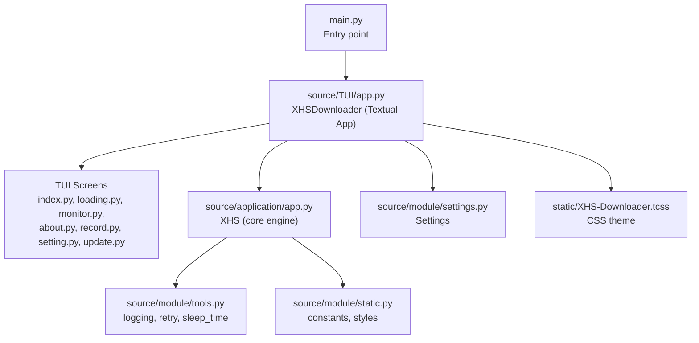

**Diagram sources**
- [main.py:12-15](file://main.py#L12-L15)
- [app.py:18-41](file://source/TUI/app.py#L18-L41)
- [index.py:27-45](file://source/TUI/index.py#L27-L45)
- [loading.py:11-23](file://source/TUI/loading.py#L11-L23)
- [monitor.py:18-37](file://source/TUI/monitor.py#L18-L37)
- [about.py:18-30](file://source/TUI/about.py#L18-L30)
- [record.py:13-21](file://source/TUI/record.py#L13-L21)
- [setting.py:13-26](file://source/TUI/setting.py#L13-L26)
- [update.py:16-29](file://source/TUI/update.py#L16-L29)
- [app.py:98-194](file://source/application/app.py#L98-L194)
- [settings.py:10-61](file://source/module/settings.py#L10-L61)
- [XHS-Downloader.tcss:1-53](file://static/XHS-Downloader.tcss#L1-L53)

**Section sources**
- [main.py:12-15](file://main.py#L12-L15)
- [app.py:18-41](file://source/TUI/app.py#L18-L41)
- [settings.py:10-61](file://source/module/settings.py#L10-L61)
- [static.py:1-73](file://source/module/static.py#L1-L73)

## Core Components
- XHSDownloader (Textual App): Central orchestrator that loads settings, initializes the XHS engine, installs and manages screens, and exposes actions for navigation and updates.
- XHS (Core Engine): Business logic for extracting links, downloading media, managing records, clipboard monitoring, and optional API/MCP servers.
- Settings: Persistent configuration loader/updater for runtime parameters.
- TUI Screens: Modular screens for index, loading, monitor, about, record, settings, and update, each with bindings and event handlers.

Key responsibilities:
- Application lifecycle: startup via async context manager, run loop, graceful shutdown.
- Screen management: install/uninstall screens dynamically during runtime (e.g., after settings changes).
- Integration: pass XHS instance to screens that require data extraction or monitoring.
- Theming: CSS loaded from static assets with Textual’s theming system.

**Section sources**
- [app.py:18-126](file://source/TUI/app.py#L18-L126)
- [app.py:98-194](file://source/application/app.py#L98-L194)
- [settings.py:10-124](file://source/module/settings.py#L10-L124)

## Architecture Overview
The TUI architecture follows a screen-centric design with asynchronous operations and explicit state transitions. The main application class extends Textual’s App and integrates with the XHS engine. Screens are installed at mount time and pushed/popped for navigation. Asynchronous tasks are scheduled with exclusive work to avoid UI contention.

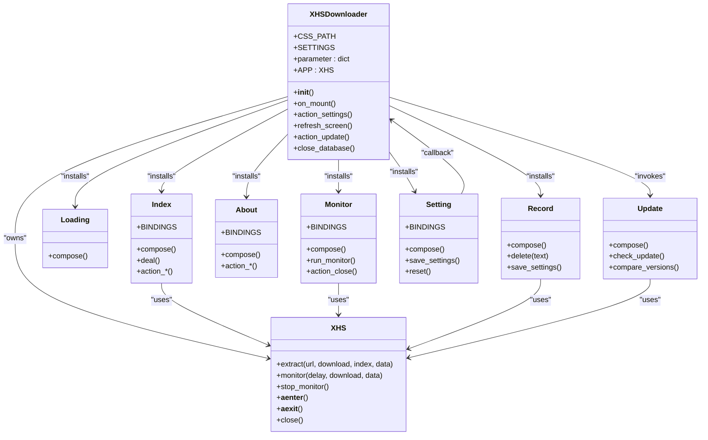

**Diagram sources**
- [app.py:18-126](file://source/TUI/app.py#L18-L126)
- [app.py:98-194](file://source/application/app.py#L98-L194)
- [index.py:27-153](file://source/TUI/index.py#L27-L153)
- [loading.py:11-23](file://source/TUI/loading.py#L11-L23)
- [monitor.py:18-59](file://source/TUI/monitor.py#L18-L59)
- [about.py:18-85](file://source/TUI/about.py#L18-L85)
- [record.py:13-57](file://source/TUI/record.py#L13-L57)
- [setting.py:13-271](file://source/TUI/setting.py#L13-L271)
- [update.py:16-93](file://source/TUI/update.py#L16-L93)

## Detailed Component Analysis

### Application Lifecycle and Startup Sequence
- Entry point initializes the TUI app as an async context manager and runs the event loop.
- The app mounts, sets the theme, installs all screens, and pushes the index screen.
- The XHS engine is initialized with parameters loaded from persistent settings.

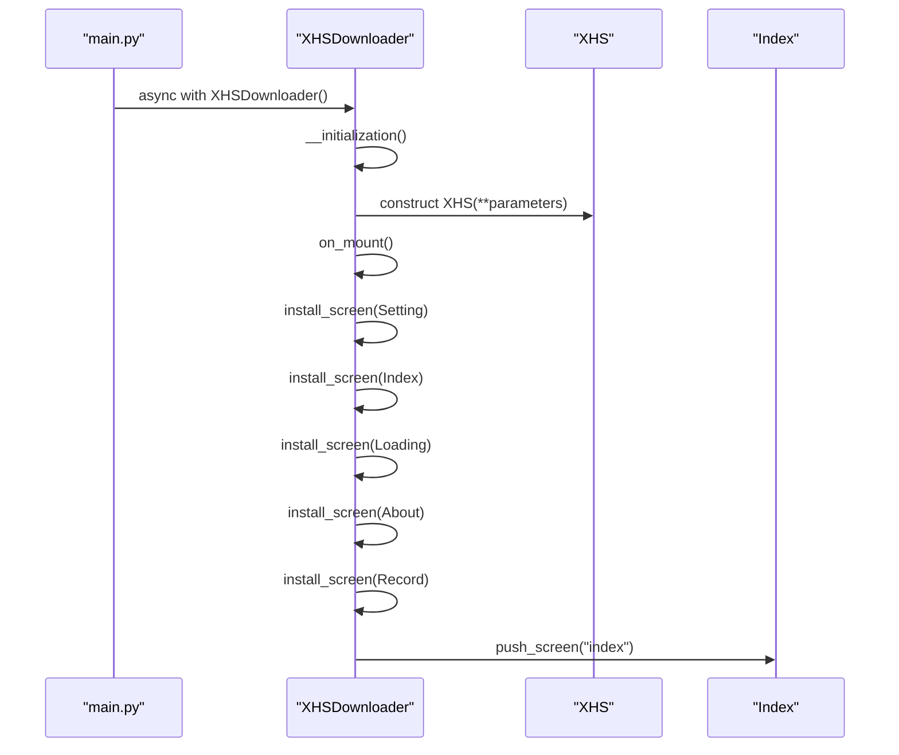

**Diagram sources**
- [main.py:12-15](file://main.py#L12-L15)
- [app.py:22-64](file://source/TUI/app.py#L22-L64)
- [app.py:35-41](file://source/TUI/app.py#L35-L41)
- [app.py:98-194](file://source/application/app.py#L98-L194)

**Section sources**
- [main.py:12-15](file://main.py#L12-L15)
- [app.py:22-64](file://source/TUI/app.py#L22-L64)
- [app.py:35-41](file://source/TUI/app.py#L35-L41)

### Shutdown Procedures
- On exit, the app exits the XHS engine context and closes database connections managed by the engine.
- The app also closes database connections directly when refreshing settings.

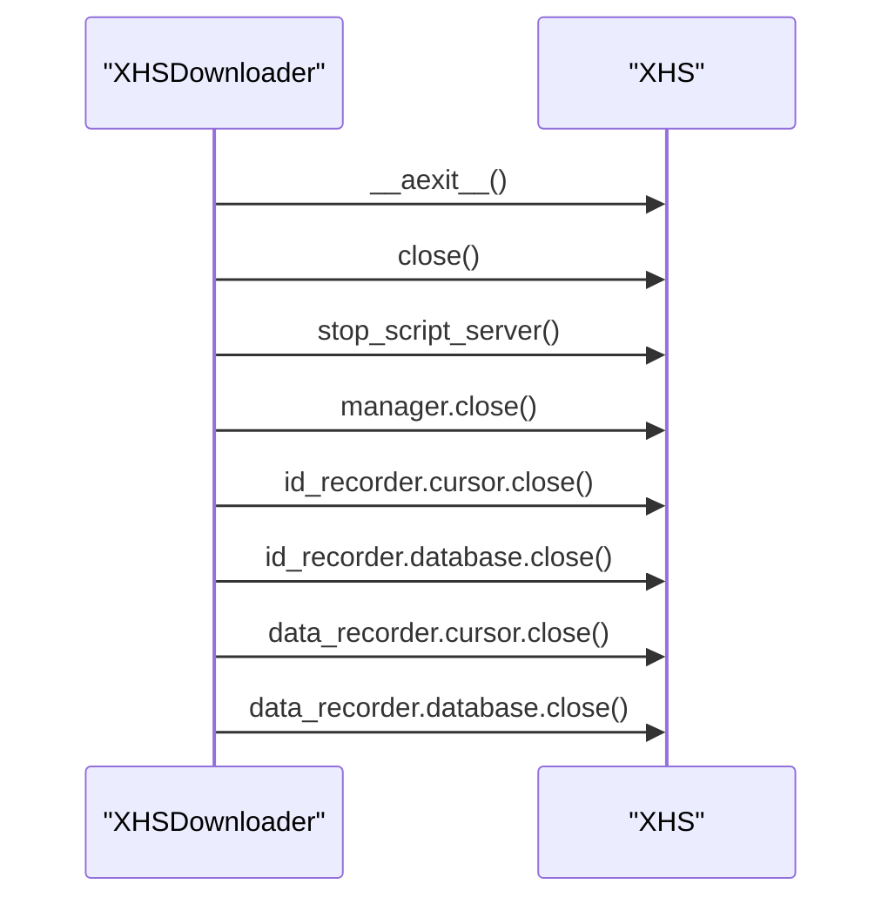

**Diagram sources**
- [app.py:121-126](file://source/TUI/app.py#L121-L126)
- [app.py:656-671](file://source/application/app.py#L656-L671)

**Section sources**
- [app.py:121-126](file://source/TUI/app.py#L121-L126)
- [app.py:656-671](file://source/application/app.py#L656-L671)

### Screen Management and Navigation Patterns
- Screens are installed at mount time and pushed onto the stack for navigation.
- Keyboard bindings trigger actions that either navigate to another screen or invoke engine operations.
- Modal screens (Loading, Update, Record) block interaction until dismissed.

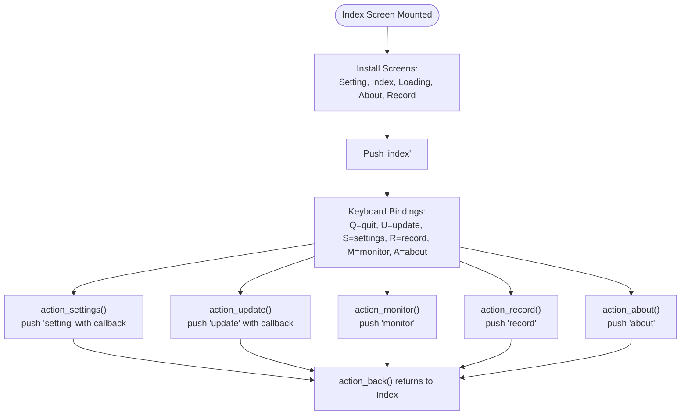

**Diagram sources**
- [app.py:42-64](file://source/TUI/app.py#L42-L64)
- [index.py:28-35](file://source/TUI/index.py#L28-L35)
- [index.py:138-153](file://source/TUI/index.py#L138-L153)
- [monitor.py:19-22](file://source/TUI/monitor.py#L19-L22)
- [record.py:13-21](file://source/TUI/record.py#L13-L21)
- [about.py:19-23](file://source/TUI/about.py#L19-L23)
- [setting.py:14-17](file://source/TUI/setting.py#L14-L17)

**Section sources**
- [app.py:42-64](file://source/TUI/app.py#L42-L64)
- [index.py:28-35](file://source/TUI/index.py#L28-L35)
- [index.py:138-153](file://source/TUI/index.py#L138-L153)
- [monitor.py:19-22](file://source/TUI/monitor.py#L19-L22)
- [record.py:13-21](file://source/TUI/record.py#L13-L21)
- [about.py:19-23](file://source/TUI/about.py#L19-L23)
- [setting.py:14-17](file://source/TUI/setting.py#L14-L17)

### Index Screen: Data Flow and Asynchronous Operations
- Accepts user input URLs, validates, and triggers extraction/download via the XHS engine.
- Uses a modal loading screen during long-running operations.
- Routes results to the terminal-like log widget and returns to the index screen.

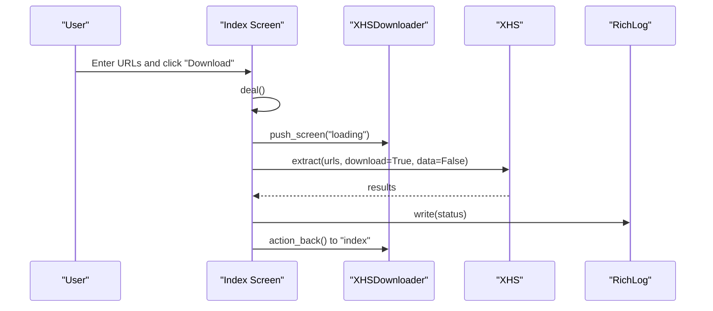

**Diagram sources**
- [index.py:87-131](file://source/TUI/index.py#L87-L131)
- [loading.py:11-23](file://source/TUI/loading.py#L11-L23)
- [app.py:113-119](file://source/TUI/app.py#L113-L119)
- [app.py:268-302](file://source/application/app.py#L268-L302)

**Section sources**
- [index.py:87-131](file://source/TUI/index.py#L87-L131)
- [app.py:113-119](file://source/TUI/app.py#L113-L119)
- [app.py:268-302](file://source/application/app.py#L268-L302)

### Monitor Screen: Clipboard Monitoring Workflow
- Starts a background task that monitors the clipboard and queues extraction jobs.
- Provides a button to stop monitoring and return to the previous screen.

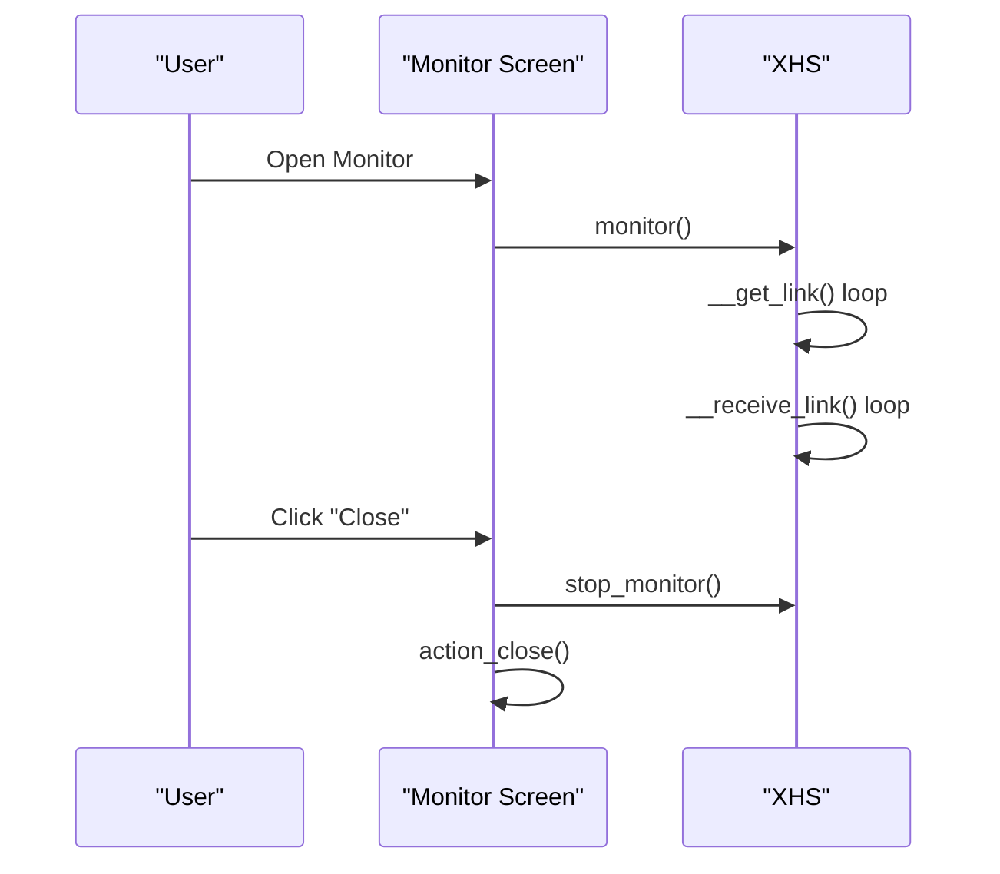

**Diagram sources**
- [monitor.py:42-54](file://source/TUI/monitor.py#L42-L54)
- [app.py:603-651](file://source/application/app.py#L603-L651)

**Section sources**
- [monitor.py:42-54](file://source/TUI/monitor.py#L42-L54)
- [app.py:603-651](file://source/application/app.py#L603-L651)

### Settings Screen: Dynamic Configuration and Refresh
- Presents a form of inputs and checkboxes mapped to engine parameters.
- Dismisses with updated parameters, triggering a refresh of screens and engine instances.

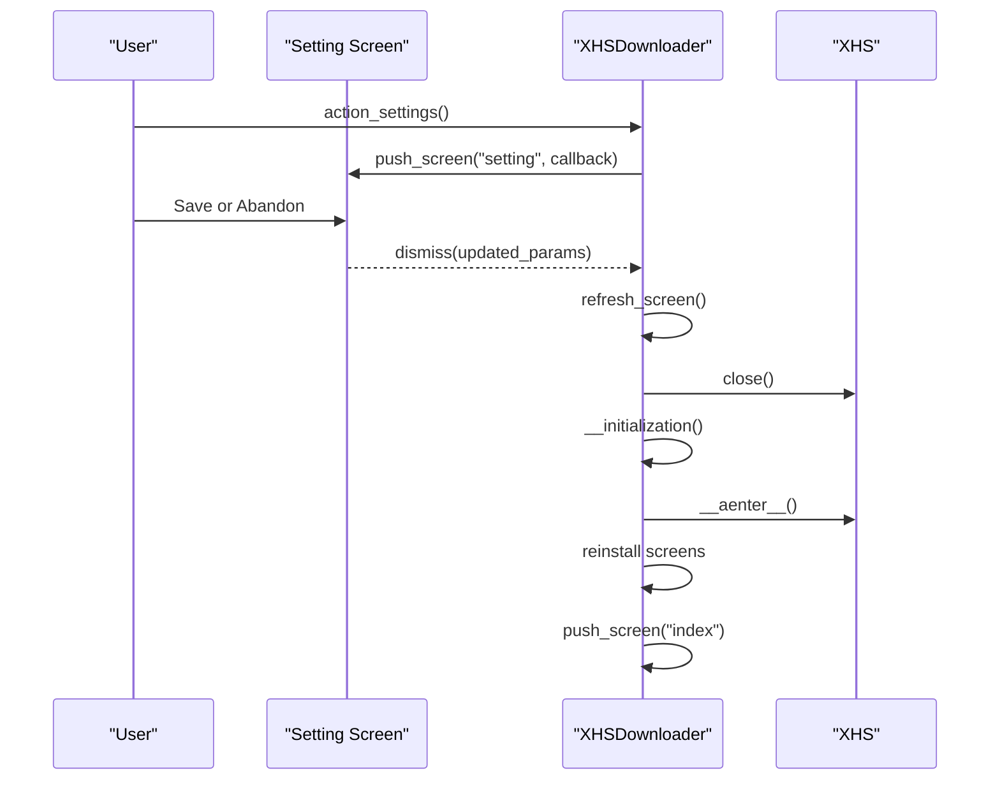

**Diagram sources**
- [setting.py:233-260](file://source/TUI/setting.py#L233-L260)
- [app.py:66-105](file://source/TUI/app.py#L66-L105)
- [app.py:35-41](file://source/TUI/app.py#L35-L41)
- [app.py:656-671](file://source/application/app.py#L656-L671)

**Section sources**
- [setting.py:233-260](file://source/TUI/setting.py#L233-L260)
- [app.py:66-105](file://source/TUI/app.py#L66-L105)
- [app.py:35-41](file://source/TUI/app.py#L35-L41)
- [app.py:656-671](file://source/application/app.py#L656-L671)

### Update Screen: Version Checking
- Opens a modal screen and checks the latest release URL.
- Compares versions and notifies the user with severity.

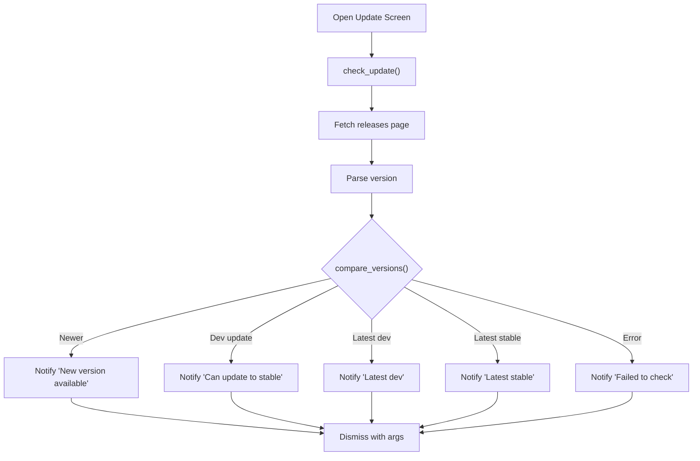

**Diagram sources**
- [update.py:31-77](file://source/TUI/update.py#L31-L77)
- [update.py:79-93](file://source/TUI/update.py#L79-L93)
- [app.py:113-119](file://source/TUI/app.py#L113-L119)

**Section sources**
- [update.py:31-77](file://source/TUI/update.py#L31-L77)
- [update.py:79-93](file://source/TUI/update.py#L79-L93)
- [app.py:113-119](file://source/TUI/app.py#L113-L119)

### CSS Theming System
- The app loads a single CSS file from static assets.
- Styles define layouts, spacing, colors, and modal grids.
- Color tokens integrate with Textual’s theme system.

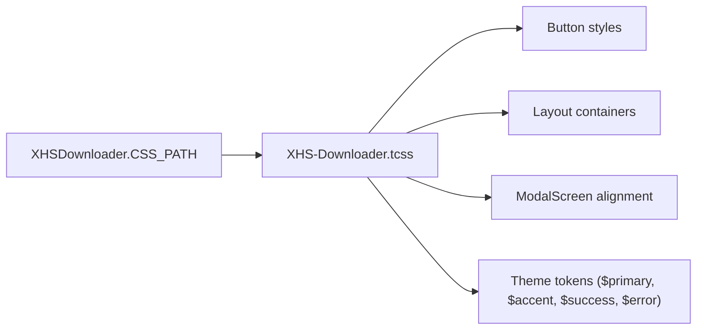

**Diagram sources**
- [app.py:19](file://source/TUI/app.py#L19)
- [XHS-Downloader.tcss:1-53](file://static/XHS-Downloader.tcss#L1-L53)

**Section sources**
- [app.py:19](file://source/TUI/app.py#L19)
- [XHS-Downloader.tcss:1-53](file://static/XHS-Downloader.tcss#L1-L53)

### Keyboard Navigation and User Interaction Patterns
- Each screen defines bindings for common actions (quit, settings, record, monitor, about).
- Buttons trigger events that call async work routines to keep the UI responsive.
- Modal screens capture focus until dismissed.

Examples of bindings and interactions:
- Index: Q, U, S, R, M, A.
- Monitor: Q, C.
- About: Q, U, B.
- Record: Enter, Close.
- Setting: Q, B.

**Section sources**
- [index.py:28-35](file://source/TUI/index.py#L28-L35)
- [monitor.py:19-22](file://source/TUI/monitor.py#L19-L22)
- [about.py:19-23](file://source/TUI/about.py#L19-L23)
- [record.py:13-21](file://source/TUI/record.py#L13-L21)
- [setting.py:14-17](file://source/TUI/setting.py#L14-L17)

### Relationship Between TUI and Business Logic
- The XHS engine encapsulates all extraction, download, and recording logic.
- TUI screens pass user inputs to the engine and render results to a log widget.
- The engine supports asynchronous operations and optional API/MCP servers.

**Section sources**
- [app.py:98-194](file://source/application/app.py#L98-L194)
- [index.py:87-131](file://source/TUI/index.py#L87-L131)
- [monitor.py:42-54](file://source/TUI/monitor.py#L42-L54)
- [record.py:40-52](file://source/TUI/record.py#L40-L52)
- [update.py:31-77](file://source/TUI/update.py#L31-L77)

## Dependency Analysis
- XHSDownloader depends on Settings for parameters and on XHS for business operations.
- XHS depends on module tools for logging and utilities, and on static constants for styles and paths.
- TUI screens depend on XHS for operations and on Textual widgets for UI composition.

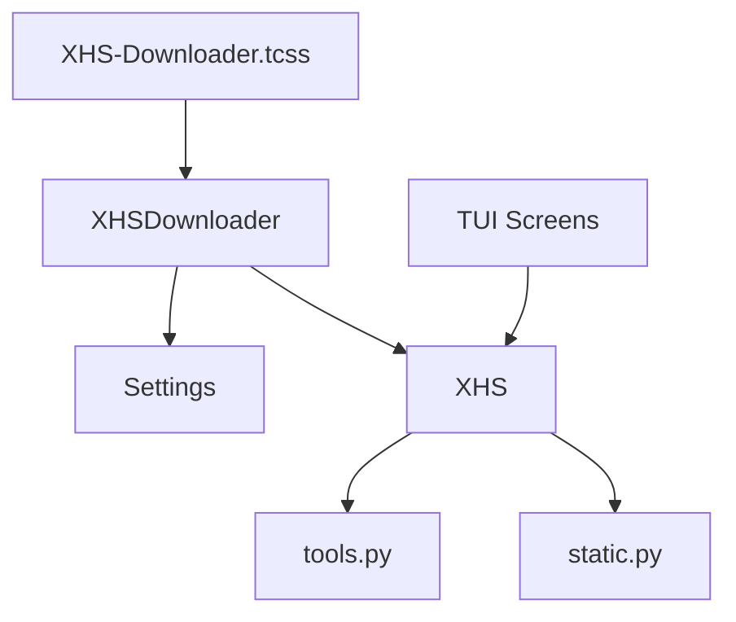

**Diagram sources**
- [app.py:18-41](file://source/TUI/app.py#L18-L41)
- [app.py:98-194](file://source/application/app.py#L98-L194)
- [settings.py:10-61](file://source/module/settings.py#L10-L61)
- [tools.py:42-52](file://source/module/tools.py#L42-L52)
- [static.py:1-73](file://source/module/static.py#L1-L73)
- [XHS-Downloader.tcss:1-53](file://static/XHS-Downloader.tcss#L1-L53)

**Section sources**
- [app.py:18-41](file://source/TUI/app.py#L18-L41)
- [app.py:98-194](file://source/application/app.py#L98-L194)
- [settings.py:10-61](file://source/module/settings.py#L10-L61)
- [tools.py:42-52](file://source/module/tools.py#L42-L52)
- [static.py:1-73](file://source/module/static.py#L1-L73)
- [XHS-Downloader.tcss:1-53](file://static/XHS-Downloader.tcss#L1-L53)

## Performance Considerations
- Asynchronous work: Long-running operations (extraction, monitoring, update checks) are wrapped in exclusive work to prevent UI blocking.
- Queue-based processing: The engine uses an asyncio queue for clipboard monitoring to batch and process links efficiently.
- Logging integration: Rich text logging avoids heavy DOM updates by writing to a single log widget.
- Resource cleanup: Explicitly closing database cursors and connections prevents resource leaks during refresh or shutdown.
- Memory management: Reinstalling screens and reinitializing the engine ensures clean state after settings changes.

[No sources needed since this section provides general guidance]

## Troubleshooting Guide
- Settings refresh fails to apply: Trigger the settings screen and save again; the app will close and reopen database connections and reinstall screens.
- Update check fails: The update screen reports failure and dismisses with an error notification.
- Monitor does not stop: Use the close binding or button to stop monitoring and return to the index screen.
- Database connection errors: The app attempts to close cursor and database connections explicitly during refresh and shutdown.

**Section sources**
- [app.py:66-105](file://source/TUI/app.py#L66-L105)
- [update.py:68-73](file://source/TUI/update.py#L68-L73)
- [monitor.py:52-58](file://source/TUI/monitor.py#L52-L58)
- [app.py:121-126](file://source/TUI/app.py#L121-L126)

## Conclusion
The TUI interface is a modular, screen-based application built on Textual that integrates tightly with the XHS core engine. It provides a responsive, keyboard-driven experience with clear navigation, robust asynchronous operations, and a cohesive theming system. The lifecycle is well-defined from startup to shutdown, with explicit state transitions and resource cleanup. Users can configure settings dynamically, monitor clipboard activity, and manage download records, all while the engine handles the heavy lifting of data extraction and downloads.