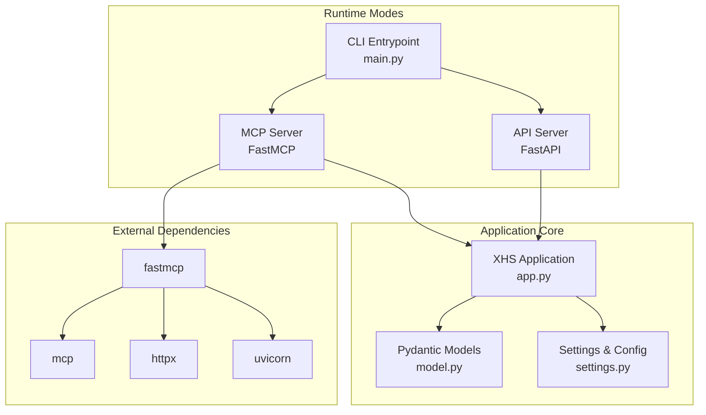
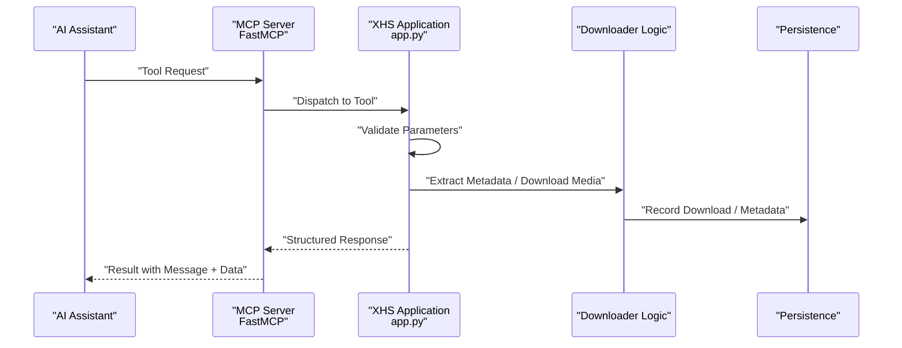
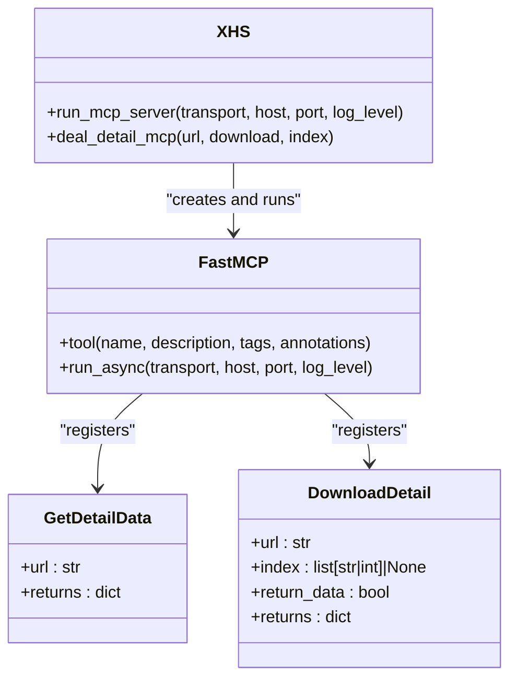
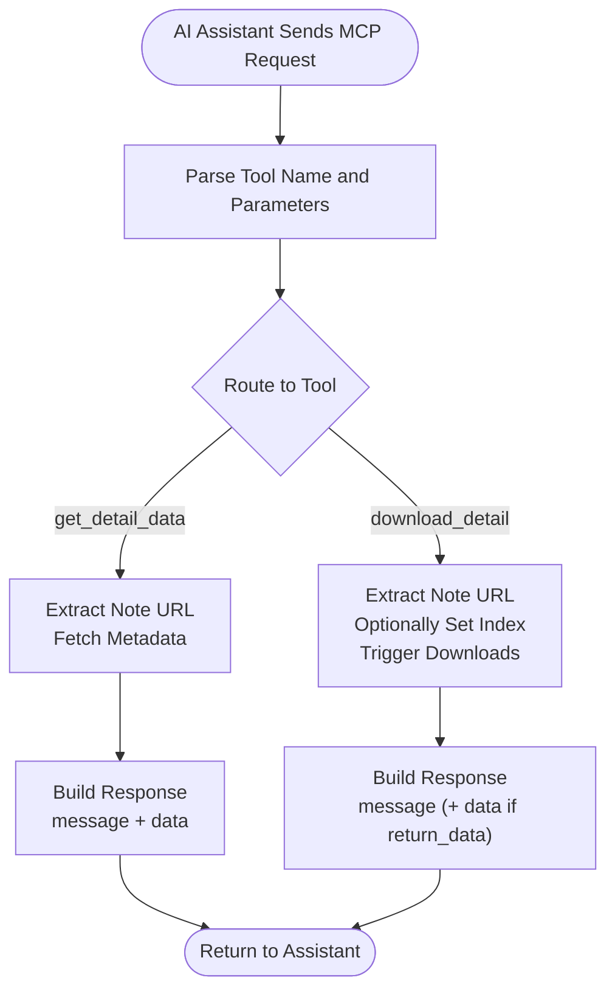
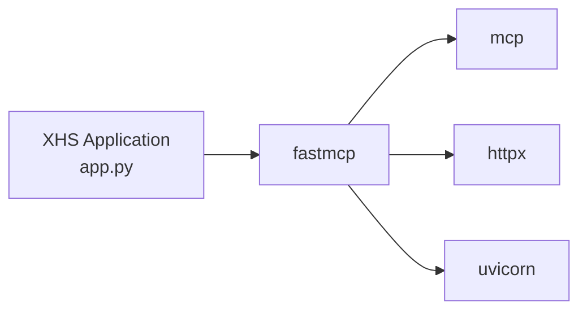

# MCP Integration

<cite>
**Referenced Files in This Document**
- [README.md](file://README.md)
- [README_EN.md](file://README_EN.md)
- [main.py](file://main.py)
- [app.py](file://source/application/app.py)
- [model.py](file://source/module/model.py)
- [settings.py](file://source/module/settings.py)
- [requirements.txt](file://requirements.txt)
- [uv.lock](file://uv.lock)
</cite>

## Table of Contents
1. [Introduction](#introduction)
2. [Project Structure](#project-structure)
3. [Core Components](#core-components)
4. [Architecture Overview](#architecture-overview)
5. [Detailed Component Analysis](#detailed-component-analysis)
6. [Dependency Analysis](#dependency-analysis)
7. [Performance Considerations](#performance-considerations)
8. [Security and Access Control](#security-and-access-control)
9. [Practical Integration Examples](#practical-integration-examples)
10. [Extending MCP Functionality](#extending-mcp-functionality)
11. [Troubleshooting Guide](#troubleshooting-guide)
12. [Conclusion](#conclusion)

## Introduction
This document explains the Model Context Protocol (MCP) integration for AI assistant communication in XHS-Downloader. It covers the MCP protocol specification, how XHS-Downloader implements the protocol, available tools, parameter schemas, response formats, integration workflows, security considerations, and practical examples for configuration and invocation.

## Project Structure
XHS-Downloader exposes an MCP server alongside API and TUI modes. The MCP server is implemented using the FastMCP library and provides two tools:
- get_detail_data: Retrieve RedNote/XiaoHongShu notes metadata without downloading files
- download_detail: Download media files for a given note, optionally returning metadata

Key implementation locations:
- MCP server entrypoint and routing: [app.py](file://source/application/app.py)
- Command-line entrypoints: [main.py](file://main.py)
- Tool parameter/response models: [model.py](file://source/module/model.py)
- Configuration and runtime settings: [settings.py](file://source/module/settings.py)
- Dependencies: [requirements.txt](file://requirements.txt), [uv.lock](file://uv.lock)

**Diagram sources**
- [main.py:30-42](file://main.py#L30-L42)
- [app.py:758-917](file://source/application/app.py#L758-L917)
- [model.py:4-17](file://source/module/model.py#L4-L17)
- [settings.py:10-124](file://source/module/settings.py#L10-L124)
- [requirements.txt:13-29](file://requirements.txt#L13-L29)
- [uv.lock:487-513](file://uv.lock#L487-L513)

**Section sources**
- [README.md:216-240](file://README.md#L216-L240)
- [README_EN.md:220-240](file://README_EN.md#L220-L240)
- [main.py:30-42](file://main.py#L30-L42)
- [app.py:758-917](file://source/application/app.py#L758-L917)

## Core Components
- MCP Server: Built with FastMCP, exposing two tools with clear instructions and annotations.
- Tools:
  - get_detail_data: Returns metadata for a note without downloading media.
  - download_detail: Downloads media files, optionally returning metadata.
- Parameter and Response Models: Pydantic models define structured inputs and outputs.
- Configuration: Settings file controls runtime behavior and optional features.

Key implementation references:
- MCP server creation and tool registration: [app.py:758-917](file://source/application/app.py#L758-L917)
- Tool signatures and annotations: [app.py:796-910](file://source/application/app.py#L796-L910)
- Parameter/response models: [model.py:4-17](file://source/module/model.py#L4-L17)
- Settings defaults and compatibility: [settings.py:10-124](file://source/module/settings.py#L10-L124)

**Section sources**
- [app.py:758-917](file://source/application/app.py#L758-L917)
- [model.py:4-17](file://source/module/model.py#L4-L17)
- [settings.py:10-124](file://source/module/settings.py#L10-L124)

## Architecture Overview
The MCP server integrates with the XHS application core to provide AI assistant-friendly tooling. The flow is:
- AI assistant sends MCP requests to the MCP endpoint
- FastMCP routes requests to registered tools
- Tools delegate to XHS application logic
- XHS extracts note metadata and/or triggers downloads
- Responses are returned to the AI assistant

**Diagram sources**
- [app.py:796-910](file://source/application/app.py#L796-L910)
- [app.py:919-940](file://source/application/app.py#L919-L940)

**Section sources**
- [app.py:758-917](file://source/application/app.py#L758-L917)

## Detailed Component Analysis

### MCP Server Implementation
- Transport: Streamable HTTP transport is configured by default.
- Instructions: Comprehensive instructions describe supported URL formats and tool behaviors.
- Tools:
  - get_detail_data: Reads a note URL and returns metadata.
  - download_detail: Accepts optional index and return_data parameters; returns either metadata or a completion message.

Implementation highlights:
- Tool registration and annotations: [app.py:796-910](file://source/application/app.py#L796-L910)
- Execution wrapper: [app.py:919-940](file://source/application/app.py#L919-L940)

**Diagram sources**
- [app.py:758-917](file://source/application/app.py#L758-L917)

**Section sources**
- [app.py:758-917](file://source/application/app.py#L758-L917)

### Tool Definitions and Parameter Schemas

#### get_detail_data
- Purpose: Retrieve note metadata without downloading media.
- Parameters:
  - url: str (required)
- Returns:
  - message: str
  - data: dict (metadata)

References:
- Tool definition and description: [app.py:796-835](file://source/application/app.py#L796-L835)
- Response shape: [app.py:824-835](file://source/application/app.py#L824-L835)

#### download_detail
- Purpose: Download media files for a note; optionally return metadata.
- Parameters:
  - url: str (required)
  - index: list[str|int]|None (optional)
  - return_data: bool (optional, default False)
- Returns:
  - message: str
  - data: dict|None (metadata if return_data is True, otherwise None)

References:
- Tool definition and description: [app.py:837-910](file://source/application/app.py#L837-L910)
- Response logic: [app.py:889-910](file://source/application/app.py#L889-L910)

#### Parameter and Response Models
- ExtractParams: Shared parameter model used by API mode; similar structure applies to MCP tool parameters.
- ExtractData: Standardized response model with message, params, and data.

References:
- [model.py:4-17](file://source/module/model.py#L4-L17)

**Section sources**
- [app.py:796-910](file://source/application/app.py#L796-L910)
- [model.py:4-17](file://source/module/model.py#L4-L17)

### Integration Workflow
End-to-end flow from AI assistant request to processed response:

**Diagram sources**
- [app.py:796-910](file://source/application/app.py#L796-L910)
- [app.py:919-940](file://source/application/app.py#L919-L940)

**Section sources**
- [app.py:796-910](file://source/application/app.py#L796-L910)

## Dependency Analysis
External libraries powering MCP integration:
- fastmcp: Provides MCP server framework and tool registration
- mcp: Core MCP protocol implementation
- httpx: HTTP client for network operations
- uvicorn: ASGI server for HTTP transport

**Diagram sources**
- [requirements.txt:13-29](file://requirements.txt#L13-L29)
- [uv.lock:487-513](file://uv.lock#L487-L513)

**Section sources**
- [requirements.txt:13-29](file://requirements.txt#L13-L29)
- [uv.lock:487-513](file://uv.lock#L487-L513)

## Performance Considerations
- Request throttling: The project includes a built-in request delay mechanism to avoid high-frequency requests that could impact platform servers.
- Chunked downloads: The downloader uses configurable chunk sizes for efficient streaming.
- Asynchronous processing: FastMCP and internal async operations minimize blocking.

Recommendations:
- Tune chunk size and concurrency based on network conditions.
- Use the skip-download logic to avoid redundant processing.
- Monitor logs for rate-limiting signals and adjust delays accordingly.

**Section sources**
- [README.md](file://README.md#L243)
- [README_EN.md](file://README_EN.md#L247)

## Security and Access Control
- Authentication: No explicit authentication or authorization is enforced by the MCP server in the current implementation.
- Transport: Streamable HTTP transport is used; ensure secure deployment behind firewalls or reverse proxies.
- Input validation: Tools validate URLs and parameters; malformed inputs return appropriate messages.
- Privacy: Avoid embedding sensitive credentials in tool parameters; rely on configuration files for secrets.

Best practices:
- Deploy behind HTTPS and firewall rules.
- Restrict access to trusted networks.
- Review logs for suspicious activity.
- Keep dependencies updated to mitigate known vulnerabilities.

**Section sources**
- [app.py:765-794](file://source/application/app.py#L765-L794)
- [app.py:919-940](file://source/application/app.py#L919-L940)

## Practical Integration Examples

### Starting the MCP Server
- Command-line mode:
  - Start MCP server: `python main.py mcp`
  - Stop with Ctrl+C

References:
- [README.md:216-220](file://README.md#L216-L220)
- [README_EN.md:220-224](file://README_EN.md#L220-L224)
- [main.py:55-57](file://main.py#L55-L57)

### MCP Endpoint and Configuration
- MCP URL: http://127.0.0.1:5556/mcp/
- Configuration examples and invocation screenshots are provided in the documentation.

References:
- [README.md:223-236](file://README.md#L223-L236)
- [README_EN.md:227-240](file://README_EN.md#L227-L240)

### Tool Invocation Patterns
- Retrieve metadata:
  - Tool: get_detail_data
  - Parameters: url
  - Response: message + data (metadata)

- Download files with optional metadata:
  - Tool: download_detail
  - Parameters: url, index (optional), return_data (optional)
  - Response: message (+ data if return_data is True)

References:
- [app.py:796-910](file://source/application/app.py#L796-L910)

### Relationship to Underlying XHS Functionality
- Both tools route through the shared note extraction and download pipeline.
- download_detail can optionally return metadata when return_data is True.
- The underlying XHS application handles URL extraction, metadata parsing, and media downloads.

References:
- [app.py:919-940](file://source/application/app.py#L919-L940)

## Extending MCP Functionality
To add new tools:
1. Define tool signature with FastMCP decorator in the XHS application class.
2. Implement handler logic delegating to XHS core methods.
3. Return standardized response with message and data fields.
4. Add appropriate annotations and tags for discoverability.

Example pattern:
- Register tool: [app.py:796-835](file://source/application/app.py#L796-L835)
- Handler wrapper: [app.py:919-940](file://source/application/app.py#L919-L940)

Integration with different AI assistant platforms:
- Ensure the platform supports MCP and can reach http://127.0.0.1:5556/mcp/
- Configure transport and authentication per platform requirements
- Use the standardized parameter/response schemas for compatibility

**Section sources**
- [app.py:796-910](file://source/application/app.py#L796-L910)
- [app.py:919-940](file://source/application/app.py#L919-L940)

## Troubleshooting Guide
Common issues and resolutions:
- Server not reachable:
  - Verify MCP URL and port binding
  - Confirm firewall and network configuration
- Tool execution errors:
  - Check URL format and accessibility
  - Validate index parameter for image sequences
- Rate limiting or timeouts:
  - Adjust request delay settings
  - Reduce concurrent requests
- Authentication concerns:
  - No built-in auth; deploy securely and restrict access

Operational tips:
- Use the provided Docker run commands for MCP mode
- Review logs for detailed error messages
- Test with simple requests before complex workflows

**Section sources**
- [README.md:114-126](file://README.md#L114-L126)
- [README_EN.md:114-127](file://README_EN.md#L114-L127)

## Conclusion
XHS-Downloader’s MCP integration provides a streamlined interface for AI assistants to retrieve note metadata and download media files. The implementation leverages FastMCP for robust tooling, standardized parameter/response models for reliability, and a clear separation between tool orchestration and core XHS functionality. With proper deployment and configuration, it enables flexible automation and integration across diverse AI assistant platforms.