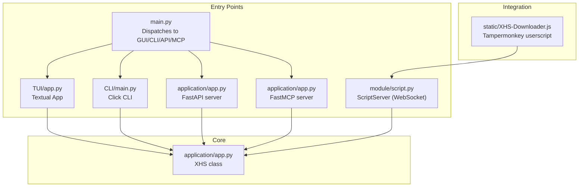
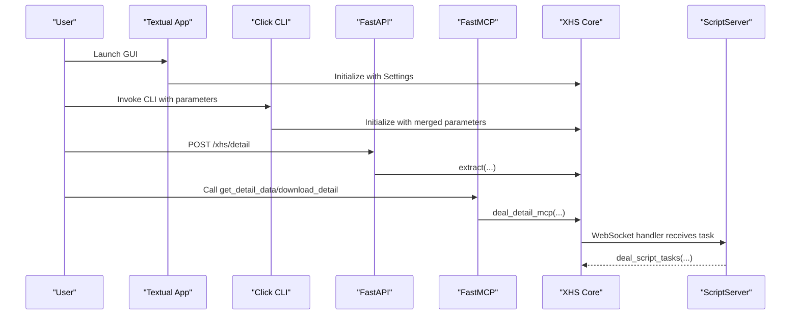
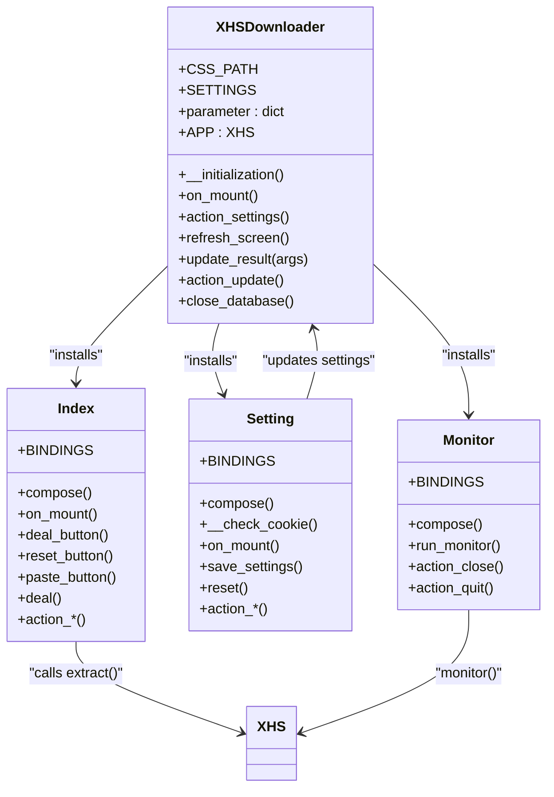
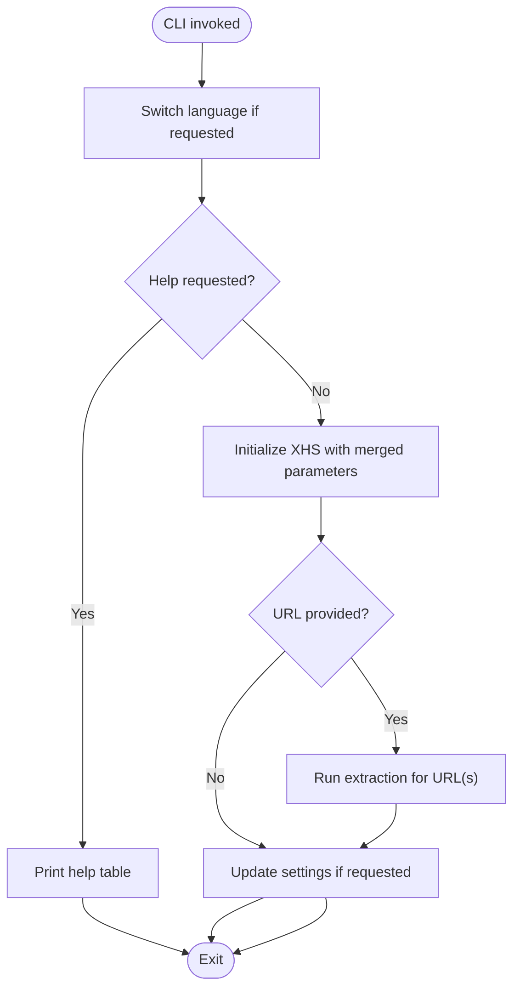
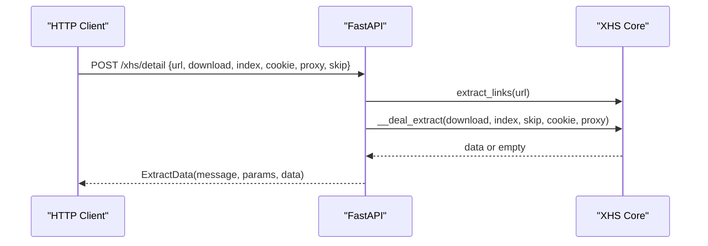
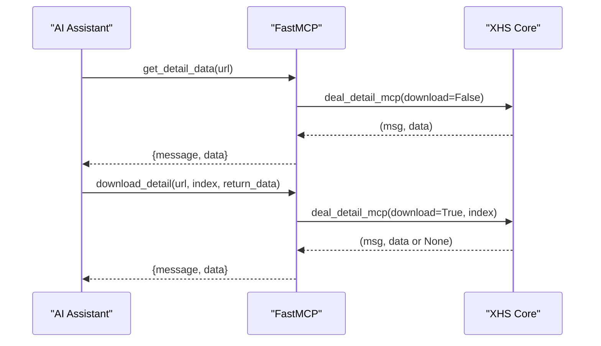
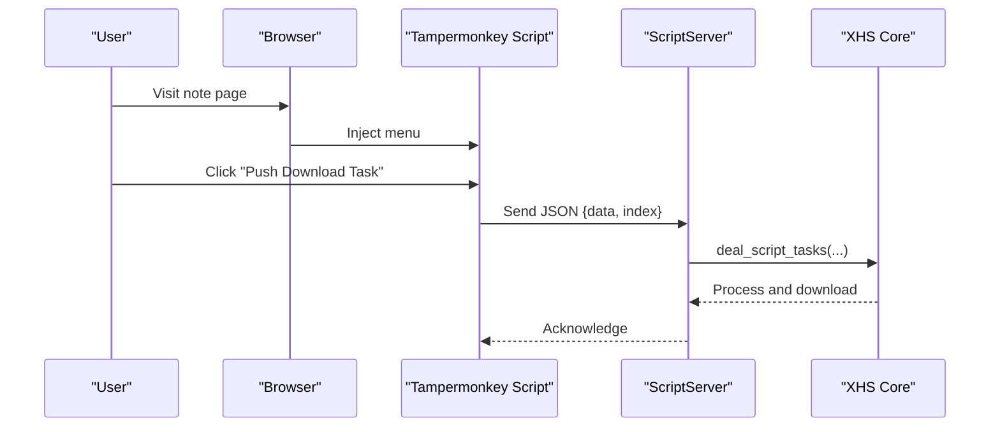
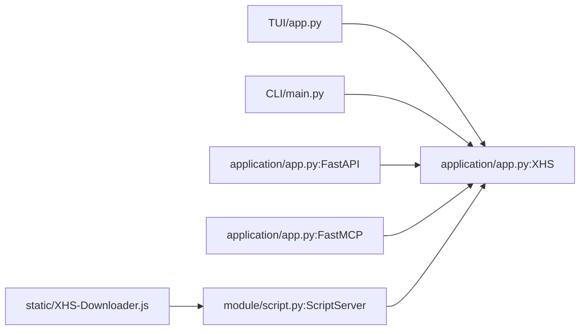

# User Interfaces

<cite>
**Referenced Files in This Document**
- [main.py](file://main.py)
- [CLI/main.py](file://source/CLI/main.py)
- [TUI/app.py](file://source/TUI/app.py)
- [TUI/index.py](file://source/TUI/index.py)
- [TUI/setting.py](file://source/TUI/setting.py)
- [TUI/monitor.py](file://source/TUI/monitor.py)
- [application/app.py](file://source/application/app.py)
- [module/settings.py](file://source/module/settings.py)
- [module/script.py](file://source/module/script.py)
- [expansion/browser.py](file://source/expansion/browser.py)
- [XHS-Downloader.js](file://static/XHS-Downloader.js)
- [README.md](file://README.md)
- [README_EN.md](file://README_EN.md)
- [example.py](file://example.py)
</cite>

## Table of Contents
1. [Introduction](#introduction)
2. [Project Structure](#project-structure)
3. [Core Components](#core-components)
4. [Architecture Overview](#architecture-overview)
5. [Detailed Component Analysis](#detailed-component-analysis)
6. [Dependency Analysis](#dependency-analysis)
7. [Performance Considerations](#performance-considerations)
8. [Troubleshooting Guide](#troubleshooting-guide)
9. [Conclusion](#conclusion)
10. [Appendices](#appendices)

## Introduction
This document explains the four user interfaces of XHS-Downloader and how they share the same core XHS class functionality. It covers:
- Desktop GUI (Textual)
- Command-line interface (Click)
- API server (FastAPI)
- MCP integration (FastMCP)
- Browser user script integration
It also provides usage patterns, parameter specifications, navigation, configuration, integration capabilities, and comparative guidance for choosing the right interface.

## Project Structure
XHS-Downloader exposes a unified core in the application module, with four distinct entry points:
- Desktop GUI: Textual screens and actions
- CLI: Click-based command-line interface
- API server: FastAPI routes
- MCP server: FastMCP tools
- Browser user script: Tampermonkey userscript that communicates with a WebSocket server embedded in the core

**Diagram sources**
- [main.py:45-60](file://main.py#L45-L60)
- [CLI/main.py:354-371](file://source/CLI/main.py#L354-L371)
- [TUI/app.py:18-126](file://source/TUI/app.py#L18-L126)
- [application/app.py:685-917](file://source/application/app.py#L685-L917)
- [module/script.py:10-47](file://source/module/script.py#L10-L47)
- [XHS-Downloader.js:305-428](file://static/XHS-Downloader.js#L305-L428)

**Section sources**
- [main.py:45-60](file://main.py#L45-L60)
- [CLI/main.py:354-371](file://source/CLI/main.py#L354-L371)
- [TUI/app.py:18-126](file://source/TUI/app.py#L18-L126)
- [application/app.py:685-917](file://source/application/app.py#L685-L917)
- [module/script.py:10-47](file://source/module/script.py#L10-L47)
- [XHS-Downloader.js:305-428](file://static/XHS-Downloader.js#L305-L428)

## Core Components
The central XHS class encapsulates all extraction, download, and orchestration logic. It exposes:
- High-level extraction APIs for single or multiple URLs
- CLI-specific extraction helpers
- API route handlers
- MCP tool handlers
- Script server for browser userscript integration
- Clipboard monitoring and queue-driven processing
- Configuration via Settings and Manager

Key responsibilities:
- URL normalization and link extraction
- HTML parsing and data extraction
- Image/video link resolution
- Download orchestration with retry and chunking
- Recording downloads and metadata
- Script server lifecycle and task handling

**Section sources**
- [application/app.py:98-194](file://source/application/app.py#L98-L194)
- [application/app.py:268-357](file://source/application/app.py#L268-L357)
- [application/app.py:685-757](file://source/application/app.py#L685-L757)
- [application/app.py:758-917](file://source/application/app.py#L758-L917)
- [module/script.py:10-47](file://source/module/script.py#L10-L47)

## Architecture Overview
All interfaces share the same XHS core. They differ only in presentation and invocation:
- GUI (Textual): Interactive screens, settings, and monitoring
- CLI: Command-line arguments and parameter merging
- API: HTTP endpoints for extraction and download
- MCP: Tools callable by AI assistants via MCP protocol
- Browser user script: Pushes tasks to a WebSocket server embedded in XHS

**Diagram sources**
- [TUI/app.py:35-126](file://source/TUI/app.py#L35-L126)
- [CLI/main.py:39-111](file://source/CLI/main.py#L39-L111)
- [application/app.py:685-757](file://source/application/app.py#L685-L757)
- [application/app.py:758-917](file://source/application/app.py#L758-L917)
- [module/script.py:22-26](file://source/module/script.py#L22-L26)

## Detailed Component Analysis

### Desktop GUI (Textual)
The GUI is a Textual application with multiple screens:
- Index screen: Enter URLs, paste from clipboard, download, open monitor
- Settings screen: Edit runtime parameters and save to settings.json
- Monitor screen: Clipboard monitoring mode
- About and Record screens

Navigation and actions:
- Global bindings: Quit, Update, Settings, Record, Monitor, About
- Input validation and feedback via RichLog
- Asynchronous work to avoid blocking the UI

**Diagram sources**
- [TUI/app.py:18-126](file://source/TUI/app.py#L18-L126)
- [TUI/index.py:27-153](file://source/TUI/index.py#L27-L153)
- [TUI/setting.py:13-271](file://source/TUI/setting.py#L13-L271)
- [TUI/monitor.py:18-59](file://source/TUI/monitor.py#L18-L59)

Usage patterns:
- Enter one or more URLs (space-separated)
- Paste from clipboard
- Download selected images by index (for image posts)
- Toggle settings and refresh to reload configuration
- Enable clipboard monitoring to auto-process links

Configuration options:
- Work path, folder name, name format
- User-Agent, Cookie, Proxy
- Timeout, chunk size, max retry
- Record data, folder mode, author archive
- Image/video/live download toggles
- Write mtime, language, script server

**Section sources**
- [TUI/app.py:18-126](file://source/TUI/app.py#L18-L126)
- [TUI/index.py:27-153](file://source/TUI/index.py#L27-L153)
- [TUI/setting.py:13-271](file://source/TUI/setting.py#L13-L271)
- [TUI/monitor.py:18-59](file://source/TUI/monitor.py#L18-L59)
- [module/settings.py:10-124](file://source/module/settings.py#L10-L124)

### Command-Line Interface (Click)
The CLI uses Click decorators to define options and a main function that:
- Switches language
- Prints help tables
- Initializes XHS with merged parameters
- Executes extraction for provided URLs

Parameters specification:
- URL(s), index selection, work path, folder name, name format
- User-Agent, Cookie, Proxy
- Timeout, chunk size, max retry
- Record data, image/video/live download, folder mode, author archive
- Write mtime, language, settings file, update settings flag
- Version and help flags

Usage patterns:
- Single URL extraction with optional index list
- Batch URLs with index selection per URL
- Merge CLI flags with settings.json
- Update settings.json after execution

**Diagram sources**
- [CLI/main.py:39-111](file://source/CLI/main.py#L39-L111)
- [CLI/main.py:354-371](file://source/CLI/main.py#L354-L371)

**Section sources**
- [CLI/main.py:39-111](file://source/CLI/main.py#L39-L111)
- [CLI/main.py:224-371](file://source/CLI/main.py#L224-L371)
- [module/settings.py:52-92](file://source/module/settings.py#L52-L92)

### API Server (FastAPI)
The API server exposes:
- GET /: Redirect to repository
- POST /xhs/detail: Extract data and optionally download files

Endpoints and parameters:
- url: Required, single note URL
- download: Optional, whether to download files
- index: Optional, list of image indices for image posts
- cookie: Optional, override cookie
- proxy: Optional, override proxy
- skip: Optional, skip records

Behavior:
- Validates and extracts links
- Delegates to core extraction logic
- Returns structured response with message, parameters, and data

**Diagram sources**
- [application/app.py:706-757](file://source/application/app.py#L706-L757)

**Section sources**
- [application/app.py:685-757](file://source/application/app.py#L685-L757)
- [README_EN.md:143-220](file://README_EN.md#L143-L220)

### MCP Integration (FastMCP)
The MCP server defines two tools:
- get_detail_data: Retrieve note info without downloading
- download_detail: Download files, optionally returning data

Parameters:
- get_detail_data: url (required)
- download_detail: url (required), index (optional), return_data (optional)

Behavior:
- Validates and extracts links
- Optionally downloads and returns data based on flags

**Diagram sources**
- [application/app.py:796-917](file://source/application/app.py#L796-L917)

**Section sources**
- [application/app.py:758-917](file://source/application/app.py#L758-L917)
- [README_EN.md:225-240](file://README_EN.md#L225-L240)

### Browser User Script Integration
The userscript adds a menu to the RedNote website:
- Extracts note links from various pages
- Downloads videos or images (with optional ZIP packaging)
- Can push tasks to a WebSocket server (ScriptServer) running inside the core

Key features:
- Auto-scroll disabled by default (with configurable count)
- Image selection mode for multi-image posts
- Packaging downloads into ZIP when multiple images
- Script server toggle and URL configuration
- Language switching

**Diagram sources**
- [XHS-Downloader.js:509-561](file://static/XHS-Downloader.js#L509-L561)
- [module/script.py:22-26](file://source/module/script.py#L22-L26)
- [application/app.py:508-537](file://source/application/app.py#L508-L537)

**Section sources**
- [XHS-Downloader.js:305-428](file://static/XHS-Downloader.js#L305-L428)
- [XHS-Downloader.js:509-561](file://static/XHS-Downloader.js#L509-L561)
- [module/script.py:10-47](file://source/module/script.py#L10-L47)
- [application/app.py:942-987](file://source/application/app.py#L942-L987)

## Dependency Analysis
Interfaces depend on the shared XHS core. The core depends on:
- Manager for configuration and resource management
- Recorder modules for download and data persistence
- Html/Image/Video modules for extraction
- Converter for transforming HTML to structured data
- ScriptServer for browser integration

**Diagram sources**
- [TUI/app.py:35-126](file://source/TUI/app.py#L35-L126)
- [CLI/main.py:39-111](file://source/CLI/main.py#L39-L111)
- [application/app.py:685-917](file://source/application/app.py#L685-L917)
- [module/script.py:10-47](file://source/module/script.py#L10-L47)
- [XHS-Downloader.js:305-428](file://static/XHS-Downloader.js#L305-L428)

**Section sources**
- [application/app.py:98-194](file://source/application/app.py#L98-L194)
- [module/script.py:10-47](file://source/module/script.py#L10-L47)

## Performance Considerations
- Chunk size and retry settings affect throughput and reliability
- Folder mode and author archive increase filesystem overhead
- Script server introduces minimal overhead; ensure host/port availability
- Clipboard monitoring runs concurrently; consider rate of incoming links
- API and MCP servers are event-driven; tune logging level for production

[No sources needed since this section provides general guidance]

## Troubleshooting Guide
Common issues and resolutions:
- Clipboard access: Ensure platform-specific clipboard utilities are installed (e.g., xclip/xsel on Linux)
- Script server connectivity: Verify script_server is enabled and WebSocket URL matches
- API/MCP server binding: Confirm host/port availability and firewall rules
- Cookie and UA: Set appropriate values for higher-quality video downloads
- Settings persistence: If GUI settings do not apply, edit settings.json directly

**Section sources**
- [README.md:351-360](file://README.md#L351-L360)
- [README_EN.md:355-361](file://README_EN.md#L355-L361)
- [module/settings.py:83-92](file://source/module/settings.py#L83-L92)

## Conclusion
XHS-Downloader’s four interfaces provide flexible ways to extract and download RedNote content:
- GUI for interactive workflows
- CLI for automation and scripting
- API for integrations and external tools
- MCP for AI assistant workflows
- Browser userscript for seamless web-to-desktop integration

They all rely on the same robust XHS core, ensuring consistent behavior and configuration across interfaces.

[No sources needed since this section summarizes without analyzing specific files]

## Appendices

### Comparative Analysis: Interface Strengths and Limitations
- Desktop GUI
  - Strengths: Intuitive, visual feedback, easy settings management, clipboard monitoring
  - Limitations: Requires desktop environment, less suited for headless automation
- Command-Line Interface
  - Strengths: Script-friendly, batch processing, parameterized workflows
  - Limitations: No visual feedback, requires familiarity with parameters
- API Server
  - Strengths: Integrates with external systems, standardized JSON interface
  - Limitations: Requires server hosting, network exposure considerations
- MCP Integration
  - Strengths: Natural language workflows, AI assistant compatibility
  - Limitations: Requires MCP client support, network configuration
- Browser User Script
  - Strengths: Seamless web-to-desktop, one-click task pushing
  - Limitations: Requires Tampermonkey, script server must be running

[No sources needed since this section provides general guidance]

### Practical Examples: Common Workflows
- GUI workflow
  - Open GUI, paste note URL, click Download, optionally select image indices, review logs
- CLI workflow
  - Run CLI with --url and optional --index, optionally merge with --settings and --update_settings
- API workflow
  - POST to /xhs/detail with url and optional download/index/cookie/proxy/skip
- MCP workflow
  - Call get_detail_data or download_detail with url and optional parameters
- Browser user script workflow
  - Enable script server, enable script server in userscript, click Push Download Task on note page

**Section sources**
- [README.md:245-283](file://README.md#L245-L283)
- [README_EN.md:249-287](file://README_EN.md#L249-L287)
- [example.py:9-74](file://example.py#L9-L74)
- [example.py:77-91](file://example.py#L77-L91)